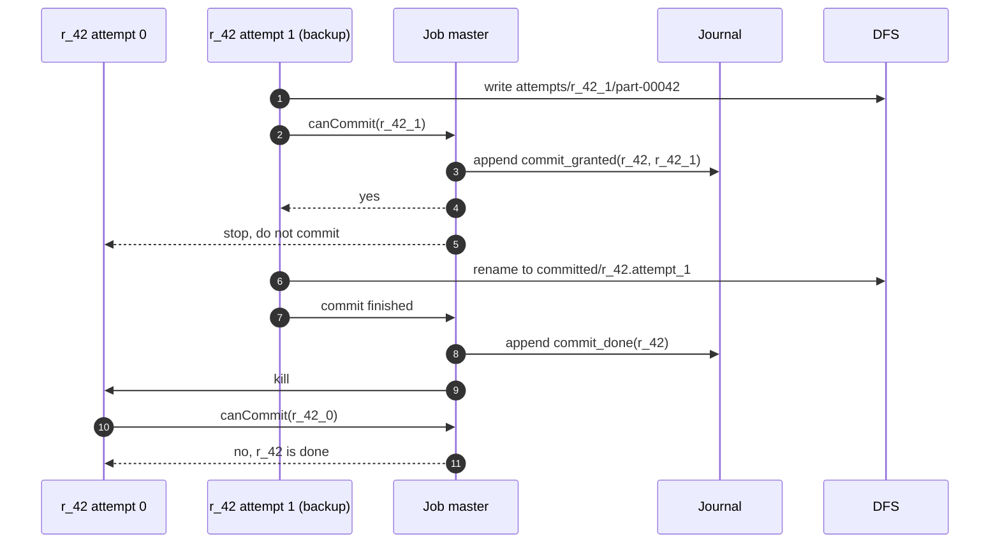
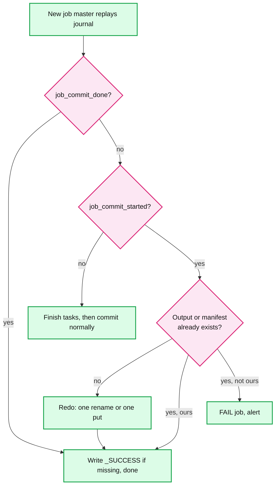

# Deep dive: output commit and exactly-once

> One-line answer: every attempt writes only to a path that names its `jm_attempt` and attempt id; the job master's `canCommit` gate journals `commit_granted` before it says yes to exactly one attempt per task, and `commit_done` after the task commit; job commit is one atomic step (one directory rename on HDFS, one conditional put of a job manifest or one table-log commit on an object store) that a replacement job master can safely redo; zombies are fenced by the journal lease and by committed paths named after the attempt, of which job commit takes only the `commit_done` one; counters count one attempt per task; and side effects outside the output stay the user's job.

Part of [`../solution.md`](../solution.md) §4.4, §5.4, §10.5. Sources: MapReduce ([OSDI 2004](https://static.googleusercontent.com/media/research.google.com/en//archive/mapreduce-osdi04.pdf) §3.3, §4.5, §4.9), [`mapred-default.xml`](https://hadoop.apache.org/docs/stable/hadoop-mapreduce-client/hadoop-mapreduce-client-core/mapred-default.xml) (committer algorithm text), [S3A committers](https://hadoop.apache.org/docs/stable/hadoop-aws/tools/hadoop-aws/committers.html), [manifest committer](https://hadoop.apache.org/docs/stable/hadoop-mapreduce-client/hadoop-mapreduce-client-core/manifest_committer.html), [MAPREDUCE-4815](https://issues.apache.org/jira/browse/MAPREDUCE-4815), [MAPREDUCE-7282](https://issues.apache.org/jira/browse/MAPREDUCE-7282), [Spark configuration](https://spark.apache.org/docs/latest/configuration.html). Related: [`../../../concepts/exactly-once.md`](../../../concepts/exactly-once.md), [`../../../concepts/leases-fencing-clocks.md`](../../../concepts/leases-fencing-clocks.md), [`../../delta-lake-transactions/`](../../delta-lake-transactions/), [`fault-tolerance-and-recovery.md`](fault-tolerance-and-recovery.md).

## 1. Where duplicates enter

| Source | Example | Removed by |
|---|---|---|
| Retry after a crash | `r_42_0` dies after writing 1 of 2 files | Attempt-scoped temp path, never committed |
| Backup task | `r_42_0` and `r_42_1` both finish | Gate grants one, the other is stopped |
| Zombie attempt | Node partitioned, attempt keeps writing | Gate refuses it, files never listed |
| Winner dies mid task commit | Yes granted, rename not done | `commit_granted` without `commit_done`: check, else re-run |
| Job master restart | Attempt 2 replays | Journal keeps commits, `jm_attempt` scopes paths |
| Zombie job master | Attempt 1 partitioned, still alive | Journal lease, then one-shot job commit |
| Crash mid job commit | Half the files moved | Job commit is one atomic step, redone from the journal |
| Same job resubmitted | Client retries with a new id | `output_path` must not exist; `request_id` at submit |
| Counters | Re-run map adds its counts again | One counter set per task, replaced not added |
| User side effects | `map` writes to an outside database | User's idempotency key (§8) |

## 2. The paper had no gate. We add one.

The paper renames each reduce's temp file to its final name: "If the same reduce task is executed on multiple machines, multiple rename calls will be executed for the same final output file. We rely on the atomic rename operation provided by the underlying file system to guarantee that the final file system state contains just the data produced by one execution." That works for **one file per task on a file system with atomic rename**. It fails for two cases we must support: a task with several output files (the paper: "We do not provide support for atomic two-phase commits of multiple output files produced by a single task", §4.5), and stores where rename is a copy. A gate makes "which attempt won" a decision recorded once, not a race settled by the file system.

## 3. The gate, step by step



- **Journal before yes.** If the master said yes and then died before journaling, its replacement would grant a second attempt. Two committed copies.
- **Kill losers only after `commit_done`.** If the winner dies mid-rename, a backup is still alive to win. The master checks whether `committed/r_42.attempt_1` exists. If not, it reopens the gate. **The committed path names the attempt** (`committed/r_42.attempt_1`). A granted attempt that "died" may only be partitioned and finish its rename after the gate reopened and another attempt committed. It lands in its own directory, and job commit takes only the directory journaled as `commit_done`. Without the attempt in the name, HDFS would move the late directory inside the winner's and double the partition.
- **Never preempt a COMMIT_PENDING or commit-granted attempt.** Killing it mid-rename forces the check-and-reopen path for nothing.
- **Work dirs carry `jm_attempt`.** All of this sits in a per-job staging dir `$parent/.$name-$job/`, with attempt work dirs scoped by `jm_attempt`, so a zombie of job master attempt 1 never writes where attempt 2 looks. **Map outputs need no gate.** The master keeps the first `mapDone` per task and ignores the rest (paper §3.3). Reducers fetch only the recorded attempt.

## 4. HDFS: v1, v2, and ours

| Step | v1 (Spark's choice) | v2 (Hadoop's code default) | Ours |
|---|---|---|---|
| Attempt writes | `$out/_temporary/$jm/_temporary/$attempt/` | Same | Staging dir `$parent/.$name-$job/`, work dir per `jm_attempt` and attempt |
| Task commit | Rename attempt dir to `_temporary/$jm/$task/`. One atomic op | Rename **each file** into `$out/`. Not atomic | Rename attempt dir to `committed/$task.$attempt`. Journal `commit_granted` before, `commit_done` after |
| Recovery (new `$jm`) | Rename `_temporary/$jm/$task/` to `_temporary/($jm + 1)/$task/` | Nothing to do | Nothing to move. Granted without done: check that attempt's dir, else re-run |
| Job commit | Move every task's files into `$out/`, one by one, then `_SUCCESS` | Delete `_temporary`, write `_SUCCESS` | Move each `commit_done` dir's files into `publish/` (one rename per task, redo skips moved ones), write `_JOB_ID`, then **one rename** of `publish/` to `$out`, which must not exist, then `_SUCCESS` |
| Crash mid job commit | Some parts visible, no `_SUCCESS` | Parts were visible since task commit | Nothing or everything at `$out` |

- **v1 is slow at the end.** `mapred-default.xml`: "If a job generates many files to commit then the commitJob method call at the end of the job can take minutes", single-threaded, after every task. That is MAPREDUCE-4815, "Speed up FileOutputCommitter#commitJob for many output files", fixed in 2.7.0, the release that introduced v2 [unverified link between the two].
- **v2 is fast and unsafe.** MAPREDUCE-7282, "MR v2 commit algorithm should be deprecated and not the default", explains why: v2 task commit moves files one by one, so a task commit that fails partway, followed by another attempt's commit, can leave the first attempt's files in the output, and a partitioned worker resuming its commit later can overwrite part of the winner's output. It was closed Won't Fix, so 2 is still the code default. Spark sets 1: "Note that 2 may cause a correctness issue like MAPREDUCE-7282."
- **Why ours ends in one rename.** HDFS renames a directory in one NameNode metadata operation, and it fails if `$out` exists: that is the fence against a second job master. `publish/` is assembled only from `commit_done` dirs, so stray zombie dirs in `committed/` never reach `$out` (~10k renames for the sort, seconds [estimate]). The staging dir must be a sibling of `$out` in the same namespace.

## 5. Object stores: rename is the problem

On S3 there is no rename. The S3A client "mimics `rename()` by copying files and then deleting the originals. This can fail partway through." Copy time is O(bytes): 10 GB per reduce partition, 100 TB for the sort. GCS object rename is also a copy [unverified]. ABFS with a hierarchical namespace renames atomically, but throttles.

| Committer | Task commit | Job commit | Visible early? | Atomic job commit? |
|---|---|---|---|---|
| S3A staging | Upload local files as **incomplete** multipart uploads, save the pending list to HDFS via v1 | Complete every pending upload | No | No, completes uploads one by one, reverts the done ones on failure |
| S3A magic | Writes under `__magic/` are redirected to the final key, left incomplete, `.pending` files saved | Load `.pendingset` files, complete uploads | No | No, same loop |
| Hadoop manifest committer (ABFS, GCS) | List the attempt dir, save a JSON task manifest. "No renaming takes place at this point" | Load manifests, create dirs, rename files in parallel, rate-limited | No | No, a crash leaves some files renamed |
| **Ours: job manifest** | Task manifest PUT, and the same file list in `commit_done` | **One conditional put** of `_manifest` listing every committed file | No, if readers use the manifest | **Yes** |

- S3 has been strongly consistent since December 2020: "Now that Amazon S3 is consistent, the Magic Committer can be safely used with any S3 bucket." Consistency is not atomicity. Conditional put: S3 `PutObject` with `If-None-Match: *` since Aug 2024, Azure `If-None-Match: *`, GCS `ifGenerationMatch=0` ([`../../delta-lake-transactions/deep-dives/transaction-log-and-commit-protocol.md`](../../delta-lake-transactions/deep-dives/transaction-log-and-commit-protocol.md)).
- **The reader contract is the catch.** Attempts write under `$out/_attempts/` with unique names, next to files from failed attempts and zombies. Input formats skip `_`-prefixed paths, so a legacy reader sees none of the garbage, and none of the data either (§9: 0 rows). So manifest commit is for manifest-aware readers, best as a **table-format commit** ([`../../delta-lake-transactions/`](../../delta-lake-transactions/)). Plain directory readers on S3 get the magic committer, whose files do not exist until job commit. A cleaner deletes unlisted files after 24 h.

## 6. Zombies and fencing

| Zombie | What it can still do | What stops it |
|---|---|---|
| Attempt the master declared lost | Write files under its own attempt path | Gate: `aid in lost` or task already done. Its paths are never listed |
| Granted attempt, partitioned | Rename late into `committed/r_42.attempt_1` | Not `commit_done`, so job commit never takes that dir |
| Partitioned job master attempt 1 | Answer its own attempts, try a job commit | Journal lease recovered by attempt 2: append fails, so no yes and no `job_commit_started`. Then one rename to a path that must not exist, or one conditional put |

The RM killing attempt 1's container is not a fence: a partitioned node agent cannot hear the kill. The journal lease is the fence that holds during a partition ([`../../../concepts/leases-fencing-clocks.md`](../../../concepts/leases-fencing-clocks.md)).

## 7. The job master dies during job commit



- "Ours" means the manifest equals the listing rebuilt from the journal, or `$out` carries this job's `_JOB_ID` marker. The job state stays `COMMITTING` across the restart (solution §4.1, `COMMITTING --> COMMITTING: master lost, redo`). Hadoop's MR application master, with v1's file-by-file job commit, has to be stricter: it writes commit marker files and fails the job if a previous attempt started a commit it cannot prove finished [unverified, `MRAppMaster`]. A one-step commit is what makes redo safe.

## 8. Counters and side effects

- **Counters.** Paper §4.9: the master "eliminates the effects of duplicate executions of the same map or reduce task to avoid double counting." Key them by `task_id`, one set per task, **replaced** when a lost map re-runs. Keyed by `attempt_id` and summed, a re-run map counts twice. Running attempts show as approximate.
- **Side effects.** Paper §4.5: "We rely on the application writer to make such side-effects atomic and idempotent." An upsert keyed by `(job_id, task_id, record_offset)`, never by attempt id, or a retry writes a new row. A table sink can carry a `txn(appId, version)` marker in the same commit ([`../../delta-lake-transactions/deep-dives/streaming-and-idempotent-writes.md`](../../delta-lake-transactions/deep-dives/streaming-and-idempotent-writes.md)).

## 9. Simulation: racing attempts, a zombie, a crash, two job master failures

Six reduce tasks, two files each, on an object store with no rename. One attempt crashes after its first file. A backup races one task. At step 3 one attempt loses its heartbeat and is replaced, but keeps running. The first attempt granted a commit is then partitioned before `commit_done`: the gate reopens, and its late `done` is refused. Attempt files go under `out/_attempts/`. At step 8 job master 1 is partitioned and job master 2 takes the journal lease. Job master 2 crashes right after its manifest put, job master 3 replays and finishes, then the zombie job master 1 tries to commit. "Straight to final" has no gate and no journal. 500 seeded interleavings each.

```python
"""Races, zombies, a crash, two job master failures: is the output one clean run?"""
import itertools, random
from collections import Counter
R, FILES, ROWS = 6, 2, 3
def rows(p, k): return [f"r{p}.{k}.{i}" for i in range(ROWS)]
EXPECTED = Counter(r for p in range(R) for k in range(FILES) for r in rows(p, k))
class Store:                                  # object store: no rename
    def __init__(s): s.objs = {}
    def put(s, key, val): s.objs[key] = val
    def put_if_absent(s, key, val): return s.objs.setdefault(key, val) is val  # If-None-Match
class Journal:                                # DFS file, one writer lease
    def __init__(s): s.epoch, s.recs = 0, []
    def take(s, epoch): s.epoch = epoch; return list(s.recs)
    def append(s, epoch, rec):                # lease lost: old job master is fenced
        return epoch == s.epoch and s.recs.append(rec) is None
class JobMaster:
    def __init__(s, epoch, journal, store):
        s.epoch, s.j, s.store, s.lost, s.granted = epoch, journal, store, set(), {}
        s.done = {t: f for kind, t, a, f in journal.take(epoch) if kind == "done"}
    def ok(s, ep, aid): return ep == s.epoch and aid not in s.lost
    def can_commit(s, task, aid, ep):         # journal commit_granted, then say yes
        if not s.ok(ep, aid) or task in s.done or task in s.granted: return False
        if not s.j.append(s.epoch, ("granted", task, aid, None)): return False
        s.granted[task] = aid; return True
    def commit_done(s, task, aid, files, ep): # only the attempt still holding the grant
        if not s.ok(ep, aid) or s.granted.get(task) != aid or task in s.done: return False
        if not s.j.append(s.epoch, ("done", task, aid, files)): return False
        s.done[task] = files; return True
    def reopen(s, task, aid):                 # granted attempt lost before done
        s.lost.add(aid); s.granted.pop(task, None)
    def job_commit(s):                        # one conditional put of the manifest
        listing = sorted(f for fs in s.done.values() for f in fs)
        if s.store.put_if_absent("out/_manifest", listing): return True
        return s.store.objs["out/_manifest"] == listing   # our journal already won
def attempt(store, task, aid, crash, prefix):
    files = []
    for k in range(FILES):                    # unique names under the attempt prefix
        files.append(f"{prefix}part-{task}-{k}-{aid}"); store.put(files[-1], rows(task, k))
        if crash: return                      # dies after its first file
        yield None
    if not (yield ("ask", task, aid, files)): return   # canCommit said no
    yield None                                # time between the yes and commit_done
    yield ("done", task, aid, files)
def run(gated, seed):
    rng, store, journal, ids = random.Random(seed), Store(), Journal(), itertools.count()
    jms, cur, counter, live, victim = {1: JobMaster(1, journal, store)}, 1, 0, [], None
    prefix = "out/_attempts/" if gated else "out/"   # _ hides files from input formats
    crash_t, backup_t = rng.sample(range(R), 2)
    def launch(t, ep, crash=False):           # entry: gen, task, aid, epoch, reply, crash
        aid = f"e{ep}a{next(ids)}"; live.append([attempt(store, t, aid, crash, prefix),
                                                 t, aid, ep, None, crash])
    for t in range(R): launch(t, 1, crash=(t == crash_t))
    launch(backup_t, 1)                       # speculative backup races the original
    for step in itertools.takewhile(lambda _: live, itertools.count()):
        if step == 3:                         # zombie: heartbeat lost, still running
            z = rng.choice(live); jms[1].lost.add(z[2]); launch(z[1], 1)
        if step == 8:                         # JM1 partitioned away, JM2 takes over
            cur, jms[2] = 2, JobMaster(2, journal, store)
            for t in range(R):                # no journal: JM2 must re-run everything
                if not gated or t not in jms[2].done: launch(t, 2)
        g = rng.choice(live)
        try: msg, g[4] = g[0].send(g[4]), None
        except StopIteration:                 # crashed, or told no
            live.remove(g)
            if g[5] and g[3] == cur and g[1] not in jms[cur].done: launch(g[1], cur)
            continue
        if msg is None: continue
        (kind, task, aid, files), jm = msg, jms[g[3]]
        if kind == "ask":
            g[4] = (not gated) or jm.can_commit(task, aid, g[3])
            if gated and g[4] and victim is None and g[3] == 1:   # winner partitioned
                victim = aid; jm.reopen(task, aid); launch(task, 1)
            continue
        live.remove(g)
        if not gated or jm.commit_done(task, aid, files, g[3]):
            counter += FILES * ROWS; jm.done[task] = files   # direct: first one wins
    globbed = Counter(r for f in store.objs if f.startswith("out/part-") for r in store.objs[f])
    if not gated: return globbed, globbed, counter    # readers glob out/part-*
    assert jms[2].job_commit()                # JM2 crashes right after this put...
    assert JobMaster(3, journal, store).job_commit()  # ...JM3 replays and finishes
    store.put("out/_SUCCESS", "")
    assert not jms[1].job_commit()            # zombie JM1 loses the conditional put
    read = store.objs["out/_manifest"]        # readers follow the manifest
    return Counter(r for f in read for r in store.objs[f]), globbed, counter
for gated in (False, True):
    out, globbed, counter = run(gated, seed=7)
    bad = sum(run(gated, s)[0] != EXPECTED for s in range(500))
    print(f"{'gate + manifest' if gated else 'straight to final'}: rows read {sum(out.values())}"
          f" (want 36), extra {sum((out - EXPECTED).values())}, counter {counter}, wrong in"
          f" {bad}/500 seeds, out/part-* glob sees {sum(globbed.values())} rows")
    if gated: assert bad == 0 and out == EXPECTED and counter == sum(EXPECTED.values())
```

Real output:

```
straight to final: rows read 81 (want 36), extra 45, counter 78, wrong in 500/500 seeds, out/part-* glob sees 81 rows
gate + manifest: rows read 36 (want 36), extra 0, counter 36, wrong in 0/500 seeds, out/part-* glob sees 0 rows
```

- **Straight to final** is wrong in every interleaving: the crash leaves a partial file, the backup and the zombie add copies, and job master 2, with no journal, re-runs every task. The records counter is wrong too (78). **Gate plus manifest** equals one clean run in 500 of 500, with an exact counter. Job master 3 sees the manifest already matches its journal and only writes `_SUCCESS`. The zombie job master loses the conditional put. In 186 of the 500 gated runs the reopen path fires.
- **The last column is the reader contract.** Straight to final, a glob of `out/part-*` sees 81 rows. With `_attempts/` it sees 0: safe, but only manifest readers get the data.

## 10. Trade-offs

| Decision | Option A | Option B | Chose | Why |
|---|---|---|---|---|
| Who decides the winner | File system rename race (paper) | Journaled gate | Gate | Works for multi-file tasks and stores without rename |
| HDFS job commit | v1 file-by-file move | One rename of a staging dir | One rename | Atomic and redoable. v1 is minutes and leaves partial output on a crash |
| Object store | S3A magic committer | Job manifest or table commit | Table commit for table readers, magic for directory readers | Only a conditional put is atomic. Plain readers cannot use a manifest |
| Source of the job manifest | Task manifest PUTs | File lists in `commit_done` records | Journal | A stray or zombie task manifest can never be included |
| Counters | Sum per attempt | One set per task, replaced | Per task | Re-run maps would double count |

## 11. Interview soundbite

"Duplicates come from retries, backups, zombies and restarts of the master itself. Each attempt writes to a private path with its attempt and master epoch in it. The master's canCommit says yes to one attempt per task, and it journals the grant before answering, then journals done after the rename. Job commit is one atomic step: one directory rename on HDFS, one conditional put of a manifest or a table commit on S3, so a new master can redo it from the journal. The old master is fenced by the journal lease, not by the RM, because a partitioned node never hears a kill. Counters are one per task. Side effects outside the output need the user's idempotency key."
