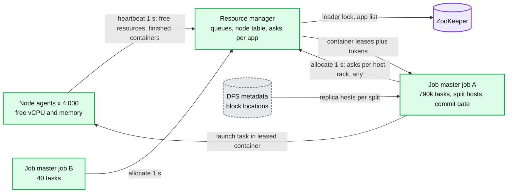
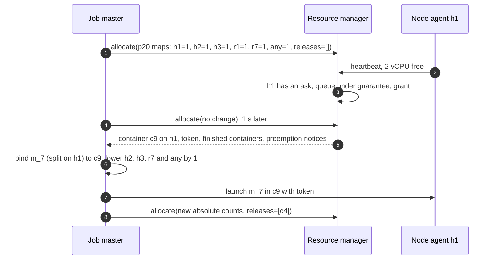
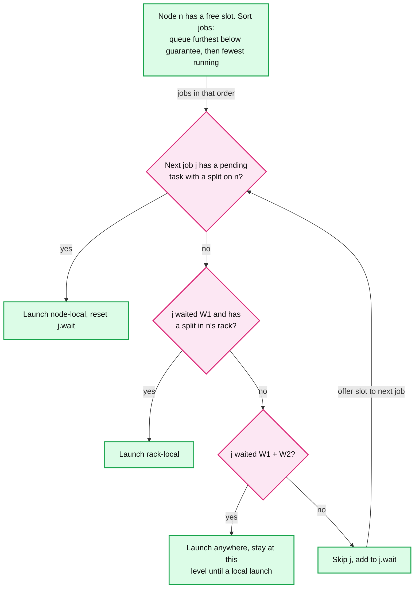
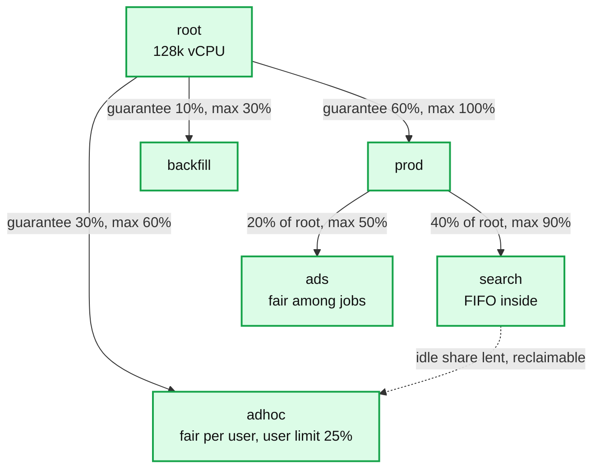

# Deep dive: scheduling, locality and multi-tenancy

> One-line answer: split the old JobTracker into a **resource manager (RM)** that only hands containers to queues and a **job master** per job that only schedules its own tasks; the RM places containers on each 1 s node heartbeat from **rolled-up asks (host, rack, any)**, **delay scheduling** buys ~100% node-local maps for well under 2 s of waiting, **hierarchical queues** with a guaranteed and a max share lend idle capacity and take it back by **preemption** after 45 s plus a 10 s grace (maps and young containers first), and **federation** is the 10x step.

Back to [`../solution.md`](../solution.md) §4.5, §5.5, §10.1. Related: [`../../cluster-manager/deep-dives/preemption-and-priority.md`](../../cluster-manager/deep-dives/preemption-and-priority.md), [`../../../concepts/zookeeper.md`](../../../concepts/zookeeper.md), [`../../../concepts/rate-limiting-and-load-shedding.md`](../../../concepts/rate-limiting-and-load-shedding.md).

## 1. Why Hadoop 1's JobTracker stopped at ~4,000 nodes

One process did admission control, node liveness, re-execution, speculation, the status web server, audit logs and authentication, "and many other functions; each of these limited its scalability" (YARN paper, SoCC 2013, appendix). What broke (§2.3, §4.1.1, §5.2):
- **Blast radius.** "A JobTracker failure caused an outage that would lose all the running jobs in a cluster and require users to manually recover their workflows."
- **Memory per job.** "The JobTracker needs to allocate tracking structures for every job it initializes ... it may delay allocating fallow cluster resources to jobs because the overhead of tracking them could overwhelm the JobTracker process." Machines sat idle because the master feared its own heap.
- **One lock.** "In Hadoop-1, each node could heartbeat only every 30-40 seconds in large clusters due to coarse-grained locking in the JobTracker." YARN node agents heartbeat every 1 to 3 s.
- **Typed slots.** "Fallow map capacity can't be used to spawn reduce tasks and vice versa." On a 2,500-node Yahoo! grid, YARN took CPU use from ~3.2 to ~6 busy cores of 16 per node, and jobs from ~77k to ~100k per day.
- **The ceiling.** "Yahoo! reported that they are not running clusters any bigger than 4000 nodes which used be the largest cluster's size before YARN." Our cluster is that size on purpose.

Root cause: one heap and one lock for **every task in the cluster**. Our 100 TB sort alone has ~790k tasks and 7.8 B (map, reduce) pairs, ~7.8 GB of sizes ([`../solution.md`](../solution.md) §2). Two of those would share one JobTracker heap with every other job.

## 2. The split: what each side holds



| | Resource manager (one active per cluster) | Job master (one per job, YARN's ApplicationMaster) |
|---|---|---|
| Holds | 4,000 node rows, ~50 queues [estimate], per app: asks rolled up per (priority, host or rack or any), running containers | Every task and attempt, split hosts, map output locations and sizes, speculation stats, commit gate, journal |
| Size | The sort's asks: at most 4,000 hosts + 100 racks + 1 "any" per priority, a few hundred KB | ~1 GB of compressed map statuses for the sort (§5.5) |
| Never sees | A task, a split, a partition, a commit | Other jobs, other queues |
| When it dies | No new containers for ~20 to 30 s, running work continues | One job, replays its journal |

The RM "is not responsible for coordinating application execution or task fault-tolerance" (YARN §3.2). Leases are **late binding**: "the process spawned is not bound to the request, but to the lease". The RM promises "a container on h1". The job master picks the task.

## 3. The allocate protocol



- **The ask** (YARN §3.2): number of containers, resources each (1 vCPU, 3 GB), locality at "node-level, rack-level, and global" granularity, and a priority inside the app. 780k map asks roll up into ~4,100 rows per priority, which the paper calls "a lossy compression of the application preferences". The RM cannot tell that h1 and h2 hold the same split, so the job master lowers the other k - 1 hosts after it binds a task (§3.3).
- **Heartbeat-driven both ways.** Node agents report every 1 s (`yarn.resourcemanager.nodemanagers.heartbeat-interval-ms` = 1000) and the scheduler places asks on that node. Job masters call `allocate` every ~1 s, which also proves they are alive (AM expiry: YARN default 600 s, we set 60 s).
- **Priorities.** Lower number is served first. Hadoop's MR job master uses 5 for re-runs of failed maps, 10 for reduces and 20 for maps [unverified here]. We add 40 for speculative copies [estimate].
- **Releases** return containers the job no longer needs. A container granted but never launched is reclaimed after `rm.container-allocation.expiry-interval-ms`. The default 600000 (10 min) leaks capacity when a job master dies between grant and launch, so we set 60000.
- **Consistency.** The RM's view of free resources is up to 1 s stale (eventual). Grants are strong: one active RM writes the node table. Asks are absolute counts, not deltas, so a resent `allocate` is harmless [unverified for YARN internals].

## 4. Locality math: 3 replicas on 4,000 nodes

| Job | Splits K | P(random node holds one of its splits) = 1 - (1 - 3/4000)^K | P(node's rack holds one), 2 of 100 racks per block [unverified HDFS default] |
|---|---|---|---|
| One split | 1 | 0.075% | 2% |
| 5 GB small job | 40 | 3.0% | 55% |
| 50 GB | 400 | 26% | ~100% |
| 100 TB sort | 780k | ~100% | ~100% |

- **Big jobs get locality for free.** They have data on every node. Greedy "pick a local task" works.
- **Small jobs are the problem.** A 40-split job at the head of a strict fair queue gets the next free slot, which holds its data 3% of the time. Facebook saw exactly this: jobs with 1 to 25 maps got "5% node locality and 59% rack locality", and 58% of their jobs were in that bin (delay scheduling paper §3.3.1).
- **What a remote read costs here.** 10 PB/day is 116 GB/s. The spine is 100 racks x 400 Gbps = ~5 TB/s. Even 100% remote reads use ~2% of it on average, ~23% at a 10x peak. So the cost is latency and NIC contention with the shuffle, not a hard wall. Facebook measured local tasks "up to 2x faster".

## 5. Delay scheduling

The insight (EuroSys 2010, §3.4): the first slot offered to a job probably has no data for it, but "tasks finish so quickly that some slot with data for it will free up in the next few seconds". So skip the job a few times instead of running it remote.



- **How long to wait.** The paper's bound (§3.5): target locality λ for a job with N tasks on M nodes with R replicas needs D ≥ -(M/R) ln((1-λ)N / (1+(1-λ)N)) skipped offers. λ = 0.95, N = 20, R = 3 gives D ≥ 0.23M. The wait is D x T/S (S slots, task length T).
- **Our cluster.** D ≈ 920 offers. 128k slots and ~60 s average maps [estimate] free ~2,100 slots/s, so the wait is **~0.43 s**, under half a heartbeat round. For the 40-split job D ≈ 540, ~0.25 s. Under 1% of a task. With the sort's 15 s maps it is ~0.11 s.
- **Facebook's numbers.** Small-jobs test (W1 = W2 = 15 s): 3-map jobs from 2% to 75% node-local, 10-map from 37% to 99%, 100-map from 84% to 94%; throughput up 1.2x, 1.7x, 1.3x. A 1 s delay took 4-map jobs from 5% to 68% and 5 s gave "nearly perfect locality". With 50 concurrent jobs (sticky slots test), locality went from 27% to 99 to 100% and throughput 2x.
- **Two levels.** W1 for node-local, then W2 for rack-local. "D2 can be much smaller than D1": 100 racks, not 4,000 nodes.
- **It runs in the RM**, because only the RM sees which node just freed up. A job master cannot wait for a container it was never offered. It only matches its pending splits to the containers it was granted. YARN's schedulers count missed scheduling opportunities per app (Capacity Scheduler `node-locality-delay`, Fair Scheduler locality thresholds, defaults [unverified]).
- **Push back.** Waiting buys nothing when slots free slowly, e.g. a node full of 5-minute reducers. So after D skips the job runs remote until it lands a local task again. On an object store every read is remote: set D = 0 ([`../solution.md`](../solution.md) §10.11).

## 6. Hierarchical queues: guarantee, max, borrowing



- **Guarantee** is what a queue gets back when it has work. **Max** caps borrowing, so one 500 TB job cannot take 100%. On each heartbeat the scheduler (YARN default: Capacity Scheduler) walks the tree by lowest used ÷ guaranteed, then picks a job, then a task by locality.
- **Elastic borrowing** is where utilization comes from: idle guarantee goes to any queue with pending asks, up to its max. Each 10 points of utilization is ~$2.8 M/year here ([`../solution.md`](../solution.md) §8).
- **Admission limits inside a queue:** max running jobs, per-user limit, and a cap on job master containers (~10% of the queue). Without that cap, 5,000 tiny submits fill a 2% queue with job masters that wait forever for task containers.

## 7. Preemption: taking a guarantee back

1. **Trigger.** A queue below its guarantee for **45 s** with asks it would accept. Asks it is skipping for locality do not count.
2. **Victims.** Only queues above their guarantee, never pushed below it, in proportion to overuse (YARN's `ProportionalCapacityPreemptionPolicy`, off by default: `scheduler.monitor.enable` = false).
3. **Ask first.** The RM puts a preemption notice in the victim job master's `allocate` response. It may yield "tasks that made only little progress" (YARN §3.2). If it does not, "the RM can, after waiting for a certain amount of time ... forcibly terminate containers". We wait a 10 s grace.
4. **Kill order.** Never job master containers, never an attempt in COMMIT_PENDING or already granted commit (its backups stay alive until `commit_done`). Then **maps before reduces**, **youngest first**. A preempted attempt ends KILLED, not FAILED: it does not count toward `maxattempts` = 4, and a stream it breaks is not a fetch failure. HFS also killed the youngest: "we pick the most recently launched tasks in pools that are above their fair share to minimize wasted work".

**Why maps first.** Killing 5,000 maps 30 s into ~60 s tasks wastes ~42 container-hours, ~$1 [estimate]. A sort reducer preempted mid-fetch re-fetches its whole 10 GB partition (~1 to 2 min). For 5,000 of them that is 50 TB through the shuffle service again, the design's bottleneck ([`shuffle-pull-push-and-remote.md`](shuffle-pull-push-and-remote.md)).

**When it matters.** YARN's 10-machine test (queues A 80%, B 20%): with preemption A got its 80% "in a few seconds", without it "about 20 minutes" (§5.3). Here, a lender running ~60 s maps frees ~1,700 of 102k containers per second, so Ads' 20% (25.6k) returns in ~15 s with no kill. Against ~5 min reducers, churn returns 20% in ~75 s. That is the case preemption is for: it fires at 45 s, kills at 55 s, and Ads is whole by ~60 s.

## 8. Fairness inside a queue

- **FIFO** for a production queue whose job order matters. **Fair among jobs** for ad-hoc work, so a 40-map query runs beside a 400k-map job (fewest-running-first already favours the new job). **Fair per user, then per job**, so one user with 50 jobs does not get 50 shares. HFS used this two-level shape.
- **More than one resource.** With one shape (1 vCPU, 3 GB) fairness on vCPU is enough. Mixed shapes, such as a 1 vCPU, 12 GB reducer beside 3 GB maps, need dominant resource fairness (DRF): rank each job by its largest share of any resource. See [`../../cluster-manager/solution.md`](../../cluster-manager/solution.md).

## 9. Map and reduce deadlock, and slowstart

YARN §2.3: "the separation between map and reduce capacity prevents deadlocks". Fungible containers bring it back. A job at its queue's max starts reducers at 5% of maps (`reduce.slowstart.completedmaps` = 0.05). Reducers fill its containers, each waiting for map output. A node dies, its maps must re-run, and no container is free. Reducers wait for maps, maps wait for reducers.

The fix is in the **job master**, because only it knows its reducers wait on its own maps. It kills **its own** reducers, youngest first, when map asks go unmet with no headroom (`mapreduce.job.reducer.preempt.delay.sec` = 0, immediate), and unconditionally after `reducer.unconditional-preempt.delay.sec` = 300 s.

Slowstart is the cost knob. In the 100 TB sort, 10,000 early reducers would hold 10,000 of 32,000 slots through the ~6 min map phase. Maps then run on 22,000 slots and take ~8.7 min. Hence [`../solution.md`](../solution.md) §10.2: 0.8 for big jobs, 0.05 for small ones.

## 10. Small-job fast paths

90% of jobs are ≤ 50 GB. A 5 GB job is 40 tasks of ~15 to 60 s, but each launch costs ~1 to 2 s [estimate] plus a job master start.
- **Uber mode** runs the job inside the job master's container. Hadoop's limits: `ubertask.maxmaps` = 9, `maxreduces` = 1, `maxbytes` = one DFS block, off by default. It covers jobs up to one block of input and saves 10 launches plus every `allocate` round trip. The 40-split, 5 GB job is too big for it and uses container reuse.
- **Container reuse** keeps a warm container for many short tasks, as Tez and Spark executors do. It cuts launches, the RM's real load. Cost: tasks share a JVM, so one leaky task slows the next.
- **Route to a SQL engine** under ~10 s of work ([`../../query-engine/`](../../query-engine/)). Yahoo!'s 2,500-node grid: many tiny apps, using "about 3.5 machines worth of CPU".

## 11. Control-plane load and the 10x step

- **Node heartbeats:** 4,000/s, 250 µs each for one scheduler thread. **Launches:** ~2,700/s at peak ([`../solution.md`](../solution.md) §2). Ceiling if every slot ran the sort's 15 s tasks: 128k ÷ 15 = ~8,500/s. At ~60 s average maps (~43% of vCPU, ~65 to 75% with reduces) the daily average is ~900/s. **`allocate`:** ~1,000 job masters x 1/s [estimate], mostly no change.
- **Is one RM enough?** HFS scheduled 3,200 tasks/s in 2010 on a 2.66 GHz Core 2 Duo for a mock 2,500-node cluster. A modern core is several times faster [estimate] and the RM does no per-task work. Yes. Levers first: container reuse (5 to 10x fewer launches [estimate]) and a 2 s heartbeat (half the load, ~1 s more placement latency).
- **Federation at 10x.** 40,000 nodes means 40,000 heartbeats/s (25 µs each) and ~27,000 launches/s. Split into ~10 sub-clusters of today's size, each with its own RM pair. A router picks each job's home sub-cluster. A proxy between job master and RMs spreads a large job's asks to the sub-clusters that hold its input. YARN ships this off (`yarn.federation.enabled` = false). Cost: fairness is per sub-cluster, so global guarantees are approximate, and cross-sub-cluster shuffles use more spine.

## 12. Simulation: strict fair order vs delay scheduling

400 nodes x 4 slots, 3 replicas, three job streams (20, 400 and 8,000 maps; a finished job is replaced), 600 s. Every node heartbeats once per second. `D` counts skipped slot offers. A remote task runs 1.5x longer [estimate]. "gap %" is the time-averaged share of the cluster that jobs are below their max-min fair share.

```python
import random

NODES, SLOTS, REPL, SECONDS, T = 400, 4, 3, 600, 15
SIZES = {"small": 20, "medium": 400, "large": 8000}       # map tasks per job

def new_job(rng, n):                                      # each task: its 3 replica hosts
    return {"tasks": [rng.sample(range(NODES), REPL) for _ in range(n)], "run": 0, "skips": 0}

def fair_shares(demand, cap):                             # max-min fair (water filling)
    fair, left = {}, dict(demand)
    while left and (fits := {k: d for k, d in left.items() if d <= cap / len(left)}):
        for k, d in fits.items(): fair[k] = d; cap -= d; del left[k]
    return {**fair, **{k: cap / len(left) for k in left}}

def run(D, seed=7):
    rng = random.Random(seed)
    jobs = {k: new_job(rng, n) for k, n in SIZES.items()}
    free, ends, gap = [SLOTS] * NODES, [], 0.0
    local = dict.fromkeys(SIZES, 0); launched = dict.fromkeys(SIZES, 0)
    for t in range(SECONDS):
        for e in [e for e in ends if e[0] <= t]:
            ends.remove(e); free[e[1]] += 1; jobs[e[2]]["run"] -= 1
        for node in rng.sample(range(NODES), NODES):      # one heartbeat per node per second
            while free[node]:
                pick = None
                for k in sorted(jobs, key=lambda k: jobs[k]["run"]):   # fewest running first
                    j = jobs[k]
                    if not j["tasks"]: continue
                    idx = next((i for i, r in enumerate(j["tasks"]) if node in r), None)
                    if idx is not None:
                        pick = (k, idx, True); j["skips"] = 0; break
                    if j["skips"] >= D:
                        pick = (k, 0, False); break
                    j["skips"] += 1                       # skip: wait for a local slot
                if pick is None: break                    # every job declined this slot
                k, idx, is_local = pick
                jobs[k]["tasks"].pop(idx); jobs[k]["run"] += 1; free[node] -= 1
                launched[k] += 1; local[k] += is_local
                ends.append((t + rng.uniform(10, 20) * (1 if is_local else 1.5), node, k))
        for k, n in SIZES.items():                        # a finished job is replaced
            if not jobs[k]["tasks"] and jobs[k]["run"] == 0:
                jobs[k] = new_job(rng, n)
        fair = fair_shares({k: j["run"] + len(j["tasks"]) for k, j in jobs.items()}, NODES * SLOTS)
        gap += sum(max(0, fair[k] - jobs[k]["run"]) for k in jobs) / (NODES * SLOTS)
    pct = {k: 100 * local[k] / max(1, launched[k]) for k in SIZES}
    return pct, 100 * sum(local.values()) / sum(launched.values()), 100 * gap / SECONDS, sum(launched.values())

print(f"{'policy':<14}{'max wait':>9}{'small':>7}{'medium':>8}{'large':>7}{'all':>6}{'gap %':>7}{'tasks':>7}")
for D in (0, 10, 50, 200, 400):
    pct, total, gap, n = run(D)
    name = "strict fair" if D == 0 else f"delay D={D}"
    wait = D * T / (NODES * SLOTS)                        # D offers, S/T offers per second
    print(f"{name:<14}{wait:>8.1f}s{pct['small']:>6.0f}%{pct['medium']:>7.0f}%"
          f"{pct['large']:>6.0f}%{total:>5.0f}%{gap:>7.2f}{n:>7}")
```

Real output (`python3 sim.py`, Python 3.8+):
```
policy         max wait  small  medium  large   all  gap %  tasks
strict fair        0.0s     7%     61%    98%   92%   2.41  50853
delay D=10         0.1s    19%     94%    99%   98%   3.56  51711
delay D=50         0.5s    83%     99%   100%  100%   3.47  51843
delay D=200        1.9s    96%    100%   100%  100%   4.00  51863
delay D=400        3.8s   100%    100%   100%  100%   3.54  55145
```

Strict fair order gives the small job 7% locality: the head-of-line problem. Waiting ~2 s lifts it to 96%. The fairness gap rises from ~2.4% to ~3.5 to 4% of the cluster, and throughput rises up to 8% because local tasks are shorter. The paper's bound predicts D ≈ 0.23 x 400 = 92 for 95% on a 20-task job; the sim lands between D = 50 (83%) and D = 200 (96%).

## 13. Trade-offs

| Decision | Option A | Option B | Chose | Why |
|---|---|---|---|---|
| Who schedules tasks | One master for all jobs (Hadoop 1) | RM for containers, job master for tasks | B | One heap, one lock and one blast radius capped Hadoop 1 at ~4,000 nodes |
| Locality wait | Strict fair, run anywhere | Delay scheduling, ~0.1 to 2 s of waiting | B, D = 0 on object stores | Small jobs 7% to 96% local in the sim, fairness gap +1 to 2 points |
| Sharing | Static partitions | Guarantee + max + borrowing + preemption | B | Idle guarantee is lent, so utilization can stay > 70% |
| Preemption victims | Kill the largest job | Maps and youngest first, never job masters or committing attempts | B | Seconds of map work lost vs re-fetching reduces through the shuffle |
| Reducer start | Slowstart 0.05 for all | 0.05 small, 0.8 big, plus reducer self-preemption | B | Early reducers cost the sort ~2.7 min of map time and can deadlock a full queue |
| Small jobs | Same path | Uber mode, reuse, route to SQL | B | Launch overhead dominates under ~10 s of work |
| 10x | Bigger RM machine | Federation into sub-clusters | B | One RM at 40,000 heartbeats/s has 25 µs per heartbeat |

Refused to build: a global optimizing scheduler (Quincy-style min-cost flow), since delay scheduling reaches ~100% locality with a counter; network bandwidth reservation (YARN does not model it either); gang scheduling (map and reduce tasks are independent).
