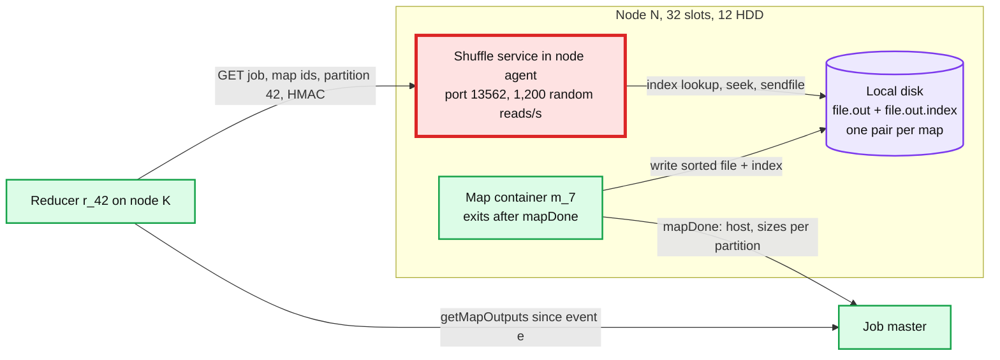
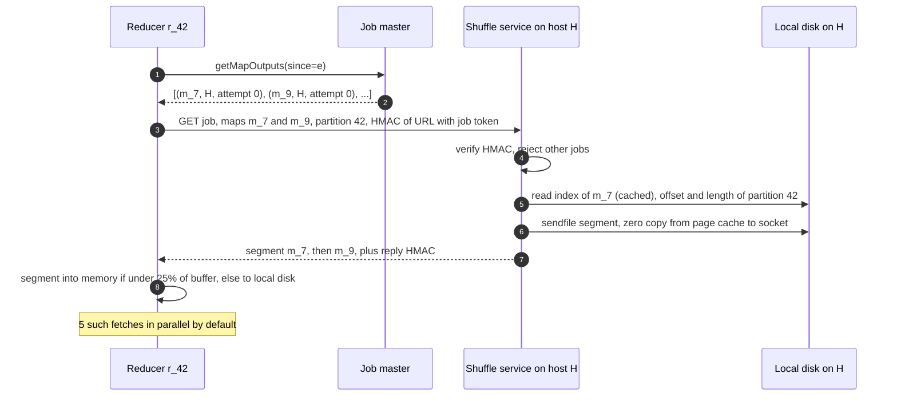
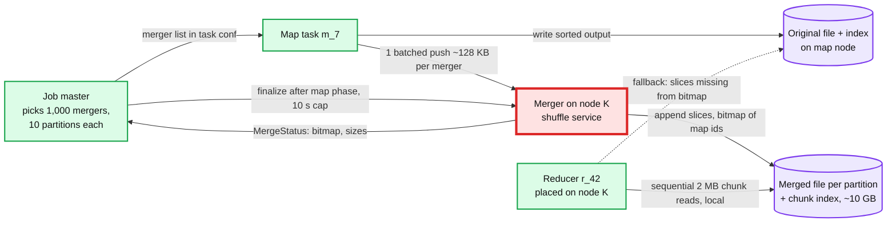
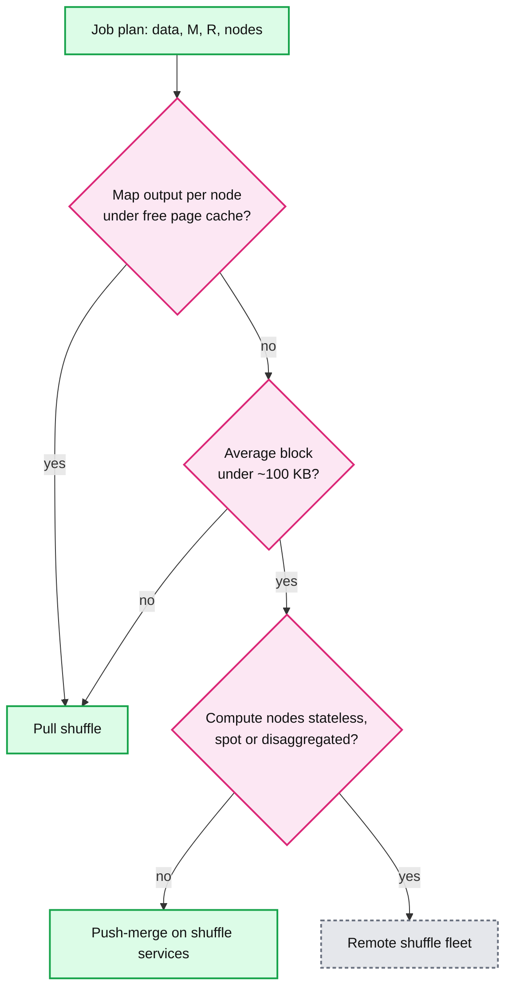

# Deep dive: shuffle, pull vs push-merge vs remote

> One-line answer: a per-node **shuffle service** serves map output after the map container exits, so only a dead node loses it; at fixed split and partition size the number of blocks grows as the square of the data, so the 100 TB sort turns into **7.8 billion reads of 12.8 KB** (~1.8 h of disk seeks per node for 100 GB that streams in ~56 s); Riffle merges on the map node, Magnet's **push-merge** builds one file per partition while maps run, and a **remote shuffle service** moves all of it to its own fleet; we pull by default, push-merge when blocks are small or exceed page cache, and add a remote fleet only when compute must become stateless.

Part of [`../solution.md`](../solution.md) §4.3, §5.1, §10.1 and §10.3. Papers: Riffle ([EuroSys 2018](https://www.cs.princeton.edu/~mfreed/docs/riffle-eurosys18.pdf)), Magnet ([VLDB 2020](https://www.vldb.org/pvldb/vol13/p3382-shen.pdf)), Uber RSS ([blog](https://www.uber.com/blog/ubers-highly-scalable-and-distributed-shuffle-as-a-service/)), [Celeborn docs](https://celeborn.apache.org/docs/latest/). Defaults from [`mapred-default.xml`](https://hadoop.apache.org/docs/stable/hadoop-mapreduce-client/hadoop-mapreduce-client-core/mapred-default.xml). Related: [`../../query-engine/deep-dives/shuffle-and-joins.md`](../../query-engine/deep-dives/shuffle-and-joins.md), [`../../../concepts/fan-out-fan-in.md`](../../../concepts/fan-out-fan-in.md).

## 1. Why the shuffle service outlives tasks



- A map task lives ~15 s in the sort and ~60 s on average [estimate]. Its output is needed until the last reducer has fetched it, minutes later. Keeping 780k containers alive for that would hold every slot of the cluster.
- So the node agent hosts one long-lived **shuffle service** (Hadoop `ShuffleHandler`, Spark's external shuffle service). It serves files of any finished task of any job on that node.
- Result: a crashed, preempted or finished task container loses nothing. Only node death loses map output (then the maps re-run, [`fault-tolerance-and-recovery.md`](fault-tolerance-and-recovery.md)). Files are deleted at job end, ~31 GB per node in flight (solution.md §2).

## 2. The fetch protocol



- **Index lookup.** Each map's index holds one 24 B record per partition (start offset, raw length, compressed length), so 10,000 x 24 B = ~240 KB in the sort. The service caches recent indexes in memory, so one fetch costs one seek into the data file, not two.
- **`sendfile`.** Bytes go from page cache to the socket without a user-space copy (`mapreduce.shuffle.transferTo.allowed`). CPU is not the limit. The disk head is.
- **HMAC.** The request URL is signed with the job's secret token. The service checks it, and signs its reply. Job A's task cannot read job B's map output on the same node (solution.md §10.10).
- **Slowstart.** Reducers launch when 5% of maps are done (`slowstart.completedmaps` = 0.05), so copying overlaps the map phase. For long map phases this parks reduce containers idle, so solution.md §10.2 uses 0.8 for big pull jobs. With push-merge it is 1.0: merged files are readable only after finalize, so reducers launch at finalize next to their merged partition (§5).
- **Reducer memory.** 70% of the reduce heap holds fetched segments (`shuffle.input.buffer.percent` = 0.70). When that buffer is 66% full (`shuffle.merge.percent` = 0.66, about 46% of heap) an in-memory merge writes one sorted run to disk. A single segment above 25% of the buffer (`shuffle.memory.limit.percent` = 0.25) goes straight to disk. Reads time out after 180 s (`shuffle.read.timeout`).
- **Failure vs overload.** Only connection refused or host unreachable counts as a fetch failure. 3+ reducers on 2+ racks (or 60 s of missed heartbeats) mark the host's outputs lost. A timeout from a live, overloaded shuffle service is not a loss: back off and retry, because re-running healthy maps would add load to the red node. A reducer preempted mid-fetch ends KILLED, not FAILED, and its replacement re-fetches the whole 10 GB partition (~1 to 2 min), so reduces are preempted last.

## 3. The M x R math, and why it gets worse as data grows

- **Blocks = M x R.** One per (map, partition) pair. Sort: 781,250 x 10,000 = **7.8 billion** blocks of 100 TB ÷ 7.8 B = **12.8 KB**.
- **Per node** the shuffle service serves 7.8 B ÷ 1,000 = 7.8 M random reads. At ~1,200 reads/s that is ~6,500 s = **1.8 h**. The same 100 GB read sequentially at 1.8 GB/s is ~56 s.
- **Quadratic growth.** Split size fixes M = data ÷ 128 MB. Partition size fixes R = data ÷ 10 GB. So blocks = data² ÷ (128 MB x 10 GB), and block size = 128 MB x 10 GB ÷ data. Ten times the data gives 100x the blocks and blocks 10x smaller (table in §7). Magnet's authors hit the same wall: average block "around 10s of KBs", and "Around 15% of the total Spark computation resources on our clusters are wasted due to this latency" (VLDB 2020 §2).
- **Tuning dilemmas.** Bigger splits or fewer reducers make blocks bigger, but each task gets longer, retries cost more and stragglers hurt more (solution.md §5.1 Bad rung).
- **Page cache.** A node has ~40 GB free for page cache after task heaps (solution.md §2). If map output per node fits, reads hit memory and seeks vanish. The 1 TB job on 100 nodes holds 10 GB per node: 100% cached, ~3 s. The sort holds 100 GB per node: ~40% cached, still ~1.1 h. So the trigger for push-merge is "map output per node > free page cache, or average block < ~100 KB", decided per job by the job master.

## 4. Riffle: merge on the map node

- A **merge scheduler** in the job master sends a merge request to the merger on a node as soon as each group of N map outputs exists there, not after all of that node's maps finish. The merger reads those files sequentially, copies each partition's slices next to each other, and writes one new file plus index (Riffle Algorithm 1). So merges overlap the map phase. Only the last group trails the last maps.
- Fully merged per node, the sort has 1,000 x 10,000 = 10 M blocks of ~10 MB. Each node serves 10,000 reads, ~64 s.
- **Cost.** One more sequential read and write of all map output: 100 GB each way per node, ~111 s of disk. Merger memory: Riffle's merger buffers reads and writes, and needed 6 to 8 GB for 10 to 20 concurrent merges. **Best effort.** When a threshold of merges is done (95% in the paper's tests), the job moves on and cancels the rest. Reducers get a mix of merged and original file metadata. A lost merged file falls back to the originals, with no map re-run.
- Result at Facebook: "up to a 10x reduction in the number of shuffle I/O requests and 40% improvement in the end-to-end job completion time". Average request size had shrunk from 1.7 MB to 50 KB as tasks got smaller.

## 5. Magnet push-merge: one file per partition, built while maps run



Step by step, for the 100 TB sort:

1. **Merger selection per partition.** Before the map phase the job master picks n shuffle services and gives each a **contiguous range** of R ÷ n partitions (Magnet Algorithm 1). Here n = 1,000, so 10 partitions per merger. Every map task gets the same list, so all slices of partition 42 go to the same merger.
2. **Batched, best-effort push.** After writing its normal output, the map task reads it back (still in page cache) and sends **one push of ~128 KB per merger** (10 adjacent partitions x 12.8 KB), 1,000 pushes per map. Magnet groups contiguous blocks into MB-sized chunks the same way and randomizes chunk order so two maps rarely hit one merger at once. Pushes run on a separate thread pool. A push that fails after retries is dropped. It never fails or blocks the map task.
3. **Merge with a chunk index.** The merger appends each slice to its partition's file. Per partition it keeps a **bitmap of merged map ids**, with each slice tagged by its attempt id (duplicates from retried or backup maps are dropped, and finalize keeps only slices from the attempt the job master recorded in `mapDone`), a **position offset** (a torn append is overwritten by the next one, or truncated at finalize) and the id of the map currently appending (two maps never interleave). Every few MB it records a chunk boundary in an index file. The merger **does not buffer blocks in memory**: Magnet's shuffle service "merges blocks directly on disk". The map side does the batching, the merger appends each batch, and the page cache groups the small writes. So merger memory does not grow with the number of streams, unlike Riffle's 6 to 8 GB.
4. **Finalize with a timeout.** When the map phase ends, the job master waits a bounded time for pushes in flight (Spark's `spark.shuffle.push.finalize.timeout` = 10 s), then tells every merger to stop. Each returns a MergeStatus: which maps' slices are in each merged file, and its size. The job master now holds M MapStatus and R MergeStatus records, enough to plan every reducer's input. It journals them as `shuffle_finalized` (per partition: merger host and which map slices are merged), so a new job master attempt reuses the merged files instead of finalizing again or falling back to pull.
5. **Reducer placement.** Reducer 42 is placed on the merger's node (10 reducers per node, well under 32 slots). It reads one ~10 GB file locally in ~2 MB chunks. Per node: 100 GB ÷ 2 MB = **50k reads, ~42 s of seeks plus ~56 s of transfer, ~1.5 min** instead of 1.8 h. Push-merge is forced off for non-deterministic jobs (`conf.map.deterministic = false`), whose map output goes durable to the DFS instead.
6. **Fallback to originals.** Any map whose bit is missing in the bitmap is fetched the old way from its original file. A dead merger means its 10 partitions read originals: 10 x 781,250 = 7.8 M reads spread over 1,000 nodes, ~7,800 per node, ~6.5 s. Correct and only a little slower.
7. **Double writes.** Every byte is written twice: original plus merged. Disk per node during the 6 min map phase: 100 GB read + 100 GB written + 100 GB merged = ~0.83 GB/s, under the 1.8 GB/s budget. Cluster-wide, 3 PB/day of shuffle becomes 6 PB/day of writes. Cheap on HDD. It is why Magnet skips pushing blocks above a size threshold: big blocks already read well, so a second copy buys nothing. The same rule protects skew handling. A hot partition's blocks are big (~25.6 MB per map against a 12.8 KB average), so they are never pushed: one merger is not handed a 20 TB partition, and the partition stays splittable by map range for the skew split in [`data-skew-and-partitioning.md`](data-skew-and-partitioning.md). Magnet "will merge all the normal partitions, but skip the skewed partitions" (VLDB 2020 §3.5.2).

What push-merge does not change: node loss. Node H held 781 original outputs and 10 merged partitions. Merged files elsewhere already contain H's slices, so most reducers are untouched. But H's own 10 merged partitions need originals from every map, including H's lost ones, so H's 781 maps still re-run.

## 6. Remote shuffle services, and why "just use SSD" is not the full answer

- **Uber RSS.** Map tasks send each partition to an assigned RSS server and reducers read it back from there (mechanism summarized from the post, not re-checked). ~400 servers per data center (80 vCores, 384 GB, 4 x 4 TB NVMe), "~8-10 PB of data everyday", up to "~40 TBs of data in a single shuffle", P99 2 TB/min read and 0.6 TB/min write. SSD wear-out time on the YARN fleet went "from ~3 months to ~36 months", and shuffle container failures were "reduced to almost 95%".
- **Apache Celeborn** (from Alibaba). Workers merge pushed data per partition and can keep it in memory, local disk, HDFS or an object store. A Raft-replicated master tracks workers (per its docs, not re-checked here).
- **When each pays off.** Pull: map output per node fits page cache, or blocks > ~100 KB (90% of our jobs). Push-merge: big jobs on long-lived HDD nodes, no new fleet. Remote: compute must be stateless (spot, autoscale, preemption, disaggregated storage), or shuffle writes are wearing out compute SSDs. Cost: a second fleet (~4% of node count at Uber) and every byte crosses the network twice.
- **Why NVMe alone is not enough.** Seeks vanish, but 7.8 B requests remain: one RPC, index lookup and syscall each, plus ~1 byte of job master state per block (7.8 GB, solution.md §5.5). Writes wear drives: Uber's 3-month wear-out. Magnet's authors call SSD or persistent memory "too expensive to store the intermediate shuffle data at scale". Fix the block count first, then pick the medium.



## 7. Calculator: blocks, reads per node, shuffle-read time

Model in the docstring. Cached bytes move at NIC speed. Riffle is modeled as one merged file per node.
```python
"""Shuffle cost calculator: pull vs Riffle-style merge vs push-merge.
Model: every disk read costs one seek (1/IOPS) plus its bytes at sequential bandwidth.
Standard library only. Decimal units (1 TB = 1e12 B, 128 MB = 128e6 B)."""
TB, GB, MB, KB = 1e12, 1e9, 1e6, 1e3

def shuffle(name, data, split, R, nodes, iops=1200, bw=1.8 * GB,
            cache=40 * GB, nic=3 * GB, chunk=2 * MB):
    M = round(data / split)
    blocks = M * R
    per_node = data / nodes                      # map output bytes held per node
    xfer = per_node / bw                         # sequential floor, seconds

    def disk(reads):                             # seek-bound + transfer time
        return reads / iops + xfer

    pull_reads = blocks / nodes
    cached = min(1.0, cache / per_node)          # share served from page cache
    pull_cached = (pull_reads * (1 - cached) / iops
                   + per_node * (1 - cached) / bw + per_node * cached / nic)
    riffle_reads = R                             # 1 merged file per node, 1 read per partition
    riffle_block = data / (nodes * R)
    riffle_merge = 2 * xfer                      # extra sequential read + write of all output
    push_reads = per_node / chunk                # merged partition read in 2 MB chunks
    mergers = nodes
    batch = data / M / mergers                   # one batched push per merger range

    print(f"== {name}: {data/TB:,.0f} TB, split {split/MB:.0f} MB, R {R:,}, {nodes:,} nodes")
    print(f"  M = {M:,}   blocks M x R = {blocks:,.3g}   avg block = {data/blocks/KB:,.1f} KB")
    print(f"  map output per node = {per_node/GB:,.0f} GB, sequential floor = {xfer:,.0f} s")
    print(f"  pull       : {pull_reads:>12,.0f} reads/node  {disk(pull_reads):>8,.0f} s"
          f"  ({disk(pull_reads)/3600:.2f} h)")
    print(f"  pull+cache : {cached:>11.0%} cached           {pull_cached:>8,.0f} s")
    print(f"  riffle     : {riffle_reads:>12,.0f} reads/node  {disk(riffle_reads):>8,.0f} s"
          f"  + merge {riffle_merge:,.0f} s, blocks {riffle_block/MB:,.1f} MB")
    print(f"  push-merge : {push_reads:>12,.0f} reads/node  {disk(push_reads):>8,.0f} s"
          f"  + {per_node/GB:,.0f} GB 2nd write/node, push {M*mergers:,.3g} batches"
          f" of {batch/KB:,.0f} KB")

shuffle("100 TB sort", 100 * TB, 128 * MB, 10_000, 1_000)
shuffle("1 TB job", 1 * TB, 128 * MB, 1_000, 100)

print("== growth at fixed 128 MB split and 10 GB partition (R = data / 10 GB)")
for tb in (1, 10, 100, 1000):
    d = tb * TB
    M, R = d / (128 * MB), d / (10 * GB)
    print(f"  {tb:>5,} TB: M {M:>10,.0f}  R {R:>7,.0f}  blocks {M*R:>9.3g}"
          f"  avg block {d/(M*R)/KB:>8,.2f} KB")
```

Real output:

```
== 100 TB sort: 100 TB, split 128 MB, R 10,000, 1,000 nodes
  M = 781,250   blocks M x R = 7.81e+09   avg block = 12.8 KB
  map output per node = 100 GB, sequential floor = 56 s
  pull       :    7,812,500 reads/node     6,566 s  (1.82 h)
  pull+cache :         40% cached              3,953 s
  riffle     :       10,000 reads/node        64 s  + merge 111 s, blocks 10.0 MB
  push-merge :       50,000 reads/node        97 s  + 100 GB 2nd write/node, push 7.81e+08 batches of 128 KB
== 1 TB job: 1 TB, split 128 MB, R 1,000, 100 nodes
  M = 7,812   blocks M x R = 7.81e+06   avg block = 128.0 KB
  map output per node = 10 GB, sequential floor = 6 s
  pull       :       78,120 reads/node        71 s  (0.02 h)
  pull+cache :        100% cached                  3 s
  riffle     :        1,000 reads/node         6 s  + merge 11 s, blocks 10.0 MB
  push-merge :        5,000 reads/node        10 s  + 10 GB 2nd write/node, push 7.81e+05 batches of 1,280 KB
== growth at fixed 128 MB split and 10 GB partition (R = data / 10 GB)
      1 TB: M      7,812  R     100  blocks  7.81e+05  avg block 1,280.00 KB
     10 TB: M     78,125  R   1,000  blocks  7.81e+07  avg block   128.00 KB
    100 TB: M    781,250  R  10,000  blocks  7.81e+09  avg block    12.80 KB
  1,000 TB: M  7,812,500  R 100,000  blocks  7.81e+11  avg block     1.28 KB
```

How to read it: for the sort, pull is 1.8 h and the page cache only takes it to 1.1 h, push-merge is ~1.5 min (97 s), Riffle reads faster but pays ~2 min of merge that can trail the last maps. For the 1 TB job everything is cached, pull costs ~3 s, and push-merge would add 10 GB of writes per node and a finalize barrier for nothing. Growth: 10x the data is 100x the blocks, and at 1 PB a block is 1.3 KB.

## 8. Trade-offs

| Decision | Option A | Option B | Chose | Why |
|---|---|---|---|---|
| Who serves map output | The map task | Per-node shuffle service | Service | Tasks exit in ~15 to 60 s. Only node death loses output |
| Fix small blocks | Tune M and R | Merge blocks | Merge | Tuning moves the cost into longer tasks and costlier retries |
| Where to merge | On the map node after maps (Riffle) | Push to a merger while maps run (Magnet) | Push-merge | Merge overlaps the map phase and puts the reducer next to its data. Costs a finalize barrier |
| Merged copy | Replace originals | Keep originals as fallback | Keep | A lost merger costs ~6.5 s per node of fallback reads, not map re-runs. Costs 2x writes |
| Push failures | Retry until merged | Best effort, drop | Drop | Never slow a map task. Missing slices come from originals |
| Shuffle placement | Our compute nodes | Remote fleet (RSS, Celeborn) | Compute nodes | Long-lived HDD nodes. Remote pays off when compute must be stateless |
| Medium | NVMe for shuffle | HDD with merging | HDD + merge | Fix block count first. NVMe still pays per request and wears out |

Refused to build: a remote shuffle fleet at 4,000 long-lived nodes, push-merge for jobs whose map output fits page cache, and merged-file replication (originals already are the second copy).
