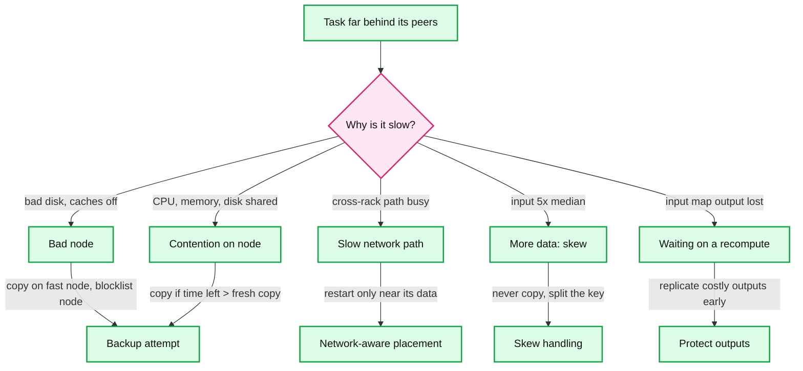
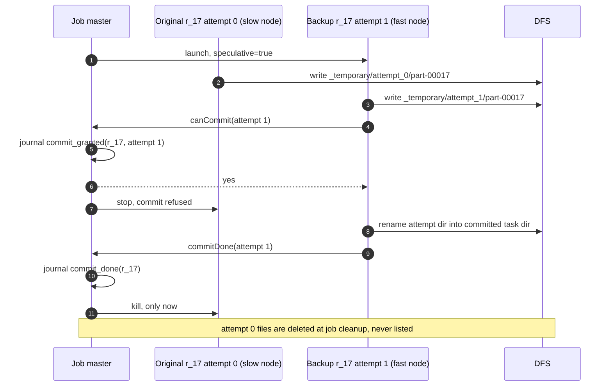

# Deep dive: stragglers and speculation

> One-line answer: a job finishes when its slowest last-wave task finishes, so one bad node (a disk at 1 MB/s instead of 30 MB/s, CPU caches off at 100x) can stretch a 15 s task into minutes; the fix is a **backup copy** whose first finisher wins the commit gate, launched by estimated **time left** (LATE), capped at 10% of slots, placed on fast nodes, and only when a fresh copy would actually finish sooner; speculation fixes slow machines, never slow data (skew), and reduce backups cost minutes, so they are rarer than map backups.

Part of [`../solution.md`](../solution.md) §5.2 and Flow 4. Papers: MapReduce ([OSDI 2004](https://static.googleusercontent.com/media/research.google.com/en//archive/mapreduce-osdi04.pdf) §3.6, §5.4), LATE ([OSDI 2008](https://www.usenix.org/legacy/event/osdi08/tech/full_papers/zaharia/zaharia.pdf)), Mantri ([OSDI 2010](https://www.usenix.org/legacy/event/osdi10/tech/full_papers/Ananthanarayanan.pdf)). Defaults from [`mapred-default.xml`](https://hadoop.apache.org/docs/stable/hadoop-mapreduce-client/hadoop-mapreduce-client-core/mapred-default.xml) and the [Spark configuration page](https://spark.apache.org/docs/latest/configuration.html). Related: [`../../query-engine/deep-dives/fault-tolerance-and-stragglers.md`](../../query-engine/deep-dives/fault-tolerance-and-stragglers.md), [`data-skew-and-partitioning.md`](data-skew-and-partitioning.md), [`output-commit-and-exactly-once.md`](output-commit-and-exactly-once.md).

## 1. Causes, and the action each one deserves



Numbers for each cause:
- **Bad disk.** The paper's example: correctable errors drop reads "from 30 MB/s to 1 MB/s" (§3.6). Reading a 128 MB split goes from ~4 s to ~128 s.
- **CPU caches disabled.** A machine-init bug slowed machines "by over a factor of one hundred". A 15 s map becomes 25 min.
- **Contention.** Other tasks on the node compete "for CPU, memory, local disk, or network bandwidth" (§3.6). LATE measured 2.5x differences from contention between co-located VMs on EC2.
- **Skew.** One reduce partition with 20% of the data is slow on every node (solution.md §5.3).
- **Recompute waits.** Mantri found recomputes of lost outputs "cause some of the longest waiting times" on Bing's clusters.

Mantri's framing: outliers "inflate the completion time of jobs by 34% at median", and acting on the cause rather than copying everything cut job time by 32%.

## 2. The paper's backup tasks

- **Mechanism.** "When a MapReduce operation is close to completion, the master schedules backup executions of the remaining in-progress tasks." Whichever copy finishes first marks the task done.
- **Result (sort, §5.4).** 891 s with backups. 1283 s without, "an increase of 44%". Without backups, after 960 s "all except 5 of the reduce tasks are completed", and those 5 took 300 s more.
- **Cost.** Tuned to add "no more than a few percent" of compute.
- **Weakness.** It copies every remaining task, healthy or not, and it puts the copy on whatever slot frees up. At 95% done in our sort, that is up to 32,000 running maps (one per slot) or 500 reduces at once.

## 3. Why Hadoop's first heuristic broke, and what LATE changed

Pre-LATE Hadoop marked a task a straggler when its progress score was 0.2 below the category average and it had run at least 1 min. LATE showed three failures:
- **Heterogeneous nodes.** A fixed threshold launches too many copies. On 900-node EC2 runs, "80% of reducers were speculated".
- **Progress is not linear.** The copy phase is 1/3 of a reducer's score but most of its time. Once ~30% of reducers finish copying, the average jumps to ~53% and every reducer still copying looks 20% behind.
- **Late tasks are never copied.** A task above 80% progress can never be 0.2 below an average that cannot exceed 100%.

LATE (Longest Approximate Time to End):
- **Estimate.** Progress rate = progress score ÷ T running. Time left = (1 - progress) ÷ rate.
- **Pick.** When a node asks for work and fewer than **SpeculativeCap** copies run: rank running tasks by time left, copy the top one whose rate is below **SlowTaskThreshold**.
- **Place.** Ignore requests from nodes below **SlowNodeThreshold** of total work done, so the copy lands on a fast node.
- **Defaults.** SpeculativeCap = 10% of slots. Both thresholds at the 25th percentile. Wait 1 min before judging a task. Result: "reduces Hadoop's response time by a factor of 2".
- **Why it is better.** Task A is 5x slow at 90% progress. Task B is 2x slow at 10%. LATE copies B first, because B hurts the finish time more.

## 4. Defaults today, and why Hadoop and Spark differ

| Setting | Hadoop MapReduce | Spark |
|---|---|---|
| On by default | `mapreduce.map.speculative` = true, `reduce.speculative` = true | `spark.speculation` = false |
| When a task is slow | Rate more than `slowtaskthreshold` = 1.0 standard deviations below the mean of running tasks | Runtime > `speculation.multiplier` x median (3 on master and docs, 1.5 on branch-3.5) |
| When to start | Any time, re-checked every 1 s, 15 s after a launch (`retry-after-no-speculate`, `retry-after-speculate`) | After `speculation.quantile` of the stage is done (0.9 on master, 0.75 on branch-3.5) |
| Cap | 10% of running tasks, 1% of all tasks, at least 10 (`speculative-cap-*`, `minimum-allowed-tasks`). Taking the larger is our reading of the code [unverified] | No fixed cap |
| Bad node | `maxtaskfailures.per.tracker` = 3 failures, then no more tasks of that job on it | Exclusion on failure, off by default [unverified] |

Why they differ (our reading):
- A Hadoop task is a JVM process on a dedicated slot, running seconds to minutes. A copy is cheap and the job is one stage.
- A Spark task often runs for well under a second inside a shared executor. A slow one is more often a skewed partition or a GC pause than a bad disk. A copy also repeats any side effect in user code, such as a write to an outside database. Off by default is the safer default for a general engine.
- Our design keeps Hadoop's "on" for maps, and is conservative for reduces (§6).

## 5. Mantri: act on the cause, and on the cost

Mantri runs on Bing's Cosmos clusters. It estimates t_rem (time left for this copy) and t_new (time a fresh copy would take, from the task's input size, the network location and the target machine's history).
- **Kill and restart** when t_rem > E(t_new) + Δ, where Δ is the progress-report period. At most 3 restarts per task.
- **Duplicate** while slots are scarce only if P(t_rem > t_new x (c+1) ÷ c) > 0.25 with c copies running. One copy is duplicated only if the new one would take under half the time left. Never more than 3 copies.
- **Network-aware placement.** Place reducers so that no cross-rack link is a hotspot. Restart a network-slow task only if a better location exists.
- **Protect outputs.** Replicate a finished task's output when the expected cost of recomputing it beats the cost of the copy.
- **Work imbalance.** Do not restart. Start the tasks with the most data first.

The piece we take: **copy only if a fresh copy would finish sooner**, with t_new sized from the task's input. That one check removes most wasted copies (§9) and also refuses to copy skewed tasks.

## 6. Why speculation cannot fix skew, and why reduce backups are costly

- **Skew.** A skewed reducer has 20 TB to process. Its copy also has 20 TB. It starts later, so it can only lose, and it pulls the same partition through the shuffle service a second time. The job master knows partition sizes from `mapDone`, so it skips any task whose input is over 5x the median and leaves it to [`data-skew-and-partitioning.md`](data-skew-and-partitioning.md).
- **Reduce backups.** In the sort, a reduce backup re-fetches 10 GB (781,250 blocks, ~781 reads per node over 1,000 nodes), merges it and writes 30 GB with 3 replicas: ~5 min of fresh work. It pays only when the original has more than ~5 min left. A map backup costs one map's work, ~15 s in the sort and ~60 s on average [estimate]. The same cost hits a reducer preempted mid-fetch: its replacement re-fetches the whole partition, so reduces are preempted last (solution.md §4.5).
- **Push-merge trap.** With push-merge (solution.md §5.1) the reducer runs next to its only merged copy. If that node's disk is the reason for the slowness, a backup reading the same merged file is just as slow. So a speculative reduce backup always reads the **original map slices** from the map nodes, not the merged file: 781,250 slices over 1,000 nodes, ~781 reads per node, under 1 s each.
- **Blocklisting.** After 3 task failures of one job on a node (`maxtaskfailures.per.tracker` = 3), that job stops using it. The knob counts failures only, not slowness. The per-node slowness score is our addition: the job master keeps (tasks whose rate fell in the bottom 25%) and stops placing that job's tasks on a node after 3 such tasks [estimate].

## 7. Interaction with the commit gate



- Two attempts never share a path, so they never corrupt each other. The gate, not the race, picks the output.
- Map attempts need no gate. The job master keeps the first `mapDone` and reducers fetch only that attempt.
- Counters come only from the committed attempt, so a backup never double counts.
- **The hard case: the granted attempt dies before `commitDone`.** On HDFS with v1 commit, the task rename is atomic: it either happened or it did not. So the live job master checks whether the committed task dir exists. If it does, the task is done. If not, it reopens the gate and the surviving attempt (not yet killed, per the diagram) can commit. On object stores the manifest committer makes this safe the same way, because the task manifest is one PUT. With v2 commit, a half-finished rename leaves files in the output, so revoking is unsafe. That is one more reason we refuse v2.

## 8. Simulation: one wave, 2% of nodes 10x slow

Seeded and deterministic. 1,000 single-slot nodes, 1,000 tasks of ~15 s. Four policies: none, the paper's backups once 95% are done, LATE-style (25th percentile, 10% cap, fast nodes only), and LATE plus the benefit check. A second run adds one task with 10x the input on a healthy node. "Extra task-s" is time spent by attempts that lost the race. "Slot-s used" is all attempts together.

```python
"""One wave of 1,000 map tasks on 1,000 single-slot nodes. 2% of nodes are 10x slow.
Compare: no speculation, paper-style backups at 95% done, LATE-style, LATE plus a
benefit check (copy only if time left > a fresh copy's time, sized from the task's
input, Mantri's idea). A second run adds one skewed task with 10x the input."""
import random

N, SLOW_FRAC, SLOW_X, BASE, TICK = 1000, 0.02, 10.0, 15.0, 0.5

def run(policy, skew=False, seed=7):
    rng = random.Random(seed)                      # same cluster for every policy
    slow = set(rng.sample(range(N), int(N * SLOW_FRAC)))
    work = [BASE * rng.lognormvariate(0, 0.1) for _ in range(N)]
    if skew: slow.discard(0); work[0] *= 10       # task 0: 10x input on a healthy node
    speed = [1 / SLOW_X if n in slow else 1.0 for n in range(N)]
    att = [[t, t, 0.0] for t in range(N)]          # [task, node, start]; task t starts on node t
    done, free, t, waste, backups, busy = {}, [], 0.0, 0.0, 0, 0.0
    while len(done) < N:
        t += TICK
        for a in list(att):                        # completions, then kill the losers
            task, node, st = a
            if (t - st) * speed[node] >= work[task] and task not in done:
                done[task] = t
                for b in [b for b in att if b[0] == task]:
                    att.remove(b); free.append(b[1]); busy += t - b[2]
                    if b is not a: waste += t - b[2]
        running = {a[0] for a in att}
        copies = {k: sum(1 for a in att if a[0] == k) for k in running}
        if policy == "backup95" and len(done) >= 0.95 * N:
            for k in [k for k in running if copies[k] == 1]:
                if free: att.append([k, free.pop(rng.randrange(len(free))), t]); backups += 1
        elif policy.startswith("late"):
            cap = int(0.10 * N) - sum(c - 1 for c in copies.values())
            ests = []                              # (time_left, rate, task) per single-copy task
            for task, node, st in att:
                el = t - st
                if copies[task] > 1 or el < 5: continue
                prog = min(0.99, el * speed[node] / work[task])
                rate = prog / el
                ests.append(((1 - prog) / rate, rate, task))
            if not ests: continue
            rates = sorted(e[1] for e in ests)
            p25 = rates[len(rates) // 4]           # SlowTaskThreshold = 25th percentile
            fast_free = [n for n in free if n not in slow]   # SlowNodeThreshold, simplified
            for left, rate, task in sorted(ests, reverse=True):
                if cap <= 0 or not fast_free: break
                if rate > p25: continue
                if policy == "late+benefit" and left <= work[task]: continue
                n = fast_free.pop(); free.remove(n)
                att.append([task, n, t]); backups += 1; cap -= 1
    return max(done.values()), backups, waste, busy, sum(work)

print(f"{N} tasks, {int(N*SLOW_FRAC)} slow nodes at {SLOW_X:.0f}x, base task {BASE:.0f} s")
print(f"{'policy':<14}{'job time':>9}{'backups':>9}{'extra task-s':>14}{'extra %':>9}{'slot-s used':>13}")
for skew in (False, True):
    print("-- one skewed task (10x input)" if skew else "-- slow nodes only")
    for p in ("none", "backup95", "late", "late+benefit"):
        jt, b, w, busy, u = run(p, skew)
        print(f"{p:<14}{jt:>8.1f}s{b:>9}{w:>14,.0f}{w / u:>9.1%}{busy:>13,.0f}")
```

Real output:

```
1000 tasks, 20 slow nodes at 10x, base task 15 s
policy         job time  backups  extra task-s  extra %  slot-s used
-- slow nodes only
none             185.5s        0             0     0.0%       18,088
backup95          37.5s       39           706     4.7%       15,998
late              30.0s      100           975     6.5%       16,267
late+benefit      30.0s       20           558     3.7%       15,850
-- one skewed task (10x input)
none             185.5s        0             0     0.0%       18,214
backup95         139.5s       40           826     5.5%       16,244
late             139.5s      100         1,097     7.2%       16,514
late+benefit     139.5s       20           558     3.7%       15,976
```

How to read it:
- **20 slow nodes make the job 6x longer** (185 s vs ~30 s). Any speculation fixes most of it.
- **Speculation uses fewer slot-seconds than none** (15,850 vs 18,088). Killing a slow original frees its slot. The "extra" is mostly those killed originals, not the copies.
- **Pure LATE hits its 10% cap** (100 copies) because healthy tasks near the end also fall in the bottom 25% by rate. The benefit check keeps exactly the 20 copies that matter, with the same job time.
- **Skew is untouched.** With one 10x task, every policy ends at 139.5 s. Blind copies waste 120 s more on it. Only the input-aware check refuses to copy it.
- Simplifications: progress estimates are exact, one slot per node, one wave. Real estimates are noisy, which makes the cap and the benefit check matter more.

## 9. Trade-offs

| Decision | Option A | Option B | Chose | Why |
|---|---|---|---|---|
| When to copy | Backups for all tasks at the end (paper) | Time left, 25th percentile, 10% cap (LATE) | B | With the benefit check: 20% shorter job, half the copies (§8) |
| Which copies | Every slow-rate task | Only if time left > a fresh copy, sized by input | B | Removes copies of nearly done tasks and of skewed tasks |
| Where to copy | First free slot | Fast node only | Fast node | A copy on another bad node is a second straggler |
| Reduce backups | Same rules as maps | Only with > ~5 min left, read originals | B | A reduce copy costs ~5 min, a map copy ~15 to 60 s |
| Default | Off (Spark) | On (Hadoop) | On for maps | Our tasks are side-effect free and one stage long |
| Slow node | Detect per task | Blocklist per job after 3 | Both | Stops feeding a known bad node |

Refused to build: speculation from 10% progress (doubles shuffle load and copies skew), more than one copy per task (Mantri allows 3, we allow 1 extra), and automatic key splitting inside the speculator (that belongs to skew handling).
