# Diagrams: MapReduce, a distributed batch processing framework

The D1 to D12 set from `hld/CLAUDE.md` §4. A diagram is drawn once. The ones embedded in [`solution.md`](solution.md) are linked here, not repeated. Red is used for one thing only: the **shuffle service**, where M x R small random reads break first (7.8 B blocks of ~12.8 KB, ~1.8 h of seeks for the 100 TB sort).

| # | Diagram | Where |
|---|---|---|
| D1 | Context | [below](#d1-context-zoom-out) |
| D2 | Data flow with rates | [below](#d2-data-flow-dfd) |
| D3 | Final design | [`solution.md` §6](solution.md#6-final-design-and-the-six-core-flows). Zoom-in: [one worker node](#d3a-zoom-in-inside-one-worker-node) |
| D4 | Happy path per FR | FR1 + FR3 pull path: [`solution.md` §4.3](solution.md#43-group-by-key-across-machines-and-run-the-reduce-phase). FR5: [§4.5](solution.md#45-share-the-cluster-between-teams). FR2: [below](#d4-fr2-map-phase-with-locality-and-delay-scheduling). FR3 push-merge: [`solution.md` §6 Flow 2](solution.md#flow-2-sort-100-tb-on-1000-nodes-with-push-merge-15-min). FR4 is the failure set in D5 |
| D5 | Failure paths | Map host dies: [`solution.md` §4.4](solution.md#44-survive-failure). Node loss timeline and RM failover: [§10.4](solution.md#104-failure-timeline). New below: [merger lost after finalize](#d5-merger-node-lost-after-finalize), [job master dies in job commit](#d5-job-master-dies-during-job-commit), [duplicate mapDone from a backup](#d5-duplicate-mapdone-from-a-backup) |
| D6 | Decision flows | Speculation: [`solution.md` §5.2](solution.md#52-one-slow-machine-must-not-add-more-than-10-stragglers). Commit gate: [§5.4](solution.md#54-output-equals-one-failure-free-run-and-appears-all-at-once-commit-object-stores-non-determinism). New: [fetch failure vs node loss](#d6-fetch-failure-or-node-loss) |
| D7 | Entity relationship | [`solution.md` §3.3](solution.md#33-data-model) |
| D8 | State machines | Job: [`solution.md` §4.1](solution.md#41-submit-a-job-and-get-its-output). Task attempt: [below](#d8-task-attempt-lifecycle) |
| D9 | Deployment | Control plane zoom-in: [`solution.md` §5.5](solution.md#55-no-single-master-failover-under-30-s-100k-jobsday-control-plane-availability-and-scale). Racks: [below](#d9-deployment-racks-and-control-hosts) |
| D10 | Partitioning | Shuffle block count: [`solution.md` §5.1](solution.md#51-sort-100-tb-on-1000-nodes-in-under-30-minutes-the-shuffle). Partitioners and the hot key: [below](#d10-partitioners-and-the-hot-key) |
| D11 | Failure mode map | [below](#d11-failure-mode-map) |
| D12 | Rollout from Hadoop 1 | [below](#d12-rollout-from-the-hadoop-1-jobtracker) |

## D1. Context (zoom-out)

Our system is one box: submit two functions, get R output files that appear all at once.

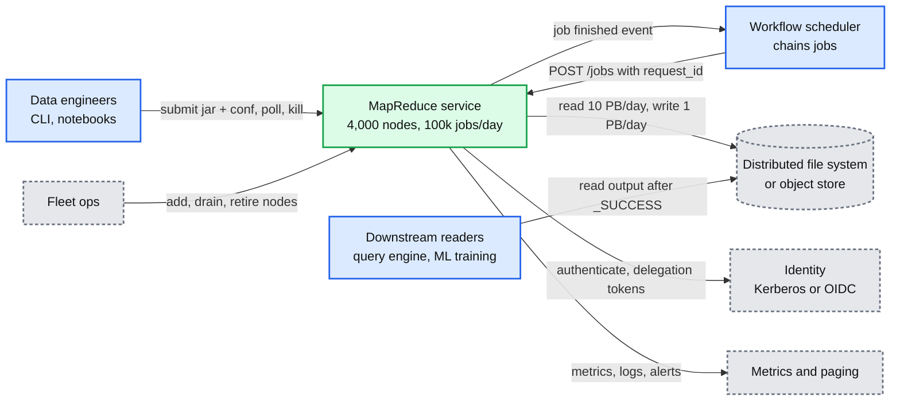

- The DFS ([`../distributed-file-system/`](../distributed-file-system/)) and the workflow scheduler ([`../distributed-job-scheduler/`](../distributed-job-scheduler/)) are other problems. We refused to build either, or a DAG engine.

## D2. Data flow (DFD)

Daily bytes and rates on every edge. Shuffle bytes are 30% of input but cost the most: tiny random reads, and ~97% cross a rack uplink (a reducer's 1,000 source nodes sit on 25 racks).

```mermaid
%% D2: data flow for the whole cluster per day. Averages over 86,400 s, peak 3x [estimate]. Stores are cylinders, processes are rounded.
flowchart LR
    CL[Client or<br/>workflow scheduler] -->|"job spec, JSON ~2 KB, 12/s peak"| JSV(Job service)
    JSV -->|"job row ~1 KB, 100k/day"| JDB[(Job store)]
    JSV -->|"admit, launch job master"| JM(Job master<br/>one per job)
    DIN[(DFS input)] -->|"128 MB splits, 10 PB/day,<br/>~116 GB/s avg, ~350 GB/s peak"| MAP(Map tasks<br/>~78 M/day)
    JM -->|"task launches, ~2,700/s peak"| MAP
    MAP -->|"mapDone sizes per partition,<br/>~1.25 KB, ~900/s avg"| JM
    JM -->|"journal events ~200 B,<br/>~16 GB/day [estimate]"| JR[(Journal on DFS)]
    MAP -->|"sorted runs + index, compressed,<br/>3 PB/day, ~35 GB/s"| LD[(Local disks<br/>map output)]
    LD -->|"index lookup + seek,<br/>~12.8 KB blocks in big jobs"| SS(Shuffle service<br/>per node)
    MAP -->|"one ~128 KB batched push per merger,<br/>1,000 per map, big jobs only"| SS
    SS -->|"partition segments, 3 PB/day,<br/>~97% cross a rack uplink"| RED(Reduce tasks)
    RED -->|"part files, 1 PB/day,<br/>x3 replicas = 3 PB/day of disk"| DOUT[(DFS output)]
    DOUT -->|"only after _SUCCESS or manifest"| DS[Downstream readers]
    class CL,DS client
    class JSV,JM,MAP,RED service
    class JDB,DIN,JR,LD,DOUT store
    class SS critical
    classDef client   fill:#dbeafe,stroke:#2563eb,stroke-width:2px,color:#111
    classDef service  fill:#dcfce7,stroke:#16a34a,stroke-width:2px,color:#111
    classDef store    fill:#ede9fe,stroke:#7c3aed,stroke-width:2px,color:#111
    classDef critical fill:#fee2e2,stroke:#dc2626,stroke-width:4px,color:#111
```

## D3a. Zoom-in: inside one worker node

The final design is [`solution.md` §6](solution.md#6-final-design-and-the-six-core-flows). Inside each node, the shuffle service outlives every task, so a crashed or preempted container loses nothing it finished. It does the random reads, so it is red.

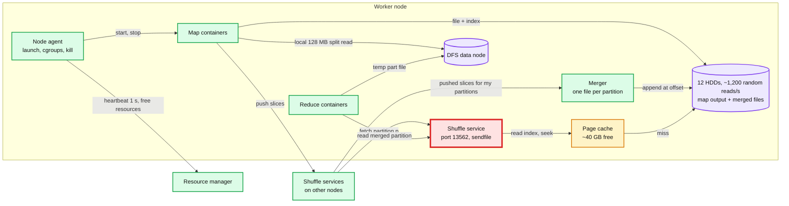

## D4. FR2: map phase with locality and delay scheduling

The RM skips a job for a few seconds rather than give it a slot with no local data. Reduces never wait: they read from every node anyway.

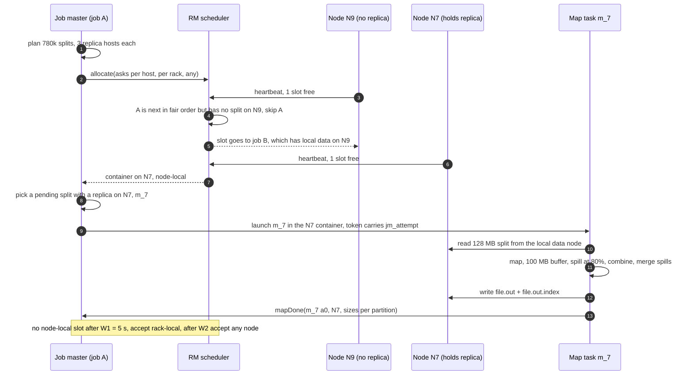

- Facebook's measurement: W1 = 1 s gave 68% to 80% locality for small jobs, 5 s gave "nearly perfect locality" ([EuroSys 2010](https://people.csail.mit.edu/matei/papers/2010/eurosys_delay_scheduling.pdf)). W2 is a few seconds more [estimate].

## D5. Merger node lost after finalize

Losing one merger costs seconds: only its 10 of 10,000 partitions fall back to pull, and merged data is a second copy, never the only one.

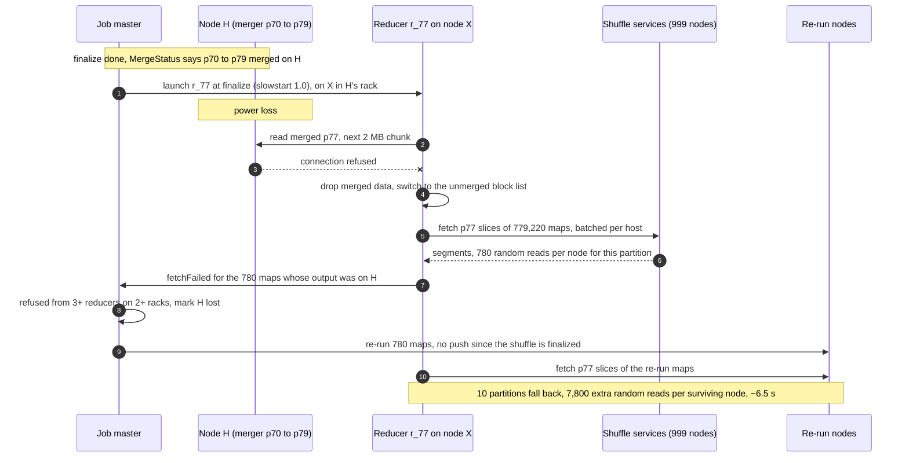

## D5. Job master dies during job commit

Job commit on HDFS builds a `publish/` staging directory from the journal (only `commit_done` attempts), then does one rename of it to `output_path`, so it either landed or did not. A new job master checks which, and redoes it from the journal.

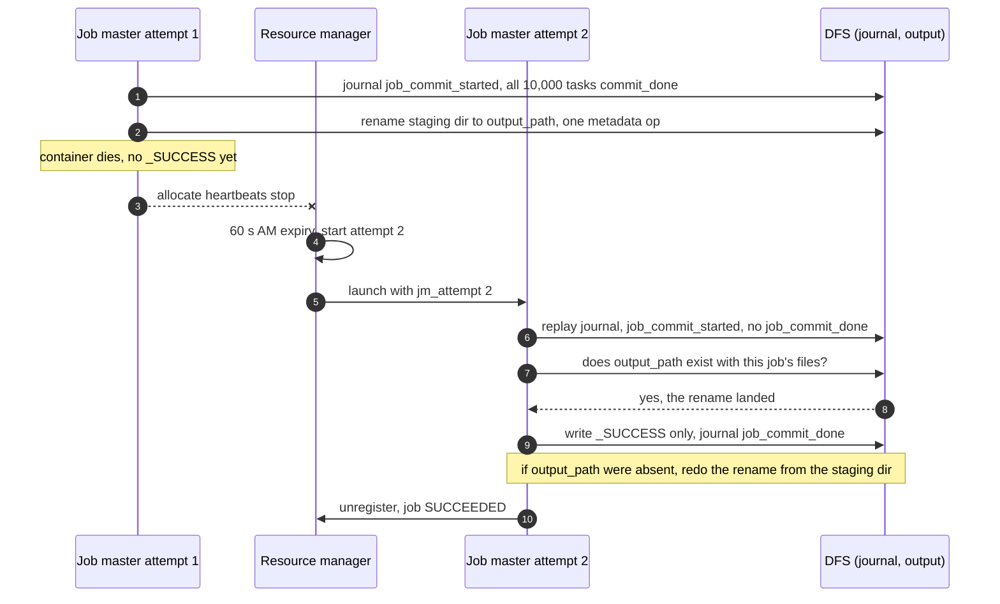

- Readers never see half an output: the rename is atomic. Hadoop's v1 moves files one by one, which is why a crash there leaves parts visible without `_SUCCESS`.
- On an object store the same shape holds with one conditional put of the job manifest. A zombie attempt 1 is fenced by the RM killing its container, and its rename fails because `output_path` already exists.

## D5. Duplicate mapDone from a backup

The job master keeps the first `mapDone`. The merger keeps the first push. They can come from different attempts, so mergers tag slices with the attempt id and finalize keeps only the recorded attempt. Non-deterministic jobs (`conf.map.deterministic = false`) also get durable map output and push-merge off.

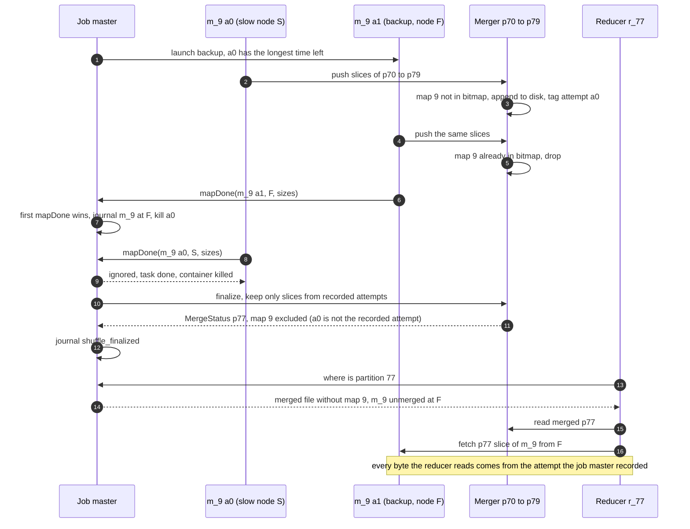

## D6. Fetch failure or node loss

Job master logic for one fetch failure report. In a pull shuffle the shuffle service is the bottleneck, so its timeouts are load, not death. Re-running 780 maps would only add load.

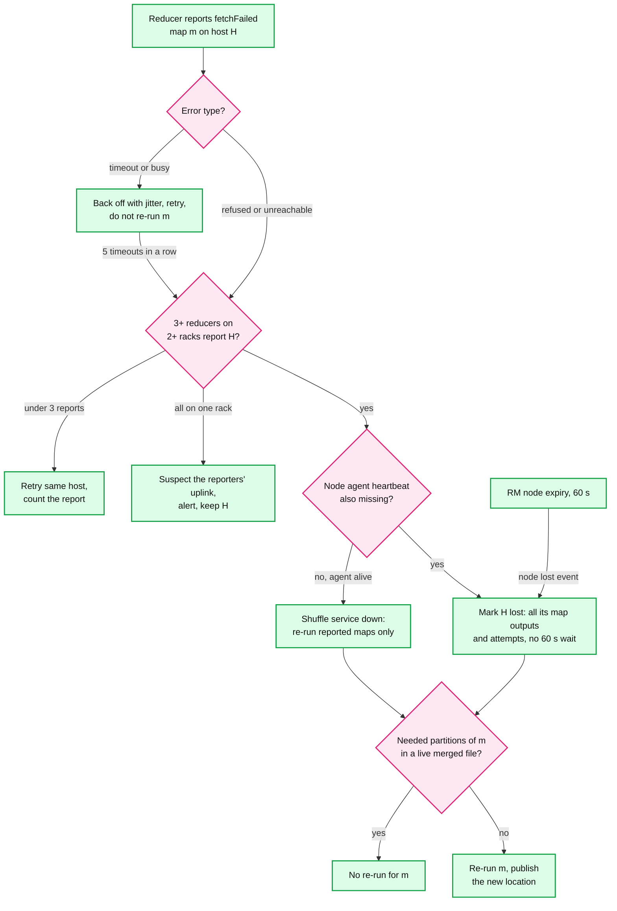

## D8. Task attempt lifecycle

Follows the ATTEMPT states in the [erDiagram](solution.md#33-data-model). KILLED never counts toward the 4-attempt limit. FAILED does. Preemption (45 s below guarantee, ask first, 10 s grace, then kill) never picks a job master or a COMMIT_PENDING attempt, and takes maps before reduces, youngest first.

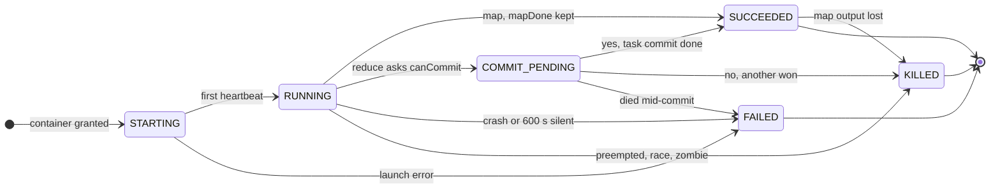

- `SUCCEEDED --> KILLED` is maps only: node loss deletes a finished map's output. A committed reduce never leaves SUCCEEDED. `died mid-commit`: the gate said yes (journal `commit_granted`), the attempt died before its rename (no `commit_done`). The job master checks for the committed task dir, else reopens the gate. Losers are told to stop but killed only after `commit_done`, so a backup survives a winner that dies mid-rename.

## D9. Deployment: racks and control hosts

One region, 100 racks of 40 nodes. Shuffle crosses racks. Nothing crosses regions.

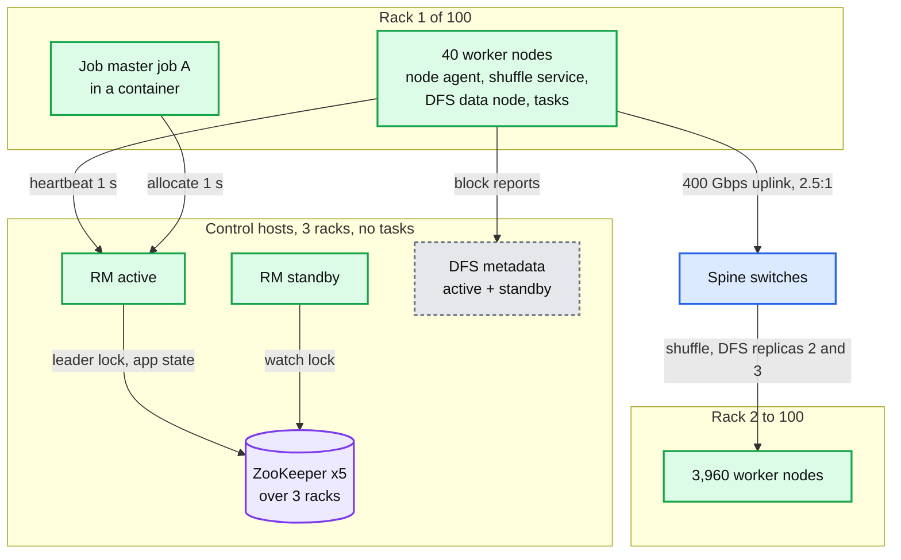

- Replication: DFS 3x (one replica on the writer's rack, two off-rack), ZooKeeper 5 over 3 racks (losing the rack with 2 leaves a quorum of 3), RM 2, job service 3 and job store 2 on the same control hosts. Map output 1x by design. Rack uplink math: 40 nodes x 100 GB out = 4 TB per rack through 50 GB/s = ~80 s for the sort. Fine.

## D10. Partitioners and the hot key

Hash needs no pre-pass but gives no global order. A sampled range gives a total order (TeraSort) but breaks on a stale sample. Neither splits one hot key. Detail: [`solution.md` §5.3](solution.md#53-one-key-holds-20-of-the-data-skew).

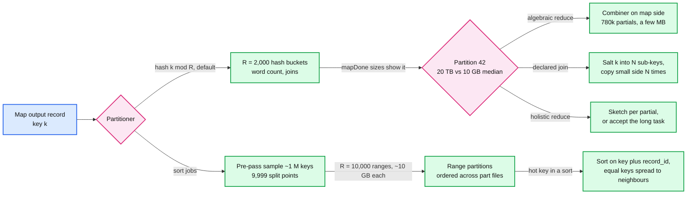

## D11. Failure mode map

One tree: component and failure on the edge, blast radius in the middle, mitigation at the leaf. Red is what breaks first under load. The widest blast radius is a bad release, contained by versioning the framework per job.

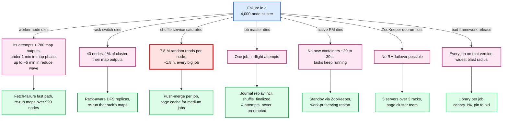

## D12. Rollout from the Hadoop 1 JobTracker

Move nodes, then queues, then features. Every phase can be undone without touching committed output.

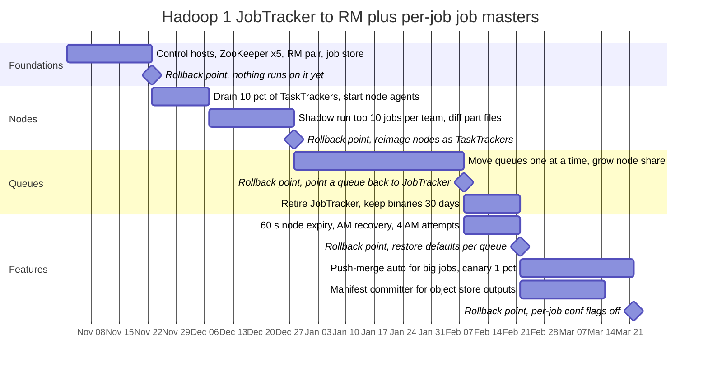

- Rollback never needs a data backfill. A job's output is committed or absent, and each job runs on one framework version. Gantt takes no classDefs, so this one is uncolored.
