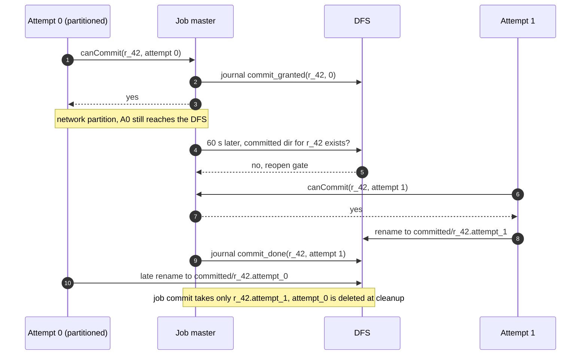
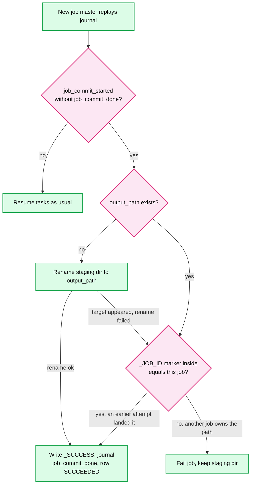
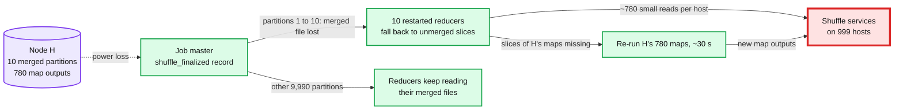
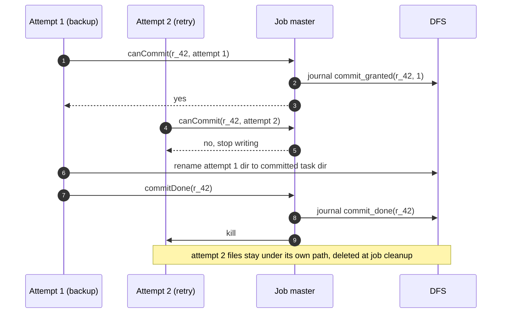

# Edge cases: MapReduce, a distributed batch processing framework

Every entry can be answered out loud in under 60 seconds. Categories follow `hld/CLAUDE.md` §5. The confidence boxes are mine to tick.

Design recap: a resource manager (RM) pair with ZooKeeper, one job master per job with a journal on the distributed file system (DFS), a per-node shuffle service, push-merge for big shuffles, a two-record commit gate (`commit_granted`, `commit_done`), and job commit as one rename of a staging directory. See [`solution.md`](solution.md). Running example: sort 100 TB on 1,000 nodes, M ~780k, R = 10,000, so ~780 map outputs and ~10 reduce attempts per node. Entries marked **Trade-off, accepted:** are costs the design takes on purpose.

## 1. Failure

## Edge case: a worker dies in the middle of the map phase
- **Trigger:** a node loses power 3 min into the ~6 min map phase. It is running 32 maps and holds ~390 completed map outputs.
- **Symptom:** 32 attempts go silent. Reducers that started early get connection refused from that host.
- **Answer:**
  - Detection: 60 s of missed heartbeats, or 3+ reducers on 2+ racks report connection refused. A timeout alone does not count.
  - ~422 tasks (32 running, ~390 completed) go back to pending. They join the remaining ~18 waves, so the job loses ~422 x 15 s of slot time and almost no wall time.
  - Attempts lost with a dead node end `KILLED`, like preempted ones, and do not count toward the 4-attempt limit. A task that lands on 4 dying nodes does not fail the job.
- **Confidence:** [ ] shaky  [ ] ok  [ ] confident

## Edge case: a worker dies after the map phase (the classic question)
- **Trigger:** node H dies during the reduce phase. It holds 780 completed map outputs and ~10 running reduce attempts.
- **Symptom:** many reducers fail to fetch from H. The job master re-runs maps that had already "succeeded".
- **Answer:**
  - Completed maps re-run because their output sat on H's local disk. Committed reduces never re-run because their output is in the DFS with 3 replicas (paper §3.3).
  - The 780 maps spread over 999 nodes, < 1 each, ~30 s. Reducers learn the new hosts through `getMapOutputs`.
  - With push-merge, slices that H's maps pushed to other mergers survive. Only partitions merged on H and unmerged slices need the re-run maps.
  - **Trade-off, accepted:** H's ~10 reduce attempts restart from zero, ~5 min each in the sort. A death late in the reduce wave adds up to ~5 min, ~35% of a 15 min job. The NFR says so: map-phase loss < 10%, a reduce-wave death costs at most one reduce task. To shrink it: R = 50,000 with push-merge (2 GB, ~1 min reducers), or checkpoint merged runs.
- **Confidence:** [ ] shaky  [ ] ok  [ ] confident

## Edge case: a worker dies in the middle of a reduce
- **Trigger:** a reduce attempt is 60% through its merge when its node dies.
- **Symptom:** the attempt disappears. Its partition is now the tail of the job.
- **Answer:**
  - The attempt wrote only under `_temporary/<jm_attempt>/_temporary/<attempt>/`. Nothing is visible, so nothing needs undoing.
  - The new attempt re-fetches its whole partition (10 GB) through the shuffle service. That costs ~1 to 2 min, then ~3 min of merge and write.
  - The rule is 1 to 10 GB per reduce partition, and the sort sits at the top. Smaller partitions make a restart cheaper (R = 50,000 gives ~1 min) at 5x the shuffle blocks, which push-merge absorbs.
- **Confidence:** [ ] shaky  [ ] ok  [ ] confident

## Edge case: a worker dies during the reduce commit
- **Trigger:** attempt 0 of `r_42` gets `canCommit = yes`. Then its node dies, or gets partitioned, before it reports the rename done.
- **Symptom:** the journal has `commit_granted(r_42, 0)` but no `commit_done`. No other attempt may commit while the grant stands.
- **Answer:**
  - The gate keeps the other attempts alive until `commit_done`, so a backup is ready if one exists.
  - If the granted attempt dies, the master checks whether the committed task directory exists. If it does, the master journals `commit_done`. If it does not, the master reopens the gate.
  - A partitioned attempt is not a dead one. It may still finish its rename after the gate reopens. So the committed path carries the attempt id (`committed/r_42.attempt_0`), and job commit takes only the `commit_done` attempt's directory. A late zombie rename lands in its own directory and is never published.
- **Diagram:**

- **Confidence:** [ ] shaky  [ ] ok  [ ] confident

## Edge case: a whole rack goes dark
- **Trigger:** a top-of-rack switch fails. That is 40 nodes, 1% of the cluster, and 4% of the sort's 1,000 nodes.
- **Symptom:** 40 hosts become unreachable at once. Fetch failures spike for one rack. The job master may be among the dead.
- **Answer:**
  - Loss: 40 x 780 = 31,200 map outputs, ~400 reduce attempts and 1,280 slots. The maps re-run in about one wave on the ~30,700 remaining slots, ~15 to 30 s. The 400 reducers re-fetch ~4 TB.
  - Inputs stay readable: rack-aware placement keeps replicas off the rack [unverified: HDFS default puts 2 of 3 replicas on a remote rack].
  - With push-merge, 400 merged partitions (10 per merger) fall back to pull. A job master on that rack restarts from its journal.
  - The shuffle connect timeout is 5 s (Hadoop's default connect and read timeouts are 180 s). Timeouts are retried with backoff, never counted as failures, so fetcher threads do not sit 3 min on a silent host. Hosts that drop packets silently are caught by the 60 s heartbeat expiry. Refused or unreachable from 3 reducers on 2 racks acts sooner.
- **Confidence:** [ ] shaky  [ ] ok  [ ] confident

## Edge case: the job master dies mid-job
- **Trigger:** the job master's node dies at hour 3 of a 6 h job. P ~ 1 - e^(-6/23) ~ 23% per 6 h job.
- **Symptom:** the RM sees `allocate` heartbeats stop. After 60 s (AM expiry, lowered from 600 s) it starts attempt 2.
- **Answer:**
  - Attempt 2 replays the journal: map completions with hosts, `commit_granted` and `commit_done`, and `shuffle_finalized`. It asks shuffle services which outputs they still hold and re-queues only the missing and in-flight tasks.
  - Old map outputs stay fetchable because the shuffle service checks the per-job secret, not `jm_attempt`.
  - Attempt 1's containers are killed. Their tokens and paths carry the old `jm_attempt`, so they can never commit.
  - Cost: in-flight work. During the reduce wave of the sort, that is up to 10,000 reducers restarting, ~5 min. Keeping running containers across job master attempts would save it, at the price of re-issuing tokens.
- **Confidence:** [ ] shaky  [ ] ok  [ ] confident

## Edge case: the job master dies during job commit
- **Trigger:** every reduce is committed. The master journals `job_commit_started` and dies before `job_commit_done`.
- **Symptom:** the job is stuck in `COMMITTING`. A reader that lists `output_path` sees either nothing or a whole output, but no `_SUCCESS` file.
- **Answer:**
  - Job commit on HDFS first builds a `publish/` staging directory from the journal (the `commit_done` attempt of each task, never a directory listing), then does one rename of it to `output_path`, which must not exist. It is atomic: either all R files appear, or none.
  - The new master redoes the commit from the journal. If `output_path` is absent, it renames. If present, it writes `_SUCCESS`.
  - A zombie old master is fenced by the same rename. Only one rename to a missing target can win.
  - On redo the master checks the `_JOB_ID` marker the staging directory carries, so it never adopts another job's output at that path.
- **Diagram:**

- **Confidence:** [ ] shaky  [ ] ok  [ ] confident

## Edge case: the active resource manager dies
- **Trigger:** the RM process crashes, or a GC pause outlasts its ZooKeeper session (~10 s).
- **Symptom:** no new containers for ~20 s. About 2,700/s x 20 s = ~54k launches are deferred.
- **Answer:**
  - The standby wins the leader znode, bumps the epoch, and reads app and queue state. This needs `yarn.resourcemanager.recovery.enabled = true`. The default is false, and without it failover kills every running job.
  - Work-preserving restart: 4,000 node agents and every job master re-register and resend their running containers and asks. Running tasks never stop.
  - A paused old active RM comes back to a newer epoch, and its state-store writes are rejected. Node agents talk only to the RM that holds the lock.
- **Confidence:** [ ] shaky  [ ] ok  [ ] confident

## Edge case: ZooKeeper loses quorum
- **Trigger:** 3 of the 5 ZooKeeper nodes are down, for example two racks plus one disk.
- **Symptom:** no RM can hold or renew the leader lock.
- **Answer:**
  - The active RM stops acting as leader once its session times out (~10 s). It cannot tell "ZooKeeper has no quorum" from "I am cut off and someone else won". So it must step down. No new containers are granted anywhere in the cluster.
  - Running containers and job masters keep working. Jobs slow down as tasks finish and no new ones start. Submits still land in the job store and wait. This pages the cluster team immediately.
  - The 5 ZooKeeper nodes sit in 5 racks and 5 power domains, so losing quorum takes 3 independent failures.
- **Confidence:** [ ] shaky  [ ] ok  [ ] confident

## Edge case: a merger is lost after finalize
- **Trigger:** node H is a merger for partitions 1 to 10 of the sort. It dies after `shuffle_finalized` is journaled.
- **Symptom:** the reducers for partitions 1 to 10 cannot open their merged files. Those reducers ran on H, so they die too.
- **Answer:**
  - Fallback is best effort, as in Magnet. The 10 restarted reducers fetch unmerged slices: 780k per partition, ~780 per host. Over 10 partitions that is ~7,800 small reads per host, ~6.5 s of seeks.
  - H's own 780 map outputs are gone too, so those maps re-run (~30 s). Every other partition's merged file already holds H's slices.
  - A reducer that had consumed part of a merged file must know which maps' slices it already has (chunk-level bitmaps) or restart its fetch cleanly.
- **Diagram:**

- **Confidence:** [ ] shaky  [ ] ok  [ ] confident

## Edge case: the job store or the DFS metadata service is down or slow
- **Trigger:** a failover of the job store primary (~30 s), or a failover of the DFS metadata service.
- **Symptom:** `POST /jobs` and `GET /jobs` fail, or task reads stall.
- **Answer:**
  - Job store down: submit and status fail, which spends the 99.9% budget. Running job masters do not need the job store to run. They retry their final state update.
  - DFS metadata down: tasks block on open and rename. The job master cannot journal, so it holds every `canCommit` reply. It must never say yes before the grant is journaled. Jobs pause and do not fail, as long as a failover takes less than the 600 s task timeout.
- **Confidence:** [ ] shaky  [ ] ok  [ ] confident

## 2. Consistency

## Edge case: a backup and a retry race to commit
- **Trigger:** `r_42` attempt 0 is slow, so the speculation loop launches backup attempt 1. Attempt 0 then crashes, and the retry loop launches attempt 2.
- **Symptom:** three attempts of one task are alive, and all can write.
- **Answer:**
  - Every attempt writes only under its own attempt path. The first `canCommit` wins, and the grant is journaled before the reply.
  - Losers are told to stop and are killed after `commit_done`. Their files are never listed.
  - Counters come only from the committed attempt, so they are exact.
- **Diagram:**

- **Confidence:** [ ] shaky  [ ] ok  [ ] confident

## Edge case: a zombie reducer after a network partition
- **Trigger:** a node is cut off from the job master but can still reach the DFS. Its reducer keeps writing.
- **Symptom:** after 60 s the master starts a new attempt, which commits. The zombie later finishes and asks to commit.
- **Answer:**
  - The zombie gets "no". The task already has a granted attempt, or the zombie carries an old `jm_attempt` in its path and token.
  - Its 10 GB x 3 replicas of temp files sit under its attempt path. They are never published and are deleted at job cleanup.
- **Confidence:** [ ] shaky  [ ] ok  [ ] confident

## Edge case: a duplicate or late `mapDone`
- **Trigger:** a map and its speculative backup both finish. Or a host that was marked lost comes back, and its old attempt reports `mapDone`.
- **Symptom:** the master holds two locations for one map task.
- **Answer:**
  - The first `mapDone` wins and later ones are ignored (paper §3.3). Reducers fetch only the recorded attempt.
  - `mapDone` is accepted only from attempts still `RUNNING` in the task table, so reducers are never pointed back at a flapping host.
  - The host comes from the container record, not from the message. Optionally keep the ignored copy as a spare location, which saves a re-run if the winner's host dies.
- **Confidence:** [ ] shaky  [ ] ok  [ ] confident

## Edge case: a non-deterministic map
- **Trigger:** `map` samples with an unseeded random number, or reads the clock. A node loss re-runs it.
- **Symptom:** reducer 1 read attempt 0's output and reducer 2 read attempt 1's. The output matches no single run, which the paper calls "weaker semantics".
- **Answer:**
  - Declared with `conf.map.deterministic = false`: map output goes to the DFS with 2 replicas and is never recomputed. Push-merge is forced off for the job, because a merger might keep a slice from a different attempt.
  - Undeclared: the framework cannot see it. A cheap detector is to compare per-partition checksums whenever a map and its backup both finish. A mismatch flags the job.
  - The rule for users: seed randomness from the task id. Never call an outside service from `map`.
- **Confidence:** [ ] shaky  [ ] ok  [ ] confident

## Edge case: a partitioner that is not stable across processes
- **Trigger:** a Python user partitions with `hash(key) % R`. Python randomizes string hashing per process [unverified], so map tasks disagree about where "the" goes.
- **Symptom:** nothing fails. The output has the key "the" in several `part-*` files, each with a partial count.
- **Answer:**
  - The framework provides a stable hash of the serialized key bytes (the MIT lab uses an FNV-based `ihash`) and rejects language-default hashing.
  - It checks that `0 <= p < R` for every record and fails the task with a clear error otherwise.
- **Confidence:** [ ] shaky  [ ] ok  [ ] confident

## Edge case: a fetch failure caused by the reducer's side
- **Trigger:** one reducer's NIC is flapping, or a reducer's rack uplink is saturated.
- **Symptom:** "fetch failed" reports name many healthy map hosts.
- **Answer:**
  - Only connection refused or unreachable counts, and only from 3+ reducers on 2+ racks. A bad reducer, or a bad reducer rack, cannot condemn a healthy host alone.
  - Timeouts back off and retry. Re-running healthy maps would add load to the red node.
  - A reducer that fails against > 10% of hosts [estimate] should declare itself unhealthy and restart elsewhere.
- **Confidence:** [ ] shaky  [ ] ok  [ ] confident

## 3. Scale

## Edge case: a hot key
- **Trigger:** "the" is ~7% of all words. Or one customer holds 20% of the orders in a join.
- **Symptom:** one reducer runs for hours. `mapDone` sizes show partition 42 at 20 TB while the median is 10 GB.
- **Answer:**
  - At ~33 MB/s per reducer (10 GB in ~5 min), 20 TB takes ~7 days. Speculation cannot help, because a copy is just as slow.
  - Algebraic reduce: the combiner shrinks it to 780k partial counts. Sort: range-partition on (key, record_id), because a sample on the key alone keeps a hot key in one partition. Under push-merge, skewed blocks are not pushed, so they stay splittable by map range.
  - Declared join: salt the hot key into N sub-keys and copy the small side N times. Split partitions larger than 5x the median and 256 MB, as Spark's adaptive execution does.
- **Confidence:** [ ] shaky  [ ] ok  [ ] confident

## Edge case: a hot partition from a bad custom partitioner
- **Trigger:** the user partitions by the first letter of the key. Only 26 of 2,000 partitions get data.
- **Symptom:** 26 reducers each take ~77x the median. 1,974 reducers finish empty.
- **Answer:**
  - The job master projects partition sizes from the first ~10% of map statuses (~7,800 for M = 78k) and holds back reducers for projected-skewed partitions. Waiting until the map phase ends is too late.
  - Fail fast with "26 of 2,000 partitions non-empty", or warn the job owner and continue. That saves hours.
- **Confidence:** [ ] shaky  [ ] ok  [ ] confident

## Edge case: a reducer runs out of memory on a huge key
- **Trigger:** `reduce` collects all values for one key into a list. That key holds 10 GB, and the container has 3 GB.
- **Symptom:** the reducer is OOM-killed (out of memory) 4 times, then the job fails after ~20 min of re-fetch and merge.
- **Answer:**
  - The framework streams values, so the bug is in user code. The fix is a secondary sort: put the sort field in the key and group by the prefix.
  - Fail fast after 2 OOMs in the same key group. The job master knows the key from the attempt's status.
  - Skip mode for reduce groups exists (`mapreduce.reduce.skip.maxgroups`, off by default) but drops the key. It is acceptable only for counting jobs.
- **Confidence:** [ ] shaky  [ ] ok  [ ] confident

## Edge case: slowstart reducers hold slots, and the map/reduce deadlock
- **Trigger:** a pull-shuffle job starts 10,000 reducers at 5% of maps (~18 s in). Later a node loss needs re-run maps while the queue is at max share.
- **Symptom:** the map phase runs on 22,000 slots instead of 32,000, 6 min becomes ~9 min. Then the re-run maps get no container, and the reducers wait forever.
- **Answer:**
  - Slowstart is 0.8 for big pull jobs and 1.0 with push-merge, where reducers launch at finalize next to their merged partition.
  - Deadlock breaker: when map asks go unmet with no headroom, the job master preempts its own reducers (`reducer.preempt.delay.sec` = 0, unconditional after 300 s).
- **Confidence:** [ ] shaky  [ ] ok  [ ] confident

## Edge case: a reducer is preempted mid-fetch
- **Trigger:** queue `ads` is below its 20% share for 45 s. The RM asks Search to give back containers, waits a 10 s grace, then kills.
- **Symptom:** a Search reducer that had fetched 6 of its 10 GB disappears.
- **Answer:**
  - Victim order: never a job master, never a `COMMIT_PENDING` or commit-granted attempt, maps before reduces, youngest first. A reducer is the last choice because a restart re-fetches 10 GB (~1 to 2 min).
  - The attempt ends `KILLED`. It does not count toward 4 attempts, and its broken streams are not fetch failures.
  - Livelock risk: a long reducer preempted again and again never finishes. Prefer to yield containers whose tasks made little progress, as the YARN paper suggests for work-preserving preemption.
- **Confidence:** [ ] shaky  [ ] ok  [ ] confident

## Edge case: 10x the jobs tomorrow
- **Trigger:** a new team moves its hourly pipelines here: 1 M jobs/day, ~120 submits/s at peak, mostly small.
- **Symptom:** job master launch overhead dominates. Queue wait p95 climbs.
- **Answer:**
  - Reference point: Yahoo! sustained 125k jobs/day and peaked near 150k on 2,500 nodes (YARN paper), ~60 per node per day. 1 M on 4,000 nodes is ~250 per node per day.
  - The job store handles 120 writes/s easily. The cost is one job master container per job: cap job masters at ~10% of each queue, use container reuse, and use uber mode under 9 maps.
  - If tasks also grow 10x (~27k launches/s), one RM is past its comfort zone. Federate into sub-clusters behind a router. Push jobs with under ~10 s of work to the query engine.
- **Confidence:** [ ] shaky  [ ] ok  [ ] confident

## Edge case: an input of 1 M files of 1 KB each
- **Trigger:** a logging job writes one file per request into one directory: 1 GB in total.
- **Symptom:** the job creates 1 M map tasks and takes longer than the 10 TB word count.
- **Answer:**
  - One split per file means ~1 M container launches at 1 to 2 s each [estimate]. That is ~370 s of the whole cluster's peak launch rate, for 1 GB of data.
  - 1 M files also sits near the DFS per-directory limit (`dfs.namenode.fs-limits.max-directory-items` = 1,048,576).
  - Small files are combined into ~128 MB splits grouped by host and rack (as Hadoop's CombineFileInputFormat does): 8 map tasks. Jobs whose average split is < 1 MB are rejected with that advice.
- **Confidence:** [ ] shaky  [ ] ok  [ ] confident

## 4. Data

## Edge case: one record crashes `map` every time
- **Trigger:** a malformed record makes the parser segfault or throw an exception, every time it is read.
- **Symptom:** the same task fails on every node and the job dies after 4 attempts.
- **Answer:**
  - Skip mode starts after 2 failed attempts (`mapreduce.task.skip.start.attempts` = 2). The task reports the record range it is processing. The paper sends a "last gasp" UDP packet with the record's sequence number. The next attempt skips it.
  - Skipped records go to `_logs/skip` and to a counter. Each attempt costs ~15 s, so skipping a record costs ~1 min.
  - Skipping is capped: past an absolute or percentage limit the job fails (Hadoop's `skip.maxrecords` default 0 means off, so we set it).
- **Confidence:** [ ] shaky  [ ] ok  [ ] confident

## Edge case: the input schema changes
- **Trigger:** at 02:00 an upstream producer turns `price` from an int into a string. Today's input mixes both versions.
- **Symptom:** every new record crashes `map`, or worse, parses into nulls.
- **Answer:**
  - Use self-describing formats (Avro, Parquet) that carry the writer's schema in each file. The input format resolves the writer schema to the reader schema per split, so mixed files are fine.
  - Producers register schemas, and the registry rejects incompatible changes before any data lands.
  - Without the skip cap above, skip mode would silently drop every new record and the job would "succeed".
- **Confidence:** [ ] shaky  [ ] ok  [ ] confident

## Edge case: the input changes or disappears during the job
- **Trigger:** a retention job deletes yesterday's input partition at hour 3 of a 6 h job. Or a file is rewritten in place.
- **Symptom:** a node loss forces a map re-run, which fails with "file not found" 4 times, and the job dies. A rewritten file makes a re-run produce different output.
- **Answer:**
  - Input is pinned at split time: a DFS snapshot, or a table version. Splits name (path, offset, length, file version).
  - Retention defers deletes of files that a running job references.
  - Without pinning, "deterministic re-execution" could break with no user bug. With it, a re-run reads the same bytes.
- **Confidence:** [ ] shaky  [ ] ok  [ ] confident

## Edge case: the output path already exists
- **Trigger:** a re-run or backfill of yesterday's job. Or two different jobs that name the same `output_path`.
- **Symptom:** the submit is rejected, or two jobs race to own the path.
- **Answer:**
  - `POST /jobs` fails fast if the path exists. Job commit renames into a path that must not exist, so a second job's commit fails instead of mixing two outputs.
  - Backfill writes to a new versioned path (`/out/2026-10-02/v2`) and flips a pointer, or does an atomic overwrite in a table format.
  - The submit check alone is time-of-check to time-of-use, so `output_path` is also reserved in the job store, unique among active jobs. The second job is rejected at submit, not after hours of work.
- **Confidence:** [ ] shaky  [ ] ok  [ ] confident

## Edge case: output goes to S3
- **Trigger:** the cluster writes to an object store where rename is a copy plus a delete: O(bytes) and not atomic.
- **Symptom:** a v1 rename commit of 100 TB would copy 100 TB at job commit and could be seen half done.
- **Answer:**
  - Manifest commit: attempts write to the final prefix under unique names, task commit writes a task manifest, and job commit writes one job manifest with `If-None-Match: *`. Exactly one job master attempt wins. A cleaner deletes unlisted files after a day.
  - Attempt files go under an `_attempts/` prefix, which input formats hide. A directory-listing reader therefore sees nothing at all, neither zombie files nor the real output, so the manifest path is only for manifest-aware or table-format readers ([`../delta-lake-transactions/`](../delta-lake-transactions/)). Jobs whose readers list directories on S3 use the S3A magic committer instead.
- **Confidence:** [ ] shaky  [ ] ok  [ ] confident

## Edge case: a GDPR delete for one user
- **Trigger:** user X asks to be erased, within a 30-day legal deadline [estimate].
- **Symptom:** X's rows sit in thousands of immutable `part-*` files from hundreds of jobs.
- **Answer:**
  - Delete at the source first. Otherwise the next run of any job rebuilds X's data from raw input.
  - Use lineage from the job store (input paths to output path) to find derived outputs. Rewrite only the affected files and commit a new manifest, or use deletion vectors in Delta or Iceberg.
  - Intermediate data dies with the job (~1 h). Logs and journals need their own retention of a few days, under the 30-day window.
- **Confidence:** [ ] shaky  [ ] ok  [ ] confident

## Edge case: output storage growth over 3 years
- **Trigger:** 1 PB/day of output x 3 replicas = 3 PB/day of new raw bytes, ~0.75 TB per node per day.
- **Symptom:** the DFS fills up long before anyone expected. The "DFS > 85%" alert fires.
- **Answer:**
  - 96 TB per node ÷ 0.75 TB/day = ~128 days to fill all raw disk with output alone. One year of retention is ~274 TB per node, ~285% of raw.
  - Give outputs a time to live (TTL) by class: chained intermediate outputs 7 days, published datasets longer. Erasure-code cold output (1.5x instead of 3x). Tier old output to an object store.
  - Raw disk fills in ~128 days, so retention is a design input, not an afterthought.
- **Confidence:** [ ] shaky  [ ] ok  [ ] confident

## 5. Operations

## Edge case: what pages at 3am
- **Trigger:** any one of the alert conditions below.
- **Symptom:** the on-call phone rings.
- **Answer:**
  - Pages: no active RM for 60 s. Cluster fetch failure rate > 1% for 10 min (usually one rack or a shuffle service bug). Infra job failure rate > 2x baseline for 30 min. DFS > 85%. ZooKeeper quorum lost.
  - Does not page: one user job failing, or one node dying (auto-drained and ticketed).
- **Confidence:** [ ] shaky  [ ] ok  [ ] confident

## Edge case: a bug in a framework release
- **Trigger:** a new job master library sorts keys wrongly for one type. Or a new shuffle service corrupts reads.
- **Symptom:** jobs succeed, but their output is wrong. A success-rate canary does not notice.
- **Answer:**
  - The job master library is per job: canary 1% of jobs, plus shadow runs of each team's top jobs with a checksum diff of `part-*` files. Rollback means pinning jobs to the old version.
  - The library version is pinned for the whole job, including job master restarts, so a new attempt never replays an old journal with a new format.
  - The shuffle service is a cluster daemon, not a per-job library, so its blast radius is every job. Roll it out one rack at a time, with a versioned fetch protocol.
- **Confidence:** [ ] shaky  [ ] ok  [ ] confident

## Edge case: restarting the shuffle service for an upgrade
- **Trigger:** rolling upgrade of the node agent and shuffle service across 100 racks.
- **Symptom:** every restart looks like a node loss. Reducers get connection refused, and ~780 maps per job on that node re-run.
- **Answer:**
  - The shuffle service persists job secrets and registered app state on local disk, so map outputs stay servable after a restart. Reducers retry fetches for 30 s (`fetch.retry.timeout-ms` = 30000) instead of reporting a failure.
  - Hadoop ties fetch retry to `yarn.nodemanager.recovery.enabled`, which defaults to false. We turn it on.
  - So the shuffle service restarts in place in seconds, with no draining. Draining would take hours per rack with 6 h jobs, and weeks for 100 racks.
- **Confidence:** [ ] shaky  [ ] ok  [ ] confident

## Edge case: a black-hole node
- **Trigger:** a node's disk mount went read-only, but its heartbeats are healthy. Every task fails there in ~1 s.
- **Symptom:** that node frees slots fastest, so the scheduler keeps feeding it. Many jobs see sudden task failures.
- **Answer:**
  - Per-job blocklisting kicks in after 3 failures (`maxtaskfailures.per.tracker` = 3). But 1,000 jobs x 3 is 3,000 burned attempts, and a task that lands there 4 times fails its job.
  - Cluster-wide node health: the RM marks a node unhealthy when its failure rate across jobs passes a threshold, or when a node health script fails. Then it drains the node and opens a ticket.
- **Confidence:** [ ] shaky  [ ] ok  [ ] confident

## Edge case: migrating from the old single-JobTracker cluster
- **Trigger:** moving 4,000 nodes and every team from Hadoop 1 to this design.
- **Symptom:** the risk is a team's output changing silently.
- **Answer:**
  - Phase 1: RM and node agents on 10% of nodes. Phase 2: move queues one at a time, after a shadow run of each team's top 10 jobs with a `part-*` checksum diff. Phase 3: retire the JobTracker.
  - Rollback per queue means pointing the queue back. Outputs are per job, so nothing needs a backfill.
- **Confidence:** [ ] shaky  [ ] ok  [ ] confident

## 6. Security and abuse

## Edge case: a malicious job reads another job's shuffle data
- **Trigger:** a task in job A asks the shuffle service on its node for job B's map output.
- **Symptom:** none if the design holds. Otherwise, a data leak across teams.
- **Answer:**
  - Every fetch carries an HMAC (a keyed hash) made with B's per-job secret, which A never sees, so the shuffle service refuses A.
  - Containers run as the submitting user, and each job's local map output directory is `0700`, so A cannot read B's files from disk. Pushes to mergers carry the target job's HMAC, and mergers key files by (job, shuffle, partition), so A cannot append forged slices to B's merged partition.
- **Confidence:** [ ] shaky  [ ] ok  [ ] confident

## Edge case: a user sets R = 1,000,000
- **Trigger:** "more reducers is faster" on a 10 TB job (M = 78k).
- **Symptom:** 7.8e10 blocks of ~128 bytes, 1 M output files, and the job master's memory explodes.
- **Answer:**
  - The empty-block bitmap alone is 1 M bits = 125 KB per map, x 78k maps = ~9.75 GB in a 16 GB job master. 1 M files also hits the DFS per-directory limit of 1,048,576.
  - Submit rejects R above the cap (100k) and suggests 1 to 2 GB per partition: R ~ 5,000 to 10,000 here.
  - An R cap alone is not enough: R = 100k with M = 780k gives the same ~9.75 GB. So the job service also caps M x R (e.g. 10 B pairs) and sets a minimum bytes per partition.
- **Confidence:** [ ] shaky  [ ] ok  [ ] confident

## Edge case: a tenant floods its job master or the cluster
- **Trigger:** task code sends a forged `mapDone` host, a million distinct counters, or a status RPC every millisecond. Or a script submits 10k jobs at once, or one job tries to write 1 PB.
- **Symptom:** a job master slows down or runs out of memory. Other queues wait. Disks fill.
- **Answer:**
  - The host comes from the container record, not the message. Counters are capped at 120 per job (`mapreduce.job.counters.max`). Status RPCs are rate-limited per attempt. Per-job tokens keep the blast radius to one job.
  - Submits are rate-limited per user. Each queue has a max share and a running-job cap. Job master containers are capped at ~10% of each queue, so masters cannot fill it while waiting for task containers.
  - A per-queue DFS quota bounds output. A quota error is not retryable: fail the job at once, not after 4 attempts x 10,000 reducers.
- **Confidence:** [ ] shaky  [ ] ok  [ ] confident
