# HLD: MapReduce, a distributed batch processing framework

> One-line answer: a resource manager (active plus standby, state in ZooKeeper) hands containers to one **job master per job**; the job master cuts the input into ~128 MB splits and runs one map task per split on a node holding a replica; each map task sorts its output by (reduce partition, key) into **one file plus an index** on local disk, served by a **per-node shuffle service** that outlives the task; reduce tasks pull their slice of every map output (big jobs instead read one **merged file per partition** that map tasks pushed), merge-sort it, run `reduce`, and write to a private temp file that becomes visible only through a **commit the job master grants to exactly one attempt**; failures cost re-execution (a lost node costs the map outputs it held, never committed output), slow machines get **backup copies** of the last tasks, and the thing that breaks first at scale is the **shuffle: M x R small random reads**.

Sources: MapReduce (Dean and Ghemawat, [OSDI 2004](https://static.googleusercontent.com/media/research.google.com/en//archive/mapreduce-osdi04.pdf)), YARN ([SoCC 2013](https://www.cse.ust.hk/~weiwa/teaching/Fall15-COMP6611B/reading_list/YARN.pdf)), LATE ([OSDI 2008](https://www.usenix.org/legacy/event/osdi08/tech/full_papers/zaharia/zaharia.pdf)), delay scheduling ([EuroSys 2010](https://people.csail.mit.edu/matei/papers/2010/eurosys_delay_scheduling.pdf)), Mantri ([OSDI 2010](https://www.usenix.org/legacy/event/osdi10/tech/full_papers/Ananthanarayanan.pdf)), Riffle ([EuroSys 2018](https://www.cs.princeton.edu/~mfreed/docs/riffle-eurosys18.pdf)), Magnet ([VLDB 2020](https://www.vldb.org/pvldb/vol13/p3382-shen.pdf)), [MIT 6.5840 Lab 1](https://pdos.csail.mit.edu/6.824/labs/lab-mr.html), Hadoop defaults read from [`mapred-default.xml`](https://hadoop.apache.org/docs/stable/hadoop-mapreduce-client/hadoop-mapreduce-client-core/mapred-default.xml) and [`yarn-default.xml`](https://hadoop.apache.org/docs/stable/hadoop-yarn/hadoop-yarn-common/yarn-default.xml), Spark defaults from the [configuration page](https://spark.apache.org/docs/latest/configuration.html). No Hello Interview write-up exists for this problem, so the requirement list is composed from the paper and the systems that followed it. Written flow-first: §4 builds one diagram one functional requirement at a time, §5 breaks and mutates it one non-functional requirement at a time, §6 shows the final design and six flows to rehearse. Raw notes and spot-check corrections in [`research/`](research/).

---

## 1. Understanding the problem

Restate before designing. The data already sits in a distributed file system (GFS, HDFS) on the same machines that will compute ([`../distributed-file-system/`](../distributed-file-system/)). We build the layer that turns two user functions into a job on thousands of machines. Three facts shape every decision:

1. **The user writes two pure functions and nothing else.** `map(k1, v1) -> list(k2, v2)` and `reduce(k2, list(v2)) -> list(v3)`. Because the framework knows they have no side effects, it may run any piece of work twice, anywhere, at any time. Every fault-tolerance and straggler trick in this design rests on that one freedom.
2. **Failures are routine, not exceptional.** In August 2004 Google's MapReduce jobs averaged 157 workers, 634 s, and **1.2 worker deaths per job** (OSDI 2004, Table 1). A design that treats a dead machine as an emergency will not finish a job.
3. **The network is the scarce resource, and the shuffle is the only phase that must cross it.** Map reads can be local (the split is on this disk). Reduce writes go to the file system. But grouping by key is all-to-all: every map task talks to every reduce task.

### 1.1 Functional requirements

Core:
1. **Submit a job and get its output.** The user submits map and reduce functions (plus optional combiner and partitioner), input path, output path, and R (number of reduce partitions). They can poll progress and counters, and kill the job. Output is R files, visible all at once.
2. **Run the map phase in parallel, close to the data.** Split the input, run one map task per split on many machines, prefer machines that already store the split.
3. **Group by key across machines (shuffle) and run the reduce phase.** Every value for a key reaches the same reduce task. Keys arrive sorted within a partition.
4. **Survive failure.** Worker death, task crash, a slow machine and master death do not fail the job in the common case, and never produce duplicate or partial output.
5. **Share the cluster between teams.** Many jobs at once. Each team gets its guaranteed share. A small job is not stuck behind a 500 TB job.

Below the line: the distributed file system (problem #3, we read splits and replica locations from it and write output through it); a general DAG engine, SQL, in-memory caching between jobs, iterative ML (that is Spark, problem #17; users chain MapReduce jobs with a workflow scheduler, problem #6); streaming; exactly-once side effects from inside user code, such as writes to an outside database (the user makes those idempotent, as the paper says in §4.5).

### 1.2 Non-functional requirements

Ask for scale first. There is no published rubric ([`research/interview-framing-survey.md`](research/interview-framing-survey.md)), so these are chosen to make the 2004 paper's design visibly break in two places (the shuffle and the single master) and then get fixed.

| Dimension | Target | Why this number |
|---|---|---|
| Cluster | 4,000 nodes, each 32 vCPU, 128 GB RAM, 12 x 8 TB HDD, 25 Gbps NIC. Racks of 40, 2.5:1 oversubscribed to the spine | About 4,000 nodes "used to be the largest cluster's size before YARN" at Yahoo! ([YARN paper](https://www.cse.ust.hk/~weiwa/teaching/Fall15-COMP6611B/reading_list/YARN.pdf) §4.1), the limit of one JobTracker per cluster. HDD because shuffle and DFS bytes are cheap there, and because that is where the shuffle hurts (§5.1) |
| Load | 100k jobs/day, peak ~12 submits/s. 10 PB read, 3 PB shuffled, 1 PB written per day | Ratios from Google's 2004 table: intermediate was 23% of input, output 6% (Table 1). We round up because modern jobs join more |
| Job mix | 90% small (≤ 50 GB), 9.5% medium (50 GB to 10 TB), 0.5% large (10 to 500 TB) | Count is dominated by small jobs, bytes by large ones (§2) [estimate] |
| Throughput | Sort 100 TB on 1,000 nodes in under 30 min | Spark's 2014 record did 100 TB in 23 min on 206 nodes with SSDs ([Databricks](https://www.databricks.com/blog/2014/11/05/spark-officially-sets-a-new-record-in-large-scale-sorting.html)). We have 5x the nodes and HDDs |
| Latency | Not interactive. Submit to first task running < 5 s when the queue has room. A 5 GB job finishes in < 1 min | Google's 1 TB grep spent "about a minute of startup overhead" (§5.2). We want small jobs not to pay that |
| Fault tolerance | Any number of worker deaths. Losing 10% of workers during the map phase adds < 10% to run time. A death during the reduce wave costs at most one reduce task's length (~5 min in the 100 TB sort). Simulated expectation for the sort: ~13.6 deaths per run, +347 s (+44%), or +84 s with R = 50,000 under push-merge. A job master restart keeps all completed work | Killing 200 of 1,746 workers added 5% to the sort (§5.5) |
| Stragglers | One slow node adds < 10% to job time. Backup tasks cost < 5% extra compute | Without backup tasks the sort took 44% longer (§5.4); backups cost "no more than a few percent" (§3.6) |
| Correctness | Deterministic functions: output equals one failure-free sequential run. Output appears all at once or not at all. Counters exact | The paper's semantics (§3.3) |
| Sharing | Each queue gets its guaranteed share back within 60 s. Cluster CPU utilisation > 70% | Preemption fires at 45 s plus a 10 s grace, §4.5 |
| Availability | Submit and status API 99.9%. Resource manager failover < 30 s without killing running jobs | Batch tolerates a minute of control-plane blip. It does not tolerate losing 6 hours of a running job |

Below the line: sub-second jobs (use a query engine), a global order across all R output files without a sampling pre-pass (§5.3 shows the pre-pass), geo-distributed jobs across regions.

---

## 2. Back-of-envelope

**Cluster totals.** 4,000 x 32 = **128k vCPU**, 4,000 x 128 GB = 512 TB RAM, 4,000 x 96 TB = 384 PB raw HDD (128 PB usable at 3 replicas). Per node, 12 disks at ~150 MB/s sequential = **1.8 GB/s**, but only ~12 x 100 = **~1,200 random reads/s** [estimate, 7,200 rpm HDD]. NIC 25 Gbps = ~3 GB/s.

**Is 10 PB/day the right size for 4,000 nodes?** Google's 2004 table gives 3,288 TB of input over 79,186 machine-days: 3,288 TB ÷ (79,186 x 86,400 s) = **~0.5 MB/s of input per machine**, everything included (user code, sort, shuffle, idle tails). Our nodes have ~8x the cores of a 2004 dual Xeon. 10 PB ÷ 86,400 s ÷ 4,000 = **~29 MB/s of input per node**, ~0.9 MB/s per vCPU. Real map functions do far more than the sort's 15 s of read, sort and write: parsing, decompression, lookups, user logic. Assume an **average map task of ~60 s** for 128 MB [estimate]. Then 78 M maps x 60 s = 4.7 B task-seconds per day against 128k x 86,400 = 11 B vCPU-seconds, ~43% of the cluster for maps alone. Reduces, shuffle merges and job masters bring it to ~65 to 75%, which is the utilization target. If maps were all as light as the sort's, 10 PB/day would leave the cluster ~90% idle.

**Control plane.**
- 100k jobs/day ÷ 86,400 = ~1.2 submits/s, peak 10x = **~12 submits/s**. Trivial.
- Tasks: 10 PB ÷ 128 MB = **~78 M map tasks/day**, ~900/s on average, ~2,700/s at a 3x peak. Every task is a scheduling decision, a container launch, a status stream and a completion event. This, not job submits, is the control-plane load.
- Node heartbeats: 4,000 nodes x 1/s = 4,000 heartbeats/s to whoever allocates containers (YARN default heartbeat 1,000 ms).

**The large job used everywhere below: sort 100 TB on 1,000 nodes (25% of the cluster).**
- Map tasks: 100 TB ÷ 128 MB = **~780k**. Map slots: 1,000 nodes x 32 = 32,000, so ~24 waves. At ~15 s per task (read 128 MB, sort, write 128 MB), the map phase is ~6 min. Disk per node: 100 GB read plus 100 GB written in 6 min = ~0.55 GB/s, under the 1.8 GB/s budget.
- Reduce tasks: R = **10,000**, so each reduce partition is 10 GB. One wave on 32,000 slots.
- Shuffle blocks: M x R = 780k x 10k = **7.8 billion blocks** of 100 TB ÷ 7.8 B = **~12.8 KB** each.
- Per node, the shuffle service must serve 7.8 B ÷ 1,000 = **7.8 M random reads**. At ~1,200 random reads/s that is ~6,500 s = **~1.8 hours**. The same 100 GB read sequentially takes 100 GB ÷ 1.8 GB/s = **55 s**. Seeks make the shuffle **~100x slower than the bytes require**. The page cache helps only partly: 128 GB RAM minus ~80 GB of task heaps leaves ~40 GB for 100 GB of map output, so most reads still hit disk. **This is the red node** (§5.1).
- Network: 100 GB in and out per node at ~3 GB/s is ~33 s. Across racks: 25 racks of 40 nodes, each rack sends ~4 TB out through 400 Gbps (50 GB/s) of uplink = ~80 s. Bandwidth is fine. Seeks are not.
- Output: 100 TB x 3 replicas = 300 TB written. Per node, 300 GB at a shared ~1 GB/s = ~5 min. Erasure-coded output (1.5x) would halve it, as the paper itself notes (§5.3).
- Master memory: the paper's master keeps ~1 byte per (map, reduce) pair (§3.5). 7.8 B pairs = **7.8 GB** in one process just for sizes. That is the second thing that breaks (§5.5).

**Failure rate at this size.** Google's 1.2 deaths per job over 157 workers x 634 s is one death per ~23 worker-hours (it includes preemptions by the cluster scheduler, not only hardware). Our sort uses 1,000 nodes for ~0.25 h = 250 worker-hours, so expect **~11 worker deaths per run**. Each one must be cheap.

**Small job.** 5 GB is 40 map tasks and a few reduces. With one container launch per task (~1 to 2 s of JVM start [estimate]) and a job master to start, overhead dominates the ~10 s of real work. §4.5 gives small jobs a fast path.

**Storage for intermediate data.** 3 PB shuffled per day. Map output lives until its job commits, ~1 h for the big jobs, so ~3 PB x 1/24 = ~125 TB in flight = ~31 GB per node. Capacity is not the problem.

---

## 3. The set-up

Product-style. The user is an engineer or a workflow scheduler submitting jobs to a shared cluster.

### 3.1 Core entities

| Entity | What it is |
|---|---|
| Job | One MapReduce run: functions, input, output, R, queue, state, counters. Owns one job master |
| Split | A byte range of the input, ~128 MB, aligned to a DFS block, with the hosts that store a replica of it |
| Task | One unit of work: a map task per split, a reduce task per partition. Has a state and 1..N attempts |
| Task attempt | One execution of a task in one container on one node. Retries and backups are new attempts of the same task |
| Map output | What a map attempt wrote: one data file sorted by (partition, key) plus an index of R offsets, on the node's local disk. Its location and per-partition sizes live in the job master |
| Partition | One of R key ranges or hash buckets. Reduce task i owns partition i and writes output file `part-i` |
| Container | A slice of one node (vCPU, memory) granted by the resource manager to one job master |
| Queue | A team's share of the cluster: guaranteed capacity, maximum capacity, users allowed |
| Counter | A named number, one set per task taken from the attempt the job master accepted, replaced if the task re-runs (records in, bytes out, user counters) |

### 3.2 API

| Call | Semantics |
|---|---|
| `POST /jobs {name, queue, artifact_uri, mapper, reducer, combiner?, partitioner?, input_paths, input_format, output_path, num_reduces, conf, request_id}` | Submit. `request_id` makes a retried submit return the same `job_id`. Fails fast if `output_path` exists or is reserved by another active job (a unique row in the job store), so a re-run never mixes with an old output and a duplicate finds out at submit, not after hours of work. Input is pinned at split time (a DFS snapshot or table version), so retention or an in-place rewrite cannot change what a re-run reads |
| `GET /jobs/{id}` | State, map and reduce progress %, counters, start and finish times, tracking URL |
| `GET /jobs/{id}/tasks?type=map&state=failed` | Attempts with node, error and log links |
| `POST /jobs/{id}/kill` | Kills all attempts, discards temp output. The output path stays absent |
| `GET /queues/{name}` | Guaranteed, used and pending capacity |

Internal calls that matter:
- `RM.allocate(asks[{resources, locality: [hosts, racks, any], priority}], releases) -> containers` from the job master every second. Heartbeat-style, so it doubles as the job master's liveness signal.
- `JobMaster.heartbeat(attempt_id, progress, counters) -> {continue | kill}` from each task.
- `JobMaster.mapDone(attempt_id, host, sizes[R])` and `JobMaster.getMapOutputs(job_id, since_event) -> [(map_id, host, attempt_id)]` (Hadoop calls these task completion events).
- `JobMaster.canCommit(attempt_id) -> yes | no`: the single gate that makes output exactly-once (§4.4).
- `ShuffleService.fetch(job_id, [map_ids], partition, token) -> stream`.

### 3.3 Data model

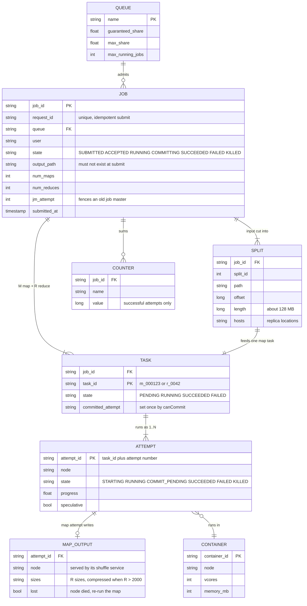

Access patterns that justify it:
- **Job store** (one relational database with a standby, ~100k rows/day, ~1 KB each, ~36 GB/year): get job by id, list by user or queue, idempotent insert on `request_id`. Strong consistency, low volume. Partitioning is not needed at this size.
- **Job master memory**: "which tasks are pending and where is their data" (scheduling), "where is map i's output and how big is partition j" (reduce fetch planning), "has task t committed" (commit gate). Hot, per job, gone when the job ends.
- **Job master journal** (an append-only file on the DFS): every task completion and commit decision, in order. A restarted job master replays it and keeps all completed work (§4.4). Hadoop's MR application master does exactly this with its job history file, and recovery is on by default (`MR_AM_JOB_RECOVERY_ENABLE_DEFAULT = true` in `MRJobConfig.java`).
- **Map output** is not in any database. It is files on the node's local disk, located through the job master.

---

## 4. High-level design

One diagram, grown one functional requirement at a time. Each step ends with what is still missing, which is what the next step adds.

### 4.1 Submit a job and get its output

**Flow: word count over 10 TB of crawled text, R = 2,000.**

1. The client uploads its code bundle to the DFS and calls `POST /jobs` with `request_id`. The **job service** checks the output path does not exist, writes the job row (`SUBMITTED`), and returns `job_id`.
2. A **master** (one process for now) lists the input files and asks the DFS for block locations. It cuts the input into splits of one DFS block each (128 MB, `dfs.blocksize` default), so 10 TB is ~78,000 map tasks. It creates R = 2,000 reduce tasks.
3. The master hands map tasks to idle **workers**. A worker reads its split, calls `map` on every record, and writes `(word, 1)` pairs to local disk split into R files by `hash(word) mod R`.
4. When all maps finish, the master hands out reduce tasks. Reduce task i reads file i from every map worker, sorts by word, calls `reduce(word, [1, 1, ...])`, and writes `part-i` to the DFS.
5. After the last reduce, the master marks the job `SUCCEEDED` and writes `_SUCCESS` in the output directory. The client polls `GET /jobs/{id}` and reads `part-00000` to `part-01999`.

This is Figure 1 of the 2004 paper, and it is the right starting point. The paper's master is a copy of the user's program, the workers are other copies, and the job aborts if the master dies (§3.3).

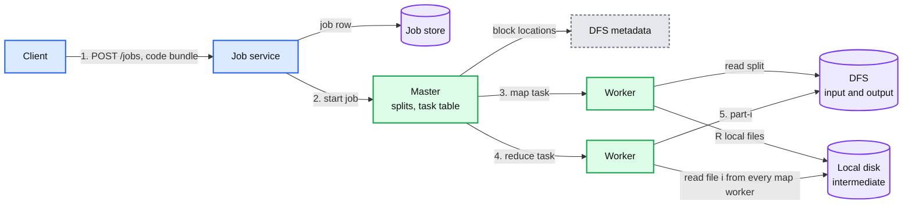

The job lifecycle, which the API exposes and every later section extends:

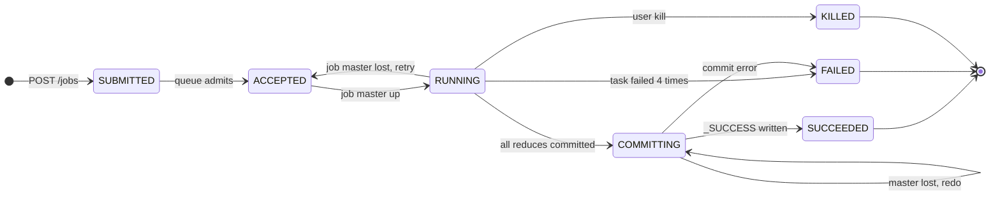

Data model so far: `job(id, request_id, state, output_path)`, task table in master memory.

**Sizing M and R, the question every interviewer asks.** M follows the input: one task per DFS block keeps reads local and tasks short (~15 s), and many short tasks give load balance and cheap recovery (paper §3.5: "M and R should be much larger than the number of worker machines"). R is the user's choice and it is the harder one. Each reduce writes one output file, so R is also the output file count. The paper's rule of thumb: R is "a small multiple of the number of worker machines we expect to use", for example M = 200,000 and R = 5,000 on 2,000 workers. Our rule: 1 to 10 GB per reduce partition, and at least one wave of reduce slots. Smaller partitions are cheaper to retry and to speculate. Larger ones make fewer, bigger shuffle blocks under pull. The 100 TB sort sits at 10 GB for the second reason, and pays for it when a reducer dies (§4.4). Many tiny input files are combined into ~128 MB splits grouped by host and rack (Hadoop's `CombineFileInputFormat`), and a job whose average split is under 1 MB is rejected: 1 M files of 1 KB would otherwise be 1 M map tasks.

**What is still missing:** (a) the 10 TB map phase on one machine's worth of reasoning: how are workers picked, and why is the network not saturated (§4.2)? (b) "reduce reads file i from every map worker" is 78,000 x 2,000 = 156 M files and nothing is sorted on the map side (§4.3). (c) any death loses the job (§4.4). (d) one master for every job in the cluster (§4.5).

### 4.2 Run the map phase in parallel, close to the data

The ladder, compressed:
- **Bad: any idle worker gets the next map task.** On 4,000 nodes with 3 replicas, a random worker holds the split with probability 3 ÷ 4,000. Almost every read crosses the network. For 10 PB/day that is 116 GB/s average, only ~2.3% of the spine (100 racks x 400 Gbps = 5 TB/s), so bandwidth is not what breaks. What breaks is task time and contention: a remote read pays the network and the remote disk, local tasks run up to ~2x faster in the delay scheduling paper's measurements, and at peak the remote reads share NICs and rack uplinks with the shuffle.
- **Good: locality-aware assignment.** The master knows the 3 hosts of each split. When a worker asks for work, give it a map task whose split it stores; else one whose split is in its rack; else any. The paper: "most input data is read locally and consumes no network bandwidth" (§3.4).
- **Great: delay scheduling on top.** In a shared cluster the next job in fair-share order often has no data on the node that just freed up. Skip it for a few seconds and let a job with local data take the slot. Facebook's measurement: this "achieves nearly optimal data locality" and "can increase throughput by up to 2x while preserving fairness" ([EuroSys 2010](https://people.csail.mit.edu/matei/papers/2010/eurosys_delay_scheduling.pdf)). §4.5 puts it in the resource manager.

**Flow inside one map task** (zoomed in [`deep-dives/map-side-sort-spill-and-combine.md`](deep-dives/map-side-sort-spill-and-combine.md)):

1. Open the split. The input format moves the start to the next record boundary and reads past the end to finish the last record, so no record is split or lost between tasks.
2. Call `map` per record. Each output pair is serialized into an in-memory **sort buffer** (`mapreduce.task.io.sort.mb` = 100 MB by default) together with its partition number `p = partitioner(key, R)`.
3. When the buffer is 80% full (`mapreduce.map.sort.spill.percent` = 0.80), a background thread sorts it by (partition, key), runs the **combiner** on each run of equal keys, and writes a **spill file**. The `map` calls keep filling the other 20%.
4. At the end, merge all spills (10 streams at a time, `mapreduce.task.io.sort.factor` = 10) into **one data file sorted by (partition, key) plus an index of R offsets**. One file per map task, not R files. That is 780k files for the 100 TB sort instead of 7.8 billion.
5. Report `mapDone(attempt, host, sizes[R])` to the master.

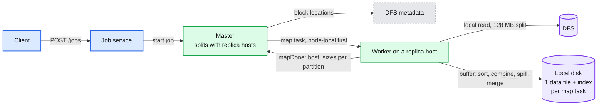

**The combiner is the cheapest optimization in the system.** Word frequencies follow a Zipf distribution, so each map task emits `("the", 1)` thousands of times. A combiner that sums on the map side sends one `("the", 4,812)` per spill instead. It must be **commutative and associative**, because the framework may run it zero, one or several times on different subsets (paper §4.3 states the commutative and associative rule; the 0..n behaviour is Hadoop's: once per spill, skipped for a record too big for the buffer, again on the final merge only with 3 or more spills, and again on the reduce-side merge, per `MapTask.java` and `MergeManagerImpl.java`). Sum, count, max: yes. Average: only as (sum, count) pairs. Median: no.

**What is still missing:** the reduce side. Who serves those files, when may reducers start, and how does a reducer find 780k map outputs?

### 4.3 Group by key across machines and run the reduce phase

**Flow: reduce task 42 of 2,000.**

1. The reduce task starts once 5% of maps are done (`mapreduce.job.reduce.slowstart.completedmaps` = 0.05). Starting early overlaps copying with the map phase. Starting too early parks reduce containers that hold slots while waiting (§5.2 trade-off).
2. It asks the master for completed map outputs since its last call: `getMapOutputs(since_event)` returns `(map_id, host)` pairs.
3. It fetches **partition 42** from each map output by asking the **shuffle service on that host**. The service reads the index, seeks to the offset, and streams the segment. Five fetches run in parallel by default (`mapreduce.reduce.shuffle.parallelcopies` = 5). Segments land in memory (up to 70% of the reduce heap, `shuffle.input.buffer.percent` = 0.70) and spill to local disk when it fills.
4. When every map's segment has arrived, it **merges** the already-sorted segments (a k-way merge, no full sort needed, because each map already sorted its output).
5. It calls `reduce(key, values_iterator)` once per distinct key, in key order, streaming values from the merge. A key with 10 GB of values works, as long as the reduce function does not try to hold them all in memory.
6. It writes output to a **temporary attempt file** on the DFS: `_temporary/attempt_r_0042_0/part-00042`. §4.4 decides when that becomes `part-00042`.

Why a **separate shuffle service** per node, and not the map task serving its own output: a map container exits as soon as it finishes. If its output disappeared with it, every finished map would have to keep a container alive for the whole job. The service is a long-lived daemon on each node that serves files from any finished task (Hadoop's `ShuffleHandler` inside the NodeManager, port 13562; Spark's external shuffle service). A crashed or preempted task container then loses nothing. Only a dead node does.

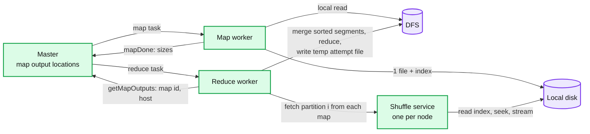

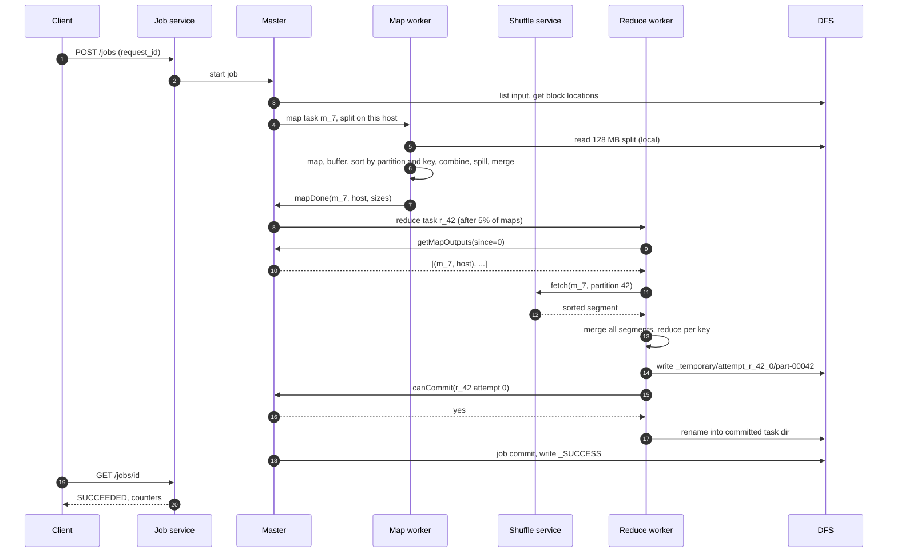

**What is still missing:** any failure. A dead map host loses outputs reducers still need. Two attempts of one reduce could both write `part-00042`. A slow node holds up the job. The master is still one process for the whole cluster.

### 4.4 Survive failure

Four failures, four mechanisms. All of them are re-execution, made safe by pure functions and a single commit gate.

| Failure | Detected by | What is lost | What re-runs |
|---|---|---|---|
| Task crashes (user code bug, OOM) | Container exits non-zero | That attempt | A new attempt, up to 4 (`mapreduce.map.maxattempts`, `reduce.maxattempts` = 4), then the job fails. A record that crashes twice is skipped if the user allows it (paper §4.6), with a cap: the job fails once skipped records pass an absolute or percentage limit, so a schema change cannot silently drop every new record (Hadoop's `skip.maxrecords` default 0 means skip mode is off) |
| Task hangs | No progress report for 600 s (`mapreduce.task.timeout`) | That attempt | A new attempt |
| Node dies | Missed heartbeats (the master or resource manager), or reducers reporting fetch failures for that host | Running attempts **and every completed map output on that node** | Running tasks, plus **completed** map tasks whose output some reducer still needs. Completed reduce tasks never re-run: their output is already in the DFS (paper §3.3) |
| Master dies | The resource manager sees the job master's heartbeat stop | In-memory task table | §4.5 and §5.5: a new job master replays its journal |

**Why completed maps re-run but completed reduces do not.** This is the most-asked question about MapReduce. Map output lives on the local disk of the map node, so it dies with the node. Reduce output was committed to the DFS, replicated 3 ways, so it survives. That asymmetry is deliberate: replicating 3 PB/day of intermediate data would triple the shuffle's disk and network cost to protect data that is cheap to recompute.

**The commit gate: exactly one attempt's output becomes visible.**
- Every attempt writes to a private path containing its attempt id. Two attempts of one task never touch the same file.
- When an attempt finishes, it asks the master `canCommit(attempt)`. The master says yes to the first one only, journals `commit_granted(task, attempt)`, and tells the others to stop before writing anything more. It kills them only after `commit_done`, so a backup is still alive if the winner dies mid-rename. When the winner reports its rename done, the master journals `commit_done(task)`. Two records, because the winner can die between the yes and the rename. A replaying master that finds `granted` without `done` checks whether the committed task directory exists, and if not, re-runs the task under its own `jm_attempt` path. The same rule applies live: if the granted attempt dies or loses its container before `commit_done`, the gate reopens for a new attempt (its half-renamed files sit under the dead attempt's path and are never published). An attempt in `COMMIT_PENDING` is never chosen as a preemption victim.
- The winner renames its attempt directory to a committed path that **includes its attempt id** (`committed/r_42.attempt_3`). On HDFS a rename is one atomic metadata operation. Job commit takes, for each task, only the directory of the attempt journaled as `commit_done`. So a zombie winner (partitioned, not dead) that renames late, after the gate reopened and another attempt committed, lands in a directory nobody publishes.
- When every reduce task has committed, the master runs **job commit**. It journals `job_commit_started`. Then on HDFS it builds a fresh `publish/` directory from the journal: for each task, it moves the files of the attempt journaled as `commit_done` (one rename per task, ~10k for the sort; a redo skips files already moved). Late zombie directories are never touched, because the list comes from the journal, not from a directory listing. It writes a `_JOB_ID` marker, does **one rename** of `publish/` to `output_path` (which must not exist, §3.2), writes `_SUCCESS`, and journals `job_commit_done`. The final rename makes the whole output appear at once. A job master that dies mid-commit is replaced, and the new one redoes the commit from the journal: if `output_path` already exists with this job's `_JOB_ID`, it only writes `_SUCCESS`. Hadoop's v1 committer instead moves files one by one at job commit, so a crash halfway leaves some parts visible without `_SUCCESS`. Downstream jobs wait for `_SUCCESS`, so they never see a half-written output.
- Map output needs no gate. The master simply ignores a second `mapDone` for a task that already has one (paper §3.3), and reducers fetch from whichever attempt the master recorded.

**Non-deterministic map functions break the clean story.** If `map` samples with an unseeded random number, two attempts of the same map task produce different output. If reducer R1 fetched from attempt 1 and reducer R2 from attempt 2 (after a node loss), the job's output matches no single sequential run. The paper calls this its "weaker semantics" (§3.3). The fix is a rule for users: seed randomness from the task id, never read the clock or an outside service in `map`. §5.4 shows what a framework can do when users break the rule.

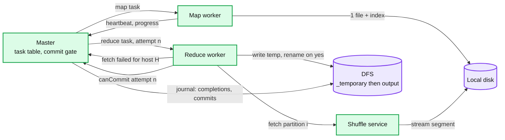

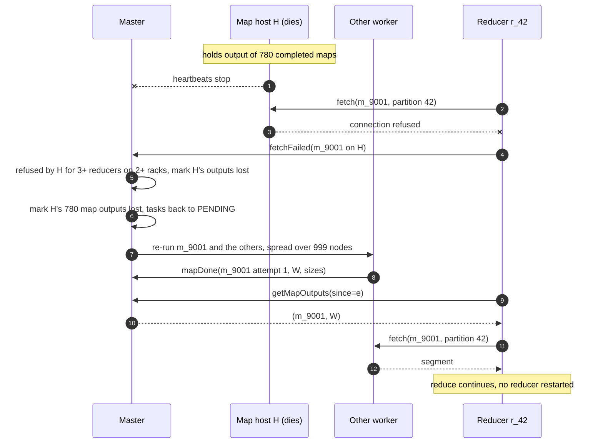

Cost of a node loss in the 100 TB sort: 780 map tasks ÷ 999 surviving nodes is less than one task each, so ~15 to 30 s of extra map work, plus the detection delay. That is why the paper's 200-worker kill cost only 5%. The reduce wave is the honest exception. The ~10 reducers on a dead node restart from zero, and a reducer is ~5 min of work, so a death in the last 5 min adds up to ~5 min, ~35% of a 15 min job. About 4 of the ~11 expected deaths per run land in the reduce phase. Options: smaller partitions (with push-merge, R = 50,000 gives 2 GB, ~1 min reducers, and merged reads stay sequential), or reducers that checkpoint their merged runs to local disk. We accept it for the sort and say so. Attempts lost with a dead node end `KILLED` and, like preempted ones, do not count toward the 4-attempt limit. `mapDone` is accepted only from an attempt the job master still lists as running, and the host is taken from the container record, not the report.

**What is still missing:** the master. One master per cluster is a single point of failure for every running job. Yahoo!'s experience before YARN: "a JobTracker failure caused an outage that would lose all the running jobs in a cluster" ([YARN paper](https://www.cse.ust.hk/~weiwa/teaching/Fall15-COMP6611B/reading_list/YARN.pdf) §2.3). It also holds the task table of every job in one heap.

### 4.5 Share the cluster between teams

The ladder:
- **Bad: one master per cluster, FIFO.** The 2004 design plus a job queue. A 500 TB job takes every slot for hours. The master holds every job's task table (the 100 TB sort alone needs ~7.8 GB of partition sizes, §2), and its death kills every running job.
- **Good: one master per cluster with fair-share pools.** Hadoop 1's JobTracker with the Fair or Capacity scheduler. Teams get shares. But the master is still one process that tracks every task in the cluster, and it is still the blast radius for every job. Yahoo! hit the ceiling at about 4,000 nodes.
- **Great: split resource management from job management (YARN).** A **resource manager** (RM) only hands out containers to queues and jobs. One **job master per job** (YARN calls it the ApplicationMaster) runs in a container of its own, holds only its job's task table, schedules its tasks into the containers it was granted, and runs the commit gate. A job master crash affects one job. The RM never sees a task.

**Flow: team Ads submits a 50 TB job while team Search's 500 TB job holds 80% of the cluster.**

1. The job service writes the job row and asks the RM to admit it to queue `ads` (guaranteed 20%, max 50%).
2. The RM launches the **job master** in a container on some node. The job master computes splits and sends `allocate` requests: 390k containers of 1 vCPU, 3 GB, each with locality preferences (hosts, then racks, then any).
3. The RM's scheduler gives containers to whichever queue is furthest below its guaranteed share. `ads` is at 0%. As Search's tasks finish, the freed containers go to Ads, not back to Search. If Search is in its map phase, ~100k containers running ~60 s maps free ~1,700 per second, so Ads' 25,600 containers (20%) arrive in ~15 s with no kill at all. Preemption matters only when the lender runs long tasks: Search in its reduce phase with ~5 min reduces frees ~340 per second and would take ~75 s.
4. If Ads is still below its 20% guarantee after **45 s** (counting only asks Ads would accept, not asks it is skipping for locality), the RM **preempts**: it asks Search's job master to give back containers, waits a 10 s grace, then kills. Victim order: never a job master container, never an attempt in `COMMIT_PENDING`, maps before reduces, then youngest first. Job master containers are also capped at ~10% of each queue, so a burst of tiny submits cannot fill a queue with job masters that wait forever for task containers. With launch time, Ads is whole by ~60 s, the NFR.
5. The RM scheduler applies **delay scheduling** to Ads' asks: when a node frees up and holds none of Ads' splits, it skips Ads for a few heartbeats, waiting for a node-local slot before granting a rack-local one. The job master only matches its pending splits to the containers it was granted.
6. When Ads finishes, its share flows back to Search. Nobody's capacity sits idle while another queue has pending work. That elasticity is what makes > 70% utilization possible.

Preempted attempts end as `KILLED`, not `FAILED`. They do not count toward the 4-attempt limit, and their broken fetch streams are not reported as fetch failures. A reducer preempted mid-fetch loses its fetched data and re-fetches its whole partition (10 GB in the sort, ~1 to 2 min through the shuffle service), which is why reduces are preempted last.

**A deadlock to know about.** With fungible containers, a job at its queue's max can fill every container with reducers that wait on maps (slowstart let them start). After a node loss its re-run maps get no container, and the reducers wait forever. The job master breaks it by preempting its own reducers when map asks go unmet with no headroom (Hadoop: `mapreduce.job.reducer.preempt.delay.sec` = 0, and unconditionally after 300 s by `reducer.unconditional-preempt.delay.sec`).

**Small jobs get a fast path.** A 5 GB job is 40 map tasks. Launching a job master plus 40 containers costs a large share of the work, so that job uses (2). Two mechanisms: (1) **uber mode**: tiny jobs run their tasks inside the job master's own container (`mapreduce.job.ubertask.enable`, off by default; limits default to 9 maps, 1 reduce and one DFS block of input, so ~128 MB). It fits the 1 GB jobs, not the 5 GB one. (2) **container reuse**: a job master keeps a warm container and runs many short tasks in it, as Tez and Spark executors do. The honest Staff answer: below ~10 s of work, MapReduce is the wrong engine; route those users to the query engine ([`../query-engine/`](../query-engine/)).

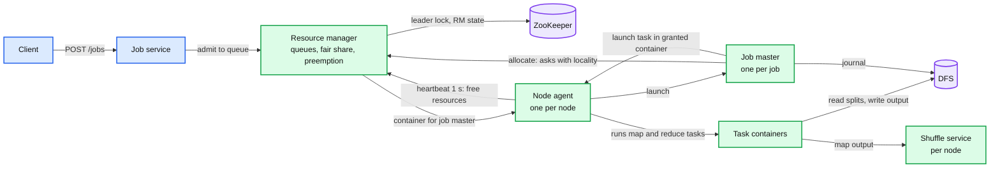

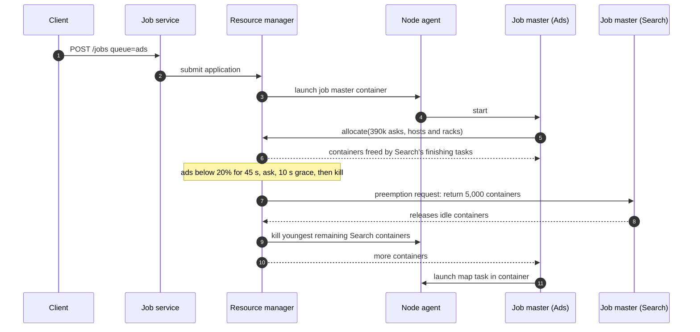

Data model so far: `queue(name, guaranteed, max)`, `job(..., queue, jm_attempt)`, the job master's journal on the DFS.

**What is still missing, and what the deep dives fix:** the 7.8 billion-block shuffle (§5.1), the slow node at the end of the job (§5.2), the key that holds 20% of the data (§5.3), output on an object store without atomic rename, and non-deterministic users (§5.4), and the RM and job master as single points of failure (§5.5).

---

## 5. Deep dives

Each deep dive walks one path, names what breaks in the §4 design, fixes it, and says what changed in the API, the data model or the diagram.

### 5.1 "Sort 100 TB on 1,000 nodes in under 30 minutes": the shuffle

**Walk the path and time each hop** (numbers from §2):

| Hop | Work per node | Time | Limit |
|---|---|---|---|
| Map read, sort, write | 100 GB read + 100 GB written | ~6 min (24 waves) | CPU and disk, fine |
| Shuffle service serves blocks | 7.8 M random reads of 12.8 KB | **~1.8 h** | HDD seeks |
| Network | 100 GB out, 100 GB in | ~33 s per node, ~80 s through rack uplinks | fine |
| Reduce merge and write | 10 GB per reducer, 300 GB per node with 3 replicas | ~5 min | disk, fine |

The shuffle service is the red node. The bytes take a minute. The seeks take two hours. And it gets worse as data grows: at a fixed split size, M grows with input; at a fixed reduce partition size, R grows with input too, so blocks grow as the square and each block shrinks. LinkedIn measured an average block of "around 10s of KBs", billions read daily, and "Around 15% of the total Spark computation resources on our clusters are wasted due to this latency" ([Magnet, VLDB 2020](https://www.vldb.org/pvldb/vol13/p3382-shen.pdf) §2).

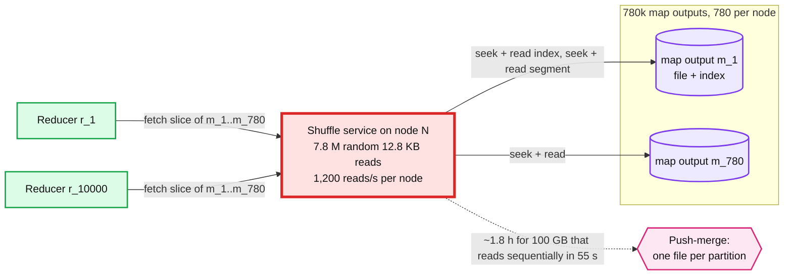

The ladder:
- **Bad: tune M and R per job.** Fewer, bigger maps (1 GB splits, M = 100k) cut blocks 8x, but each map now sorts 1 GB in a 100 MB buffer (~16 spills of 80 MB at ~116 bytes per record with metadata, one intermediate merge pass of 7 segments plus the final merge, so ~44% of the bytes are rewritten once more), a lost node costs 8x more work per task, and stragglers get longer. Fewer reducers (R = 2,000) make 50 GB partitions: each reducer merges for many minutes and a reduce retry costs that much again. Magnet calls these "tuning dilemmas". The knob moves the cost; it does not remove it, and every team has to find its own setting.
- **Good: merge on the map node as its maps finish (Riffle).** As soon as a group of map outputs exists on a node, a merger on that node rewrites them so that each reduce partition's slices from those ~780 maps are contiguous. A reducer then makes one request per node instead of one per map: 1,000 x 10,000 = 10 M blocks of ~10 MB instead of 7.8 B of 12.8 KB. Riffle at Facebook: "up to a 10x reduction in the number of shuffle I/O requests and 40% improvement in the end-to-end job completion time" ([EuroSys 2018](https://www.cs.princeton.edu/~mfreed/docs/riffle-eurosys18.pdf)). Costs: an extra read and write of all map output (100 GB each way per node, ~2 min of disk), and the last merge group on each node trails that node's last maps, so it adds a little latency at the tail. Merges of earlier groups overlap the map phase.
- **Great: push-merge (Magnet).** Each map task, after writing its normal output, also **pushes** its slices to a **merger**: the shuffle service chosen for that reduce partition. Mergers own contiguous partition ranges (10 partitions each in the sort), so a map task sends one batched push of ~128 KB per merger rather than 10,000 pushes of 12.8 KB (Magnet groups contiguous blocks the same way). The batching happens on the map side. The merger does not hold blocks in memory: it appends each batch to the partition's file on disk (the page cache groups the writes) and keeps an index of chunk boundaries. Riffle's mergers, by contrast, needed several GB of memory each. When the map phase ends, the job master **finalizes** the shuffle (waits a bounded time, Spark's default `spark.shuffle.push.finalize.timeout` is 10 s, for pushes in flight), collects which map slices made it into each merged file, and schedules reducer i **on or near the node that holds merged partition i**. The reducer reads one ~10 GB file sequentially in MB chunks: 100 GB per node ÷ ~2 MB = ~50k reads (~42 s of seeks at 1,200/s) plus 55 s of bytes at 1.8 GB/s, **~1 to 1.5 min instead of 1.8 h**. Any slice that was not merged (a push was dropped, a merger was busy) is fetched the old way from the original map output. LinkedIn: "nearly 30%" lower end-to-end runtime on production jobs (VLDB 2020).

**Challenges of the Great rung, said out loud:**
- **Double writes.** Original outputs stay on disk as the fallback, so shuffle bytes are written twice. 3 PB/day becomes 6 PB/day of HDD writes, ~1.5 TB per node per day. HDD is fine. SSD would wear.
- **A dead merger** loses merged partitions. Reducers fall back to the unmerged originals for those partitions. Correct, slower. And failures now correlate: the reducer sits on its merger's node, so one node death loses the merged file, its reducers, and that node's own original map outputs. The fallback must first re-run that node's ~780 maps.
- **Push competes with map reads** for network during the map phase. Pushes are best effort: drop when the merger is busy, never block a map task.
- **Skewed partitions are not pushed.** One merger would receive the whole 20 TB hot partition, and a merged file loses per-map boundaries, so it cannot be split by map range (§5.3). Map tasks skip pushing blocks above a size threshold. Magnet does the same: it "will merge all the normal partitions, but skip the skewed partitions" (VLDB 2020 §3.5.2).
- **The finalize barrier** is a new stage boundary. A small job pays it for nothing.

**Push back on the textbook answer ("just use SSDs" or "always push-merge").**
- NVMe has hundreds of thousands of IOPS, so seeks vanish. But per-request costs remain (an RPC, a small network read, per-block metadata in the job master). And 3 PB/day of shuffle writes wears drives out: Uber's post says moving shuffle to dedicated servers took the YARN fleet's SSD wear-out time "from ~3 months to ~36 months" ([Uber RSS](https://www.uber.com/blog/ubers-highly-scalable-and-distributed-shuffle-as-a-service/)).
- Most jobs do not have this problem. A medium job's map output per node fits in the ~40 GB of page cache, and reads are served from memory. Push-merge is turned on **per job** when the job master's estimate says shuffle per node > free page cache or the average block < ~100 KB. For 90% of jobs (§1.2) it stays off.

**The step after Great: a remote shuffle service** (Uber RSS, Apache Celeborn). A dedicated fleet of NVMe servers receives pushed shuffle data and serves it. Uber runs ~400 RSS servers per data center (80 vCores, 384 GB, 4 x 4 TB NVMe each) for a 10,000+ node Spark fleet, handling "~8-10 PB of data everyday", with "~40 TBs of data in a single shuffle" and P99 throughput of "around 2 TB/minute" read and 0.6 TB/minute written. What it buys: compute nodes become stateless (autoscale, preempt, use spot) because no map output lives on them. What it costs: a second fleet (~4% of node count at Uber) and every shuffle byte crosses the network twice. We pick it at the 10x step (§10.11), not now: our nodes are long-lived and have spare HDD.

**What changed:** API: `conf.shuffle.push = auto`. Data model: `MAP_OUTPUT` gains `merged_into(partition -> merger host)` and `PARTITION(merged_file_host, merged_map_bitmap)`. Diagram: shuffle services now talk to each other (map side pushes to mergers), and reducers are placed next to their merged partition. Deep dive: [`deep-dives/shuffle-pull-push-and-remote.md`](deep-dives/shuffle-pull-push-and-remote.md).

### 5.2 "One slow machine must not add more than 10%": stragglers

Job time is the time of the **slowest task in the last wave**. One node with a failing disk that reads at 1 MB/s instead of 30 MB/s (the paper's example, §3.6), or a bug that disabled CPU caches and slowed machines "by over a factor of one hundred", turns a 15-second task into 25 minutes. Every other node has finished and waits.

- **Bad: rely on timeouts.** `mapreduce.task.timeout` (600 s) catches tasks that report **no** progress. A slow task reports progress, slowly. It is never killed.
- **Good: backup tasks near the end (the paper's mechanism).** When the phase is nearly done, schedule a second attempt of each remaining in-progress task on another node. Whichever finishes first commits (§4.4's gate makes that safe); the other is killed. Google's sort took **1283 s without backups vs 891 s with them, 44% longer**; after 960 s "all except 5 of the reduce tasks are completed", and those 5 took 300 s more (§5.4). Cost: "no more than a few percent" extra compute.
- **Great: speculate on estimated time left (LATE), capped and targeted.** For each running task: progress rate = progress ÷ elapsed, time left = (1 - progress) ÷ rate. Speculate the task with the **longest time left**, only if its rate is in the slowest quarter (LATE's SlowTaskThreshold at the 25th percentile), only on a node that is itself fast, and never more than **10% of slots** at once (LATE's SpeculativeCap; Hadoop's `speculative-cap-running-tasks` = 0.1). LATE "reduces Hadoop's response time by a factor of 2" in heterogeneous clusters ([OSDI 2008](https://www.usenix.org/legacy/event/osdi08/tech/full_papers/zaharia/zaharia.pdf)). Add node blocklisting: a node where 3 tasks of one job fail stops getting that job's tasks (`mapreduce.job.maxtaskfailures.per.tracker` = 3, which counts failures only). We add a per-node slowness score of our own, so a node that keeps straggling is blocklisted too.

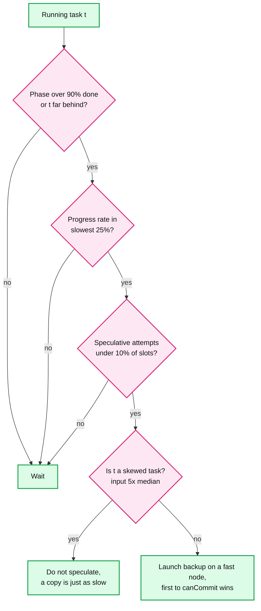

**Push back on the textbook answer ("turn on speculation").**
- **Speculation fixes slow machines, not slow data.** A reduce task with 20% of the job's data is slow on every node. Its backup is just as slow and doubles the load on the shuffle services feeding it. The job master must check input size before speculating (the `E` node above) and leave skew to §5.3.
- **Reduce backups are expensive.** A reduce backup re-fetches its whole partition (10 GB in the sort) through the red node of §5.1. Speculate reduces later and less than maps.
- **Not every slow task deserves a copy.** Mantri, on Bing's production Cosmos clusters, found outliers "inflate the completion time of jobs by 34% at median", and cut completion time by 32% by acting on the **cause**: restart only when the expected saving beats the cost, place tasks away from congested links, and replicate outputs that are expensive to recompute ([OSDI 2010](https://www.usenix.org/legacy/event/osdi10/tech/full_papers/Ananthanarayanan.pdf)).
- Spark ships speculation **off** (`spark.speculation` = false), and on the current branch fires at 3x the median after 90% of a stage is done. Hadoop ships it on. Both are defensible. We keep it on for maps, conservative for reduces.

**What changed:** data model: `ATTEMPT.speculative`, per-node slowness score in the job master. Diagram: the job master gains a speculation loop. Deep dive: [`deep-dives/stragglers-and-speculation.md`](deep-dives/stragglers-and-speculation.md).

### 5.3 "One key holds 20% of the data": skew

All values for a key go to one reduce task. Hashing spreads keys, not records. If the most common word is ~8% of all words (the Zipf top key is 1 ÷ H(V), 8.3% for a 100k-word vocabulary), or one customer has 20% of the orders, one reducer gets that share, and the job takes as long as it does. The job master **can see it coming**: after the map phase, `mapDone` reports give exact bytes per partition. Partition 42 at 20 TB when the median is 10 GB is a skewed partition.

- **Bad: more reducers, or speculation.** Raising R splits the other keys finer. The hot key still lands in one partition. Speculation copies the slow task (§5.2).
- **Good: combine early, sample before you range-partition.**
  - If the reduce is algebraic (sum, count, max, top-K), the combiner shrinks the hot key on the map side: 20 TB of `("the", 1)` becomes 780k partial counts, a few MB. Word count's skew disappears.
  - For a sort, use a **range partitioner from a sample**. The paper: "we would add a pre-pass MapReduce operation that would collect a sample of the keys and use the distribution of the sampled keys to compute split-points" (§5.3). Hadoop's TeraSort does this with `TotalOrderPartitioner`. A range partitioner on the key alone keeps a hot key in one partition (Hadoop's `InputSampler` drops repeated split points, and `TotalOrderPartitioner` is a pure function of the key). To spread it, sort on `(key, record_id)`: equal keys then fall into adjacent partitions and the output is still globally sorted. A sort does not care which partition equal keys go to.
- **Great: split the hot key, with the user's permission.**
  - **Salting** for joins: on the big side, rewrite hot key `k` as `(k, random 0..N-1)`; on the small side, copy each row of `k` to all N sub-keys. N reducers share the hot key's work. The job master can do it automatically for a declared join, the way Spark's adaptive execution splits a partition larger than 5x the median and 256 MB (`skewJoin.skewedPartitionFactor` = 5).
  - **Two-phase aggregation** for algebraic reduces with no combiner (or when even combined data is huge): job 1 reduces on `(k, salt)`, job 2 reduces on `k`.
  - **Neither works for a holistic reduce** (exact median per key, or a reduce that needs every value of a key together). There, the honest answer is to change the algorithm (approximate quantile sketch per partial, then merge sketches) or accept the long task.

**Push back:** the framework cannot split a key on its own, because it does not know whether `reduce` is splittable. That knowledge comes from the user: a combiner declared, or a `join` / `aggregate(sketch)` operator. That is one reason higher-level APIs (Pig, Hive, FlumeJava, Spark SQL) replaced raw MapReduce: they know the operator, so they can fix skew automatically. Also, a hot key can kill a reducer that buffers all values in memory. Values arrive as a stream. If the user needs them sorted, use a **secondary sort** (put the sort field in the key, group by the prefix) rather than sorting in memory.

**What changed:** API: `conf.skew.split = auto` for declared joins and aggregates. Data model: per-partition sizes are read by the job master before scheduling reduces. With pull shuffle, slowstart (§4.3) launches reducers before all maps finish, so the job master projects sizes from the first ~10% of map statuses (unless the input is sorted by key) and holds back reducers for partitions projected to be skewed until the map phase ends. With push-merge, slowstart is 1.0 and sizes are exact. Deep dive: [`deep-dives/data-skew-and-partitioning.md`](deep-dives/data-skew-and-partitioning.md).

### 5.4 "Output equals one failure-free run, and appears all at once": commit, object stores, non-determinism

Duplicates can enter at three places: a retry after a crash, a backup task, and a zombie attempt that lost contact but is still writing. §4.4's gate handles the first two on HDFS. This deep dive covers the rest.

- **Bad: write straight to `part-i`.** Two attempts of the same reduce interleave or overwrite. A crashed attempt leaves half a file. A reader that lists the directory mid-job sees some files and not others.
- **Good: temp file, commit gate, rename (Hadoop's FileOutputCommitter v1).** The paper itself had no gate: each reduce renamed its one temp file to the final name and let rename atomicity pick the winner (§3.3), which works only for one output file per task. Attempt writes under `_temporary/<jm_attempt>/_temporary/<attempt>/`. Task commit renames that into `_temporary/<jm_attempt>/<task>/`. Job commit moves every committed task's files to the output directory and writes `_SUCCESS`. Correct, because HDFS rename is atomic. Cost: job commit is serial over every file. Hadoop's docs warn it "can take minutes" for jobs with many files (MAPREDUCE-4815). Hadoop's **v2** algorithm (still the code default) renames straight into the output directory at task commit. Faster, but a task that dies mid-commit leaves partial files visible, and a failed job leaves some committed parts behind. Spark sets v1 and warns that "2 may cause a correctness issue like MAPREDUCE-7282". We use v1's task commit with the attempt id in the path (§4.4), and replace v1's file-by-file job commit with the journal-driven `publish/` plus one rename of §4.4.
- **Great: manifest commit, for any storage.** On S3, GCS or ADLS, rename is a copy plus delete: O(bytes) and not atomic. So we stop renaming. Each attempt writes its files **directly under the output prefix, in a hidden `_attempts/` folder, under unique names** (`_attempts/part-00042-<attempt-uuid>.parquet`). Hadoop input formats skip `_`-prefixed paths, so a reader that globs the directory sees nothing at all, neither zombie files nor the real output. This path is therefore only for manifest-aware or table-format readers. Jobs whose readers list directories on S3 use the S3A magic committer instead (below). Task commit writes a small **task manifest** listing those files (one PUT), and the file list also goes into the `commit_done` journal record. Job commit builds **one job manifest** from the journal only (so a stray or zombie task manifest can never be listed), with a conditional put (`If-None-Match: *`) so exactly one job master attempt can commit, or commits them to a table log ([`../delta-lake-transactions/`](../delta-lake-transactions/)). Readers read only files named in the manifest. Files from failed attempts and zombies are never listed and a cleaner deletes them after a day. Hadoop's S3A "magic" committer gets the same effect differently: attempts start multipart uploads but do not complete them until job commit, so nothing is visible early.

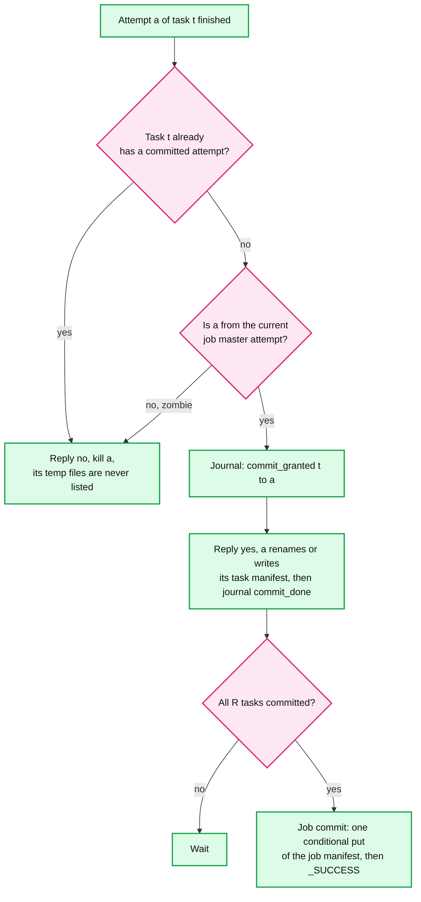

**Zombies and fencing.** A reduce attempt on a partitioned node keeps running after its job master gave up on it. It can still write files, but it can never get a "yes" from `canCommit`: the task already has a committed attempt, or the zombie belongs to an old job master attempt (`jm_attempt` is in its path and its token). A zombie that already held a "yes" and renames late lands in its own attempt-named committed directory, which job commit ignores (§4.4). A zombie **job master** (the RM started a new one after losing its heartbeat) is fenced by its **journal lease**, not by the RM's kill, which a partitioned node agent never hears. The journal is a single-writer DFS file under a lease. The new attempt recovers the lease, so every append by the old one fails, and the old one must journal before it says yes to an attempt or starts a commit. On top of that, only one job master attempt can complete the job commit. On HDFS that is the single rename of the staging directory to `output_path`, which fails if `output_path` already exists. On an object store it is the conditional put of the job manifest. The staging directory carries a `_JOB_ID` marker, and a redoing job master checks it before deciding the existing `output_path` is its own.

**Non-determinism, the framework's options.** If a user declares `map` non-deterministic (sampling without a seed, reading the clock), re-running a lost map can produce different output. Some reducers fetched the old version, some the new. Options:
1. Re-run every reducer that read the old attempt. Spark does this for indeterminate stages, and aborts if any downstream task has already committed, because committed output cannot be taken back.
2. Make that job's map output **durable**: write it to the DFS with 2 replicas so it is never recomputed. Costs ~2x shuffle writes, only for jobs that ask for it. Push-merge is forced off for these jobs: a merger keeps the first pushed copy of each map slice, which may come from a different attempt than the one the job master recorded. (For deterministic maps both copies are byte-identical, so it does not matter. To be safe anyway, mergers tag each slice with its attempt id and finalize keeps only slices from the recorded attempt.)
We pick 2. It is simple and keeps the commit story intact.

**Counters are exact** because the job master keeps one counter set per task, from the attempt it accepted, and replaces it if the task re-runs (a map re-run after its output was lost is a second successful attempt, so summing per attempt would double count). Duplicate executions from backups and retries are dropped (paper §4.9: the master "eliminates the effects of duplicate executions").

**Side effects stay the user's job.** A map that inserts into an outside database will insert twice when it is retried. The paper's answer still holds: make side effects "atomic and idempotent" (§4.5), for example an upsert keyed by `(job_id, task_id, record_offset)`.

**What changed:** API: `conf.committer = manifest` for object stores, `conf.map.deterministic = false` makes map output durable. Data model: `TASK.committed_attempt`, `JOB.jm_attempt`, task and job manifests. Deep dive: [`deep-dives/output-commit-and-exactly-once.md`](deep-dives/output-commit-and-exactly-once.md).

### 5.5 "No single master, failover under 30 s, 100k jobs/day": control plane availability and scale

The paper's position: "given that there is only a single master, its failure is unlikely; therefore our current implementation aborts the MapReduce computation if the master fails" (§3.3).

**Push back on the paper.** That was right for a 634 s job on 157 machines. It is wrong here. Our job master runs in a container on an ordinary worker node, with the same failure rate as tasks: one death per ~23 worker-hours (§2). A 6-hour job's job master then dies with probability ~1 - e^(-6/23), about **23%**. Aborting means a quarter of long jobs restart from zero.

**Resource manager.**
- **Bad:** one RM. Its death stops all new allocation and, in Hadoop 1, killed every job.
- **Good:** active plus standby with leader election through ZooKeeper, application and queue state stored in ZooKeeper. Hadoop ships this off: `yarn.resourcemanager.recovery.enabled` defaults to **false**. We turn it on.
- **Great:** **work-preserving restart.** The new active RM rebuilds its view from node agents and job masters re-registering and reporting their running containers. Running tasks never stop; at worst no new containers are granted for ~10 to 30 s (ZooKeeper session timeout plus resync). The RM holds no task state, so there is little to rebuild. See [`../../concepts/zookeeper.md`](../../concepts/zookeeper.md).

**Job master.**
- The RM restarts a dead job master up to N times (YARN `am.max-attempts` default 2; we use 4 for jobs over 1 h).
- The new attempt **replays the journal** on the DFS: every map completion (with host), every commit decision, and the `shuffle_finalized` record (for each partition, its merger and which map slices the merged file holds). Completed maps whose host is alive keep their output on its shuffle service. Merged files stay usable, because they are keyed by job and partition and fetched with the per-job secret. Committed reduces stay committed. Only in-flight attempts are lost. Without the finalize record, a new job master would either finalize again or fall back to pulling everything.
- Hadoop's MR application master does this by default (`job.recovery.enable` = true), and the new attempt's id is part of every temp path, so the old attempt's tasks cannot commit.

**Job master memory.** The paper's ~1 byte per (map, reduce) pair is 7.8 GB for the sort. Compress map statuses: above 2,000 partitions, keep the average block size, a bitmap of empty blocks, and exact sizes only for blocks over N x that map's average (a relative rule, so the hot partition's ~25.6 MB blocks against a 12.8 KB average are recorded exactly and skew detection still sees them) (Spark's `HighlyCompressedMapStatus`, threshold `minNumPartitionsToHighlyCompress` = 2000). That is ~1.25 KB per map, ~1 GB total, in a 16 GB job master container. With push-merge, reducers mostly need one merged file location per partition, not 780k map locations.

**Liveness detection.** YARN's default node expiry is 10 minutes (`yarn.nm.liveness-monitor.expiry-interval-ms` = 600000). For the 100 TB sort, ten minutes of a dead node is a whole map phase. We set 60 s for node loss, and let **fetch failures** act faster for map output: when 3 or more reducers on 2 or more racks get connection refused or unreachable from one host, the job master re-runs that host's maps without waiting for the node verdict. Timeouts from a live, busy shuffle service do not count (§6 Flow 3). Hadoop's shuffle connect and read timeouts default to 180 s, so a dead host that silently drops packets would hold fetcher threads for 3 minutes. We set a 5 s connect timeout, retried with backoff and not counted as a failure, and let the 60 s heartbeat expiry catch silent hosts. The trade-off: a rack that is unreachable for 30 s triggers re-runs of maps whose outputs were fine. Re-running is cheap (§4.4); waiting 10 minutes is not.

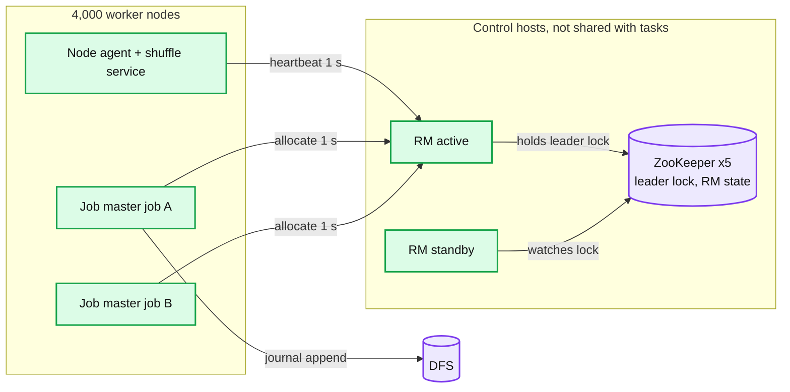

**Throughput of the control plane.** ~2,700 container launches/s at peak (§2) plus 4,000 node heartbeats/s. Each scheduling decision is in-memory, so one RM keeps up, but only because it never tracks tasks. Container reuse for short tasks (§4.5) cuts the launch rate several times. If one RM ever becomes the limit, the next step is federation: several sub-clusters, each with its own RM, behind a router (YARN Federation). Not needed at 4,000 nodes.

**What changed:** data model: `JOB.jm_attempt`, the journal, compressed map statuses. Diagram: RM pair plus ZooKeeper. Deep dives: [`deep-dives/fault-tolerance-and-recovery.md`](deep-dives/fault-tolerance-and-recovery.md), [`deep-dives/scheduling-locality-and-multi-tenancy.md`](deep-dives/scheduling-locality-and-multi-tenancy.md).

---

## 6. Final design and the six core flows

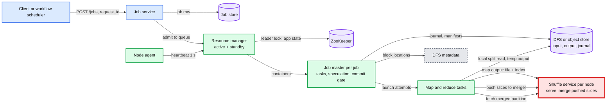

Zoom-ins live in [`diagrams.md`](diagrams.md): context (D1), data flow with rates (D2), deployment (D9), partitioning (D10), failure map (D11), rollout (D12).

### Flow 1: word count over 10 TB, happy path (~10 min on 500 nodes)

1. Submit with `request_id`. Job service writes `SUBMITTED`, RM admits to the queue, launches the job master.
2. Job master lists input, gets block locations, makes ~78k splits and R = 2,000 reduce tasks, journals the plan.
3. It asks for containers with host and rack preferences. RM grants them by fair share. Delay scheduling keeps ~95%+ of maps node-local [estimate].
4. Each map: read 128 MB locally, map, sort buffer, combine (`("the", 1)` x thousands becomes one count per spill), merge to one file plus index. `mapDone` with sizes.
5. At 5% of maps done, reducers start fetching from shuffle services. Small job, so pull shuffle, mostly from page cache.
6. Each reducer merges, sums, writes `_temporary/.../part-i`, asks `canCommit`, renames.
7. Job master runs job commit and writes `_SUCCESS`. Job row `SUCCEEDED`. Counters returned.

### Flow 2: sort 100 TB on 1,000 nodes with push-merge (~15 min)

1. A sampling pre-pass job samples ~1 M keys (~100 per partition) and picks 9,999 split points for R = 10,000 range partitions.
2. 780k map tasks in ~24 waves, ~6 min. Each writes its output and pushes its slices to the merger for each partition.
3. Map phase ends. The job master finalizes the shuffle (bounded wait, ~10 s), records which slices each merged file holds.
4. 10,000 reducers in one wave, each placed next to its merged partition, read ~10 GB sequentially, fetch the few unmerged slices from originals, merge, write output with 3 replicas (~5 min).
5. Job commit: one directory rename on HDFS (or one manifest put on an object store), `_SUCCESS`. Total ~6 + 1 + 6 ≈ 13 to 15 min, inside the 30 min target. Pull shuffle would have spent ~1.8 h in seeks.

### Flow 3: a node dies after the map phase (failure)

1. Node H, holding 780 map outputs and ~10 running reduce attempts, loses power.
2. Within seconds, reducers fetching from H get connection refused or unreachable and report `fetchFailed(H)`. Once 3 or more reducers on 2 or more racks report it (or 60 s of missed heartbeats), the job master marks H's map outputs lost. A **timeout** from a live but overloaded shuffle service is not a loss: the reducer backs off and retries, because re-running 780 healthy maps would add load to the very service that is slow.
3. H's 780 map tasks go back to pending and re-run across 999 nodes, < 1 task each, ~30 s. The ~10 reduce attempts restart elsewhere and re-fetch their partitions.
4. Reducers get the new locations from `getMapOutputs` and continue. No committed reduce re-runs. Extra time: under 1 min for a death in the map phase. In the reduce wave, up to ~5 min, because H's ~10 reducers restart from zero. A seeded simulation of the sort ([`deep-dives/fault-tolerance-and-recovery.md`](deep-dives/fault-tolerance-and-recovery.md)) gives ~13.6 deaths per run and +347 s expected (+44%), or +84 s with R = 50,000 under push-merge. With push-merge, partitions merged on H fall back to the original map outputs for those partitions.

### Flow 4: a straggler at 95% (failure)

1. 9,990 of 10,000 reducers are done. 10 remain. Nine are on healthy nodes at 90% progress. One is on a node with a failing disk at 30%.
2. The speculation loop computes time left. The slow one has the longest and its progress rate is in the bottom quarter. Its input size is normal (not skew). Speculative attempts are well under 10% of slots.
3. A backup starts on a fast node, reads its partition from the **original** map output slices, not the merged file (that file sits on the same failing disk that made the first attempt slow), ~780 reads per node across 1,000 nodes, and finishes first. It gets `canCommit = yes`. The original is killed. Its temp files are never committed.
4. The node's slowness score passes the threshold. It gets no more tasks for this job.

### Flow 5: the job master dies at hour 3 of a 6-hour job (failure)

1. The RM sees the job master's `allocate` heartbeats stop. After the AM expiry timeout it starts job master attempt 2 on another node.
2. Attempt 2 reads the journal: 600k of 780k maps done (with hosts), 0 reduces committed, shuffle not yet finalized.
3. It asks the shuffle services on those hosts which outputs they still hold (all, except the few on nodes lost meanwhile). It re-queues only the missing maps and the in-flight ones.
4. Attempt 1's surviving task containers are killed by their node agents (their tokens carry the old attempt number), so they cannot commit. Completed map outputs stay fetchable: the shuffle service authorizes fetches with the per-job secret, not the job master attempt.
5. The job continues. Lost: the work in flight at the time of death, a few minutes.

### Flow 6: a team's guaranteed share comes back (sharing)

1. Search's 500 TB job holds 80% of the cluster. Ads submits. Queue `ads` is guaranteed 20%.
2. Search is in its reduce phase: ~5 min reduces free ~340 containers per second. Freed containers go to Ads first. In 45 s Ads has ~15k of its 25.6k.
3. At 45 s below guarantee, the RM asks Search's job master to release containers, waits 10 s, then kills maps before reduces, youngest first, never a job master or a committing attempt. Ads reaches 20% by ~60 s.
4. When Ads finishes, Search gets the capacity back. No capacity sat idle at any point.

---

## 7. Trade-offs

| Decision | Option A | Option B | Chose | Why |
|---|---|---|---|---|
| Master | One per cluster (paper, Hadoop 1) | Resource manager plus one job master per job (YARN) | B | One master's heap and blast radius held every job. Per-job masters scale with jobs and fail one at a time |
| Intermediate data | Local disk, recompute on loss | Replicated in the DFS | A by default, B for non-deterministic jobs | Replicating 3 PB/day costs 3x shuffle bytes to protect cheap-to-recompute data. Non-deterministic jobs cannot be safely recomputed |
| Who serves map output | The map task | A shuffle service per node | Service | Finished tasks free their container. Only node loss loses output |
| Shuffle | Pull (each reducer reads a slice of each map) | Push-merge to one file per partition | Pull for most jobs, push-merge when blocks are small or exceed page cache | Push-merge doubles writes and adds a finalize barrier. It pays only when seeks dominate |
| Shuffle placement | On compute nodes | Remote shuffle fleet | On compute nodes | Our nodes are long-lived with spare HDD. A remote fleet pays off when compute must be elastic (§10.11) |
| Map output layout | R files per map (paper's figure, MIT lab) | One sorted file plus index | One file | 780k files instead of 7.8 B for the sort |
| Stragglers | Backups for the last tasks | Time-left estimate, capped at 10%, skew-aware | B | Same benefit with fewer wasted copies, and never copies a skewed task |
| Skew | Leave to users | Detect from map statuses, split declared joins and aggregates | B for declared operators | The framework cannot split an opaque `reduce` safely |
| Commit | Rename (HDFS) | Manifest plus conditional put | Rename on HDFS, manifest on object stores | Rename is atomic and cheap only on HDFS |
| Failure detection | 10 min node expiry (YARN default) | 60 s plus fetch-failure fast path | B | Re-running maps is cheaper than waiting |
| Small jobs | Same path as big | Uber mode, warm containers, or route to a SQL engine | B | Launch overhead dominates under ~10 s of work |

Refused to build: our own distributed file system, a DAG engine (users chain jobs through a workflow scheduler; the DAG engine is Spark), in-memory caching between jobs, exactly-once side effects in user code, a global sort without a sampling pre-pass, a remote shuffle fleet before we need elastic compute.

---

## 8. Staff-level notes

**Failure modes and blast radius.**
- Node loss: one node's running tasks and its map outputs. Under 1 min in a map phase, up to one reduce task (~5 min in the sort) in a reduce wave.
- Rack loss (ToR switch): 40 nodes, 1% of the cluster. Map outputs on that rack re-run. DFS still serves inputs from other racks (rack-aware replica placement).
- Job master loss: one job, minutes of in-flight work.
- RM loss: no new containers for ~30 s, running work continues.
- ZooKeeper quorum loss: the active RM loses its session and steps down after the ~10 s session timeout, because it can no longer prove it is the leader. No new allocations anywhere. Running containers and job masters keep going, and tasks keep finishing, but nothing new starts. Page.
- A bad user job (OOM, a fork bomb, 1 PB of output): its containers are cgroup-limited, its queue is capped at max share, its output is bounded by a per-queue DFS quota.
- A bad framework release: every job. This is the worst blast radius in the system, so the framework is versioned per job (§8, migration).

**Migration.** From Hadoop 1 (one JobTracker) to this: Hadoop's own path is the model. Phase 1: deploy RM and node agents on 10% of nodes, run the old JobTracker on the rest. Phase 2: move queues one at a time, with an output diff on a shadow run of each team's top 10 jobs (checksum the `part-*` files). Phase 3: retire the JobTracker. Rollback per queue: point the queue back. Because the framework is a library loaded by the job master, not a cluster daemon, a new version rolls out per job: canary 1% of jobs on the new version, compare failure rate and runtime, then widen. See [`diagrams.md`](diagrams.md) D12.

**Operability.** SLOs:
- Job success rate excluding user errors > 99.5% (per day, per queue).
- Queue wait p95 < 5 min for a queue within its guarantee.
- RM availability 99.9%, failover < 30 s.

What pages at 3am: RM has no active leader for > 60 s; cluster-wide shuffle fetch failure rate > 1% for 10 min (usually one bad rack or a shuffle service bug); infrastructure job failure rate > 2x baseline; DFS used > 85% (intermediate and output spill fail first). What does not page: a single user job failing, a single node dying (auto-drained and ticketed).

**Cost.** 4,000 nodes at ~$0.80/h each, all-in for owned hardware [estimate] = ~$3,200/h = **~$28 M/year**. Where it goes: ~3% to speculative copies, ~2% to re-execution after failures, push-merge's extra writes are disk wear on HDDs (cheap), the control plane is under 1% of nodes. The largest lever is utilization: every 10 points of utilization is ~$2.8 M/year. That is why elastic sharing between queues (§4.5) matters more than any engine optimization.

**Team boundaries.** Cluster team owns RM, node agents, shuffle service, ZooKeeper. Framework team owns the job master library, committers and the API. Storage team owns the DFS. Each user team owns its map and reduce code, its queue budget, and its side effects. The contract between cluster and framework is the container API; between framework and users, the two functions plus `conf`.

---

## 9. What is expected at each level

**Mid-level (80% breadth, 20% depth).** Draws master, workers, map, shuffle, reduce, output on a DFS. Explains word count end to end, hash partitioning, why intermediate data is on local disk, that the master re-assigns tasks of a dead worker. Sizes M from the input. Mentions a combiner. Might miss why completed maps re-run.

**Senior (60/40).** Everything above, plus: completed maps re-run but completed reduces do not, and why. Temp file plus atomic rename so duplicate attempts do not double the output. Backup tasks with the 44% number. Locality with 3 replicas. Combiner rules (commutative, associative). Skew from a hot key and at least two fixes. Knows the shuffle is all-to-all and expensive, sizes it with numbers.

**Staff+ (40/60).** Everything above, plus unprompted: the M x R block count and why seeks, not bandwidth, are the bottleneck, with the push-merge fix and its cost. The commit gate (one attempt wins, zombies fenced) and why rename breaks on object stores. Non-determinism and what it does to the output guarantee. Pushes back on the paper's "abort on master failure" with a number. Splits resource management from job management and explains the blast radius. Says what it refused to build (DFS, DAG engine), what pages at 3am, the cost lever (utilization), and why the industry moved to Flume, Dataflow and Spark.

---

## 10. Nitty-gritty (past interview scope)

### 10.1 Internals of each chosen technology

**The map task's sort buffer** (Hadoop `MapOutputBuffer`). One circular byte array of `io.sort.mb`. Serialized key-value bytes grow from one end; a 16-byte metadata entry per record (partition, key start, value start, value length) grows from the other. At 80% full, a spill thread sorts the metadata (quicksort by partition, then key; bytes do not move), runs the combiner per run, and writes one spill file with an index per partition, while `map` keeps writing into the remaining space. At the end, spills merge 10 at a time into the final file. Records per spill: the spill fires at 80 MB and each 100-byte record takes ~116 bytes with its metadata, so ~690k. Zoom-in: [`deep-dives/map-side-sort-spill-and-combine.md`](deep-dives/map-side-sort-spill-and-combine.md).

```mermaid
%% 10.1: inside one map task. Buffer, spill, merge, one output file plus index.
flowchart LR
    IN[(128 MB split)] -->|"records"| MAP[map function]
    MAP -->|"key, value, partition"| BUF[Sort buffer 100 MB<br/>data one end, 16 B meta other]
    BUF -->|"at 80%: sort by partition, key"| SP[Spill thread + combiner]
    SP -->|"spill file + index"| S1[(spill 1..n)]
    S1 -->|"merge 10 at a time"| MG[Merger + combiner]
    MG -->|"one file sorted by partition, key"| OUT[(file.out + file.out.index)]

    class MAP,SP,MG service
    class IN,S1,OUT store
    class BUF cache

    classDef service  fill:#dcfce7,stroke:#16a34a,stroke-width:2px,color:#111
    classDef store    fill:#ede9fe,stroke:#7c3aed,stroke-width:2px,color:#111
    classDef cache    fill:#fef3c7,stroke:#d97706,stroke-width:2px,color:#111
```

**The shuffle service.** A Netty server inside the node agent. A fetch names a job, a list of map ids and a partition. It reads each map's index (cached), then sends the segment with `sendfile` (zero copy from page cache to socket). Each request carries an HMAC computed with the job's shuffle secret, so one job cannot read another job's intermediate data (§10.10).

**The reduce side.** Fetcher threads copy segments into memory up to 70% of heap; an in-memory merger spills to disk at 66% (`shuffle.merge.percent`); a final merge feeds the reduce iterator. Values for one key are streamed, never collected.

**The resource manager.** Node agents heartbeat every 1 s with free resources. Each heartbeat triggers the scheduler to place pending asks on that node: queue furthest below guarantee first, then within the queue by fairness or FIFO, then locality (node, rack, any, with delay). Zoom-in: [`deep-dives/scheduling-locality-and-multi-tenancy.md`](deep-dives/scheduling-locality-and-multi-tenancy.md).

**ZooKeeper for RM election.** Each RM tries to create an ephemeral znode. The holder is active. If its session expires, the znode vanishes and the standby takes over, fencing the old one by writing to the state store with a new epoch. See [`../../concepts/zookeeper.md`](../../concepts/zookeeper.md) and [`../../concepts/leases-fencing-clocks.md`](../../concepts/leases-fencing-clocks.md).

### 10.2 Configuration knobs that matter

| Knob | Default | We pick | Why |
|---|---|---|---|
| `dfs.blocksize` (split size) | 128 MB | 128 MB, 256 MB for jobs over 50 TB | Halves M and blocks for big jobs, tasks still ~30 s |
| `mapreduce.task.io.sort.mb` | 100 | 256 with a 3 GB container | Fewer spills, ~1 spill per 128 MB split |
| `mapreduce.map.sort.spill.percent` | 0.80 | 0.80 | Leaves room for `map` while spilling |
| `mapreduce.task.io.sort.factor` | 10 | 64 | Fewer merge passes; HDD seeks per pass dominate |
| `mapreduce.job.reduce.slowstart.completedmaps` | 0.05 | 0.05 small jobs, 0.8 big pull jobs, 1.0 with push-merge | Early reducers hold slots idle for a long map phase. With push-merge, merged files are readable only after finalize, so reducers launch at finalize next to their merged partition |
| `mapreduce.reduce.shuffle.parallelcopies` | 5 | 20 | One reducer fetches from ~1,000 hosts |
| `mapreduce.map.maxattempts`, `reduce.maxattempts` | 4 | 4 | A deterministic crash fails 4 times anyway; then skip mode |
| `mapreduce.task.timeout` | 600 s | 600 s | Only catches hangs, slowness is §5.2's job |
| `mapreduce.job.speculative.speculative-cap-running-tasks` | 0.1 | 0.1 | LATE's cap |
| `yarn.resourcemanager.recovery.enabled` | false | true | Otherwise RM failover kills jobs |
| `yarn.nm.liveness-monitor.expiry-interval-ms` | 600000 | 60000 | Plus fetch-failure fast path |
| `yarn.am.liveness-monitor.expiry-interval-ms` | 600000 | 60000 | Job master death found in 1 min, not 10 |
| `yarn.resourcemanager.rm.container-allocation.expiry-interval-ms` | 600000 | 60000 | A container granted but never launched (its job master died) leaks for this long |
| `mapreduce.job.reducer.preempt.delay.sec` | 0 | 0 | Job master frees its own waiting reducers when maps cannot run |
| `yarn.resourcemanager.am.max-attempts` | 2 | 4 for jobs over 1 h | ~23% of 6 h job masters die (§5.5) |
| `mapreduce.fileoutputcommitter.algorithm.version` | 2 | v1 task commit plus our journal-driven one-rename job commit on HDFS, manifest on object stores | v2 exposes partial output |
| `spark.shuffle.push.enabled` (if on Spark) | false | auto by job size | §5.1 |

### 10.3 Capacity math per component

| Component | Per-unit load | Limit | Headroom |
|---|---|---|---|
| Shuffle service, pull, 100 TB sort | 7.8 M random reads per node | ~1,200 reads/s | **None: 1.8 h. Red** |
| Shuffle service, push-merge | ~50k sequential reads per node + 100 GB merged writes | 1.8 GB/s | Fine, ~1 to 2 min |
| Map task | 128 MB in, 128 MB out, ~15 s | 3 GB container | Fine |
| Reduce task (sort) | 10 GB fetched, merged, written x3 | ~5 min | Fine, but a retry costs 5 min |
| Job master (sort) | 790k tasks, ~1 GB compressed statuses, ~1,000 status updates/s | 16 GB container | Fine after compression, 7.8 GB without |
| RM | 4,000 node heartbeats/s + ~2,700 container launches/s peak | One process, in-memory | Watch: federation if it grows 3x |
| Node network | 100 GB in + out per node per big shuffle | 3 GB/s NIC, 400 Gbps per rack uplink | Fine, rack uplink is the tighter of the two |
| DFS output | 1 PB/day x 3 = 3 PB/day new, ~0.75 TB per node per day | 96 TB per node | **Raw disk fills in ~128 days** (0.75 TB/day x 128 = 96 TB). Needs a time-to-live per output class, erasure-coding of cold output (1.5x instead of 3x), and tiering to an object store |
| Job store | ~12 writes/s peak | One SQL primary | Fine |

### 10.4 Failure timeline

**Node loss during the reduce phase, pull shuffle.**

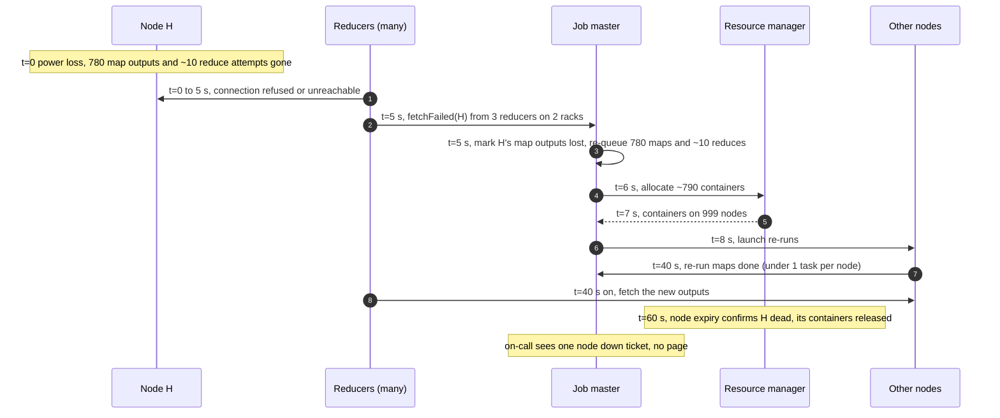

Data at risk: none committed. Detection: ~5 s for a crashed process (connection refused), 60 s for a silent host such as a powered-off node behind a routed fabric (timeouts do not count, so the heartbeat expiry is the verdict). User sees: job takes up to ~5 min longer. On-call sees: a node-down ticket.

**Job master death, see Flow 5.** Detection: AM expiry (YARN default 600 s; we set 60 s). Recovery: journal replay, seconds. Data at risk: in-flight attempts.

**RM failover.**

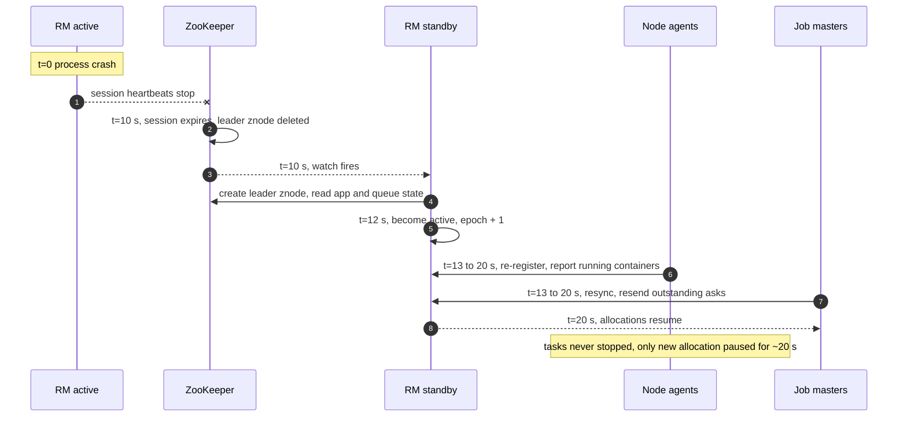

### 10.5 Exactly-once and idempotency end to end

| Where a duplicate can enter | How it is removed | Dedup key | Lives for |
|---|---|---|---|
| Client retries `POST /jobs` | Unique `request_id` in the job store | `request_id` | 7 days |
| Same job submitted twice with a new id | Output path must not exist at submit; job commit uses a conditional put | `output_path` | Forever |
| Map retried or backed up | Job master keeps the first `mapDone`, ignores the rest; reducers fetch only the recorded attempt | `task_id` | Job lifetime |
| Reduce retried or backed up | `canCommit` grants exactly one attempt; temp paths per attempt | `task_id`, `attempt_id` | Job lifetime, journaled |
| Zombie attempt or old job master | Attempt and `jm_attempt` in path and token; commit refused; manifest lists only committed files | `jm_attempt` | Job lifetime |
| Counters from duplicate attempts | One counter set per task, from the accepted attempt, replaced on re-run | `task_id` | Job lifetime |
| Old job master during a partition | Journal is single-writer under a DFS file lease. The new attempt recovers the lease, so the old master's appends fail, and the old master must journal before it says yes or starts a commit | journal lease | Job master attempt |
| User side effects | User's upsert keyed by `(job_id, task_id, offset)` | User-defined | User-defined |

### 10.6 Consistency model per edge

| Edge | Model |
|---|---|
| Client to job service (submit, status) | Strong for submit (one row per `request_id`), read-your-writes for status |
| RM state in ZooKeeper | Linearizable writes, one active RM |
| Job master journal on DFS | Single writer per job master attempt, append order is commit order |
| Map output to reducers | Immutable once written, located through the job master. A reducer may see a lost output and must retry: eventually consistent location, never torn data |
| Task output to final output | Invisible until job commit, then all at once: atomic visibility |
| Readers of output | Must check `_SUCCESS` or the manifest. Listing a directory without it is not safe |
| Counters during a run | Approximate (includes running attempts, shown as such). Exact at job end |

### 10.7 Alternatives rejected

| Alternative | Why it looked attractive | Why rejected |
|---|---|---|
| Keep the paper's single master per job, abort on failure | Simplest, paper-backed | ~23% of 6 h jobs would restart from zero (§5.5) |
| Hash shuffle: R files per map task | No sort on the map side | 7.8 B files for the sort; file handles and inodes explode. Spark dropped it for sort-based shuffle |
| Store intermediate data in the DFS | Survives node loss | 3x the bytes of the most expensive phase. Recompute is cheaper |
| Spark-style in-memory shuffle and caching | 10x faster for iterative jobs | Out of scope by requirement; it is the next system, not this one |
| MPI all-to-all | Fastest network use | No fault tolerance; one dead process kills the job |
| Remote shuffle fleet now | Stateless compute | Extra fleet and double network crossing, not needed on long-lived nodes |
| Speculate everything at 10% done | Kills stragglers early | Doubles load on the shuffle and copies skewed tasks |
| One global FIFO queue | Simple | 500 TB jobs starve everyone |

### 10.8 How the big companies do it

- **Google**: MapReduce on GFS (2004) with the single master, backup tasks and local intermediate files described here. Google later built FlumeJava (pipelines of MapReduces optimized as one plan) and Cloud Dataflow, which runs shuffle as a separate managed service. Petasort: 1 PB sorted in 6 h 2 min on 4,000 machines in 2008, then 33 min on 8,000 machines in 2011 ([Google Research blog](https://research.google/blog/sorting-petabytes-with-mapreduce-the-next-episode/)).
- **Yahoo! and Hadoop**: Hadoop 1 with one JobTracker per cluster hit ~4,000 nodes; YARN split the RM from per-job application masters (SoCC 2013). The same split is in this design.
- **Microsoft Cosmos**: Dryad and SCOPE on Cosmos; Mantri (outliers) and Riffle-style merging came from these clusters.
- **LinkedIn and Uber**: push-merge shuffle (Magnet, now in Spark 3.2+ as push-based shuffle) and remote shuffle services (Uber RSS, ~8 to 10 PB/day; Apache Celeborn from Alibaba). Both exist because the M x R problem of §5.1 is the limit everyone hits.
- **Spark**: same model, generalized to a DAG of stages with in-memory caching. Databricks sorted 100 TB in 23 min on 206 nodes in 2014, vs Hadoop's 72 min on 2,100 nodes ([Databricks](https://www.databricks.com/blog/2014/11/05/spark-officially-sets-a-new-record-in-large-scale-sorting.html)).

### 10.9 Operational runbook

Dashboards (the five numbers):
1. Running containers by queue vs guarantee.
2. Queue wait time p50 / p95 by queue.
3. Shuffle fetch failure rate and shuffle service read latency p99, per rack.
4. Job failures by cause (user code, infra, preempted, killed).
5. Speculative and re-executed task-seconds as % of total (waste).

Alerts: no active RM 60 s (page cluster team); fetch failure rate > 1% for 10 min (page cluster team); infra failure rate > 2x baseline for 30 min (page framework team); DFS > 85% (page storage team); a queue below guarantee for > 10 min with pending work (ticket).

Rollout: framework library per job, canary 1% of jobs, compare success rate and p95 runtime per job name against last week. Shuffle service and node agent: restart in place, one rack at a time. Draining is too slow (a rack with 6 h jobs takes hours, 100 racks take weeks). So the shuffle service persists job secrets and application state to local disk (`yarn.nodemanager.recovery.enabled`, default false, we turn it on), and reducers retry fetches for 30 s (`shuffle.fetch.retry`, which Hadoop ties to NM recovery), so a 10 s restart is not mistaken for a node loss. The framework library version is pinned per job across job master attempts, so a new attempt never replays an old journal with a new format. A cluster-wide node health check removes black-hole nodes (fail every task fast) for all jobs, since per-job blocklisting still burns ~3 attempts per job. Rollback: pin jobs to the old library version; restart node daemons on the old version. Data to backfill: none, outputs are per job and either committed or absent.

### 10.10 Security and abuse

- Users authenticate to the job service (Kerberos or OIDC). Jobs run as the submitting user, in containers with cgroup limits on CPU, memory and disk.
- Tasks access the DFS with a **delegation token** scoped to the job and its lifetime, not the user's long-lived credential.
- Shuffle fetches carry an HMAC with a per-job secret, so a task from job A cannot read job B's map output on the same node.
- Containers run as the submitting user, and each job's local map output directory is `0700` for that user, so a task cannot read another job's map output straight from local disk.
- Pushes to mergers carry the target job's HMAC like fetches do, and mergers key merged files by (job, shuffle, partition), so one job cannot append forged slices to another job's merged partition.
- A malicious job can: burn its queue's share, write up to its DFS quota, fail its own tasks. It cannot: exceed the queue's max share, read other jobs' intermediate data, commit into another job's output path (paths are checked against the user's DFS permissions at submit and commit).
- Rate limits: submits per user per minute at the job service; max tasks per job (e.g. 2 M); max R (e.g. 100k) and a cap on M x R (e.g. 10 B pairs) plus a minimum bytes per partition, because R alone does not protect the job master: at M = 780k and R = 100k the empty-block bitmap alone is 12.5 KB per map, ~9.75 GB.

### 10.11 Evolution

- **10x scale (40,000 nodes, 100 PB/day).** One RM is past its comfort zone: federate into ~10 sub-clusters with a router. Shuffle moves to a **remote shuffle fleet** on NVMe so compute nodes become stateless and can be spot or autoscaled. Storage likely moves to an object store, so locality stops mattering and the manifest committer becomes the default.
- **Compute and storage split (cloud).** Split locality becomes irrelevant (every read is remote, ~10 ms first byte). Delay scheduling is removed. The cost model changes from owned nodes to per-second VMs, and the cluster autoscales on queue backlog ([`../cluster-manager/`](../cluster-manager/)).
- **Users want multi-stage pipelines.** Chaining MapReduce jobs writes every intermediate result to the DFS with 3 replicas. The seam is the job master: let it run a DAG of stages with shuffles between them instead of one map and one reduce. That is Spark and Dataflow. It is the reason Google moved on.
- **GDPR delete.** Outputs are immutable files. Deletion means rewriting the affected files in a new job and committing a new manifest. A table format (Delta, Iceberg) makes this a supported operation.

---

## 11. Follow-up questions to expect

Ranked by how often they come up.

1. Why do completed map tasks re-run after a worker dies, but completed reduce tasks do not? (§4.4, [`edge-cases.md`](edge-cases.md))
2. How do you avoid duplicate output when a task is retried or backed up? (§4.4, §5.4, [`deep-dives/output-commit-and-exactly-once.md`](deep-dives/output-commit-and-exactly-once.md))
3. What happens when the master dies? (§5.5, [`deep-dives/fault-tolerance-and-recovery.md`](deep-dives/fault-tolerance-and-recovery.md))
4. One key has 20% of the data. Now what? (§5.3, [`deep-dives/data-skew-and-partitioning.md`](deep-dives/data-skew-and-partitioning.md))
5. How do you pick M and R? (§4.1)
6. What does the combiner do, and when can you not use one? (§4.2, [`deep-dives/map-side-sort-spill-and-combine.md`](deep-dives/map-side-sort-spill-and-combine.md))
7. How do you handle stragglers? What can go wrong with speculation? (§5.2, [`deep-dives/stragglers-and-speculation.md`](deep-dives/stragglers-and-speculation.md))
8. Why is the shuffle slow, and how would you make it faster? (§5.1, [`deep-dives/shuffle-pull-push-and-remote.md`](deep-dives/shuffle-pull-push-and-remote.md))
9. How do multiple teams share the cluster? (§4.5, [`deep-dives/scheduling-locality-and-multi-tenancy.md`](deep-dives/scheduling-locality-and-multi-tenancy.md))
10. The map function is non-deterministic. What breaks? (§5.4)
11. How do you sort 1 PB with a total order? (Flow 2, §5.3)
12. Output goes to S3. What changes? (§5.4)
13. Why did the industry replace MapReduce with Spark and Dataflow? (§10.11)
