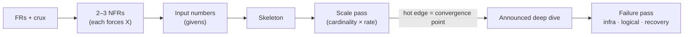

# Staff Design Method — Detailed

Companion to `method.md`. The short version is what you drill, and this one explains why each line is there. The section numbers match, so any line in the short version can be looked up here.

---

## 0. The one rule

**A number, NFR or failure that doesn't change a decision is noise.** Every time you state one, say what it forces in the same breath.

- ✗ "It's 1M writes/s." → the interviewer has to ask "so what?"
- ✅ "1M location writes/s, so Postgres is out; in-memory geo index sharded by cell, with TTL."

This rule holds the rest of the method together. Numbers, NFRs and failures are all tools for *finding decisions*, and on their own they earn no credit.

## 0.1 The clock

| Phase | Product problem (Feed, Uber, Slack) | Infra problem (S3, queue, rate limiter) |
|---|---|---|
| Requirements + input numbers | 10 | 10 |
| HLD + scale pass | 15 | ~8 |
| Announced deep dive + failure pass | 20 | ~35 |
| Wrap: evolution, checkpoint | 5 | 5 |

- **Why the HLD is capped.** A long, open design phase is where your numbers arrived late and the deep dive went unannounced in both Session 1 rounds. The cap forces the switch into depth.
- **Why infra problems differ.** Infra problems have few boxes, and the internals *are* the problem. Nobody scores a box labelled "storage node"; they score replication, durability and node loss.

**What to notice**
- Numbers come in two waves: givens up front, derived numbers on edges during the HLD.
- The scale pass *selects* the deep dive. You don't choose it by taste.
- The failure pass runs inside the deep dive, not as a separate phase.

---

## 1. Requirements — 10 min

### 1.1 Functional: plant the crux

Your recurring gap has been the crux emerging *during* the HLD. That is a scoping failure, not a numbers failure.

- **Write operations with their hard constraint attached.** A bare feature hides the hard part; a constraint exposes it.

  | Feature (weak) | Requirement (strong) |
  |---|---|
  | Match riders to drivers | Assign exactly one driver per ride **and** one ride per driver |
  | Send a message | Send in order, exactly once, visible to sender immediately |
  | Post to feed | Post visible to all followers, including 100M-follower accounts |

- **Name the crux out loud:** "The hard part is the second half of that sentence."
- **Park the rest with a hook.** For example: "Payments and ratings are out of scope; the trip-completed event is the seam they'd hang off." Declaring what you're *not* building is Staff signal, and weak scoping cost D1 in both rounds.

### 1.2 Non-functional: only the 2–3 that shape this problem

Reciting all of them is noise. Pick the ones that change the design, and for each one say what it forces.

**Consistency is set per operation, never per system.** Run three questions in order:
1. **Contention.** Do two actors touch the same entity at once? If not, there is no consistency problem, so don't spend budget on one.
2. **Permanence.** If they act on stale data, is the bad outcome *unreconcilable* or *self-healing*? Unreconcilable means strong consistency.
3. **Cost of being wrong.** Money, safety or double-booking are serious; a cosmetic blip is not. Use this as the tiebreaker.

| Operation | Contention | Outcome if stale | Guarantee |
|---|---|---|---|
| Payment debit | Yes | Money spent twice, permanent | Strong |
| Driver assignment | Yes | Double-assigned driver, permanent | Strong (CAS on the driver row) |
| Slack: sender sees own message | — | User thinks send failed | Read-your-writes |
| Slack: other members receive it | No | ~100s of ms of skew, heals | Eventual |
| Like count | Weak | 49 vs 50, heals | Eventual |

- **Link to scale.** Strong-consistency operations sit at the *convergence points*, where many flows hit one entity. Contention and convergence are the same spot seen from two angles.
- **Link to latency.** Strong consistency costs coordination round trips, so those operations earn a looser latency budget. Say so explicitly: "Quorum write, so tens of ms, and that's the price of correctness."

**Availability.** Ask what downtime costs *on this path*. Saying where availability doesn't matter is signal, because it scopes the problem down and buys time for depth.
- **CP by choice.** Ledgers, unique-ID issuance and leader election should reject writes during a partition rather than answer wrongly.
- **Async or internal paths.** Batch analytics and reporting can simply retry, so active-active there is waste.
- **Human or retry in the loop.** When the caller will naturally try again, moderate availability is enough.

**Latency.**
- **Perception anchors:** <100 ms feels instant; up to ~1 s is noticed but the user stays in flow; >1 s is felt; ~10 s loses the user.
- **Budget by subtraction:** "The user tolerates ~300 ms and the network eats ~100, so I have 200 ms of server p99 to split across hops."
- **Always quote p99.** An average hides the tail users actually hit.
- **Match the budget to the work.** A single-key get has no excuse to be slow, while a quorum write is allowed tens of ms.
- **Your tiny-URL lesson.** A 10–20 ms target was meaningless behind a ~200 ms connection. Redis was the right component, but its justification was the read:write skew protecting the DB, not latency. State the *true* reason, because that is what scores.

**Scale** (at requirements time you only know the input scale).
- **How big.** How does input load grow? Scalability is the crux only when **growth changes the design**, not just the machine count. That usually happens at a stateful component (shard key), a fan-out edge, or under skew.
- **How spiky.** State peak ÷ average (Prime Day, New Year's midnight). The burst is what earns queues, load shedding and autoscaling.

**Keep in the pocket, raise only when triggered:**

| NFR | Trigger to raise it |
|---|---|
| Durability | Losing the data loses money or something the user can't recreate (state RF and ack level) |
| Security / compliance | Money, PII, regulated data; data residency (GDPR, in-region) |
| Ordering | Chat, event logs, anything where sequence changes meaning |
| Read:write ratio | Always worth one sentence; 1000:1 drives caching, replicas, denormalization |
| Cost | Cross-AZ/region traffic, storage tiering; reads as senior when stated as a constraint |

### 1.3 Input numbers: givens only

State users, QPS, payload size, read:write and peak:avg. Don't derive internal numbers yet, because you can't until the design exists, and trying to is what made numbers feel impossible up front.

---

## 2. HLD — 15 min

### 2.1 Skeleton first, fast

Get a working end-to-end path on the board. Its job is to have edges you can annotate. Polish comes later, if ever.

### 2.2 Scale pass: find the hot edges

**Step 1: label cardinality on each edge.**
- `1:1` is a pass-through.
- `1:N` means amplification (fan-out, replication).
- `N:1` into a stateful component means convergence.

**Step 2: multiply by rate.** Cardinality shows *where* to look, and rate shows *whether it matters*. A 1:3 edge on a rare path is nothing, while 1:N with N = followers on every post is the whole problem.

**Four tests for a hot edge** (any one is enough):

| Test | Question | How you find it | Example |
|---|---|---|---|
| Amplification | Does one in become many out? | Follow a request **forward** | 1 post → ~14M timeline writes/s |
| Firehose | Does it carry the full high-frequency ingest? | Look at input numbers | ~5M drivers pinging every ~4 s → ~1M writes/s |
| Convergence | Do many flows land on one stateful thing? | Count arrows **into** each store | Every match attempt hits the same driver row |
| Skew | Is load non-uniform? | Ask "is this evenly distributed?" | Celebrity account, hot chat channel |

- **Annotate only hot edges**, in the form number → decision. "1M msgs/s × fan-out 10 = 10M deliveries/s, so async via a partitioned queue, not synchronous RPC."
- **Say it and move on** if a hot edge lands on a stateless service. "Stateless, scales horizontally" is a complete answer.
- **Numbers can clear a path too.** "Ride creates are ~5K/s, about 1000× fewer than location writes, so the trip store isn't the bottleneck." That tells the interviewer where *not* to dwell.
- **Bonus:** a 1:N edge usually implies a 1:N in the schema, so the same pass hints at the data model.
- **Don't conflate convergence with critical path.** The critical path is what the user waits on; convergence is where flows pile up. They often overlap, but a background fan-out can converge without being on anyone's critical path.

---

## 3. Deep dive — 20 min

### 3.1 Announce it

Say: *"I'm going deep on the matching path now."* That one sentence moves D3 and D5.

**Which one:** the convergence point the scale pass found. Scale, strong consistency and the interesting failures usually concentrate there, so one deep dive covers most of the round.

### 3.2 Failure pass on that component

Run the three lists from memory. Voice each item only where it bites on this component.

**Infra: something underneath breaks.**

| Failure | What to answer |
|---|---|
| Node loss | Who detects it, what state is lost, who takes over |
| AZ loss | Is a replica/quorum still reachable? What's the blast radius? |
| Network partition / delay | Which side keeps serving? Do timeouts misfire under slowness? |
| GC pause | The process is alive but frozen and still holds locks/leases, so the lease expires while it thinks it's leader. You need a fencing token or epoch |

**Logical: every machine is healthy and it's still wrong.** Your correctness gaps have been here, not in infra.

| Failure | Question | Typical mechanism |
|---|---|---|
| Duplicate | Same request twice (client retry, at-least-once queue)? | Idempotency key, dedupe table |
| Race | Two operations on one entity at once? | CAS / version column, `SET NX PX`, conditional write |
| Poison message | One input fails forever and blocks or crashes consumers? | Retry cap → DLQ, skip and alert |
| Backpressure | Downstream slower than inflow? | Buffer (bounded queue), shed, or throttle; say which |

- **The Uber double-assignment was a *race*.** OCC guarded the ride row but not the driver row. The race question, asked of every row that two flows write, would have surfaced it.

**Recovery: how it comes back.**
- **Catch-up.** How does a returning node or healed partition get current (log replay, snapshot, re-sync)?
- **Split-brain.** Can two leaders act during the healing window? What fences the old one?

---

## 4. Wrap — 5 min

- **Checkpoint.** "Here's what I built, here's what I'd do next."
- **Evolution.** Name what breaks at 10× and the first change you'd make.
- **Parked items.** Revisit anything you parked with a hook, in one line each.

---

## Self-check after every round

Maps to rubric §8 (M1–M8).

1. Did I name the crux as a constrained operation within 10 min? *(M1)*
2. Did I park scope with hooks? *(M2)*
3. Did each NFR I stated force something, with consistency set per operation? *(M3)*
4. Were the input numbers on the board before any boxes? *(M4)*
5. Did every hot edge carry number → decision? *(M5)*
6. Did I say "I'm going deep on X" by ~25 min? *(M6)*
7. Did I run infra, logical and recovery on that component? *(M7)*
8. Did I hold the clock? *(M8)*
