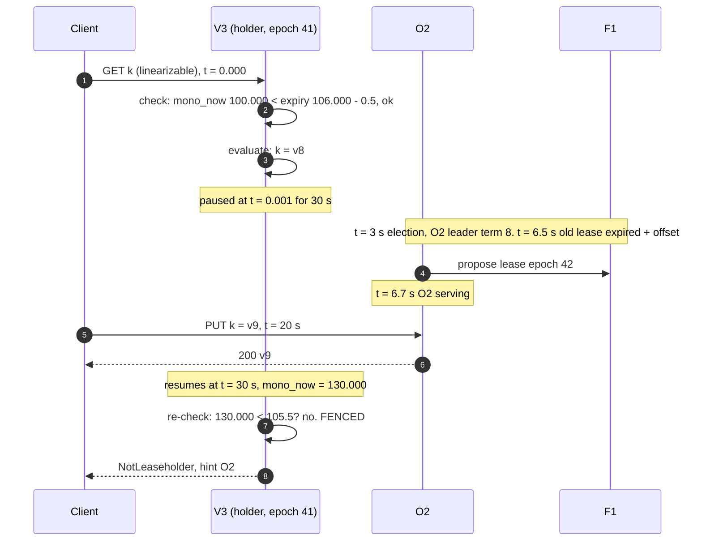

# Deep dive: fencing stale leaders, partitions, and the paused process

> One-line answer: writes are fenced by the Raft term (a follower rejects any proposal from an older term), reads are fenced by the lease bound on the monotonic clock checked after the read is evaluated (a paused holder wakes up past its expiry and refuses to reply), a partitioned region fences itself because lease renewal is a Raft commit it can no longer make, and pre-vote plus check-quorum keep a flapping node in the far region from deposing a healthy leader every time it reconnects.

Part of [`../solution.md`](../solution.md) §5.4. Concept: [`../../../concepts/leases-fencing-clocks.md`](../../../concepts/leases-fencing-clocks.md) §3 and §5.

## 1. The three ways an old leader can hurt you

| Scenario | What the old leader could do | What stops it |
|---|---|---|
| Partitioned, still running | Accept a write and ack it | Its proposals carry its old term; no follower outside the partition accepts them; it has no majority inside the partition, so nothing commits. It cannot ack |
| Partitioned, still running | Serve a linearizable read from stale state | Lease renewal is a Raft commit. It fails. At most 9 s after the last renewal the holder's own clock says the lease is over and it refuses. Check-quorum makes it step down as Raft leader even sooner, at one election timeout |
| Paused mid-operation, resumes later | Reply with a value it evaluated before the pause | The lease check is repeated after evaluation on the monotonic clock. A 30 s pause moves the clock past expiry. If the clock did not advance (some VM pauses), the next Raft message it sends returns a higher term and it steps down before replying |

The general principle from [`../../../concepts/leases-fencing-clocks.md`](../../../concepts/leases-fencing-clocks.md): a holder can never prove to itself that it still holds anything; only the *checker* (the follower for writes, the clock bound plus quorum for reads) can reject it. The design puts the check at the point of effect, not at the point of decision.

## 2. Raft term as the write fence

Every `AppendEntries` carries the leader's term. A follower that has seen a higher term rejects it and replies with that term; the old leader steps down on seeing it. A follower that has *not* seen a higher term (because it was also in the partition) accepts, but the partition by construction holds fewer than a majority, so the entry never commits and never acks. When the partition heals, the old leader's uncommitted tail is overwritten by the new leader's log (Raft's log matching), which is safe because nothing in that tail was ever acknowledged.

Downstream fence: a consumer of the change feed or a service that acts on a lease from this store (a job scheduler that thinks it owns a job) carries the `lease_epoch` or the entry's term into its own writes, exactly the sequencer pattern from Chubby. A storage system that receives a write with an older epoch than the newest it has seen rejects it.

## 3. The lease as the read fence, and what "bounded clock" means precisely

The invariant: no node proposes a lease for a range until `previous_expiry + max_offset` has passed on its own clock. The proof that two holders never serve at the same real instant: the new holder waits until *its* clock passes `expiry + max_offset`. The old holder serves only while *its* clock is below `expiry - max_offset`. For both to be true at the same real instant, the two clocks would have to differ by more than `2 × max_offset`. Nodes exit at `max_offset`. So at most one of the two serves at any real instant. That is the whole proof and it fits in one breath; practise it.

The monotonic clock matters because a wall-clock step (NTP correcting an error) could move the holder's clock backward and extend its lease in its own eyes. The lease bound is checked against `CLOCK_MONOTONIC` plus the wall-clock offset measured at grant time, so a wall-clock step does not extend it. What monotonic clocks do *not* protect against is a process that is not running: the check "before and after" handles the pause case because the clock keeps advancing while the process is stopped (for GC and `SIGSTOP`; for a VM that is fully suspended the guest clock may stop, hence the second defence via term).

## 4. Clients inside a partitioned region

V is cut off from O and F but alive. Three kinds of clients:

- **Linearizable readers and writers in V.** For up to 9 s (lease) they are served by V3 normally, and those operations are correct: V3's lease is still valid, O and F have not elected anyone (they wait out the lease). After 9 s V3 refuses with `Unavailable`. The SDK's failover order is `[home, nearest, far]` gateway DNS names; if V's Internet egress works, the second name (O) answers. If V is fully isolated, V's clients are down. Correct: two sides of a partition cannot both serve linearizable operations.
- **Stale readers in V.** Served throughout from V replicas at their last closed timestamp, with the staleness reported in the header. The `max_age` cap makes them fail once the closed timestamp is older than the caller allows. A dashboard keeps working; a permission check with `max_age 2 s` starts failing after 2 s, which is the documented behaviour.
- **Watchers in V.** Receive no new events (nothing commits in V) and see `resolved_ts` stop advancing. Their cache is frozen, not wrong.

The one thing that must never happen is V3 accepting a write during the partition, and that is the term fence, not the lease: even during its valid lease, V3's proposal needs 3 of 5 acks and can only get 2 (itself and V1). It times out. The client retries with its idempotency key later, against O2.

## 5. Elections that should not happen

**Pre-vote.** A candidate first asks "would you vote for me in term `t + 1`?" without incrementing its own term. Voters say yes only if they have not heard from a leader within their election timeout and the candidate's log is up to date. A node that was partitioned alone (F1 flapping) gets "no" from everyone, never bumps its term, and does not force the healthy leader to step down when it reconnects. Without pre-vote, a single flapping far-region node causes a leader change on every reconnect, each one a 3 to 12 s write outage for the range.

**Check-quorum.** A leader that has not heard from a majority within one election timeout steps down voluntarily. This bounds how long a partitioned leader keeps its Raft leadership (3 s) independently of the lease (9 s), and makes the healthy side's election start sooner.

**Election timeout on a WAN.** The Raft paper's 150 to 300 ms assumes a LAN where broadcast time is under a millisecond. Across regions the max RTT is 155 ms; etcd's guidance is at least 10 × RTT. We use 3 s: about 20 × the max RTT, so a congested link never looks like a dead leader, and short enough that failover fits the 30 s RTO with the lease on top.

## 6. Fencing for the placement controller and the change feed

- **Membership changes** are Raft entries with the range generation. A change proposed against a stale generation is rejected, so two controllers (during a controller failover) cannot both add a replica.
- **Change feed consumers** carry the last `(commit_ts, index)` they applied. A feed that restarts from an older leaseholder's view cannot deliver anything the consumer has not already seen at a higher position, because commit order is the log order and the log is shared.
- **Backups** record the closed timestamp they were taken at and the lease epochs, so a restore can prove it is not older than data already served.

## 7. What the interviewer asks next

- "GC pause of 30 s, walk me through it." §1 table row 3 and the sequence diagram. The read that was evaluated before the pause is never returned.
- "Why both a term and a lease? Is one not enough?" Term fences writes for free but says nothing about reads served without a round trip. Lease fences reads but is a clock argument. Each covers what the other cannot.
- "What if `max_offset` is violated?" The read fence's proof fails. That is why the offset is measured on every heartbeat and the node exits at 80% of the bound; the bound is enforced, not hoped for.
- "Can the clients in the dead region read anything?" Stale reads, honestly labelled, until `max_age` runs out. Linearizable operations, no. That is the definition of the guarantee.
