# Deep dive: migration from single-region Postgres, verification, and the runbook

> One-line answer: migrate one tenant cohort at a time behind flags, with Postgres as the truth until the last phase (CDC backfill, dual write, flip stale reads, flip linearizable reads, flip writes with reverse CDC), so every phase's rollback is a flag flip and the data on both sides is reconciled by versions; verify linearizability continuously with a canary workload checked by Porcupine and with invariants on the real data; and page on the four things that mean the guarantee is at risk (no lease, no quorum, clock offset, apply lag) rather than on latency alone.

Part of [`../solution.md`](../solution.md) §8 and §10.9. Concept: [`../../../concepts/exactly-once.md`](../../../concepts/exactly-once.md) for the CDC and outbox pieces.

## 1. Where we start

A Postgres primary in V with a streaming replica in O (asynchronous), 300 GB of catalog rows, one `catalog` service in front of it, 5k writes/s at peak. Failover is a runbook: promote the replica, repoint DNS, accept that the last seconds of writes are lost. Reads from F cross the ocean. This is the "Bad" rung of the write-path ladder and it is what most companies actually run.

## 2. The plan, phase by phase

```mermaid
%% Migration phases. Postgres is the truth until phase 5. Each arrow back is the rollback for that phase: a flag flip, never a data restore.
flowchart LR
    P0[Phase 0<br/>Postgres primary V<br/>async replica O] --> P1[Phase 1<br/>store deployed in V O F<br/>shadow traffic replayed from logs]
    P1 --> P2[Phase 2<br/>CDC snapshot + tail<br/>Postgres to store<br/>checksum per tenant]
    P2 --> P3[Phase 3<br/>dual write, Postgres truth<br/>divergence alerts]
    P3 --> P4[Phase 4<br/>flip reads per cohort<br/>stale_ok first, then linearizable]
    P4 --> P5[Phase 5<br/>flip writes per cohort<br/>store truth, reverse CDC to Postgres]
    P5 --> P6[Phase 6<br/>Postgres read only 30 d<br/>then archived]
    P4 -.->|"flag: reads back to Postgres"| P3
    P5 -.->|"flag: writes back to Postgres, reverse CDC has kept it current"| P4
    P3 -.->|"flag: stop dual write"| P2

    class P0,P6 external
    class P1,P2,P3,P4 service
    class P5 critical

    classDef external fill:#e5e7eb,stroke:#6b7280,stroke-width:2px,color:#111,stroke-dasharray:4 3
    classDef service  fill:#dcfce7,stroke:#16a34a,stroke-width:2px,color:#111
    classDef critical fill:#fee2e2,stroke:#dc2626,stroke-width:4px,color:#111
```

| Phase | What | Exit criterion | Rollback |
|---|---|---|---|
| 1 Build | Deploy 60 nodes in V O F. Replay a day of Postgres write logs at 10x speed as shadow traffic. Region-kill drill in staging | Shadow p99 write < 200 ms, drill RTO < 30 s ten times in a row | Delete the cluster |
| 2 Backfill | Per tenant: Postgres snapshot at LSN `L` bulk-ingested as SSTs, then tail the WAL from `L` and apply as CAS writes keyed by Postgres row version | Row counts and per-tenant checksums match for 3 consecutive hours | Stop the tail, drop the tenant's ranges |
| 3 Dual write | The catalog service writes Postgres first (truth), then the store with `expected_version` from the Postgres row version. Divergence detector compares 1% of rows every minute | Zero divergence for 7 days at full traffic | Flag off the second write |
| 4 Flip reads | Per cohort (1%, 10%, 50%, 100%): reads with `stale_ok` from the store, then linearizable reads from the store. Compare responses in shadow for the first cohort | p99 read latency in every region under target; no correctness diff in shadow | Flag reads back to Postgres; the store is still receiving every write |
| 5 Flip writes | Per cohort: writes go to the store first (truth); reverse CDC from the change feed writes them back to Postgres with the store's version as the row version | Reverse CDC lag < 5 s for 7 days | Flag writes back to Postgres, which reverse CDC has kept current to within seconds; reconcile the last seconds by version |
| 6 Decommission | Postgres read only for 30 days (the rollback window), then archived | Nobody reads it for 30 days | None needed |

**Why versions make this safe.** Every Postgres row already has a version column (or gets one in phase 0). The store's CAS uses it. During dual write, a write that reaches Postgres and fails on the store leaves a divergence that the detector catches and the tail repairs from the WAL, because the WAL is the truth in phases 2 to 4. During reverse CDC the direction flips and the change feed is the truth. At no point are two systems both the truth.

**What the app must change.** Two things: the read call gains a `consistency` argument (default linearizable, so nothing changes until the team opts into stale reads), and the write call carries an `Idempotency-Key`, which the catalog service already has as the request id. Everything else is inside the client SDK.

## 3. Proving it is linearizable

Nobody proves it; you test it hard and keep testing.

- **Jepsen-style, in staging, nightly.** Five client processes in three regions do CAS on ten registers through the real API while a nemesis partitions regions, kills leaseholders, pauses processes for 30 s, and skews one node's clock by 400 ms. The history (every invocation and response with wall times) is checked by Porcupine (Go) or Knossos (Clojure) against the register model; the `txn` API is checked with Elle for cycle anomalies. Any violation fails the build.
- **Canary in production, hourly.** The same workload on a canary tenant without the nemesis, 60 s of history, checked by Porcupine. It catches a bad binary on a real cluster within an hour.
- **Invariants on the real data, continuous.** Versions strictly increase per key (from the change feed); no two live keys with the same name (by construction, but checked); every `commit_ts` within `max_offset` of the wall clock at commit; every range has exactly one valid lease.
- **Drills.** Kill a region in staging weekly and measure RTO per range. Kill a random leaseholder node in production monthly during business hours. Inject a clock offset quarterly and confirm the node exits.

## 4. The runbook

### 4.1 Dashboards (five that matter)

1. Per range, rolled up per region: `lease_valid`, `leaseholder_in_preferred_region`, live voters (should be 5).
2. Raft apply lag per region, p50 and p99, in seconds.
3. Latency: write p99 from the home region, linearizable read p99, stale read p99, per region.
4. Follower read staleness p99 (`now - closed_ts` at serve time).
5. Clock offset per node: max and median against peers.

### 4.2 Alerts

| Alert | Threshold | Page or ticket | First step |
|---|---|---|---|
| Unavailable ranges | > 0 for 60 s | Page | Which region lost quorum? `live voters < 3` on the range page |
| Ranges without a valid lease | > 0 for 15 s | Page | Election stuck (pre-vote failing?) or lease waiting on an expired holder |
| Clock offset | > 250 ms on any node | Page | The node will exit at 500 ms. Check the time service on that host |
| Write p99 from home | > 200 ms for 5 min | Page | Leaseholders in the wrong region, or the nearest-region pair is degraded and F is on the commit path |
| Region apply lag | median > 2 s | Page | That region's followers are behind; follower reads there will forward; check the cross-region link |
| Leaseholders outside preferred region | > 1% for 10 min | Ticket | Placement controller stuck or a bad rule |
| Meta range QPS | > 10x baseline | Ticket | Gateway cache thrash, usually after a mass split |
| Follower staleness p99 | > 5 s | Ticket | Closed timestamp not advancing (a long-running proposal?) |
| Live voters | < 5 on any range for > 10 min | Ticket, page if < 4 | Controller should be re-replicating; if not, why |

### 4.3 Rollout of the store itself

- Node binary: one node per region for 24 h, then one region, then the rest. At most one voter per range restarts at a time. Drain first (transfer leases away), so a restart costs no election.
- Placement controller rules: 1% of ranges for one hour, then all.
- Client SDK: normal service rollout; the API is versioned.
- Rollback: redeploy the previous binary in the same order. A schema change to the replicated state (a new entry type) is gated by a cluster version that only advances once every node runs the new binary, so a rollback before the gate is always safe.

### 4.4 The three incidents to rehearse

1. **Region loss.** Expect 5 to 12 s of write unavailability for tenants homed there, then 160 ms writes. Confirm `live voters` recovers to 5 after 5 minutes. When the region returns, confirm leases move back.
2. **Slow disk on a leaseholder node.** Write p99 rises for its ranges only. Move its leases (one command), then replace the node.
3. **Clock incident.** A node exits; its ranges fail over in about 10 s. Fix the host's time source before restarting it; the node refuses to start if its offset is still above the bound.

## 5. Cost, stated

- 60 nodes with local NVMe (say 16 cores, 64 GB, 2 TB each): the compute bill. About 5x storage of 1.5 TB.
- Cross-region: 15 MB/s of log replication at 1x, about $25/day at $0.02/GB. Negligible.
- Engineering: 6 people, 2 to 3 years to reach the maturity of a store that has been in production for a decade. The honest recommendation is to buy Cloud Spanner or managed CockroachDB where the platform can take that dependency, and to build only when it cannot (data residency, an on-premises control plane, or a dependency policy). Say the number so the interviewer knows you have thought about it.

## 6. What the interviewer asks next

- "Zero downtime?" Every phase is a flag per cohort; nothing stops. The only user-visible change is latency, which improves for remote regions once reads flip.
- "How do you know the two systems agree during dual write?" The divergence detector samples 1% of rows per minute and compares versions and values; any diff pages, and the WAL tail repairs from the truth.
- "Rollback after writes have flipped?" Reverse CDC has kept Postgres current to within seconds; flip the flag, reconcile the last seconds by version. The 30-day read-only window is the safety margin.
- "What pages at 3am?" §4.2, the four pages: no quorum, no lease, clock offset, apply lag. Latency pages only when it means the commit path has changed.
