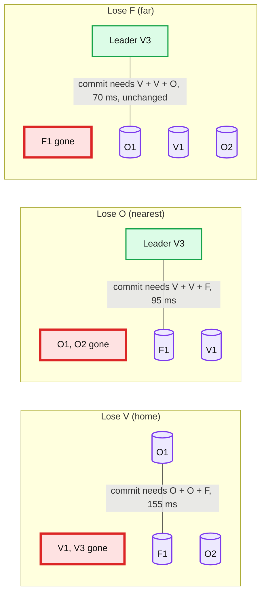

# Deep dive: quorum placement and region loss

> One-line answer: a majority of 5 is 3, so put 2 voters in the home region, 2 in the nearest region, and 1 in the far region; every commit is then one nearest-region round trip, any single region can vanish and 3 voters remain, and a node reboot on top of that is survivable everywhere except the one region that is now the only one with two survivors. Three voters in three regions also survives a region loss, but at zero margin, which is why nobody runs it for data they care about.

Part of [`../solution.md`](../solution.md) §5.1. Concept: [`../../../concepts/replication-and-quorums.md`](../../../concepts/replication-and-quorums.md) §3, [`../../../concepts/raft.md`](../../../concepts/raft.md) §4 and §6.

## 1. The arithmetic, once

Raft and Multi-Paxos commit when a majority of voters have the entry on disk. Majority of N = `floor(N/2) + 1`. The system tolerates `N - majority` failures: 1 for N = 3, 2 for N = 5. Even N never helps: N = 4 has majority 3 and tolerates 1, the same as N = 3, at 33% more cost.

Two questions decide the layout: **which failures must the majority survive** (a region, a region plus a node) and **how far away is the closest majority from the leader** (that is the commit latency).

| Layout | Voters | Majority | Survives region loss | Survives region loss + 1 node | Commit latency from home (V) | Cost |
|---|---|---|---|---|---|---|
| A: all in V | 3 | 2 | No | No | 1 ms | 3x |
| B: V O F, 1 each | 3 | 2 | Yes, 2 of 3 | No, 1 of 3 | 70 ms (V + O) | 3x |
| C: V V O O F | 5 | 3 | Yes, at least 3 of 5 | Lose V then an O node: O F = 2 of 5, **no**. Lose F then any node: yes. Lose O then a V node: V F = 2, **no** | 70 ms (V + V + O) | 5x |
| D: 5 regions, 1 each | 5 | 3 | Yes, 4 of 5 | Yes, 3 of 5 | second-nearest RTT, 95 ms | 5x, 5 regions |
| E: V V O O + witness in F | 5 | 3 | Yes | Same as C | 70 ms | 4x data + 1 log-only |
| F: V V V O O | 5 | 3 | Lose V: O O = 2, **no** | | 1 ms (V V V) | Never do this |

Layout F is the trap in disguise: three voters in the home region make every commit local and fast, and a home region loss loses quorum. If someone proposes "3 local + 2 remote for latency", that is the answer.

Layout C is what we ship. The "region loss + 1 node" column is honest: after losing V, the group is O O F and one more O failure loses quorum. That window is the 5-minute dead-node timer plus re-replication time, and it is why the alert on "ranges with fewer than 5 live voters" is a page, not a ticket.

## 2. Why the second pair goes in the nearest region

With the leader in V, the commit needs 3 acks. The leader's own append is one, its V peer is the second (about 1 ms), and the third is whichever remote replies first. With the pair in O (70 ms) and the single in F (95 ms), the third ack is O's, every time. Put the pair in F and the single in O instead, and the third ack is still O's 70 ms in the common case, but any O hiccup makes it F's 95 ms, and after an O loss you are committing V V F at 95 ms with no margin. Put both remote pairs at equal distance and you have the same numbers with no preference.

The stronger reason is the failover latency: when V dies, the new leader is in the region with two survivors, and its commits need the third region. Pair in O: commits at O to F, 155 ms. Pair in F: leader in F, commits at F to O, also 155 ms. So the failover cost is symmetric; the steady-state cost prefers the nearest region for the pair. Say "the pair goes where the RTT is lowest, the single goes where it is highest".

## 3. Which survivor becomes leader after a region loss

Raft's election restriction: a voter grants its vote only to a candidate whose log is at least as up to date as its own (higher last term, or equal term and longer log). A committed entry is on a majority, and any new majority overlaps it, so at least one survivor with the entry is in every majority and refuses to vote for a candidate without it. Therefore the elected leader has every committed entry. That is the reason RPO is 0 without any extra machinery.

Concretely, with leader V3 and the commit acked by V1 and O2: after V dies, O1 might be one entry behind O2. O1 cannot win (O2 and F1 will not vote for it if F1 also has the entry; if F1 does not, O1 still cannot reach 3 votes without O2, and O2 refuses). O2 wins. Anything V3 had proposed but not committed (acked by V1 only) is gone, and its clients saw a timeout, not an ack.

Then the lease preference kicks in: the tenant's home is V, which is dead, so the controller's second preference (nearest region O) applies and the lease stays with O2. When V returns, its replicas catch up from O2's log (or a snapshot if the log was truncated), and once the V replicas are current the lease transfers back.

## 4. Witnesses

A witness holds the Raft log (so it can vote with a correct "up to date" check) but not the state machine, or in some designs only votes on elections and acknowledges appends without persisting data. It exists to make a third location count for quorum without paying for a full data copy. Spanner's placement menu has "replicated 5 ways with 1 witness"; Cloud Spanner's multi-region configurations put read-write replicas in two regions and a witness in a third. MongoDB's arbiter is the same idea and its docs warn against the primary-secondary-arbiter layout for exactly the reason in the table above: after losing one data node the only data copy is the primary.

When to use one here: the interviewer says "we have two regions". Then 2 + 2 + witness in a small third location gives region-loss survival without a third full deployment. The witness must never be elected leader (it has no data), which the election restriction handles if it never has the longest log, and which the implementation enforces explicitly.

## 5. Flexible quorums

Flexible Paxos (Howard, 2016) shows that only the election quorum and the replication quorum need to intersect, not each with itself. You could use a replication quorum of 2 out of 5 (V V, all local, 1 ms commits) with an election quorum of 4 out of 5. The price is availability: any 2 nodes down blocks elections, and a home region loss (2 nodes) means no new leader can ever be elected. That is a fast path that turns a region loss into a permanent outage, so we do not use it. Mention it as the thing you considered and why the standard majority is the right default for metadata.

## 6. The region-loss timeline, with the knobs that set each number

| t | Event | Knob |
|---|---|---|
| 0 | V3 and V1 gone. In-flight proposals never commit. Clients get timeouts at 2 s | client deadline |
| 0.5 s | First missed heartbeat | heartbeat interval 500 ms |
| 3 s | Election timeout fires on O1, O2, F1. Pre-vote succeeds (they reach each other). Real election, O2 wins | election timeout 3 s, at least 10 × max RTT per etcd's guidance, here about 20 × 155 ms |
| 3.2 s | O2 appends a no-op in its term to commit any entries left from V3's term | Raft rule: commit only entries from the current term by counting |
| 3.2 to 9.5 s | O2 cannot serve: V3's lease may be valid until its expiry. O2 waits until `lease_expiry + max_offset` on its own clock | lease 9 s, renewed every 3 s, max offset 500 ms. Typical remaining lease 3 to 6 s |
| 9.5 s worst | O2 proposes lease epoch + 1, committed with O1 and F1 (155 ms). Serving | |
| 5 min | Controller declares V's nodes dead, adds a voter in O and one in F: O O O F F, majority 3, survives any one region | dead-node timer 5 min |
| V returns | V replicas catch up, controller rebalances to V V O O F and transfers the lease back | lease preference |

RTO is dominated by the lease, not the election. Shorter leases (3 s) cut it to about 6 s at 3x the renewal traffic, which is 6,000 ranges × 1 entry / 3 s = 2,000 entries/s fleet-wide, still small. We keep 9 s because a lease shorter than the election timeout is a footgun (a healthy leader could lose its lease to a GC pause shorter than an election).

## 7. What the interviewer asks next

- "Three regions, three replicas, one each: what breaks?" Region loss leaves 2 of 3; the next reboot, deploy, or disk swap in either survivor loses quorum. Zero margin for 5 minutes to hours.
- "Why not 7?" Majority 4 needs two remote acks: 95 ms instead of 70 ms on every write, for a failure mode (two regions plus a node) we do not need to survive.
- "Two regions only?" 2 + 2 + witness in a third small location, or accept that a region loss is manual failover with RPO > 0. Say both, pick the witness.
- "Why not put a third voter in V for faster commits?" Layout F: a V loss loses quorum. Latency bought with durability.
