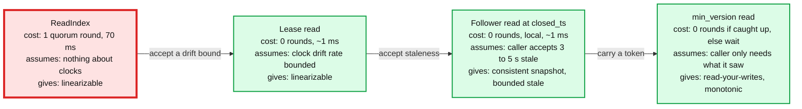

# Deep dive: read paths and the clock assumptions behind each one

> One-line answer: there are four ways to read and each buys latency with a different assumption: ReadIndex (one quorum round, no clock assumption), lease read (zero rounds, assumes clocks drift no faster than a bound), follower read at a closed timestamp (zero rounds, local, assumes the caller accepts 3 to 5 s of staleness), and read-your-writes with a version token (zero rounds when the follower has caught up, assumes the caller only needs what it has already seen). The catalog's default is the lease read; 70% of traffic should be follower reads.

Part of [`../solution.md`](../solution.md) §5.3. Concepts: [`../../../concepts/leases-fencing-clocks.md`](../../../concepts/leases-fencing-clocks.md) §2 and §4, [`../../../concepts/mvcc-and-isolation.md`](../../../concepts/mvcc-and-isolation.md) §4, [`../../../concepts/raft.md`](../../../concepts/raft.md) §9.

## 1. Why "read from the leader" is not automatically linearizable

A leader that has been partitioned away does not know it until it fails to hear from a majority. In the meantime, a new leader may have been elected and committed writes. If the old leader answers a read from its local state during that window, the client sees a value that is no longer the latest: a linearizability violation. Raft's paper lists two fixes: ReadIndex (confirm leadership with a heartbeat round before answering) and leader leases (assume bounded clock drift and answer without the round).

## 2. The four read paths

### 2.1 ReadIndex

The leader records its current commit index, sends a heartbeat round, and on hearing from a majority knows it was still leader at the moment it recorded the index. It then waits until its applied index reaches the recorded commit index and serves the read. Followers can do the same by asking the leader for a ReadIndex and then waiting for their own apply to catch up. Cost: one round trip to a majority, 70 ms from V. Correct with no clock assumption at all. We use it only as the fallback when the lease is uncertain (just after a restart, after a detected clock jump, or when the lease has under `max_offset` left).

### 2.2 Lease read

The lease is committed through Raft: `{holder, epoch, start, expiry}` with `expiry = start + 9 s` in the granter's clock. The invariant the group maintains: **no node proposes a new lease until `expiry + max_offset` has passed on its own clock.** Therefore, if the holder's clock says `now < expiry - max_offset`, no other lease can exist yet, and the holder is the only node that could have applied any committed write. It serves from local state.

What this actually assumes: not that clocks agree, but that the holder's clock and the granters' clocks differ by at most `max_offset` (500 ms) **and** that the holder's monotonic clock advances at roughly real time (drift bound 500 ppm, or 4.5 ms over a 9 s lease). The first is enforced by nodes exiting when their offset exceeds the bound; the second is a property of quartz oscillators that holds unless the process is paused, which is why the check is repeated after the read evaluates. See [`fencing-stale-leaders-and-partitions.md`](fencing-stale-leaders-and-partitions.md).

Renewal: the holder proposes a new lease with the same epoch and `expiry = now + 9 s` every 3 s. Renewal is a Raft commit, so a partitioned holder cannot renew, and at most 9 s after its last successful renewal it stops serving on its own.

### 2.3 Follower read at a closed timestamp

The leaseholder promises, every 200 ms, "I will not commit any write with `commit_ts <= closed_ts`". It can promise this because it is the only proposer: it tracks the lowest timestamp of any proposal still in flight and closes just below that, and it bumps any later proposal that arrives with a lower timestamp (for a CAS the timestamp is not semantically meaningful, so bumping is free). The closed timestamp rides on `AppendEntries` and on a periodic side message for idle ranges. It targets `now - 3 s` so that in-flight proposals are never below it.

A follower that has applied every entry up to the index that carried `closed_ts = T` can serve any read at `read_ts <= T` from its own MVCC store, and the result is a consistent snapshot: every key as of `T`, no torn reads across keys. The staleness the caller sees is `now - T`, about 3 s plus propagation, bounded by the caller's `max_age`. If the follower's applied state is behind (it is lagging, or the range is idle and the side message has not arrived), it forwards to the leaseholder rather than serve something older than `max_age`.

This is CockroachDB's mechanism (`kv.closed_timestamp.target_duration` 3 s, side transport 200 ms, follower reads "at least 4.2 seconds in the past"). The numbers are cited so the interviewer knows they are real.

### 2.4 Read-your-writes with a version token

A client that wrote version 9 or saw `commit_ts = T` from anywhere (a response, a watch event, a message from another service) sends `min_version = 9` or `min_ts = T` on its next read. The nearest follower checks its applied state: if it covers the token, it serves locally; if not, it waits up to 100 ms for replication to catch up (the entry is typically 70 to 95 ms behind the leader), then forwards to the leaseholder. What the caller gets is causal: never older than what it has already seen, monotonic across its own reads. What it does not get: the very latest write from a stranger. Most "I need a fresh read" callers actually need this, and it costs nothing across regions.

## 3. Clocks: HLC vs TrueTime, and the uncertainty window

Every MVCC version carries an HLC timestamp: 48 bits of wall-clock milliseconds plus a 16-bit counter. `now()` never goes backward, every message carries the sender's HLC and the receiver bumps its own to at least that value, so causally related events have increasing timestamps across nodes. Wall-clock error is bounded by `max_offset` (500 ms) because nodes exit above it.

The uncertainty window: a snapshot read at `as_of` chosen on node A might miss a version with `commit_ts` slightly greater than `as_of` that was committed on node B **before** the read started in real time, if B's clock is ahead of A's. Any version with `commit_ts` in `(as_of, as_of + max_offset]` is therefore uncertain. The reader restarts once at `as_of' = that commit_ts`, after which nothing new can be uncertain (the restart timestamp is the newest uncertain version it met). Bounded to one restart per uncertain version met; rare on a catalog.

TrueTime avoids this differently: it returns an interval `[earliest, latest]` a few ms wide, and a writer waits until `latest` has passed before acknowledging (commit wait, about 5 ms in the Spanner paper; uncertainty "about 1 to 7 ms"). After the wait, every clock in the world reads later than the commit timestamp, so a reader never needs to restart. The price is paid on every write; the benefit is external consistency across shards without a coordinator. We do not have GPS receivers in every rack, our cross-shard transactions are rare and tenant-local, so HLC with restarts is the right trade. Cloud time services (Amazon Time Sync, Google's) give sub-millisecond offsets inside a region and single-digit milliseconds across, which makes the 500 ms bound generous.

## 4. Choosing the read mode in the client SDK

| Caller | Mode | Why |
|---|---|---|
| Query planner reading a table schema it may already have | `min_version` = the version in its cache, or `stale_ok 5 s` | Needs "not older than what I planned with", not "the latest" |
| DDL that reads then writes (`ALTER TABLE ADD COLUMN`) | `linearizable`, then CAS on the version it read | The write's CAS catches any concurrent change anyway; the read just avoids a pointless 409 |
| UI listing a schema | `stale_ok 5 s` | A human cannot tell |
| Job scheduler reading a job definition after a deploy | `min_version` from the deploy response | Read-your-writes across services |
| Permission check on a hot path | `stale_ok 2 s` with a watch-fed cache | Revocation latency of 2 s is the documented SLO |
| Anything without a mode | `linearizable` | The default is the honest one |

## 5. What the interviewer asks next

- "What if the leaseholder's clock is fast?" It thinks the lease lasts longer than it does. Bounded by `max_offset`, and the node exits at 80% of it. Above that bound the read is not linearizable, which is why the bound is enforced, not assumed.
- "How stale is a follower read, exactly?" `now - closed_ts`, about 3 s target plus one replication hop. The response carries it in a header. The caller's `max_age` is a hard cap; above it, the read forwards.
- "Is a follower read consistent across keys?" Yes, it is a snapshot at `closed_ts`. It is stale, not torn.
- "Why not ReadIndex everywhere and skip the clock talk?" 70 ms per linearizable read from V against a 10 ms target, and 5k rounds per second of heartbeat traffic at 1x load. The lease is the standard answer in every production system; the clock assumption is small and enforced.
