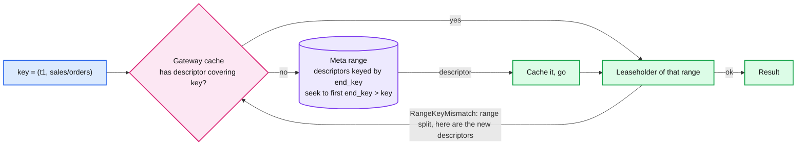
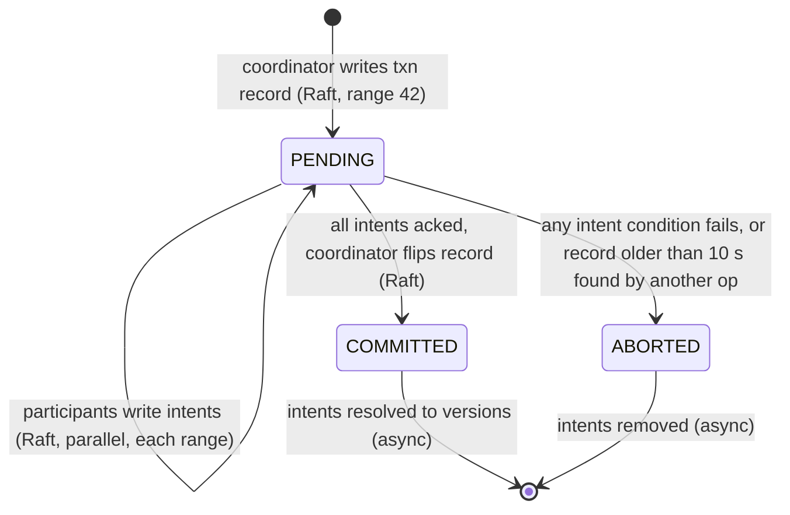

# Deep dive: sharding, the directory, transactions, and hot tenants

> One-line answer: keys sort as `(tenant, path)` so a tenant is a contiguous slice of the keyspace and a prefix is a range scan; ranges split by size (256 MB) and by load (2,000 ops/s) with no data movement, the descriptors live in a meta range that gateways cache as hints, a tenant's ranges share a home region so any transaction inside a tenant is either one Raft entry (same range) or a 2PC whose participants are all in one region; cross-tenant transactions are refused, and the only hot spot the layout cannot fix is a single key that every operation touches, so the key design never has one.

Part of [`../solution.md`](../solution.md) §5.5 and §5.6. Concepts: [`../../../concepts/sharding.md`](../../../concepts/sharding.md), [`../../../concepts/distributed-transactions.md`](../../../concepts/distributed-transactions.md) §2, [`../../../concepts/mvcc-and-isolation.md`](../../../concepts/mvcc-and-isolation.md).

## 1. Why one Raft group is not enough, with numbers

One group: one leader, one log, one fsync stream. etcd, the reference single-group store, documents a suggested maximum of 8 GiB and is comfortable at a few thousand writes/s. Our 1.5 TB of live data plus versions and 5k writes/s (50k at peak) are two orders of magnitude past both. And one group means one leader region for every tenant: a Frankfurt-homed tenant would pay 95 ms on every write and every linearizable read, forever. So: many groups, each with its own leader placed where its tenant lives.

## 2. Ordered ranges, not hash buckets

Hashing spreads load perfectly and destroys two requirements: `list(prefix)` becomes a scatter-gather over every shard, and `watch(prefix)` needs every shard's feed. Ordered ranges keep a prefix contiguous: one or a few adjacent ranges, sequential on disk, one feed. The cost of ordering is hot ranges when keys are written in sequence (a tenant creating `table_00001, table_00002, ...` lands every write on one range's tail). Load-based splitting handles it: after 30 s at 2,000 ops/s the range splits at the key that halves the load, and the new range gets a different leaseholder.

**Split.** The leaseholder picks a split key (the middle by bytes, or the load median from a sampler), proposes a split entry. Every replica applies it by creating a new range descriptor and a new Raft group with the same members and the same leaseholder, and by moving the keyspace boundary in its local LSM (a metadata operation; the SSTs are shared until compaction separates them). No bytes cross the network. The parent's generation bumps; the meta range gets both descriptors in the same transaction.

**Merge.** Two adjacent ranges both under 64 MB and idle: the left leaseholder proposes a merge once the right range's replicas are on the same nodes (the controller colocates them first). Rare on a catalog.

**Numbers.** 1.5 TB / 256 MB = 6,000 ranges. 5 replicas each = 30,000 replicas over 60 nodes, 500 per node. CockroachDB's default is 512 MiB and TiKV's is 256 MiB since v8.4.0; ours is at the smaller end because a lease transfer and a follower snapshot are both proportional to range size and we want them in seconds.

## 3. The meta range

Descriptors are rows in a range that is itself a Raft group with the same 5-voter, 2 + 2 + 1 rules, keyed by `end_key` so a lookup for key `k` is "seek to the first descriptor whose `end_key > k`". Gateways cache every descriptor they touch. A cached descriptor is a **hint**: the request goes to the cached leaseholder, and that node checks the key against its current descriptor. If the range has split or the lease moved, it replies `RangeKeyMismatch` or `NotLeaseholder` with the current descriptors, and the gateway retries once. The meta range therefore sees traffic only on cold caches and after topology changes: about 1 lookup per 10,000 requests, 50/s at 1x. When descriptors outgrow one range (at about 10 B keys), it becomes two levels: `meta1` (one range, addresses of `meta2` ranges) and `meta2` (many ranges, addresses of data ranges), exactly Bigtable's and CockroachDB's layout.

## 4. Transactions

### 4.1 Same range: one entry

`txn(conditions, ops)` where every key is in one range is evaluated under latches on all keys (taken in sorted key order so two transactions on the same pair cannot deadlock), all conditions checked, one Raft entry with all ops. Atomic by construction: an entry applies entirely or not at all. This is the common case because the key layout puts a schema's objects together and a tenant's objects adjacent.

### 4.2 Cross range inside a tenant: 2PC with a replicated record

- **Transaction record** `{txn_id, status, hlc_ts, participants}` lives in the first key's range and is replicated by that range's Raft. A coordinator crash loses nothing: the record is in the log.
- **Write intent**: a provisional MVCC version tagged with `txn_id` instead of a committed timestamp. Written by each participant range as a Raft entry after checking its condition. Readers that meet an intent look up the record: `COMMITTED` means treat it as a real version, `PENDING` means ignore it (or wait, if the reader is a writer that conflicts), `ABORTED` means remove it.
- **Commit point**: the record flipping to `COMMITTED`. One Raft entry. Everything after is cleanup.
- **Latency**: intents in parallel (one round, 75 ms), then the flip (one round, 75 ms): about 160 ms. Parallel commits (CockroachDB, 2019) write the record as `STAGING` alongside the intents and treat "all intents present" as committed, saving one round; a recovery path reconstructs the decision from the intents. We name it as the optimisation and do not build it first.
- **Isolation**: each transaction takes one HLC timestamp; reads at that timestamp see a snapshot; write-write conflicts are detected by intents; a read-then-write across a concurrent commit is caught by the CAS conditions the API requires. For a catalog this is strict serializable in practice because every write names its expected versions. A general SQL engine needs read tracking (a timestamp cache) as well; say that this API sidesteps it by design.

### 4.3 Cross tenant: refused

Two tenants may have different home regions. A 2PC across them needs two remote round trips per phase and a coordinator that is remote from one of them. The API returns `400 cross-tenant transaction`. The workaround for the one real use case (sharing an object from tenant A to tenant B) is a saga: write the share in A, emit the event on the watch stream, an indexer writes the mirror in B, and B's readers see it after the stream's `resolved_ts`. Eventual by design, and documented.

## 5. Hot tenants and hot keys

**Hot tenant** (50 M tables, 40% of writes): load-based splits handle bytes and ops. After splitting, the tenant is 200 ranges on 20 nodes in its home region, 100 writes/s per range. A hot tenant is not a problem; it is a large tenant.

**Hot key** is the real problem, and the only fix is not to have one. Anti-patterns to refuse in the key design:

| Anti-pattern | Why it is hot | Alternative |
|---|---|---|
| A schema object whose version bumps on every child table create | Every `CREATE TABLE` in the schema is a CAS on one key | Schema version changes only when the schema's own fields change. Children are independent keys |
| A per-tenant object count | Every create and delete increments it | `count` from a periodic aggregate over the watch stream, or a range scan with a limit |
| A "latest change" pointer per tenant for cache invalidation | Every write updates it | Watch with `resolved_ts` |
| A tenant-wide lock key | Serialises every DDL in the tenant | Per-object CAS is already the lock |

**Hot read key** (a flag every service reads at 100k/s): the lease read is 1 ms of CPU with no IO on the leaseholder, so one core handles it, but the right fix is `stale_ok` on the readers (spreads over 5 replicas in 3 regions) and a client cache fed by watch.

**Hot listing** (5 M keys under one prefix): sequential scan at one `as_of`, pages of 1,000, served by followers in the caller's region because the read is at a closed timestamp. Rate-limited per tenant at 100 pages/s. Never on the leaseholder.

## 6. Adding a region and moving a tenant

- **Fourth region (Tokyo).** Add non-voting replicas there for the tenants whose readers are there: they receive the log, serve follower reads, never vote, never change the commit path. Tenants that should be homed in Tokyo get a voter set change through joint consensus (`V V O O F` to `T T O O F` one replica at a time, each step a membership entry), then a lease preference change. No downtime, and the only data movement is the new replicas' snapshots.
- **Move a tenant's home.** Change `home_region`; the controller moves the second pair (two replica swaps) and then the lease preference. During the transition the commit path may temporarily need the far region: about 25 ms extra on writes for the minutes it takes.

## 7. What the interviewer asks next

- "Why not hash?" Kills `list` and `watch`; ordered plus load splits handles the hot tail.
- "What is the unit of transaction?" A range, by design; a tenant, by 2PC over Raft; never two tenants.
- "How does a gateway know where a key is?" Cache as a hint, meta range on a miss, `RangeKeyMismatch` to correct. The meta range is off the hot path.
- "One tenant is 40% of writes. Then what?" Load splits, 200 ranges, 20 leaseholders. Then check the key design for a single key every op touches; that is the only thing splits cannot fix.
- "What does a split cost?" One Raft entry per split, no data movement, a bump in the meta range. Milliseconds.
