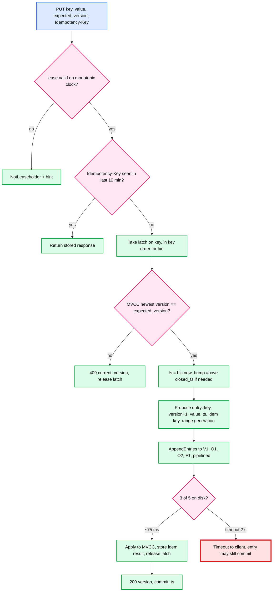

# Deep dive: the write path and leader placement

> One-line answer: a write is a compare-and-swap evaluated on the one replica that holds the range's lease, turned into one Raft entry that carries the new version, the HLC timestamp, and the client's idempotency key, and acknowledged after the leader plus its local peer plus the first remote voter have it on disk; the lease is pinned to the tenant's home region by a preference the placement controller enforces, so the write's only wide-area cost is one round trip to the nearest other region, about 70 ms.

Part of [`../solution.md`](../solution.md) §4.1 and §5.2. Concepts: [`../../../concepts/raft.md`](../../../concepts/raft.md) §5 and §9, [`../../../concepts/exactly-once.md`](../../../concepts/exactly-once.md).

## 1. Leaseholder vs Raft leader

Two roles that are usually the same node:

| Role | Decides | Granted by | Fails how |
|---|---|---|---|
| **Raft leader** | Which entries go into the log and in what order; when an entry is committed | Election, term number | Old term's proposals rejected by followers |
| **Leaseholder** | Evaluates reads and CAS checks against the latest applied state; proposes writes | A lease entry in the Raft log, epoch number, expiry time | Cannot serve after expiry on its own clock; new holder waits expiry plus offset |

Why separate them at all: Raft elects whoever times out first, which is a liveness mechanism, not a placement policy. The lease is the placement policy. When the two diverge (after an election, the Raft leader is O2 but the lease preference says V), the store transfers Raft leadership to the leaseholder rather than the other way round, because the leaseholder is what clients are routed to. Keeping them together also removes a hop: a leaseholder that is not the leader would forward every proposal.

CockroachDB has run this split for years; the point for the interview is that "leader" is two things and the one that matters for latency and consistency is the lease.

## 2. The write, step by step, with what each step costs

Cost per step: lease check is a clock read; idempotency lookup is an in-memory map; latch is a per-key mutex in a hash table; the CAS check is a point read in the LSM (block cache hit, microseconds); the proposal is one fsync of the log batch (0.5 to 2 ms on NVMe); replication is 70 ms of waiting; apply is a memtable write. So 75 ms of which 74 is speed of light.

**Latches, not locks.** A latch is held only for the duration of the leaseholder's own evaluation and proposal, never across a client round trip. Two writes to the same key serialize; writes to different keys proceed in parallel. There is no deadlock possibility with a single key, and for a `txn` the keys are latched in sorted order.

**The CAS is evaluated before Raft, once.** This is safe because the leaseholder is the only proposer for the range and it evaluates under the latch, so between evaluation and apply no other write to that key can be proposed. If the lease changes between proposal and commit, the entry still carries the range generation and lease epoch; the new leaseholder applies only entries whose epoch matches the lease that was valid when they were proposed, and rejects the rest. That is the check that prevents "two leaseholders both evaluated the CAS as true".

## 3. Pipelining and throughput

The leader does not wait for entry `n` to commit before sending `n + 1`. Each follower keeps a stream; the leader tracks `next_index` and `match_index` per follower and sends up to 64 entries or 1 MB unacknowledged. Commit index advances as acks arrive; entries commit in order. Throughput per range is therefore leader CPU and log fsync bound (batched fsync: many entries per sync), roughly 10k small entries/s, and latency is one RTT regardless of load until the pipeline fills.

At 500 writes/s on a hot range and 75 ms per commit, 40 entries are in flight. Well under the pipeline limit. A range at 5,000/s would have 400 in flight and start queueing behind the 64-entry window; that is the load-split threshold's job (it fires at 2,000/s).

## 4. Where the leader lives, and how it gets there

**Preference.** Each tenant has `home_region`. The placement controller writes a `lease_preference = [home, nearest, far]` into every range descriptor of that tenant. Every 10 s it checks each range: if the leaseholder is not in the first preferred region that has a live, up-to-date replica, it proposes a lease transfer.

**Lease transfer.** The current holder proposes a lease entry naming the target with the same expiry, and stops serving as soon as it proposes (it must not serve during the window where the transfer may have committed). The target starts serving when it applies the entry. Cost: one Raft commit, 75 ms, during which the range is briefly unavailable for linearizable ops (reads return `NotLeaseholder` and are retried by the gateway). No data moves. The target must already have applied everything up to the transfer entry, which it has, because it applies the entry itself.

**Raft leadership follows.** After the lease lands on V3, V3 asks the Raft leader (say O2, elected after an incident) to transfer leadership: O2 sends a `TimeoutNow` to V3, V3 starts an election it is guaranteed to win because O2 stops accepting proposals and V3 is up to date. One round trip. Now proposals do not hop.

**Writes from a remote region.** The F gateway looks up the descriptor, sees the leaseholder is V3, and forwards: 95 ms round trip plus V3's 75 ms commit, about 170 ms. There is no write path that avoids this without moving the lease, and moving the lease penalises the home region's readers. If a tenant's writes really come from two regions equally, the honest answer is to pick the region whose reads matter more, or split the tenant's keyspace into two tenants with different homes.

## 5. Idempotency inside the entry

The client's `Idempotency-Key` travels in the Raft entry and is applied with it into a small table `(key -> response, expiry)` that is part of the range's replicated state. Consequences:

- A retry to any leaseholder, old or new, finds the key if the first attempt committed, and returns the stored response.
- A retry after a failed first attempt (never committed) finds nothing and runs normally.
- The table is bounded: 10-minute TTL, entries about 100 B, 5k writes/s fleet-wide means 3 M entries, 300 MB spread over 6,000 ranges.
- Without the key, CAS makes double-apply impossible (the second attempt fails the version check), but the client cannot tell whether it won. Say that distinction; it is what "idempotent" means here.

## 6. What the interviewer asks next

- "Why is the CAS check not a Raft entry itself?" It is folded into the same entry. The check runs at proposal time under the latch, and the entry carries the epoch so a stale leaseholder's entry is rejected at apply. One entry, one commit.
- "What if the leader's fsync is slow?" The leader's own append is one of the three acks, so a slow local disk adds directly to latency. Monitor log fsync p99 per node; a node above 10 ms gets its leases moved.
- "Why not acknowledge after the local pair and replicate remotely asynchronously?" That is RPO > 0: a V loss loses everything acked but not yet in O. The prompt says linearizable and region-loss safe; async replication is the "Bad" rung.
- "Can two writes to different keys in the same range commit out of order?" No. The log is ordered; commit index advances in order. They can be *evaluated* in parallel (different latches) but they are appended in the order the leaseholder proposes them.
