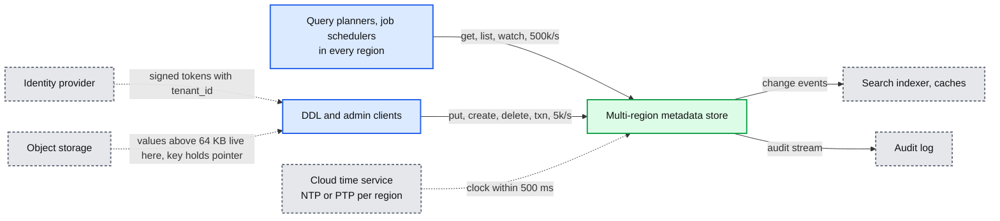
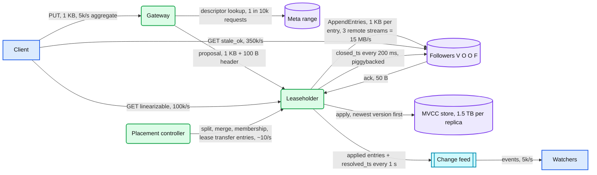
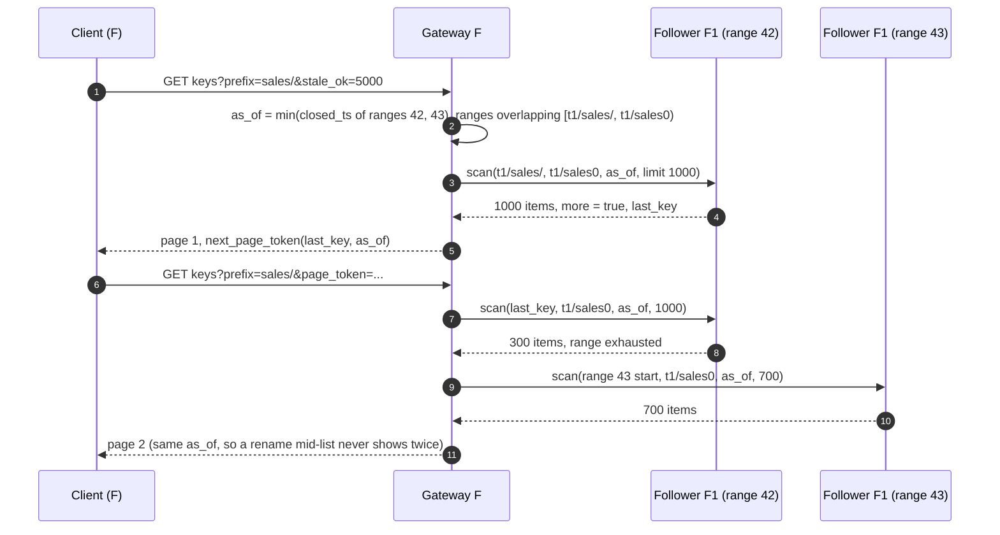
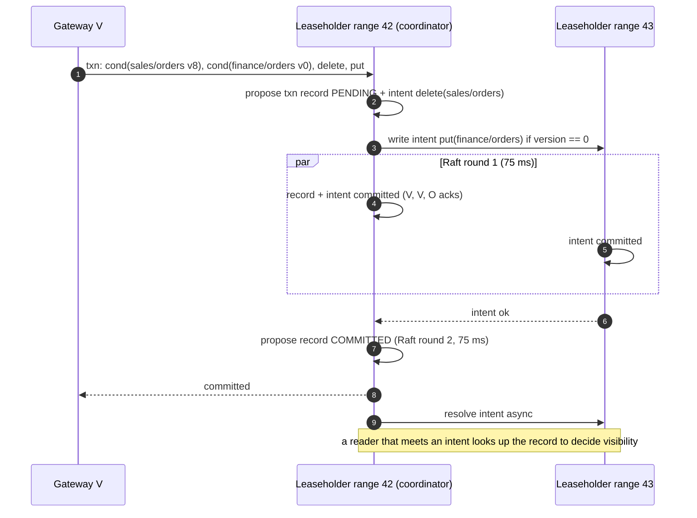
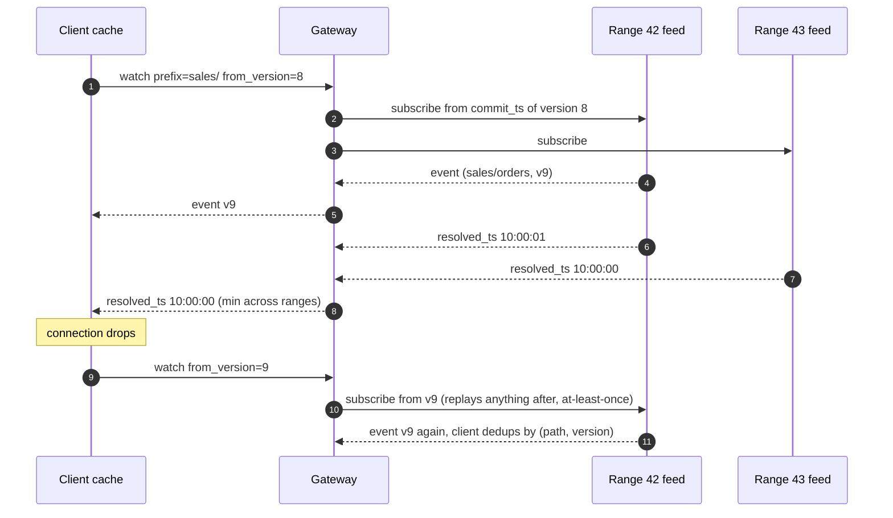
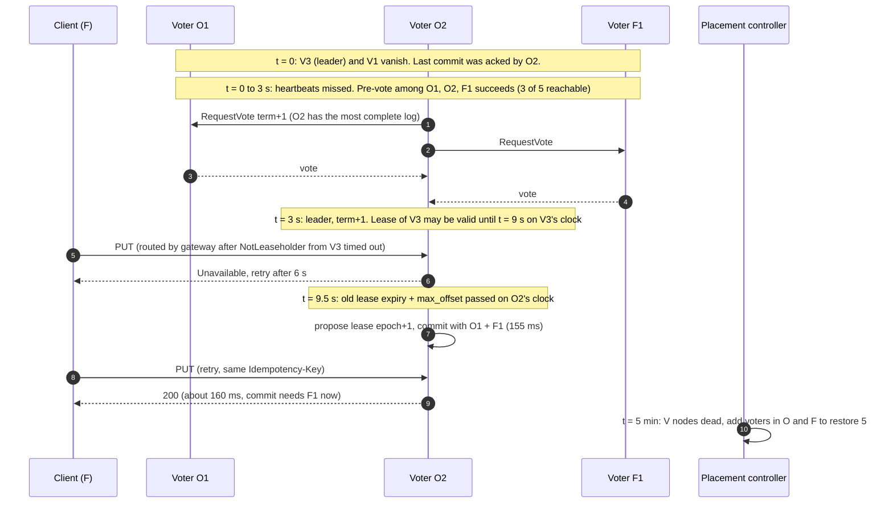
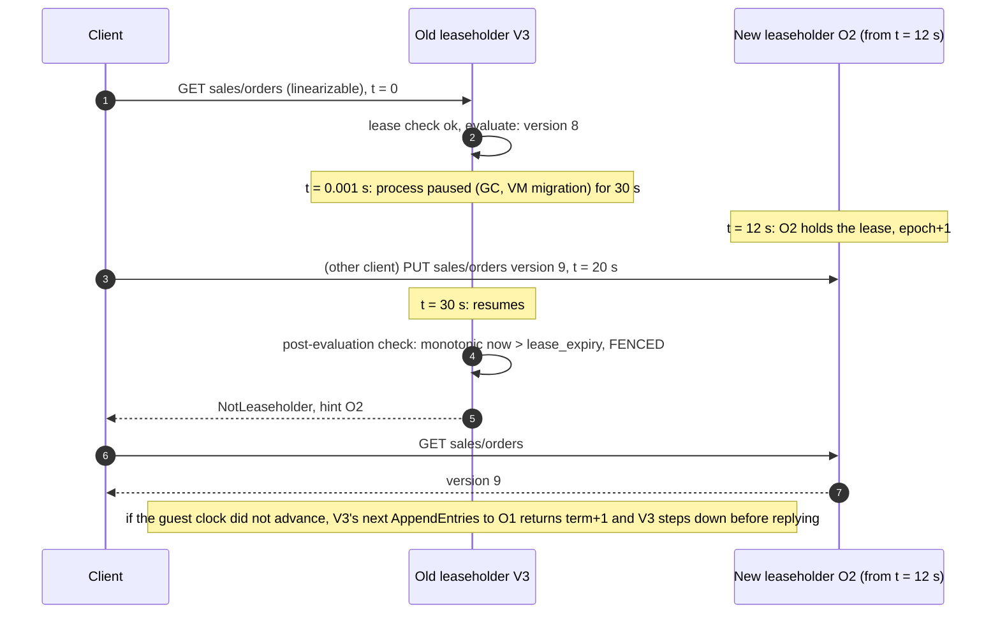
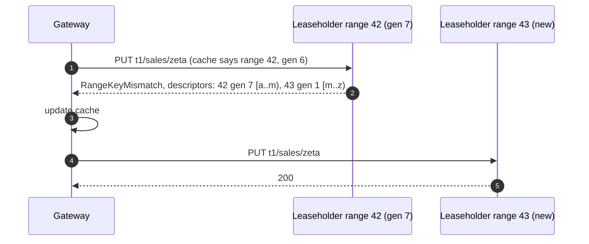
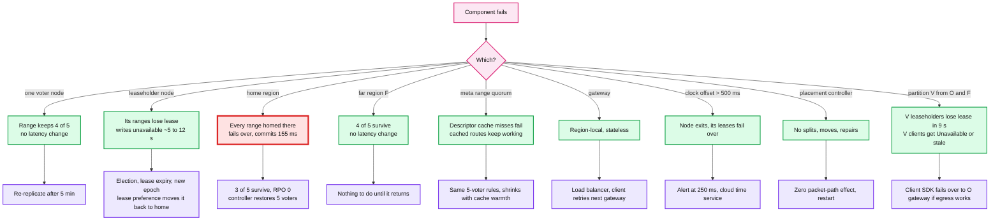
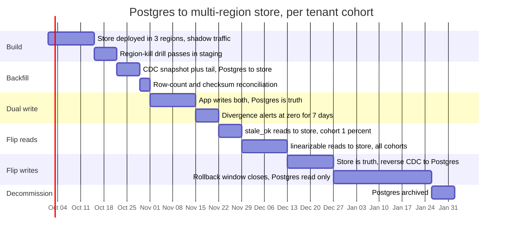

# Diagrams: Multi-region metadata store

The D1 to D12 set from `hld/CLAUDE.md` §4. A diagram is drawn once: the ones embedded in [`solution.md`](solution.md) are linked here, not repeated.

| # | Diagram | Where |
|---|---|---|
| D1 | Context | below |
| D2 | Data flow | below |
| D3 | Component architecture (final design) | `solution.md` §6 |
| D4 | Happy path per FR | FR1 write: `solution.md` §5.2. FR1 linearizable read: §6 Flow 2. FR1 stale read: §6 Flow 3. FR2 list: below. FR3 cross-range txn: below. FR4 watch: below |
| D5 | Failure paths | Create race: `solution.md` §6 Flow 4. Clock skew: §10.4. Region loss: below. Paused leaseholder: below. Stale descriptor after split: below |
| D6 | Read path decision | `solution.md` §5.3 |
| D7 | Entity relationship | `solution.md` §3.3 |
| D8 | Lease state machine | `solution.md` §5.4 |
| D9 | Deployment / topology | `solution.md` §5.1 |
| D10 | Sharding / partitioning | `solution.md` §5.5 |
| D11 | Failure mode map | below |
| D12 | Rollout / migration | below |

---

## D1. Context (zoom-out)

## D2. Data flow (DFD)

## D4. FR2: list by prefix at one snapshot, across two ranges, served by followers

## D4. FR3: rename across two ranges (2PC over Raft groups)

## D4. FR4: watch from a version, reconnect, resolved timestamps

## D5. Region loss, second by second

## D5. Paused leaseholder wakes up

## D5. Stale descriptor after a split

## D11. Failure mode map

## D12. Rollout / migration from single-region Postgres

