# HLD: Multi-region metadata store with linearizable writes

> One-line answer: shard the keyspace into ranges keyed by `(tenant, path)`, make each range its own Raft group of 5 voters placed 2 + 2 + 1 across 3 regions with the leader pinned to the tenant's home region; a write commits after the leader has one remote ack (one cross-region round trip, about 75 ms); the leader serves linearizable reads under a clock-bounded lease with zero round trips; stale-tolerant readers use follower reads at a closed timestamp in their own region; a lost region leaves 3 of 5 voters, so every group re-elects inside the election timeout and epoch-fenced leases stop the dead region's old leaders from serving stale data; every name check and version check is a compare-and-swap inside one Raft group, so there is no cross-shard 2PC on the hot path.

Sources: no single published article for this exact prompt. The design follows what Spanner, CockroachDB, and TiKV converge on, with numbers checked against primary sources on 2026-09-17 (see [`research/`](research/), spot-check tables at the end of each file). Written flow-first: §4 builds one diagram one functional requirement at a time in a single region, §5 breaks and mutates that design one non-functional requirement at a time (multi-region is the first thing that breaks it), §6 shows the final design and the five core flows to rehearse. Reusable blocks: [`concepts/raft.md`](../../concepts/raft.md), [`concepts/replication-and-quorums.md`](../../concepts/replication-and-quorums.md), [`concepts/leases-fencing-clocks.md`](../../concepts/leases-fencing-clocks.md), [`concepts/mvcc-and-isolation.md`](../../concepts/mvcc-and-isolation.md), [`concepts/distributed-transactions.md`](../../concepts/distributed-transactions.md), [`concepts/sharding.md`](../../concepts/sharding.md).

---

## 1. Understanding the problem

Restate before designing. "Metadata" is the catalog a data platform reads on every query and writes on every DDL: schemas, tables, columns, ACLs, cluster and job configs, secret references. Objects are small (bytes to a few KB). Reads outnumber writes 100:1 or more. Correctness is the product: two `CREATE TABLE sales.orders` in two regions must not both succeed, and nobody may read an older version after seeing a newer one. "Linearizable" means every operation appears to take effect at one instant between its call and its return, on one global timeline. Say that definition out loud; the interviewer wants to hear that you know what you are promising.

Regions for the worked numbers: Virginia (V), Oregon (O), Frankfurt (F). Round trips: V to O 70 ms, V to F 95 ms, O to F 155 ms (Azure's published monthly p50 for East US, West US 2, and Germany West Central, checked 2026-09-17). Every latency number below is derived from these three.

### 1.1 Functional requirements

Core:
1. **Point operations with compare-and-swap.** `get(key)`, `put(key, value, expected_version)`, `create(key, value)` that fails if the key exists, `delete(key, expected_version)`. Every write names the version it expects.
2. **List by prefix.** `list(prefix, page_token)` over a namespace, consistent as of a single point in time, paginated.
3. **Small transactions inside one tenant.** `txn(conditions, ops)`: rename is delete old name plus create new name, atomically. A handful of keys, one tenant.
4. **Watch.** `watch(prefix, from_version)`: a stream of changes so caches, schedulers, and indexers never poll.

Below the line (say it out loud):
- Cross-tenant transactions. Tenants are the shard boundary; we refuse to build 2PC across them.
- Search and secondary indexes over metadata. Built from the watch stream by another service.
- Blob storage. Values above 64 KB are rejected; the key holds a pointer into object storage.
- Multi-cloud. Three regions in one provider.

### 1.2 Non-functional requirements

Ask for scale first: 1 B keys, 1 KB average, 500k reads/s and 5k writes/s aggregate, 3 regions. Then:

| Dimension | Target | Why it matters |
|---|---|---|
| Consistency | Writes linearizable. Reads linearizable by default. Explicit `stale_ok(max_age)` mode | The name-uniqueness and version promises are the product. Stale mode exists so 80% of reads never cross a region |
| Read latency | Linearizable read in the home region p99 < 10 ms. Stale read in any region p99 < 5 ms | Every query planner call reads the catalog. A cross-region round trip per query is not acceptable |
| Write latency | p99 < 200 ms from the home region, < 400 ms from a remote region | DDL and deploys are human-paced. One cross-region round trip is the physics floor |
| Availability | Writes 99.99%, stale reads 99.999%. Lose a whole region with RPO 0 and RTO < 30 s, no operator | RPO 0 means every ack has already crossed a region. RTO 30 s bounds the election plus lease expiry |
| Durability | Acknowledged write is on disk in 2 regions | Same as RPO 0, stated as a write rule |
| Scale | 1 B keys, 1 TB live, 5k writes/s, 500k reads/s, 10x at Monday 9am per region | Sharding is required, but for key count and leader load, not for bytes |
| Growth | Add a fourth region with no data move and no downtime | Membership change per Raft group, non-voting replicas first |

---

## 2. Back-of-envelope

Show the math. Only numbers that change the design.

**Storage.** 1 B keys × 1 KB = 1 TB live. MVCC keeps versions for 24 h so lists and follower reads can run at a past timestamp: 5k writes/s × 1 KB × 86,400 s = 432 GB/day of versions. About 1.5 TB per replica after GC, 7.5 TB raw across 5 replicas. Trivial on NVMe. Bytes are not the problem.

**Ranges.** Split at 256 MB: 1.5 TB / 256 MB = 6,000 ranges, 30,000 replicas. 20 nodes per region, 60 total, so 500 replicas per node. Heartbeats are coalesced per node pair (one message carries every range the pair shares), so heartbeat traffic is 60 × 59 messages per interval, not 30,000.

**Writes.** 5k/s aggregate. A hot tenant with 40% of writes is 2k/s across its ranges, after load-based splitting maybe 500/s on the busiest range. A single Raft group with a pipelined log does about 10k small entries/s; the ceiling is leader fsync and WAN RTT, and pipelining hides the RTT. Per-range write load is not the problem either; the leader's CPU on the busiest node is what to watch.

**Commit latency floor.** Leader in V, voters V V O O F. Commit needs 3 acks: the leader itself, its local peer (about 1 ms plus fsync), and the faster remote, O at 70 ms RTT plus fsync. So about 75 ms in the home region. From F the client adds one V round trip: 95 + 75 = 170 ms. Both under the targets. If the home region's nearest peer were F instead of O, the floor would be 100 ms. Placement is a latency decision, not just a durability one.

**Cross-region bandwidth.** The leader streams every entry to 3 remote followers (O O F): 5k/s × 1 KB × 3 = 15 MB/s, 1.3 TB/day, about $25/day at $0.02/GB. Nothing.

**Reads.** 500k/s. Assume 70% accept staleness (planners re-reading a schema they already cached, dashboards, autocomplete), 20% are linearizable from the home region, 10% linearizable from a remote region. So 350k/s follower reads spread over 60 nodes (6k/s each), 100k/s lease reads on home leaders, and 50k/s that pay a cross-region round trip. The third bucket is the one to shrink with read-your-writes tokens (§5.3).

**Timeouts.** Max RTT 155 ms (O to F). Heartbeat 500 ms, election timeout 3 s (about 20 × max RTT, so a slow link never triggers an election). Lease 9 s, renewed every 3 s. Region loss RTO = election (up to 3 s) + wait for the old lease to expire (up to 9 s) = 12 s worst case, inside the 30 s target.

---

## 3. The set-up

### 3.1 Core entities

- **Tenant**: `tenant_id`, `home_region`. The unit of sharding, placement, and transactions.
- **Key**: `(tenant_id, path)` sorted lexicographically, so a prefix is a contiguous run. Each key has many **versions**: `(version, hlc_ts, value, deleted)`.
- **Range**: a contiguous slice of the sorted keyspace, one Raft group. Descriptor: `range_id, start_key, end_key, replicas[(node, region, voter|non_voter)], lease{holder, epoch, expiry}, generation`.
- **Node**: `node_id, region, zone`, a liveness record `(epoch, expiry)` it heartbeats.
- **Gateway**: stateless, in every region, holds a cache of range descriptors, routes requests.
- **Watch cursor**: `(tenant, prefix, last_version)` held by the client, not the server.

### 3.2 API

| Endpoint | Request | Response | Notes |
|---|---|---|---|
| `GET /v1/{tenant}/keys/{path}` | `?consistency=linearizable` (default) or `stale&max_age_ms=5000`, optional `min_version` | `{value, version, commit_ts}` | `min_version` is the read-your-writes token (§5.3) |
| `PUT /v1/{tenant}/keys/{path}` | `{value, expected_version}`, header `Idempotency-Key` | `200 {version, commit_ts}` or `409 {current_version}` | CAS. `expected_version = 0` means create-if-absent |
| `DELETE /v1/{tenant}/keys/{path}` | `{expected_version}` | `200` or `409` | Writes a tombstone version |
| `GET /v1/{tenant}/keys?prefix=&page_token=&as_of=` | | `{items[], next_page_token, as_of}` | One snapshot timestamp for all pages |
| `POST /v1/{tenant}/txn` | `{conditions[(path, expected_version)], ops[put|delete]}`, `Idempotency-Key` | `{committed, results}` | etcd-style. All conditions or nothing |
| `GET /v1/{tenant}/watch?prefix=&from_version=` | server stream | `{path, version, value|tombstone, commit_ts}` events, plus `resolved_ts` heartbeats | At-least-once, client dedups by version |

Auth is a signed token carrying `tenant_id`; the gateway rejects any path outside it. Versions are per key, monotonically increasing integers; `commit_ts` is the HLC timestamp of the Raft entry that wrote it.

### 3.3 Data model

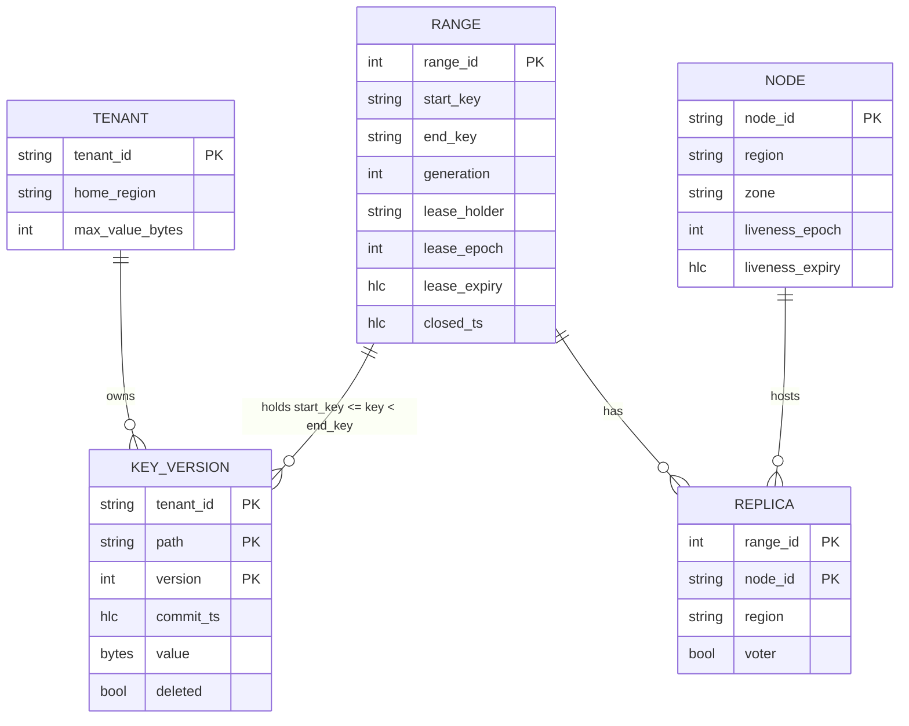

Access patterns that justify it: every hot operation is "find the range for `(tenant, path)`, go to its leaseholder" (a lookup in the descriptor cache, then one RPC); `list(prefix)` is a forward scan inside one or a few adjacent ranges; `watch` tails the ranges under a prefix; garbage collection walks versions older than 24 h. The partition key is the sorted key itself, so a tenant's keys are adjacent and a tenant's ranges share a home region.

---

## 4. High-level design

One subsection per functional requirement. Each traces input to output through the boxes, adds boxes to a single diagram, and ends with what is still missing. The §4 design is deliberately **single-region**: get it right in one region, then §5.1 breaks it by killing that region.

### 4.1 Point operations with compare-and-swap

**Flow (simple version):**

1. Client in V sends `PUT /v1/t1/keys/sales/orders {value, expected_version: 7}` to the V gateway.
2. Gateway looks up `(t1, sales/orders)` in its range descriptor cache: range 42, leaseholder node V3.
3. Gateway forwards to V3. V3 checks it holds the lease for range 42 (§5.3 makes this precise; for now, it is the Raft leader).
4. V3 takes a latch on the key (writes to one key are serialized on the leaseholder), reads the current version from its local MVCC store: 7. Matches. If it did not, reply `409 {current_version}` now, without touching Raft.
5. V3 appends a Raft entry `{key, new version 8, value, hlc_ts, idempotency_key}` and sends `AppendEntries` to its 2 followers.
6. Each follower fsyncs the entry and acks. On the second ack (majority of 3) V3 marks the entry committed.
7. V3 applies the entry to its MVCC store (new version 8), records `idempotency_key -> result` in a 10-minute table that is part of the same entry, releases the latch, and replies `200 {version: 8}`.
8. Followers apply the same entry in the background. A `get` at V3 reads the latest applied version.

`create` is the same flow with `expected_version = 0`: step 4 fails with `409` if any live version exists. Two concurrent creates take the latch one after the other; the second one sees version 1 and fails. That is the whole race, solved by "one leaseholder, one latch per key".

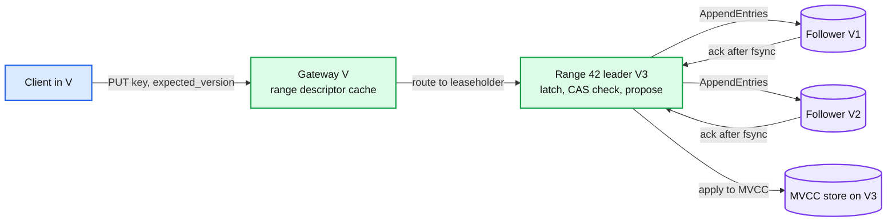

Data model so far: `KEY_VERSION`, one `RANGE` per slice of keyspace with 3 replicas in V.

**What is still missing:** all three replicas are in V. Lose V, lose everything (§5.1). And "the leader evaluates the read" is only linearizable if we can prove it is still the leader at that moment (§5.3, §5.4).

### 4.2 List by prefix, consistent as of one instant

**Flow:**

1. Client sends `GET /v1/t1/keys?prefix=sales/`. Gateway picks a snapshot timestamp `as_of = hlc.now()` and finds every range that overlaps `[t1/sales/, t1/sales0)` (the prefix and its successor): ranges 42 and 43.
2. Gateway sends `scan(start, end, as_of, limit 1000)` to the leaseholder of range 42.
3. The leaseholder scans its MVCC store forward from `start`, returning for each key the newest version with `commit_ts <= as_of` and not deleted. Because the key order is `(tenant, path)`, the scan is sequential on disk.
4. If 1000 items fill before the range ends, reply with `next_page_token = (last_key, as_of)`. The client's next page carries the same `as_of`, so every page is from one snapshot even though writes continue.
5. When range 42 is exhausted, the gateway continues into range 43 with the same `as_of`.

The snapshot timestamp is what makes a paginated list consistent. Without it, a rename during pagination shows the object twice or never. MVCC and the 24 h version retention exist for this and for follower reads.

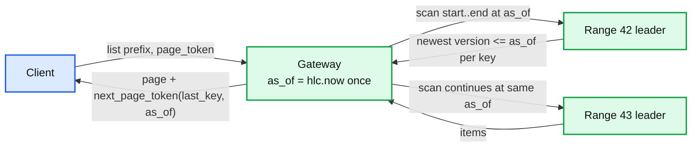

Data model so far: `commit_ts` on every version, the 24 h GC horizon.

**What is still missing:** `as_of` is chosen from the gateway's clock. A leaseholder whose clock is ahead may have committed a write with `commit_ts > as_of` that actually happened before the list started. §5.3 adds the HLC uncertainty rule that makes this safe. Also, a 5 M key prefix is 5,000 pages and a hot leaseholder (§5.5).

### 4.3 Small transactions inside one tenant

**Flow (rename `sales/orders` to `sales/orders_v2`, both in range 42):**

1. Client sends `POST /txn {conditions: [(sales/orders, 8), (sales/orders_v2, 0)], ops: [delete sales/orders, put sales/orders_v2]}`.
2. Gateway sees every key maps to range 42 and forwards to its leaseholder.
3. Leaseholder takes latches on both keys (in key order, to avoid deadlock with a concurrent txn on the same pair), checks both conditions against MVCC, and if both hold, proposes **one** Raft entry containing both ops.
4. Commit and apply as in §4.1. Both keys change in the same entry, so no reader can see one without the other.

The design decision that makes this cheap: keys of one tenant are adjacent, and a schema's objects share a prefix, so almost every rename is inside one range. A transaction across two ranges is possible but expensive (§5.6). The API deliberately has no "begin/commit" session; it is one shot, so the server never holds locks across a client round trip.

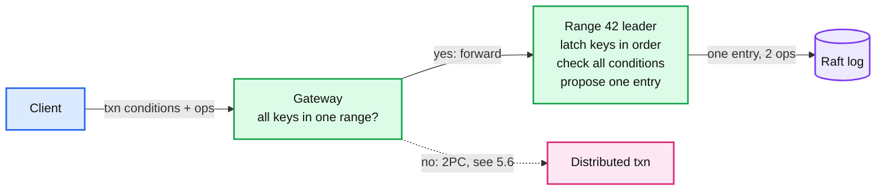

**What is still missing:** after a range split, the two keys may sit in different ranges. §5.6.

### 4.4 Watch

**Flow:**

1. Client opens `GET /watch?prefix=sales/&from_version=8`.
2. Gateway subscribes to the change feed of every range under the prefix. Each range leaseholder tails its own applied Raft log and emits `{path, version, value, commit_ts}` for every applied entry inside the prefix, starting from the first entry with `commit_ts` after the client's cursor.
3. Every 1 s each range also emits `resolved_ts = closed_ts`: "you have now seen every change with `commit_ts <= resolved_ts`". The gateway forwards the minimum across ranges, so the client knows how caught up it is.
4. If the client's cursor is older than the range's GC horizon (24 h), the stream replies `snapshot_required` and the client does a list.

Delivery is at-least-once (a reconnect replays from the cursor); the client dedups by `(path, version)`. Watch never blocks a write: the feed is read from the applied log, not from the proposal path.

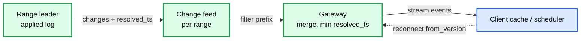

End of §4. We have a correct single-region store: sharded ranges, one Raft group each, CAS on the leader, snapshot lists, one-shot transactions, a change feed. Every non-functional requirement now breaks it in turn.

---

## 5. Deep dives

One per non-functional requirement. Each names what breaks in the §4 design with a number, fixes it, and lists what changed in the API, the data model, and the diagram.

### 5.1 "Lose a whole region with RPO 0 and RTO < 30 s": where the replicas go

**What breaks.** All 3 replicas are in V. A region outage (power, fiber cut, a bad control-plane rollout; every provider has had one lasting hours) makes every write and every linearizable read fail, and if the disks are gone the data is gone. RPO is unbounded. The fix is not "add a replica in another region"; it is choosing a layout whose majority survives any one region and whose commit latency is one nearest-region round trip.

**The quorum table.** Majority of N is `floor(N/2) + 1`. Say these out loud:

| Layout | Majority | Lose one region | Then lose one more node | Commit needs | Latency from home |
|---|---|---|---|---|---|
| 3 voters, all in V | 2 | Down, data at risk | | 1 local ack | 1 ms |
| 3 voters, V O F (1 + 1 + 1) | 2 | Survives, 2 of 3 left | Down. Zero margin for a reboot or a deploy | 1 remote ack | 70 ms |
| 5 voters, V V O O F (2 + 2 + 1) | 3 | Survives, at least 3 of 5 left | Survives if the lost node is not in the only region with 2 survivors; a reboot in the far region is always fine | 1 local + 1 remote ack | 70 ms |
| 5 voters, 5 regions | 3 | Survives | Survives | 2 remote acks | second-nearest RTT |
| 4 voters, V V O O | 3 | Lose V: 2 of 4, down | | | Never do an even number |
| 2 regions + witness in a third | 3 of 5 (2 + 2 + 1 witness) | Survives | | 1 remote ack | 70 ms |

**Fix: 5 voters, 2 + 2 + 1, with the "2 + 2" in the two closest regions.** The leader is in the home region (V). A commit needs 3 acks: leader, its V peer, and one of the two O replicas. F is the tie-breaker that is almost never on the commit path. When V dies, O O F remain: 3 of 5, a majority, no data lost because every acked entry was on at least one O or F replica. Detail that impresses: Raft's election restriction guarantees the new leader is the survivor with the most complete log, so the follower that acked the last commit wins, not one that was lagging.

**The 3-voter trap.** 1 + 1 + 1 survives a region loss but then runs at zero margin: a rolling deploy, a kernel patch, or a disk swap in either surviving region takes the range down. Production metadata stores run 5 voters for exactly that reason; the cost is 67% more disk on 1.5 TB, which is nothing.

**Witnesses.** A witness (Spanner's term; a voter that stores the log but not the data, or in some systems only votes) lets 2 real regions plus a small third location survive a region loss. We have 3 real regions, so we skip witnesses, but it is the answer when the interviewer says "we only have two regions".

**What changed:** `REPLICA.region` and `voter` in the descriptor; placement rules "5 voters, at most 2 per region, 2 in the home region, 2 in the nearest region"; a placement controller that repairs a range whose replica set violates the rule (after a node is dead 5 minutes, add a replica elsewhere in the same region). Diagram: the three-region topology.

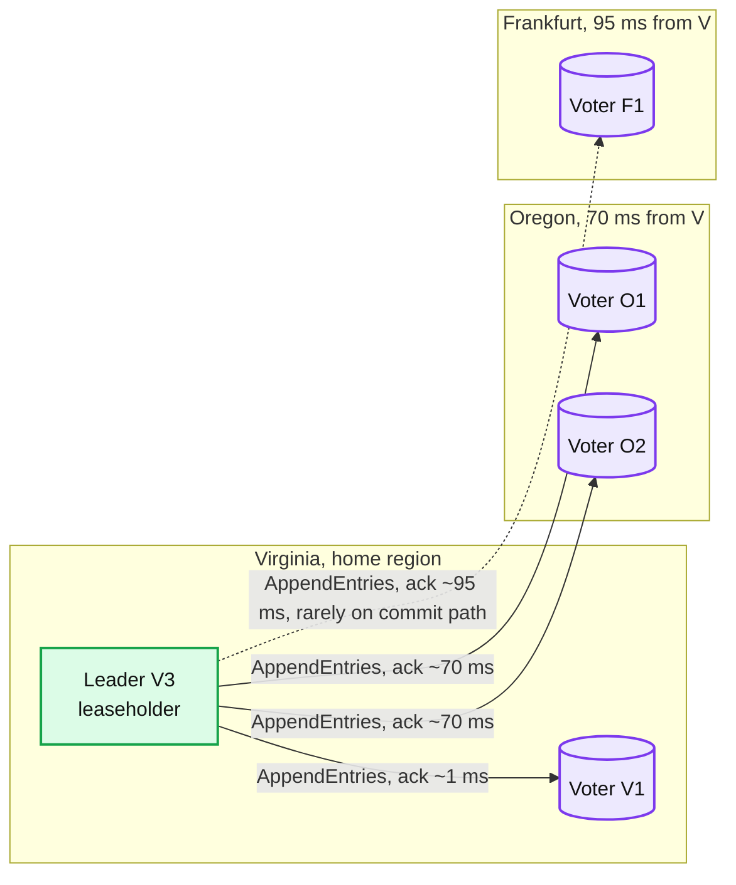

**The region-loss timeline** (V dies at t = 0, range 42 homed in V):

- t = 0: leader V3 and voter V1 vanish mid-flight. Writes in flight time out at the client (2 s deadline). Any write that was acked had a copy in O or F.
- t = 0 to 3 s: O1, O2, F1 miss heartbeats. Pre-vote (§5.4) confirms each can reach a majority (they can reach each other: 3 of 5). At the election timeout, the one with the most complete log wins. Say 3 s.
- t = 3 s: O1 is leader for a new term. It cannot serve reads or writes yet: V3's lease may still be valid on V3's clock for up to 9 s. O1 waits for `lease_expiry` on its own clock plus the clock offset bound (500 ms).
- t ≤ 12 s: O1 acquires the lease with a new epoch, applies any uncommitted entries from its log through a no-op in its term, and serves. Writes now commit with O1 + O2 + F1: the O to F round trip, 155 ms, about 160 ms per commit, inside the 400 ms budget. Reads in O are local.
- t = 5 min: the placement controller declares V's nodes dead and adds voters in O and F to restore 5, now 3 + 2 (temporary; when V returns it rebalances back to 2 + 2 + 1).
- Clients in F for a V-homed tenant: their writes went to V before (95 ms), now go to O (155 ms). Their stale reads never changed. Clients inside V: see §5.4.

Data at risk: zero acknowledged writes. Unacknowledged writes: unknown outcome to the client, resolved by `Idempotency-Key` on retry (§10.5). RTO: 12 s worst case, typically 5 to 6 s because leases are renewed every 3 s and rarely have the full 9 s left.

### 5.2 "Write p99 < 200 ms from the home region": leader placement and the one-RTT commit

**What breaks.** After §5.1 the Raft leader of range 42 could be anywhere. Raft elects whoever times out first. If F1 becomes leader, every write from V pays a 95 ms round trip to F and then F's commit needs an ack from V or O: 95 + 95 = 190 ms before the reply, p99 over budget. And the CAS check in §4.1 ran on the leader, so a leader in F makes every V read cross the ocean.

**Fix: pin the lease to the home region, and separate "lease" from "Raft leader".**

- The **leaseholder** is the replica that evaluates reads and CAS checks and proposes writes. The **Raft leader** replicates the log. They are usually the same node, and the store keeps them together (when they diverge, the leaseholder asks the leader to transfer leadership to it). The lease is what clients care about; Raft leadership is an implementation detail.
- Each tenant's ranges carry `lease_preference = home_region`. A placement loop moves the lease to a replica in that region within seconds whenever it lands elsewhere (after an election, after a node restart). Lease transfer is one Raft entry: "lease for range 42 goes to V3 from epoch 41", then V3 asks for Raft leadership. No data moves.
- **The commit path is now fixed**: leader V3 sends `AppendEntries` to V1, O1, O2, F1 in parallel; commit on the first 2 acks, which are V1 (1 ms) and the faster of O1 / O2 (70 ms). Total about 75 ms including two fsyncs. F1's ack arrives 25 ms later and is ignored for that entry.
- **Pipelining**: the leader does not wait for entry n to commit before sending n + 1. Throughput is bounded by leader CPU and disk, not by RTT. 500 writes/s on a range at 75 ms each means about 40 entries in flight, fine.
- **Write from a remote region**: F gateway forwards to V3 (95 ms round trip) and V3 does the 75 ms commit: 170 ms p50, under 400 ms p99 with headroom for a retry.

**Push back on the textbook answer.** "Put the leader in the region with the most traffic" is right and incomplete. The tenant's home region is where its DDL originates, but the second replica pair must be in the **nearest** region, because that pair is on every commit. A home in V with the pair in F (95 ms) instead of O (70 ms) costs 25 ms on every write forever. Placement is a latency decision.

**What changed:** `RANGE.lease_holder, lease_epoch, lease_expiry` in the descriptor; `TENANT.home_region` drives `lease_preference`; a lease transfer entry type; the gateway's cache now stores the leaseholder, not the leader, and refreshes on a `NotLeaseholder{hint}` error.

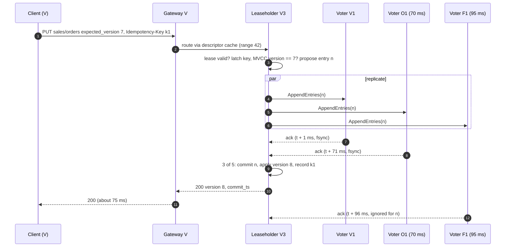

### 5.3 "Linearizable reads p99 < 10 ms in the home region": lease reads, follower reads, and the clock assumption

**What breaks.** In §4.1 the leaseholder answered a `get` from its local MVCC store. That is linearizable only if it is still the leaseholder at the moment of the read. A node that was the leaseholder 5 s ago, got partitioned, and does not know it, would serve a value that a new leaseholder has since overwritten. The textbook fix, **ReadIndex** (record the commit index, confirm leadership with a heartbeat round to a majority, wait for apply, then read), costs one cross-region round trip per read: 70 ms, against a 10 ms budget.

**Fix: three read modes, chosen by the caller.**

**(a) Lease read, linearizable, zero round trips.** The lease is a promise from the Raft group: "until `lease_expiry`, only the holder with `lease_epoch` may serve reads and propose writes". The group grants it through a committed Raft entry, so a majority knows about it, and no other node may be granted a lease until the old one has expired **on the granters' clocks plus the offset bound**. The holder serves reads without any network call as long as `now < lease_expiry - max_offset`, checked on the **monotonic clock** immediately before and after evaluating the read. Clock assumption: not that clocks agree, only that no clock runs faster than the drift bound (500 ppm) over a 9 s lease, which is 4.5 ms. Every production system that serves reads from a leader without a round trip makes this assumption; say it out loud. Cost: p99 under 2 ms, disk-bound.

**(b) Stale read, follower, any region, zero round trips.** The leaseholder advances a **closed timestamp** every 200 ms: "I will never again commit a write with `commit_ts <= closed_ts`" (it does this by refusing proposals below it, which is safe because it is the only proposer). The closed timestamp rides on `AppendEntries`. A follower in F serves `get(key, stale_ok max_age 5 s)` at `read_ts = min(closed_ts, now - max_age)` from its own MVCC store if it has applied every entry up to `closed_ts`. Staleness is bounded by the closed-timestamp target (3 s) plus propagation, so about 3 to 5 s, and the client asked for it. Reads are consistent snapshots: all keys as of one timestamp, never a mix. This is where 70% of the 500k reads/s go, and it is what makes the store survive a region partition for readers.

**(c) Read-your-writes without a round trip.** A client that just wrote version 8 (or received a `commit_ts` from anywhere) sends `min_version = 8` or `min_ts` on its next read. A follower serves it locally as soon as its applied state covers that version; otherwise it waits up to 100 ms and then forwards to the leaseholder. This turns most of the 10% "linearizable from a remote region" bucket into local reads, because what those callers actually need is "not older than what I just saw", which is causal, not linearizable. Say the difference.

**When the lease is uncertain**, for example right after the holder restarted or when the monotonic clock jumped, fall back to ReadIndex for that request: one heartbeat round (70 ms), still correct.

**The list snapshot from §4.2.** With HLC timestamps every node's clock is within `max_offset` (500 ms) of every other. A scan at `as_of` treats any version with `commit_ts` in `(as_of, as_of + max_offset]` as **uncertain**: it might have committed before the list started on a clock that is ahead. The scan restarts once at a later `as_of` if it meets one. This is the price of not having TrueTime; with it, a commit-wait of about 7 ms removes the uncertainty window instead. For a catalog, one rare restart is cheaper than 7 ms on every write.

**What changed:** `consistency` and `max_age_ms` and `min_version` on `GET`; `closed_ts` in the descriptor and on every `AppendEntries`; HLC on every node with `max_offset = 500 ms` and self-termination above it; the gateway routes stale reads to the nearest replica of the range instead of the leaseholder.

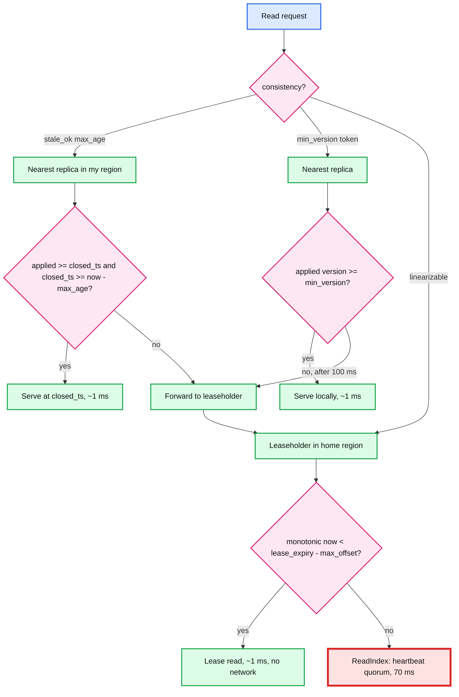

### 5.4 "The old leader must never answer": fencing, partitions, and the paused process

**What breaks.** Three scenarios where §5.1 to §5.3 are not yet enough:
1. V is partitioned from O and F but alive. V3 still thinks it is leaseholder. Clients inside V ask it for a linearizable read.
2. V3's process pauses (GC, VM migration, a stuck disk) for 30 s. O1 becomes leaseholder at t = 12 s. V3 wakes at t = 30 s, finishes a read it had already evaluated, and returns a value that O1 overwrote at t = 20 s.
3. A flapping node in F keeps timing out, starts elections with ever-higher terms, and disrupts a healthy leader in V every few seconds.

**Fix: term for writes, lease epoch for reads, pre-vote and check-quorum for stability.**

- **Writes are fenced by Raft itself.** A proposal from an old term is rejected by every follower that has seen a higher term, so V3's stale proposals never commit. The fencing token is the term, carried on every `AppendEntries`. See [`concepts/leases-fencing-clocks.md`](../../concepts/leases-fencing-clocks.md) §3.
- **Reads are fenced by the lease bound on the monotonic clock, checked after evaluation.** Scenario 2: V3 evaluated the read before the pause, but the check "is `monotonic_now` still inside my lease" runs again right before the reply. The monotonic clock advanced 30 s during a GC pause, so the check fails and V3 replies `NotLeaseholder`. For a VM pause where the guest clock might not advance, the second defence is that the lease is renewed by a Raft entry every 3 s, and the renewal from V3 in the old term is rejected, so V3 learns it is fenced the first time it talks to anyone. A third belt: the client carries the highest `commit_ts` it has seen and rejects any response older than it.
- **Scenario 1, partitioned but alive.** V3 cannot renew its lease (renewal is a Raft commit, which needs O or F). At most 9 s after its last renewal it stops serving linearizable reads and writes on its own, with no message from anyone, because the lease is a promise about time, not about connectivity. Clients inside V get `Unavailable` for linearizable operations and continue to get stale reads (which are honest about being stale). If V's egress to the Internet still works, the client SDK fails over to the O gateway (a regional DNS name per region, tried in order) and continues. If V is fully isolated, its clients are down, and that is correct: the alternative is split brain.
- **Check-quorum**: a leader that has not heard from a majority within one election timeout steps down on its own. It bounds the window in scenario 1 from "lease duration" to "election timeout" for writes.
- **Pre-vote**: before incrementing its term, a candidate asks peers "would you vote for me?". A node that is partitioned or has a stale log gets "no" and does not bump the term, so a flapping F1 (scenario 3) cannot depose a healthy V3. Without pre-vote, a single bad node in the far region causes a leader change every time it reconnects.

**What changed:** lease epoch and term on every request between store nodes; `NotLeaseholder{hint}` and `Unavailable` as first-class errors the SDK understands; regional gateway DNS with client-side failover order (home, nearest, far); check-quorum and pre-vote enabled on every group.

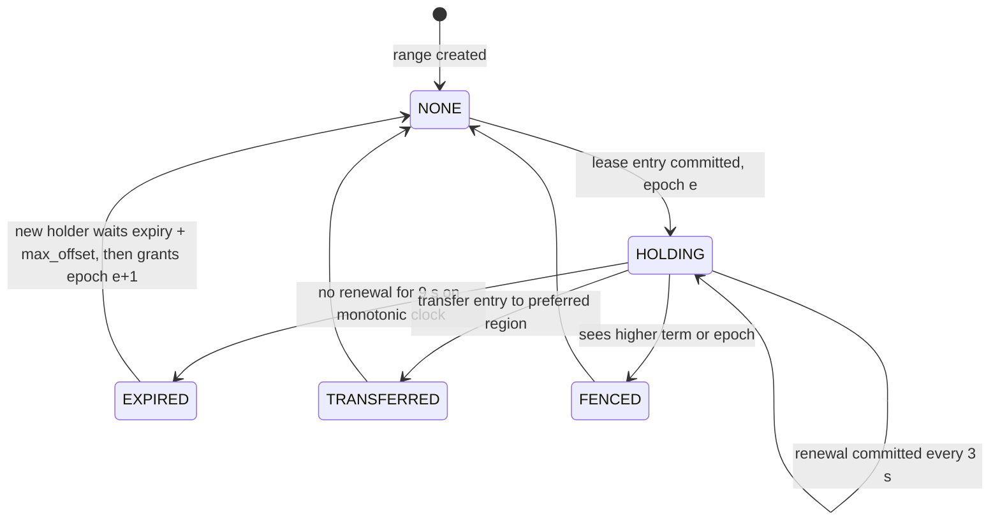

### 5.5 "1 B keys, a hot tenant, 10x on Monday": sharding, the directory, and hot ranges

**What breaks.** Two things, with numbers. (a) Range 42 grows past a few GB: Raft snapshots for a lagging follower take minutes, a leaseholder move drags seconds of latency, and one node's CPU carries all of a big tenant's traffic. (b) The gateway must map any of 1 B keys to one of 6,000 ranges; a static table is stale the moment a range splits, and refreshing it from one central place is a hot spot on every request.

**Fix: auto-split by size and by load, and a replicated directory that the gateways cache.**

- **Split by size** at 256 MB. **Split by load** when one range sustains more than 2,000 ops/s for 30 s: find the key that splits the load in half from a sample, propose a split entry. A split is a Raft entry on the parent that creates a child descriptor with the same replicas and the same lease; no data moves, just the boundary. **Merge** when two adjacent ranges are both under 64 MB and idle. This is the CockroachDB and TiKV mechanism, chosen because a split never copies data.
- **Directory**: range descriptors live in a **meta range**, itself a Raft group (5 voters, same rules) keyed by `end_key`, so "which range holds key k" is one ordered lookup. Gateways cache descriptors and treat the cache as a hint: a request to a node that no longer holds the range gets `RangeKeyMismatch{new descriptors}` and retries once. The meta range takes traffic only on cache misses and after splits, about 1 lookup per 10,000 requests.
- **Hot tenant, 50 M tables, 40% of writes.** After load splits its keyspace is 200 ranges, each with its own leaseholder, spread across the 20 nodes in its home region. The remaining hot spot is any single key that every operation touches: a "schema version" that bumps on each `CREATE TABLE`, or a table counter. Refuse to build those. A list is a range scan, not a counter; a schema's version is bumped only when the schema itself changes.
- **List over 5 M keys.** 5,000 pages at one `as_of`; the scan is sequential per range and follower-readable at the snapshot timestamp, so it runs on followers in the caller's region and never touches the leaseholder. The client is told to filter server-side (`prefix` deeper) and given a `count` endpoint backed by a periodic aggregate for the UI.
- **Monday 9am, 10x reads.** Reads are the follower-read bucket: 3.5 M/s over 60 nodes is 60k/s per node from the local MVCC store, fine. The 20% linearizable bucket at 10x is 1 M/s on the 20 home-region leaseholder nodes, 50k/s each, still local disk. Writes at 10x are 50k/s, 800/s per node. The store scales by adding nodes per region; ranges rebalance by count and load.

**What changed:** `RANGE.generation` (bumped on split, merge, replica change, used to reject stale descriptors), the meta range, split and merge entries, a per-range load sampler, `RangeKeyMismatch` retry in the gateway.

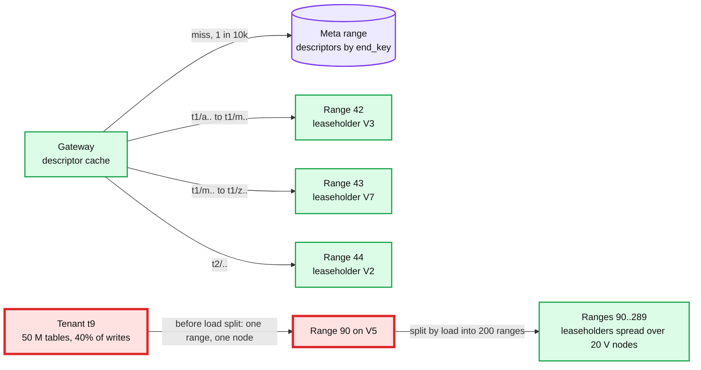

### 5.6 "Rename across ranges": the transaction we tried not to build

**What breaks.** After the split in §5.5, `sales/orders` is in range 42 and `sales/orders_v2` is in range 43. The one-entry transaction of §4.3 no longer works. Also a rename across schemas (`sales/orders` to `finance/orders`) was never in one range.

**Fix: 2PC where each participant is a Raft group, with the transaction record replicated.**

1. The gateway picks a coordinator: the leaseholder of the range holding the first key (range 42). It writes a **transaction record** `{txn_id, status: PENDING, hlc_ts}` into range 42 as a Raft entry. The record is replicated, so a coordinator crash does not lose the decision.
2. In parallel, each participant range writes a **write intent** (a provisional version tagged with `txn_id`) for its key, as a Raft entry, after checking its condition. Range 43 checks `orders_v2` has version 0 and writes an intent.
3. When every intent is committed, the coordinator flips the record to `COMMITTED` (one more Raft entry). This is the commit point.
4. Asynchronously, intents are resolved into real versions; a reader that meets an unresolved intent looks up the record to decide whether to see it.

Latency: 2 consensus rounds in sequence (intents in parallel, then the record flip) at 75 ms each, about 160 ms. Parallel commits (write the record and intents together, treat "all intents present" as committed) makes it one round; we leave it as a follow-up. Failure: a coordinator that dies after step 2 leaves a `PENDING` record; any participant that finds it after the record's timeout aborts it by CAS on the record's status, and readers never see the intents. Concept detail in [`concepts/distributed-transactions.md`](../../concepts/distributed-transactions.md) §2.

**Keep it rare.** All ranges of a tenant share a home region, so both leaseholders are in V and the extra round is 75 ms, not 170 ms. And the key layout puts a schema's objects together, so cross-range renames are the rare case, not the common one. A tenant never spans two home regions, so a 2PC never needs two remote acks. We refuse cross-tenant transactions entirely.

**What changed:** transaction record and write intent as MVCC value types; `txn_id` on intents; an intent resolver; `txn` API unchanged.

---

## 6. Final design and the five core flows

Everything from §5 composed. Under 15 nodes; zoom-ins in [`diagrams.md`](diagrams.md).

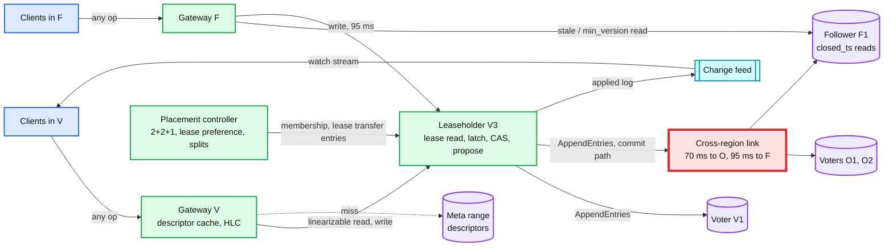

The five flows below are the ones to say from memory. Each is the final design, not the §4 version.

### Flow 1: linearizable write from the home region (about 75 ms)

Shown in §5.2. Summary: gateway routes to the leaseholder by descriptor cache; leaseholder checks lease, latches the key, checks `expected_version` against MVCC, proposes one entry with the idempotency key inside it; commit on leader + local peer + first remote ack; apply; reply with `version` and `commit_ts`.

### Flow 2: linearizable read in the home region (about 1 ms)

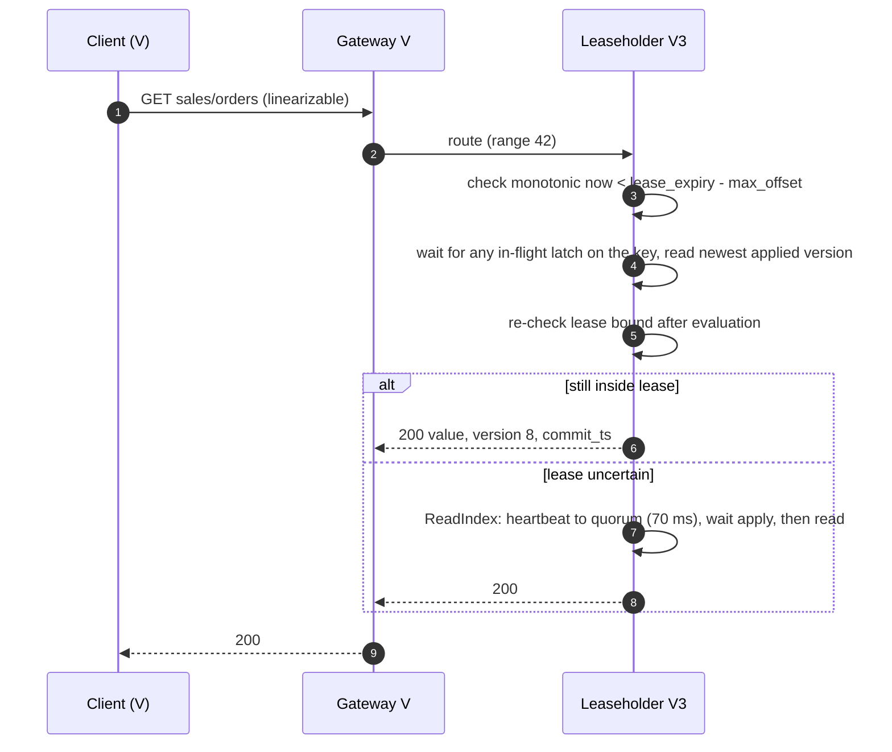

### Flow 3: stale read in a remote region (about 1 ms, bounded staleness)

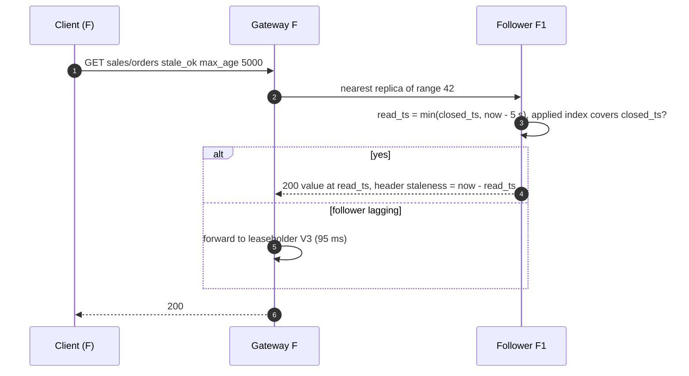

### Flow 4: two regions create the same name (one loses)

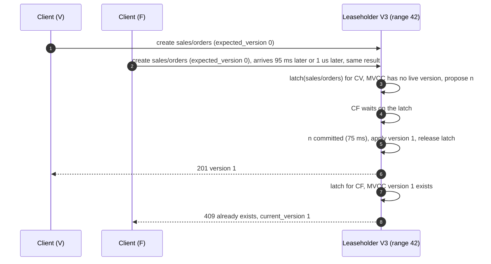

### Flow 5: region V dies (RTO 5 to 12 s, RPO 0)

Shown as a timeline in §5.1. Summary: election among O1 O2 F1 at 3 s, election restriction picks the most complete log; new leader waits out the old lease (up to 9 s plus 500 ms); grants itself epoch + 1; serves. Commits now cost O to F, 155 ms. Placement controller restores 5 voters after 5 minutes. Old V3, when it returns, has a lower term and an expired lease, and cannot serve anything until it catches up.

---

## 7. Trade-offs

| Decision | Option A | Option B | Chose | Why |
|---|---|---|---|---|
| Replica layout | 3 voters, 1 per region | 5 voters, 2 + 2 + 1 | B | A survives a region loss with zero margin; one more reboot takes the range down. B costs 67% more disk on 1.5 TB |
| Where the leader lives | Wherever Raft elects it | Pinned to the tenant's home region, second pair in the nearest region | Pinned | Unpinned leaders in the far region turn a 75 ms write into 190 ms and make every home-region read cross the ocean |
| Linearizable reads | ReadIndex on every read (one quorum round) | Lease reads bounded by the monotonic clock | Lease | ReadIndex is 70 ms per read against a 10 ms target. Lease needs only a drift bound (500 ppm over 9 s), not synchronized clocks |
| Remote-region reads | Always forward to the leaseholder | Follower reads at a closed timestamp, opt-in with `max_age` | Follower, opt-in | 70% of reads accept 3 to 5 s of staleness; forcing linearizable on them is 50k cross-region calls per second for nothing. Opt-in keeps the default honest |
| Clock | TrueTime (commit-wait, external consistency across shards) | HLC with 500 ms max offset and uncertainty restarts | HLC | We do not have GPS receivers in every rack. Restarts are rare on a catalog; commit-wait is 7 ms on every write |
| Transactions | 2PC over Raft groups for everything | Single-range by key design, 2PC only for cross-range within a tenant, never across tenants | B | Almost every txn is a rename inside one schema. 2PC exists for the leftovers and stays intra-region |
| Sharding | Hash by key | Ordered ranges with auto-split | Ordered | `list(prefix)` and watch need order. Load-based splits handle the hot tenant that hashing would spread but not be able to scan |
| Failover | Operator-driven with a runbook | Automatic election plus lease expiry | Automatic | RTO 30 s is not reachable by a human. The safety comes from leases, not from the operator |
| What we refused to build | Multi-master with last-writer-wins, cross-tenant transactions, a single global Raft group, secondary indexes in the store, values above 64 KB | | | LWW is not linearizable; cross-tenant 2PC is two remote acks; one group caps at ~10k writes/s and 8 GB; indexes and blobs belong elsewhere |

Consistency model, stated once: writes are **linearizable** per key and per single-range transaction, **strict serializable** for cross-range transactions inside a tenant (2PC over consensus with HLC timestamps). Default reads are **linearizable**. `stale_ok` reads are **snapshot reads with bounded staleness** (3 to 5 s). `min_version` reads are **read-your-writes**. Watch is **at-least-once, in commit order per key**. Nothing in the system is eventual except the descriptor caches, which are hints.

---

## 8. Staff-level notes

- **Simplest thing that meets the requirement.** Per-tenant ranges, one Raft group each, leases for reads. We refused: a global transaction manager, a timestamp oracle service, multi-master, and cross-tenant transactions. Each is a real system (TiDB's PD, Cosmos DB multi-write) and none is needed for a catalog with tenant-scoped semantics.
- **Failure modes and blast radius.** Region loss: every range homed there fails over in 5 to 12 s, writes for those tenants cost 160 ms until the region returns, nothing else changes. Meta range loss of quorum: no new descriptor lookups, cached ones keep working, so the blast radius is "cache misses fail" and it shrinks with cache warmth. Clock offset above 500 ms on one node: that node exits, its ranges fail over; the alert fires at 250 ms so this is rare. The largest blast radius is a bad placement-controller rollout that moves leases to the wrong region fleet-wide: latency triples, correctness holds, rollback is "stop the controller".
- **Migration.** From single-region Postgres: CDC backfill plus tail into the new store per tenant, dual-write with Postgres as truth, flip reads per tenant behind a flag (stale first, then linearizable), flip writes per tenant with reverse CDC for rollback, decommission. Every phase has a flag flip as rollback and versions to reconcile. [`deep-dives/migration-and-operations.md`](deep-dives/migration-and-operations.md).
- **Operability.** SLOs: write p99 200 ms and 99.99%; linearizable read p99 10 ms; stale read staleness p99 under 5 s. Pages at 3am: any range without a valid lease for 15 s; unavailable ranges above 0 for 60 s; clock offset above 250 ms on any node; a region's median Raft apply lag above 2 s; write p99 above 200 ms for 5 minutes. A weekly automated region-kill drill in staging, and a continuous linearizability checker (CAS histories through Porcupine) in production.
- **Cost.** 60 nodes with NVMe, 5x storage of 1.5 TB, 15 MB/s cross-region egress (about $25/day). The real cost is engineering: a Raft-based store is 2 to 3 years for a team of 6 to reach the maturity of CockroachDB or Spanner. The honest Staff answer names that: if the provider offers Spanner or a managed CockroachDB, buy it and spend the team on the catalog semantics. Build only if the platform's control plane cannot take that dependency.
- **Team boundaries.** Storage team owns ranges, Raft, leases, placement. Catalog team owns the key layout, value schemas, and the tenant home-region decision. SRE owns the failover drill and the clock infrastructure. The API in §3.2 is the contract between the first two; the lease and closed-timestamp semantics are the contract with every reader.
- **Explicit trade-off.** Every write pays one cross-region round trip, 70 to 95 ms, to make RPO 0 true. An interviewer who wants faster writes is asking to give up RPO 0 or to move the second replica pair closer; show both prices.

---

## 9. What is expected at each level

**Mid (80/20 breadth/depth).** Draws a replicated database with a leader and followers in three regions, says "use Raft or Paxos", writes go to the leader, reads from followers. Knows a majority is needed. May not notice that follower reads are not linearizable or that 3 replicas leave zero margin after a region loss. Passes if the diagram is clean and consistency is named.

**Senior (60/40).** Shards into consensus groups, puts 5 replicas across 3 regions and explains the majority math, pins leaders to a home region, separates linearizable reads (leader) from stale reads (followers). Names the clock assumption for lease reads. Walks the region-loss sequence and mentions the old leader must be fenced. Goes deep on one of: quorum placement and latency, read modes, failover.

**Staff+ (40/60).** Everything above, plus: the 2 + 2 + 1 layout with the second pair in the nearest region as a latency decision; leaseholder separate from Raft leader; lease reads bounded by drift rate not clock sync, checked after evaluation, with ReadIndex as the fallback; closed timestamps for follower reads with a stated staleness number; read-your-writes tokens as the cheap middle; pre-vote and check-quorum; HLC uncertainty restarts vs TrueTime commit-wait as a chosen trade; transactions kept single-range by key layout with 2PC over Raft groups only inside a tenant; the region-loss timeline with numbers for election, lease expiry, and the new commit latency; migration with dual writes and a rollback flag; and "buy Spanner if you can" said out loud with the reason you might not.

---

## 10. Nitty-gritty (past interview scope)

### 10.1 Internals of each chosen technology

**Raft per range.** Persistent state per replica: `current_term`, `voted_for`, the log, the applied index. Two RPCs, `RequestVote` and `AppendEntries`, plus `InstallSnapshot` for a follower that fell behind the compacted log. Commit index advances when a majority has the entry in the leader's term. Pipelined `AppendEntries` with flow control (max 64 entries or 1 MB in flight per follower). Snapshots taken from the MVCC store every 10,000 entries or 64 MB of log. Heartbeats coalesced per node pair so 500 ranges per node cost 59 messages per 500 ms, not 500. [`concepts/raft.md`](../../concepts/raft.md).

**Storage engine.** One LSM (RocksDB or Pebble) per node, shared by all its replicas. Keys encoded `range_local | tenant | path | reverse(commit_ts)` so the newest version of a key is first in a forward scan. Raft log in its own column family with `fsync` per batch; MVCC data in another with periodic sync, because the log is what durability depends on. Bloom filters per SST on the user key prefix so a point `get` on a missing key costs zero IO. [`concepts/lsm-tree.md`](../../concepts/lsm-tree.md).

**Leases.** A lease is a Raft entry `{holder, epoch, start, expiry}`; `expiry = start + 9 s` in the granter's HLC. The holder renews at `T/3` (every 3 s) by proposing a new lease entry with the same epoch and a later expiry. A candidate for a new lease proposes only after `previous_expiry + max_offset` has passed on its own clock. The holder serves a read only when `monotonic_now < expiry - max_offset - (drift_bound × lease_length)`, and checks that predicate before and after the read. Lease transfer is a lease entry naming a new holder with the current expiry, proposed by the current holder, which stops serving the moment it proposes.

**Hybrid logical clock.** 48 bits of wall-clock milliseconds plus 16 bits of logical counter. `now()` returns `max(wall, last) ` with the counter bumped when wall did not advance; every message carries the sender's HLC and the receiver takes the max. Gives causal order across nodes and timestamps within `max_offset` of real time. A node whose wall clock differs from the majority of its peers by more than 500 ms exits, because every uncertainty argument assumes that bound. [`concepts/leases-fencing-clocks.md`](../../concepts/leases-fencing-clocks.md) §4.

**Closed timestamps.** The leaseholder tracks the HLC of the newest proposal in flight. Every 200 ms it publishes `closed_ts = min(in-flight proposals) - 1` and refuses any later proposal with a lower timestamp (bumping the proposal's timestamp instead, which for a CAS is harmless). The value rides on `AppendEntries` and on a side channel for idle ranges. A follower that has applied index `i` and knows `closed_ts` for that index may serve any read at `ts <= closed_ts` from local state.

### 10.2 Configuration knobs that matter

| Knob | Value | Why |
|---|---|---|
| Voters per range, per region max | 5, 2 | Survives a region plus a node. Odd count |
| Range split size, merge size | 256 MB, 64 MB | Snapshot of a lagging follower under 30 s; small enough that a lease move is cheap |
| Load split threshold | 2,000 ops/s for 30 s | Below the leaseholder's comfortable per-range rate; 30 s filters bursts |
| Raft heartbeat, election timeout | 500 ms, 3 s | Election timeout about 20 × the 155 ms max RTT so WAN jitter never elects; 3 s bounds RTO |
| Lease duration, renew interval | 9 s, 3 s | Lease > election timeout so a live leader never loses its lease to a glitch; renew at T/3 |
| HLC max offset | 500 ms | Uncertainty window for snapshot reads; alert at 250 ms, exit at 500 ms |
| Closed timestamp target, interval | 3 s, 200 ms | Follower reads 3 to 5 s stale. Lower target means more proposals get bumped |
| MVCC GC horizon | 24 h | Lists and follower reads at past timestamps; `as_of` older than this is refused |
| Max in-flight entries per follower | 64 or 1 MB | Pipelining depth; enough for 500 writes/s at 75 ms |
| Client deadline, retries | 2 s, 2 with jitter | Long enough for one election; retries safe via `Idempotency-Key` |
| Idempotency table TTL | 10 min | Longer than any retry storm; entries are 100 B |
| Dead-node timer | 5 min | Before the placement controller re-replicates. Shorter causes churn on every deploy |

### 10.3 Capacity math per component

| Component | Unit load | Limit | Closest to limit? |
|---|---|---|---|
| Leaseholder node (home region) | 500 ranges, ~85 writes/s and ~5k linearizable reads/s per node at 1x; 10x reads = 50k/s | Disk-bound reads at ~200k/s per NVMe; CPU for Raft proposals ~20k/s per node | No, but this is the node to watch at 10x |
| Follower node | ~6k stale reads/s at 1x, 60k/s at 10x | Same NVMe | No |
| Cross-region link | 15 MB/s at 1x, 150 MB/s at 10x | Provider backbone, Gbps | No |
| Meta range | 1 lookup per 10k requests = 50/s | One Raft group, 10k/s | No |
| Change feed | 5k events/s aggregate, fan-out to N watchers | Per-range feed is a log tail; fan-out is the gateway's job | Watchers on a hot prefix (§5.5) |
| Placement controller | 6,000 ranges evaluated every 10 s | Trivial | No |
| Hot range before split | 2,000 ops/s | Leaseholder latch + one Raft group | Yes, until the load split fires (30 s) |

### 10.4 Failure timeline

**Region loss** is Flow 5 and §5.1. **Paused leaseholder** is scenario 2 in §5.4. Third timeline, **clock skew on one node**:

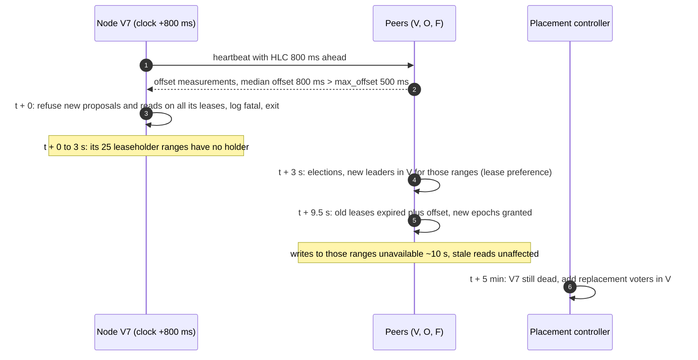

Why exit instead of "correct the clock": a node that already served a lease read with a clock 800 ms ahead may have served it after its real expiry. Exiting bounds the damage to the lease length and makes the incident visible.

### 10.5 Exactly-once and idempotency end to end

- **Client retry of a write.** The `Idempotency-Key` is inside the Raft entry, so it is applied exactly when the write is. On retry the leaseholder finds the key in its 10-minute table and returns the stored response. Without it, a retried `create` after a lost ack gets `409` and cannot tell "someone else created it" from "my first attempt succeeded". A CAS `put` retry without the key would fail on the version check, which is safe but confusing; with the key it returns the original `200`.
- **Leaseholder change between attempt and retry.** The idempotency table is replicated state (it is in the entry), so the new leaseholder has it.
- **Raft's own duplicates.** A leader may re-send an entry; followers dedup by index and term. Apply is idempotent per index.
- **Watch delivery.** At-least-once. Events carry `(path, version)`; the client keeps the last version per path and drops anything not newer.
- **Split during a write.** The proposal carries the range generation; a split bumps it; a proposal with the old generation is rejected and the gateway retries with the new descriptor. No double apply.
- **2PC.** The transaction record is the single commit point; intents are idempotent by `txn_id`; resolution is a CAS on the intent.

### 10.6 Consistency model per edge

| Edge | Model | Why |
|---|---|---|
| Client to leaseholder, write | Linearizable | One leaseholder per range, latch per key, committed by majority before ack |
| Client to leaseholder, read | Linearizable | Lease bound on monotonic clock, checked before and after; ReadIndex fallback |
| Client to follower, `stale_ok` | Snapshot with bounded staleness (3 to 5 s) | Closed timestamp |
| Client to follower, `min_version` | Read-your-writes (causal) | Waits for applied state to cover the token |
| Leaseholder to followers | Replicated log, majority-committed | Raft |
| Gateway descriptor cache | Eventual, treated as a hint | Corrected on `RangeKeyMismatch` |
| Leaseholder to change feed to client | At-least-once, per-key ordered, `resolved_ts` as the completeness bound | Tail of applied log |
| Cross-range txn inside a tenant | Strict serializable | 2PC over Raft with HLC timestamps and uncertainty restarts |
| Placement controller to ranges | Eventual, seconds | Membership and lease transfer are Raft entries; the controller only proposes |

### 10.7 Alternatives rejected

| Alternative | Why it looked attractive | Why rejected |
|---|---|---|
| One global Raft group (etcd style) | Simplest possible; one log, one leader | Caps at roughly 10k writes/s and 8 GB; one leader region for every tenant, so two of three regions pay a remote round trip on every read |
| Postgres primary with synchronous replica in another region | Known tool, transactions for free | One primary, manual failover, no per-tenant home region, sync replica lag under load stalls every commit; 4-node quorum semantics are not available |
| Multi-master with last-writer-wins (DynamoDB global tables, Cosmos DB multi-write) | Local writes everywhere, no cross-region wait | Not linearizable. Two `CREATE TABLE` both succeed and one silently wins later. The prompt says linearizable |
| CRDTs | Converge without coordination | "Create-if-absent" is not a commutative operation. Fine for presence counters, wrong for names |
| EPaxos / leaderless consensus | Every region commits at the nearest majority, no leader hop | Dependency tracking per command, complex recovery, little production adoption; our leader hop is 95 ms only for the minority of remote writes |
| Central timestamp oracle (TiDB PD) | Simple global order, no clock bound | A single service on every write's critical path across regions; HLC removes it |
| TrueTime | External consistency across shards, no uncertainty restarts | Needs GPS and atomic clocks in every datacenter; our cross-shard transactions are rare and tenant-local |
| ReadIndex on every read | No clock assumption at all | 70 ms per linearizable read vs 10 ms budget |
| Hash sharding | Even spread, no hot ranges | Kills `list(prefix)` and watch; ordered ranges plus load splits handle the hot tenant |
| Buy Cloud Spanner / managed CockroachDB | Someone else's 10 years of bugs | Not rejected: recommended if the platform allows the dependency. Built only if it cannot |

### 10.8 How the big companies do it

Numbers checked against primary sources on 2026-09-17; URLs and spot-check tables in [`research/`](research/).

- **Google Spanner** (OSDI 2012): data in directories, each in a Paxos group; the placement menu example is "North America, replicated 5 ways with 1 witness"; Paxos leader leases of 10 s by default, and after a zone kill "approximately 10 seconds after the kill time, all of the groups have leaders"; TrueTime uncertainty "varying from about 1 to 7 ms", commit wait about 5 ms and Paxos latency about 9 ms in the 1-replica microbenchmark; F1 in production over 24 h: reads 8.7 ms mean, single-site commit 72.3 ms mean, multi-site commit 103.0 ms mean, with east-coast datacenters given priority for Paxos leaders. That last line is our design measured: leader in the home region, one cross-region round trip per commit, and a witness where we use a fifth voter.
- **CockroachDB**: ranges of 512 MiB (`range_max_bytes` 536870912, `range_min_bytes` 128 MiB), Raft per range, a leaseholder separate from the Raft leader, `SURVIVE REGION FAILURE` raises the replication factor "from 3 (the default) to 5 ... spread across the 3 regions (2+2+1=5)", `REGIONAL BY ROW` pins a row's leaseholder to its home region, follower reads at a closed timestamp with `kv.closed_timestamp.target_duration` 3 s and a side transport every 200 ms so exact-staleness reads are "at least 4.2 seconds in the past", load-based splits above 2,500 QPS per range, max clock offset 500 ms with self-termination at 80% of it. It is the closest published system to this design; §5 is its architecture with the numbers stated.
- **TiKV / TiDB**: regions of 256 MiB since v8.4.0 (96 MiB before), split at 1.5 × that, PD as the placement driver and the timestamp oracle, learners for local reads. The TSO is the piece we chose not to have.
- **Chubby** (OSDI 2006): "five replicas in each cell, of which three must be running", a master lease of "a few seconds", client session leases with a default 12 s extension carried on KeepAlives, and sequencers so a server can check that a lock holder's grant is still current. That advice is §5.4 and [`concepts/leases-fencing-clocks.md`](../../concepts/leases-fencing-clocks.md).
- **etcd**: one Raft group, heartbeat 100 ms and election timeout 1 s by default; the tuning guide says election timeout should be at least 10 × the RTT, quotes 130 ms as a reasonable continental-US RTT and 350 to 400 ms US to Japan, and caps the timeout at 50 s "which should only be used when deploying a globally-distributed etcd cluster"; the storage quota defaults to 2 GiB with 8 GiB as the suggested maximum. The right tool per Kubernetes cluster, the wrong tool for a global catalog, and the reason we shard.
- **Databricks Unity Catalog**: the metastore is regional. Databricks' managed disaster recovery (docs updated Sep 2026) "replicates Unity Catalog metadata, managed table data, and workspace assets on a continuous schedule" and "lets you trigger failover from the account console": asynchronous replication, console-triggered failover, so RPO is the replication interval and cross-region writes are not linearizable. This prompt is the "what would it take to make that synchronous" behind that product.

### 10.9 Operational runbook

Dashboards (5 metrics): per range `lease_valid` and `leaseholder_in_preferred_region`; Raft apply lag per region (p50, p99); write and linearizable read latency p99 per region; follower-read staleness p99; clock offset per node (max and median).

Alerts: unavailable ranges > 0 for 60 s (page); ranges without a valid lease > 0 for 15 s (page); clock offset > 250 ms on any node (page, the node will exit at 500 ms); write p99 > 200 ms from the home region for 5 min (page); leaseholders outside preferred region > 1% for 10 min (ticket, placement controller is stuck); meta range QPS above 10 × baseline (ticket, descriptor cache thrash).

Rollout: node binaries canaried on one node per region for 24 h, then one region, then all, always keeping 4 of 5 voters on the old version per range so a bad binary cannot lose quorum. Placement controller changes are canaried on 1% of ranges. Rollback of a node binary is a redeploy; rollback of a bad placement decision is "stop the controller" and leases drift back on the next preference check.

Drills: kill a region in staging weekly, measure RTO per range; kill a random leaseholder node in production monthly during business hours; inject 400 ms clock offset on one node quarterly and confirm it exits and fails over.

### 10.10 Security and abuse

- Every request carries a signed token with `tenant_id`; the gateway rejects paths outside it. Range-level isolation means a bug in one tenant's code cannot touch another's keys.
- Per-tenant rate limits at the gateway on writes (1,000/s) and list pages (100/s), token bucket, so one tenant's DDL storm cannot starve a range's leaseholder.
- Values are opaque; the store never interprets them. Max 64 KB, enforced at the gateway.
- Node-to-node traffic is mTLS with per-node certificates; a rogue process cannot join a Raft group without a certificate issued by the placement controller.
- Audit: every write is already a log entry with a timestamp and (via the token) an identity; the change feed is the audit stream.

### 10.11 Evolution

- **Fourth region.** Add non-voting replicas there first for local follower reads (no quorum change); tenants homed there get voters moved via joint consensus, one range at a time. No downtime, no bulk data move beyond the replica copies.
- **10x keys, 10 B.** Ranges become 60,000; per-node replica count 5,000 is the pressure point; add nodes or raise the split size to 512 MB. The meta range splits into a two-level directory (meta1 pointing at meta2 ranges).
- **Cross-tenant references (a share from tenant A to tenant B).** Model as a copy of the pointer in each tenant, written by a saga through the watch stream, not a cross-tenant transaction. Say why: the two tenants may have different home regions, and a 2PC across them is two remote acks on every share.
- **GDPR delete.** Tombstone plus the 24 h GC horizon means the value is gone from every replica within 24 h; a `purge` op lowers the horizon for one key to immediate.
- **Secondary index (find tables by owner).** Built by an indexer on the watch stream into its own ranges, eventually consistent with `resolved_ts` as the freshness bound; never inside the write path.
- **Tenant moves home region.** Change `home_region`, the placement controller moves the second pair and the lease preference; writes see about 25 ms extra during the transition; no downtime.

---

## 11. Follow-up questions to expect

Ranked by likelihood. Each links to an edge case or deep dive.

1. Why not one Raft group? §10.7 and [`deep-dives/sharding-transactions-and-hot-tenants.md`](deep-dives/sharding-transactions-and-hot-tenants.md)
2. Three replicas, one per region. Region dies. Then a node reboots. [`deep-dives/quorum-placement-and-region-loss.md`](deep-dives/quorum-placement-and-region-loss.md)
3. Walk a write from Frankfurt. How many round trips? §5.2 and [`deep-dives/write-path-and-leader-placement.md`](deep-dives/write-path-and-leader-placement.md)
4. Linearizable read without a round trip. What did you assume about clocks? §5.3 and [`deep-dives/read-paths-and-clocks.md`](deep-dives/read-paths-and-clocks.md)
5. Region dies at 09:00:00. Second by second. §5.1 and [`edge-cases.md`](edge-cases.md#edge-case-home-region-lost)
6. Old leader comes back after a 30 s pause. §5.4 and [`deep-dives/fencing-stale-leaders-and-partitions.md`](deep-dives/fencing-stale-leaders-and-partitions.md)
7. Two regions create the same name. Flow 4 in §6
8. List 5 M keys under a prefix. §5.5
9. One tenant is 40% of writes. §5.5
10. Migrate from Postgres with zero downtime. [`deep-dives/migration-and-operations.md`](deep-dives/migration-and-operations.md)
11. What pages at 3am, and how do you know it is linearizable? §10.9
12. Why not DynamoDB global tables or Cosmos DB? §10.7
13. Rename across two ranges. §5.6
14. Clock jumps 800 ms on one node. §10.4
15. We only have two regions. Witnesses in §5.1
