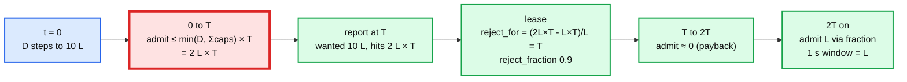

# Deep dive: accuracy and overshoot

> One-line answer: a limiter that decides locally and syncs every `T` can exceed the limit by at most `min(D, Σ local caps) × T` after a demand step of `D`, once, and by nothing in steady state if the global bucket carries the deficit forward; so the report interval is the accuracy knob, and "5% per second, 1% per 10 seconds" is a statement about `T`, the local caps, and the payback, not a hope.

Part of [`../solution.md`](../solution.md) §2, §5.1, §10.4. Sources: DRL paper for the accuracy vs responsiveness bound and the 50 ms estimate interval, Databricks blog for the ~5% tolerance and deficit memory, Cloudflare for the sliding-window error figures. Links in [`../research/`](../research/).

---

## 1. The bound

Let `L` be the limit per second for a key, `N` the enforcers that see it, `T` the report interval, and `D` a new demand rate that begins at `t = 0`.

- Between leases, each enforcer `i` admits at most `min(D_i, cap_i)` per second, where `cap_i = 2 × share_i` (leased) or `bootstrap` (no lease). Before the step, `Σ share_i = L`.
- Over the first interval the fleet admits at most `A_0 = min(D, Σ cap_i) × T ≤ min(D, 2L + N × bootstrap) × T`.
- The report at `T` shows `hits = A_0`, `wanted = D × T`. The global bucket drains to `L × T - A_0` (negative if `A_0 > L × T`). The lease sets `reject_for_ms = -tokens / L` and `reject_fraction = 1 - L / D`.
- From `T` on, admits are `≈ 0` until the deficit is repaid, then `L` per second.

So the extra traffic is bounded by `A_0 - L × T ≤ (min(D, 2L + N × bootstrap) - L) × T`, once. The DRL paper's framing: a distributed limiter cannot be both perfectly accurate and perfectly responsive, because the communication delay between limiters bounds how fast one learns what the others did. `T` is that delay.

## 2. The 10x case with numbers

```
L = 1,000/s, N = 2,000, T = 100 ms, bootstrap small (hot key: 4 x L / N = 2 tokens), D = 10,000/s at t = 0

caps         sum(2 x share) = 2L = 2,000/s; sum(bootstrap) = 4,000 -> only for enforcers with no lease; most have one
first 100 ms admitted A_0 <= min(10,000, ~2,000) x 0.1 = 200 requests  (vs 100 allowed)
             extra = 100 requests = one tenth of a second of the limit, not "one second's worth"
lease at 0.1 s   tokens = 100 - 200 = -100 -> reject_for_ms = 100; reject_fraction = 0.9
0.1 to 0.2 s admitted ~0 (payback)
0.2 s on     ~100 per 100 ms via reject_fraction 0.9 on 1,000 wanted per 100 ms
1 s window   200 + 0 + 8 x 100 = 1,000. Over by 0%.
```

Solution.md §2 quoted the looser "one second's worth" figure to show the worst case when local caps are not in place. With the `2 × share` cap the transient is 10% of the limit for one interval and fully repaid by the second. The interviewer's "10x in the first 100 ms" question is answered with: 200 admitted, 100 repaid, steady at 1,000, and the reason the cap exists.

Where it is worse:
- **Cold key, many enforcers with bootstrap.** `N × bootstrap` dominates. With `bootstrap = min(burst, L × T)` = 100 tokens and 2,000 enforcers that all see the key for the first time in the same interval, `A_0` could be 200,000. That is why bootstrap shrinks with `active_enforcers` (`4 × L / active`) once the allocator has seen the key, and why the RLG defaults lease carries `active` so new enforcers size it down. The cold-key first-interval worst case is `N × bootstrap`; state it.
- **Traffic shift between enforcers.** A load balancer reshuffle moves demand to enforcers with small shares; their `2 × share` cap absorbs a 2x shift. A 10x shift onto a few enforcers is rejected locally for one interval even though the fleet is under `L`. Under-admission, not overshoot; fixed by the next lease.

## 3. Steady state: why the 10 s bound is 1%

- With `reject_fraction = 1 - L / D` the fleet admits `L` per second on average, with per-interval noise from the Bernoulli draws: standard deviation `sqrt(L × T × (1 - p))` per interval, ~10 requests on 100 per interval. Over 10 s that is 0.3% noise.
- The global bucket drains by actual `hits`, so any systematic over-admit becomes a deficit and is paid back. The only unpaid overshoot is what a dead allocator forgets (≤ one interval) and what the `max_deficit` cap forgives (only if the overshoot was > 5 s worth, which the local caps make impossible).
- Hence: 1 s windows ≤ `L × (1 + T × (cap_factor - 1))` = 1,000 × 1.1 once; 10 s windows ≤ 1.01 L.

## 4. The knobs and what each costs

| Knob | Tighter accuracy | Cost |
|---|---|---|
| `T` (report interval) | 100 → 20 ms cuts `A_0` 5x | 5x reports for that key. Adaptive: only keys under pressure |
| local cap `2 × share` | 1.5x cuts transient by half | Rejects legitimate traffic shifts > 1.5x between leases |
| `bootstrap` | smaller | First request at a new enforcer may be rejected; more reliance on the floor |
| `max_deficit` | larger | A stale deficit can black-hole a tenant longer |
| exact global counter | perfect | A remote call per check. Different product |

## 5. How others state their accuracy

- **Databricks**: targeted about 5% over the defined limit with 100 ms batch reporting, client-side local caps for "obvious" excess, and deficit memory in the token bucket.
- **DRL (SIGCOMM 2007)**: 50 ms estimate interval with EWMA 0.1; FPS held a 50 Mbps aggregate across 490 limiters with 23 Kbps per limiter of control traffic; gossip branching beyond 3 gave little.
- **Cloudflare**: per-PoP sliding window counters; on 400 M requests, 0.003% of requests wrongly allowed or rejected, average 6% variance between the computed and the true rate.
- **Kafka quotas**: 11 samples of 1 s; the broker delays responses (`throttle_time_ms`) rather than rejecting, so short bursts above quota are absorbed and averaged over 10 s.
- **BwE**: convergence in tens of seconds (160 s after a weight change with the infinite-demand feature), acceptable because the traffic is bulk copy.

The common shape: nobody in production runs an exact global counter; everyone chooses an interval and states the tolerance.

## 6. Diagram



## 7. What the interviewer will push on

- "Can you make it exact?" Yes, with a remote call per check, or by routing every request for a key to one enforcer (consistent hashing at the load balancer), which turns the fleet limit into a single-node limit. Both are product decisions with a latency or a hot-spot cost. Offer them, do not default to them.
- "What about very small limits, 1 per minute?" `bootstrap = 1`, local caps of 1, and enforcement mostly by deficit: the second request anywhere in the fleet creates a deficit of one interval's rate, so the second minute admits nothing. Over-admission of at most `N_seen` requests once. For a 1/min limit that must be exact, use the single-enforcer routing.
- "Where does the 5% come from?" It is a product statement. The mechanism gives `≤ (cap_factor - 1) × T` once; with `T = 100 ms` and `cap_factor = 2` that is 10% of one second's budget once, 1% over 10 s, 0% in steady state. 5% per second is the number we promise so that the cold-key and traffic-shift cases fit.
