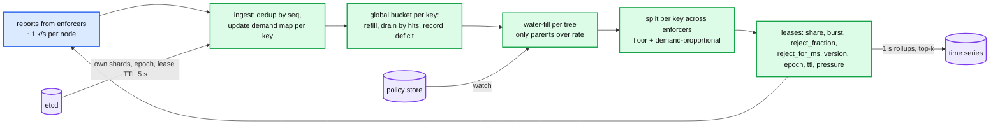

# Deep dive: the allocator and the control loop

> One-line answer: the allocator is a sharded, in-memory, soft-state service; each shard owns whole policy trees (by hash of the tree root, with explicit ownership and epochs in etcd), ingests delta reports every 100 ms, drains one global token bucket per key, water-fills each tree, splits each key's effective rate across enforcers by demand with a floor, and answers with leases; a new owner rebuilds everything it needs from two intervals of reports.

Part of [`../solution.md`](../solution.md) §4.1, §5.2, §5.4, §10.1, §10.3. Sources: Databricks blog (batch reporting, Dicer autosharding, response fields), Doorman (leases, learning mode, etcd election), BwE (hierarchy of enforcers, master plus hot standby), DRL paper (accuracy vs responsiveness). Links in [`../research/`](../research/).

---

## 1. Responsibilities, in order of the loop



## 2. State per key

```
struct KeyState {
    policy:      &PolicyNode,             // rate, burst, min, weight, parent, on_control_loss, version
    bucket:      { tokens: f64, last_ns: u64 },   // global bucket, may go negative
    deficit_ms:  u32,                      // -tokens / rate * 1000, capped at max_deficit
    demand:      HashMap<EnforcerId, { wanted: u32, hits: u32, seen_ns: u64 }>,   // TTL 10 s
    wanted_sum:  u32, hits_sum: u32,       // last interval
    eff_rate:    f32,                      // after water-fill; == policy.rate if parent not constrained
    active:      u16,                      // enforcers seen in last 10 s
    pressure:    enum { Low, Normal, High }
}
```

- Cold key: ~120 B. Hot key hit from all 2,000 enforcers: +48 KB for the demand map. 10 k hot keys = 480 MB fleet-wide, spread over 20 nodes.
- Nothing is written to disk. Ever. That is a design decision, not an omission (§6).

## 3. Ingest

```
on Report(enforcer, seq, entries):
    if seq <= last_seq[enforcer]: reply with current leases; return       // replay
    last_seq[enforcer] = seq
    for (key, hits, rejected, wanted) in entries:
        k = state[key] or create from policy (default node if unknown value)
        k.demand[enforcer] = { wanted, hits, seen_ns: now }
        k.hits_sum += hits; k.wanted_sum += wanted
        touched.insert(key)
```

Cost: ~300 ns per entry (one hash map lookup, one small update). 300 k entries/s per node = 10% of a core.

## 4. Global bucket and deficit

At the end of each interval (or lazily when a key is touched):

```
refill: tokens = min(burst, tokens + (now - last) * eff_rate)
drain:  tokens -= hits_sum
if tokens < 0:
    deficit_ms = min(max_deficit_ms, -tokens / eff_rate * 1000)
    reject_fraction = 1 - eff_rate / max(wanted_sum, eff_rate)        // steady-state steer
else:
    deficit_ms = 0
    reject_fraction = (wanted_sum > eff_rate * 1.05) ? 1 - eff_rate / wanted_sum : 0
```

- The bucket going negative is the memory. Databricks: "token bucket remembers information across time intervals". `reject_for_ms = deficit_ms` in the next lease repays it.
- `reject_fraction` is the Databricks `rejectionRate = (estimatedQps - policy) / estimatedQps` with `wanted` as the estimate. It exists so that steady-state overload is steered by a ratio, not by a wall of full rejections followed by a wall of admits.
- `max_deficit = 5 × rate` (5 s). A stale or buggy node cannot black-hole a tenant for longer than that.
- On a policy version change: `tokens = min(tokens, new_burst)`, `deficit_ms = 0`. No retroactive charge.

## 5. Split across enforcers

```
pool  = eff_rate
floor = eff_rate / (10 * active)                      // a trickle keeps a trickle
for e in demand where seen within 10 s:
    base[e] = min(floor, demand[e].wanted)            // floor only if there is demand
pool -= sum(base)
for e: share[e] = base[e] + pool * demand[e].wanted / wanted_sum
burst[e] = min(policy.burst, 2 * share[e] + bootstrap)
```

- `L / N` fails for any limit under `N × 10` per second. Demand-proportional shares are the only way to express a 100/s limit over 2,000 enforcers.
- The floor stops a low-demand enforcer from being starved to zero and then having to bootstrap every interval.
- A key's bootstrap allowance (for enforcers with no lease yet) is `min(burst, rate × T, 4 × rate / active)` and is sent in the RLG defaults lease. It shrinks as more enforcers see the key, which bounds coordinated bursts at `N × bootstrap ≤ 4 × rate`.

Doorman's `PROPORTIONAL_SHARE` and BwE's task-level split under a job allocation are the same idea. Ours runs 50 to 100x faster because the tree is shallow and the state is in memory.

## 6. Why soft state, and what learning mode does

- Counters are worth one interval. Replicating them synchronously on a 100 ms loop costs an RTT per interval per shard and buys protection for 100 ms of data. Not worth it.
- On failover the new owner: loads policy (already in memory from the watch), takes the shard with `epoch + 1`, and for `learning_intervals = 2` answers each report with a lease that echoes the enforcer's current share (enforcers include `current_share` in the report for this reason). Meanwhile it fills the demand map. From interval 3 it computes normally.
- Lost: the dead owner's deficits (≤ one interval of overshoot) and the `seq` table (one possible double count). Both inside the 5% budget.
- Doorman does exactly this after master election, for one lease length (minutes). BwE runs cluster enforcers as master plus hot standby and has children apply the standby's numbers if the master vanishes; we could add a hot standby that receives a copy of reports, but with a 5 s etcd expiry and 2 learning intervals the gain is ~5 s of stale enforcement, which is not worth doubling the tier.

## 7. Ownership with epochs

```
etcd layout:
  /rl/nodes/<node_id>            lease TTL 5 s, keepalive 1.5 s
  /rl/shards/<0..4095>           value { owner, epoch }, written under the owner's lease
  /rl/rebalancer                 leader election key

Owner loop:
  every 1.5 s keepalive; on failure to renew within TTL: mark all owned shards "stopped" locally, answer WRONG_OWNER
Rebalancer loop (leader):
  watch /rl/nodes; on node loss or join, reassign shards with epoch+1 via txn(compare version) writes
  planned handoff: write new owner first, then signal old owner to drain (ship demand maps + deficits), then old stops
Enforcer:
  cache shard map; on WRONG_OWNER(epoch) or after 30 s, refresh from etcd (or from any allocator, which proxies the map)
  ignore leases with epoch < highest seen for that shard
```

Consistent hashing without this would give a silent double-owner window on every membership change: two nodes both handing out full shares, limit 2x, for seconds, with no metric that notices. Epochs make it impossible for enforcers to believe two owners, and the local lease clock makes the old owner stop answering even if partitioned from etcd.

## 8. Shard assignment: why by tree root

- Water-filling needs a parent and all its children in one place every interval. Hashing by key would scatter a tree across 20 nodes and turn every interval into a cross-node gather.
- `hash(tree_root) % 4096` with a hash tag: `{account:A}:workspace:W:user:U` and `{account:A}` land together. Flat keys (`endpoint:/query`) hash on themselves.
- Hot root: one account with 30% of traffic is one shard at 100% CPU. Fix is `delegate_children`: children subtrees move to their own shards, and the root shard hands each a budget lease per interval (see [`hierarchical-fair-allocation.md`](hierarchical-fair-allocation.md) §5). This is BwE's cluster enforcer / job enforcer split.

## 9. Adaptive interval

| Key pressure | Condition | Report interval | Why |
|---|---|---|---|
| High | bucket < 20% or deficit > 0 | 20 ms | Near the limit, overshoot bound `D × T` must be tight |
| Normal | otherwise | 100 ms | Default |
| Low | `wanted_sum < 20% × rate` for 10 intervals | 1 s | Cold keys cost nothing |

The lease carries `pressure`; the enforcer sets its per-key report cadence from it. Control traffic follows pressure, which is why it grows sub-linearly with request rate (Databricks' observation). Full accuracy math in [`accuracy-and-overshoot.md`](accuracy-and-overshoot.md).

## 10. Capacity per node

```
Reports in         1 k/s x ~300 entries = 300 k entries/s   -> ~10% of a core
Water-fill         only parents over rate; typical tree 3 levels, 50 children -> ~5 us per parent per interval
Leases out         300 k/s x 40 B = 12 MB/s
Memory             500 k keys x 120 B = 60 MB + hot demand maps ~25 MB
etcd               1 keepalive / 1.5 s, ~200 shard keys per node
Time series        top-k 500 keys x 6 series / s = 3 k points/s
Headroom           ~10x on CPU before the hot-account case; that case is the red node and is handled by delegation, not by bigger nodes
```

## 11. What the interviewer will push on

- "Why not Redis with Lua batching?" It removes the per-request hop but keeps state in a store that cannot walk a tree, has async replication, and still fails over with counter loss. Databricks used it as a stepping stone and then removed it.
- "Why etcd and not gossip?" We need exactly one owner per tree, not a consistent estimate per limiter. Gossip (DRL) gives the latter, and its own paper shows the global-token-bucket variant is unstable with stale estimates.
- "What if etcd is slow?" Ownership changes are the only thing that waits on etcd. Reports, leases, and traffic never do.
