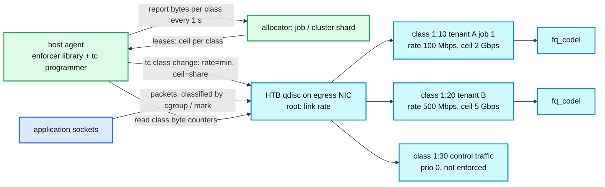

# Deep dive: the bandwidth throttling variant

> One-line answer: to throttle bytes instead of requests, keep the allocator and the hierarchy, swap the enforcer for a host agent that programs the kernel (HTB classes with `rate = min`, `ceil = share`, or EDT pacing per socket), slow the loop to 1 to 5 s because TCP needs RTTs to react and bandwidth demand moves slower, make "reject" mean "shape then drop", and never fail fully open on a WAN link.

Part of [`../solution.md`](../solution.md) §5.6, §10.11. Sources: BwE (SIGCOMM 2015) for the hierarchy, intervals, host enforcement with HTB and failure handling; `tc-htb` and `tc-fq` man pages; DCTCP (RFC 8257) and Swift for what the transport already does; GCP per-VM egress caps and Kubernetes bandwidth annotations as examples of host-level enforcement. Links in [`../research/real-world-architectures-survey.md`](../research/real-world-architectures-survey.md).

---

## 1. What changes and what does not

| Aspect | Requests | Bytes |
|---|---|---|
| Unit | 1 per request | payload bytes; `cost = len` |
| Enforcer | in-process filter | host agent that programs `tc` / eBPF; kernel does per-packet work |
| Where the decision runs | user space, per request | kernel, per packet, from rates the agent set |
| Report interval | 100 ms | 1 s (host), 5 s and up per level above (BwE: 5, 10, 15 s) |
| Reject means | 429 now | queue in the class, delay, drop when the queue is full; TCP slows down |
| Fairness inside a leaf | none needed | TCP flow fairness plus `fq_codel` in the class |
| Hierarchy depth | 3 to 4 | 5 (DC pair, tenant, job, task, flow group in BwE) |
| Safe policy | per RLG, `local_cap` default | last allocation, then decay to floor; never fully open on WAN |
| Allocator | same | same, plus delegated budgets as the default |

The allocator does not know or care whether a token is a request or a byte.

## 2. The host enforcer



- **Classification**: packets get a class by cgroup (`net_cls`), socket mark, or an eBPF program that maps `(uid, destination prefix)` to a class. The flow group is the leaf key.
- **HTB semantics**: `rate` is guaranteed, `ceil` is the borrow limit, `burst` / `cburst` are bucket depths, `quantum = rate / r2q` (default `r2q = 10`) sets the bytes per round when borrowing, `prio` orders borrowers. The lease maps `min → rate`, `share → ceil`. A class stays inside its `ceil` regardless of what the allocator promised, so a stale lease cannot exceed the last ceiling.
- **Alternative: EDT pacing.** Instead of a qdisc tree, an eBPF program stamps each packet with an earliest departure time computed from the flow group's rate, and the `fq` qdisc releases packets at that time. Same rates, no class tree, scales better on hosts with tens of thousands of flows. `SO_MAX_PACING_RATE` is the per-socket form. BwE used HTB; newer Google work moved to EDT-style pacing.
- **Control traffic** (reports, leases, health) goes in a high-priority class that is never enforced. BwE makes the same exception.
- **Counters**: the agent reads per-class bytes sent and dropped from the qdisc every second; `hits = bytes sent`, `wanted = bytes offered` (sent + queued + dropped), reported as usual.

## 3. Why the loop is slower

- TCP needs several RTTs to fill a new rate; a 100 ms lease churn on a 10 ms WAN RTT would just cause oscillation. BwE reports host → job every 5 s, job → cluster every 10 s, cluster → global every 15 s, and runs the algorithm every 4 to 10 s; it converges in tens of seconds and calls that fine because the big consumers are bulk copies.
- Bandwidth demand is smoother than request demand. Copy jobs ramp over seconds.
- The cost of a stale lease is lower: a class shapes at its last `ceil`, queues absorb, TCP backs off. The overshoot bound is now in bytes queued, not requests admitted.
- 1 s at the host with 1 M flow groups is 32 MB/s of reports fleet-wide, trivial; going to 100 ms would be 320 MB/s for no gain.

## 4. What the network already does, and what it cannot

- **Congestion control** (DCTCP with ECN marking at threshold `K`, Swift with delay targets, BBR pacing) shares a link fairly among flows and keeps queues short. It gives per-flow fairness, not per-tenant policy: a tenant with 1,000 flows gets 1,000 shares. That is the gap this system fills, and it is why the DRL paper's flow proportional share had to estimate flow counts.
- **Per-VM egress caps** (GCP: a per-vCPU rule, a lower cap to the internet, a per-flow cap) bound one host, not a tenant across hosts.
- **QoS classes on switches** (DSCP) give priority, not quantity. BwE's fallback on control loss is exactly "let QoS plus TCP arbitrate", which works because the switches still isolate latency-sensitive from bulk.
- So: transport handles flows and links; QoS handles priority; this system handles tenant, job and task quantity across many hosts. Say the three layers.

## 5. Hierarchy and delegation as the default

```
global allocator (per DC pair, link capacity as the root rate, updated every 30 s from the network model in BwE)
  -> cluster allocator (tenant subtrees, water-fill among tenants, budget leases per tenant every 5 s)
    -> job allocator (per tenant or per job hash, water-fill among tasks, leases per host every 1 s)
      -> host agent (HTB ceilings per flow group)
```

Each level summarizes upward (sum of `wanted`, sum of `hits`) and delegates downward (a budget lease with a TTL). This is the `delegate_children` mechanism of the request design, applied at every level because the tree is five deep and has millions of leaves (BwE: 194 M task flow groups globally). Per-level replicas are master plus hot standby with children applying the standby's numbers if the master vanishes, or our etcd-epoch scheme; either is fine at these intervals.

## 6. Safe policy for links

- Grace: keep the last ceilings for minutes, not 10 s (BwE: several minutes). A stale ceiling is safe because it is still a ceiling.
- Then: decay each class's `ceil` toward its `rate` (the guarantee) over 30 s, or to a configured static allocation for bulk classes. Never remove ceilings on a WAN link: unbounded egress is the outage this system prevents, and it also costs money per byte.
- Latency-sensitive classes may be left to QoS plus TCP (BwE's choice), because they are small and the switch priority protects them.

## 7. Bandwidth functions, briefly

BwE allocates by value, not bytes: each application declares how much it values each extra Mbps (a piecewise-linear curve), and the allocator equalizes value across competitors on a bottleneck link, with a priority band above and below. For a Staff answer: name it as the way to express "the copy job is happy with 1 Gbps and indifferent beyond 5", and say that `weight` plus `min` plus `rate` (ceiling) covers 90% of it with a policy surface people can actually fill in.

## 8. Numbers to say out loud

```
Hosts                  50 k; flow groups 1 M (20 per host)
Host report            32 B x 20 = 640 B per second; fleet 32 MB/s
Job allocator          ~1,000 hosts each = 20 k entries/s; trivial
Cluster allocator      tenant summaries every 5 s; trivial
Global                 site pairs x tenants; BwE's global algorithm runs in ~3 s max
Enforcement latency    tc class change ~1 ms; TCP reaches the new rate in ~10 RTTs = 100 ms on a 10 ms path
Overshoot              bounded by last ceil, not by demand: a stale lease cannot exceed what was last granted
Convergence            tens of seconds (BwE: 160 s for a weight change with the infinite-demand feature)
```

## 9. What the interviewer will push on

- "Why not just use DCTCP?" It is flow-fair and link-local. It cannot say "tenant A gets 40% of the DC pair regardless of how many flows it opens". Both layers are needed.
- "What does 'reject' mean for bytes?" Shape (queue and delay) first; TCP reacts to the delay; drop only when the class queue is full. That is why the loop can be slow and why the overshoot is softer.
- "Why is the loop seconds, not 100 ms?" TCP reaction time, smoother demand, and a stale ceiling being safe. BwE's numbers are 5 / 10 / 15 s.
- "Where does the link capacity come from?" A network model (topology, link states, failures) updated every 30 s in BwE. The root rate of the tree is an input from another system, and when it is stale, BwE calls the difference "dark bandwidth" and smooths it.
