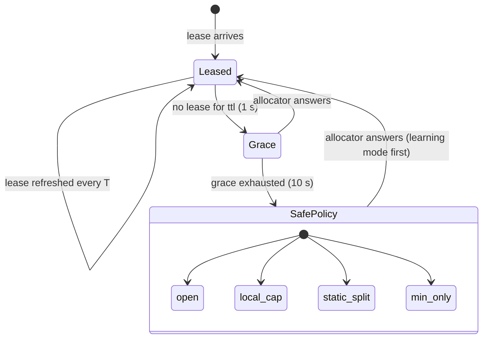
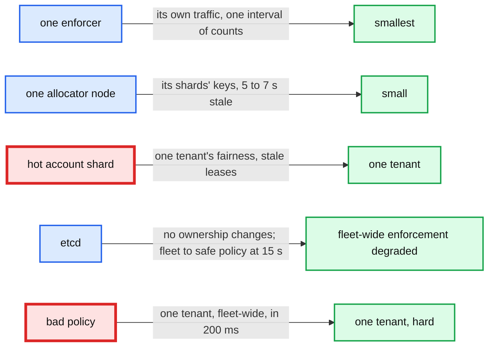

# Deep dive: failure modes and fail-open vs fail-closed

> One-line answer: "fail open or fail closed" is the wrong question for the whole system; it is a per-limit policy (`on_control_loss`), reached only after a lease and a grace period, and the right value depends on who gets hurt when the limit is exceeded: us (fail open with a local cap), a sibling tenant (fail to `min`), or an external party whose quota we cannot renegotiate (fail closed to a static split).

Part of [`../solution.md`](../solution.md) §5.3, §5.4, §8, §10.4. Sources: Doorman's safe capacity (`-1`, `0`, or a rate) and learning mode, Envoy's `failure_mode_deny` (default false), Stripe's fail-open exception handlers and kill switches, BwE's "last known state for several minutes, then QoS and TCP or a low static allocation". Links in [`../research/`](../research/).

---

## 1. The ladder every enforcer walks

| Rung | Duration | Behaviour | Bounded by |
|---|---|---|---|
| Leased | steady | share from allocator | the allocator's view, ≤ T stale |
| Grace | ≤ 10 s | last share, local cap 2x | what the allocator last said |
| Safe policy | until control returns | per-RLG rule | the rule |

Ten seconds of grace covers an allocator failover (5 s etcd expiry + rebalance + learning) with margin. It does not cover an etcd outage, which is the case that pushes the fleet to safe policy, and pages.

## 2. The four safe policies and who they protect

| `on_control_loss` | Each enforcer may admit | Fleet worst case | Use when exceeding hurts |
|---|---|---|---|
| `open` | unlimited | unlimited | nobody much: a soft product limit (free-tier nudges) |
| `local_cap(x)` | `x` per second | `N × x` | us, and the backend can absorb `N × x` (default `x = rate / expected_enforcers × 4`) |
| `min_only` | the node's `min` split as `min / expected_enforcers` | `min` | a sibling tenant: keep guarantees, drop borrowing |
| `static_split` | `rate / expected_enforcers` | `rate` | an external party: cloud API quotas, partner rate limits, egress cost caps |

- Doorman's safe capacity is the same idea with three values: `-1` (unbounded), `0` (block), or a positive rate. We add `min_only` because we have a hierarchy.
- Stripe: every limiter wrapped in an exception handler that fails open, plus feature-flag kill switches. Right for their case (the limiter protects their own API; an outage of the limiter must not be an outage of Stripe). Wrong for a quota someone else enforces on us.
- Envoy: `failure_mode_deny=false` by default (fail open when the rate limit service is unreachable); `true` returns 500s. A per-route setting, which is the same "per limit" conclusion.
- BwE: last known allocation for several minutes; then remove allocations and let QoS plus TCP arbitrate, except copy traffic gets a low static allocation. That is `local_cap` for latency-sensitive traffic and `static_split` for bulk, chosen per traffic class.

Push back on the textbook answer: "fail open" for a fleet-protection limit means that the limiter outage plus a traffic spike takes down the backend, which is the scenario the limiter exists for. Fleet-protection RLGs get `local_cap` with `x` sized so that `N × x` is what the backend can actually absorb.

## 3. Failure matrix

| Failure | Detect | Data path effect | Enforcement effect | Recovery | Page? |
|---|---|---|---|---|---|
| Enforcer pod dies | LB health check, 2 s | its in-flight requests fail | one interval of counts lost; its share reclaimed after 10 s | new pod bootstraps | no |
| Allocator node dies | report timeouts (100 ms), etcd lease (5 s) | none | its keys on grace share 5 to 7 s; deficit lost (≤ 1 interval) | rebalance, learning mode 200 ms | no, ticket if > 3/day |
| Allocator node paused 20 s (GC, live migration) | etcd lease expiry | none | as above; its stale leases fenced by epoch | node self-resets on resume | no |
| Hot shard at 100% CPU | `report_rtt`, `entries_per_s` | none | that tree's leases stale, grace | `delegate_children`, suppression | ticket at 60%, page at 90% |
| etcd unavailable | keepalive failures | none | owners serve until local lease expiry, then stop; fleet to safe policy at ~15 s | rebalance on return | yes |
| Policy store unavailable | watch errors | none | no policy changes; leases continue | none needed | ticket |
| Partition: enforcers vs allocators | report timeouts | none | partitioned enforcers to safe policy at 11 s | heal, bootstrap, one interval | yes if > 1% of fleet |
| Partition: allocator vs etcd | keepalive failure | none | that node steps down at expiry; treated as node death | rebalance | no |
| Bad policy (limit set to 0) | rejection spike on one tenant | that tenant 100% 429 within 200 ms | as intended, wrongly | `PutPolicy(previous_version)`, 200 ms | yes, via tenant rejection alert |
| Buggy enforcer version | `overshoot_1s` by version | over-admits from canaries | deficit pushes `reject_for_ms` to canaries | halt rollout | yes at canary |
| Clock jump on a pod | none needed | none | none (monotonic clocks, durations) | none | no |
| Time series store down | scrape errors | none | none; dashboards blind | none | ticket |

## 4. Split brain, in detail

Two allocators believing they own the same shard would each hand out full shares: limit 2x, silently. Three mechanisms, any one of which is enough:

1. **etcd lease plus local clock.** The owner writes its shard keys under its etcd lease. If it cannot renew, it knows the TTL it was granted and stops answering at that monotonic deadline, whether or not it can reach etcd. A GC pause past the deadline is detected on resume (`now - last_tick > 3 × T`) and the node treats itself as deposed.
2. **Epoch in every lease.** The rebalancer bumps the epoch on each reassignment via an etcd transaction. Enforcers keep the highest epoch seen per shard and drop lower ones. A deposed owner's leases are inert even if it keeps answering.
3. **Shard map freshness.** Enforcers refresh the map on `WRONG_OWNER` and every 30 s regardless, so a stale map self-heals.

The residual window: between the old owner's local deadline and the new owner's first computed lease, roughly 200 to 300 ms, enforcers are on grace at the last share. Not a double owner, just a stale one.

## 5. Partition asymmetry

- **Enforcers cut off from allocators** (the common cloud partition): they degrade to safe policy. The allocators see them vanish from demand maps after `demand_ttl` and give their shares to the enforcers still reporting. When the partition heals, returning enforcers bootstrap and get shares within one interval. Total over-allocation: one interval.
- **Allocators cut off from etcd but not from enforcers**: they step down at lease expiry. Enforcers cannot reach any owner for those shards until etcd is back. This is the case that argues for the operator "freeze ownership" switch: an explicit decision to keep serving without a single-owner guarantee during a known etcd incident.
- **Region split (multi-region evolution)**: each region's root keeps serving on its last budget lease, then takes the whole budget after a 10 s grace. Two regions may then each enforce the full global limit. Named as the cost of not making a cross-region call per interval.

## 6. Blast radius summary

The two red boxes are the ones an on-call should fear: a hot shard (degrades slowly, warns at 60%) and a bad policy (instant, but reversible in 200 ms). Everything else is bounded by leases and grace.

## 7. What the interviewer will push on

- "Just fail open, availability first." Ask: whose availability? Fail open on an external quota limit makes the provider throttle every workspace. Fail open on a fleet-protection limit lets a spike plus a limiter outage take the backend down. Per limit, not per system.
- "Why not replicate allocator state so nothing is lost?" State is worth one interval. Replication would add an RTT per interval to protect 100 ms of counts. Learning mode gets the same result for free, 5 s later.
- "How do you test this?" A traffic simulation harness (Databricks built one) that runs burst, failover, partition and policy-change scenarios against a staging fleet, asserting the overshoot bound per key. Failover drills in production monthly: kill an allocator node, watch `lease_age_p99` and `overshoot_1s`.
