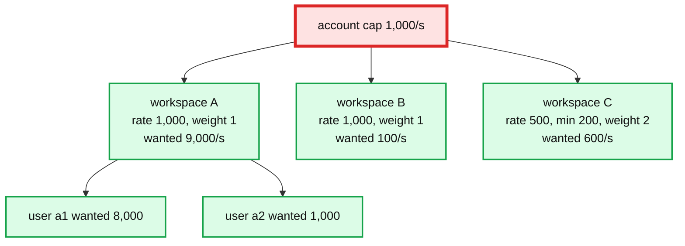
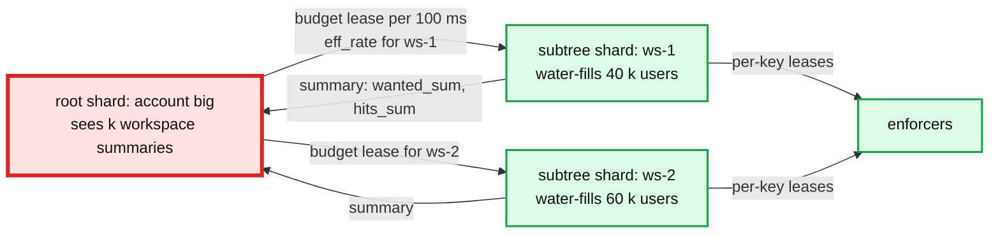

# Deep dive: hierarchical fair allocation

> One-line answer: when a parent's demand exceeds its rate, the owner shard runs weighted max-min water-filling over the children (give each its `min`, then raise all unsatisfied children in proportion to weight until the pool is gone), which is exactly Linux HTB's `rate` / `ceil` / borrow semantics computed once per 100 ms instead of per packet; the result is a per-child effective rate that the enforcers see as an ordinary per-key share.

Part of [`../solution.md`](../solution.md) §4.3, §5.5, §10.1. Sources: `tc-htb` man page for the semantics, BwE for the hierarchy with bandwidth functions, Kubernetes APF for fairness inside one server, DRF (NSDI 2011) for the multi-resource extension. Links in [`../research/mechanisms-survey.md`](../research/mechanisms-survey.md).

---

## 1. The problem in one picture



Independent buckets with AND semantics enforce the 1,000/s cap, but whoever arrives first takes it. Workspace A's 9,000/s fills the account bucket every interval; B and C get whatever is left, which is nothing.

## 2. Policy fields and their HTB names

| Our field | HTB name | Meaning |
|---|---|---|
| `min` | `rate` | Guaranteed if there is demand. Sum of children's `min` ≤ parent's `rate`, validated at `PutPolicy` |
| `rate` | `ceil` | The most this node may ever get, even if the parent has spare |
| `weight` | `quantum` (via `r2q`) | How spare parent capacity is divided among children that want more |
| `burst` | `burst` / `cburst` | Bucket depth at the enforcer |
| (parent's spare) | borrowing | Children above `min` and below `rate` borrow from the parent's pool |

HTB is the reference semantics because it is what every network engineer already knows, and because in the bytes variant it is literally the enforcer.

## 3. Water-filling, weighted, with minimums

```
fn water_fill(parent_rate R, children C):
    for c in C: give[c] = 0; sat[c] = (wanted[c] == 0)
    // step 1: minimums
    for c in C where !sat[c]:
        give[c] = min(wanted[c], min[c]); if give[c] == wanted[c]: sat[c] = true
    pool = R - sum(give)
    // step 2: raise unsatisfied children in proportion to weight, capped by their own rate and wanted
    while pool > 0 and any !sat:
        W = sum(weight[c] for c in C where !sat[c])
        unit = pool / W
        for c in C where !sat[c]:
            room = min(wanted[c], rate[c]) - give[c]
            add  = min(room, weight[c] * unit)
            give[c] += add; pool -= add
            if give[c] >= min(wanted[c], rate[c]): sat[c] = true
    return give            // eff_rate per child for this interval
```

Rounds: at most `|C|` because each round satisfies at least one child. In practice 2 to 3. Sorting children by `(min(wanted, rate) - min) / weight` makes it one pass.

### Worked example (from the picture)

```
R = 1,000. Children: A (min 0, rate 1,000, w 1, wanted 9,000), B (min 0, rate 1,000, w 1, wanted 100), C (min 200, rate 500, w 2, wanted 600)

step 1  give = A 0, B 0, C 200          pool = 800
round 1 W = 1+1+2 = 4, unit = 200
        A: room 1,000, add 200 -> 200
        B: room 100,  add 100 -> 100, satisfied
        C: room 300,  add 300 (2 x 200 capped by room) -> 500, satisfied (hit its rate)
        pool = 800 - 600 = 200
round 2 W = 1 (only A), unit = 200
        A: add 200 -> 400. pool = 0
result  A 400, B 100, C 500. Sum 1,000.
```

- B got everything it wanted. A noisy sibling cannot take that from it.
- C got its `min` first, then borrowed up to its `rate`.
- A got the rest. Its lease will say `share 400, reject_fraction = 1 - 400 / 9,000 = 0.956`.
- Recurse: A's 400 is now the `R` for A's children a1 (wanted 8,000) and a2 (wanted 1,000) with equal weight: 200 each.

## 4. When it runs

- Only for parents where `wanted_sum > eff_rate`. An account far under its cap skips the walk; each child's `eff_rate` is simply `min(child.rate, ...)` from policy.
- Only for the touched subtrees of this interval. A 100 k-user account where one workspace is over its rate walks that workspace's users, not the whole tree.
- Top-down: root's `eff_rate` is its `rate`; each child's `eff_rate` comes from the parent's water-fill; then that child water-fills its own children with `R = eff_rate`.
- Output is the per-key `eff_rate` that the split step (see [`allocator-and-control-loop.md`](allocator-and-control-loop.md) §5) turns into per-enforcer shares.

Cost: O(children) per constrained parent per interval. A parent with 100 k children that is constrained is the hot-shard case; §5.

## 5. Delegated budgets for wide or hot trees



- `delegate_children: true` on a policy node moves each child's subtree to `hash(child) % 4096`. Enforcers route reports for those keys to the child's shard; the child shard sends one summary per interval to the root shard and receives its `eff_rate` back as a budget lease with a TTL.
- Fairness across siblings becomes one interval staler (the root sees last interval's summaries). Fairness within a subtree is unchanged.
- Budget lease loss (root shard failover): the subtree shard keeps the last budget for the grace period, then falls to the child's own `rate` (its ceiling) or `min` depending on the RLG's safe policy. Same ladder as the enforcer's.
- This is BwE's shape: global enforcer → cluster enforcer → job enforcer → host, each level summarizing upward and delegating downward, with the reporting interval growing with height (5, 10, 15 s in BwE). Ours is two levels because the tree is shallow.

## 6. Bandwidth functions (what BwE adds and we skip)

BwE lets each application state how much value it gets from each extra Mbps, as a piecewise-linear "bandwidth function", and allocates to equalize value rather than bytes. It matters when bulk copy traffic and latency-sensitive traffic share a WAN link. For request rate limiting, `weight` and `min` cover the product need, and a value curve is a policy surface nobody will fill in correctly. Named as the seam: replace `weight` with a curve in `water_fill` and nothing else changes.

## 7. Multi-resource fairness

If a limit must cover two resources at once (requests and bytes, or CPU seconds), a single water-fill picks a winner on one axis and starves on the other. Dominant Resource Fairness equalizes each tenant's share of its most-demanded resource. It is a drop-in replacement for the `unit` computation: each round raises the child whose dominant share is lowest. Reports gain one column per resource, the enforcer gains one bucket per resource per key. Below the line for the interview; named in `solution.md` §10.11.

## 8. What the interviewer will push on

- "Is fairness real-time?" No. It is as fresh as the interval. A child that was idle gets its bootstrap at once, its `min` within one interval, and its fair share within two. Say the numbers.
- "What if the parent is not constrained?" No walk. Children get `min(rate, wanted)`; the parent bucket still enforces the cap as a backstop.
- "Why not APF-style queues?" Kubernetes API Priority and Fairness queues requests inside one server and dispatches fairly. We have 2,000 servers and no shared queue; the allocator's shares are the distributed equivalent. Queuing at the enforcer is a product choice (delay vs reject) and is what the bytes variant does with HTB.
