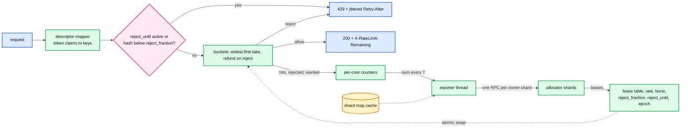

# Deep dive: local enforcement

> One-line answer: each enforcer keeps a 32-byte refill-on-read token bucket per key, checks a request's keys widest-first with refunds on reject, applies the current lease's `reject_fraction` and `reject_for_ms` before touching the bucket, counts hits on per-core counters, and never blocks on the network; the whole check is under 5 us and the state per key is under 100 bytes.

Part of [`../solution.md`](../solution.md) §4.1, §5.1, §10.1. Sources: `redis-cell` and the GCRA write-up for the single-timestamp form, RFC 2697 for token bucket terms, Envoy's local rate limit filter for the static-split baseline, the Databricks blog for the optimistic-admit and rejection-rate mechanics. Links in [`../research/mechanisms-survey.md`](../research/mechanisms-survey.md).

---

## 1. Why the decision must be local

```
10 M checks/s fleet-wide. In-DC RTT 0.2 to 1 ms; p99 10 to 20 ms on some clouds (Databricks measured).
A remote check per descriptor: 5 sequential hops in the worst case = 50 to 100 ms p99 added to a 50 ms API.
A local check: 5 cache-line reads and CASes = under 1 us.
```

The remote design is not "slower", it is a different product. Everything below exists so that the local decision is right often enough.

## 2. The bucket

```
struct Bucket {          // 32 bytes, one cache line with room
    tokens:   f64,       // may be fractional, may be negative while a deficit is being paid
    last_ns:  u64,       // CLOCK_MONOTONIC at last refill
    rate:     f32,       // tokens per second, from the lease
    burst:    f32,       // max tokens, from policy via the lease
}

fn take(b: &Bucket, now_ns: u64, cost: f64) -> Result<(), RetryAfterMs> {
    let refilled = min(b.burst, b.tokens + (now_ns - b.last_ns) as f64 * b.rate / 1e9);
    if refilled >= cost {
        cas(b, (refilled - cost, now_ns));         // packed 16-byte CAS on (tokens, last_ns)
        Ok(())
    } else {
        cas(b, (refilled, now_ns));
        Err(((cost - refilled) / b.rate * 1000.0) as u32)
    }
}
```

- **Refill on read.** No timers, no background thread, no per-key wakeups. A key hit once an hour costs one multiplication.
- **Why not GCRA's single timestamp (TAT).** GCRA stores one "theoretical arrival time" and is elegant when the rate is constant. Our rate changes every lease; converting a TAT to a new rate needs a rewrite of the timestamp, and the two-field form does that for free (`tokens` is rate-independent). `redis-cell` uses GCRA because a Redis key has one owner and a fixed rate.
- **Why token bucket and not sliding window.** The bucket remembers: a deficit carries forward, and a quiet client banks up to `burst`. Fixed windows admit 2x at the boundary and forget. Sliding window counters approximate well (Cloudflare reports 0.003% wrong decisions over 400 M requests) but need two counters per key plus a window clock, and still forget after two windows.
- **Cost per request.** For requests it is 1. For bytes it is the payload size. For "seats" (Kubernetes APF style, a list call costs more) it is a per-endpoint weight from policy.

## 3. Hierarchical check with refund

```
fn check(keys: &[KeyRef]) -> Decision {          // keys ordered widest first: account, workspace, user, endpoint
    for (i, k) in keys.iter().enumerate() {
        if let Err(retry) = take(k.bucket, now, k.cost) {
            for j in 0..i { refund(keys[j].bucket, keys[j].cost) }   // tokens += cost, no clock touch
            for j in 0..=i { keys[j].stats.wanted += 1 }             // demand seen at every level
            keys[i].stats.rejected += 1
            return Reject { limited_by: k.name, retry_after: retry }
        }
    }
    for k in keys { k.stats.hits += 1; k.stats.wanted += 1 }
    Allow
}
```

- Widest first because under a fleet event the account bucket is the one most likely in deficit; rejecting there first avoids refunds.
- Refund keeps `hits` exact so the allocator's global bucket is not drained by requests that were never served. Without it a noisy user drives its whole account into deficit.
- `wanted` is incremented at every level on both paths. That is the demand signal water-filling uses.

## 4. Applying a lease

A lease for a key: `(share_per_s, burst, reject_fraction, reject_for_ms, policy_version, epoch, issued_seq, ttl_ms, pressure)`.

```
fn apply(lease) {
    if (lease.epoch, lease.issued_seq) <= current.(epoch, issued_seq) { return }   // stale or out of order
    if lease.policy_version < current.policy_version { return }                   // never roll a limit back
    bucket.rate  = lease.share_per_s
    bucket.burst = lease.burst
    if lease.policy_version > current.policy_version { bucket.tokens = min(bucket.tokens, lease.burst) }
    reject_until_ns  = now_ns + lease.reject_for_ms * 1e6
    reject_fraction  = lease.reject_fraction
    lease_expiry_ns  = now_ns + lease.ttl_ms * 1e6
    report_interval  = match lease.pressure { High => 20ms, Normal => 100ms, Low => 1s }
}
```

Before `take`, the request path does:

```
if now_ns < reject_until_ns { return Reject(retry_after = reject_until_ns - now_ns) }
if reject_fraction > 0 && hash64(request_id) as f64 / 2^64 < reject_fraction { return Reject(retry_after = report_interval) }
```

- `reject_for_ms` pays back a global deficit. `reject_fraction` steers steady state when `wanted > rate`. Both come from the allocator; the enforcer never computes them.
- The Bernoulli draw is keyed on the request id so a retry of a rejected request is rejected again, which keeps `Retry-After` honest and stops clients from "rolling the dice" by retrying immediately.
- Durations, not timestamps. The enforcer converts to its own monotonic deadline. A 200 ms clock skew across pods cannot move a reject window.

## 5. Lease states and the local cap

| State | Refill rate | Cap on admits | When |
|---|---|---|---|
| Unseen → Bootstrap | 0 | `bootstrap = min(burst, rate × T, 4 × rate / active_enforcers)` one-shot tokens | first hit, before any lease |
| Leased | `share` | bucket `burst`, and at most `2 × share` per second | lease age < `ttl` (1 s) |
| Grace | last `share` | same | `ttl` ≤ age < `ttl + 10 s` |
| SafePolicy: `open` | unlimited | none | control lost > 10 s |
| SafePolicy: `local_cap(x)` | `x` | `x` per second | control lost |
| SafePolicy: `static_split` | `rate / expected_enforcers` | same | control lost |
| Idle | (bucket kept) | | no hits for 60 s; evicted at 10 min |

Bootstrap values are sent by the allocator in an RLG-level "defaults" lease so that an enforcer can bootstrap a key it has never seen without knowing policy. `active_enforcers` for the RLG is included so bootstrap shrinks on hot RLGs.

The per-second cap of `2 × share` is what bounds a single runaway enforcer between leases: it cannot admit more than twice what it was told even if its bucket had banked tokens.

## 6. Counters and the report

- Per-core `hits`, `rejected`, `wanted`, `would_reject` per key, no atomics on the request path. The reporter thread sums cores every `T`, zeroes them, and builds one report per owner shard: `[key_hash16, hits, rejected, wanted]`.
- Keys are grouped by owner shard using the cached shard map (`hash(tree_root) % 4096 → node`). Typically 5 to 20 RPCs per interval, never one per key. This is the Databricks lesson: a request with 500 descriptors fanned out to 500 remote calls until they grouped by shard.
- Reports are deltas, not cumulative. A lost report loses 100 ms of counts, nothing more. `(enforcer_id, seq)` lets the allocator ignore a replayed one.
- Report size: 300 keys × 48 B ≈ 15 KB. Fleet: 300 MB/s at 2,000 enforcers. RPCs: 20 k/s. Compare 10 M/s for the synchronous design.

## 7. Memory and CPU per enforcer

```
Keys seen in last 60 s   ~20 k per pod (5 k checks/s x 5 keys, heavy overlap)
Per key                  bucket 32 B + lease fields 40 B + per-core counters 4 x 16 B on 4 cores = ~140 B
Total                    ~3 MB. An LRU of 100 k keys is 14 MB. Irrelevant.
CPU                      5 k checks/s x 5 us = 2.5% of one core; reporter 10 x 300-key sums = nothing
```

## 8. Diagram



## 9. Bytes instead of requests

Same bucket, `cost = bytes`, but the enforcer is a host agent that does not sit on the packet path. It programs the kernel: one HTB class per key with `rate = min`, `ceil = share`, or a per-socket `SO_MAX_PACING_RATE`. The agent reads byte counters from the qdisc every second for the report. See [`bandwidth-throttling-variant.md`](bandwidth-throttling-variant.md).

## 10. What the interviewer will push on

- "Why not check globally on local reject?" Under overload every check is a local reject, so the rare call becomes the common one. Answered in §5.1 of the solution.
- "Is `2 × share` a magic number?" It is the trade between absorbing a load balancer shift (needs > 1x) and bounding a runaway (needs < N). 2x means a 50% traffic shift between leases is absorbed without rejects.
- "Where does `Retry-After` come from when the bucket is empty?" From the local bucket's time to next token if there is no deficit, from `reject_until` if there is, jittered ±20%.
