# Diagrams: datacenter network throttling / hierarchical rate limiting

The D1 to D12 set for [`solution.md`](solution.md). Each diagram appears once in the repo: the ones embedded in `solution.md` are linked from here, not repeated. Colors per root `CLAUDE.md` §3. Red is used only for the report interval (the accuracy knob that breaks first) and the hot account shard.

Legend reminder: 🔵 client / edge, 🟢 stateless compute, 🟣 durable storage, 🟡 cache or losable, 🔷 queue, 🔴 bottleneck or SPOF, ⚪ external, 🩷 decision.

---

## D1. Context (zoom-out)

Our system is the enforcer library plus the allocator service. Everyone else either sends traffic through it or configures it.

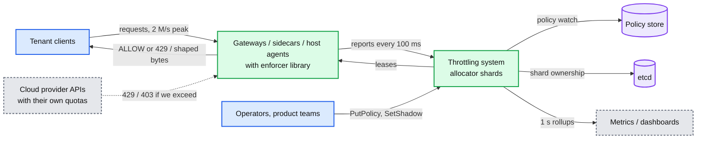

## D2. Data flow (DFD)

What flows, how big, how often. Peak numbers for one region.

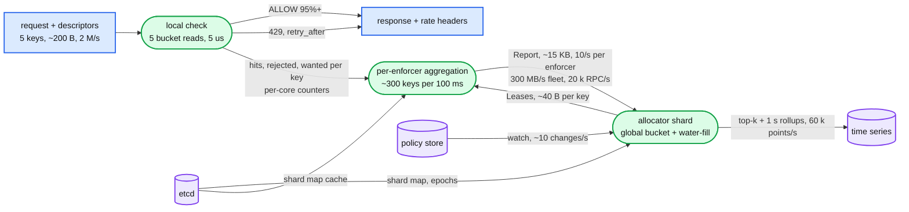

## D3. Component architecture

Embedded in [`solution.md` §6](solution.md#6-final-design). Not repeated here.

## D4. Sequence, happy path, one per FR

- D4a admit or reject: [`solution.md` §4.1](solution.md#41-admit-or-reject-against-every-limit-in-the-hierarchy).
- D4b policy change: [`solution.md` §4.2](solution.md#42-limits-are-policy-hot-reloaded-within-seconds).
- D4c fairness among siblings: [`solution.md` §4.3](solution.md#43-work-conserving-and-fair-across-the-hierarchy).
- D4d observability and shadow mode, below.

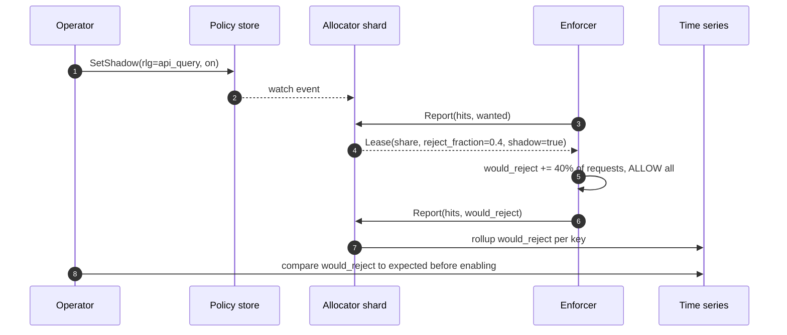

## D5. Sequence, failure paths

- D5a allocator owner dies: [`solution.md` §5.4](solution.md#54-the-node-that-owns-the-biggest-tenants-counters-dies-what-is-lost-and-can-two-nodes-own-it).
- D5b second-by-second failover: [`solution.md` §10.4](solution.md#104-failure-timeline).
- D5c a stale owner after a partition, below.
- D5d 10x burst in the first 100 ms, below.

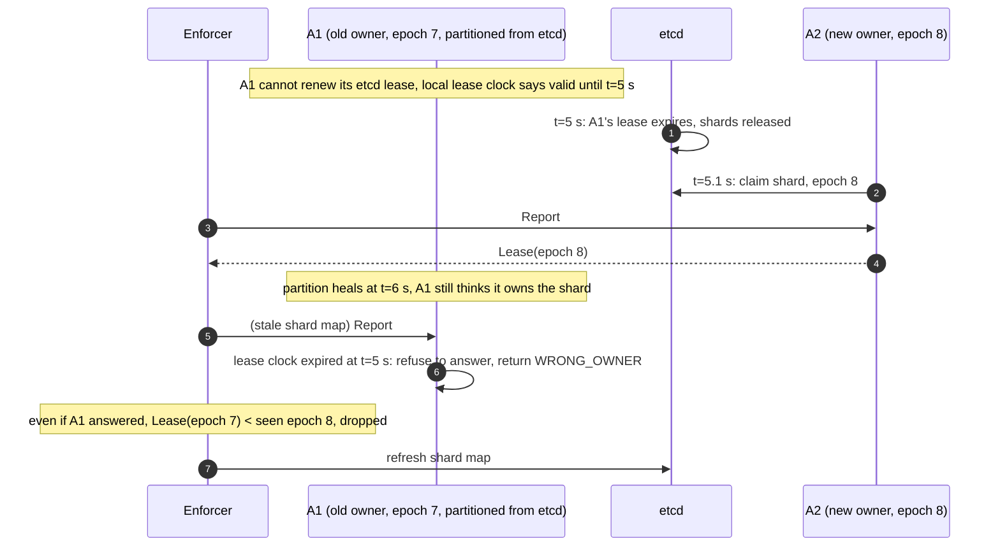

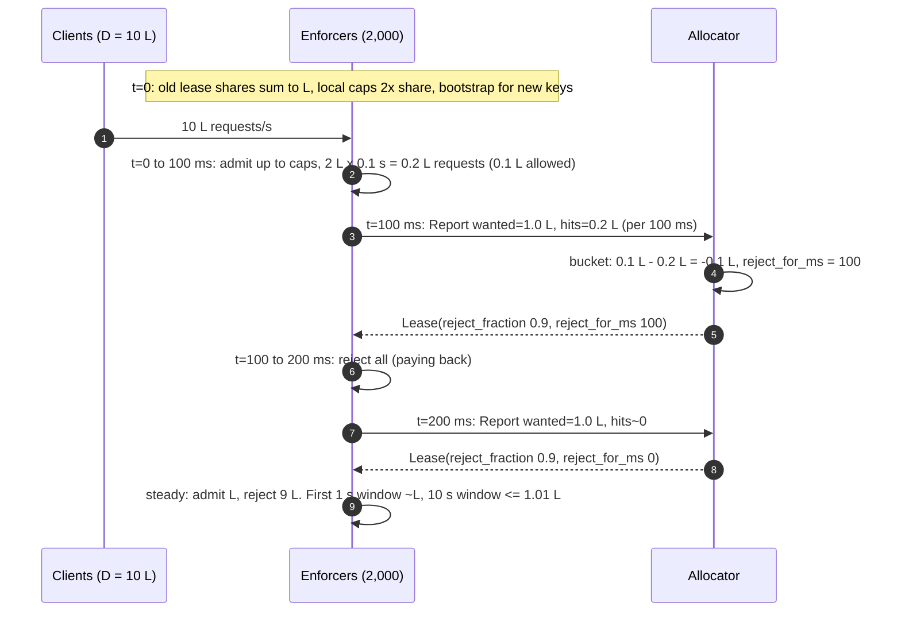

## D6. Activity / decision flow

The hardest decision inside the enforcer: what to do with a key on each request given its lease state.

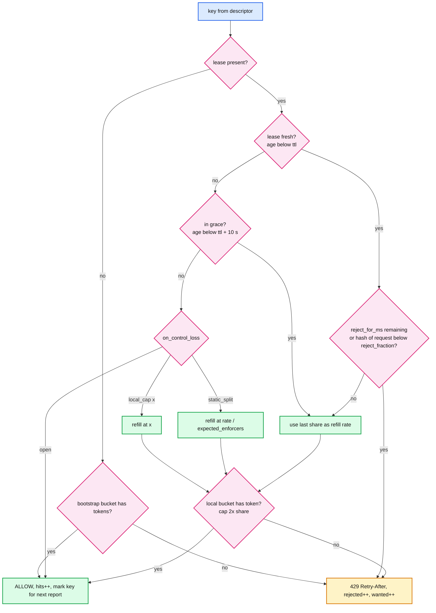

## D7. Entity relationship

Embedded in [`solution.md` §3.3](solution.md#33-data-model). Not repeated here.

## D8. State machine

Lifecycle of a limit key on one enforcer.

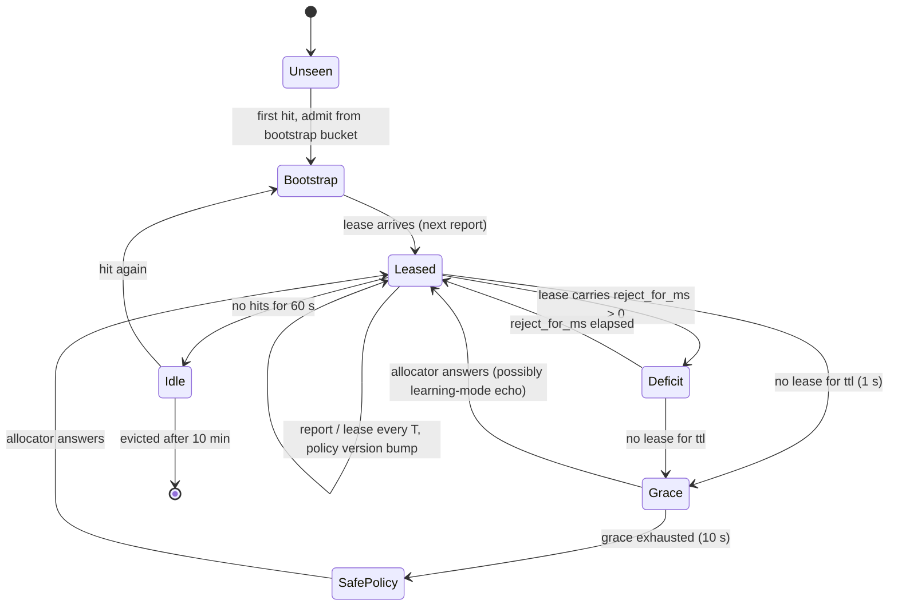

## D9. Deployment / topology

Where each piece runs. One region, three zones.

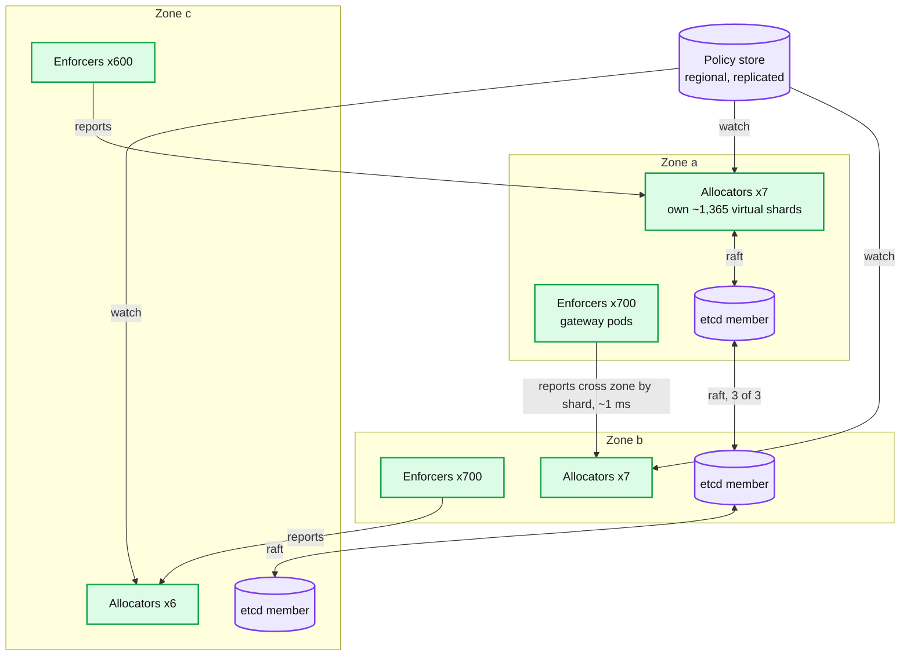

Zone loss: the 1/3 of enforcers there are gone with their traffic (the load balancer moves it). The 1/3 of shards owned there fail over within 5 s. etcd keeps quorum with 2 of 3. Reports cross zones because ownership is by key, not by zone; the ~1 ms cross-zone RTT is fine on a 100 ms loop. Zone-local ownership would be cheaper but would give each zone its own view of one key, which is the `L / N` problem with `N = 3`.

## D10. Scaling / partitioning

Keys are owned by the hash of the tree root. The 30% account is the hot shard; delegated budgets split it.

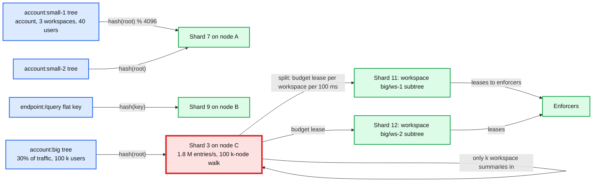

After the split, shard 3 sees `k` workspace-level rows per interval instead of 100 k user rows, and each workspace shard does its own water-fill among users. Cross-workspace fairness is one interval staler. The split is a policy attribute (`delegate_children: true` on the account node) so it can be applied per tenant without redeploys.

## D11. Failure mode map

```mermaid
%% D11: what fails, who feels it, what limits the damage.
flowchart TD
    F1[Enforcer pod dies] -->|"blast: its in-flight requests"| M1[LB reroutes; counters worth one interval lost]
    F2[Allocator node dies] -->|"blast: its shards' keys, 5 to 7 s"| M2[old lease, then grace share; etcd expiry; new owner in learning mode]
    F3[etcd unavailable] -->|"blast: no ownership changes"| M3[owners serve until local lease clock expires, then step down; fleet goes to safe policy; page]
    F4[Policy store unavailable] -->|"blast: no policy changes"| M4[allocators keep last policy; leases keep flowing]
    F5[Bad policy pushed] -->|"blast: one tenant, fleet-wide, 200 ms"| M5[validation, shadow default for new nodes, one-command rollback]
    F6[Network partition, enforcers vs allocators] -->|"blast: partitioned enforcers"| M6[grace 10 s, then per-RLG safe policy]
    F7[Hot account shard at 100% CPU] -->|"blast: that account's leases go stale"| M7[delegate_children, report suppression, alert at 60%]
    F8[Clock jump on a pod] -->|"blast: none"| M8[monotonic clocks, durations in leases]
    F9[Report storm from a buggy enforcer] -->|"blast: one allocator's CPU"| M9[per-enforcer report rate limit 100/s, mTLS identity]

    class F1,F2,F3,F4,F6,F8,F9 client
    class F5,F7 critical
    class M1,M2,M3,M4,M5,M6,M7,M8,M9 service

    classDef client   fill:#dbeafe,stroke:#2563eb,stroke-width:2px,color:#111
    classDef service  fill:#dcfce7,stroke:#16a34a,stroke-width:2px,color:#111
    classDef critical fill:#fee2e2,stroke:#dc2626,stroke-width:4px,color:#111
```

## D12. Rollout / migration

From "Envoy → rate limit service → Redis" to this design. Each phase has a rollback that is a flag flip because both paths see every request.

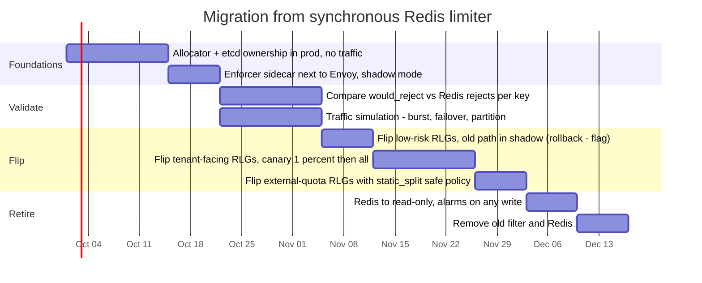

Rollback points: end of each phase. Before `d2`, rollback is a flag on the Envoy filter chain (which path enforces, which shadows). After `d2`, rollback means redeploying the old filter, which is why Redis stays read-only for a week first.
