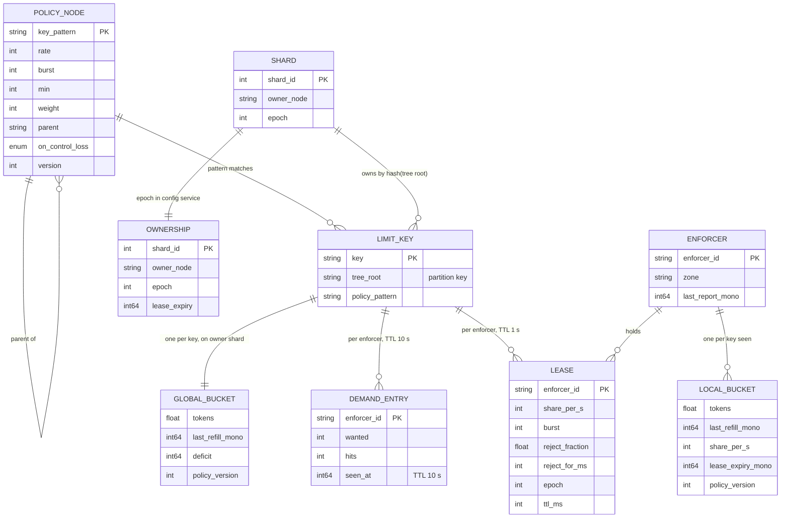
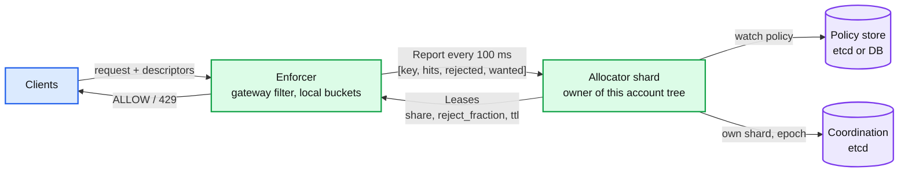
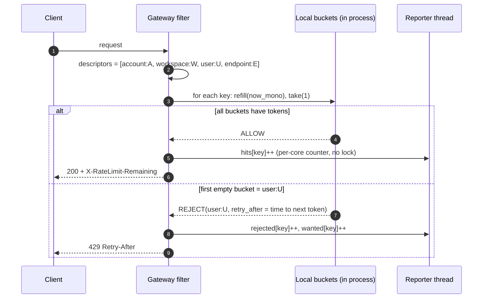
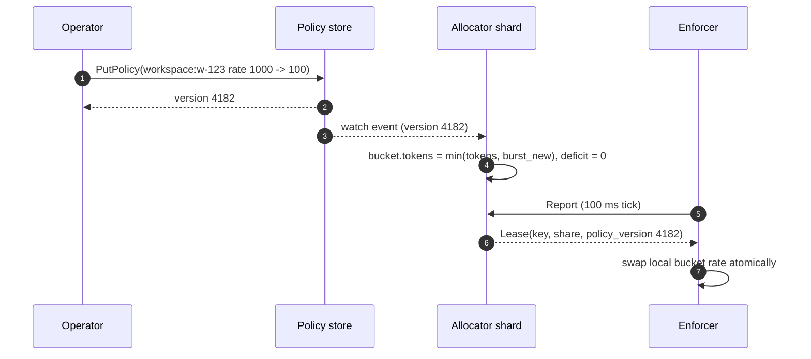
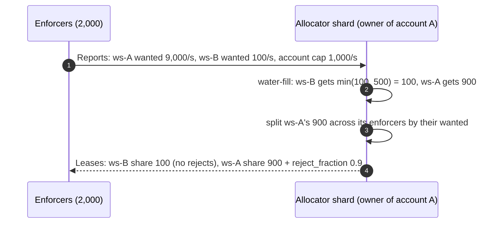
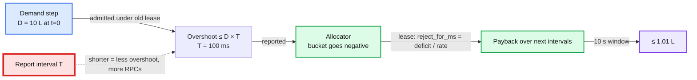
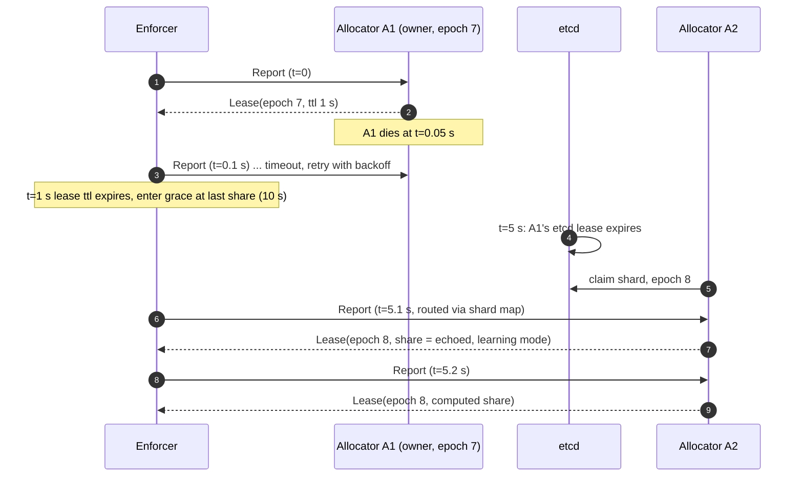
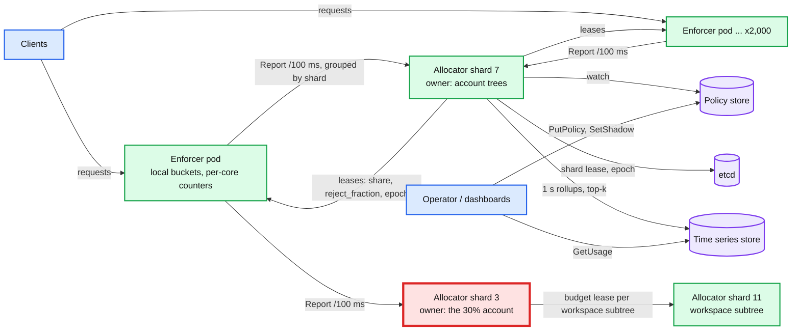
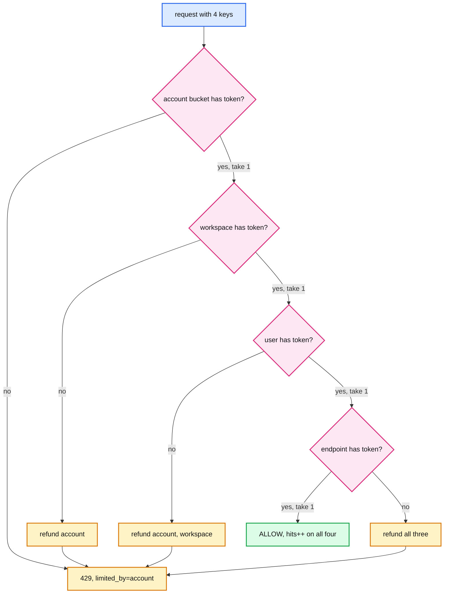
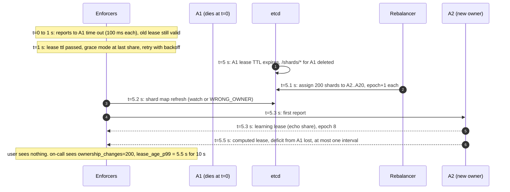

# HLD: Datacenter network throttling / hierarchical rate limiting

> One-line answer: every enforcer (gateway pod, sidecar, or host agent) admits traffic against local token buckets with no remote call, and every 100 ms it sends one batched report of hits per limit key to the allocator shard that owns that key's tree; the allocator runs one global token bucket per key, computes weighted max-min shares down the hierarchy, and replies with a per-enforcer lease (`share`, `reject_fraction`, `reject_for_ms`, `policy_version`). Correctness is "at most about 5% over the limit in any 1 s window, deficits repaid"; availability is "the allocator can die and traffic keeps flowing under the last lease, then under a per-limit safe policy".

Sources this follows: the Databricks engineering blog on their rate limiter rebuild (batch reporting, Dicer autosharding, token bucket, about 5% tolerated overage), Google BwE (SIGCOMM 2015) for the hierarchy and host enforcement, YouTube Doorman for leases, safe capacity and learning mode, the UCSD distributed rate limiting paper (SIGCOMM 2007) for the accuracy vs responsiveness bound, Stripe and Envoy for fail-open policy, Linux `tc-htb` for rate / ceil / borrow semantics. Raw notes with links in [`research/`](research/). Diagrams D1 to D12 are in [`diagrams.md`](diagrams.md).

---

## 1. Understanding the problem

Interviewer's framing (Databricks, per candidate reports and their own blog): "Design a rate limiter for millions of requests per second across a fleet, with limits per account, workspace, user and endpoint. What happens when a client sends 10x its limit in the first 100 ms of a window? What happens when the node holding the counters dies?" The bandwidth version (Google, "throttle traffic between datacenters") is the same system with bytes instead of requests and a host agent instead of a gateway filter. The signal they grade is not the token bucket. It is: where the decision is made, how far it may be wrong, and what happens on every failure.

### 1.1 Functional requirements

Core:
1. **Admit or reject each request against every limit in its hierarchy.** A request carries descriptors `[account:A, workspace:W, user:U, endpoint:E]`. Each descriptor maps to a limit key. All must have tokens. Reject is HTTP 429 with `Retry-After` (or delay-then-drop for bytes).
2. **Limits are policy, hot-reloaded.** Per tree node: `rate`, `burst`, `min` (guaranteed floor), `weight` (share of parent), and `on_control_loss` (safe policy). A change reaches every enforcer within seconds.
3. **Work conserving and fair.** A parent's cap is split among children by weighted max-min. A child that does not use its share lends it to siblings. A child with demand is never pushed below `min`.
4. **Observability and shadow mode.** Per-key usage and rejections, `X-RateLimit-Remaining` style headers, and a shadow mode that counts would-be rejections without rejecting.

Below the line (say it out loud):
- Billing-grade metering. This limiter tolerates about 5% overshoot per second. Metering is an exact, separate pipeline.
- Per-flow congestion control, DDoS scrubbing, WAF. Section 10.11 and [`deep-dives/bandwidth-throttling-variant.md`](deep-dives/bandwidth-throttling-variant.md) say what the network does for us.
- Quota purchase and approval workflows. We read policy.
- Cross-region global caps. One allocator tree per region; cross-region is the 10x evolution.

### 1.2 Non-functional requirements

Ask for scale first. Numbers assumed for one region:

| Dimension | Core target | Below the line |
|---|---|---|
| Scale | 2 M req/s peak, 200 k avg. 2,000 enforcers. 10 M live keys. 5 descriptors per request, so **10 M checks/s** | 20 M req/s (§10.11) |
| Hot-path latency | **p99 < 50 us, no remote call per request** | |
| Accuracy | **≤ 5% over the limit in any 1 s window, ≤ 1% over 10 s, deficits repaid** | exact metering |
| Fairness | Weighted max-min among siblings within one 100 ms control interval | multi-resource (DRF) |
| Availability | Data path 99.99%. Allocator 99.9%, and **its loss never stops traffic** | |
| Consistency | Counters eventual (100 ms). Policy version strong per key within 1 s | |
| Control cost | Grows with enforcers × active keys, **not** with request rate | |
| Bandwidth variant | 50 k hosts, 1 M flow groups, loop 1 to 5 s, enforcement within 100 ms of a new allocation | |

The accuracy row and the latency row fight. A perfectly accurate global limit needs one serialized counter per key, which means a remote call per check. The whole design is about how much accuracy to give up to remove that call, and how to bound what we gave up.

---

## 2. Back-of-envelope

```
Checks            = 2 M req/s x 5 descriptors = 10 M checks/s peak, 1 M avg
Per enforcer      = 10 M / 2,000 = 5 k checks/s. A token bucket check is ~100 ns (one cache line, one CAS).
                    5 k x 100 ns = 0.05% of one core. Local enforcement is free.

Synchronous central (the "Bad" design, for the numbers):
  Remote ops      = 10 M ops/s. Redis does ~100 k to 200 k ops/s per instance unpipelined
                    (1 M+ only with pipelining, which a per-request check cannot use).
                    -> 50 to 100 Redis shards just for the checks, plus replicas.
  Latency         = 5 sequential or parallel round trips per request; in-DC RTT 0.2 to 1 ms,
                    but Databricks measured p99 network latency 10 to 20 ms on some clouds.
                    A 20 ms p99 on a 50 ms API is a 40% latency tax.

Batch reporting (the chosen design):
  Distinct keys per enforcer per 100 ms  <= hits per 100 ms = 5 k x 0.1 = 500, typically ~300
  Report            = 300 entries x ~48 B (key hash 16, hits 4, rejected 4, demand 4, lease id 8, pad) = ~15 KB
  Per enforcer      = 10 reports/s x 15 KB = 150 KB/s
  Fleet             = 2,000 x 150 KB/s = 300 MB/s = 2.4 Gbps into the allocator tier at peak. 20 k RPCs/s.
                      vs 10 M RPCs/s synchronous: 500x fewer RPCs. Bytes are similar, RPCs are what cost.
  Entry updates     = 2,000 x 300 x 10 = 6 M entry updates/s fleet-wide, in memory.
  Allocator nodes   = 20 -> 300 k entry updates/s and 1 k RPCs/s per node. ~10% of one core. Headroom 10x.

Allocator state:
  Per key           = global bucket (tokens f64, last_refill u64, deficit i64) + policy ptr + demand map
                      = ~120 B cold, plus 24 B per enforcer that reported the key in the last 10 s
  Cold keys         = 10 M x 120 B = 1.2 GB fleet-wide, 60 MB per node
  Hot keys          = a key hit from all 2,000 enforcers = 2,000 x 24 B = 48 KB. 10 k such keys = 480 MB fleet-wide. Fits.

Overshoot (why 100 ms):
  Between two reports an enforcer admits on its last lease. If demand D suddenly exceeds the limit L,
  the fleet lets through at most min(D, sum of local caps) x T before the next lease, T = report interval.
  Without local caps: D = 10 L, T = 100 ms -> one extra second's worth in the first 100 ms. Unacceptable.
  With the per-enforcer cap of 2 x share (sum = 2 L): at most 2 L x T = 200 requests in the first 100 ms
  against 100 allowed. Extra = 100 = 10% of one second's budget, once.
  The allocator records the deficit (-100) and the next lease repays it (reject_for_ms 100), so the
  1 s window is ~1.0 L, the 10 s window <= 1.01 L, steady state is L. Cold keys with no lease anywhere
  are bounded by N x bootstrap instead; bootstrap shrinks with active_enforcers for that reason.

Enforcer memory:
  Live keys per enforcer  = keys seen in last 60 s, ~20 k. x 96 B (local bucket, lease, policy version) = 2 MB. Nothing.

Bandwidth variant:
  50 k hosts x 20 flow groups = 1 M leaves. Report every 1 s, 32 B each -> 32 MB/s fleet-wide.
  Host enforcement: HTB classes on the host, tens of thousands of packets/s per class, kernel does it.
```

Implications:
- The hot path must not leave the process. Ten million remote checks per second is a Redis fleet and a latency tax for a property (exactness) the product does not need.
- The report interval is the one knob that trades accuracy for control-plane load. 100 ms is the default; hot keys can go to 20 ms, cold keys to 1 s.
- Allocator state is soft. It can be rebuilt from two report intervals. That is what makes allocator failover cheap.

---

## 3. The set-up

Product-style: a platform API used by gateway filters and host agents.

### 3.1 Core entities

- **Limit key**: `rlg:dimension:value`, for example `api_query:workspace:w-123`. A RateLimitGroup (RLG) names what is protected; a dimension names the level. A request yields one key per descriptor.
- **Policy node**: `(key_pattern, rate, burst, min, weight, parent, on_control_loss, version)`. Policy nodes form a tree per account: `account → workspace → user`. `endpoint` keys are a second, flat tree.
- **Enforcer**: a process that sees traffic and holds local buckets. Gateway pod, sidecar, or host agent. Identified by `enforcer_id`, reports every `T` ms.
- **Allocator shard**: owns all keys whose tree root hashes to it. Holds the global bucket per key, the demand map per key, and computes leases.
- **Report**: `(enforcer_id, epoch_seen, [key, hits, rejected, wanted])` for keys hit in the last interval. `wanted` = hits + local rejections = demand.
- **Lease**: `(key, share_per_s, burst, reject_fraction, reject_for_ms, policy_version, allocator_epoch, ttl_ms)`. The enforcer's permission until `ttl_ms` passes.
- **Ownership record**: `(shard_id, owner_node, epoch)` in the coordination service. Epoch increments on every owner change.

### 3.2 API

| Call | Direction | Semantics |
|---|---|---|
| `check(descriptors[]) -> ALLOW / REJECT(retry_after_ms, limited_by_key)` | request path, in process | Local only. Consults local bucket per key. Never blocks on network |
| `Report(enforcer_id, entries[]) -> Leases[]` | enforcer → allocator, every 100 ms | One RPC per allocator shard the enforcer has keys on. Response carries leases for the same keys |
| `PutPolicy(tree) -> version` | admin → policy store | Validated (child rates ≤ parent, mins ≤ rate), versioned, written to the config store |
| `WatchPolicy(since_version)` | allocator → policy store | Streamed changes |
| `GetUsage(key, window)` | dashboards → allocator | Current demand, share, rejections, per enforcer |
| `SetShadow(rlg, on)` | admin | Count instead of reject |

Response headers on the request path: `X-RateLimit-Limit`, `X-RateLimit-Remaining` (local share estimate), `Retry-After` (from `reject_for_ms`).

### 3.3 Data model



Access patterns:
- `check`: hash each descriptor to a local bucket, refill by elapsed monotonic time, take one token from each, or reject on the first empty one. O(descriptors), no allocation.
- `Report`: for each entry, update the demand map, drain the global bucket by `hits`, compute the new share for that enforcer, emit a lease. O(entries) per shard, plus one tree walk per changed parent.
- Failover: new owner reads policy from the config store, receives the next round of reports, rebuilds demand maps. No counter is read from disk because none is written.

Partition key: **hash of the tree root** (the account id), with a hash tag so `account`, its `workspace` and `user` keys land on one shard. Chosen because fairness needs parent and children in one place. Flat `endpoint` keys hash on their own value. A single huge account is the hot shard; §5.5 splits it.

---

## 4. High-level design

### 4.1 Admit or reject against every limit in the hierarchy

**Bad: one shared counter store, one round trip per descriptor.**
- Approach: Envoy rate limit filter → rate limit service → Redis `INCR` with expiry per key, fixed window. This is what Databricks ran in 2022 and what most candidates draw.
- Why it breaks: 10 M ops/s needs 50 to 100 Redis instances; every request pays up to 5 round trips; p99 of 10 to 20 ms on some clouds, measured. One Redis is a SPOF, and a Redis Cluster is not much better because a failover loses counters. Fixed windows admit 2x at the boundary. Adding gateways adds load on Redis linearly.

**Good: local token bucket per enforcer with a static split, plus a global backstop.**
- Approach: each enforcer gets `L / N` for a key with limit `L` and `N` enforcers. Envoy's local rate limit filter is exactly this. Optionally a global check only on the local reject.
- Cost: a key with `L = 100` across `N = 2,000` gives each enforcer 0.05 req/s, which rejects everything. Traffic is not uniform per enforcer (sticky sessions, zone-local routing). Any real limit under `N × 10` req/s is unusable. This works for fleet-protection limits in the millions and fails for per-user limits in the hundreds, which are most of the policy.

**Great: local enforcement, batched reporting, demand-driven leases.**
- Approach: the enforcer keeps a local bucket per key seen. Its refill rate is the `share_per_s` in its current lease. On the first hit of a key with no lease it admits optimistically up to a small bootstrap bucket (`min(burst, rate × T)`, so at most one interval's worth), and includes the key in the next report. Every `T = 100 ms` it sends `[key, hits, rejected, wanted]` for keys touched in the interval, grouped by owner shard into one RPC per shard. The allocator drains the global bucket by the sum of `hits`, computes each enforcer's share in proportion to its `wanted`, and returns a lease. If the global bucket went negative, the lease also carries `reject_fraction` and `reject_for_ms` to pay the deficit back. The enforcer applies the lease atomically per key.
- Challenges: at most `D × T` extra traffic in the interval after a demand step ([`deep-dives/accuracy-and-overshoot.md`](deep-dives/accuracy-and-overshoot.md)); the allocator is a stateful shard that must have exactly one owner (§5.4); hot keys need a shorter `T` (§5.2). Also fairness among siblings is not yet solved. That is §4.3.





### 4.2 Limits are policy, hot-reloaded within seconds

**Bad: limits in the enforcer's config file.**
- Approach: YAML per gateway, redeploy to change.
- Why it breaks: 2,000 pods, a rollout takes 30 minutes, and an on-call cannot cut a noisy tenant's limit during an incident. Also no single source of truth: enforcers drift.

**Good: policy in a config store, every enforcer watches it.**
- Approach: etcd or a DB with a change feed; each enforcer keeps a full policy copy.
- Cost: 2,000 watchers on a 10 M-node policy tree is 2,000 full copies and a fan-out storm on every change. Enforcers also need the tree structure, which they do not otherwise use.

**Great: the allocator watches policy; leases carry the policy version.**
- Approach: only the 20 allocator nodes watch the policy store. A lease includes `policy_version`, `rate`, `burst`, so the enforcer learns a limit the first time it gets a lease for the key and learns changes on the next report. Enforcers hold no policy of their own except the safe policy per RLG, which is small and changes rarely.
- Challenges: a change takes effect within one report interval after the allocator sees it, so about 200 ms end to end, plus etcd watch latency. A lowered limit must not create a phantom deficit: the allocator resets the global bucket to `min(tokens, new_burst)` and clears the deficit on a version change (§10.5). Validation lives in `PutPolicy`: child rate ≤ parent rate, sum of `min` ≤ parent rate.



### 4.3 Work conserving and fair across the hierarchy

**Bad: each key is independent; the parent is just another key.**
- Approach: check `account`, `workspace`, `user` buckets with AND semantics and nothing else.
- Why it breaks: the parent cap is respected, but first come first served. Workspace A sending 10x floods the account bucket, and workspace B's single request is rejected by the account key even though B is far under its own limit. That is the noisy-neighbor complaint in one sentence.

**Good: static sub-caps for children.**
- Approach: give each workspace a fixed slice of the account cap, sum ≤ account.
- Cost: not work conserving. An account with 10 workspaces and one active one gets 10% of what it paid for. Operators end up hand-tuning slices, which is the thing policy should do for them.

**Great: weighted max-min on the tree, computed on the allocator, enforced as per-key shares.**
- Approach: because the whole account tree lives on one shard, the allocator has every child's `wanted` every 100 ms. When a parent's demand exceeds its rate it runs water-filling: each child gets `min(wanted, fair share)` where fair share is the parent's rate split by weight among unsatisfied children, leftovers redistributed, and no child below `min` while it has demand. The result is a per-child effective rate for this interval, which is then split per enforcer by that child's per-enforcer demand. The enforcer still only sees per-key shares. This is exactly HTB's `rate` (our `min`), `ceil` (our `rate`) and borrowing, computed centrally once per interval instead of per packet. Full algorithm and a worked example in [`deep-dives/hierarchical-fair-allocation.md`](deep-dives/hierarchical-fair-allocation.md).
- Challenges: fairness is as fresh as the interval. A child that was idle gets its `min` immediately (its bootstrap bucket) and its fair share one interval later. Tree depth is bounded (3 to 4 levels) so the walk is O(children) per changed parent. A very wide tree (an account with 100 k users) makes the walk 100 k per interval; §5.5 covers it.



### 4.4 Observability and shadow mode

**Bad: log every rejection.**
- Why it breaks: at 10x overload that is 18 M log lines/s. The logging pipeline becomes the next outage.

**Good: counters per key on the enforcer, scraped.**
- Cost: 20 k keys × 2,000 enforcers is 40 M series. Cardinality kills the metrics store.

**Great: the allocator already has fleet-wide per-key numbers every 100 ms.**
- Approach: the allocator is the aggregation point. It exposes per-key `wanted`, `admitted`, `rejected`, `share` as metrics with a top-k filter (the 1,000 hottest keys plus any key in reject state), and writes a 1 s rollup of every key to a time series store for dashboards. Enforcers expose only per-RLG totals. Shadow mode is a policy flag: the allocator computes `reject_fraction` as usual and the lease carries `shadow=true`, so the enforcer counts `would_reject` instead of rejecting. Databricks and Envoy's ratelimit both ship this as the rollout tool.
- Challenges: the allocator's view is 100 ms stale and misses local optimistic admits before the first lease. Fine for dashboards, not for billing, which we already put below the line.

---

## 5. Deep dives

### 5.1 "How do you keep the check under 50 us with no remote call, and how wrong can it be?"

Walk the request path: parse descriptors (1 us), hash 5 keys (200 ns), 5 bucket checks (500 ns), increment per-core hit counters (50 ns). Total under 5 us. The only thing that could make it slow is a lock on the bucket table or a blocking report.

**Bad: check the allocator on every local reject** ("local first, global on miss").
- Why it breaks: under overload every request is a local reject, so the "rare" remote call becomes 10 M/s exactly when the system is least able to afford it. It is the same as the synchronous design with extra steps.

**Good: local buckets, report every 100 ms, apply leases.**
- Cost: the overshoot bound `min(D, Σ caps) × T`. Without local caps and with `T = 100 ms`, a 10x step lets one second's worth through in the first 100 ms. Push back on the textbook answer: a candidate who promises "exactly 1,000/s, never more" is promising a serialized global counter, which is the design we just rejected. State the bound instead, and make it a policy parameter.

**Great: the same, with deficit carry-forward, adaptive interval, and a per-enforcer cap.**
- Deficit carry-forward: the global bucket is allowed to go negative. A negative balance becomes `reject_for_ms = -tokens / rate` in the next lease. The overshoot is paid back in the following intervals, which is what makes the 10 s number ≤ 1.01 L. Databricks' "token bucket remembers across intervals" is this.
- Adaptive interval: a key whose global bucket is under 20% full or in deficit is reported every 20 ms by the enforcers that hold it (the lease says so). Cold keys report every 1 s. Control traffic follows pressure, not request rate.
- Per-enforcer cap: no single enforcer may admit more than `bootstrap` for a key it has no lease for, and no more than `2 × share` per second for a key it has a lease for. So a coordinated 10x burst on a leased key is bounded by `2 L × T` = 10% of one second's budget, once, and a burst at one enforcer by `2 × share`. The cold-key worst case is `N × bootstrap`.
- Math and the 10x case in [`deep-dives/accuracy-and-overshoot.md`](deep-dives/accuracy-and-overshoot.md).



### 5.2 "Two thousand enforcers share a limit of 100 req/s. How does the share get split?"

**Bad: `L / N`.** 0.05 req/s per enforcer. Dead on arrival, as §4.1 showed.

**Good: split by last interval's demand.** Enforcer `i` gets `L × wanted_i / Σ wanted`. Correct when demand is steady. Cost: an enforcer that had zero demand last interval gets zero share, so the first request at a new enforcer is always rejected, and traffic that moves between enforcers (load balancer reshuffle, deploy) sees a wave of rejections every interval.

**Great: demand split plus a bootstrap allowance and a share floor.**
- Every enforcer may admit up to `bootstrap = min(burst, rate × T)` tokens for a key it has no lease for. That covers the first request and the first interval.
- Leases carry a floor: `share_i = max(L × wanted_i / Σ wanted, L / (10 × active_enforcers))`, so that an enforcer with a trickle keeps a trickle. The allocator subtracts floors from the pool before splitting the rest by demand, so the sum still equals `L`.
- The allocator also counts `active_enforcers` per key (reported in the last 10 s), which lets it size `bootstrap` down for very hot keys: `bootstrap = min(burst, rate × T, rate / active_enforcers × 4)`.
- Doorman does the same with `PROPORTIONAL_SHARE` and a lease; Google BwE does it with per-task demand under a job's allocation. Details in [`deep-dives/allocator-and-control-loop.md`](deep-dives/allocator-and-control-loop.md).

### 5.3 "The allocator is down. Fail open or fail closed?"

**Bad: pick one for the whole system.** "Fail open, availability first" is right for protecting our own API and wrong for staying under a cloud provider's API quota, where going over gets the whole account throttled by someone we cannot negotiate with. "Fail closed" is right for the quota and an outage for everything else.

**Good: per RLG safe policy, Doorman-style.** Each policy node has `on_control_loss`: `open` (no limit), `local_cap(x)` (each enforcer caps at `x`), or `static_split` (each enforcer gets `rate / expected_enforcers`). Default `local_cap(rate)`: no single enforcer can exceed the whole limit, the fleet can. Cost: a config decision per RLG that people get wrong.

**Great: leases first, then the safe policy, with a decay and a loud signal.**
- Timeline: an enforcer misses a report response. It keeps using its last lease until `ttl_ms` (1 s). It then extends the lease at the last share for a grace period (10 s) while retrying the allocator every interval with backoff. After the grace period it switches to `on_control_loss`. Traffic never stops on the way down, and never bursts on the way up: when the allocator returns, it is in learning mode (§5.4) and echoes the enforcers' current shares for one interval before recomputing.
- Envoy's `failure_mode_deny=false` and Stripe's "every limiter wrapped in a fail-open exception handler" are the "open" case; Doorman's safe capacity is the general form. The full matrix per layer is in [`deep-dives/failure-modes-and-fail-policy.md`](deep-dives/failure-modes-and-fail-policy.md).
- Push back on the textbook answer: "fail open" for a limiter whose purpose is fleet protection means that the outage of the limiter and a traffic spike together take down the backend. So fleet-protection RLGs use `local_cap(rate / expected_enforcers × 4)`, not `open`.

### 5.4 "The node that owns the biggest tenant's counters dies. What is lost, and can two nodes own it?"

**Bad: allocators are stateless behind a load balancer.** Reports for the same key land on different nodes; no node knows the global demand; the limit is enforced per node, which is the `L / N` problem again with `N` = allocator count.

**Good: consistent hashing of keys to allocators, no coordination.** Works until a node is added or dies: for a few seconds two nodes may believe they own a key and both hand out full shares, so the limit is briefly 2x. Cost: a silent, unbounded double-allocation window on every membership change.

**Great: explicit ownership with epochs in etcd, soft state, learning mode.**
- Ownership: 4,096 virtual shards, each with `(owner, epoch)` in etcd under a 5 s lease held by the owner. A node that loses its etcd lease stops answering reports for that shard immediately (it checks lease validity before each response). A new owner bumps the epoch. Leases to enforcers carry the epoch; an enforcer ignores a lease with an epoch lower than one it has seen for that shard. Two owners cannot both be believed.
- Soft state: nothing about buckets is on disk. The new owner loads policy, then for one learning interval (200 ms) it echoes each enforcer's reported current share back as its lease and uses the reports to rebuild the demand map. From the second interval it computes normally. The deficit of the dead node is lost, so the tenant may get up to one interval of extra traffic. That is inside the 5% budget and we say so.
- What the on-call sees: `allocator_ownership_changes` spikes; `lease_age_p99` climbs to 5 to 7 s (etcd lease expiry plus one interval); rejections for that tenant dip for one second. Full timeline in §10.4.



### 5.5 "One account is 30% of all traffic. Show the hot shard and split it."

- Where it hurts: one allocator node handles 30% of 6 M entry updates/s = 1.8 M/s, plus a tree walk over that account's 100 k users every 100 ms. The node is at 100% CPU while the other 19 idle. This is the one **red** node in the final design.
- Fix 1, cheaper reports: enforcers pre-aggregate per key, which they already do; add per-key report suppression for keys far under limit (report every 1 s instead of 100 ms). Cuts hot-account entries by ~5x.
- Fix 2, split the tree with delegated budgets (BwE's cluster enforcer, HTB's borrowing): the account root stays on one shard; each workspace subtree moves to its own shard. The root shard hands each workspace shard a **budget lease** every interval (its water-filled share of the account cap). The workspace shard then splits its budget among its users and enforcers locally. The root sees `k` workspace summaries per interval instead of 100 k user entries. Fairness across workspaces is one interval staler; fairness within a workspace is unchanged.
- Fix 3, shorten the walk: the water-fill only re-runs for parents whose demand crossed their rate; unchanged subtrees keep last interval's shares.
- Diagram D10 in [`diagrams.md`](diagrams.md).

### 5.6 "Now it is bytes between datacenters. What changes?"

- Enforcer: a host agent that programs `tc` HTB classes (one class per flow group, `rate` = min, `ceil` = allocated share) or sets per-socket pacing (`SO_MAX_PACING_RATE`, EDT). The kernel does the per-packet work; the agent updates rates when a lease arrives.
- Loop: 1 s reports instead of 100 ms, because bandwidth demand changes slower and TCP needs a few RTTs to react. Google BwE reports host to job every 5 s, job to cluster every 10 s, cluster to global every 15 s, runs the allocation every 4 to 10 s, and converges in tens of seconds; we can afford a faster loop because our tree is shallower.
- Reject means delay: HTB shapes, it does not drop first; TCP senders slow down. A hard drop is the last resort. That makes the overshoot bound softer (queues absorb) and the fairness better (TCP itself is flow-fair inside a class).
- Hierarchy is deeper: datacenter pair → tenant → job → task → flow group. Delegated budgets (§5.5 fix 2) are the default, not the exception: a cluster-level allocator per datacenter, a global one across pairs.
- Safe policy: keep the last allocation, then decay to a configured floor over 30 s. BwE keeps last known state for several minutes, then removes allocations and relies on QoS plus TCP, except for copy traffic, which gets a low static allocation. Never fail fully open on a WAN link: unbounded egress is the failure the system exists to prevent.
- Full treatment in [`deep-dives/bandwidth-throttling-variant.md`](deep-dives/bandwidth-throttling-variant.md).

---

## 6. Final design



Zoom-ins: D9 deployment, D10 partitioning, D11 failure map in [`diagrams.md`](diagrams.md).

---

## 7. Trade-offs

| Decision | Option A | Option B | Chose | Why |
|---|---|---|---|---|
| Where the decision is made | Remote counter per check | Local bucket, periodic sync | B | 10 M remote ops/s and a 10 to 20 ms p99 tax for exactness nobody needs. Cost: bounded overshoot `D × T` |
| Sync mechanism | Gossip between enforcers (DRL) | Report to an owner shard | B | Gossip is O(N × branching) per interval and gives no place to compute the tree. Cost: an owner to fail over |
| Algorithm | Fixed or sliding window | Token bucket with deficit | B | Bucket remembers across intervals, no boundary 2x, deficit payback gives the 10 s bound |
| Share split | `L / N` | Demand-proportional with floor and bootstrap | B | `L / N` cannot express a 100 req/s limit over 2,000 nodes |
| Fairness | Independent keys, FCFS at parent | Water-filling on the allocator | B | Noisy sibling starves quiet sibling otherwise. Cost: tree and children on one shard |
| Allocator state | Durable counters (Redis, DB) | Soft, rebuilt from reports | B | Failover in one interval with no replication; loses at most one interval of deficit |
| Ownership | Consistent hashing, no coordination | Explicit shard map with epochs in etcd | B | Consistent hashing has a silent double-owner window on every membership change |
| Control loss | One global policy | Per-RLG safe policy with grace | B | "Open" is wrong for external quotas, "closed" is wrong for our own API |
| Report interval | Fixed 100 ms | Adaptive 20 ms to 1 s by pressure | B | Control traffic follows pressure, not request rate |
| Observability | Per-key metrics on enforcers | Aggregate on the allocator, top-k | B | 40 M series otherwise |
| Timestamps in leases | Absolute wall time | Relative durations, monotonic clocks | B | 200 ms clock skew across 2,000 pods would shift every reject window |

What we refused to build: an exact global counter, a durable counter store, cross-region limits, per-flow congestion control, billing metering. Each is named in §10.11 with its seam.

---

## 8. Staff-level notes

- **Failure modes and blast radius.** An enforcer crash loses its local counters, which are worth one interval; nothing else. An allocator crash affects only its shards' keys, for 5 to 7 s, during which those keys run on grace shares. An etcd outage freezes shard ownership changes but not traffic and not reports; existing owners keep serving while their local lease clocks say they may, then step down, and the system degrades to safe policies fleet-wide. The worst case is a **policy bug**: a bad `PutPolicy` that sets a top account to 0 rejects a customer fleet-wide within 200 ms. Mitigation: validation, shadow mode by default for new nodes, and a one-command rollback to the previous version.
- **Migration path.** From "Envoy → rate limit service → Redis": (1) run the new enforcer as a localhost sidecar in shadow mode next to the existing Envoy filter, compare would-reject counts to real rejects per key for two weeks; (2) flip RLGs one at a time to enforce-from-new, keep-old-in-shadow; (3) turn the old filter off. Rollback at any step is a flag flip because both paths see every request. Databricks did exactly this, and also moved the Redis write path to batched Lua scripts as an intermediate step before removing Redis.
- **Operability.** SLO: `check` p99 < 50 us, per-key 1 s overshoot ≤ 5% (measured by the allocator: `admitted_1s / limit`), lease freshness p99 < 500 ms. Pages at 3 am: `enforcers_on_safe_policy > 1%` for 1 min; `shard_without_owner > 0` for 10 s; `overshoot_1s > 1.2` on any key for 30 s (allocator bug or clock bug); `report_rtt_p99 > 50 ms` (allocator overloaded); `policy_version_skew` (some enforcers on an old version for > 10 s). Dashboards: reports/s per allocator, entries/s per shard, top-k keys by rejection, lease age histogram, ownership changes.
- **Cost.** 20 allocator nodes of 8 vCPU: about $5 k/month. The Redis fleet for the synchronous design at 10 M ops/s was 50 to 100 instances plus replicas, roughly $30 to 60 k/month, and it did not scale with gateways. Eng time: enforcer library plus allocator plus ownership is two engineers for two quarters; the fairness walk and delegated budgets a third quarter. Use etcd, do not write consensus.
- **Team boundaries.** The enforcer is a library owned by the gateway / service mesh team, with the report and lease protobufs as the contract. The allocator and policy store are the platform team's service. Policy authoring belongs to product teams through `PutPolicy` with validation. Version the lease message from day one; the enforcer must tolerate unknown fields.

---

## 9. What is expected at each level

- **Mid (80/20 breadth/depth).** Token bucket vs sliding window, a Redis counter per key, 429 with `Retry-After`. Draws gateway → rate limit service → Redis. Does not know the round-trip cost at 10 M checks/s or what happens when Redis is down.
- **Senior (60/40).** Local buckets with periodic sync to a central store, the overshoot that implies, Redis Cluster with hash tags, fail-open with a local cap, per-tenant keys with AND semantics for the hierarchy. Mentions Envoy local plus global limits. May still leave fairness as FCFS at the parent and ownership to consistent hashing.
- **Staff+ (40/60).** All of the above unprompted, plus: the overshoot bound `D × T` stated as a number and made a policy parameter; deficit carry-forward and why it gives the 10 s guarantee; demand-proportional shares with bootstrap and floor, and why `L / N` is dead; water-filling on the owner shard and why the tree must be co-located; explicit ownership epochs versus consistent hashing's double-owner window; per-RLG safe policy versus one global fail-open; soft state and learning mode for failover; the hot account shard and delegated budgets; what changes for bytes (host enforcer, seconds-scale loop, delay not drop); the migration through shadow mode; what was refused (exact counters, durable state) and the seam for each.

---

## 10. Nitty-gritty (past interview scope)

### 10.1 Internals of each chosen technology

**Token bucket, refill on read.** State per key: `tokens: f64`, `last: u64 (monotonic ns)`, `rate`, `burst`. On check: `tokens = min(burst, tokens + (now - last) × rate / 1e9); last = now; if tokens ≥ 1 { tokens -= 1; ALLOW } else { REJECT, retry_after = (1 - tokens) / rate }`. No timers, no background thread, O(1), 32 bytes. GCRA is the same thing expressed as one timestamp (theoretical arrival time) and is what `redis-cell` implements; we use the two-field form because `rate` changes every lease and the TAT form needs a rewrite on rate change. Concurrency: one CAS on a packed `(tokens, last)` 16-byte word, or per-core buckets with `share / cores` each for keys hotter than 1 M/s on one enforcer. Details in [`deep-dives/local-enforcement.md`](deep-dives/local-enforcement.md).

**Hierarchical AND check.** Descriptors are checked in order from the widest (`account`) to the narrowest (`user`, then `endpoint`), because the widest is the most likely to be in deficit under a fleet-wide event and rejecting early avoids taking tokens from narrower buckets that would then have to be refunded. If a narrower bucket rejects after a wider one admitted, the wider bucket's token is refunded (`tokens += 1`) so the count stays exact. Lease `reject_fraction` is applied as a Bernoulli draw before the bucket check, keyed on a per-request hash so retries of the same request get the same answer.

**Global bucket on the allocator.** Same 32 bytes plus `deficit`. On a report: `refill; tokens -= Σ hits; if tokens < 0 { deficit = -tokens; reject_for_ms = deficit × 1000 / rate }`. Shares: `pool = rate - Σ floors; share_i = floor_i + pool × wanted_i / Σ wanted`. `reject_fraction = max(0, 1 - rate / Σ wanted)` when in deficit, else 0. This is the Databricks response shape (`rejectionRate = (estimatedQps - policy) / estimatedQps`, plus `rejectTilTimestamp`), with the timestamp replaced by a duration.

**Water-filling on the tree.** For a parent with rate `R`, children `c` with `wanted_c`, `weight_w_c`, `min_c`: give every child with demand `min(wanted_c, min_c)`; remaining pool `R - Σ given`; repeat: fair share per unit weight `= pool / Σ weight of unsatisfied children`; each unsatisfied child gets `min(wanted_c - given_c, weight_c × unit)`; children that hit `wanted_c` become satisfied; until pool is 0 or all satisfied. O(k log k) with sorting by `wanted / weight`, O(k) per round otherwise. Worked example in [`deep-dives/hierarchical-fair-allocation.md`](deep-dives/hierarchical-fair-allocation.md).

**etcd for ownership.** Each allocator node holds one etcd lease (TTL 5 s, keepalive every 1.5 s). Shard keys `/shards/<id>` are written with `owner`, `epoch` under that lease via a transaction `if version(key) == expected then put`. Losing the lease deletes the keys; watchers on `/shards/` see the deletion and a rebalancer (leader-elected, also via etcd) reassigns. Enforcers cache the shard map and refresh on a `WRONG_OWNER(epoch)` reply.

**`tc` HTB (bandwidth variant).** Classful qdisc; each class has `rate` (guaranteed) and `ceil` (may borrow up to this from the parent when siblings are idle); tokens per class with `burst` / `cburst`; `quantum = rate / r2q` (default `r2q = 10`) sets how many bytes a class sends per round when borrowing; `prio` orders who borrows first. Our lease maps to `ceil` per class, `min` to `rate`. Leaf qdisc `fq_codel` for flow fairness inside a class.



### 10.2 Configuration knobs that matter

| Component | Knob | Value | Why |
|---|---|---|---|
| Enforcer | `report_interval` | 100 ms default; 20 ms when a lease says `pressure=high`; 1 s when `pressure=low` | The accuracy vs control-load knob |
| Enforcer | `lease_ttl` / `grace` | 1 s / 10 s | Ride out an allocator failover (5 to 7 s) without touching the safe policy |
| Enforcer | `bootstrap` | `min(burst, rate × T, 4 × rate / active_enforcers)` | First-hit allowance; bounds coordinated bursts |
| Enforcer | `local_cap` | `2 × share` | No single enforcer runs away between leases |
| Allocator | `learning_intervals` | 2 | Echo shares while rebuilding demand after failover |
| Allocator | `demand_ttl` | 10 s | Forget enforcers that stopped reporting a key |
| Allocator | `max_deficit` | `5 × rate` (5 s) | Cap the payback so a lost allocator's stale deficit cannot black-hole a tenant |
| Allocator | `report_suppression_threshold` | 20% of rate | Below this, tell enforcers to report at 1 s |
| etcd | lease TTL / keepalive | 5 s / 1.5 s | Failover detection in ≤ 5 s without flapping on GC pauses |
| Policy | `on_control_loss` default | `local_cap(rate)` | One enforcer alone cannot exceed the limit; fleet can, briefly |
| Policy | `burst` default | `rate × 1 s`, cap 10 s | Token bucket burst = how long a silent client may bank |
| HTB (bytes) | `rate`, `ceil`, `r2q` | `min`, lease share, 10 | Guarantee, borrow limit, quantum sizing |

### 10.3 Capacity math per component

| Component | Unit load | Per node | Limit | Headroom |
|---|---|---|---|---|
| Enforcer check | 5 k checks/s, 5 us each | 2.5% of one core | CPU | 40x |
| Enforcer reporter | 300 entries, 15 KB per 100 ms | 150 KB/s, 10 RPCs/s | network | 1000x |
| Allocator ingest | 300 k entries/s, ~300 ns each | 10% of one core | CPU | 10x |
| Allocator RPC | 1 k reports/s in, 1 k lease batches out | 30 MB/s | network | 30x |
| **Hot account shard** | 1.8 M entries/s + 100 k-node walk per 100 ms | **~100% of a core** | **CPU** | **0x, red** |
| Allocator memory | 500 k keys × 120 B + hot demand maps | 60 MB + 25 MB | RAM | 100x |
| etcd | 20 keepalives per 1.5 s, 4,096 shard keys | trivial | | |
| Policy store watch | ~10 changes/s | trivial | | |
| Time series store | 10 k top-k keys × 6 series per 1 s | 60 k points/s | write | fine |

The hot account shard is the component closest to its limit. §5.5 fixes it with delegated budgets, which turn 1.8 M entries/s into `k` workspace summaries per interval on the root shard.

### 10.4 Failure timeline

**Allocator node dies (owner of 200 shards).**



Data at risk: none durable. Enforcement at risk: for the affected keys, up to 5.5 s at the last share, which is exact if demand was steady and off by `ΔD` if demand moved. New keys on those shards run on `bootstrap` only.

**etcd unavailable for 2 minutes.** Owners keep serving while their local lease clock says the lease is valid (they know the TTL they were granted). At TTL expiry they step down (stop answering) to be safe against a split brain, because they cannot tell whether someone else was granted the shard. Enforcers go to grace, then safe policy at t = 5 + 10 s. Fleet-wide `enforcers_on_safe_policy` pages. When etcd returns, ownership is re-established in one rebalance, learning mode, back to normal within 2 s. Alternative for a longer etcd outage: a manual "freeze ownership" switch that lets current owners continue without a lease. Named as an operator decision, not automatic.

**Traffic 10x on one workspace in 100 ms.** Covered in [`deep-dives/accuracy-and-overshoot.md`](deep-dives/accuracy-and-overshoot.md): t = 0 to 100 ms up to `2 L × T` admitted (200 against 100 allowed at `L = 1,000/s`); t = 100 ms leases with `reject_fraction 0.9`, `reject_for_ms 100`; t = 100 to 200 ms near-zero admits (payback); after that steady at `L`, so the first 1 s window closes at about `L`. Sibling workspaces in the same account: rejected only if the account cap was already tight, and then only down to their water-filled share, never below `min`.

### 10.5 Exactly-once and idempotency end to end

- Duplicates here are double counts, not double effects. Where they enter: a report retried after a timeout whose original was actually applied. Fix: each report carries `(enforcer_id, seq)`; the allocator keeps the last `seq` per enforcer per shard and ignores replays. Lost reports (never applied) under-count by one interval, which is fine and self-correcting because the next report has the next interval's data, not cumulative counts. Reports carry interval deltas, so a lost one is a lost 100 ms, not a permanent skew.
- Lease application is idempotent: the enforcer swaps in the lease if `(epoch, issued_seq)` is newer than the current one, else drops it.
- Client retries of a 429 are the client's problem, but `reject_fraction` uses a hash of the request id so a retry of an already-rejected request is rejected again rather than randomly admitted, which keeps `Retry-After` honest.
- Policy version: a lease with `policy_version` lower than the enforcer's current version for that key is ignored (a slow allocator after failover must not roll a limit back).
- Policy change clears the deficit and clamps tokens to the new burst. A tenant is never charged under a new rate for traffic admitted under the old.

### 10.6 Consistency model per edge

| Edge | Model | Note |
|---|---|---|
| Client → enforcer decision | Local, immediate | Reflects the last lease (≤ 100 ms old) and this enforcer's own history |
| Enforcer → allocator report | At-least-once with dedup by `seq` | Deltas per interval; a lost report is a lost 100 ms of counts |
| Allocator → enforcer lease | Eventual, ≤ 1 interval; monotone by `(epoch, seq)` | A lease is a permission, not a fact |
| Allocator's view of a key | Eventual, 100 ms | Sum of reports; never exact within an interval |
| Policy store → allocator | Strong (etcd linearizable watch) | Versioned |
| Allocator → enforcer policy | Read-your-writes per key after one interval | Version carried in every lease |
| etcd ownership | Strong, fenced by epoch | Exactly one owner believed by enforcers |
| Root shard → subtree shard budget lease | Eventual, ≤ 1 interval | Fairness across subtrees one interval staler |
| Allocator → time series | Eventual, 1 s rollups | Dashboards, not billing |

### 10.7 Alternatives rejected

| Alternative | Why it looked attractive | Why rejected |
|---|---|---|
| Synchronous Redis per check (Envoy RLS + Redis) | Exact, off the shelf, Databricks ran it | 10 M ops/s, 10 to 20 ms p99 tax, SPOF, scales with traffic not with policy |
| Redis with batched Lua writes | Keeps Redis, cuts ops 10x | Still one hop, still a SPOF for state, cannot do the tree walk; was Databricks' stepping stone, not their end state |
| Gossip between enforcers (DRL GRD / FPS) | No central component | 2,000 × branching factor messages per interval; no natural place for the tree; the DRL paper itself shows GTB is unstable with stale estimates |
| Consistent hashing without coordination | No etcd | Double-owner window on every membership change; unbounded 2x for seconds |
| Durable counters (replicated allocator state) | No loss on failover | Replication latency on a 100 ms loop for state worth one interval; soft state plus learning mode is cheaper and loses less than one interval |
| Sliding window log | Exact | O(requests) memory per key; 10 M keys × 1,000 timestamps |
| Fixed window counter | Simplest | 2x at boundaries; no memory across windows; Databricks replaced it for that reason |
| `L / N` static split (Envoy local rate limit alone) | Zero control plane | Cannot express limits below `N × 10` req/s |
| Adaptive concurrency (Netflix, Envoy gradient) instead of rates | Self-tuning, no policy | Solves overload protection, not quotas. Complementary: it belongs on the backend, not in this system |
| Per-packet HTB tree on a central box (bytes) | Exact hierarchy | A central box is the bottleneck; BwE put enforcement on hosts for this reason |
| Wall-clock windows | Human readable | 200 ms skew across pods shifts every window; monotonic clocks plus durations instead |

### 10.8 How the big companies do it

- **Databricks (2023 blog, "High performance rate limiting")**: Envoy → rate limit service → single Redis replaced by client-side optimistic limiting with batch reporting (~100 ms), token buckets with deficit memory, server responses of `rejectTilTimestamp` and `rejectionRate = (estimatedQps - policy) / estimatedQps`, in-memory state autosharded by their Dicer system, descriptors grouped by shard to bound fan-out (a request could otherwise touch 500+ shards), ~5% overage accepted, up to 10x tail latency win, sub-linear control traffic. Migrated via a localhost sidecar and a traffic simulation framework. This design is that, plus fairness and explicit ownership.
- **Google BwE (SIGCOMM 2015)**: hierarchical bandwidth allocation for WAN traffic: site to site, then cluster, user, job, task; demand and priority expressed as bandwidth functions; global, cluster, job and host enforcers; enforcement by HTB on the host; host reports every 5 s, job every 10 s, cluster every 15 s, algorithm every 4 to 10 s, convergence in tens of seconds; 194 M task flow groups and 1.8 M job flow groups globally; cluster enforcers run as master plus hot standby and children apply the standby's allocations if the master is unreachable; on control loss, last known state for several minutes, then QoS plus TCP or a low static allocation. Our delegated budgets and the bytes variant are BwE's shape.
- **YouTube Doorman**: global client-side rate limiting with capacity leases (typical lease 5 min, refresh 5 s), a server tree, `FAIR_SHARE` / `PROPORTIONAL_SHARE` / `STATIC`, safe capacity on server loss (`-1` unlimited, `0` block, or a rate), learning mode after master election for one lease length, etcd for election. Our lease, safe policy and learning mode are Doorman's, with a 100x shorter loop.
- **UCSD DRL (SIGCOMM 2007)**: global token bucket, global random drop, flow proportional share over a gossip fabric; 50 ms estimate interval, EWMA 0.1; FPS holds a 50 Mbps aggregate across 490 limiters with 23 Kbps per limiter of control traffic; more than a branching factor of 3 buys little. The accuracy vs responsiveness bound in §5.1 is their central claim.
- **Stripe**: request rate limiter, concurrent request limiter, fleet usage load shedder, worker utilization load shedder; every limiter fails open via exception handlers; dark launch per limiter with feature flags. Our shadow mode and per-RLG fail policy.
- **Envoy / Lyft ratelimit**: local token bucket filter (per proxy, static) layered under a global gRPC rate limit service backed by Redis; `failure_mode_deny` default false (fail open); shadow mode; local cache of over-limit keys. The "Bad" and "Good" rungs of §4.1 are these two filters.
- **Kubernetes API Priority and Fairness**: priority levels with concurrency shares, flow schemas, per-level fair queuing with shuffle sharding, seats per request. Fairness among flows inside one server. What our water-filling does across a fleet, APF does inside one apiserver.
- **Linux HTB**: the reference semantics for `rate`, `ceil`, borrowing and `quantum`. Our policy fields map to it directly; in the bytes variant it is also the enforcer.

### 10.9 Operational runbook

- **Dashboards (5 metrics)**: `check_latency_us` histogram per enforcer; `report_rtt_ms` and `reports_per_s` per allocator; `entries_per_s` per shard (spot the hot account); `overshoot_1s` and `rejected_fraction` for top-k keys; `lease_age_ms` histogram and `enforcers_on_safe_policy`.
- **Alerts**: `enforcers_on_safe_policy > 1%` for 1 min → page platform on-call; `shard_without_owner > 0` for 10 s → page; `overshoot_1s > 1.2` on any key for 30 s → page (enforcement broken); `report_rtt_p99 > 50 ms` → ticket, page at 200 ms; `policy_version_skew > 10 s` → ticket; `entries_per_s` on one shard > 60% of capacity → ticket to split the tree.
- **Rollout**: enforcer library ships in shadow mode for new RLGs by default. Canary 1% of enforcers with the new version for 24 h, compare would-reject deltas per key against the fleet. Allocator: rolling restart one node at a time; each restart is a planned ownership handoff (drain: new owner elected before the old stops, no learning mode needed because the old owner ships its demand maps).
- **Rollback**: enforcer flag flips back to the old filter within one deploy of config, since both see every request during migration. Allocator binary rollback is a rolling restart. Policy rollback is `PutPolicy(previous_version)`. Nothing needs backfill: all state is soft.

### 10.10 Security and abuse

- Auth boundary: descriptors are set by the gateway after authentication, never read from client headers. A client cannot pick its own `account`.
- Enforcer ↔ allocator: mTLS, enforcer identity in the certificate; the allocator rejects reports from unknown enforcers and rate-limits reports per enforcer (yes, the limiter is limited) to 100/s.
- A malicious tenant can: exhaust its own limits, and briefly (one interval) exceed them by `D × T`. It cannot: affect a sibling below the sibling's `min`, exceed the account cap in steady state, or create unbounded allocator state (keys per tenant are capped by policy; unknown descriptors map to a default per-RLG bucket).
- Policy writes are audited and require validation; a change to a top-level node needs a second approver in the admin tool. Shadow mode is the default for a new node for 24 h.
- Key names are hashed in reports (16 B) so tenant identifiers do not travel in the clear beyond the enforcer.

### 10.11 Evolution

- **10x traffic (20 M req/s)**: enforcers scale linearly with zero change. Allocator load grows with enforcers × active keys, so 20,000 enforcers means 10x reports; add allocator nodes (4,096 virtual shards allow 200 nodes) and raise the suppression threshold so cold keys report at 2 s. The seam is the shard map; nothing else moves.
- **Cross-region global limit**: run the tree root in one region as a slow (1 s) budget allocator over per-region roots, exactly the delegated-budget mechanism of §5.5 across regions. Accept one second of staleness across regions rather than a cross-region call per interval. Region loss: the surviving region's root takes the whole budget after a 10 s grace.
- **Multi-resource fairness (CPU seconds, bytes, requests together)**: replace water-filling by DRF (dominant resource fairness) at the allocator; the enforcer gains one bucket per resource per key. The seam is the allocation function; reports gain one column per resource.
- **Bytes instead of requests**: [`deep-dives/bandwidth-throttling-variant.md`](deep-dives/bandwidth-throttling-variant.md). Enforcer swap only.
- **Exact metering for billing**: a separate pipeline from enforcer hit logs (Kafka → aggregation), reconciled hourly. The limiter's numbers are inputs to alerts, never to invoices.
- **GDPR / tenant deletion**: policy nodes for the tenant are deleted; keys expire from allocator memory after `demand_ttl`; time series rollups keyed by hashed key are dropped by prefix. Nothing durable holds tenant traffic data beyond the 1 s rollups' retention.
- **New dimension (for example per-region-of-origin)**: a new descriptor per request and a new flat tree; enforcers do not change because descriptors are opaque strings. The allocator's policy tree gains a root.

---

## 11. Follow-up questions to expect

1. "10x the limit in the first 100 ms. What gets through?" → §5.1, [`deep-dives/accuracy-and-overshoot.md`](deep-dives/accuracy-and-overshoot.md).
2. "2,000 gateways and a 100 req/s limit. How is it split?" → §5.2, [`deep-dives/allocator-and-control-loop.md`](deep-dives/allocator-and-control-loop.md).
3. "Redis or the rate limit service is down." → §5.3, [`deep-dives/failure-modes-and-fail-policy.md`](deep-dives/failure-modes-and-fail-policy.md).
4. "The node holding the biggest tenant's counters dies. Two owners?" → §5.4, §10.4.
5. "Workspace A floods, workspace B sends one request." → §4.3, [`deep-dives/hierarchical-fair-allocation.md`](deep-dives/hierarchical-fair-allocation.md).
6. "Why token bucket and not sliding window?" → §10.1, §10.7.
7. "Change a limit; does the tenant get punished for the last second?" → §4.2, §10.5.
8. "One account is 30% of traffic." → §5.5, D10.
9. "Bytes between datacenters instead of requests." → §5.6, [`deep-dives/bandwidth-throttling-variant.md`](deep-dives/bandwidth-throttling-variant.md).
10. "Clocks are 200 ms apart." → [`edge-cases.md`](edge-cases.md) "Clock skew", §7 timestamps row.
11. "Why not gossip between gateways?" → §10.7 DRL row.
12. "How do you roll this out under the existing Redis limiter?" → §8 migration.
13. "What pages you at 3 am?" → §8, §10.9.
14. "Is this exact enough for billing?" → §1.1 below the line, §10.11.
