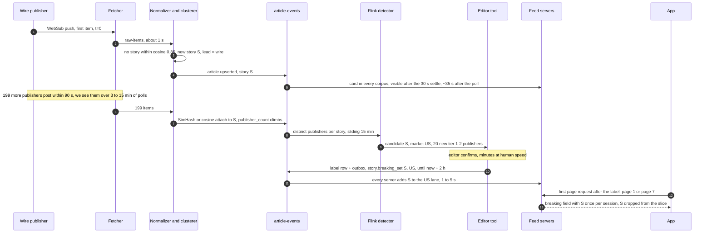
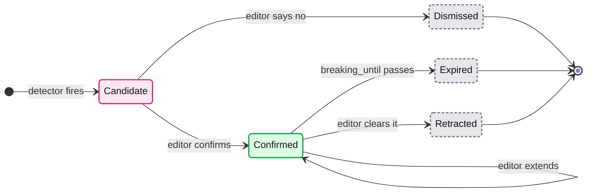
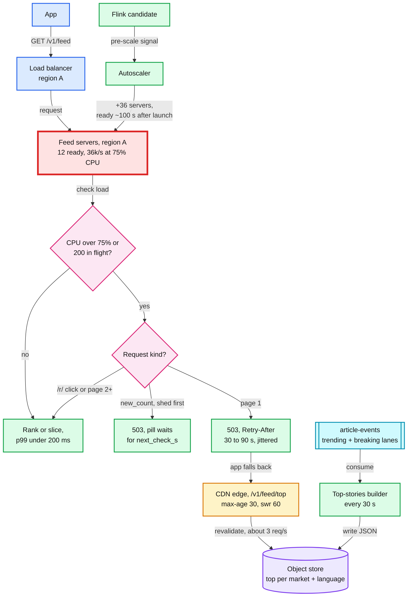

# Deep dive: breaking news and load shedding

> One-line answer: breaking news is two spikes at opposite ends. On the write side, 200 publishers' versions of one event attach to one story through dedup levels 4 and 5, a Flink detector flags a **candidate** when a story gains 20 or more distinct tier 1 and 2 publishers in 15 minutes (fewer in a small market) or its log click velocity sits far above the market's baseline, and an editor confirms the "Breaking" label per editorial market; the label becomes one event that puts the story in that market's breaking lane (at most 3 stories) on every feed server, shown once per session in a pinned `breaking` field outside the frozen session, for 2 hours or until one retraction event removes it. On the read side, 10x readers hit a fleet sized for 2x the daily peak (36 servers, 108k/s at the 75% CPU shed line) while the first new server serves only ~2.5 to 3 minutes into the spike (autoscaler, provisioning, ~70 s readiness), so each server sheds `new_count` checks, then page-1 builds, with a jittered 503 and the app falls back to a regional top-stories page the CDN serves from the object store, rebuilt every 30 s. Degraded counts as up.

Related: [`../solution.md`](../solution.md#55-breaking-news-10x-readers-in-two-minutes-and-200-publishers-in-90-seconds-what-happens) §5.5, [§10.3 capacity](../solution.md#103-capacity-math-per-component), [§10.4 new server timeline](../solution.md#104-failure-timeline), [`publisher-polling-and-rate-limits.md`](publisher-polling-and-rate-limits.md) (the write-side burst), [`dedup-and-story-clustering.md`](dedup-and-story-clustering.md) (levels 4 and 5), [`pagination-and-feed-sessions.md`](pagination-and-feed-sessions.md) (the frozen session the lane sits outside), [`feed-read-path-and-fan-out.md`](feed-read-path-and-fan-out.md) (why a lane is free), [`../../../concepts/rate-limiting-and-load-shedding.md`](../../../concepts/rate-limiting-and-load-shedding.md), [`../../../concepts/caching-patterns.md`](../../../concepts/caching-patterns.md), [`../../../concepts/stream-processing.md`](../../../concepts/stream-processing.md).

## 1. From the first wire item to a banner on every feed

- **Before the label, ranking already helps.** The v1 score has `0.6 x click_velocity` and `0.3 x coverage`, so story S climbs every feed within minutes with no human involved. The label adds the banner, nothing else.
- **Our clock, not theirs.** "200 publishers in 90 seconds" reaches us over ~15 minutes: the top ~500 via push or 3-minute polls, the rest at 15. The detector counts by ingest time.

## 2. What "breaking" means, and who says so

| Signal | Rule | Computed by | Weak spot |
|---|---|---|---|
| Coverage | +20 distinct tier 1 and 2 publishers on one story in 15 min, or 10% of the market's active tier 1-2 publishers if smaller | Flink, keyed by `story_id`, sliding window over `article-events` | Undercounts when clustering splits one event |
| Readers | Log click velocity far above the market baseline (robust z-score) | Flink, per story and market, over `clicks` | A slow start in a small market |
| Label | Editor confirms per editorial market | Editor tool | Human latency, and a desk must be staffed 24/7 |

- **Precision-tuned clustering fights detection.** Early reports of one event differ ("explosion reported in X" vs "attack kills 12 in X"), fall below cosine 0.85, and split into stories of 12 and 9 publishers: neither fires. So the detector also counts publishers sharing a named entity per 15-min bucket, and the editor can merge; the label follows `merged_into`.
- **Why log velocity.** Story click velocities have a long tail, so a plain "5 sigma" on raw velocity fires on every normal top story. A robust z-score of log velocity against the market's hour-of-week baseline fires on the abnormal ones.
- **Region means editorial market** (US, India, UK), not one of our 3 deployment regions. Every feed server holds every market's lane: at most 3 x ~50 markets = ~150 story ids [estimate].
- **Machines propose, people label.** A false banner on 100 M feeds costs more than a banner that is 3 minutes late. With no editor on shift, nothing gets a banner, but the story still ranks high on its own.

## 3. The breaking lane

- **One small list per market, at most 3 stories,** in every feed server's memory. A 4th confirmation evicts the oldest. Fan-out on read makes this free: one list, not 100 M timeline writes.
- **The path.** The editor tool writes the label and an outbox row in one transaction, and the relay publishes `story.breaking_set {story_id, market, until}` to `article-events`, keyed by `story_id` so set and clear stay ordered. Every feed server and the CDN builder read it, and the 60 s corpus snapshot includes the lanes, so a new server boots with them.
- **The row.** `story_breaking (story_id, market, breaking_until, set_by, set_at, cleared_at)`, primary key `(story_id, market)`. `breaking_until` defaults to now + 2 h; a correction sets `cleared_at`.
- **Outside the frozen session, once per session.** The response's `breaking: Card[]` field (≤ 3) carries the story on the first page served after it breaks, and the app pins it as a banner. It never goes into `items`, so pagination never shifts. `new_count` also carries new breaking ids, so a visible but idle client gets the banner without a refresh. The For You cursor's `bk` carries the ≤ 3 breaking ids already shown, so later pages skip them; the client's rendered-id set covers a banner that arrived through `new_count`.
- **No duplicate card.** If S is also at position 150 of the frozen session, drop it from the slice and extend the slice by one, the same rule as a retracted card.
- **Expiry and retraction.** `breaking_until` defaults to 2 h, checked locally by each server, so expiry needs no event. A false label is one `story.breaking_cleared`: gone from every server in 1 to 5 s, and the builder rebuilds and purges that market's CDN objects by key. Nothing else to clean, because no timeline was written. The lane follows `merged_into` if S merges into another story.

## 4. 200 publishers in 90 seconds through dedup

| Level | What happens to the 200 | Cost |
|---|---|---|
| 1 to 3: `known_ids`, `(publisher_id, source_guid)`, `canonical_url_hash` | Catch retries and AMP or mobile copies of the same URL | Index lookups |
| 4: 64-bit SimHash, Hamming ≤ 3 over 7 days | Wire reprints (maybe half of the 200 [estimate]) join the wire's story. The same publisher within 3 bits is an alias of its own article | ~2 ms each, brute force over 2.1 M |
| 5: embedding cosine ≥ 0.85 within 48 h plus a shared named entity | Outlets' own write-ups join the story | ~20 ms each |

- **Load is not the problem.** 200 articles over ~15 minutes is ~0.2/s extra against a ~35/s peak. The card shows `more_sources` climbing from 1 to 199.
- **Why one clusterer.** `raw-items` has 12 partitions keyed by `publisher_id`, so two normalizers can see the first two reports in the same second. If each assigned stories, both would find none and both would create one, exactly in a burst. Story assignment goes through one active clusterer with a hot standby (leader lease): serialized, ~20 ms each, ~50/s against a ~35/s peak.
- **The lead can flip once.** A tier-2 outlet ingested first leads until the tier-1 wire arrives. Duplicates attach and are never deleted, so a user who follows the tier-2 outlet still sees its copy.

## 5. The read spike, minute by minute

Per server: 8 vCPU at ~2 ms CPU per request is ~4k requests/s flat out, ~3k at the 75% shed line, ~2k at the 50% target. Baseline 36 servers (12 per region): **72k/s at 50%, 108k/s at the shed line, 144k/s flat out; 36k/s per region at the shed line.** The spike is ~120k/s.

Spread evenly (40k per region), each region sheds ~4k/s (10%) until new servers arrive. The harder case is a regional story: region A goes from ~12k/s to ~96k/s while B and C stay at ~12k/s [estimate]. Assumptions: demand ramps over 2 minutes, the autoscaler acts on a 1-minute CPU average, and launch adds ~30 s of provisioning to the ~70 s readiness [estimates].

| t | Demand, region A | Ready in A | Personalized in A | CDN fallback | Fallback with spillover to B, C |
|---|---|---|---|---|---|
| 0 | 12k/s | 12 | 12k/s | 0 | 0 |
| 1 min | 54k/s | 12 | 36k/s | 18k/s (33%) | 0 (18k/s spilled) |
| 2 min | 96k/s | 12 (+15 launched) | 36k/s | 60k/s (62%) | 12k/s (12%) |
| 5 min | 96k/s | 48 | 96k/s at 50% CPU | 0 | 0 |
| 10 min | 96k/s | 48 | 96k/s | 0 | 0 |

- **Headroom absorbs an even spike, not a regional one.** Even: ~10% shed. Regional: ~60% at t = 2 min. Quote the 108k/s shed line as capacity, never the 144k/s flat-out number.
- **First new capacity arrives ~2.5 to 3 min in, not 70 s.** ~1 min for the autoscaler to see it, ~30 s to provision, ~70 s to boot, load the snapshot, replay and warm [estimate].
- **Two cheap fixes.** Spill to B and C: they hold 48k/s of spare capacity at the shed line, already paid for, at the cost of one cross-region hop (the regions are ~70 ms apart) inside the 200 ms budget. Pre-scale on the breaking **candidate**, which often fires before readers peak. A false alarm costs 36 servers for 30 min, about $6 at ~$250 per server-month.
- **A regional spike needs more servers.** 48 in A plus 12 each in B and C is 72, not the ~60 of an even spike, because B and C cannot shrink below their N+1 baseline.
- **Pin down "10x".** ~120k/s is 10x the daily average and ~3.4x the daily peak. A 10x jump on the evening peak would be ~350k/s, ~175 servers at 50%. Only the CDN fallback survives that in the first minutes.

## 6. The shedding path

- **Why red here.** The fetcher stays the system's red node. Inside this deep dive, region A's 12 servers are what breaks first: ~96k/s of demand against a 36k/s ceiling until new servers pass readiness.
- **Thresholds: 75% CPU or 200 in flight per server.** By Little's law, 200 in flight at 3k/s served is ~67 ms of queue, still inside the 200 ms p99.
- **Cheapest loss first.** Impressions go to a separate events collector (batched every ~60 s, ~17k requests/s [estimate]) and shed before anything. Then `new_count` checks: the pill just waits. Then For You page-1 builds (~2 ms of ranking) go to the CDN. Page-2+ slices of a frozen session cost ~0.3 ms and are kept, so nobody's scroll is replaced mid-way.
- **Never shed `/r/`.** The fallback page's cards still link to `/r/{article_id}` on the feed tier. Shedding it breaks the tap on the breaking story itself. If `/r/` fails anyway, the app opens the card's direct `url` field and reports the click in its events batch.
- **Jitter `Retry-After`.** One fixed value brings every shed client back in the same second. The app retries personalization on the next pull-to-refresh after `Retry-After`, never in a loop, and keeps its last rendered feed as a third fallback.
- **`new_count` is real load and a herd trigger.** ~8k checks/s on average, ~80k/s at a spike [estimate]. Page 1 returns a signed pill token with the ~30 lane ids, so a check reads no Redis. When a story breaks, every visible client's pill lights up and sends its user to pull-to-refresh at once: a page-1 storm. Breaking ids ride in the `new_count` response so the banner needs no refresh, and `next_check_s` rises under load.

## 7. The CDN fallback and its builder

- **One JSON per market and language,** ~50 cards, no user data. No auth header or cookie in the cache key, or every user becomes a cache miss.
- **The CDN's origin is a pre-built object, not the feed tier.** If the CDN revalidated against `/v1/feed/top` on shedding feed servers, the fallback would fail with the thing it replaces. The builder is independent of the feed tier: its own process consuming `article-events`, so it has the corpus, trending and breaking lanes, and it rewrites each object every 30 s.
- **`Cache-Control: public, max-age=30, stale-while-revalidate=60, stale-if-error=600`.** If the object store errors, edges serve the last copy for 10 more minutes (RFC 5861; CDN support [unverified]). A dead builder just leaves the last object in place, still served. Behind an origin shield, ~100 variants [estimate] refreshed every 30 s is ~3 origin requests/s.
- **Worst-case staleness is 30 + 60 = 90 s.** Fine for a fallback. For a false breaking label, the builder rebuilds and purges that market's objects by key.
- **99.99%.** Shed 503s answered by the fallback count as up. The error budget (~4.3 min a month) is spent on real 5xx and on a CDN outage. Old app versions without the fallback turn a 503 into an error screen: track them apart.

## 8. Thumbnails at 10x

- **Egress scales with reads.** 120k pages/s x 8 visible cards x 15 KB x 50% client cache hit = ~7.2 GB/s, against ~2.1 GB/s at the daily peak. A 20-min spike is ~8.6 TB, ~$86 to $173 at $0.01 to $0.02 per GB: not the problem.
- **No hot key.** The breaking story's thumbnail is one immutable URL. Each PoP (point of presence) misses once, the origin shield collapses concurrent misses, and the object store sees a handful of reads.
- **The image lags the card by ~10 s.** The builder includes an image URL only after `article.image_ready`. Under shedding the fallback uses the smallest size.

## 9. The push-notification seam

- **Same lane, new consumer.** A push service subscribes to `story.breaking_set`, filters by market and opt-in, and uses `story_id` as the collapse key so updates replace, not stack. It is below the line today.
- **Target: the Guardian's "90in2",** 90% of devices in 2 minutes. They found sends to 800k+ recipients taking up to 6 minutes before optimizing ([InfoQ, 2023](https://www.infoq.com/news/2023/05/guardian-push-architecture/)).
- **Our size [estimate].** ~10 M opted-in devices in one market means 9 M in 120 s, ~75k sends/s. Provider limits: FCM (Firebase Cloud Messaging) around 600k messages/min per project [unverified], which alone would take ~15 min, so topic fan-out on the provider side or a raised quota. APNs (Apple Push Notification service) per-device throughput [unverified].
- **Push creates the read spike.** 10% of 9 M tapping in 2 min is ~7.5k opens/s [estimate]. Deep-link to `/v1/stories/{id}`, the same for everyone and CDN-cacheable for 30 s, not to page 1 of For You. Pre-scale when the push is queued.
- **A push cannot be recalled.** A banner retracts in seconds; a notification on 9 M lock screens does not. So push is editor-sent only, never automatic, with a per-user cap of a few a day [estimate].

## 10. Failure modes

| Failure | Blast radius | What happens |
|---|---|---|
| Flink detector down | No new candidates, click velocity frozen | Editors can still label from the tool. Feeds serve |
| Editor tool or Postgres down | No new labels | Existing lanes stay in every server. Expiry is local |
| Feed server lags `article-events` | Its users see the label seconds late | Lag > 60 s on > 10% of servers pages (§8 of solution) |
| Outbox relay stuck | Labels and new articles reach no server | Page when the oldest unpublished outbox row is > 60 s |
| Builder dies | Fallback content ages | The last object stays and keeps serving. Alert on object age > 5 min |
| CDN down | No fallback | App shows its last rendered feed. Feed tier sheds less |
| False label | Every feed in that market | One event: seconds in app, a rebuild and purge for the CDN. A push is permanent |

## 11. Trade-offs

| Decision | Chose | Gave up |
|---|---|---|
| Who labels | Editor confirms a machine candidate | Minutes of latency and a 24/7 desk. Ranking covers the gap |
| Delivery | `breaking` field once per session, outside the slice | Session and client must track what was shown |
| Spike capacity | 2x daily peak headroom, shed, autoscale, pre-scale | Idle servers most of the day, ~$9k a month |
| Degraded mode | CDN page from the object store, 30 s | Personalization for the shed minutes |
| Shed order | `new_count`, then page 1. Never `/r/` or slices | New openers get a generic page first |
| Push | Editor-sent only | Speed. A recall is impossible |

## 12. What the interviewer probes next

- **"Who is allowed to mark something breaking?"** Only an editor, per market. Machines raise candidates and boost ranking.
- **"How do you correct a false label?"** One `story.breaking_cleared` event, seconds everywhere, a rebuild and purge for the CDN copy. Pushes are why the bar for push is higher.
- **"Why not autoscale instead of headroom?"** First new capacity lands ~2.5 to 3 minutes in, and the spike peaks in 2. Headroom, spillover and the fallback carry those minutes.
- **"What if the CDN fallback is also cold?"** It is one pre-built object per market and language, always present in the object store, rewritten by a builder that never depends on the feed tier.
- **"10x on top of the evening peak?"** ~350k/s. Shed most page-1 traffic to the CDN for ~5 minutes while the fleet grows toward ~175.
