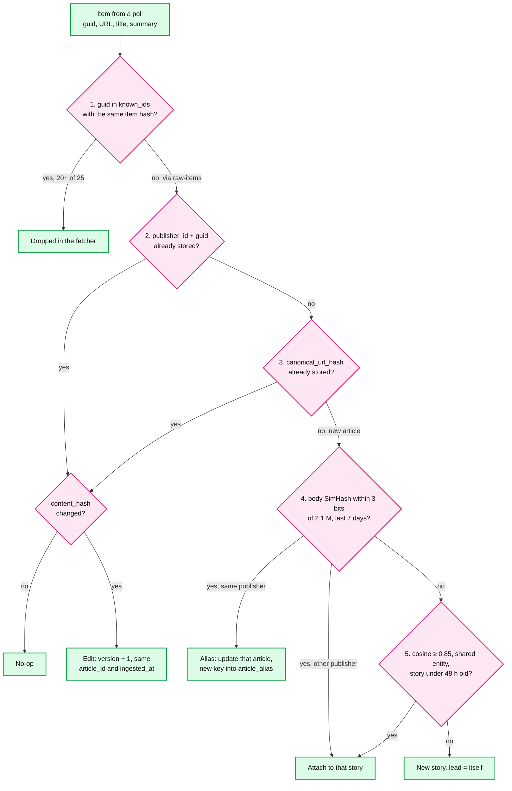
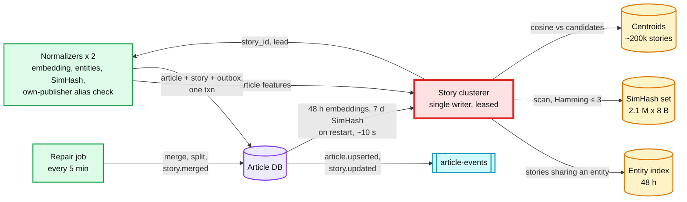
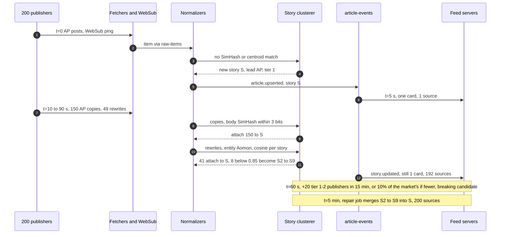

# Deep dive: dedup and story clustering

> One-line answer: dedup decides which story an article belongs to, never whether it exists. Five levels run cheapest first: known ids in the fetcher, `(publisher_id, source_guid)`, canonical URL, a 64-bit SimHash of the body within 3 bits, then a title-plus-lede embedding at cosine ≥ 0.85 with a shared named entity inside 48 h. One single-writer story clusterer makes the level 4 and 5 calls, so a 200-publisher burst cannot race itself. Clusters are tuned for precision and repaired later by merges (`merged_into`) and splits. The card shows the reader's subscribed publisher's copy, else the lead (best trust tier, then earliest ingested). On news-length text SimHash catches only verbatim bodies. Anything reworded is level 5's job.

Related: [`../solution.md`](../solution.md#52-the-same-story-arrives-from-300-publishers-how-do-you-show-it-once) §5.2 and [§10.5](../solution.md#105-exactly-once-and-idempotency-end-to-end), [`publisher-polling-and-rate-limits.md`](publisher-polling-and-rate-limits.md) (`known_ids` and the overlap check), [`ranking-and-cold-start.md`](ranking-and-cold-start.md) (coverage, trust tiers), [`pagination-and-feed-sessions.md`](pagination-and-feed-sessions.md) (merged stories inside a frozen session), [`breaking-news-and-load-shedding.md`](breaking-news-and-load-shedding.md), [`../../../concepts/stream-sketches.md`](../../../concepts/stream-sketches.md) (MinHash, SimHash), [`../../../concepts/vector-index.md`](../../../concepts/vector-index.md), [`../../../concepts/exactly-once.md`](../../../concepts/exactly-once.md), [`../../../concepts/leases-fencing-clocks.md`](../../../concepts/leases-fencing-clocks.md).

---

## 1. Five levels, cheapest first



- **Each level's miss is the next level's job.** Level 1 is free, in the fetcher. Levels 2 and 3 are Postgres unique indexes, looked up in that order: they miss changed guids (§3) and the same text at a new URL. A miss on both is `INSERT ... ON CONFLICT DO NOTHING` plus a re-read, because `ON CONFLICT DO UPDATE` names one constraint and two normalizers can race. Level 4 (17 MB, ~2 ms) misses any changed sentence (§6). Level 5 misses rewrites under 0.85, by design.
- **Duplicates are never deleted.** A syndicated copy is a real article from a real publisher. A Hindustan Times follower should see HT's copy of the AP story, so dedup only sets `story_id` and the feed picks the copy per reader (§9).

## 2. Level 3: URL canonicalization

Rules, in order, without fetching the page: scheme to `https`, lowercase host, drop the default port, drop the fragment, drop `utm_*`, `fbclid`, `gclid` and a per-publisher list learned from `rel=canonical` disagreements, sort what is left. Keep path case and trailing slash, because servers treat them as different pages.

| # | Raw URL | Rule that fires | Canonical |
|---|---|---|---|
| 1 | `https://News.Example:443/world/quake?utm_source=tw&utm_medium=social` | lowercase host, default port, `utm_*` | `https://news.example/world/quake` |
| 2 | `http://news.example/world/quake#comments` | scheme, fragment | `https://news.example/world/quake` |
| 3 | `https://news.example/story?id=42&fbclid=IwAR0&gclid=Cj0K` | `fbclid`, `gclid`. `id` stays: it names the article | `https://news.example/story?id=42` |
| 4 | `https://news.example/story?ref=home&id=42` | `ref` is on this publisher's learned list, sort | `https://news.example/story?id=42` |
| 5 | `https://amp.news.example/world/quake.amp` | `rel=canonical`, same publisher | `https://news.example/world/quake` |
| 6 | `https://paper.example/ap/quake-8812`, `rel=canonical` to `wire.example` | cross-domain canonical ignored | `https://paper.example/ap/quake-8812`, wire URL kept as a story hint |

- **Follow `rel=canonical` only within the publisher's registered domains**, and reject an article link whose host is not one of them (so `/r/` is never an open redirect). Syndication partners often point the canonical at the wire's original [unverified]. Followed blindly, row 6 collides with AP's row on `UNIQUE (canonical_url_hash)`, the paper's article vanishes into AP's, and "the subscribed copy wins" breaks. A cross-domain canonical instead goes to the clusterer as a strong hint for level 5.
- **It needs the article page.** The page worker fetches each new article's page once, inside the host's token bucket, for `og:image` and the same-domain `rel=canonical`. That is ~300k a day: ~3.5/s average and ~35/s at peak, on top of ~13 polls/s. If the page's canonical differs, the row's `canonical_url` is updated. If that collides with an older article of the same publisher, the newer item becomes an alias of it.

## 3. Guids that change

| Case | What goes wrong | Answer |
|---|---|---|
| CMS migration re-issues every guid, URLs unchanged | 25 "new" ids, overlap 0, a false `gap_suspected`, up to 5 pages walked for nothing | Level 3 catches all 25. Overlap counts an item whose id **or** canonical URL hash is known and whose title hash is unchanged, so no false gap |
| Domain move: guids and URLs both change | Levels 2 and 3 miss | Level 4: same publisher, same body, so aliases and no new cards |
| Feed renders a fresh guid per request (timestamp or random) | Every poll looks like 25 new items, λ explodes, T drops to `T_min` and we hammer the host | After 3 polls where a known canonical URL arrives under a new guid, the source is flagged `unstable_guid` and its ids become canonical URLs |
| Permalink guid carries tracking params | One guid per campaign | Canonicalize permalink guids with §2's rules |
| One guid in two section feeds of the publisher | Arrives twice | Level 2: the second is a no-op |

## 4. `content_hash`: edits, republish spam, correction spam

- **The hash.** `sha256` over normalized title + summary, plus body when the feed carries it: HTML stripped, whitespace collapsed, volatile text removed ("Updated 3 min ago", counters, share widgets). Without that, every poll of a live blog is an "edit".
- **Edit path.** Same hash: no-op. Different: `version + 1`, same `article_id`, same `ingested_at`. Feed servers apply an event only if its version is newer. The card changes in place because hydration is live, and it never moves up.
- **Level 1 lets edits through.** `known_ids` keeps each id with an 8-byte hash of title and summary. The fetcher drops an item only when both match, so a corrected headline on an item still in the 25 is forwarded as an edit.
- **Republish under a new URL.** Same publisher and SimHash within 3 of its own article from the last 7 days: an alias that updates that article, with no new `article_id`, and records the new guid and URL in `article_alias (key_hash PK, article_id)` so a replay stops at level 2 or 3. Another publisher: a syndicated copy that joins the story. Ranking ages a story from its earliest `min(published_at, ingested_at)`, so joining never resets freshness ([ranking](ranking-and-cold-start.md)). An item whose `published_at` is over 48 h old at first sight is stored but kept out of the fresh lanes.
- **"A correction every few minutes to game freshness"** (PracHub, Rippling tag):
  - *No gain.* An edit never changes the stored `ingested_at` or `published_at`, so the story's age stays put.
  - *Our cost.* Every edit is an event to every feed server, ~60 of them at a spike. Coalesce: at most 1 applied edit per article per 10 min [estimate]. A retraction always goes through at once.
  - *Their window.* Atom feeds, and many RSS feeds, sort by update time. Each correction re-enters the latest 25 and pushes a real new item toward the edge. That is why λ counts ids entering the window, edits included (solution §4.1).
  - *Enforcement.* More than 6 edits per article per hour [estimate] flags the publisher for trust review. Repeat offenders drop to tier 3.
- **Retractions are never inferred from absence**, since leaving the latest 25 is normal. They come from a deleted flag in the publisher's API, a `HEAD` recheck (404 or 410) of the last 24 h of top-500 articles (~2/s), or an editor or legal takedown. Each is `article.upserted` with `status = retracted` and `version + 1`, never coalesced.

## 5. Level 4: SimHash

- **How it works.** Take the body or summary, headline, byline and dateline stripped. Split it into word 3-shingles and hash each to 64 bits. For every bit position, add +1 if the shingle's bit is 1 and -1 if it is 0. The fingerprint bit is the sign of the sum. Two texts that share most shingles keep most signs. Per bit, P(differ) = θ/π, where θ is the angle between the two shingle vectors. Expected distance is 2.9 bits at shingle cosine 0.99, 4.1 at 0.98, 6.5 at 0.95 and 9.2 at 0.90.
- **Why 64 bits and k = 3.** [Manku, Jain, Das Sarma, WWW 2007](https://static.googleusercontent.com/media/research.google.com/en//pubs/archive/33026.pdf): "for a repository of 8B web-pages, 64-bit simhash fingerprints and k = 3 are reasonable". On their hand-tagged pairs, precision and recall were both near 0.75 at k = 3. A fingerprint is one machine word, and a compare is XOR plus popcount. So k = 3 means about 99% of shingles shared.
- **Why k stays at 3.** Only 43,745 of the 2^64 values lie within 3 bits of a fingerprint. A random pair matches with probability 2.4e-15. Widening k to catch edited copies buys random false merges:

| k | Random false matches a day (2.1 M set, 300k/day) | At 10x (21 M set, 3 M/day) |
|---|---|---|
| 3 | 0.0015 | 0.15 |
| 6 | 2.8 | 284 |
| 12 | 144,000 | 14 M |

- **Brute force at 2.1 M.** 7 days x 300k = 2.1 M fingerprints x 8 B = 17 MB, or ~50 MB with `article_id` and `story_id`. One pass of XOR plus popcount at ~1 ns each is ~2 ms. At 35 articles/s peak that is 7% of one core. Manku needed permuted tables because 8B fingerprints occupy 64 GB and each query had a few milliseconds. Refuse to build them.
- **When to switch: ~4x, not 10x.** Both the set and the arrival rate grow with scale s, so compares grow with s²: 2.1 M x 35/s x s² = 7.4e7 x s² a second. One core does ~10^9, and the clusterer is serialized (§8), so brute force runs out at s ≈ 3.7. At 10x each scan is ~20 ms and the peak of 350/s needs **7 s of scanning per second**.
- **The table layout for k = 3.** Split the 64 bits into 4 blocks of 16. Two fingerprints within 3 bits agree exactly on at least one block (pigeonhole). Keep 4 copies sorted by each block. At 10x a query does 4 lookups and each returns ~21 M / 2^16 ≈ 320 candidates: ~1,300 compares instead of 21 M, for ~670 MB [estimate]. It is Manku's 4-table design, where one probe over 8B returns ~256K.

## 6. Runnable Python: what SimHash catches on news-length text

Stdlib only. Save as `simhash_demo.py`, run `python3 simhash_demo.py`.

```python
import hashlib, itertools, re

K = 3  # Manku et al.: 64-bit fingerprints, near-duplicate if Hamming distance <= 3

def shingles(text, n=3):
    w = re.findall(r"[a-z0-9]+", text.lower())
    return {" ".join(w[i:i + n]) for i in range(len(w) - n + 1)}

def simhash(text):
    v = [0] * 64
    for s in shingles(text):                      # every shingle has weight 1
        h = int.from_bytes(hashlib.blake2b(s.encode(), digest_size=8).digest(), "big")
        for i in range(64):
            v[i] += 1 if (h >> i) & 1 else -1
    return sum(1 << i for i in range(64) if v[i] > 0)

AP_HEAD, AP_BY = "Magnitude 6.8 earthquake strikes off coast of northern Japan", "By Mari Tanaka, Associated Press"
AP_BODY = ("A magnitude 6.8 earthquake struck off the coast of northern Japan on Tuesday evening, the Japan Meteorological "
           "Agency said. The quake hit at a depth of about 40 kilometers near Aomori prefecture. A tsunami advisory was "
           "issued for the Pacific coast and residents were told to stay away from the shore. There were no immediate "
           "reports of serious damage or injuries. Bullet train services in the region were briefly suspended while "
           "engineers inspected the tracks, the operator said.")
LOCAL_BODY = AP_BODY.split(" Bullet")[0] + " Local officials said schools in the prefecture would open as normal on Wednesday."
REWRITE = ("Northern Japan was shaken on Tuesday night by a 6.8 magnitude quake centred off Aomori, according to the "
           "country's weather agency. Authorities put the Pacific coastline under a tsunami advisory and urged people to "
           "keep clear of beaches. Officials said they had no early reports of major damage, and high-speed rail lines "
           "were halted for safety checks.")
OTHER = ("The central bank kept its benchmark interest rate unchanged on Tuesday, saying inflation was easing but "
         "remained above target. The governor said the committee would watch food prices closely over the coming "
         "months before deciding on any cut.")
docs = {  # name: (headline, byline, body)
    "ap": (AP_HEAD, AP_BY, AP_BODY),
    "local": (AP_HEAD, "By Staff Reporter, Coastal Daily News", LOCAL_BODY),
    "headline": ("Strong quake rattles northern Japan, tsunami advisory issued", AP_BY, AP_BODY),
    "rewrite": ("Japan hit by 6.8 quake near Aomori", "By Tom Reed, Global Wire", REWRITE),
    "unrelated": ("Central bank holds interest rates steady", "By Priya Rao, Business Desk", OTHER),
}
full = {n: " ".join(d) for n, d in docs.items()}
fp = {n: (simhash(full[n]), simhash(d[2])) for n, d in docs.items()}   # (headline+byline+body, body only)
print(f"{'pair':22}{'jaccard':>8}{'hd full':>9}{'hd body':>9}   dup at k=3 (full / body)")
for x, y in itertools.combinations(docs, 2):
    sx, sy = shingles(full[x]), shingles(full[y])
    hf, hb = (bin(fp[x][i] ^ fp[y][i]).count("1") for i in (0, 1))
    mark = lambda h: "YES" if h <= K else "no"
    print(f"{x + ' / ' + y:22}{len(sx & sy) / len(sx | sy):8.2f}{hf:9}{hb:9}   {mark(hf):>3} / {mark(hb)}")
```

Output:

```
pair                   jaccard  hd full  hd body   dup at k=3 (full / body)
ap / local                0.60       18       12    no / no
ap / headline             0.85        8        0    no / YES
ap / rewrite              0.01       41       38    no / no
ap / unrelated            0.00       27       32    no / no
local / headline          0.52       14       12    no / no
local / rewrite           0.01       31       32    no / no
local / unrelated         0.00       29       32    no / no
headline / rewrite        0.01       39       38    no / no
headline / unrelated      0.00       25       32    no / no
rewrite / unrelated       0.00       36       34    no / no
```

What it shows, honestly:
- **A changed headline alone costs 8 bits** on a 90-shingle text. Fingerprint the body only, with headline, byline and dateline stripped, and the same copy scores 0. Syndicating papers rewrite headlines far more often than bodies.
- **One changed sentence plus a local byline costs 12 bits, and SimHash misses it.** It is still a syndicated copy. Its lede is identical, so level 5's title-plus-lede embedding catches it.
- **A real rewrite is invisible to any shingle method:** Jaccard 0.01, 38 bits. Only an embedding sees that "high-speed rail lines were halted" and "bullet train services were suspended" are the same fact. That is why level 5 exists. Pairs with nothing verbatim in common land at 25 to 41 bits, around the random 32 ± 4.
- So on ~70-shingle bodies, k = 3 catches verbatim copies only. That is still worth it: verbatim wire copies are the bulk of a syndication burst, and at ~2 ms they are the cheapest catch. RSS summaries are often shorter than this, so level 4 pays off most when the feed carries the full body.

## 7. Rejected: MinHash + LSH

MinHash estimates shingle Jaccard directly, and LSH banding makes it a sub-linear lookup. At a Jaccard threshold of ~0.5 it would catch the "local" pair (0.60) that SimHash misses. We still reject it. The "local" pair is caught by level 5 anyway, and level 5 is needed regardless for rewrites at Jaccard 0.01. A second near-duplicate index costs ~128 x 4 B = 512 B per article [estimate], 64x a SimHash, plus band tables to tune, and catches nothing the SimHash-plus-embedding pair does not. Manku also notes that Broder's shingle fingerprints need 24 bytes against SimHash's 8.

## 8. Level 5: story clustering



- **Why one writer.** `raw-items` is keyed by publisher, so copies of one AP story land on different partitions and different normalizers within the same second. Two assigners that each see "no match" create two stories. The same-publisher alias check can stay in the normalizer that owns the publisher's partition, since it sees all of that publisher's items. Cross-publisher copies need the global set, so one clusterer serializes the decision: ~2 ms SimHash scan + ~0.5 ms blocked cosine, x 35/s peak ≈ 10% of a core. It is one active process with a hot standby behind a leader lease. The lease has an epoch: each assignment carries it, and the transaction that writes the story row checks it in Postgres, like `feed_source.lease_token`, so a paused old leader cannot write. If the clusterer is down, the normalizer gives the article a singleton story and the repair job reattaches it.
- **Entity blocking.** Candidates are the stories under 48 h old that share at least one named entity (person, place, organization): tens to hundreds, not 200k. The shared entity is both the precision guard and the candidate generator. Brute force over 200k centroids is the ~20 ms in solution §10.3. Blocked, it is well under 1 ms [estimate]. The centroid is the mean of the first 10 members, then frozen [estimate], because a running mean drifts until a war story absorbs every nearby event.
- **Precision first.** Merging two events hides one of them. Splitting one event shows a near-duplicate. The second error is cheaper. 0.85 depends on the embedding model: recalibrate it on a weekly hand-labeled pair sample (Manku's method), target precision ≥ 0.95 [estimate], and ship clusterer changes in shadow first (solution §10.9). Rolling back a bad clusterer re-clusters the last 48 h from `embedding` and `entity_ids` and emits the resulting merges and splits as `article.upserted` with `version + 1`.
- **Merges.** The repair job scans stories active in the last 48 h for centroid cosine ≥ 0.85 plus 2 shared entities [estimate]. Survivor: more publishers, then older. One transaction sets `loser.merged_into = survivor` (only if the survivor is unmerged, so no cycles), moves members' `story_id`, and emits `story.merged`. Feed servers resolve `merged_into` on read. A frozen session may hold both ids: hydration maps both to the survivor, drops the later one, and extends the page by one.
- **Splits are a repair job, never real time.** Triggers: an editor report, a cohesion alarm (over 20% of members below 0.7 to the centroid [estimate]), or member entities that form two disjoint groups. Re-cluster the members. The larger group keeps the `story_id`. The rest get a new one, and their articles are re-emitted as `article.upserted` with `version + 1`.
- **Restart** reloads 48 h of embeddings and entities plus 7 days of SimHash from a replica, ~10 s [estimate]. That is what the `embedding` (~128 B quantized) and `entity_ids` columns on `article` are for.

## 9. Lead selection and "the subscribed publisher's copy wins"

- **Lead** = among members with the best trust tier (1 is best), the earliest ingested. It is recomputed on every attach and carried by `story.updated`. A tier 2 scoop leads until AP (tier 1) arrives. That is trust over scoop credit, on purpose. Tier 3 leads only when the story has no tier 1 or 2 member.
- **At read time**, per story, in the feed server: resolve `merged_into`. If any member's publisher is one the user follows, show that copy (with several, highest `publisher_affinity`, then earliest). Else show the lead. `more_sources` = distinct publishers - 1. The member lists are in memory: ~900k ids, ~7 MB. Intersecting them with ~20 subscriptions takes microseconds. It is read time because the right copy depends on the reader.
- **Age for ranking is `now - min(published_at, ingested_at)`, taken over the story's members**, not the shown copy. A late subscribed copy or a re-post cannot make an old story look new, and a future-dated item cannot boost itself.

## 10. Walk-through: 200 publishers in 90 seconds



- **Load is not the problem, the race is.** 200 articles in 90 s is 2.2/s on top of 3.5/s average. Without the single writer, the first 10 copies on 10 partitions could make 10 stories.
- **The lead can flip.** If a tier 2 outlet beat AP by 30 s, the card switches to AP when AP lands. Hydration is live, so already-rendered cards stay put and later pages show AP.
- **Copy farms cannot inflate it.** `coverage` and the breaking trigger (+20 tier 1 and 2 publishers in 15 min, or 10% of the market's active ones if that is smaller) count tier 1 and 2 only, so ten tier 3 sites add nothing. A market editor confirms the label.
- **The wire itself may overflow its 25-item window** in the burst. That is the poller's problem ([polling deep dive](publisher-polling-and-rate-limits.md)).

## 11. Trade-offs

| Decision | Chose | Rejected | Why |
|---|---|---|---|
| Duplicates | Attach to a story, pick the copy at read time | Drop at ingest | Subscriptions must win |
| SimHash input | Body only, byline and dateline stripped | Headline + body | A headline change alone is 8 bits (§6) |
| Threshold | k = 3 | k = 6 to 12 to catch edits | k = 12 is ~144k random false matches a day |
| Near-duplicate index | Brute force over 2.1 M | Permuted tables | ~2 ms today. Tables at ~4x |
| Second similarity method | Embeddings at level 5 | MinHash + LSH | Only embeddings see rewrites |
| Clustering errors | Precision first, merge later | Recall first | Hiding an event is worse than a near-duplicate |
| Story assignment | One leased clusterer | State in each normalizer | Bursts race across partitions |
| `rel=canonical` | Same publisher only | Always follow | The paper's copy would collide with the wire's row |

## 12. What the interviewer probes next

- **"Two different events merged. What does the user see?"** One event hides under the other's card. That is why thresholds favor precision. An editor report or the cohesion alarm triggers a split, and the smaller group becomes a new story.
- **"A publisher sends a correction every few minutes to stay on top."** Edits never refresh freshness, get coalesced to one per 10 min, and flag the publisher. The subtle cost is the 25-item window they eat (§4).
- **"What breaks first as you grow?"** The serialized clusterer's SimHash scan, at about 4x, because compares grow with the square of scale. Build the 4 permuted tables, then at 10x partition the clusterer by language, the same seam as the corpus split (solution §5.7).
- **"The clusterer is down."** Articles get singleton stories and keep flowing. The feed shows some duplicates for minutes, and the repair job merges them. Ingest never blocks on clustering.
