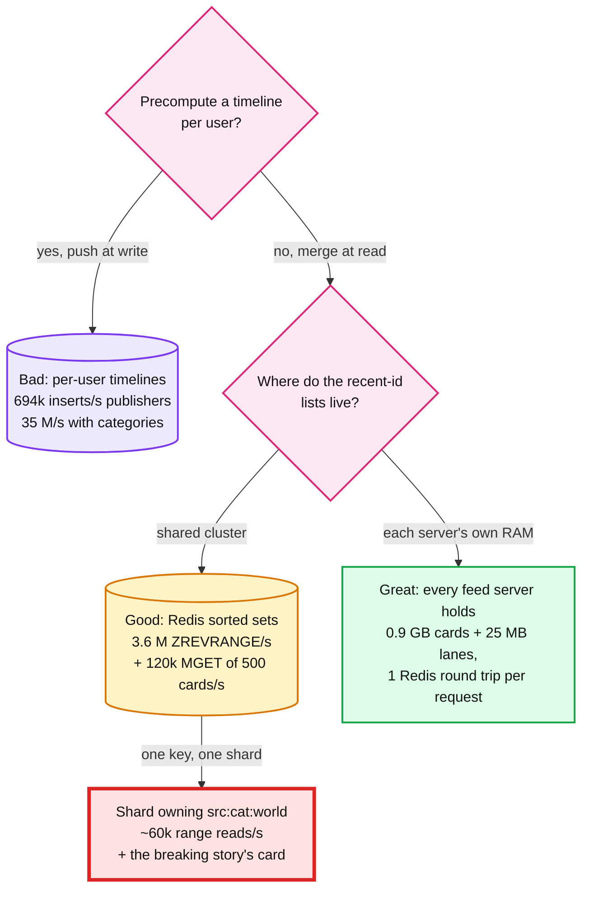
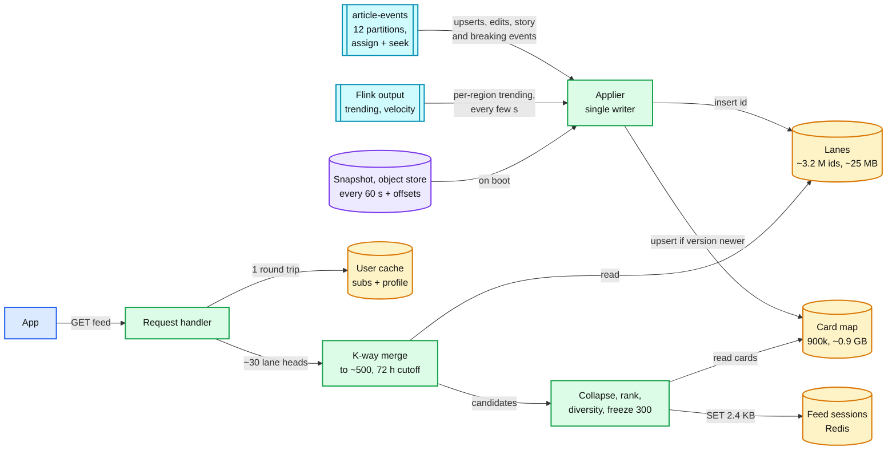
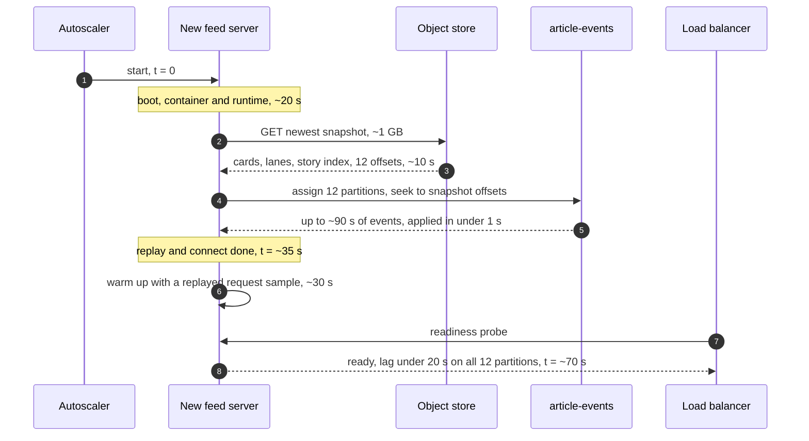

# Deep dive: the feed read path and fan-out

> One-line answer: fan-out on write would cost ~694k timeline inserts/s from publisher subscriptions and ~35 M/s with categories to deliver ~3.5 articles/s, and a Redis source-list cluster would serve ~3.6 M list reads/s with one shard owning `src:cat:world`; so every feed server consumes `article-events` itself and holds the whole 72 h corpus (~0.9 GB of cards, ~25 MB of lanes), a request is one Redis round trip for the user's own state plus an in-memory k-way merge, and what we accept in return is a ~70 s bootstrap, about a second of lag between servers, and a corpus that grows with articles, not with users.

Related: [`../solution.md`](../solution.md#53-how-do-you-serve-120k-feeds-a-second-under-200-ms-fan-out-on-write-or-on-read) §5.3, [§2](../solution.md#2-back-of-envelope), [§10.1](../solution.md#101-internals-of-each-chosen-technology), [`pagination-and-feed-sessions.md`](pagination-and-feed-sessions.md) (everything after page 1), [`ranking-and-cold-start.md`](ranking-and-cold-start.md) (the score), [`breaking-news-and-load-shedding.md`](breaking-news-and-load-shedding.md) (the 10x spike), [`../../../concepts/fan-out-fan-in.md`](../../../concepts/fan-out-fan-in.md) §6 (the celebrity problem).

---

## 1. Three rungs, priced



- **Bad, fan-out on write.** 100 M DAU x 20 publisher subscriptions / 10,000 publishers = **200k active subscribers per publisher**. 300k articles x 200k = 6 x 10^10 inserts a day = **~694k/s**. Categories: 100 M x 5 / 50 = 10 M subscribers each, 300k x 10 M = 3 x 10^12 a day = **~35 M/s**.
- **The line that ends the debate.** Users see 1 B pages x 20 cards = 2 x 10^10 impressions a day. Publisher fan-out alone writes **3x more entries than all impressions**, so at least 2 of every 3 are never read. With categories, each user receives ~30,600 entries a day and looks at 200.
- **Two more ways it is worse than it looks.** It counts DAU only; the ~5 B subscription rows (publishers and categories) belong to 200 M registered users, so it doubles unless inactive users are skipped. And a Twitter-sized 800-entry timeline fills in ~38 min at 30,600 a day: a user who opens the app twice a day would get the last 38 minutes of category news. We would have built our own 25-item-window problem.
- **Good, Redis source lists.** ~30 lanes a request x 120k/s = **3.6 M ZREVRANGE/s**. Each returns up to 200 ids (~5 KB of RESP, the Redis wire protocol), ~18 GB/s, plus an MGET of 500 cards at ~600 B, ~36 GB/s [estimate]. That is ~430 Gbps of cache egress to serve 25 MB of lists and 0.9 GB of cards.
- **The hot shard.** A key lives on one shard. If half of all requests include `src:cat:world` [assumption], that shard serves ~60k range reads/s of 200 members. A single-threaded shard does ~100k to 200k small GETs/s [estimate], and a 200-member range costs several GETs. It saturates first. Worse, the breaking story's card is in **every** request at the exact moment traffic is 10x. Copying hot keys to 8 suffixed keys works, at 8x the writes plus a routing layer.

## 2. Why the Twitter hybrid does not apply

| | Twitter 2012 | This system |
|---|---|---|
| Reads vs writes | "300K QPS" timeline reads vs "6000 requests per second" of writes, ~50:1 | 11.6k reads/s vs ~3.5 articles/s, **~3,300:1** (120k vs 35/s at a spike, same ratio) |
| Timeline | Redis, "maximum of 800 entries" | none |
| Biggest writer | Lady Gaga, 31 M followers, "up to 5 minutes" to fan out | every category ~10 M, the average publisher 200k |
| Direction | "doing more work on reads for high value users" | every writer is high value, so all reads |

- **The hybrid exists because most Twitter writers are small** (figures from HighScalability's write-up of Krikorian's QCon 2012 talk, a secondary source, [link](https://highscalability.com/the-architecture-twitter-uses-to-deal-with-150m-active-users/)). Push is cheap for them, pull is needed for a few. Here, even if the smallest 5,000 publishers each had under 10k subscribers (the concept note's threshold), they would own under 50 M of the 2 B DAU subscription edges, <2.5% [estimate]. Two write paths and two read paths to push 2.5% of entries.
- **The hybrid assumes pull is expensive.** It is when pull is a network fan-out. Ours is ~1 ms of CPU in RAM. The hybrid we do build is turned around: read-time merge for content, precompute for users (interest vector and publisher affinity from Flink in ~10 s).
- **Same shape as Multifeed.** "Usually 20 leaf servers work as a group and make up one full replica containing the index data for all the users", with CPU-heavy aggregators that rank; splitting the two gave a "40% efficiency improvement" ([Meta, 2015](https://engineering.fb.com/2015/03/10/production-engineering/serving-facebook-multifeed-efficiency-performance-gains-through-redesign/)). Our index fits in one server, so leaf and aggregator share a process. LinkedIn FollowFeed is fan-out on read too: 720 partitions, ~140 ms p99 ([LinkedIn](https://www.linkedin.com/blog/engineering/feed/followfeed-linkedin-s-feed-made-faster-and-smarter)).

## 3. Inside one feed server



| Structure | Shape | Size |
|---|---|---|
| Card map | `article_id -> Card`: ids, title, snippet, image key, URL, times, SimHash, sparse topic vector (top 5 pairs, ~16 B), trust tier, `version`, `status` | 900k x ~1 KB = **~0.9 GB** |
| Publisher lanes | 10,000 arrays of ids, newest first, cap 200 | ~0.9 M ids |
| Category lanes | 50 arrays, last 72 h | ~0.9 M ids |
| Topic lanes | ~500 arrays, last 72 h, ~1.5 topics per article [estimate] | ~1.4 M ids |
| Story index, breaking lanes | `story_id -> lead, members, publisher_count, merged_into`; ≤ 3 breaking stories per editorial market (~50) | ~300k stories [estimate] |

- **A lane is an array of 8-byte ids, sorted descending.** The id is time-ordered (41-bit ms, 10-bit machine, 12-bit sequence), so "newest first" and "largest id first" are one order, and the merge compares integers. A new id is almost always the largest, so it goes on the head in O(1). A late one (its partition was behind, or its normalizer's clock was a few ms slow) is placed by binary search plus a shift. At ~35/s peak it is noise here, but it breaks a naive Following cursor ([pagination §3](pagination-and-feed-sessions.md)).
- **Caps and the 72 h sweep.** 200 ids hold ~6.7 days of a 30-a-day publisher, so the cap binds only for wires and live blogs, and it stops one spamming publisher from growing memory. Every 60 s, drop cards older than 72 h and trim lane tails: ~12.5k cards expire an hour, ~210 per sweep. The merge also stops at the 72 h cutoff, so a card between sweeps is never served. Events apply only if `version` is newer (a replay is a no-op); an edit keeps `article_id` and `ingested_at`, so no lane moves; a retraction flips `status`.
- **No locks on the read path.** One applier thread writes. Lanes are chunked: immutable chunks of a few thousand ids plus one mutable head, so a ~100k-id category lane is never copied per insert.
- **Manual partition assignment, no consumer group** (solution §10.1). `assign()` all 12 partitions and `seek()` to the snapshot's offsets. No coordinator, no rebalance when 30 servers join mid-spike, no committed offsets (the snapshot holds them).

| Memory item | Size |
|---|---|
| Cards | ~0.9 GB |
| Lanes (~3.2 M ids x 8 B, ~25 MB), story index and click velocity per story per region (~50 MB [estimate]) | ~75 MB |
| Kafka fetch buffers, in-flight requests (200 at the shed limit x ~0.5 MB), garbage-collector headroom (about the live set again) | ~1.1 GB |
| **Total** | **~2.1 GB of a 16 GB server** |

## 4. The per-request latency budget

| Step | p50 | p99 budget | Note |
|---|---|---|---|
| Queue wait, parse, verify the auth token | 0.3 ms | 21 ms | Bounded by shedding at 75% CPU or 200 in flight |
| User cache GET: subs + profile | 0.5 ms | 5 ms | 20 ms timeout, then the regional default feed |
| Pick ~30 lanes, k-way merge to 500 | 0.05 ms | 1 ms | 5,000 lanes: ~0.5 ms of cache misses |
| Collapse by story, pick the copy | 0.1 ms | 1 ms | Subscribed publisher's copy wins, else the lead |
| Rank 500 x ~20 features | 1 ms | 5 ms | v1 formula on all 500. The v2 model re-ranks only the top ~100: FollowFeed's ~50 µs p99 x 500 would be ~25 ms |
| Diversity, freeze 300 | 0.1 ms | 1 ms | Max 2 per publisher in any 10 |
| Session SET, 2.6 KB | 0.5 ms | 5 ms | 20 ms timeout, then a cursor with no session |
| Hydrate and serialize 20 cards | 0.2 ms | 2 ms | ~15 KB of JSON |
| Garbage-collection pause | 0 | 20 ms | Young-generation pause on a ~2 GB heap [estimate] |
| Reserve: one Redis retry, the hop to the load balancer | | 139 ms | Noisy neighbours, what we did not think of |
| **Total** | **~3 ms** | **200 ms** | p99s rarely coincide, so the real p99 is far lower |

- **CPU, not latency, sizes the fleet.** ~2 ms of CPU a request, so an 8 vCPU server at 50% serves ~2k/s. Baseline is **~36 servers, 12 per region, ~$9k a month**, sized for 2x the daily peak (70k/s) at 50% CPU = 280 cores. Usable capacity is the 75% shed line, 36 x 8 x 0.75 / 2 ms = ~108k/s (~144k/s flat out). An evenly spread 120k/s spike sheds ~10%; a spike in one region (12k/s becoming 96k/s against ~36k/s usable) sheds ~60% there. Pill checks shed first, then page-1 builds; page-2+ slices are kept. The fixes are cross-region spillover and pre-scaling on the breaking-candidate signal, because new servers land only ~2.5 to 3 min into a spike [estimate].
- **The 2 ms is a page 1.** A page-2+ slice is one GETRANGE and 20 hydrated cards, ~0.3 ms [estimate]. With ~30% page 1s the blend is ~0.8 ms, so normal days have ~2x more room than the sizing says. Keep 2 ms for spikes, which skew toward page 1: people open the app, read the top, and leave.

## 5. The merge, runnable

Stdlib only. Lanes hold Snowflake-style ids over 80 h, so the 72 h cutoff is exercised. N = 25 is 20 publishers (30 a day, cap 200) plus 5 categories (6,000 a day). N = 5,000 is a power user's publishers. "newest" pops the largest id. "caps" adds solution §4.3's per-lane caps (20 per followed publisher, 100 per category). "weighted" pops the largest `lane_weight x 0.5^(age_h / 6)`, still descending along each lane, so the same heap works. "w+caps" is the merge solution §4.3 chose.

```python
"""Fan-out-on-write arithmetic, then a k-way heap merge of N descending lanes. Stdlib only."""
import heapq, math, random, time

DAU, SUBS, PUBS, CAT_SUBS, CATS, NEW = 100e6, 20, 10_000, 5, 50, 300_000
per_pub, per_cat = DAU * SUBS / PUBS, DAU * CAT_SUBS / CATS
w_pub, w_cat = NEW * per_pub, NEW * per_cat
print(f"subscribers: {per_pub:,.0f} per publisher, {per_cat:,.0f} per category")
print(f"fan-out on write: publishers {w_pub:.1e}/day = {w_pub / 86400:,.0f}/s, "
      f"categories {w_cat:.1e}/day = {w_cat / 86400:,.0f}/s")
print(f"publisher entries / 20 B impressions = {w_pub / 20e9:.1f}x, "
      f"entries per user per day = {(w_pub + w_cat) / DAU:,.0f} vs 200 cards viewed")

EPOCH, NOW, H = 1_700_000_000_000, 1_800_000_000_000, 3_600_000   # ms
CUTOFF = (NOW - 72 * H - EPOCH) << 22                              # ids below this are > 72 h old
age_h = lambda x: (NOW - EPOCH - (x >> 22)) / H

def lane(per_day, cap, rng, hours=80):   # Snowflake-style ids: 41-bit ms | 10-bit machine | 12-bit seq
    ids = [((NOW - EPOCH - int(rng.random() * hours * H)) << 22) | (rng.randrange(1024) << 12) | i % 4096
           for i in range(int(per_day * hours / 24))]
    return sorted(ids, reverse=True)[:cap]

def merge_top(lanes, key, k=500, cap=None):
    """Pop the k largest keys across descending lanes (at most cap[i] from lane i). key descends along a lane."""
    heap = [(-key(i, l[0]), i, 0) for i, l in enumerate(lanes) if l and l[0] >= CUTOFF]
    heapq.heapify(heap)
    out = []
    while heap and len(out) < k:
        _, i, j = heapq.heappop(heap)
        out.append((i, lanes[i][j]))
        if j + 1 < len(lanes[i]) and lanes[i][j + 1] >= CUTOFF and (cap is None or j + 1 < cap[i]):
            heapq.heappush(heap, (-key(i, lanes[i][j + 1]), i, j + 1))
    return out

def bench(name, lanes, n_pub, weight, cap, reps):
    wkey = lambda i, x: math.log2(weight[i]) - age_h(x) / 6      # lane_weight x 0.5^(age_h / 6), in log2
    for label, key, c in (("newest", lambda i, x: x, None), ("caps", lambda i, x: x, cap),
                          ("weighted", wkey, None), ("w+caps", wkey, cap)):
        t0 = time.perf_counter()
        for _ in range(reps):
            out = merge_top(lanes, key, cap=c)
        us = (time.perf_counter() - t0) / reps * 1e6
        print(f"{name:8} {label:8} {us:6,.0f} us/merge, oldest {max(age_h(x) for _, x in out) * 60:4,.0f} min,"
              f" publisher lanes {sum(i < n_pub for i, _ in out) / len(out):4.0%}, lanes used {len({i for i, _ in out}):,}")

rng = random.Random(42)
lanes25 = [lane(30, 200, rng) for _ in range(20)] + [lane(6_000, 10**9, rng) for _ in range(5)]
bench("N=25", lanes25, 20, [1.0] * 20 + [0.25] * 5, [20] * 20 + [100] * 5, 500)  # weights: an assumption
lanes5k = [lane(30, 200, rng) for _ in range(5_000)]
bench("N=5,000", lanes5k, 5_000, [max(0.01, rng.random() ** 3) for _ in range(5_000)], [20] * 5_000, 50)
```

Output (CPython 3.14, one core, machine class unknown, so the timings are indicative):

```
subscribers: 200,000 per publisher, 10,000,000 per category
fan-out on write: publishers 6.0e+10/day = 694,444/s, categories 3.0e+12/day = 34,722,222/s
publisher entries / 20 B impressions = 3.0x, entries per user per day = 30,600 vs 200 cards viewed
N=25     newest      153 us/merge, oldest   23 min, publisher lanes   1%, lanes used 10
N=25     caps        157 us/merge, oldest   26 min, publisher lanes   2%, lanes used 12
N=25     weighted    198 us/merge, oldest  728 min, publisher lanes  61%, lanes used 25
N=25     w+caps      202 us/merge, oldest  728 min, publisher lanes  60%, lanes used 25
N=5,000  newest      871 us/merge, oldest    5 min, publisher lanes 100%, lanes used 477
N=5,000  caps        905 us/merge, oldest    5 min, publisher lanes 100%, lanes used 477
N=5,000  weighted  1,441 us/merge, oldest  118 min, publisher lanes 100%, lanes used 247
N=5,000  w+caps    1,501 us/merge, oldest  118 min, publisher lanes 100%, lanes used 247
```

- **Speed is not the problem, the merge key is.** 200x the lanes cost ~6x the time, because the heap only touches the heads it pops. But a newest-first cut to ~500 lets five category lanes at 6,000 a day drown twenty publisher lanes at 30 a day: 1% of candidates come from the publishers the user chose, and nothing is older than 23 min.
- **Caps alone fail; the key fixes it.** Caps are ceilings, not floors: they sum to ~900 here (~1,200 with topics and trending), so a newest-first cut to 500 still takes 98% from categories and reaches back 26 min. The weighted key takes ~60% from followed publishers and reaches back 12 h; caps then only stop one lane from filling the pool. At 5,000 sources caps change nothing and the key reaches back 2 h. The merge runs until the candidates cover ~300 distinct stories, because syndicated sources collapse.

## 6. Bootstrap: ~70 s from boot to ready



- **Snapshots.** One snapshotter per region writes cards, lanes, the story index and the 12 offsets every 60 s. Per region, because each region consumes its own mirrored topic and offsets do not carry across. Replay is ≤ 90 s of events (snapshot age plus load time), ≤ ~18k at 200 events/s in a spike [estimate]: under a second to apply.
- **Readiness gate.** Snapshot applied, lag under 20 s on every partition (the line that later ejects a lagging server; after replay it is near 0), warm-up done. Without it a new server would serve pages missing articles below the cut, and a user would see a story vanish on refresh.
- **Why not replay 72 h from Kafka.** ~3 M events (articles, edits, image and story events) x ~1.5 KB = ~4.5 GB per server. Thirty servers joining a spike would pull ~135 GB from brokers that ingest shares, at the worst moment. The object store absorbs parallel reads.
- **Snapshot missing or corrupt.** Take the previous snapshot (60 s more replay). If none is usable, rebuild from a Postgres replica (the last 72 h, 900k rows) and let `offsetsForTimes` find where to resume. Minutes, not seconds, but no new dependency. Ticket if the newest snapshot is older than 10 min.

## 7. Lag between servers, and the user with 5,000 sources

- **Why lag between servers does not break correctness.** Servers apply events on their own, tens of ms apart typically [estimate]. Pages read only below a settle cut, `min(now - 30 s, W)`, where W is the lowest per-partition watermark the outbox relay publishes ("every commit stamped at or before W is published"), mirrored with the data. The normalizer's transaction times out at 5 s, readiness fails at 20 s of lag, and W covers a stalled relay, so every serving server holds everything below the cut. Following is keyset below it. A For You session holds stories up to `as_of_seq` (the article id at the cut), so page 2 on any ready server can hydrate every card. The condition: For You page 1 must also stop at the cut. If it ranked a 5-second-old article, page 2 on a server 15 s behind (still ready) would miss that card.
- **5,000 sources is cheap to merge and hard to rank.** A 5,000-head heap is ~5,000 cache misses, ~0.5 ms [estimate]; in the Redis rung it is 5,000 round trips. Store the subscription set as a packed blob (~20 KB of 4-byte ids). But 5,000 x 30 a day is ~104 articles a minute, so a recency merge sees only the last ~5 min (measured above). Key the heap by affinity x decay.

## 8. The 10x seam: a 9 GB corpus

At 10x: 3 M articles a day, 9 M cards, ~9 GB per server, lanes ~250 MB, 1.2 M reads/s at a spike, ~600 servers. The number that bites is **replicas = fleet size**: ~600 x 9 GB = ~5.4 TB of RAM holding copies of one 9 GB dataset.

| Option | How | RAM per server | What it costs |
|---|---|---|---|
| Compact cards | Packed off-heap records (~600 B), map the snapshot file | ~6 GB | Nothing new. Bootstrap needs parallel reads (~10 s) |
| Card tier | Keep a ~64 B rank record for all 9 M (~0.6 GB) and the lanes; fetch the 20 display cards from a sharded card service with a local cache of hot cards | ~1 GB | +1 round trip per page. Hot cards return as hot keys, which the local cache absorbs |
| Split by language or region | Server pools per language; users route to theirs | ~1/3 to 1/5 [estimate] | Cross-language follows need two pools or a fallback; pools size unevenly |

- **Our pick:** compact cards first, because it adds no component. Card tier next. It is Multifeed's lesson: once the replica is big, separate memory-heavy leaves from CPU-heavy aggregators so memory stops scaling with read QPS. Language split is the answer for data residency more than for memory.

## 9. Trade-offs

| Decision | Chose | Gave up |
|---|---|---|
| Fan-out | Read-time merge in every server | O(1) timeline reads. Nothing else, at 694k to 35 M inserts/s |
| Where lanes live | In process, replicated | A shared cache; accepts ~70 s bootstrap and ~1 s divergence |
| Merge key | Heap keyed by lane weight x decay, plus per-lane caps | Newest-first, with or without caps: categories flood the pool |
| Bootstrap | Snapshot + replay from offsets | Stateless start from Kafka alone, which loads brokers in a spike |

## 10. What the interviewer probes next

- **"Show me the write path for fan-out on write."** Draw it, then price it: 694k/s, 35 M/s, 3x the impressions, an 800-entry timeline that fills in 38 min.
- **"Why replicate the corpus instead of sharding it?"** Sharding turns every request into a scatter-gather, where the slowest of N shards sets the latency ([fan-out concept](../../../concepts/fan-out-fan-in.md) §2). Replication keeps one hop until the corpus outgrows a server (§8).
- **"What pages you on this path?"** Page: `article-events` lag > 60 s on over 10% of servers, feed 5xx or fallback rate. Ticket: snapshot older than 10 min, one server ejected for lag.
