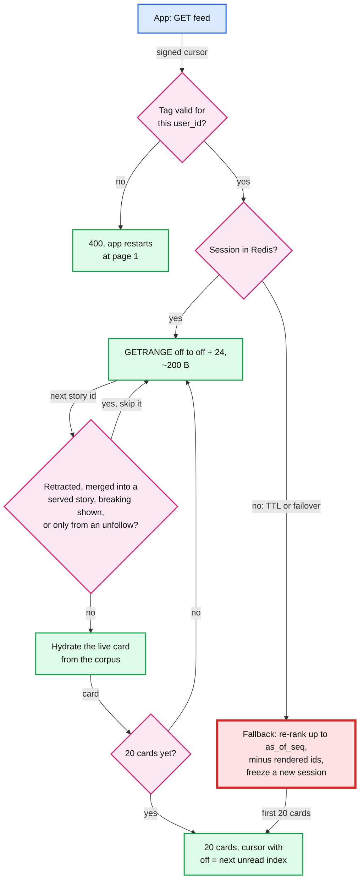
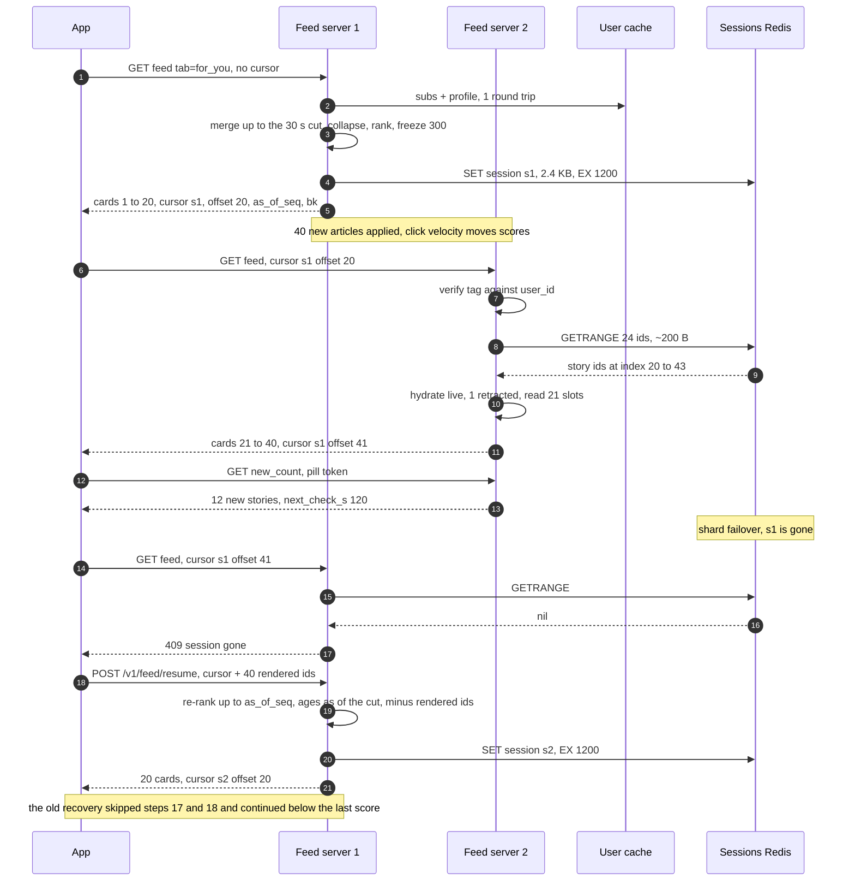

# Deep dive: pagination and feed sessions

> One-line answer: the Following tab pages by keyset on `article_id`, whose timestamp bits are our ingest clock, and no new arrival can enter a served range because every page stops at a settle cut, `min(now - 30 s, W)`, with W the outbox relay's watermark; the For You tab ranks once, freezes 300 story ids per scroll session in Redis (2.4 KB, 20-minute TTL, ~11 GB live, ~110 GB in a long spike, 6 shards) and serves each page as a slice behind an HMAC-signed cursor, with cards hydrated live so edits and retractions still show; new stories only move a pill the app polls every 2 min, answered from memory. Simulated over 10 pages: offset paging repeats ~61 cards and skips ~29 stories, keyset on score ~44 and ~55, the session 0 and 0, and a lost session rebuilt from the ids the app already rendered 0 and 0 (the cheaper "continue below the last score" re-rank: ~4 and ~6, once).

Related: [`../solution.md`](../solution.md#44-infinite-scroll-no-duplicates-no-skips-while-articles-arrive) §4.4, [§5.4](../solution.md#54-how-does-infinite-scroll-stay-stable-once-the-feed-is-ranked), [Flow 4](../solution.md#flow-4-page-2-while-40-new-articles-arrive-fr4), [§10.10](../solution.md#1010-security-and-abuse), [`feed-read-path-and-fan-out.md`](feed-read-path-and-fan-out.md) (how page 1 is built), [`breaking-news-and-load-shedding.md`](breaking-news-and-load-shedding.md) (the breaking lane above the session), [`../../../concepts/realtime-client-server-communication.md`](../../../concepts/realtime-client-server-communication.md) (poll vs push for the pill), [`../../../concepts/leases-fencing-clocks.md`](../../../concepts/leases-fencing-clocks.md) (why ids from many machines are not a clean order).

---

## 1. Three ways to page, and what each guarantees

| Method | Cursor | Duplicates | Skips | New arrivals | Server state |
|---|---|---|---|---|---|
| Offset on a fresh ranking | page number | Yes: each arrival above you pushes a seen card onto the next page | Yes: each story that rises above your offset | Mostly never seen | None, but O(offset) work a page |
| Keyset on an immutable key | last key | No | No, if new keys land only above the top | Above the top, to the pill | None |
| Keyset on a live score | last (score, id) | Yes: a served story whose score falls repeats | Yes: an unserved story that rises is gone | Anywhere | None |
| Snapshot (feed session) | session id + offset | No | No, against the snapshot | Excluded, to the pill | 2.4 KB a session |
| Client-held list | the list itself | No | No | Excluded, to the pill | None |

Following uses row 2. For You uses row 4. Row 5 is the honest alternative (§10).

## 2. Simulated: 10 pages while scores drift and 40 stories arrive

1,000 stories with lognormal scores. Between requests every score moves by a lognormal factor (σ = 0.10, ~10% a request [assumption]) and 4 or 5 new stories land in the current top 100, 40 in all. A **skip** is a story that was ranked above the reader's position when a page was requested and was never shown. Stdlib only, means over 200 seeds.

```python
"""Ranked feed, 10 pages of 20. Scores drift between requests and 40 new stories arrive. Stdlib only.
Compares offset paging, keyset on score, a frozen session, and two ways to recover a session lost before page 3."""
import math, random

PAGE, PAGES, N0, KEEP, SIGMA = 20, 10, 1_000, 300, 0.10   # SIGMA: lognormal score drift per page gap
ARRIVALS = [0, 5, 5, 5, 5, 4, 4, 4, 4, 4]                   # new stories before page k, 40 in all

def run(method, seed):
    rng = random.Random(seed)
    score = {i: rng.lognormvariate(0, 1) for i in range(N0)}     # ids < N0 existed at page 1
    page1 = dict(score)
    rank = lambda pool: sorted(pool, key=lambda i: (-score[i], i))
    nxt, shown, seen, passed = N0, [], set(), set()             # passed: ranked above the reader
    session, off, cursor, dropped = None, 0, None, 0
    for p in range(PAGES):
        if p:                                                   # drift, then arrivals near the top
            for i in score:
                score[i] *= math.exp(rng.gauss(0, SIGMA))
            top = sorted(score.values(), reverse=True)
            for _ in range(ARRIVALS[p]):
                score[nxt] = rng.uniform(top[100], top[0]); nxt += 1
        if method == "offset":                                  # OFFSET 20k on a fresh ranking
            order = rank(score); passed |= set(order[:off]); page = order[off:off + PAGE]; off += PAGE
        elif method == "keyset":                                # WHERE (score, id) < cursor, live scores
            ok = lambda i: cursor is None or (score[i], -i) < cursor
            passed |= {i for i in score if not ok(i)}
            page = rank([i for i in score if ok(i)])[:PAGE]; cursor = (score[page[-1]], -page[-1])
        else:                                                   # frozen session of 300 story ids
            session = session or rank(score)[:KEEP]
            if method == "lost" and p == 2:                     # re-rank as of page 1, below last_score
                passed |= {i for i in range(N0) if score[i] >= cursor}
                session, off = rank([i for i in range(N0) if score[i] < cursor])[:KEEP], 0
            if method == "lost_ids" and p == 2:                 # client posts its rendered ids instead
                session, off = rank([i for i in range(N0) if i not in seen])[:KEEP], 0
            passed |= set(session[:off]); page = session[off:off + PAGE]; off += PAGE
            cursor = page1[page[-1]] if p < 2 else cursor       # the rejected recovery kept last_score
        if method == "lost":                                    # client drops story_ids it rendered
            dropped += sum(i in seen for i in page); page = [i for i in page if i not in seen]
        shown += page; seen |= set(page)
    new_inline = sum(i >= N0 for i in seen)
    return (len(shown) - len(set(shown)), dropped, len({i for i in passed if i < N0} - seen),
            new_inline, 40 - new_inline)

RUNS = 200
print(f"{'mean of %d runs' % RUNS:30}{'dups':>5}{'client drop':>12}{'skips':>6}{'new inline':>11}{'new later':>10}")
for m, label in (("offset", "offset, fresh ranking"), ("keyset", "keyset on score"),
                 ("session", "frozen session"), ("lost", "lost p3, rejected last_score"),
                 ("lost_ids", "lost p3, /resume with ids")):
    avg = [sum(c) / RUNS for c in zip(*(run(m, s) for s in range(RUNS)))]
    print(f"{label:30}{avg[0]:5.1f}{avg[1]:12.1f}{avg[2]:6.1f}{avg[3]:11.1f}{avg[4]:10.1f}")
```

Output:

```
mean of 200 runs               dups client drop skips new inline new later
offset, fresh ranking          60.9         0.0  28.6        2.1      37.9
keyset on score                44.3         0.0  55.1        1.6      38.4
frozen session                  0.0         0.0   0.0        0.0      40.0
lost p3, rejected last_score    0.0         4.3   5.8        0.0      40.0
lost p3, /resume with ids       0.0         0.0   0.0        0.0      40.0
```

- **Offset:** ~61 of 200 cards are repeats (~30%), mostly the 40 arrivals pushing seen cards down, plus ~29 stories skipped. Only ~2 of the 40 new stories are ever seen.
- **Keyset on score:** fewer repeats but twice the skips. Every story that rises past the cursor is gone for the session. This is why §5.4 rejects it.
- **Session:** 0 and 0 by construction. All 40 new stories wait for the pill ("new later").
- **Session lost before page 3, the old recovery** (re-rank up to `as_of_seq`, continue below the last served score, the app drops ids it rendered; solution §5.4 dropped it for this result): ~4 cards dropped by the app and ~6 skips, once. The simulation has no uniform decay term, which is the same as computing ages as of the cut. More than "an item or two" (at σ = 0.25 it is ~8 and ~18).
- **The recovery solution §5.4 uses:** a 409, then the app sends the ids it already rendered (`POST /v1/feed/resume`, 8 B per story, capped at the last 600 ids, ~4.8 KB) and the server re-ranks everything else up to `as_of_seq`: 0 and 0.

## 3. Following: keyset on our clock

- **The cursor.** `base64({v:1, k:article_id, cut})`. Page N+1 is the 20 newest items with ids strictly below `k` and at or below page 1's `cut`, across the user's lanes: binary-search each lane for `k`, then the same k-way heap as page 1. The cursor is unsigned (it names public articles), so the server clamps a forged `cut` to its own current cut.
- **Why our clock, not `published_at`.** Publishers backdate, send the wrong timezone, and we poll a 15-minute publisher up to 15 min late. Sorted by `published_at`, an item we ingest now can land below a cursor the user already passed and is skipped forever. `ingested_at` puts every new item at the top.
- **One clock, no tie-break.** `ingested_at` is by definition the timestamp inside `article_id` (solution §4.4). The id is unique, so it alone is a total order, and it is the same order the lanes are sorted in. Two clocks (a database `now()` and the id) could disagree, and the cursor would then skip.
- **The hole in "new arrivals can never shift a page".** The id is stamped before the commit, then the outbox relay, 12 Kafka partitions and the mirror follow, and each server applies on its own. An article can become visible seconds after one with a later stamp was served. It lands inside page 1's range: above the cursor, so never on page 2, and older than page 1's top, so not in the pill.
- **The fix is a settle cut** (solution §4.4): `cut = min(now - 30 s, W)`. W is the lowest applied value of a per-partition watermark heartbeat the outbox relay publishes ("every commit stamped at or before W is published"), mirrored with the data. Every page shows only ids at or below the cut, and the pill counts items between page 1's cut and the current cut. The normalizer's transaction times out at 5 s (a retry gets a new id), a server more than 20 s behind fails readiness, and W covers what readiness cannot see: a stalled relay or a Postgres failover that publishes old rows late while consumers show zero lag. Cost: ~30 s of freshness, invisible next to a 3-minute poll.
- **The end.** Past 72 h the tab returns "end of feed". It never falls through to Postgres at 120k/s.
- **Story collapse.** A story with a newer member on page 1 and an older member on page 3 would show twice. Rule: place each story at its newest member at or below page 1's cut in the user's lanes, and skip its older members. Deterministic for a given cut; the app's rendered-id set catches later merges.
- **Unsubscribe.** Stateless, so the next page just leaves that publisher's lane out. No repeat, no skip.

## 4. For You: the feed session

- **What is stored.** Page 1 ranks ~500 candidates up to the settle cut, collapses them to stories and freezes the top 300 under `fs:{session_id}`: a ~40 B header (`user_id`, `as_of_seq`, `subs_version`, model version) plus 300 packed 8-byte ids = 2.4 KB, ~2.6 KB with key and overhead. Pages 2 to 15 are slices. Because every id is at or below the cut, any ready server can hydrate every card.
- **Read the slice, not the list.** `GETRANGE` of 24 ids (20 plus 4 spares for filtered cards) is 192 B, 12x less than a GET. The TTL is fixed at 20 minutes from page 1 (solution §5.4), so the live set is exactly creation rate x 1,200 s. A reader still scrolling after 20 minutes takes the lossless 409 resume.
- **Enough stories.** 500 articles can collapse to fewer than 300 stories for a user whose sources syndicate heavily, so the merge runs until the candidates cover ~300 distinct stories (solution §4.3).

| Load | Sessions created/s | Live set, x 1,200 s x 2.6 KB | Per shard, 6 shards |
|---|---|---|---|
| Daily average | 3.5k | ~11 GB | ~1.8 GB |
| Daily peak, 3x | 10.5k | ~33 GB | ~5.5 GB |
| Spike, 10x for 20 min | 35k | ~110 GB | ~18 GB |
| Spike, if the TTL slid with each read, +5 min average scroll [assumption] | 35k | ~137 GB | ~23 GB, near the ~25 GB line |

- **Where 3.5k/s comes from.** 100 M DAU x 3 sessions = 300 M a day. Cross-check: 10 pages over 3 sessions is ~3.3 pages a session, so ~30% of 120k reads/s at a spike are page 1s, ~35k/s.
- **Ops at a spike.** 35k SET + ~85k GETRANGE a second, ~20k per shard.
- **`maxmemory-policy volatile-ttl`.** If memory runs out, Redis evicts the sessions closest to expiry, and they take the fallback. A session is losable by design.

## 5. The cursor

```
payload = {v:1, session_id, offset, as_of_seq, bk, iat}
tag     = HMAC-SHA256(key[kid], user_id + payload)[:16]
cursor  = b64url(payload) + "." + kid + "." + b64url(tag)
```

- **Fields.** `session_id` is random 128-bit. `offset` is the index of the next unread slot, not page x 20. `as_of_seq` is the article id at page 1's settle cut: ids are global and time-ordered, so it means the same set on every server and region, which a Kafka offset does not (12 partitions, and each region's mirrored topic numbers its own). `bk` holds the ≤ 3 breaking stories already shown. `iat` lets us reject cursors older than 24 h.
- **The tag covers `user_id` without carrying it** (solution §10.10). The server recomputes it with the authenticated user, so a leaked cursor is useless to anyone else, and the session's stored `user_id` is checked too. ~120 characters in all. Two live keys chosen by `kid` for rotation. Compare tags in constant time. A bad tag is a 400, and the app starts again at page 1.

## 6. Serving page N: frozen membership, live cards



- **Retracted.** Filtered, and one more slot is read, so the page stays at 20. The next `off` moves past both. If `off` were page x 20, the slot read to replace it would be served again on the next page.
- **Merged.** `story.merged_into` points at a story already served (lower index, or earlier on this page): skip. Otherwise show the survivor.
- **Breaking.** The response's `breaking: Card[]` field (≤ 3, a pinned banner, per editorial market) carries a story once per session, on the first page served after it breaks, and the story is filtered out of the frozen slice (solution §5.5). The cursor's `bk` and the app's rendered-id set are where "already shown" lives; without them the banner would repeat on every page.
- **Unfollowed.** The app sends `subs_version` on every request (solution §5.4). When it is newer than the session's, hydration drops cards that are in the session only because of the unfollowed publisher; the frozen list is not rebuilt. Stories with another reason (a topic, trending) show the lead's copy. Pages without a change never read the user cache.
- **Edits.** Show on the next page. A card already on screen keeps its old title until refresh.

## 7. The new_count pill, and its cost

- **What it counts.** Distinct stories between page 1's cut (`as_of_seq`) and the current cut in the user's lanes, not already in the session, capped at 99, plus any new breaking story ids for the banner. Never injected.
- **Load** [estimate]. 15 visible minutes per DAU a day gives 100 M x 900 s / 86,400 s = ~1 M apps visible at once (solution §2 uses ~1 M), / 120 s = **~8k checks/s** on average and **~80k/s** in a 10x spike (solution §2), ~70% of feed read volume.
- **Answered from memory.** Page 1 also returns a signed pill token with the user's ~30 lane ids (~30 x 4 B). Per lane, binary-search for the two cuts and collapse the ids between them by story: ~50 µs [estimate], no Redis, no session read. 80k/s x 50 µs = ~4 cores across the fleet at a spike, against ~240 for feeds.
- **Shed it first.** Every response carries `next_check_s`; at a spike, raise it from 120 to 600. Shedding order is pill checks, then page-1 builds; page-2+ slices are kept, so no scroll is replaced mid-way (solution §5.5). A longer `next_check_s` also damps the refresh storm, because every pill tap is a new page 1 and a new session.
- **Why not push.** Server-Sent Events or WebSocket would hold ~1 M sockets open to deliver a number nobody needs within 2 minutes.

## 8. Page 1, page 2 after 40 arrivals, and a lost session



- **Ages as of the cut, not now** (solution §5.4). `0.5^(age_hours / 6)` shrinks every score by ~2% per 10 minutes. The order does not change, but the rebuilt session should rank exactly what page 1 could see. Any fallback that compares against a stored score must use the same clock, or served stories slip below it and repeat.
- **A region failover loses every session in that region at once** (sessions live in regional Redis). For one page, the fallback becomes the main path for millions of scrollers. The rendered-ids recovery makes that invisible. Rehearse it in a game day.

## 9. Unsubscribe, multi-device, and page 16

- **A subscription change never deletes the session** (solution §4.2). Page 1 without a cursor always builds a new session, so deleting would buy nothing and would force the lossy fallback on the scroll in progress. The write bumps `subs_version`; the app sends it on the next page 1, which reads a fresh subscription set. A new follow appears on the next pull-to-refresh; an unfollow can be honoured mid-scroll (§6).
- **One session per device**, keyed by `session_id`, never by `user_id`: a user-keyed session would let the tablet overwrite the phone's list mid-scroll. Rendered-id sets are per device. "Already seen on the phone" reaches the tablet's next page 1 through impressions and Flink, ~10 s later. Cap session creation per user (30 a minute [assumption]) so a looping client cannot fill Redis.
- **Past 300 (page 16).** Read the old session once, rank again as of now, exclude its 300 ids, freeze 300 more. The new session carries the excluded set as a ~0.7 KB Bloom filter (600 ids at 1% false positives), since the old session may expire first ([`bloom-filter.md`](../../../concepts/bloom-filter.md)). A false positive hides one unseen story. Rare: 15 pages is past almost everyone.

## 10. The alternative: the app holds the list

- **How.** Page 1 returns 300 story ids with the first 20 cards; later pages send the next ids and get cards back. No Redis.
- **Size is not the objection** (solution §5.4 agrees). ~6 KB of JSON ids on page 1 (~3 KB packed), against ~120 KB of thumbnails on the same page. No 110 GB session tier, no session loss, and it survives a region failover.
- **Why the server still keeps the list.** Positions for click logging would come from the client, and training data a modified client can poison. And every rule added later (breaking dedup, unfollow filtering, merges) becomes app code that ships through app stores and lives in old versions for years. The rendered-ids recovery borrows the client's list only when the server's copy is gone.

## 11. Trade-offs

| Decision | Chose | Gave up |
|---|---|---|
| For You paging | Frozen session, pages are slices | Seeing a story that rises after page 1, until refresh |
| Following paging | Keyset below a 30 s settle cut | 30 s of freshness on Following |
| New items | A pill, checked every 2 min, `next_check_s` as the knob | Stories appearing on their own; ~8k checks/s |
| Lost session | Re-rank up to `as_of_seq`, the app sends rendered ids | One extra round trip and a POST of up to ~4.8 KB (last 600 ids), rarely |
| Where the list lives | Redis, 6 shards, `volatile-ttl` | A stateless server (the app-held list) |

## 12. What the interviewer probes next

- **"Page 3, and 40 new articles arrive. What does page 4 show?"** The next 20 of the frozen list. The 40 are behind the pill.
- **"The user scrolls back up."** The app renders from memory. No server call, nothing to keep stable.
- **"You ship a new ranker mid-session."** The session header records the model version. The new model starts at the next page 1.
- **"A retracted story is already on screen."** It stays until refresh. A tap goes through `/r/`, which looks the article up by id and can show a notice instead of redirecting.
- **"Why not just cache page 2 when you build page 1?"** That is the session, without live hydration.
