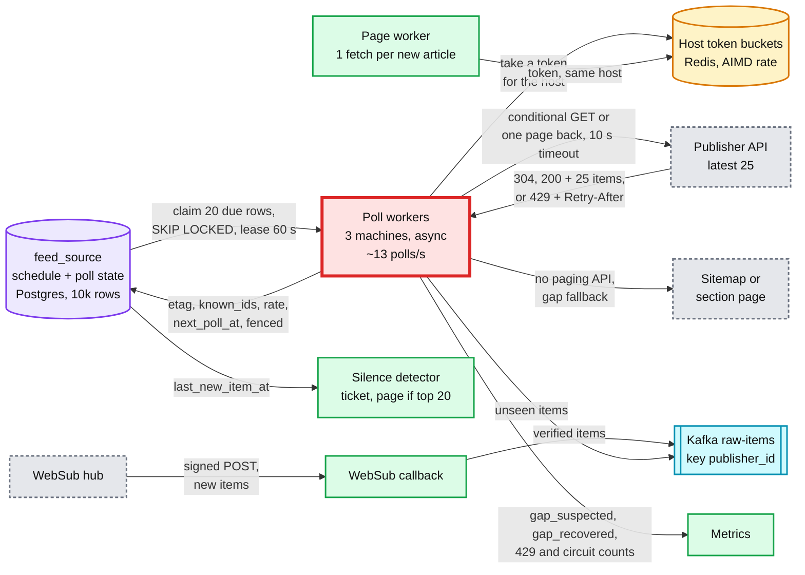
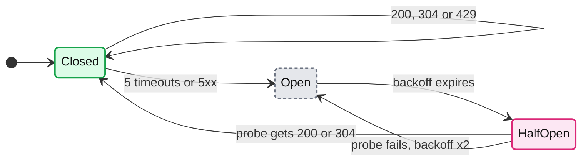
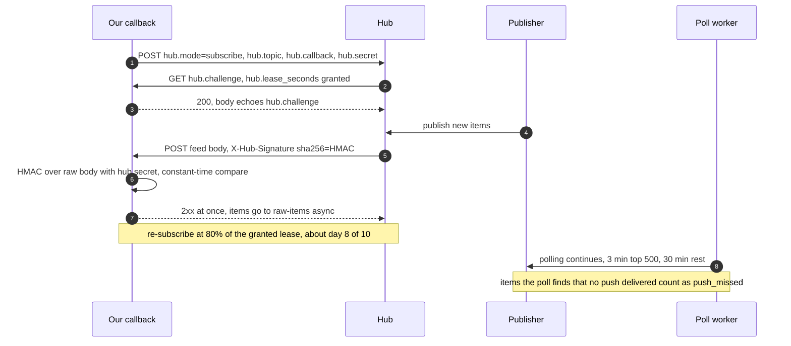

# Deep dive: publisher polling and rate limits

> One-line answer: the `feed_source` Postgres table is the scheduler. Workers claim due rows with `FOR UPDATE SKIP LOCKED` and a 60 s lease, send a conditional GET per source, and set the next poll to `T = max(T_min, min(T_fresh, 25 / 2λ))`, with a fast-attack λ and `T_min` from half the host budget, so the "latest 25" window always overlaps the last poll. Zero overlap (counting only known, unchanged items) flags a gap and triggers page-back on spare tokens. A 429 releases the row and halves the host's token bucket (AIMD). 5 straight failures open a per-publisher circuit. WebSub push speeds up publishers that offer it while polling continues, and a silence detector tells a lull from a break. At ~13 polls/s none of this is a capacity problem. The publisher's rate limit and its 25-item window are the only limits, and the real fix for the top publishers is a contract: push, a `since` parameter, or a higher limit.

Related: [`../solution.md`](../solution.md#51-publishers-return-only-their-latest-25-rate-limit-you-and-go-down-how-do-you-see-every-article-within-5-minutes) §5.1, [§2 window math](../solution.md#2-back-of-envelope), [Flow 6](../solution.md#flow-6-a-publisher-rate-limits-us-during-breaking-news-failure), [`dedup-and-story-clustering.md`](dedup-and-story-clustering.md) (what absorbs re-sent items), [`breaking-news-and-load-shedding.md`](breaking-news-and-load-shedding.md) (the burst from the reader side), [`../../../concepts/rate-limiting-and-load-shedding.md`](../../../concepts/rate-limiting-and-load-shedding.md), [`../../../concepts/leases-fencing-clocks.md`](../../../concepts/leases-fencing-clocks.md), [`../../distributed-job-scheduler/`](../../distributed-job-scheduler/) (when a table stops being enough).

## 1. The fetcher, zoomed in



- **Why red.** No number of workers changes a publisher's rate limit or its 25-item window. Fetch load is ~13 polls/s, ~50/s in a burst ([§10.3](../solution.md#103-capacity-math-per-component)): one machine, three for redundancy. Polls and WebSub pushes both land in `raw-items`, and the normalizer's unique constraints make their overlap harmless.

## 2. The table is the scheduler

```sql
WITH due AS (                                  -- claim: one short txn, no HTTP inside it
  SELECT source_id FROM feed_source
  WHERE next_poll_at <= now() AND (lease_until IS NULL OR lease_until < now())
  ORDER BY next_poll_at LIMIT 20 FOR UPDATE SKIP LOCKED)
UPDATE feed_source f
SET lease_until = now() + interval '60 seconds', lease_token = f.lease_token + 1  -- fencing
FROM due WHERE f.source_id = due.source_id
RETURNING f.source_id, f.endpoint_url, f.etag, f.known_ids, f.backfill_before, f.lease_token;

UPDATE feed_source                             -- finish: only the current lease holder writes
SET etag = $2, known_ids = $3, est_rate_per_min = $4, backfill_before = $5,
    next_poll_at = now() + make_interval(secs => $6), lease_until = NULL
WHERE source_id = $1 AND lease_token = $7;     -- 0 rows: lease lost, discard the result
```

- **`SKIP LOCKED`** lets 3 worker machines, each claiming up to 20 rows and fetching them concurrently, take disjoint rows without waiting. The claim commits before the HTTP call, so a slow publisher never holds a lock. The lease, not the lock, survives a crash: the row comes back in 60 s. An open circuit just sets `next_poll_at` to the backoff expiry, so the query needs no extra filter. **Postgres failover pauses claims for ~30 s** ([§10.4](../solution.md#104-failure-timeline)); `ORDER BY next_poll_at` then claims the most overdue, most gap-prone sources first.
- **Fencing.** A worker paused past its lease (GC, network) must not overwrite the new holder's `etag` and `known_ids`. `lease_token` is bumped on every claim, and the final `UPDATE ... WHERE lease_token = <mine>` makes a stale write a no-op ([leases and fencing](../../../concepts/leases-fencing-clocks.md)).
- **Page-back inside a claim.** The head poll plus at most 5 pages, each up to 10 s, can outlive the 60 s lease, so the worker renews the lease (`WHERE lease_token = <mine>`) before each page and stops if the renewal hits 0 rows. Pages use spare host tokens only, at most ~30 per source an hour. A new gap during a walk extends the running walk's stop boundary. An unfinished walk stores `backfill_before` and resumes on the next claim.
- **Why not a distributed scheduler.** 10,000 rows, ~13 claims/s, and the poll state is read and written on every poll anyway. A separate scheduler would be a second source of truth for the same row. At 10x (~110 claims/s) it is still one table. The [job scheduler problem](../../distributed-job-scheduler/) partitions and leases triggers because it has millions of jobs and second-level fire times. We have neither.

## 3. The window math

A poll every T minutes of a publisher posting λ items a minute sees λT new items. With a safety factor of 2, `T ≤ 25 / (2λ)`. The rule: `T = max(T_min, min(T_fresh, 25 / (2λ)))`, ±10% jitter. λ counts ids **entering** the window per minute: new items, plus edited items that an `updated`-sorted feed moves back to the top. `T_fresh` is 3 min for the top ~500, 15 min for the rest, 30 min for non-top sources that also push via WebSub. `T_min` comes from **half** the host's request budget.

| Publisher | λ (items/min) | 25 / 2λ | T_fresh | T used | Binding |
|---|---|---|---|---|---|
| Typical site, 30 a day | 0.02 | 10 h | 15 min | 15 min | Freshness |
| Top outlet, 300 a day | 0.2 | 62 min | 3 min | 3 min | Freshness |
| Wire service, 1,000 a day | 0.7 | 18 min | 3 min | 3 min | Freshness |
| Same wire, breaking | 5 | 2.5 min | 3 min | 2.5 min | **Window** |
| Live-blog storm | 25 | 30 s | 3 min | 60 s (`T_min`) | **Rate limit.** Window unsafe: page back |

- **Polls:** 500 / 180 s + 9,500 / 900 s = 2.8 + 10.6 = **~13/s**. p95 wait is 0.95T. Add the 5 s pipeline and the 30 s settle window: p95 publish to feed is ~3.4 and ~14.8 min against 5 and 30 min targets. A 304 keeps T and only feeds the rate estimate; lengthening T on quiet polls would break the freshness bound.
- **The lossless condition.** R requests a minute to one host for the feed (head polls plus pages) carry at most 25R items. With the factor of 2: **λ ≤ 12.5R**. R = 1/min covers 12.5 items/min; the 25/min storm needs R = 2/min. That is why `T_min` uses half the budget: the head takes one half, page-back always has the other.
- **Fast attack, slow decay.** An hour-of-week EWMA (exponentially weighted moving average) never saw this breaking story, so it lags exactly when it matters. So `λ = max(hour-of-week EWMA, EWMA of the last 3 polls, last poll's rate)`. A zero-overlap poll also drops T to `T_min` at once.

## 4. Gap detection and page-back

- **Overlap** = how many of the 25 returned items are known **and unchanged**. `known_ids` stores each item's id, canonical URL hash and an 8-byte title hash. An item counts if its id or its URL hash is known and its title hash is unchanged; a changed hash is an edit, forwarded as one. Overlap ≥ 1 proves the window reached back to the last poll. Overlap 0 on a non-first poll: **gap suspected**.
- **Why unchanged.** Many Atom feeds and CMS "latest" endpoints sort by `updated`. An edited old item jumps to the top and would fake overlap while new items fall off the bottom. A re-publish that bumps `updated` without touching title or summary does the same, so for `updated`-sorted feeds the unchanged test includes the `updated` stamp.
- **Guid churn.** Matching on the URL hash too means a one-time guid migration is not a gap. A CMS that mints a new guid on every fetch is flagged `unstable_guid` after 3 polls where a known canonical URL arrives under a new guid, and its ids become canonical URLs.
- **Page-back, best first.** `since=<cursor>` (one request, exact). `before=<oldest id>` (stable while items arrive). `page=2` (shifts; dedup absorbs repeats). Stop at the first page with a known id (at most 5 per claim, then resume from `backfill_before`). No paging API: sitemap or section page. `gap_suspected` minus `gap_recovered` per publisher is known loss: the ticket, and the evidence for the contract talk in §10.

## 5. Conditional GET, 429, AIMD and the circuit

- **Conditional GET.** `If-None-Match: <etag>` and `If-Modified-Since`. A 304 is ~300 B against ~50 KB for 25 items (our estimate), but still a TLS (Transport Layer Security) round trip, so reuse connections per host. If the publisher's own CDN caches the feed for 5 min, a 60 s poll gets the same document: read the `Age` header and never set T below their cache lifetime.
- **429 means slower, not retry, and never counts toward the circuit.** Parse `Retry-After` as seconds or an HTTP date (RFC 9110 §10.2.3), a date read against the response's own `Date` header so skew cannot shorten the wait. Release the row with `next_poll_at` at its expiry; never wait holding the lease. Over 1 h: a partnerships ticket.
- **AIMD (additive increase, multiplicative decrease) per host.** Halve the rate on a 429, add 1 request/min per 10 clean minutes up to the contract: 4/min drops to 2, back to 4 after 20 clean minutes. Per host, because a CMS platform can host hundreds of papers behind one limit, and the page worker's one fetch per new article (`og:image`, `rel=canonical`; ~3.5/s overall, ~35/s at peak) draws from the same bucket. Priority inside it: head polls, then page-back, then page fetches. In a 25/min storm the page worker wants 25 fetches a minute against a 2/min budget; if the site shares the API's limit, images wait, never polls. Where API and website are different hosts, they get separate budgets. The bucket is in Redis, taken atomically by a Lua script. Redis down: fail closed to 1 request/min per host from a local limiter, never open.



- **Backoff** 1, 2, 4, 8, 16, then 30 min, ±20% jitter, one probe each. A dead publisher costs one 10 s probe every ~30 min. Blast radius: that publisher's freshness. At a 3-min interval the circuit opens after ~15 min of failures, at `T_min` after ~5 min. **After closing**, the first good poll of a fast publisher will likely show overlap 0. Expected: page back.

## 6. WebSub push



- **Verify, then trust signatures.** Echoing `hub.challenge` proves we asked, so nobody can subscribe us to a feed we did not request. `X-Hub-Signature` is `method=signature` with sha1, sha256, sha384 or sha512 ([WebSub](https://www.w3.org/TR/websub/)). Unsigned or wrong: drop. **Leases:** hubs should "enforce short lived hub.lease_seconds (10 days is a good default)" and may ignore the value we ask for. Renew at 80% of the value granted in the verification request.
- **Why the top 500 still poll every 3 min.** A push that never arrives looks exactly like a quiet publisher. With a 30-min poll, a dead push would drop a top publisher from seconds to ~30 min and break the 5-min SLO (service level objective) with no alert. The 3-min poll bounds it. Two `push_missed` in an hour revert the source to plain polling at `T_fresh`.

## 7. Silent publishers

Rule: alert after zero **new** items for `max(9.2 / λ_new, 30 min)`, where λ_new counts new items only. For a Poisson publisher P(zero in t) = e^(-λt), and e^-9.2 ≈ 1e-4.

| Publisher (daytime λ) | Expected gap | Old rule, max(3 gaps, 2 h) | Rule now |
|---|---|---|---|
| Wire, 0.7/min | 1.4 min | 2 h | 30 min (the floor; 9.2 / λ = 13 min) |
| Top outlet, 0.2/min | 5 min | 2 h | 46 min |
| Typical site, 0.02/min | 50 min | 2.5 h, 5% false alarm | 7.7 h |

- **Why it changed.** The 3x rule fired on e^-3 = 5% of quiet windows: ~9,500 x 5 daytime windows x 5% = ~2,400 false tickets a day [estimate]. At 1e-4 it is ~5 a day, and a silent wire is caught in 30 min, not 2 h. **λ_new, not the scheduling λ:** that one counts edits entering the window, so an edit-heavy publisher would get a threshold far shorter than its real publishing rate justifies. Real publishing is burstier than Poisson, so confirm with one signal below. A top-20 publisher pages; the rest open a ticket.

| Signal | Likely cause | Action |
|---|---|---|
| 304 with the same ETag for hours | Their feed generator is stuck | Ticket to the publisher, sitemap as a stopgap |
| 200 with only old items | Lull, or stuck | Homepage has newer links: stuck. Else a lull |
| Parse errors | We broke, or they changed format | Roll back the parser. Keep 24 h of raw bodies to replay |
| 403, or an HTML challenge page | We are blocked | Partnerships call. Never rotate IPs to evade |
| Homepage newer than the feed | Wrong or deprecated endpoint | Re-discover the feed URL |

## 8. Simulation: fixed vs adaptive over one day

One top-500 wire publisher (`T_fresh` 3 min). λ is 0.1/min at night, 0.9/min by day, **25/min from 18:00 to 18:20**, then 5/min for an hour. The API returns the latest 25 and pages back with `before=` up to 250 items deep [assumption]. Every request takes a host token. Page-back uses spare tokens only, at most 30 pages an hour. `T_min` is half the budget: 60 s at 2/min, 120 s at 1/min. Freshness is first seen minus published, plus ~35 s (5 s pipeline, 30 s settle window). Stdlib only: `python3 poll_sim.py`.

```python
import bisect, random
DAY, PAGE, DEPTH, PIPE = 86_400, 25, 250, 35   # PIPE: 5 s pipeline + 30 s settle; DEPTH: API pages back 250 items [assumption]
def lam(t):                                     # true items per minute
    m = t / 60
    if 1080 <= m < 1100: return 25.0            # 18:00 to 18:20 breaking burst
    if 1100 <= m < 1160: return 5.0             # follow-ups until 19:20
    return 0.1 if m < 360 else 0.9              # quiet night, normal wire day
def prior(t): return 0.1 if t < 21600 else 0.9  # hour-of-week EWMA: it never saw this burst
def publish(seed=7):                            # thinning: non-homogeneous Poisson
    rng, t, out = random.Random(seed), 0.0, [-60.0 * k for k in range(PAGE, 0, -1)]  # 25 old items
    while (t := t + rng.expovariate(25 / 60)) < DAY:
        if rng.random() < lam(t) / 25: out.append(t)
    return out
def run(pub, fixed_T=None, per_min=2.0, t_fresh=180, t_min=60, pages_per_h=30, walks_per_h=99):
    rng, seen, known = random.Random(1), {i: 0 for i in range(PAGE)}, set(range(PAGE))
    tokens, cap, next_head, last_head, ewma = 1.0, max(1.0, per_min), 0, 0, prior(0)
    jobs, starts, stamps, polls, pages, gaps, recovered = [], [], [], 0, 0, 0, 0
    for t in range(DAY + 3600):                 # keep polling 1 h after the last publish
        tokens = min(cap, tokens + per_min / 60)
        n = bisect.bisect_right(pub, t)
        if t >= next_head and tokens >= 1:      # head poll has priority
            tokens -= 1; polls += 1; resp = range(n - PAGE, n)
            overlap, new = sum(i in known for i in resp), [i for i in resp if i not in seen]
            seen.update(dict.fromkeys(new, t)); known = set(resp)
            if fixed_T: next_head = t + fixed_T
            else:
                obs = len(new) / max((t - last_head) / 60, 1e-9)       # fast attack
                ewma = 0.7 * ewma + 0.3 * obs                            # slow decay
                T = min(t_fresh, 25 / (2 * max(prior(t), ewma, obs)) * 60) * rng.uniform(0.9, 1.1)
                if overlap == 0:                                         # gap suspected
                    gaps += 1; T = t_min; starts = [s for s in starts if s > t - 3600]
                    if len(starts) < walks_per_h: starts.append(t); jobs.append(n - PAGE)
                next_head = t + max(t_min, T)          # T = max(T_min, min(T_fresh, 25/2λ))
            last_head = t
        elif jobs and tokens - 1 + (next_head - t) * per_min / 60 >= 1 \
                and sum(s > t - 3600 for s in stamps) < pages_per_h:            # spare token, page cap
            before = jobs[0]; lo = max(before - PAGE, n - DEPTH)
            if lo >= before: jobs.pop(0); continue                          # past API depth: lost
            tokens -= 1; pages += 1; stamps.append(t)
            got = [i for i in range(lo, before) if i not in seen]
            seen.update(dict.fromkeys(got, t)); recovered += len(got)
            if len(got) < before - lo or lo == n - DEPTH: jobs.pop(0)       # hit a known id
            else: jobs[0] = lo
    def p95(ids):
        f = sorted((seen[i] - pub[i] + PIPE) / 60 for i in ids if i in seen)
        return f[int(0.95 * (len(f) - 1))]
    real = range(PAGE, len(pub))
    burst = [i for i in real if 64800 <= pub[i] < 69600]                   # 18:00 to 19:20
    return polls, pages, gaps, sum(i not in seen for i in real), recovered, p95(real), p95(burst)
pub = publish()
print(f"published {len(pub) - PAGE} items; burst 18:00 to 18:20 at 25/min")
print(f"{'policy':23}{'polls':>6}{'pages':>6}{'gaps':>5}{'missed':>7}{'recovered':>10}{'p95 min':>8}{'burst p95':>10}")
for name, kw in [("fixed 15 min", dict(fixed_T=900)), ("fixed 3 min", dict(fixed_T=180)),
                 ("adaptive, 2/min", {}), ("old cap, 3 walks/h", dict(walks_per_h=3)),
                 ("adaptive, 1/min", dict(per_min=1.0, t_min=120))]:    # T_min = half the budget
    p, pg, g, miss, rec, a, b = run(pub, **kw)
    print(f"{name:23}{p:>6}{pg:>6}{g:>5}{miss:>7}{rec:>10}{a:>8.1f}{b:>10.1f}")
```
Output:
```
published 1774 items; burst 18:00 to 18:20 at 25/min
policy                  polls pages gaps missed recovered p95 min burst p95
fixed 15 min              100     0    0    671         0    14.6      12.3
fixed 3 min               500     0    0    340         0     3.5       3.4
adaptive, 2/min           521    11   11      0        46     3.3       2.5
old cap, 3 walks/h        521     3   11     27        19     3.3       2.5
adaptive, 1/min           509    13   10      0       245     4.4       6.2
```

- **Fixed 15 min loses 671 of 1,774 items (38%) and flags 0 gaps:** silent loss, and its p95 looks healthy only because it measures what it saw. **Fixed 3 min polls 5x more and still loses 340:** a freshness bound alone does not buy completeness.
- **Adaptive, solution rules, 2/min: 11 pages recover all 46 overflowed items, 0 missed,** p95 3.3 min, burst p95 2.5 min. **The old cap of 3 walks an hour lost 27 of them.** Spare tokens already bound the extra load, so a walk cap only binds in a storm, exactly when walks matter. Hence the page cap and walk extension.
- **1/min: λ = 25 breaks λ ≤ 12.5R.** This 20-min burst loses nothing only because the API pages back 250 items: page-back finishes late, burst p95 6.2 min, past the 5-min target. The same run with a 60-min burst loses 131 items, all flagged. That is the number to take to the publisher.

## 9. How Miniflux schedules, and why ours differs

Miniflux, a self-hosted reader, defaults to `POLLING_FREQUENCY` 60 min with `BATCH_SIZE` 100 feeds per interval, and its opt-in entry-frequency scheduler adapts each feed between 5 and 1,440 min ([docs](https://miniflux.app/docs/configuration.html)). That fits one person's feeds, where an hour of lag is fine. Ours differs in three ways the 100 M-reader, 5-min p95 target forces: a 3 or 15 min freshness cap, the window bound `25 / 2λ` with overlap checks and page-back, and a per-host AIMD budget. Its knobs schedule by cadence and entry frequency; none of the ones above reasons about a fixed 25-item window.

## 10. The Staff move: ask the publisher

| Ask | What it fixes | The number |
|---|---|---|
| WebSub or a webhook | Seconds of freshness, no window problem | Keep polling and `push_missed` |
| A `since=<cursor>` parameter | No loss while the cursor is retained | A 30-min outage recovers in a few requests |
| A higher limit | More items per minute | 2 req/min: lossless to λ = 25. 100 items at 1 req/min: λ = 50 |

Rank publishers by unrecovered gaps times clicks and take the top 20 to partnerships, with the gap metric as evidence. This is a business conversation, and saying so is the Staff signal.

## 11. Trade-offs

| Decision | Chose | Gave up |
|---|---|---|
| Scheduler | `feed_source` + `SKIP LOCKED` + fenced lease | Scale past thousands of claims/s. Not needed at ~13/s |
| Interval | Min of freshness and window, floored by half the host budget | Storm head polls at 60 s, not 30 s |
| Page-back | ≤ 5 pages per claim, spare tokens, ~30 pages/h | Recovery takes minutes; a long storm at a low limit still loses |
| Loss | Detect and count, not prevent | "No loss" is impossible with a 25-item API and a rate limit |

## 12. What the interviewer probes next

- **"Two workers poll the same source?"** The lease makes it rare, the fencing token makes it harmless. Worst case: one extra request, deduped by `known_ids` and the unique indexes.
- **"How do you know your freshness number?"** Poll time minus `published_at` (the publisher's claim, which can lie), plus card-visible minus poll. For push publishers the hub's delivery time is ground truth.
