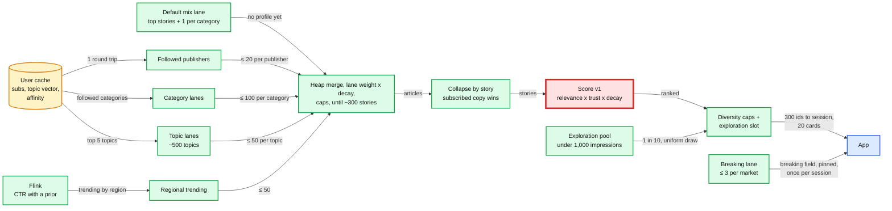
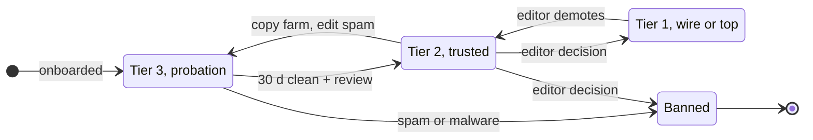

# Deep dive: ranking and cold start

> One-line answer: v1 ranking is an explainable formula run in the feed server's memory. Take ~500 candidates from lanes with per-lane quotas, collapse to one card per story, and score `(1.0 subscribed + 0.8 topic_match + 0.5 publisher_affinity + 0.6 click_velocity + 0.3 coverage) x trust x 0.5^(age_hours / 6)`. Then allow at most 2 cards per publisher and 3 per category in any 10, and give 1 slot in 10 to a uniform exploration draw. Content features rank the new article nobody has clicked. Popularity, onboarding and the exploration slot serve the new user. Trust tiers gate the new publisher. A GBDT (gradient-boosted trees) replaces the formula only after it beats it behind a 1% holdout with CTR (click-through rate) and diversity guardrails.

Related: [`../solution.md`](../solution.md#56-a-new-user-a-new-article-a-new-publisher-what-do-they-see) §5.6 and [§4.3](../solution.md#43-personalized-feed-subscriptions-plus-recommendations-one-card-per-story), [`dedup-and-story-clustering.md`](dedup-and-story-clustering.md) (stories, leads, story age), [`feed-read-path-and-fan-out.md`](feed-read-path-and-fan-out.md) (the in-memory lanes), [`pagination-and-feed-sessions.md`](pagination-and-feed-sessions.md) (the frozen session), [`breaking-news-and-load-shedding.md`](breaking-news-and-load-shedding.md) (the breaking lane), [`../../../concepts/stream-processing.md`](../../../concepts/stream-processing.md) (windows for click velocity), [`../../../concepts/caching-patterns.md`](../../../concepts/caching-patterns.md) (the user cache).

---

## 1. Candidate lanes



- **A weighted heap with per-lane caps, not newest-first.** The heap is keyed by `lane_weight x 0.5^(age_hours / 6)` (each lane is already newest-first), and caps stop any lane at 20 per followed publisher, 100 per category, 50 per topic, 50 trending. It pops until it holds ~300 distinct stories (~500 ids), and drops anything over 72 h. Caps alone did not fix starvation: a cap holds a busy lane down but never lifts a quiet one, so the weight does that. 300k articles a day over ~50 categories is ~6,000 per category a day, ~250 an hour. A plain "newest 500 across all lanes" for a user who follows two average categories is their last hour (2 x 250), and a subscribed publisher that posts twice a day never makes the cut. A user with no profile gets the default-mix lane instead: the formula alone would be pure popularity. An item whose `published_at` was over 48 h old at first sight never enters a fresh lane.
- **Why the scorer is red.** At the ~120k/s spike, the feed tier is the first thing short of CPU (solution §10.3), and ranking ~500 candidates is about half of the ~2 ms per request. The formula costs microseconds. A v2 model must fit the same ~1 ms.

## 2. The v1 score

| Feature | Weight | Definition, 0 to 1 | Source |
|---|---|---|---|
| `subscribed` | 1.0 | 1 if a followed publisher is in the story, 0.5 if only its category is followed | User cache |
| `topic_match` | 0.8 | Cosine of the user's topic vector and the story's top 5 topics (16 B on the card: 5 x topic id + weight) | Card, profile |
| `publisher_affinity` | 0.5 | EWMA (exponentially weighted moving average) of the user's clicks on the shown copy's publisher | Profile |
| `click_velocity` | 0.6 | Regional CTR over the last 15 min with a prior, scaled so the region's p99 story is 1 [estimate]. Raw clicks while impressions are shed | Flink |
| `coverage` | 0.3 | `log(1 + n) / log(201)`, n = independent tier 1 and 2 publishers, so 200 is 1.0 | Story |
| trust | x | 1.0, 0.85, 0.7 for publisher tiers 1, 2, 3 (the shown copy's publisher), and 1.0 for any publisher the user follows. A prior, not a filter. Fallback 1.0, 1.0, 0.7 if the holdout shows tier 2 losing | Publisher |
| decay | x | `0.5^(age_hours / 6)`, age = `now - min(published_at, ingested_at)` over the story's members | Story |

**Worked example**, user Priya, who follows HT and Education (numbers from the runnable code in §9):

| Story | sub | topic | aff | vel | cov | relevance | trust | age | decay | **score** |
|---|---|---|---|---|---|---|---|---|---|---|
| s1 RBI holds repo rate (HT, followed) | 1.00 | 0.82 | 0.80 | 0.20 | 0.48 | 2.32 | 1.00 | 1 h | 0.891 | **2.07** |
| s2 6.8 quake off Japan (AP, tier 1) | 0 | 0 | 0 | 1.00 | 0.99 | 0.90 | 1.00 | 0.5 h | 0.944 | **0.85** |
| s3 Board exam results (HT, followed) | 1.00 | 0.69 | 0.80 | 0.10 | 0.34 | 2.11 | 1.00 | 12 h | 0.250 | **0.53** |
| s4 Battery doubles range (TechDaily, tier 2) | 0 | 0.26 | 0.40 | 0.30 | 0.26 | 0.67 | 0.85 | 3 h | 0.707 | **0.40** |

- s1: `1.0 x 1 + 0.8 x 0.82 + 0.5 x 0.80 + 0.6 x 0.20 + 0.3 x 0.48 = 1.000 + 0.656 + 0.400 + 0.120 + 0.145 = 2.32`, then `x 1.0 (trust: HT is followed) x 0.5^(1/6) (0.891) = 2.07`.
- **The lesson is s3.** It has the second-highest relevance (followed publisher and followed category), but at 12 h old it scores 0.53, below an unfollowed quake at 0.85. After half a day, the half-life decides, not relevance.

## 3. The 6 h half-life, and Reddit's hot as a contrast

| Age | 1 h | 6 h | 12 h | 24 h | 48 h | 72 h |
|---|---|---|---|---|---|---|
| Decay | 0.89 | 0.50 | 0.25 | 0.063 | 0.0039 | 0.00024 |
| Relevance needed to tie a fresh story | 1.1x | 2x | 4x | 16x | 256x | 4,096x |

- **Relevance is bounded.** It runs from ~0.1 to 3.2 (the sum of the weights) and trust is at most 1, so a 30 h old story scores at most `3.2 x 0.5^5 = 0.1`, what a fresh story with minimal relevance scores. For You is in effect a one-day feed. The 72 h corpus serves Following, story pages and lane depth. 10x the relevance buys `6 x log2(10) ≈ 20 h` of age. The first thing v2 should learn is a per-category half-life: a score line dies in hours, an explainer lives for days.
- **Reddit's hot**: `sign x log10(max(|score|, 1)) + seconds / 45000` ([`_sorts.pyx`](https://github.com/reddit-archive/reddit/blob/master/r2/r2/lib/db/_sorts.pyx)), with seconds counted from a fixed epoch to the post time. 45,000 s = 12.5 h, so 10x the votes is worth 12.5 h. As a decay that is a half-life of `45,000 x log10(2) ≈ 13,500 s ≈ 3.8 h`, faster than our 6 h.
  - *Same order, different storage.* Ranking by `rel x 0.5^(age/6h)` gives the same order as `log2(rel) + t_story / 6h`, where `t_story` is the story's earliest time. So our score is also time-invariant. But `rel` is per user, so it cannot live in one global sorted index the way Reddit's can.
  - *Unbounded vs bounded.* Votes are log-scaled but unbounded. Our relevance tops out at 3.2, so time always wins after ~30 h.
  - *Global vs personal.* Reddit's hot is popularity only. In ours, 2.3 of the 3.2 weight is personal.

## 4. One card per story, diversity, exploration

- **One card per story.** Collapse happens before scoring, so the score is per story. The copy is the user's followed publisher's, else the lead ([dedup deep dive §9](dedup-and-story-clustering.md)). **At most 2 cards per publisher in any 10.** Greedy: walk the ranked list and take the best story that passes. The runnable code shows the cost: Priya's third HT story leaves page 1 even though she follows HT.
- **At most 3 per category in any 10.** Without it a popularity-heavy page piles into politics and celebrity. For a user with no profile, the default-mix lane (top stories plus one per popular category) supplies PracHub's "reasonable default mix", and the cap keeps it mixed.
- **The exploration slot is position 7 of every 10**, a uniform random draw from the exploration pool. Uniform on purpose: those impressions are the random log that offline evaluation needs (§7). Cost [estimate]: 10% of slots at roughly half the CTR is ~5% of clicks.

## 5. Signals: click velocity and the profile

- **Click velocity.** A Flink job keyed by `(story_id, region)` runs a sliding 15 min window, drops a repeat `(user_id, session_id, article_id)` within 10 min, and drops click-farm users. It emits CTR with a prior, `(clicks + a) / (impressions + b)` against the expected CTR at that position [estimate for a, b], so position does not feed back on itself. Impressions come through the events collector, which is shed first, so while it sheds the feature falls back to raw clicks. It ships to every feed server every ~10 s [estimate].
- **Profile.** The profile keeps the user's top ~50 of ~500 topics, weighted (~150 B). Lanes read its top 5, and each card carries its own top 5 (16 B). On each click, `v = 0.9 v + 0.1 t_story` (α = 0.1 [estimate]), so a click's weight halves after ~6.6 clicks. Publisher affinity is the same EWMA over publisher ids. Flink keyed by `user_id` writes it to the durable profile store and the user cache in ~10 s (~1 KB per user). In v1, impressions without a click do not move the profile: position bias makes them too noisy.
- **A click changes the next session, not this one.** The session is frozen for 20 min. For a new user, whose first session matters most, re-order only the unserved tail of the same 300 ids with the updated profile. Nothing is added or removed, so no duplicates and no skips.

## 6. Why content-based matters for news

Collaborative filtering ranks an item by who else clicked it, and a story is news for hours. [Liu, Dolan, Pedersen, IUI 2010](https://static.googleusercontent.com/media/research.google.com/en//pubs/archive/35599.pdf) name this the "first-rater problem" for Google News. Their fix is a content-based profile of each user's topic interests, combined with the collaborative signal. It raised CTR by 30.9% over the collaborative-only method, and the test group visited 14.1% more often than control. That is why `topic_match` is in v1 from day one. A new article gets its topics from its own text at ingest, before its first click.

## 7. Cold start, and moving to a learned model



- **New user.** Before onboarding: the regional, language-matched default-mix lane, scored by v1 with an empty profile (only velocity, coverage and trust), the category cap, and the breaking lane. Onboarding asks for 3 or more categories or publishers. `subscribed` lights up on the next refresh: the store write bumps `subs_version`, the app sends it with the feed request, and a cache entry older than that is read from the store. Until 20 clicks [estimate], the exploration slot also draws from categories not yet on the page.
- **v2 for the slot: LinUCB** ([Li et al., WWW 2010](https://arxiv.org/pdf/1003.0146)). On the Yahoo! Today Module, "over 33 million events", it showed "a 12.5% click lift compared to a standard context-free bandit algorithm", and the advantage grew as data got scarcer, which is cold start exactly. Know the setting: one featured slot, an editor-curated pool refreshed hourly, measured offline by replaying a random bucket. It fits our exploration slot, not the whole 20-card page.
- **New article.** Topics come from its text, so `topic_match` works at once. Velocity and coverage start at 0. 1 B pages x 2 exploration slots is ~2 B exploration impressions a day over 300k new articles, ~6,700 each, so 1,000 impressions takes hours, not days.
- **New publisher, tier 3.** It cannot lead a story that has a tier 1 or 2 member. It is left out of `coverage` and the breaking trigger (copy farms). It is eligible for exploration, the only way it earns a CTR. Its lower prior is the `x 0.7` trust term.
- **v2 model.** A GBDT on click logs: the 5 features plus age, category, tier, hour and position. Position is used in training and fixed at inference, which reduces position bias. Label: a click, minus bounce-backs (the app is back in front within 10 s). It runs in-process and re-ranks only v1's top ~100: 100 x ~200 trees x depth 6 is ~120k node visits, well inside ~1 ms [estimate]. Scoring all 500 at LinkedIn FollowFeed's ~50 µs p99 per record ([LinkedIn](https://www.linkedin.com/blog/engineering/feed/followfeed-linkedin-s-feed-made-faster-and-smarter)) would be ~25 ms.
- **Rollout.** Shadow-score and log only, then 1% vs v1 for 7 days, then ramp 5, 25, 50 and 100%. Keep a permanent 1% holdout on v1 to catch long-term effects. Rollback is an experiment flip. Guardrails beside CTR per user-day: distinct publishers and categories per 20 cards, the top-20 publishers' share of impressions, median card age, bounce-back rate, sessions per user-day, feed p99 < 200 ms. 1% is ~1 M users a day. At ~5 clicks per user-day with a standard deviation of ~8 [estimate], the standard error is `8 / sqrt(1 M) = 0.008`, 0.16% of the mean, so a week resolves lifts well under 1%.
- **Offline vs online.** Offline AUC or NDCG on click logs only covers what v1 chose to show, in v1's positions. Use it to reject models, not to pick winners. The uniform exploration slot is Li et al.'s random bucket, so replay on it gives an unbiased estimate for one slot. Only the online A/B decides. Liu et al.'s +14.1% visits is an online number, and visits are what a news product lives on.

## 8. Feedback loops and popularity bias

- **The loop:** ranked high, more impressions, more clicks, higher velocity, ranked higher. CTR with a position prior (§5) breaks it, except while impressions are shed: then raw clicks feed back for the length of the spike. **Popularity is 0.9 of the 3.2 weight** (velocity + coverage), and 100% for a new user. Trust, the diversity caps, the exploration slot and the concentration guardrail push back.
- **Clickbait and inherited bias.** CTR rewards clickbait, and we cannot see dwell time because we redirect out, so bounce-back time is the proxy. v2 learns v1's bias from v1's logs, so up-weight exploration impressions by inverse propensity [proposed].

## 9. Runnable Python: the v1 scorer

Stdlib only. Save as `v1_ranker.py`, run `python3 v1_ranker.py`.

```python
import hashlib, math, random

W = {"sub": 1.0, "topic": 0.8, "aff": 0.5, "vel": 0.6, "cov": 0.3}   # solution.md §4.3
TRUST = {1: 1.0, 2: 0.85, 3: 0.7}                                    # by publisher tier
HALF_LIFE_H, PUB_CAP, CAT_CAP, WINDOW = 6.0, 2, 3, 10                 # caps per any 10 cards
EXPLORE_POS, EXPLORE_MAX_IMPR = 7, 1_000                              # slot 7 of every 10

# (story, publisher, tier, category, topics, age_h, CTR score 0..1, tier 1-2 publishers, impressions)
STORIES = [
    ("s1 RBI holds repo rate",       "HT",        2, "business",  {"economy": .8, "india": .6},  1.0, .20,  12, 900_000),
    ("s2 6.8 quake off Japan",       "AP",        1, "world",     {"disaster": .9, "japan": .7}, 0.5, 1.0, 190, 3_000_000),
    ("s3 Board exam results",        "HT",        2, "education", {"education": .9, "india": .5}, 12., .10,   5, 400_000),
    ("s4 Battery doubles range",     "TechDaily", 2, "science",   {"science": .8, "energy": .6}, 3.0, .30,   3, 50_000),
    ("s5 India win cricket series",  "NDTV",      2, "sports",    {"cricket": 1., "india": .4},  2.0, .60,  40, 700_000),
    ("s6 Monsoon reaches Kerala",    "HT",        2, "india",     {"weather": .8, "india": .7},  1.5, .40,  15, 300_000),
    ("s7 Election debate recap",     "Reuters",   1, "politics",  {"politics": 1., "usa": .6},   4.0, .80,  80, 2_000_000),
    ("s8 Senate passes budget",      "AP",        1, "politics",  {"politics": .9, "usa": .7},   6.0, .70,  60, 1_500_000),
    ("s9 Local startup seed round",  "NewSite",   3, "business",  {"startups": .9, "india": .3}, 1.5, .00,   1, 120),
    ("s10 Timetable reform plan",    "EduWeekly", 2, "education", {"education": .9},             5.0, .10,   2, 300),
    ("s11 Celebrity wedding",        "Gossip",    3, "celebrity", {"celebrity": 1.},             2.0, .90,  25, 800_000),
    ("s12 Parliament session opens", "Reuters",   1, "politics",  {"politics": .9, "india": .6}, 3.0, .50,  30, 600_000),
]
USERS = {"priya (follows HT + Education)": {"pubs": {"HT"}, "cats": {"education"},
             "profile": {"india": .6, "economy": .5, "education": .4, "science": .3},
             "affinity": {"HT": .8, "TechDaily": .4, "NDTV": .2}},
         "new user (no history)": {"pubs": set(), "cats": set(), "profile": {}, "affinity": {}}}
def cosine(a, b):
    dot = sum(v * b.get(k, 0) for k, v in a.items())
    na, nb = (math.sqrt(sum(v * v for v in x.values())) for x in (a, b))
    return dot / (na * nb) if na and nb else 0.0
def score(s, u):
    _, pub, tier, cat, topics, age, vel, n_pubs, _ = s
    f = {"sub": 1.0 if pub in u["pubs"] else 0.5 if cat in u["cats"] else 0.0,
         "topic": cosine(u["profile"], topics), "aff": u["affinity"].get(pub, 0.0), "vel": vel,
         "cov": min(1.0, math.log(1 + n_pubs) / math.log(201))}      # 200 publishers = 1.0
    rel = sum(W[k] * f[k] for k in W)
    f["trust"] = 1.0 if pub in u["pubs"] else TRUST[tier]           # followed publisher: exempt
    return rel * f["trust"] * 0.5 ** (age / HALF_LIFE_H), rel, f
def rank(name, u, n=10):
    ranked = sorted(STORIES, key=lambda s: -score(s, u)[0])
    rng = random.Random(hashlib.sha256(name.encode()).digest())      # same user + session, same draw
    page, left = [], list(ranked)
    while left and len(page) < n:
        if len(page) % WINDOW == EXPLORE_POS - 1:                     # the exploration slot
            shown = {p[3] for p, _ in page}
            pool = [s for s in left if s[8] < EXPLORE_MAX_IMPR or (not u["profile"] and s[3] not in shown)]
            if pool:
                pick = rng.choice(pool)                               # uniform: doubles as the replay log
                page.append((pick, "EXPLORE")); left.remove(pick); continue
        recent = [p for p, _ in page[-(WINDOW - 1):]]
        ok = [s for s in left if sum(p[1] == s[1] for p in recent) < PUB_CAP
              and sum(p[3] == s[3] for p in recent) < CAT_CAP]
        pick = ok[0] if ok else left[0]                               # best item that passes diversity
        page.append((pick, "" if ok else "cap relaxed")); left.remove(pick)
    print(f"\n{name}\n{'#':>2} {'story':30}{'publisher':10}{'category':10}{'rel':>5}{'trust':>6}{'decay':>6}{'score':>6}  note")
    for i, (s, note) in enumerate(page, 1):
        sc, rel, f = score(s, u)
        note = (note + (" subscribed" if f["sub"] == 1.0 else "")).strip()
        print(f"{i:>2} {s[0]:30}{s[1]:10}{s[3]:10}{rel:5.2f}{f["trust"]:6.2f}{0.5 ** (s[5] / HALF_LIFE_H):6.2f}{sc:6.2f}  {note}")
    print("   pure score order:", " ".join(s[0].split()[0] for s in ranked[:n]))
u = USERS["priya (follows HT + Education)"]
print("worked example, priya:  sub  topic  aff   vel   cov   rel trust  age  decay  score")
for s in STORIES[:4]:
    sc, rel, f = score(s, u)
    print(f"  {s[0][:24]:24}" + "".join(f"{f[k]:5.2f} " for k in W) + f"{rel:5.2f} {f['trust']:5.2f} {s[5]:4.1f} {0.5 ** (s[5] / 6):5.3f} {sc:6.3f}")
for name, user in USERS.items():
    rank(name, user)
```

Output:

```
worked example, priya:  sub  topic  aff   vel   cov   rel trust  age  decay  score
  s1 RBI holds repo rate   1.00  0.82  0.80  0.20  0.48  2.32  1.00  1.0 0.891  2.068
  s2 6.8 quake off Japan   0.00  0.00  0.00  1.00  0.99  0.90  1.00  0.5 0.944  0.847
  s3 Board exam results    1.00  0.69  0.80  0.10  0.34  2.11  1.00 12.0 0.250  0.529
  s4 Battery doubles range 0.00  0.26  0.40  0.30  0.26  0.67  0.85  3.0 0.707  0.400

priya (follows HT + Education)
 # story                         publisher category    rel trust decay score  note
 1 s1 RBI holds repo rate        HT        business   2.32  1.00  0.89  2.07  subscribed
 2 s6 Monsoon reaches Kerala     HT        india      2.14  1.00  0.84  1.80  subscribed
 3 s2 6.8 quake off Japan        AP        world      0.90  1.00  0.94  0.85
 4 s5 India win cricket series   NDTV      sports     0.86  0.85  0.79  0.58
 5 s12 Parliament session opens  Reuters   politics   0.78  1.00  0.71  0.55
 6 s10 Timetable reform plan     EduWeekly education  0.97  0.85  0.56  0.46
 7 s9 Local startup seed round   NewSite   business   0.20  0.70  0.84  0.12  EXPLORE
 8 s7 Election debate recap      Reuters   politics   0.73  1.00  0.63  0.46
 9 s11 Celebrity wedding         Gossip    celebrity  0.72  0.70  0.79  0.40
10 s4 Battery doubles range      TechDaily science    0.67  0.85  0.71  0.40
   pure score order: s1 s6 s2 s5 s12 s3 s10 s7 s11 s4

new user (no history)
 # story                         publisher category    rel trust decay score  note
 1 s2 6.8 quake off Japan        AP        world      0.90  1.00  0.94  0.85
 2 s7 Election debate recap      Reuters   politics   0.73  1.00  0.63  0.46
 3 s11 Celebrity wedding         Gossip    celebrity  0.72  0.70  0.79  0.40
 4 s5 India win cricket series   NDTV      sports     0.57  0.85  0.79  0.38
 5 s12 Parliament session opens  Reuters   politics   0.49  1.00  0.71  0.35
 6 s8 Senate passes budget       AP        politics   0.65  1.00  0.50  0.33
 7 s4 Battery doubles range      TechDaily science    0.26  0.85  0.71  0.16  EXPLORE
 8 s6 Monsoon reaches Kerala     HT        india      0.40  0.85  0.84  0.28
 9 s1 RBI holds repo rate        HT        business   0.27  0.85  0.89  0.20
10 s10 Timetable reform plan     EduWeekly education  0.12  0.85  0.56  0.06
   pure score order: s2 s7 s11 s5 s12 s8 s6 s1 s4 s10
```

- **Why the trust term exists.** Without it, the same run put s11, a tier 3 gossip story, at #2 for the new user and #5 for Priya. With `x 0.7` it scores 0.40: #3 and #9. It still ranks for the new user, because a 0.9 CTR score is real signal and trust is a prior, not a filter. The default-mix lane and the category cap are what keep a cold page balanced.
- **Priya.** Her two HT stories take 1 and 2. Her third, s3 (followed publisher, followed category), is 6th by score and falls off page 1 on the publisher cap. Trust does not touch her HT stories, because she follows HT. The tier 3 startup story s9 takes slot 7 through exploration: the only way a new publisher gets seen.
- **New user.** Every relevance is `0.6 x CTR + 0.3 x coverage`: popularity. Politics hits exactly the cap of 3. Exploration pulled s4 from science, a category not yet on the page.

## 10. Trade-offs

| Decision | Chose | Rejected | Why |
|---|---|---|---|
| v1 ranker | Weighted formula, 5 features x trust x decay | GBDT from day one | No click logs yet. Explainable, debuggable, microseconds |
| Freshness | 6 h half-life on the story's earliest `min(published_at, ingested_at)` | Newest first, or the shown copy's age | A copy or re-post cannot reset age |
| Candidates | Heap on lane weight x decay, per-lane caps | Newest 500 overall | Busy categories starve quiet subscriptions |
| New items | Content `topic_match` + exploration | Collaborative only | First-rater problem: +30.9% CTR |
| Exploration | Uniform draw, 1 slot in 10 | Bandit on the whole page | Unbiased replay log. LinUCB is v2, for the slot |
| Launching a model | Shadow, 1%, guardrails, permanent holdout | Straight ramp on offline AUC | Offline logs carry v1's bias |
| Refused | A separate ranking service, real-time model training, per-user precomputed feeds | | A network hop per request (solution §10.7), and complexity no experiment has justified yet |

## 11. What the interviewer probes next

- **"Evolve from a popularity baseline to personalization without tanking CTR."** Shadow, then 1% with guardrails, ramp, permanent holdout. The formula stays as the fallback and the baseline.
- **"Why not collaborative filtering?"** The article is gone before it has raters. Content features first, collaborative signals as GBDT features later.
- **"A new user opens the app. What do they see?"** The default-mix lane with a category cap, the breaking lane, one exploration slot, and onboarding. It is personal from the next refresh after they pick 3 topics.
- **"How do you know v2 is better?"** Not from offline AUC on v1's logs. From replay on the random exploration slot, then the online A/B on CTR and visits.
