# Diagrams: news aggregator / personalized news feed

> One-line answer: the D1 to D12 set from `hld/CLAUDE.md` §4, each drawn once. The diagrams already embedded in [`solution.md`](solution.md) are linked here, not repeated. Numbers come from [`solution.md` §2](solution.md#2-back-of-envelope); anything else is marked "est.".

| # | Diagram | Where |
|---|---|---|
| D1 | Context | below |
| D2 | Data flow, ingest half and serving half | below |
| D3 | Component architecture (final design) | [`solution.md` §6](solution.md#6-final-design-and-the-core-flows) |
| D4 | Happy path per FR | FR1 poll: [Flow 1](solution.md#flow-1-a-publisher-posts-a-user-sees-it-fr1). FR2: [Flow 2](solution.md#flow-2-subscribe-then-refresh-fr2). FR3: [Flow 3](solution.md#flow-3-open-for-you-page-1-fr3). FR4: [Flow 4](solution.md#flow-4-page-2-while-40-new-articles-arrive-fr4). FR5: [Flow 5](solution.md#flow-5-click-through-fr5). FR1 via WebSub push: below |
| D5 | Failure paths | Publisher rate limits us: [Flow 6](solution.md#flow-6-a-publisher-rate-limits-us-during-breaking-news-failure). Postgres primary dies: [§10.4](solution.md#104-failure-timeline). Feed server dies mid-request, Redis session shard lost, outbox relay re-publishes: below |
| D6 | Decision flow | One poll: [§5.1](solution.md#51-publishers-return-only-their-latest-25-rate-limit-you-and-go-down-how-do-you-see-every-article-within-5-minutes). One feed request: below |
| D7 | Entity relationship | [`solution.md` §3.3](solution.md#33-data-model) |
| D8 | State machines | Publisher circuit, story lifecycle, article lifecycle: below |
| D9 | Deployment / topology | below |
| D10 | Scaling / partitioning | below |
| D11 | Failure mode map | below |
| D12 | Rollout / migration | below |

## D1. Context (zoom-out)

The whole system is one box. Publishers and hubs push items in, apps pull feeds out, editors own one label, and the CDN carries the bytes.
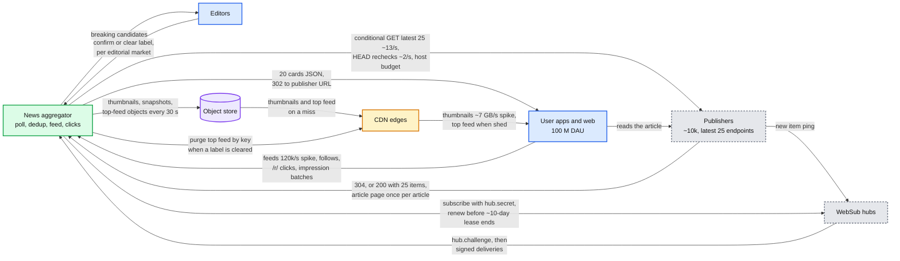

- **Trust boundary:** publishers and hubs sit outside it. Deliveries need a valid HMAC, and every URL they send passes the SSRF rules in [§10.10](solution.md#1010-security-and-abuse). The red fetcher is inside the box on the publisher edge (D2a). The top feed is a pre-built object, so the CDN fallback works with the feed tier down.

## D2a. Data flow, ingest half

Name, format, size and rate on every edge. Ingest moves ~5 items a second, so the bytes are trivial. The hard part is correctness at the red edge.
```mermaid
%% D2a: ingest data flow. Stores and Kafka topics are cylinders, processes are rounded. Rates are averages unless marked peak.
flowchart LR
    PUB["Publishers ~10k"]:::external -->|"latest 25 as RSS, Atom or JSON,<br/>304 ~300 B or 200 ~50 KB, ~13/s,<br/>HEAD rechecks ~2/s"| FET("Fetcher<br/>poll workers"):::critical
    HUB["WebSub hubs"]:::external -->|"signed ping ~1 KB,<br/>at most ~3.5/s"| FET
    SRC[("feed_source<br/>Postgres, 10k rows")]:::store -->|"due rows, up to 20 per claim,<br/>lease_token + 1, ~13 rows/s"| FET
    FET -->|"etag, known_ids + title hashes<br/>~1.2 KB, next_poll_at, ~13 rows/s"| SRC
    FET -->|"new ids + changed hashes, JSON ~2 KB,<br/>~5/s with edits, ~35/s peak"| RAW[("raw-items<br/>Kafka, 12 partitions")]:::queue
    RAW -->|"raw item ~2 KB, ~5/s"| NORM("Normalizer + clusterer<br/>URL, hashes, SimHash, story"):::service
    NORM -->|"article + outbox rows ~2 KB,<br/>~5 upserts/s, ~600 MB/day"| ADB[("Article DB<br/>Postgres, ~220 GB/yr")]:::store
    ADB -->|"article.upserted + label events,<br/>JSON ~1 KB, ~5/s via outbox relay,<br/>+ watermark W per partition"| AEV[("article-events<br/>Kafka, 12 partitions, 7 days")]:::queue
    AEV -->|"new article, ~3.5/s"| IMG("Page worker<br/>inside the host budget"):::service
    PUB -->|"article page + og:image ~200 KB est.,<br/>once per article, ~3.5/s, ~35/s peak"| IMG
    IMG -->|"3 sizes x ~20 KB,<br/>~10 objects/s, ~18 GB/day"| OBJ[("Object store<br/>thumbnails")]:::store
    IMG -->|"article.image_ready,<br/>~100 B, ~3.5/s"| AEV
    IMG -->|"URL update when the same-domain<br/>rel=canonical differs, rare"| ADB
    AEV -->|"every event to every server,<br/>~1 KB, ~5/s x 36 to 60"| FEED("Feed servers, Flink,<br/>top-feed builder, see D2b"):::service
    classDef service  fill:#dcfce7,stroke:#16a34a,stroke-width:2px,color:#111
    classDef store    fill:#ede9fe,stroke:#7c3aed,stroke-width:2px,color:#111
    classDef queue    fill:#cffafe,stroke:#0891b2,stroke-width:2px,color:#111
    classDef external fill:#e5e7eb,stroke:#6b7280,stroke-width:2px,color:#111,stroke-dasharray:4 3
    classDef critical fill:#fee2e2,stroke:#dc2626,stroke-width:4px,color:#111
```

- "~5/s with edits" is 3.5 new articles/s plus ~150k edits a day (~1.7/s). Edits pass the fetcher because `known_ids` keeps an 8-byte title hash per id. HEAD rechecks cover the last 24 h of top-500 articles (~150k a day); a 404 or 410 is a retraction. The page worker's fetch spends the same per-host tokens as polls, so a burst of new articles cannot push a publisher past its limit. 60 servers each reading ~5 KB/s of `article-events` is ~300 KB/s of broker egress. Nothing here needs sharding.

## D2b. Data flow, serving half

Per page the network carries at most one user-state read (~1 KB) and one session op (~2.6 KB). The ~0.9 GB of cards never leaves the server.
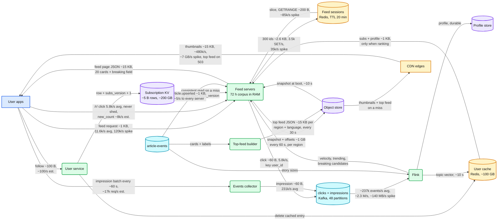

- **The biggest byte stream is thumbnails** (~7 GB/s at spike, ~1.8 PB a month), not feed JSON (120k x 15 KB = ~1.8 GB/s). That is why images are the cost lever in [§8](solution.md#8-staff-level-notes). 480k thumbnails/s = 120k pages x 8 visible cards x 50% client-cache miss.
- **Impressions are 40x clicks** (231k/s vs 5.8k/s), so they go to their own collector, the first thing shed. Clicks ride `/r/`, which is never shed. A follow returns `204` with the new `subs_version`, and the app sends it on its next feed request.

## D4. FR1 via WebSub push

A push is a hint, not a data path. It makes the source due now, and a normal poll does the fetch, the overlap check and the dedup.
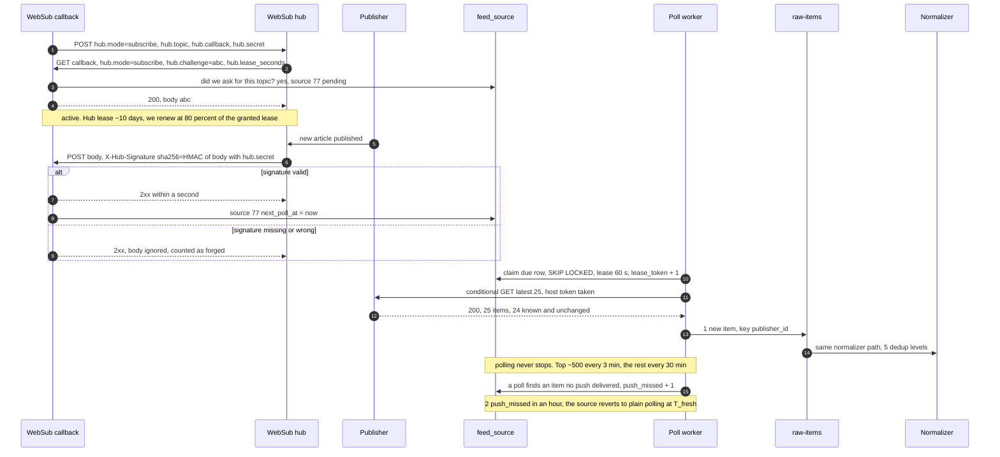

- **Why a hint and not the fat-ping body:** the poll re-uses the ETag, `known_ids`, the overlap check and the host budget. Cost: one extra GET per push, at most ~3.5/s. **Why keep polling:** a push that never arrives looks exactly like a quiet publisher. Push buys the top ~500 freshness, and the rest a 30-min poll instead of 15. A forged delivery gets a 2xx and is ignored, which the WebSub spec allows. An unexpected `hub.challenge` gets a 404, so nobody can subscribe us to a feed we did not ask for.

## D5. A feed server dies mid-request

The load balancer retries once on another server. Any server can serve any cursor, because the corpus is everywhere and the session is in Redis.
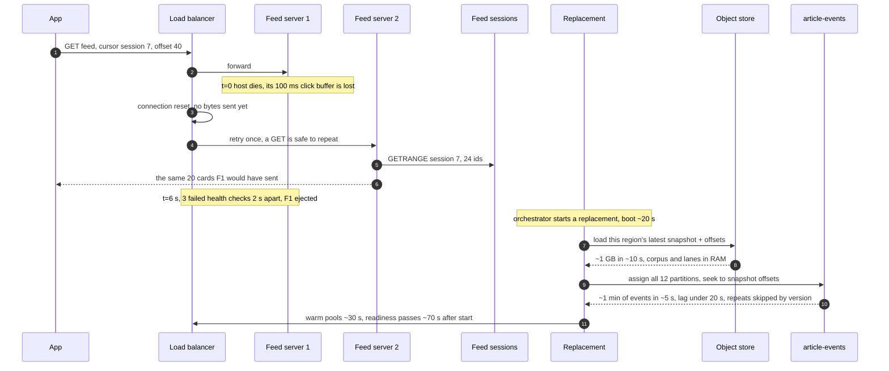

- **Data at risk:** one 100 ms click buffer. 5.8k clicks/s over 36 servers is ~160/s each, so ~16 clicks. A retried `/r/` counts once: Flink dedups on (user_id, session_id, article_id) for 10 min. A retried page 1 may leave an orphan 2.6 KB session that expires in 20 min.
- **Why readiness waits for replay:** the settle cut and `as_of_seq` assume every ready server holds everything older than the cut. So readiness fails at 20 s of consumer lag, not just at boot. A corrupt snapshot falls back to the previous one, then to a rebuild from a Postgres replica with `offsetsForTimes`; a snapshot older than 10 min is a ticket.

## D5. Redis session shard lost while a user is on page 3

The session is gone, so the server answers 409 and the app re-sends the story ids it has rendered. The server re-ranks up to `as_of_seq` (the article id at page 1's settle cut, the same set on every ready server), drops those ids and freezes a new session.
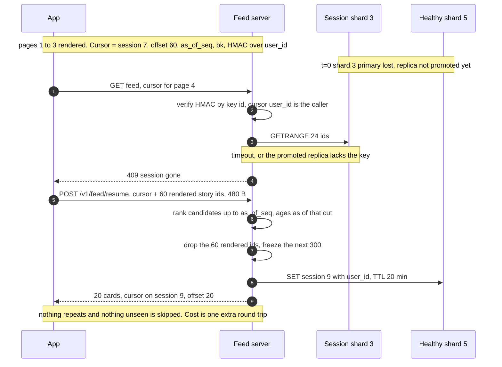

- **Blast radius:** 1 shard of 6, so ~1/6 of live sessions take one resume each. In a region failover every scroller in that region loses the session at once, and this becomes the main path for one page.
- **Why not "continue below the last score":** it needs no POST, but the deep dive measured ~4 repeats and ~6 skips per loss. **Why ages as of the cut:** with a 6 h half-life every score drops ~2% per 10 minutes, so "now" ages reorder nothing but shift every score.

## D5. The outbox relay publishes the same event twice

The relay crashes after Kafka acked but before it marked the row sent. The duplicate is harmless because feed servers apply an event only if its version is newer.
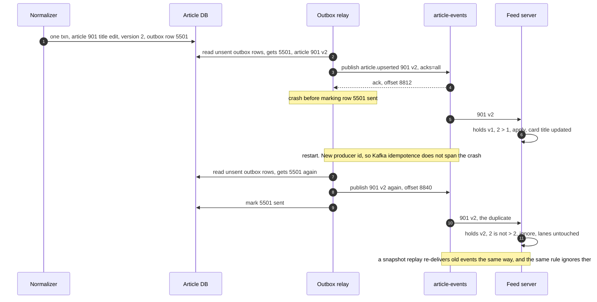

- **Without the version check** a duplicate "new article" event would prepend the id to its lanes twice, and the card would show twice. **A relay that stays down** stops the watermark W, so the settle cut stops advancing instead of letting late rows land below served cursors. It pages when the oldest unpublished outbox row passes 60 s. Key and lifetime per hop: [§10.5](solution.md#105-exactly-once-and-idempotency-end-to-end). Concept: [`exactly-once`](../../concepts/exactly-once.md).

## D6. Decision flow for one For You request

Shedding order is `new_count` first, then page-1 builds, which are also rate limited per user. Page-2+ slices and `/r/` are never shed. The Following tab skips this flow: a keyset on `article_id` (one clock) below the settle cut, min(now - 30 s, W), where W is the relay's lowest per-partition watermark.
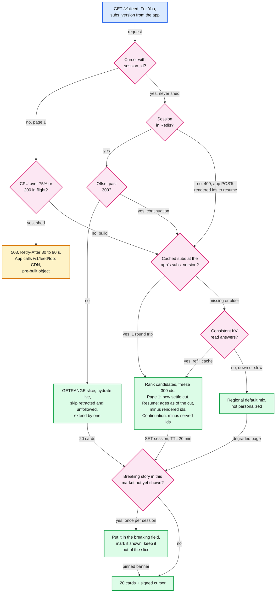

- **A slice needs no user state and no ranking** (~0.3 ms of CPU against ~2 ms for page 1), so page 2 onward survives both a user-cache outage and overload, and nobody's scroll is replaced mid-way. Only page 1, a resume and a continuation rank. Unfollow mid-scroll needs no rebuild: the app sends `subs_version` on every request, and a newer one makes hydration drop that publisher's cards. The jittered Retry-After keeps shed clients from returning in the same second. Concept: [`rate-limiting-and-load-shedding`](../../concepts/rate-limiting-and-load-shedding.md).
- **"Shown" lives in the signed cursor** (the pagination deep dive calls the field `bk`). The lane holds at most 3 stories per market, so the cursor stays small and a slice needs no Redis write.

## D8. Publisher circuit (`feed_source.circuit`)

One circuit per publisher. A failure is a 10 s timeout or a 5xx. A 429 never counts: it releases the row until Retry-After expires and halves the host rate (AIMD). Open means no polls and no worker time, with backoff 1, 2, 4 ... 30 min and 20% jitter.
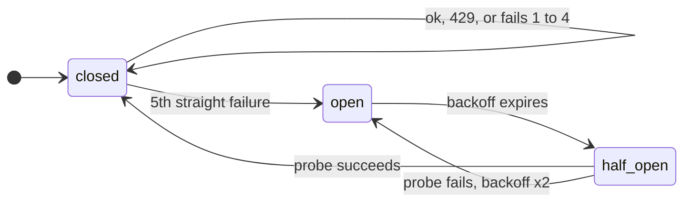

## D8. Story lifecycle

A story is a cluster of articles and the unit of a card. Machines make candidates (counting tier 1 and 2 publishers only). Only an editor makes "Breaking", as a `story_breaking` row per editorial market (~50), so one story can be Breaking in India and Growing in the US. `merged_into` points at the survivor, and a label follows it.
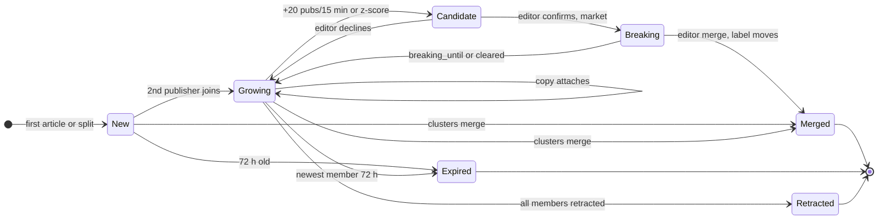

## D8. Article lifecycle

An edit, or a same-publisher re-post within SimHash 3 (an alias, recorded in `article_alias`), changes the card in place and never re-surfaces it. `article_id` and `ingested_at` never change.
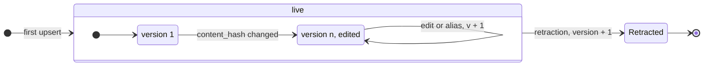

- **Retraction signals:** a deleted flag in the publisher's API, a 404 or 410 on the HEAD recheck of the last 24 h of top-500 articles (~2/s), or an editor or legal takedown. Absence from the latest 25 is never one.
- **Edges of "live":** an item whose `published_at` is over 48 h old at first sight is stored but kept out of fresh lanes. After 72 h an article leaves every corpus: Following shows "end of feed", and `/r/` still reads the Postgres replica.

## D9. Deployment / topology

Serving is active-active in 3 regions. Ingest runs in region A with a warm standby in B, because a second active fetcher fleet would double our requests to every publisher.
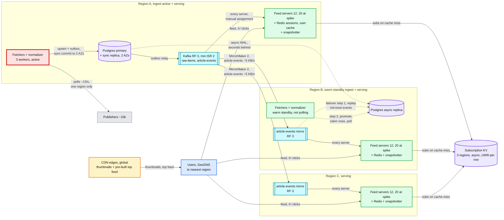

- **Crosses a region boundary:** `article-events` (~5 events/s x ~1 KB), Postgres WAL to B, subscription KV replication, and users moved by DNS. **Never crosses:** `raw-items`, sessions, user cache, clicks. Each region runs its own clicks topic and Flink, since trending is per region anyway.
- **Replication:** Kafka RF 3 per cluster, `min.insync.replicas=2`. Postgres 3 copies (primary and sync replica across AZs in A, async in B). Redis 1 replica per shard. Each region runs its own snapshotter, because a mirrored topic's offsets differ from the source cluster's.
- **Capacity:** 12 servers per region, ~36k/s at the 75% shed line, ~48k/s flat out. A one-region spike (12k/s to 96k/s) sheds ~60% there unless it spills to the other regions (~48k/s spare, ~70 ms away). Losing a region leaves 24 servers, ~48k/s at 50% CPU, above the 35k/s daily peak.
- **Region A lost:** B replays the mirrored `article-events` into its Postgres first, so re-polled items dedup against rows that exist instead of getting new ids. Then its fetchers start. ~5 to 10 min, which breaches the 5-min top-500 target: a freshness incident. Users moved from a lost serving region arrive with a cold user cache and no session, so each takes one resume (D5). A request whose `subs_version` is ahead of the local KV replica reads from the user's home region. Concept: [`replication-and-quorums`](../../concepts/replication-and-quorums.md).

## D10. Scaling / partitioning

The corpus is replicated, not partitioned. Everything per-user is partitioned by user. The one hot partition is harmless at our write rate.
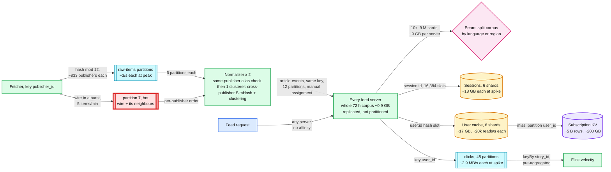

- **Why the hot partition is fine.** A wire in a burst adds 5 items/min, 0.08/s. Even the whole ~35/s peak on one partition is 35 x 2 KB = 70 KB/s, under 1% of the ~10 MB/s one partition handles ([§10.3](solution.md#103-capacity-math-per-component)). It would load the consumer instead. The same-publisher alias check is complete per partition, because one publisher's items share a partition. Cross-publisher SimHash (~2 ms) and clustering (~20 ms) run in one active clusterer with a hot standby whatever the partitioning, ~0.8 core at 35/s. Its story writes carry the leader-lease epoch, checked in Postgres, so a deposed leader cannot write. If the normalizer side bites, process different publishers of one partition in parallel. Per-publisher order holds, and more partitions would not split one hot key anyway.
- **Redis per shard:** sessions 110 GB / 6 = ~18 GB against ~25 GB. User cache 100 GB / 6 = ~17 GB and 120k / 6 = 20k reads/s against ~100k ops/s. **Clicks keyed by user_id, not story_id.** A breaking story draws a large share of all clicks, and keying by story would put them all on one partition. User keying also keeps the (user_id, session_id, article_id) dedup on one partition. Flink pre-aggregates per story before the keyBy.
- **The 10x seam:** 3 M articles a day x 3 days = 9 M cards, ~9 GB per server. Split the corpus by language, one server group per language set, and route a user to the group for their 1 or 2 languages. Every request stays in memory. Dedup hits its limit earlier: brute-force compares grow with the square of scale (2.1 M x 35/s = ~7.4 x 10^7/s today, ~10^9/s for one thread), so Manku's permuted tables arrive at ~4x, before the corpus split. Concept: [`sharding`](../../concepts/sharding.md), [`fan-out-fan-in`](../../concepts/fan-out-fan-in.md).

## D11. Failure mode map

Component on the first edge, what fails in the box, blast radius on the second edge, mitigation in the last box. Matches [§5.7](solution.md#57-what-happens-when-a-component-dies-and-what-changes-at-10x).
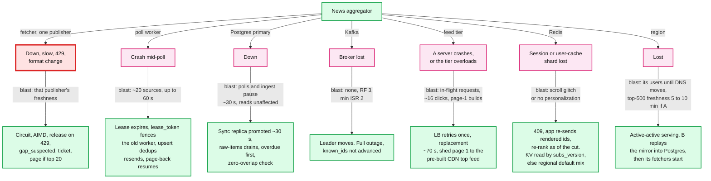

- **Not in the tree, largest blast radius:** a bad ranking or clustering release touches every feed at once, so both ship behind a 1% holdout with CTR and "distinct stories per page" guardrails ([§8](solution.md#8-staff-level-notes)). Postgres promotion is timed in [§10.4](solution.md#104-failure-timeline).

## D12. Rollout / migration

The five steps of [§8](solution.md#8-staff-level-notes) migration, from cron + SQL + offset pagination. Durations are assumptions. Every phase ends with a flag-flip rollback, and nothing is destructive until the SQL path is removed.
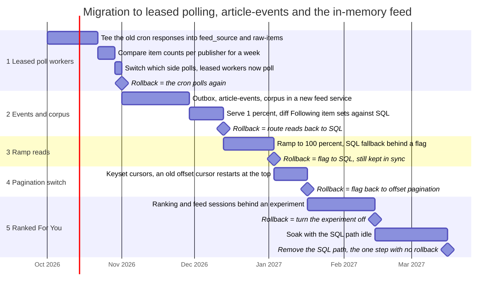

- **Phase 1 tees, it never double-polls:** polling from both sides would double our request rate against every publisher's limit. **Phase 2 diffs sets, not order,** because the old feed sorts by `published_at` and the new one by `article_id`, our ingest clock. For You has no old equivalent to diff.

## Trade-offs these diagrams make visible

| Decision | Chose | Gave up |
|---|---|---|
| Corpus placement (D10) | Replicated to every server | ~70 s to bring a server up (D5), and a 10x seam |
| Ingest regions (D9) | One active region, warm standby | Minutes of ingest pause on region loss |
| Session loss (D5) | 409, then the app re-sends its rendered ids | One extra round trip and a POST of at most ~4.8 KB (last 600 ids) |
