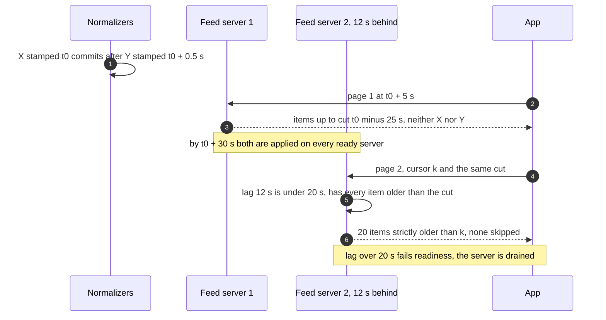
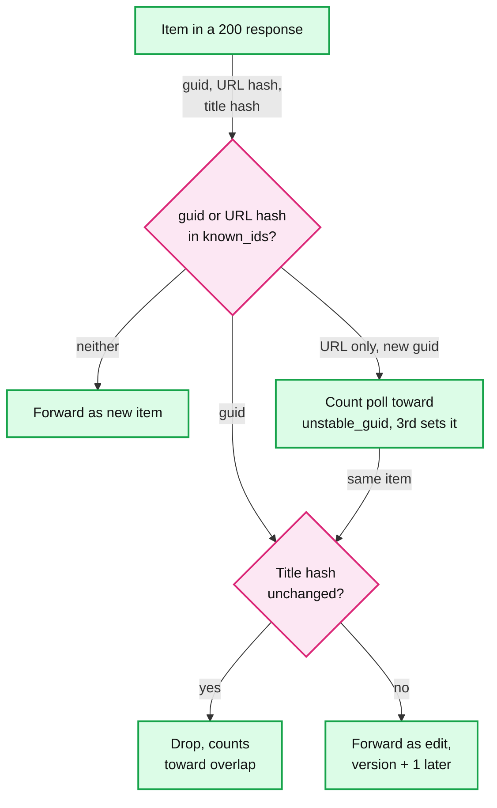
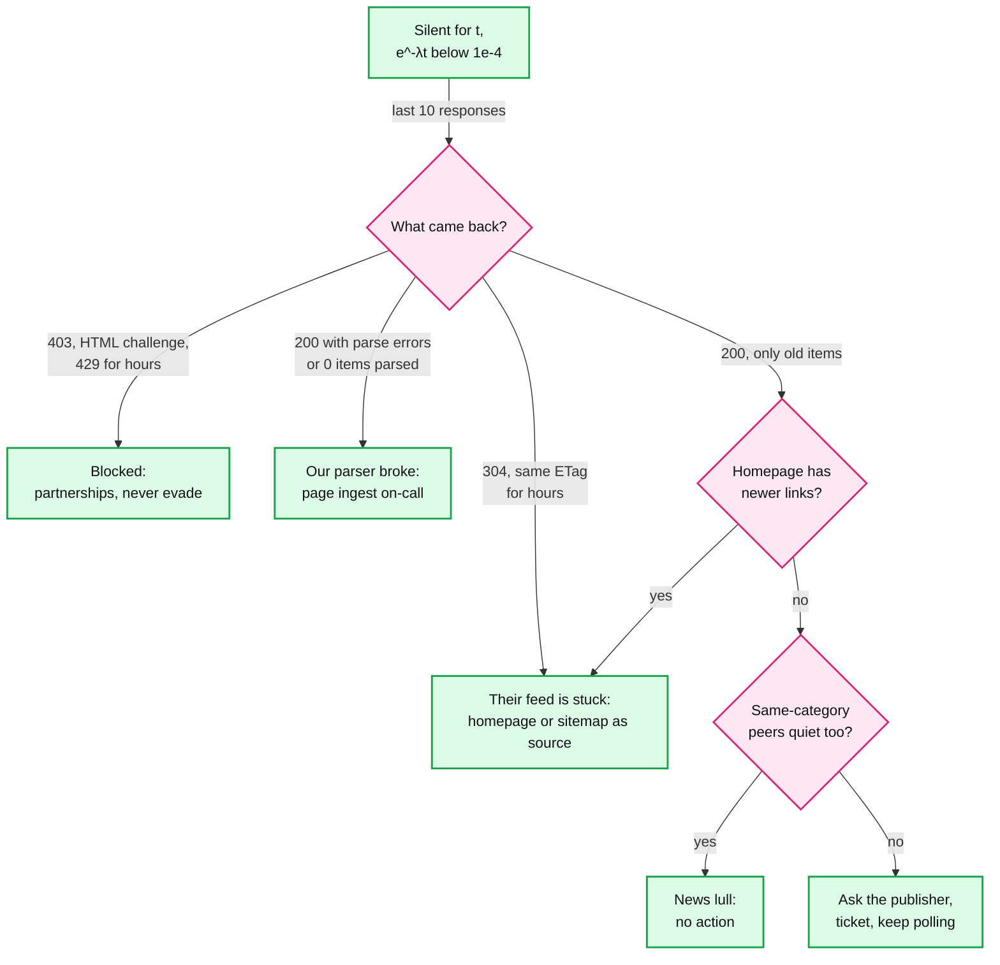

# Edge cases: News aggregator / personalized news feed

Every entry is answerable in under 60 seconds out loud. Design reference: [`solution.md`](solution.md). "§" numbers point into it. Numbers come from [solution §2](solution.md#2-back-of-envelope), or are derived with the math shown, or are marked [estimate] or [assumption]. "(our addition)" marks a detail past what solution.md specifies. Quoted questions are verbatim Rippling-tagged PracHub follow-ups. Longer answers: [polling](deep-dives/publisher-polling-and-rate-limits.md), [dedup](deep-dives/dedup-and-story-clustering.md), [read path](deep-dives/feed-read-path-and-fan-out.md), [ranking](deep-dives/ranking-and-cold-start.md), [pagination](deep-dives/pagination-and-feed-sessions.md), [breaking news](deep-dives/breaking-news-and-load-shedding.md).

---

## Failure

## Edge case: the Postgres primary dies during a breaking story
- **Trigger:** the primary of the Article DB (which also holds `feed_source`, the poll scheduler) crashes at t = 0.
- **Symptom:** users see nothing. On-call gets "Postgres primary down" and a ~1 minute freshness dip.
- **Answer:**
  - Reads never touch Postgres for the last 72 h: every feed server serves from its in-memory corpus. Only `/r/` for articles older than 72 h needs the async replica, which is still up.
  - Ingest pauses. Polls pause too, because claiming a row needs the same Postgres. Items already fetched wait in `raw-items`: 30 s x 35/s peak = ~1,050 items, drained in seconds (§5.7).
  - The sync replica is promoted in ~30 s with no data lost. Overdue sources are claimed first and checked for zero overlap. The 2x window factor absorbs the pause: new items = λ x (25 / 2λ + 0.5 min) = 12.5 + 0.5λ, which reaches 25 only at λ = 25/min. The outbox relay resumes, and a re-sent event is dropped because its `version` is not newer (§10.5).
- **Confidence:** [ ] shaky  [ ] ok  [ ] confident

## Edge case: a region is lost, a serving region or the ingest region
- **Trigger:** one of the three active-active serving regions fails with its Redis. Or the one region that runs fetchers, the normalizer and the Postgres primary.
- **Symptom:** serving region: seconds of errors until DNS moves users, one glitchy page for scrollers. Ingest region: feeds work everywhere, but nothing new appears.
- **Answer:**
  - Serving: ~36 feed servers, 12 per region: ~36k/s per region at the 75% shed line, ~48k/s flat out. At daily peak (~11.7k/s per region) each survivor goes to ~17.5k/s: fits. At a spike, survivors shed to the CDN feed. Lost sessions answer 409 and the app resumes with its rendered ids (§5.4). Moved users hit a cold user cache and read the multi-region subscription store. A `subs_version` ahead of the local replica reads from the home region (§10.6).
  - Ingest: the warm standby first replays the mirrored `article-events` into its Postgres, because the async replica can be seconds behind. Re-polled items then dedup against rows that exist instead of getting new ids. Then its fetchers start.
  - Failover takes ~5 to 10 min, which breaches the 5-min top-500 target for that window: a region loss is a freshness incident. Not active-active, because that doubles our requests to every publisher (§10.11).
- **Confidence:** [ ] shaky  [ ] ok  [ ] confident

## Edge case: the Redis user cache loses a shard
- **Trigger:** one of the 6 user-cache shards loses its primary, or both primary and replica.
- **Symptom:** ~1/6 of users get a slower or less personal feed for a while.
- **Answer:**
  - Replica promotion takes seconds. If the whole shard is gone, its users miss: 120k/s / 6 = ~20k/s of subscription-store reads at a spike, ~6k/s at daily peak. The store is partitioned by `user_id`, so refills spread evenly. If the store is slow too, serve the regional default feed (degraded counts as up).
  - Nothing durable lives only here. Flink writes profiles to the durable profile store and the cache, so a lost shard costs latency, not personalization (§4.5).
  - Read-your-writes survives a failover that loses the last writes. A subscribe deletes the cache entry and returns `subs_version`. The app sends it back, and a cached set that is missing or older triggers a consistent read from the store (§4.2).
- **Confidence:** [ ] shaky  [ ] ok  [ ] confident

## Edge case: Kafka is down, or the outbox relay is stuck
- **Trigger:** a broker dies; the whole cluster is down; or the relay process hangs while Kafka is fine.
- **Symptom:** broker: nothing. Cluster: content freezes, feeds still serve. Stuck relay: articles commit but never appear, with no error anywhere.
- **Answer:**
  - One broker: RF 3, `min.insync.replicas=2`, `acks=all`. A leader moves in seconds, nothing is lost.
  - Whole cluster: fetchers cannot produce, so they skip polls without advancing `known_ids`. Nothing is marked seen that was not sent. A long outage overflows fast publishers' windows, and the gap detector counts it on restart. Click buffers drop their oldest events, since clicks are statistics.
  - Stuck relay is the silent one: feed servers show zero consumer lag because the topic itself is quiet. Its watermark stops, so the settle cut stops too and nothing is skipped. Page when the oldest unpublished outbox row is > 60 s (§8).
- **Confidence:** [ ] shaky  [ ] ok  [ ] confident

## Edge case: the feed tier sheds load while users are tapping
- **Trigger:** a breaking-news spike. Usable capacity is the 75% shed line: ~108k/s for 36 servers. 120k/s spread evenly sheds ~10%. A one-region spike (12k/s to 96k/s) against that region's ~36k/s sheds ~60% (§5.5).
- **Symptom:** some requests get 503 with `Retry-After` jittered 30 to 90 s. Which ones, and does a tap on the breaking story still open?
- **Answer:**
  - Cheapest loss first. Impressions go to a separate events collector, shed before anything. Then `new_count` checks, then page-1 builds (the app falls back to the CDN feed). Page-2+ slices of a live session are kept, so no scroll is replaced mid-way ([`../../concepts/rate-limiting-and-load-shedding.md`](../../concepts/rate-limiting-and-load-shedding.md)).
  - `/r/` is never shed: a map lookup and a 302. If it fails anyway, the app opens the card's direct `url` and reports the click in its next events batch (§4.5).
  - Shrinking the shed: spill over to other regions (~48k/s spare, ~70 ms away) and pre-scale on the breaking-candidate signal, because new servers land only ~2.5 to 3 min into a spike [estimate].
- **Confidence:** [ ] shaky  [ ] ok  [ ] confident

---

## Consistency

## Edge case: articles commit out of order, or one feed server lags
- **Trigger:** `article_id` (its timestamp is `ingested_at`) is stamped before the commit, so two normalizers commit out of order. Or a GC pause starves one server's apply thread, or the relay or mirror stalls.
- **Symptom:** without a guard, an item stamped 12:00:00.0 becomes visible after one stamped 12:00:00.5 was served. It lands above a Following cursor the user already passed and is skipped. A lagging server also misses edits and retractions.
- **Answer:**
  - One clock: the Following tab orders by `article_id`. A page shows only ids at or below the cut = min(now - 30 s, W). W is the lowest per-partition watermark the outbox relay publishes ("every commit stamped ≤ W is published"), mirrored with the data (§4.4).
  - The normalizer's transaction times out at 5 s, and a server whose consumer lag passes 20 s fails readiness. A stalled relay or mirror stops W, so the cut stops: the feed freezes instead of skipping, and watermark age alerts.
  - The Following cursor `{v:1, k:article_id, cut}` carries its cut, so page 2 is exact on any ready server. For You's `as_of_seq` is the same cut, and the pill counts between it and the current cut.
  - Cost: ~35 s from poll to visible (5 s pipeline + 30 s settle). p95 freshness is ~3.4 min for the top 500 and ~14.8 min for the rest, inside 5 and 30.
- **Diagram:**

- **Confidence:** [ ] shaky  [ ] ok  [ ] confident

## Edge case: a feed session is lost mid-scroll
- **Trigger:** the Redis shard holding the session fails over without it, or the fixed 20-min TTL from page 1 runs out.
- **Symptom:** page 5 arrives with a cursor whose session no longer exists.
- **Answer:**
  - The server answers 409. The app calls `POST /v1/feed/resume` with the cursor and the story ids it already rendered (8 B each, capped at the last 600, ~4.8 KB) (§5.4).
  - The server re-ranks candidates up to `as_of_seq` with ages as of that cut, excludes the rendered ids, and freezes a new session: 0 repeats, 0 skips. The older "continue below the last score" re-rank measured ~4 repeats and ~6 skips per loss.
  - A resume costs a page-1 build (~2 ms vs ~0.3 ms for a slice) and is rate limited per user. Sessions use `maxmemory-policy volatile-ttl`, so memory pressure evicts the sessions nearest expiry first.
- **Confidence:** [ ] shaky  [ ] ok  [ ] confident

## Edge case: a publisher changes a title after publication
- **Trigger:** "A publisher changes an article's title after publication. How does the correction reach users' feeds?" Same guid, same URL, new title, new ETag.
- **Symptom:** the old title is in every corpus, in frozen sessions and in the CDN top-stories page.
- **Answer:**
  - `known_ids` stores, per item of the last response, the id, the URL hash and an 8-byte title hash. A known item with a new title hash is forwarded as an edit, not dropped (§4.1, diagram). Overlap counts only known and unchanged items, so an edited old item that an `updated`-sorted feed moves to the top cannot fake overlap.
  - Normalizer: `content_hash` changed, so `version + 1`. `article_id` and `ingested_at` stay, so it never re-surfaces as new (§5.2). Outbox, then every feed server applies it because the version is newer.
  - Cards are hydrated live, so the next page of every open session shows the new title in the same slot. Edits reach feed servers at most once per article per 10 min [estimate], retractions never wait. The CDN top-stories page follows within ~1 to 2 min. We keep `story_id` on an edit unless similarity to the story drops below 0.6 (our addition): a headline fix is not a new event.
- **Diagram:**

- **Confidence:** [ ] shaky  [ ] ok  [ ] confident

## Edge case: the guid changes on every fetch
- **Trigger:** a CMS builds the guid from a render timestamp or session, so the same article has a new guid each poll.
- **Symptom:** level 2 `(publisher_id, source_guid)` never matches. If overlap counted guids alone it would be 0 on every poll, and every poll would look like a gap.
- **Answer:**
  - Users see no duplicate: the normalizer looks up by guid, then by `canonical_url_hash`, and finds the existing row. A true insert is `INSERT ... ON CONFLICT DO NOTHING` plus a re-read, because Postgres `DO UPDATE` can name only one constraint (§4.1).
  - Overlap counts an item whose guid OR URL hash is known and unchanged, so it stays at ~22 and no false gap fires. A known URL under a new guid is counted, and after 3 such polls the source is flagged `unstable_guid`: its ids become canonical URLs everywhere (diagram above).
  - Any gap that does fire is capped: at most 5 pages per claim, the lease renewed before each page, at most ~30 pages per source per hour (a new gap extends the running walk), and only spare host tokens. An unfinished walk resumes from `backfill_before` on the next claim (§5.1).
- **Confidence:** [ ] shaky  [ ] ok  [ ] confident

## Edge case: a user unsubscribes while on page 3
- **Trigger:** `DELETE /v1/me/subscriptions/publishers/42` mid-scroll, then the user keeps scrolling.
- **Symptom:** pages 1 to 3 are on screen. What does page 4 show?
- **Answer:**
  - The app sends `subs_version` on every request. Page 4 carries the new one, so hydration drops publisher 42's cards from the frozen slice and extends it to keep 20 (§5.4). No session is deleted and nothing is re-ranked.
  - The next refresh builds page 1 without publisher 42. Its stories can still come back there through topic or trending lanes, because unfollow is not mute.
  - Why it holds: read-your-writes from the very next request, for the price of one filter at hydration. Pages 1 to 3 are already on screen and stay.
- **Confidence:** [ ] shaky  [ ] ok  [ ] confident

## Edge case: a story is falsely labeled breaking
- **Trigger:** "How would you correct a falsely labeled breaking story?" An editor confirmed the wrong story, or the story itself turned out false.
- **Symptom:** a banner on the top card of every feed in a region.
- **Answer:**
  - Labels live per editorial market (~50 countries and metros) in `story_breaking`. The editor sets `cleared_at`, and an outbox event on `article-events` reaches every feed server within seconds. The label is in corpus snapshots too, so a new server boots with it. The market's CDN top-stories objects are rebuilt and purged by key at the same moment (§5.5).
  - The label never enters a frozen session. The feed response has a separate `breaking` field (≤ 3 cards), a pinned banner shown once per session and filtered out of the slice. The cursor's `bk` carries the ≤ 3 breaking ids already shown. No timeline or session holds a copy to clean.
  - Who may assign it: Flink proposes (a robust z-score on log click velocity against the market baseline, or tier 1 and 2 publishers sharing a named entity per 15-min bucket), a human confirms per market. Push, when built, is editor-sent only, because a push cannot be recalled.
- **Confidence:** [ ] shaky  [ ] ok  [ ] confident

---

## Scale

## Edge case: 200 publishers report one story within 90 seconds
- **Trigger:** "A breaking story is reported by 200 publishers within 90 seconds."
- **Symptom:** a burst of near-duplicates, plus rate limits from the publishers we poll hardest.
- **Answer:**
  - Volume is trivial: 200 in 90 s = 2.2/s against a 35/s peak budget. We see it smeared by our intervals: WebSub in seconds, the top 500 within 3 min, the rest within 15 min.
  - SimHash attaches wire copies, clustering attaches rewrites. `publisher_count` climbs from 1 to 200 on one card. The candidate signal counts tier 1 and 2 publishers sharing a named entity per 15-min bucket, so early reports that clustered into split stories still add up. It fires within ~3 minutes, from the top publishers.
  - One clusterer: one active process with a hot standby behind a leader lease. A single writer means two normalizers can never create two stories for the same event. Every story write carries the lease epoch, checked in Postgres, so a paused old leader cannot write after failover (§5.2).
  - Many of the 200 may share one hosting platform. The per-host token bucket and AIMD keep us polite. A 429 releases the row until `Retry-After` expires and never counts toward the circuit. If the bucket's Redis is down, fetchers fail closed to 1 request/min per host.
- **Confidence:** [ ] shaky  [ ] ok  [ ] confident

## Edge case: a user follows thousands of sources
- **Trigger:** "What changes for a user following thousands of sources?" A Feedly power user with 5,000 follows.
- **Symptom:** 5,000 lanes per request. The Redis source-list design would need 5,000 round trips.
- **Answer:**
  - In-process it is a heap over 5,000 list heads, ~0.5 ms of cache misses (§5.3). The heap key is `lane_weight x 0.5^(age_hours/6)` with per-lane caps (20 per followed publisher, 100 per category, 50 per topic, 50 trending), merged to ~500.
  - Newest-first would break here: 5,000 of 10,000 publishers publish ~1.75/s, so 500 candidates would span only ~5 min. The weighted key keeps older, relevant stories in play. Diversity (≤ 2 per publisher, ≤ 3 per category in any 10) still applies.
  - The cache entry grows to 5,000 x 8 B = 40 KB, still one read. For the Following tab (our addition): scan the global lane and filter with a 10,000-bit bitmap of followed publishers (1.25 KB). Following half, 20 hits take ~40 ids.
- **Confidence:** [ ] shaky  [ ] ok  [ ] confident

## Edge case: a live-blog storm overflows the latest 25 and the API cannot page back
- **Trigger:** a publisher emits 25 items a minute, and its host allows R = 1 request a minute.
- **Symptom:** `T_min` comes from half the host budget, so T = 2 min. Polling is lossless only while λ ≤ 12.5R = 12.5/min. At 25/min, 50 items arrive per poll and 25 are visible: ~50% lost.
- **Answer:**
  - Detect, do not pretend. λ takes the max of the hour-of-week EWMA and the last polls (fast attack), and counts edits that an `updated`-sorted feed moves to the top, so T hits `T_min` on the first burst poll. Overlap 0 raises `gap_suspected`. With no `page=` or `since=`, the sitemap or section page is the second source, and we count recovered vs unrecovered (§5.1).
  - Product reality: live-blog posts are mostly updates to one URL, so the story is present. Losing individual posts costs less than a missing story.
  - The real fix is a contract: WebSub fat pings or a `since` parameter. Partnerships owns it. The unrecovered-gap ticket is the evidence for that talk.
- **Confidence:** [ ] shaky  [ ] ok  [ ] confident

## Edge case: the CDN top-stories page expires at the peak of a spike
- **Trigger:** 120k/s of shed clients read `/v1/feed/top`, and the cached copy turns 30 s old.
- **Symptom:** risk of a thundering herd: every edge misses at once and hits origin.
- **Answer:**
  - `stale-while-revalidate=60`: past 30 s the edge keeps serving the stale copy and sends one background revalidation per key. An origin shield collapses that to ~1 fetch per key per 30 s. At ~100 keys (regions x languages) [estimate], that is ~3 requests/s at origin ([`../../concepts/caching-patterns.md`](../../concepts/caching-patterns.md)).
  - Origin is a pre-built object in the object store, rebuilt every 30 s by a builder that does not depend on the feed tier. `stale-if-error=600` keeps the last page served for 10 min if the builder dies (§5.5).
  - The other herd is the 503'd clients retrying in step. `Retry-After` jittered 30 to 90 s spreads them out.
- **Confidence:** [ ] shaky  [ ] ok  [ ] confident

## Edge case: every open app polls new_count during the spike
- **Trigger:** the client checks `new_count` while visible (§4.4), and breaking news keeps every app open.
- **Symptom:** load outside the 120k/s feed-read budget.
- **Answer:**
  - [estimate] ~8k checks/s on average and ~80k/s at a spike (§4.4). Page 1 returns a signed pill token holding the ~30 lane ids, so a check reads no Redis: it counts those lanes between page 1's cut and the current cut, in memory. It also returns any new breaking ids.
  - Every response carries `next_check_s`, so the server stretches the interval under load. `new_count` is the first request class the feed tier sheds.
  - Tapping the pill rebuilds page 1, so a pill shown to everyone at once is itself a spike. The jittered `next_check_s` staggers it.
- **Confidence:** [ ] shaky  [ ] ok  [ ] confident

## Edge case: 10x DAU tomorrow
- **Trigger:** 1 B DAU, same publishers.
- **Symptom:** 1.2 M feed reads/s at a spike.
- **Answer:**
  - Feed servers scale linearly with no shared hot key: ~600 at a spike. Ingest does not change, since publishers did not grow.
  - Sessions become the memory problem: ~110 GB normally, ~1.1 TB in a 20-min spike (~44 shards of 25 GB). Lever: 100-story sessions (0.8 KB), since 5 pages covers most scrolls [assumption].
  - User cache ~1 TB, subscription store ~2 TB (10x ~200 GB): add shards. Clicks ~1.4 GB/s with impressions: 48 to ~480 partitions.
  - The bill is images: ~18 PB a month of CDN, ~$180k to $360k. AVIF thumbnails and lazy loading are worth more than any server change.
- **Confidence:** [ ] shaky  [ ] ok  [ ] confident

## Edge case: 10x publishers tomorrow, and the corpus no longer fits
- **Trigger:** 100k publishers, 3 M articles a day.
- **Symptom:** 72 h is 9 M cards, ~9 GB per feed server. A snapshot load goes from ~10 s to ~90 s, so a new server needs ~2.5 min, not ~70 s.
- **Answer:**
  - Polling is still small: 100k / 900 s = ~110 polls/s. `feed_source` has 100k rows. Per-host budgets matter more, since the long tail shares hosting platforms.
  - Corpus options: (a) split by language or region, since a user reads 1 or 2 languages, so each server holds a slice and every request stays in memory. (b) 24 h in process, older cards from a card tier. (c) Slimmer cards: drop the snippet from RAM, ~600 B to ~300 B.
  - Dedup: 21 M fingerprints make brute-force SimHash ~20 ms per article: ~70% of a core at the new 35/s average, ~7 cores at a 10x peak. Compares grow with the square of scale (more fingerprints x more articles), so Manku's permuted tables are due at ~4x, before 10x. ~2 M story centroids need an ANN index ([`../../concepts/vector-index.md`](../../concepts/vector-index.md)). New publishers start at trust tier 3.
- **Confidence:** [ ] shaky  [ ] ok  [ ] confident

---

## Data

## Edge case: a publisher backdates published_at, or its clock or timezone is wrong
- **Trigger:** `published_at` in the future, hours off, or an ISO timestamp with no offset.
- **Symptom:** wrong "2 h ago" labels, and a polluted freshness metric.
- **Answer:**
  - Order never uses it: the Following tab sorts by `article_id`, whose timestamp is our `ingested_at` (§4.4). Ranking age runs from the story's earliest `min(published_at, ingested_at)`, and edits never overwrite `published_at`, so a future date cannot make anything look newer than when we first saw it.
  - An item first seen now but published > 48 h ago (feed reset, site migration) is stored but kept out of the fresh lanes (§4.1).
  - Display and metrics (our addition): no offset means the publisher's registered zone, flagged. Track each publisher's median skew and keep skewed ones out of the freshness SLO metric.
- **Confidence:** [ ] shaky  [ ] ok  [ ] confident

## Edge case: five syndicated copies of the same event
- **Trigger:** "How would you avoid showing five syndicated copies of the same event?"
- **Symptom:** one AP story under five mastheads on one screen.
- **Answer:**
  - Level 3 folds AMP, mobile and `utm_` variants. Level 4 SimHash (64-bit, Hamming ≤ 3 over the body or summary, 2.1 M fingerprints, ~2 ms, in the clusterer) folds verbatim wire copies. Level 5 (cosine ≥ 0.85 in 48 h plus a shared entity) folds rewrites. All attach to one story, none is deleted (§5.2).
  - At read time: collapse by story. The user's subscribed publisher's copy wins, else the lead. "N more sources" opens `/v1/stories/{id}`.
  - Syndicated pages often set `rel=canonical` to the wire's URL. The normalizer follows it only within the publisher's own registered domains, so the Hindustan Times copy keeps its own row. A cross-domain canonical is only a strong hint to the clusterer.
- **Confidence:** [ ] shaky  [ ] ok  [ ] confident

## Edge case: two different stories are wrongly merged
- **Trigger:** a shared entity and a similar lede ("fire in Mumbai": a factory and a hotel). Centroids freeze after ~10 members, so drift is not the usual cause.
- **Symptom:** one card hides a different event. This is the worse clustering error (§5.2).
- **Answer:**
  - Detect (our addition): story coherence (two sub-clusters whose centroids are below 0.7 cosine), a jump in story size, "not related" reports, the editor tool.
  - Repair with the split job: a new `story_id` for the subset, each moved article re-emitted as `article.upserted` with `version + 1`. Recompute both leads. A cannot-link pair stops the clusterer merging them again (our addition).
  - Open sessions keep the old id, which is still valid, just smaller. The split-off story shows in the next session.
- **Confidence:** [ ] shaky  [ ] ok  [ ] confident

## Edge case: the article-events card schema changes
- **Trigger:** a new card field (say `paywalled`), or a changed meaning of an old one.
- **Symptom:** during a rollout, old and new feed servers read the same topic and boot from the same snapshots.
- **Answer:**
  - Every event carries `schema_version`. Add fields, never repurpose them, and readers ignore unknown fields. Readers upgrade first, then the writer. Compatibility must hold both ways, because a new server replays 7 days of old events and an old server may read new ones after a rollback.
  - Snapshots are versioned too, one snapshotter per region. During the rollout it writes both formats, so a rolled-back server can still boot.
  - A breaking change gets a new topic. The relay dual-writes `article-events-v2`, servers switch, and v1 retires after the 7-day retention.
- **Confidence:** [ ] shaky  [ ] ok  [ ] confident

## Edge case: a normalizer bug wrote bad cards for 6 hours
- **Trigger:** a release truncates summaries or picks the wrong image.
- **Symptom:** ~76k new articles (6 h x 3.5/s) plus their edits are wrong in Postgres, in every corpus and in snapshots.
- **Answer:**
  - Fix forward. Re-derive the fields from the rows, then emit `article.upserted` with `version + 1` for the affected ids. Feed servers apply newer versions, and cards are hydrated live, so open sessions heal on the next page.
  - Bootstrap is a snapshot plus the minutes since it, not a 72 h replay: 30 new servers would pull ~135 GB from the brokers. A corrupt snapshot falls back to the previous one, else a rebuild from a Postgres replica plus `offsetsForTimes`. Snapshot age > 10 min is a ticket.
  - Only the last 72 h matter to feeds. Older rows can be fixed in a slow batch.
- **Confidence:** [ ] shaky  [ ] ok  [ ] confident

## Edge case: a GDPR delete of a user
- **Trigger:** a user asks to be erased.
- **Symptom:** their data sits in 7 places, some of them logs.
- **Answer:**
  - The subscription rows and `subs_version` (one partition, keyed by `user_id`), the durable profile store, the user cache key. Sessions expire within 20 min.
  - Events: `clicks` (keyed by `user_id`) ages out by retention. Flink's per-user state gets a tombstone on `user-events`. The lake's click and impression tables are partitioned by day, with a user-id tombstone list applied at compaction (§10.11).
  - Per-story click velocity and trending are aggregates, not personal data. Articles are publisher data. One delete job, a checklist per store, and an audit record. The legal clock is one month (GDPR Art. 12(3)) [unverified here].
- **Confidence:** [ ] shaky  [ ] ok  [ ] confident

## Edge case: a publisher demands takedown of its content
- **Trigger:** a legal notice for some articles, or the whole publisher leaving.
- **Symptom:** its cards are in every feed server, in frozen sessions, in CDN thumbnails and in story leads.
- **Answer:**
  - Some articles: an editor or legal takedown, one of the three retraction sources (§5.2). `status = retracted`, `version + 1`, one event each. Servers drop them from lanes. Sessions filter at hydration and extend the slice by one.
  - Whole publisher: `publisher.status = banned` as one event. Servers filter by publisher at hydration, and `feed_source` rows are disabled, so polling stops.
  - Thumbnails are our copies of their images: delete them from the object store and purge the CDN. Keys prefixed by `publisher_id` make that one purge (our addition). Keep a tombstone (guid, URL hash) so it is not re-ingested. Recompute the lead of every story it led.
- **Confidence:** [ ] shaky  [ ] ok  [ ] confident

## Edge case: an article is legally blocked in one country
- **Trigger:** a court order in one country for one article.
- **Symptom:** must vanish there, stay visible elsewhere.
- **Answer:**
  - `article.status` gains a per-country block list, carried on the card. Feed servers filter by the request's country, including frozen sessions at hydration (§10.11).
  - The CDN top-stories key must include country wherever regions span countries with different rules. Rebuild it and purge.
  - `/r/` returns 451 in that country. Thumbnail URLs are no longer shown there. A geo rule at the CDN covers direct hits if counsel requires it.
- **Confidence:** [ ] shaky  [ ] ok  [ ] confident

## Edge case: size growth over 3 years
- **Trigger:** 3 years of steady growth.
- **Symptom:** which store hurts first?
- **Answer:**
  - Article DB: 220 GB a year, ~660 GB after 3, one primary still. Partition `article` by month and move rows older than a year to the object store. Subscriptions: ~200 GB, growing with registered users, not with time.
  - Thumbnails: 6.6 TB a year, ~20 TB after 3. Lifecycle-delete sizes not served in 90 days, since cards older than 72 h are rarely rendered.
  - The lake is the big one. Impressions are 20 B a day x ~60 B = ~1.2 TB a day raw, ~440 TB a year [estimate]. Keep raw 90 days, keep aggregates forever.
- **Confidence:** [ ] shaky  [ ] ok  [ ] confident

---

## Operations

## Edge case: what pages at 3 am, and what only tickets
- **Trigger:** n/a.
- **Answer:**
  - Page (§8): feed 5xx (not shed 503s) > 0.1% for 5 min; fallback-feed rate > 20% for 10 min; top-500 freshness p95 > 10 min for 15 min; `article-events` lag > 60 s on > 10% of feed servers; Postgres primary down; a top-20 publisher silent or its circuit open; oldest unpublished outbox row > 60 s. Relay watermark age alerts too.
  - Ticket: one non-top publisher's circuit open > 2 h, a silent publisher, an unrecovered gap, one lagging server (readiness already drained it at 20 s).
  - SLOs behind them: feed p99 < 200 ms and 99.99% (degraded counts). Freshness p95 5 min top 500, 30 min all. Zero unexplained gaps. Rule: page on what users feel inside the SLO window. One publisher out of 10,000 is a ticket.
- **Confidence:** [ ] shaky  [ ] ok  [ ] confident

## Edge case: a publisher silently stops, or a top-20 publisher drops to zero
- **Trigger:** "How would you detect that one publisher has silently stopped returning new articles?" and "A top-20 publisher's ingest volume silently drops to zero ... tell a parser break from a legitimate news lull or a blocked crawler."
- **Symptom:** no errors, just no new items.
- **Answer:**
  - Detect with the hour-of-week rate λ: zero new items for longer than `max(9.2 / λ, 30 min)`. For a Poisson publisher that silence is legitimate 1 time in 10,000 (e^-9.2 ≈ 10^-4). A top publisher at 12 items an hour pages after ~46 min, others ticket (§5.1).
  - Diagnose from the last responses and two outside checks (diagram). Same-category peers quiet too means a lull.
  - Act by cause. Parser: page ingest. Blocked: partnerships, never evade. Stuck feed: use the homepage or sitemap as a temporary source.
- **Diagram:**

- **Confidence:** [ ] shaky  [ ] ok  [ ] confident

## Edge case: a publisher offers webhooks instead of an API you poll
- **Trigger:** "How does your design change if a publisher offers push notifications (webhooks) instead of an API you poll?"
- **Symptom:** a better channel, with new failure modes.
- **Answer:**
  - Use WebSub where possible ([spec](https://www.w3.org/TR/websub/)): one callback per source, verified with `hub.challenge`. The body is signed with `X-Hub-Signature`, an HMAC keyed by our `hub.secret`. Hubs should enforce ~10-day leases, and we renew at 80% of the granted lease.
  - Pushed items take the same path as polled ones: `raw-items`, normalizer, the same dedup. Push only adds speed and protects the window in a burst.
  - Polling continues, because a push that stops looks like a quiet publisher: every 3 min for the top ~500 (304s are cheap, and it bounds a dead push against the 5-min target), every 30 min for the rest. `push_missed` counts items a poll found that the push never delivered. 2 in an hour revert the source to plain polling at `T_fresh` (§5.1).
- **Confidence:** [ ] shaky  [ ] ok  [ ] confident

## Edge case: a bad ranking model release
- **Trigger:** v2 of the model has a feature bug and ranks stale stories first.
- **Symptom:** CTR (click-through rate) drops across every feed. This is the largest blast radius in the system (§8).
- **Answer:**
  - A model ships as an experiment, never as a deploy: 1% treatment against a holdout. Guardrails: CTR, distinct stories per page, bounce-back (a return within 10 s), p99 latency. Auto-stop if a guardrail breaks for 15 min. Ramp 1, 10, 50, 100%.
  - Rollback is a flag flip. The model is data inside the feed service, so the next page 1 uses the old one within seconds.
  - Sessions frozen by the bad model live up to 20 min. If they carry `model_version` (our addition), rollback treats bad-model sessions as lost: 409, then resume.
- **Confidence:** [ ] shaky  [ ] ok  [ ] confident

## Edge case: a bad clusterer release
- **Trigger:** a new threshold or embedding model over-merges or under-merges.
- **Symptom:** under-merge shows duplicates. Over-merge hides news. Story size p99 and "distinct stories per page" move.
- **Answer:**
  - Prevent: shadow first. A second consumer writes proposed `story_id`s to a side table, and we diff story counts and sizes for a day (§10.9).
  - If it ships anyway: fail back to the previous build (the hot standby can run it), then re-cluster the last 48 h (~600k articles) from the Article DB. Merges set `merged_into`, splits go through the split job. Nothing older than 48 h needs repair.
  - Feed servers resolve `merged_into` at hydration and drop the duplicate from the slice, so open sessions heal on the next page.
- **Confidence:** [ ] shaky  [ ] ok  [ ] confident

## Edge case: add personalized ranking on top of the chronological merge without rewriting the pipeline
- **Trigger:** "How would you add personalized ranking on top of the chronological merge without rewriting the pipeline?"
- **Symptom:** v0 is a time-ordered merge of subscribed lanes. Product wants For You.
- **Answer:**
  - The pipeline ends at candidate lanes inside each feed server. Ranking is a pure function between merge and collapse: `score(card, profile, velocity)`. Ingest, events and the corpus do not change.
  - Add inputs, not stages: the profile vector (Flink, into the profile store and user cache), and a click-velocity feed into feed servers. The first scorer is "recency only", so it matches v0 exactly, then v1 weights ship behind an experiment.
  - Scores move, so For You freezes pages in a session. The Following tab keeps keyset order. Two tabs, one pipeline.
- **Confidence:** [ ] shaky  [ ] ok  [ ] confident

## Edge case: evolve from a popularity baseline to personalization without tanking CTR
- **Trigger:** "How would you evolve the ranking from a popularity baseline to true per-user personalization without tanking CTR?"
- **Symptom:** a new model can win offline and lose on new users or heavy users.
- **Answer:**
  - Three steps. Popularity (velocity x decay). Then v1 with `topic_match`: content-based profiles fix the "first-rater problem", which Google News reported as +30.9% CTR ([Liu et al., IUI 2010](https://static.googleusercontent.com/media/research.google.com/en//pubs/archive/35599.pdf)). Then v2, a GBDT on click logs.
  - Each step ramps from 1% treatment, with a permanent 1% holdout on v1. Guardrails: CTR, distinct stories per page, bounce-back. Read the results per segment: new users, heavy users, each region.
  - Keep the exploration slot, a uniform random draw (~5% of clicks). It is the unbiased log for offline replay, and logging position `p` lets training correct position bias. New users get a bandit. LinUCB reported a 12.5% click lift over a context-free bandit on 33 M events ([Li et al.](https://arxiv.org/pdf/1003.0146)).
- **Confidence:** [ ] shaky  [ ] ok  [ ] confident

## Edge case: migrate from the old cron plus SQL feed
- **Trigger:** v0 is cron polling, `WHERE publisher_id IN (...) ORDER BY published_at`, and offset pagination.
- **Symptom:** zero downtime needed, with a rollback at every step.
- **Answer:**
  - Order (§8): leased poll workers in shadow, then outbox and `article-events`, then the in-memory feed at 1% (diff its Following tab against SQL), ramp, switch cursors (old offsets accepted for 24 h and mapped to a fresh session), then For You behind an experiment. Each step rolls back with a flag.
  - Watch the shadow (our addition): a second poller doubles our requests against every publisher's rate limit. Tee the old cron's responses into the new pipeline instead of polling twice. Switch who polls in one move per publisher.
- **Confidence:** [ ] shaky  [ ] ok  [ ] confident

---

## Security and abuse

## Edge case: SSRF through a registered endpoint or an og:image URL
- **Trigger:** a publisher's DNS points at `169.254.169.254`, a redirect leads to `10.0.0.5`, or an `og:image` names an internal host. SSRF is server-side request forgery.
- **Symptom:** our fetcher, or the page worker that fetches each new article's page once for `og:image` and `rel=canonical`, reads cloud metadata or internal services.
- **Answer:**
  - Staff register endpoints, but publishers control DNS, redirects and every `og:image`. Resolve first, refuse private, loopback, link-local and metadata ranges, and re-check each of at most 3 redirects (§10.10). Connecting to the checked IP defeats DNS rebinding (our addition).
  - Limits: 10 s timeout, 2 MB cap, and a network zone with no route to internal services.
  - Hostile payloads (our addition): XML parser with DTDs and entity expansion off (billion laughs). Titles and summaries are stripped to text (§10.10). Images decoded in a sandbox with a pixel cap.
- **Confidence:** [ ] shaky  [ ] ok  [ ] confident

## Edge case: a forged WebSub delivery
- **Trigger:** someone POSTs a fake "breaking" item to `/internal/websub/{source_id}`, or replays an old valid one.
- **Symptom:** a fake article in every feed, if we trusted the body.
- **Answer:**
  - Verify `X-Hub-Signature` (HMAC over the raw body, per-subscription `hub.secret`) with a constant-time compare. Drop on mismatch.
  - Subscriptions need `hub.challenge`, so nobody can subscribe us to a feed we did not ask for.
  - Treat a ping as a hint and fetch the registered endpoint ourselves, so even a leaked secret cannot inject an article the publisher's feed does not show. A replay dedups to a no-op on guid or URL.
- **Confidence:** [ ] shaky  [ ] ok  [ ] confident

## Edge case: correction spam every few minutes to game freshness
- **Trigger:** "A publisher issues a correction (updated body, same URL) every few minutes to game freshness ranking." Or it re-posts the same story under a new URL every hour.
- **Symptom:** the story tries to stay at the top.
- **Answer:**
  - Edits never change `ingested_at` or the freshness term: `version + 1` only, so spam gains nothing in ranking. Edits reach feed servers at most once per article per 10 min, and the publisher is flagged if it keeps doing it (§5.2).
  - A re-post under a new URL from the same publisher with SimHash ≤ 3 of one of its own articles in the last 7 days is an alias. It updates that article and records the new key in `article_alias`, so it cannot jump to the top of the Following tab, and a replay stops at level 2 or 3.
  - Repeat offenders drop to trust tier 3 and cannot lead stories. Their feed's ETag changes every poll, so they also cost us 200s instead of 304s, bounded by the per-host budget.
- **Confidence:** [ ] shaky  [ ] ok  [ ] confident

## Edge case: a click farm inflates trending
- **Trigger:** bots hit `/r/{article_id}` for one story from many accounts and IPs.
- **Symptom:** the story rises in trending and, via the log click-velocity z-score, becomes a breaking candidate.
- **Answer:**
  - Flink drops a repeat of `(user_id, session_id, article_id)` within 10 min, so a double tap or a retry counts once. Clicks and impressions are rate limited per user and per IP, and implausible users are discarded before they move trending (§10.10).
  - Count distinct users per story with a HyperLogLog, and ignore clicks with no matching impression (our addition, [`../../concepts/stream-sketches.md`](../../concepts/stream-sketches.md)).
  - `click_velocity` is recent CTR with a prior, weighted 0.6 and multiplied by the publisher's trust factor. The breaking trigger counts only tier 1 and 2 publishers, and only a human assigns the banner.
- **Confidence:** [ ] shaky  [ ] ok  [ ] confident

## Edge case: a scraped or forged cursor
- **Trigger:** a cursor copied from another user's traffic, an edited offset, or a crafted Following cursor far in the past.
- **Symptom:** reading someone else's session, or walking the archive at our expense.
- **Answer:**
  - The For You cursor `{session_id, offset, as_of_seq, bk}` carries an HMAC with a key id, computed over those fields and `user_id`. The session stores its `user_id`, so another user cannot replay it and nobody can edit it (§10.10).
  - The Following cursor `{v:1, k:article_id, cut}` is unsigned, and that is fine: it only positions inside the caller's own sources. Past 72 h the tab returns "end of feed" and never falls through to Postgres (§4.4).
  - `POST /v1/feed/resume` takes `rendered_story_ids` from the client, capped at the last 600 ids (~4.8 KB). A forged list only hides stories from its own user. Page-1 builds and resumes are rate limited per user.
- **Confidence:** [ ] shaky  [ ] ok  [ ] confident

## Edge case: an open-redirect attempt on /r/
- **Trigger:** `/r/123?url=https://evil.example`, `/r/%2F%2Fevil.example`, or a phishing link planted in a compromised publisher feed.
- **Symptom:** our trusted domain sends users to phishing.
- **Answer:**
  - `/r/{article_id}` reads the URL by id and takes no URL parameter. A non-numeric id is a 404.
  - The stored URL is the residual risk, and the normalizer closes it. It keeps only links whose host is one of the publisher's registered domains, `http` or `https`. A compromised feed can at worst point at the publisher's own site (§4.5, §10.10).
  - `s` and `p` are parsed as integers. Forged values only pollute position logs, bounded by rate limits.
- **Confidence:** [ ] shaky  [ ] ok  [ ] confident
