# HLD: News aggregator / personalized news feed

> One-line answer: an adaptive poller asks each of ~10,000 publishers for its "latest 25" often enough that the 25 always overlap the last poll, using conditional GETs, a per-host rate budget, a circuit breaker per publisher, and WebSub push where offered; ingest dedups at five levels (the last poll's ids, publisher guid, canonical URL, 64-bit SimHash for verbatim syndicated copies, story clustering for rewrites of the same event, with a content hash telling edits apart), writes metadata to Postgres and emits an article event; every feed server holds the whole 72-hour corpus (~0.9 GB of cards) and a recent-id list per publisher, category and topic (~25 MB), fed by that stream, so a feed request is an in-memory merge of the user's sources plus trending, breaking and exploration lanes, then ranking and one card per story; a ranked page is frozen in a 20-minute feed session so scrolling never repeats or skips; the app falls back to a CDN-cached regional feed when the feed tier sheds load. At 100 M DAU that is ~120k feed reads/s at a breaking-news spike against ~3.5 new articles/s. Fan-out on write would cost ~694k timeline inserts/s from publisher subscriptions alone and ~35 M/s with categories, so every publisher is a "celebrity" and the whole feed is fan-out on read. The red node is the fetcher at the publisher boundary: a publisher's rate limit and its 25-item window are the only limits money cannot raise.

Sources: Rippling candidate posts ([SDE 2, 2024, "latest 25 news from each publisher"](https://leetcode.com/discuss/interview-experience/5590877), [Senior, Aug 2024](https://leetcode.com/discuss/interview-experience/5698133), [L6, 2022, Feedly](https://leetcode.com/discuss/interview-experience/2118542), [L6, 2022, "Personalized Google Feed"](https://leetcode.com/discuss/interview-experience/1979218)). Public outline of the [Hello Interview News Aggregator breakdown](https://www.hellointerview.com/learn/system-design/problem-breakdowns/google-news) (3 FRs, < 200 ms feed, 30 minutes to appear, pagination, media, breaking-news spikes). Rippling-tagged PracHub prompts ([personalized feed](https://prachub.com/interview-questions/design-a-personalized-news-feed-aggregator), [publisher APIs](https://prachub.com/interview-questions/design-a-news-aggregator-that-builds-personalized-feeds-from-publisher-apis), [Google News-like](https://prachub.com/interview-questions/design-a-google-news-like-aggregator)). Papers: [Manku, Jain, Das Sarma, WWW 2007](https://static.googleusercontent.com/media/research.google.com/en//pubs/archive/33026.pdf) (SimHash, 8B pages, k = 3), [Liu, Dolan, Pedersen, IUI 2010](https://static.googleusercontent.com/media/research.google.com/en//pubs/archive/35599.pdf) (Google News, +30.9% CTR), [Li et al., WWW 2010](https://arxiv.org/pdf/1003.0146) (LinUCB, +12.5% clicks). Research notes and spot-check corrections in [`research/`](research/). Written flow-first: §4 builds one diagram one functional requirement at a time, §5 breaks and changes that design one non-functional requirement at a time, §6 is the final design plus the flows to rehearse.

---

## 1. Understanding the problem

Restate before designing. Thousands of publishers put out articles all day. We do not host the articles. We collect their metadata (title, summary, image, link, category), show each user a feed of what matters to them, and send them to the publisher's site when they tap. Users follow publishers ("ndtv") and categories ("Education"), and we learn more from what they click.

The trap is designing Twitter. Twitter has hundreds of millions of writers and fans them out to followers. Here the numbers are inverted, and that changes the answer:
- **Writers are few and slow.** ~10,000 publishers, ~3.5 new articles a second. The whole recent corpus fits in the RAM of one server.
- **Readers are many.** 100 M DAU, ~120k feed reads a second at a spike. A ~3,300:1 read-to-write ratio, like for like (11.6k/s against 3.5/s on average, 120k/s against 35/s at a peak).
- **Every writer is huge.** An average publisher has ~200k active subscribers and a category has millions. Every publisher is a Lady Gaga.
- **The writers are not ours.** They rate limit us, go down, change formats, and return only their latest 25 items. The hardest correctness problem sits outside our trust boundary.

### 1.1 Functional requirements

Core (the union of the Rippling prompts and the Hello Interview outline):
1. **Ingest.** Collect new articles from ~10,000 publishers through their "latest 25" endpoints (JSON, RSS or Atom), or through WebSub push where offered. Deduplicate. Store metadata only.
2. **Subscribe.** A user follows publishers and categories, and unfollows them.
3. **Personalized feed.** Show subscribed sources plus recommended stories, ranked, one card per story with "N more sources".
4. **Infinite scroll.** Page through the feed with no duplicates and no skips while new articles keep arriving.
5. **Click through.** Tapping a card opens the article on the publisher's site. We record the click.

Below the line (say it out loud):
- Hosting article bodies, reader mode, paywalls. We link out.
- Full-text search over the archive. A seam: the article event stream can feed a search index later.
- Comments, sharing, saving for later.
- Push notifications. A seam: the breaking-news lane in §5.5 is exactly what a push service would consume.
- Publisher onboarding UI, contracts and analytics dashboards for publishers.
- Ads.

**Definition of "a story" and "a card"** (agree before drawing):

| Question | Answer we pick | Why |
|---|---|---|
| Unit of ingest | One article = one publisher's item, identified by `(publisher, guid)` or its canonical URL | That is what the publisher gives us |
| Unit of display | One card per **story**. A story groups syndicated copies and different outlets' write-ups of the same event | "Avoid showing five syndicated copies of the same event" (PracHub, Rippling) |
| Which copy the card shows | The user's subscribed publisher if one is in the story, else the story's lead | Respect the subscription, avoid 300 AP copies |
| Order of the "Following" tab | Our ingest time, newest first | Publishers backdate and publish late. Our clock is the only one we trust for a stable order |
| Order of the "For you" tab | Ranked by relevance times freshness | The personalized feed |
| An edited article | Same card, updated in place, never re-surfaced as new | A title change is a correction, not news |

### 1.2 Non-functional requirements

Ask for scale first. Nothing is given in the Rippling prompts beyond "thousands of publishers", so we state a design point and let the interviewer move it.

| Dimension | Target | Why this number |
|---|---|---|
| Readers | 100 M DAU, ~10 feed pages each a day | Google News scale; Hello Interview-style assumption |
| Feed reads | ~12k/s average, ~35k/s daily peak, **~120k/s at a breaking-news spike** | §2 |
| Publishers | ~10,000, each a "latest 25" endpoint | "Thousands of publishers" (Rippling) |
| New articles | ~300k a day: ~3.5/s average, ~35/s peak, plus ~150k edits a day | §2 |
| Feed latency | p99 < 200 ms at the server, p50 < 50 ms | Hello Interview deep dive 2 |
| Freshness | p95 publish to feed: **5 min for the top ~500 publishers**, 30 min for all | Hello Interview says 30 min. Breaking news needs better for the few who break it |
| Completeness | No silent loss. Every gap in a publisher's 25-item window is detected and counted | The Rippling prompt's "latest 25" is a trap for silent loss |
| Availability | Feed 99.99%, where a degraded non-personalized feed counts as up. Ingest 99.9% | "Users would prefer slightly outdated content rather than no content" (Hello Interview) |
| Consistency | Content: eventual (seconds). Your own subscriptions: read-your-writes. One scroll session: a consistent snapshot | Where each changes is in §10.6 |
| Durability | Article metadata and subscriptions durable. Sessions, caches and the in-memory corpus are losable and rebuildable | Everything in RAM can be replayed from the stream |

Below the line: exactly-once push delivery, a multi-year searchable archive, per-region legal takedowns (a seam in §10.11).

---

## 2. Back-of-envelope

**Ingest.** 10,000 publishers x ~30 articles a day = **300k new articles a day**, 300,000 / 86,400 = **~3.5/s**, ~35/s at a 10x news peak. Edits add ~150k a day. Metadata ~2 KB per article = 600 MB a day, **~220 GB a year**. That is one Postgres primary.

**The 25-item window.** A poll every T minutes of a publisher that publishes λ items a minute sees λT new items. If λT ≥ 25, some were pushed out before we looked. With a safety factor of 2 the rule is **T ≤ 25 / (2λ)**:

| Publisher | λ (items/min) | Window-safe T | Freshness T | Binding |
|---|---|---|---|---|
| Typical site, 30 a day | 0.02 | 10 h | 15 min | Freshness |
| Top outlet, 300 a day | 0.2 | 62 min | 3 min | Freshness |
| Wire service, 1,000 a day | 0.7 | 18 min | 3 min | Freshness |
| Same wire, breaking news | 5 | 2.5 min | 3 min | **Window** |
| Live-blog storm | 25 | 30 s | 3 min | **Window**, and below most rate limits |

On a normal day freshness sets the interval. In a breaking-news burst the window does, exactly when the publisher is also slowest and most likely to rate limit us.

**Polls.** Top 500 at T = 3 min: 500 / 180 = 2.8/s. Other 9,500 at T = 15 min: 9,500 / 900 = 10.6/s. **~13 polls/s.** Even every publisher at a 60 s floor is only 167/s. Each new article also costs one page fetch (for `og:image` and `rel=canonical`): ~3.5/s, ~35/s at a peak, inside the same per-host budget. Most polls answer 304 (~300 B); a 200 with 25 items is ~50 KB. Polling is not a capacity problem. It is a politeness and correctness problem.

**Freshness check.** Wait for the next poll is uniform on [0, T], so p95 wait = 0.95T. The pipeline adds ~5 s and the 30 s settle window (§4.4) another 30 s. T = 3 min gives p95 ~3.4 min (target 5). T = 15 min gives p95 ~14.8 min (target 30).

**Reads.** 100 M DAU x 10 pages = 1 B feed pages a day. 1 B / 86,400 = **11.6k/s average**, x3 = **~35k/s daily peak**, x10 = **~120k/s at a breaking-news spike** (10x the daily average, ~3.4x the daily peak; the design point, not a ceiling). Clicks: 5 per user a day = 500 M, **~5.8k/s**. Impressions: 20 cards per page = 20 B a day, ~231k/s. The client batches them every ~60 s; with ~1 M concurrent sessions [estimate] that is ~17k requests/s to a separate events collector, not the feed tier. The "N new" pill (§4.4) adds ~1 M sessions / 120 s = ~8k checks/s on average and ~80k/s at a spike [estimate], each answered from memory.

**Lake.** Impressions and clicks are ~20.5 B events a day x ~60 B = ~1.2 TB a day raw, ~450 TB a year raw, ~50 to 90 TB a year after columnar compression [estimate].

**Fan-out on write, priced.** 100 M DAU x 20 publisher subscriptions / 10,000 publishers = **200k active subscribers per publisher on average**. 300k articles x 200k = 6 x 10^10 inserts a day = **~694k/s**, to serve 3.5 articles/s. That is 3x more timeline entries than all 20 B daily impressions, so most entries are never seen. Add categories (100 M x 5 subscriptions / 50 categories = 10 M subscribers each): 300k x 10 M = 3 x 10^12 a day = **~35 M/s**. Fan-out on write is not a design option here, it is arithmetic.

**Fan-out on read, priced.** The last 72 h is 900k articles. A feed-ready card (ids, title, snippet, image key, URL, times, SimHash, a 16-byte topic vector) is ~600 B raw, ~1 KB as an in-memory object: **~0.9 GB**. Recent-id lists per publisher (10,000), category (50) and topic (~500) hold ~3 M ids x 8 B = **~25 MB**. The whole thing fits in every feed server. A request merges ~30 in-memory lists: 120k/s x 30 = 3.6 M list reads/s spread over ~60 servers, ~60k/s each, all in RAM.

**Feed compute.** Page 1 (merge, rank 500 candidates, collapse to stories, serialize 20 cards) is ~2 ms CPU. A page-2+ slice is ~0.3 ms [estimate], so the blended cost is lower, but a spike is mostly fresh sessions, so we size every request at 2 ms. 120k/s x 2 ms = 240 cores busy at the spike, ~480 at a 50% target: **~60 servers of 8 vCPU**. Daily peak needs ~18. The baseline is sized for **2x the daily peak** at 50% CPU: 70k/s x 2 ms / 0.5 = 280 cores = **~36 servers, 12 per region**. Flat out they serve ~144k/s.

**Feed sessions.** 3 sessions per user a day = 300 M a day = 3.5k/s, 35k/s at a spike. A snapshot is 300 story ids x 8 B = 2.4 KB, ~2.6 KB with the key. TTL 20 min. Live set: 3.5k x 1,200 s x 2.6 KB = **~11 GB** normally, **~110 GB** if a spike lasts 20 min. A small Redis cluster.

**Subscriptions.** 200 M registered users x (20 publishers + 5 categories) = ~5 B rows x ~40 B = **~200 GB**, keyed by user. Cached per active user with the profile vector (~1 KB): 100 M x 1 KB = ~100 GB.

**Images.** Thumbnails: 300k a day x 3 sizes x ~20 KB = 18 GB a day, ~6.6 TB a year. Served: 1 B pages x ~8 visible cards x 15 KB = 120 TB a day. With a 50% client cache hit, ~60 TB a day, **~1.8 PB a month from the CDN**. At $0.01 to $0.02 per GB that is ~$18k to $36k a month, **more than all compute**. §8 comes back to this.

---

## 3. The set-up

Product style: core entities, API, data model. The Rippling SDE 2 prompt explicitly asks for the schema, so §3.3 writes the tables out.

### 3.1 Core entities

- **Publisher.** A news outlet: name, domain, country, language, trust tier.
- **FeedSource.** One endpoint we read for a publisher, plus its poll state (ETag, known ids, estimated rate, next poll time, circuit). This row is also the scheduler's queue entry.
- **Category.** A fixed taxonomy (~50): World, Business, Education, Sports.
- **Article.** One publisher's item. Metadata only.
- **Story.** A cluster of articles about the same event. The unit of a card.
- **User, PublisherSubscription, CategorySubscription.** Who follows what.
- **UserProfile.** Learned interests: a topic vector and per-publisher affinity. Derived from clicks.
- **FeedSession.** A frozen ranked list of story ids for one scroll session. Losable.
- **Click / Impression.** Events, not tables. They land in a log and a lake.

### 3.2 API

| Method | Path | Request | Response | Notes |
|---|---|---|---|---|
| GET | `/v1/feed?tab=for_you&cursor=&limit=20` | cursor absent for page 1 | `{items: Card[], breaking: Card[], next_cursor, as_of}` | Ranked. Page 1 creates a feed session. Cursor is opaque. `breaking` (≤ 3) is a pinned banner, filled only when the session has not shown that story yet |
| GET | `/v1/feed?tab=following&cursor=&limit=20` | | same | Chronological by ingest time. Keyset cursor |
| POST | `/v1/feed/resume` | `{cursor, rendered_story_ids}` | same as `/v1/feed` | After a 409 (session lost). Re-ranks up to the cursor's cut, excluding what the app has shown |
| GET | `/v1/feed/new_count?tab=&since=<as_of>` | | `{count}` | The "12 new stories" pill. Never changes the current session |
| GET | `/v1/feed/top?region=us&lang=en` | | `{items: Card[]}` | Non-personalized. CDN-cacheable for 30 s. The fallback in §5.5 |
| GET | `/v1/stories/{story_id}` | | `{lead: Card, articles: Card[]}` | "Full coverage": every outlet in the story |
| PUT, DELETE | `/v1/me/subscriptions/publishers/{publisher_id}` | | 204 | Idempotent |
| PUT, DELETE | `/v1/me/subscriptions/categories/{category_id}` | | 204 | Idempotent |
| GET | `/v1/me/subscriptions` | | `{publishers[], categories[]}` | |
| GET | `/r/{article_id}?s=<session>&p=<position>` | | 302 `Location: <publisher URL>` | Logs the click. Looks the URL up by id, and only URLs on the publisher's registered domains are stored. Never shed |
| POST | `/v1/events` | `{impressions: [...], client_ts}` | 202 | Batched every ~60 s by the client. Separate events collector, shed first |

`Card = {story_id, article_id, title, snippet, image_url, publisher: {id, name, logo_url}, category, published_at, more_sources, click_url: "/r/{article_id}?...", url}`. `url` is the direct publisher link, used only if `/r/` fails.

Internal: `GET /internal/websub/{source_id}?hub.mode=subscribe&hub.challenge=...` (hub verifies our intent) and `POST /internal/websub/{source_id}` (hub delivers, signed).

The publisher side is theirs: `GET https://publisher.example/api/latest` returns the 25 newest items, or an RSS or Atom document of similar length.

### 3.3 Data model

Two very different halves. The **article side** is small (220 GB a year), relational, and gets its dedup from unique constraints: Postgres. The **user side** is big (~5 B subscription rows), has one access pattern ("everything for this user"), and needs no joins: a key-value store partitioned by `user_id`. That is the answer to the Rippling interviewer's "why SQL and not NoSQL": both, split by access pattern, with numbers.

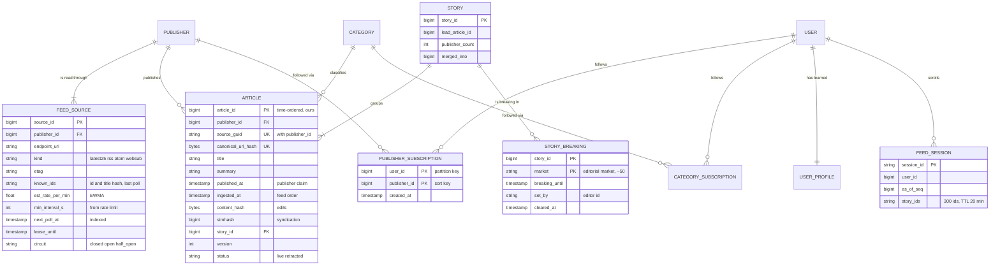

The tables, as you would write them on the whiteboard (Postgres for the article side):

```sql
CREATE TABLE publisher (
  publisher_id  BIGINT PRIMARY KEY,
  name          TEXT NOT NULL,
  domain        TEXT NOT NULL UNIQUE,
  country       CHAR(2),
  language      CHAR(2),
  trust_tier    SMALLINT NOT NULL DEFAULT 3,      -- 1 wire or top outlet, 3 probation
  status        TEXT NOT NULL DEFAULT 'active'    -- active, paused, banned
);

CREATE TABLE category (
  category_id   INT PRIMARY KEY,
  slug          TEXT NOT NULL UNIQUE,             -- 'education'
  name          TEXT NOT NULL
);

-- One row per endpoint. This table is also the poll scheduler's queue.
CREATE TABLE feed_source (
  source_id         BIGINT PRIMARY KEY,
  publisher_id      BIGINT NOT NULL REFERENCES publisher,
  endpoint_url      TEXT NOT NULL,
  kind              TEXT NOT NULL,                -- latest25, rss, atom, websub
  default_category  INT REFERENCES category,
  etag              TEXT,
  last_modified     TEXT,
  known_ids         TEXT[] NOT NULL DEFAULT '{}', -- per item of the last response: id, URL hash, title hash
  unstable_guid     BOOLEAN NOT NULL DEFAULT false, -- identity falls back to canonical URL
  est_rate_per_min  REAL NOT NULL DEFAULT 0.1,
  min_interval_s    INT NOT NULL DEFAULT 60,
  next_poll_at      TIMESTAMPTZ NOT NULL,
  lease_until       TIMESTAMPTZ,
  lease_token       BIGINT NOT NULL DEFAULT 0,   -- fencing: bumped on every claim
  backfill_before   TEXT,                          -- page-back cursor, resumed on the next claim
  consecutive_fail  INT NOT NULL DEFAULT 0,
  circuit           TEXT NOT NULL DEFAULT 'closed',
  last_new_item_at  TIMESTAMPTZ
);
CREATE INDEX feed_source_due ON feed_source (next_poll_at);

CREATE TABLE story (
  story_id         BIGINT PRIMARY KEY,
  lead_article_id  BIGINT,
  first_seen_at    TIMESTAMPTZ NOT NULL,
  publisher_count  INT NOT NULL DEFAULT 1,
  merged_into      BIGINT                         -- set when two clusters merge
);

-- The breaking label is per editorial market (a country or metro, ~50), set by an editor.
CREATE TABLE story_breaking (
  story_id        BIGINT NOT NULL REFERENCES story,
  market          TEXT NOT NULL,
  breaking_until  TIMESTAMPTZ NOT NULL,           -- default now() + 2 h
  set_by          TEXT NOT NULL,
  set_at          TIMESTAMPTZ NOT NULL,
  cleared_at      TIMESTAMPTZ,                    -- set on a correction
  PRIMARY KEY (story_id, market)
);

CREATE TABLE article (
  article_id          BIGINT PRIMARY KEY,         -- 64-bit, time-ordered, assigned at ingest
  publisher_id        BIGINT NOT NULL REFERENCES publisher,
  source_guid         TEXT,
  canonical_url       TEXT NOT NULL,
  canonical_url_hash  BYTEA NOT NULL,
  title               TEXT NOT NULL,
  summary             TEXT,
  image_key           TEXT,
  category_id         INT REFERENCES category,
  language            CHAR(2),
  published_at        TIMESTAMPTZ,                -- what the publisher claims
  ingested_at         TIMESTAMPTZ NOT NULL,       -- our clock: the feed order
  content_hash        BYTEA NOT NULL,             -- sha256 of normalized title + summary (+ body if the feed carries it)
  simhash             BIGINT NOT NULL,            -- over body or summary, byline and dateline stripped
  embedding           BYTEA,                      -- ~128 B quantized title + lede, lets the clusterer rebuild
  entity_ids          BIGINT[],                   -- named entities, for clustering and breaking detection
  story_id            BIGINT NOT NULL REFERENCES story,
  version             INT NOT NULL DEFAULT 1,
  status              TEXT NOT NULL DEFAULT 'live',
  UNIQUE (publisher_id, source_guid),             -- dedup level 2
  UNIQUE (canonical_url_hash)                     -- dedup level 3
);
CREATE INDEX article_story ON article (story_id);

-- Every extra guid or canonical URL that resolved to an existing article (same-publisher re-posts,
-- URL changes), so a replay of that key stops at level 2 or 3 instead of reaching SimHash again.
CREATE TABLE article_alias (
  key_hash    BYTEA PRIMARY KEY,                  -- hash of (publisher_id, guid) or of a canonical URL
  article_id  BIGINT NOT NULL REFERENCES article
);
```

User side (key-value store, partition key `user_id`; shown as SQL for readability):

```sql
CREATE TABLE app_user (user_id BIGINT PRIMARY KEY, region TEXT, language CHAR(2), created_at TIMESTAMPTZ);
CREATE TABLE publisher_subscription (user_id BIGINT, publisher_id BIGINT, created_at TIMESTAMPTZ,
  PRIMARY KEY (user_id, publisher_id));
CREATE TABLE category_subscription  (user_id BIGINT, category_id INT, created_at TIMESTAMPTZ,
  PRIMARY KEY (user_id, category_id));
```

**Access patterns that justify it:**

| Pattern | Rate | Served by |
|---|---|---|
| Claim due sources | ~13/s | `feed_source` index on `next_poll_at`, `FOR UPDATE SKIP LOCKED` |
| "Have I seen this item?" | ~13 polls/s x 25 items | `known_ids` on the source row first. Only new ids and changed title hashes touch the unique indexes |
| Insert or update an article | ~5/s | `article` unique constraints make the upsert idempotent |
| All subscriptions of a user | 120k/s at a spike | User cache, backed by the KV store. Partition key `user_id` |
| Subscribers of a publisher | Never on the hot path | Not indexed. Analytics reads the lake. This is what fan-out on read buys |
| Recent articles of a source | 3 M/s at a spike | In-memory lists on every feed server, not the database |
| Article by id, for a card or a redirect | 2.4 M/s | In-memory corpus. Postgres replica only for articles older than 72 h |

---

## 4. High-level design

One subsection per functional requirement. Each traces input to output, adds boxes to one diagram, and ends with what is still missing. §5 fixes the gaps.

### 4.1 Ingest: new articles from thousands of publishers, deduplicated

The idea: **the `feed_source` table is the schedule, the queue and the poll state in one place.** ~13 polls a second does not need a distributed scheduler.

**Flow**

1. A pool of **poll workers** claims due sources: `SELECT ... FROM feed_source WHERE next_poll_at <= now() AND (lease_until IS NULL OR lease_until < now()) ORDER BY next_poll_at LIMIT 20 FOR UPDATE SKIP LOCKED`, then sets `lease_until = now() + 60 s` and bumps `lease_token`. Three worker machines (for redundancy; one could do it) each claim up to 20 rows and fetch them concurrently. `SKIP LOCKED` lets them claim different rows without blocking each other. The lease means a crashed worker's rows come back in a minute, and the final `UPDATE ... WHERE lease_token = <mine>` means a worker whose lease already expired cannot overwrite the new holder's `etag` or `known_ids`.
2. The worker (the **fetcher**) sends a conditional GET: `If-None-Match: <etag>`, `If-Modified-Since: <last_modified>`, a 10 s timeout, our API key. A **304** means nothing changed: update `next_poll_at`, done.
3. A **200** returns up to 25 items. `known_ids` holds each item id from the last response with an 8-byte hash of its title and summary. The fetcher drops items whose id and hash both match (normally 20 or more of the 25), forwards new ids and changed hashes (a changed hash is an edit, such as a corrected headline), and computes the **overlap**: how many of the 25 ids it already knew. The id is the publisher's guid, or the canonical URL for a source flagged `unstable_guid` (§5.1). Zero overlap on a non-first poll means 25 or more items arrived since the last poll: a possible gap (§5.1).
4. Each new or changed item goes to Kafka topic `raw-items`, keyed by `publisher_id`, as `{source_id, publisher_id, guid, url, title, summary, published_at, fetched_at}`.
5. The worker updates the row: new `etag`, `known_ids`, the rate estimate (an EWMA of ids entering the 25-item window per minute), `next_poll_at = now() + T`, clears the lease. Step 4 happens before step 5, so a crash between them re-fetches and re-sends, which the normalizer dedups. At-least-once, on purpose.
6. The **normalizer** (consumer of `raw-items`) canonicalizes the URL (lowercase host, drop the fragment and `utm_*`, `fbclid`, `gclid`, follow `rel=canonical` only when it stays on the publisher's own registered domains) and rejects a link whose host is not one of those domains. It computes `content_hash` over the normalized title and summary (plus body text when the feed carries it). It looks the article up by `(publisher_id, source_guid)`, then by `canonical_url_hash`. Found with the same hash: no-op. Found with a new hash: update, `version + 1` (an edit). Not found: `INSERT ... ON CONFLICT DO NOTHING`, then re-read, because Postgres `ON CONFLICT DO UPDATE` can name only one constraint and two normalizers may race on the same item.
7. An item whose `published_at` is more than 48 h old at first sight (a feed reset, a site migration) is stored but kept out of the fresh lanes. A new article gets an `article_id` (64-bit, time-ordered: 41-bit milliseconds, 10-bit worker, 12-bit sequence, the Snowflake layout) and `ingested_at`. The insert and an outbox row commit in one transaction. An outbox relay publishes `article.upserted` with the **full row** (card fields plus `source_guid`, `canonical_url_hash`, `content_hash`, `simhash`, `embedding`, `entity_ids`, `version`) to topic `article-events`, keyed by `publisher_id`. The full row is what lets a standby region replay the stream into its own Postgres and still dedup re-polled items.
8. A **page worker** consumes `article-events` and fetches each new article's page once, inside the host's token bucket at the lowest priority (§5.1). It reads `og:image` (three sizes to the object store under an immutable key, then a small `article.image_ready` event) and the page's `rel=canonical`: a same-domain canonical that differs from the feed's URL updates the article's URL, which may reveal it as an alias of an article we already have. Cards show without an image for the ~10 s this takes.

```mermaid
%% Incremental diagram, step 1 of 5: ingest. The source table is the scheduler. Red: the fetcher at the publisher boundary, where rate limits and the 25-item window live.
flowchart LR
    SRC[(feed_source<br/>schedule + poll state<br/>Postgres)] -->|"1. claim due rows,<br/>SKIP LOCKED, 60 s lease"| FET[Fetcher / poll workers<br/>conditional GET, 10 s timeout]:::critical
    FET -->|"2. GET latest 25,<br/>If-None-Match"| PUB[Publisher APIs<br/>~10,000, RSS, Atom, JSON]
    PUB -->|"304, or 200 + 25 items"| FET
    FET -->|"3. new or changed items"| RAW[[Kafka raw-items<br/>key publisher_id]]
    FET -->|"4. etag, known_ids,<br/>rate, next_poll_at"| SRC
    RAW -->|"new or changed items"| NORM[Normalizer<br/>canonical URL, content hash]
    NORM -->|"5. idempotent upsert<br/>+ outbox, one txn"| ADB[(Article DB<br/>Postgres)]
    ADB -->|"6. outbox relay"| AEV[[Kafka article-events<br/>key publisher_id]]
    AEV -->|"new article"| IMG[Page worker<br/>og:image, 3 sizes,<br/>rel=canonical]
    IMG -->|"immutable keys"| OBJ[(Object store<br/>thumbnails)]

    class NORM,IMG service
    class SRC,ADB,OBJ store
    class RAW,AEV queue
    class PUB external

    classDef service  fill:#dcfce7,stroke:#16a34a,stroke-width:2px,color:#111
    classDef store    fill:#ede9fe,stroke:#7c3aed,stroke-width:2px,color:#111
    classDef queue    fill:#cffafe,stroke:#0891b2,stroke-width:2px,color:#111
    classDef external fill:#e5e7eb,stroke:#6b7280,stroke-width:2px,color:#111,stroke-dasharray:4 3
    classDef critical fill:#fee2e2,stroke:#dc2626,stroke-width:4px,color:#111
```

**Still missing:** the interval T is a constant, so a breaking-news burst overflows the 25-item window silently. Nothing handles 429s, outages or a publisher that stopped publishing (§5.1). Dedup stops at "same URL": 300 papers running one AP story are 300 articles (§5.2). Nobody can read any of this yet.

### 4.2 Subscribe: follow publishers and categories

**Flow**

1. `PUT /v1/me/subscriptions/publishers/42`. The **user service** writes `(user_id, publisher:42)` to the subscription store. The key is the whole row, so a retry is a no-op.
2. The same write bumps the user's `subs_version` in the store. The service then deletes the user's entry in the **user cache** (Redis: the subscription set plus the profile vector, ~1 KB per active user) and returns `204` with the new `subs_version`.
3. The app sends `subs_version` on its next feed request. If the cached copy is missing or older, the feed service reloads the subscriptions from the store with a consistent read. No session needs deleting: a refresh (page 1, no cursor) always builds a new session. A scroll already in progress keeps its snapshot, but the app sends `subs_version` on every request, so hydration drops an unfollowed publisher's cards at once (§5.4).
4. It emits `subscription.changed` for the profile job and for analytics.

Read-your-writes holds because the app carries `subs_version`: no feed server serves a subscription set older than the one the user just wrote, even if the Redis delete was lost in a failover. Another device of the same user may see the change a request later. Nobody minds.

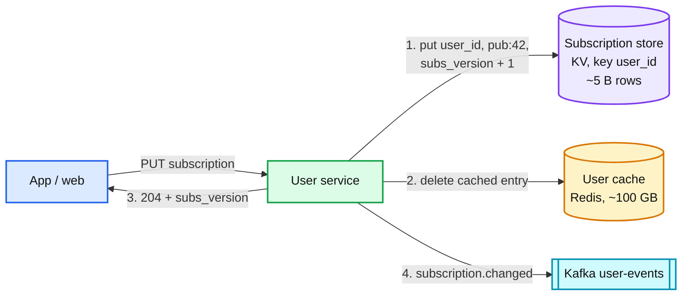

**Still missing:** the subscriptions exist but nothing turns them into a feed.

### 4.3 Personalized feed: subscriptions plus recommendations, one card per story

The first working version, the one most candidates draw: **a Redis sorted set per source**, filled by a consumer of `article-events`, and a feed service that reads the user's sources and merges.

**Flow**

1. An **index builder** consumes `article-events`. For each new article: `ZADD src:pub:{publisher_id} <article_id> <article_id>`, the same for `src:cat:{category_id}` and `src:topic:{topic}`, then `ZREMRANGEBYRANK` to keep the newest ~200 per publisher. The article id is time-ordered, so it doubles as the score.
2. It also writes the card itself: `SET card:{article_id} <json>` with a 72 h TTL.
3. `GET /v1/feed?tab=for_you`. The **feed service** reads the user's subscriptions and profile from the user cache.
4. It builds **candidate lanes**: each subscribed publisher and category (`ZREVRANGE`, one call per source, reading no deeper than the lane's cap in step 5), the newest from the user's top 5 interest topics (the profile keeps ~50 weighted topics, ~150 B, so a new interest can grow past the fifth; lanes read its top 5), and the regional trending list. ~25 to 35 sorted sets per request. The user's topic vector is sparse: the top 5 (topic id, weight) pairs, ~16 bytes.
5. It merges them into ~500 candidates. A plain newest-first merge is a bug: 5 category lanes at ~6,000 articles a day each would fill all 500 slots with the last ~20 minutes and drown the 20 publishers the user follows (~30 a day each). So the heap is keyed by `lane_weight x 0.5^(age_hours / 6)`, which is still descending along each lane, so a k-way heap still works, with a cap per lane (20 per followed publisher, 100 per category, 50 per topic, 50 trending). The caps alone do not fix starvation (they sum to ~1,200 and a recency cut still floods the pool with categories); the weighted key does, measured in the deep dive at 61% of candidates from followed publishers reaching back 12 h, against 1% and 23 minutes for newest-first. The merge continues until the candidates cover ~300 distinct stories, because heavily syndicated sources collapse. It drops anything older than 72 h, and fetches the cards (`MGET`).
6. It **collapses by story**: one card per `story_id`, showing the user's subscribed publisher if one is in the story, and counts `more_sources`.
7. It **ranks** with a simple, explainable score (full version in §5.6):
   `score = (1.0·subscribed + 0.8·topic_match + 0.5·publisher_affinity + 0.6·click_velocity + 0.3·coverage) x trust x 0.5^(age_hours / 6)`.
   `subscribed` is 1.0 for a followed publisher and 0.5 for a followed category. `click_velocity` is recent CTR with a prior (raw click velocity while impressions are being shed), so position does not feed back on itself. `coverage` counts tier 1 and 2 publishers only, so copy farms cannot inflate it. `trust` is 1.0, 0.85 or 0.7 for tiers 1, 2 and 3, and always 1.0 when the shown copy is from a publisher the user follows (never penalize the user's own choice): a prior, not a filter (a tier 3 story with a real 0.9 CTR still ranks). If the holdout shows tier 2 outlets losing too much, 1.0 / 1.0 / 0.7 is the fallback. Age is taken from the story's earliest `min(published_at, ingested_at)`, so a late copy cannot reset freshness and a future-dated item cannot boost itself. Edits never overwrite the stored `published_at`.
   Diversity rules: at most 2 cards from one publisher and 3 from one category in any 10.
8. It returns the top 20.

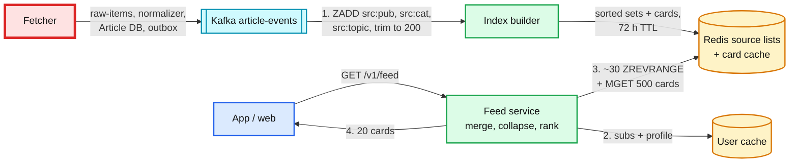

**Still missing:** at 120k requests/s this is ~3.6 M `ZREVRANGE` calls a second plus 120k `MGET`s of 500 keys, and every request reads the same few hot keys (`src:cat:world`, `src:pub:reuters`, `trending:us`). One Redis shard owns each hot key (§5.3). The page has no cursor yet.

### 4.4 Infinite scroll: no duplicates, no skips while articles arrive

Start with the tab where this is easy.

**"Following" (chronological).** Order by `article_id` descending. `ingested_at` is by definition the timestamp inside `article_id`, so there is one clock and the key is just the id. The cursor is the last item's id: `next_cursor = base64({v:1, k:article_id, cut})`, HMAC-signed like every cursor, and the server clamps `cut` to the current cut so a client cannot pull unsettled items forward. Page N+1 is "the 20 newest items strictly older than the cursor". New arrivals are newer than every cursor, so they can never shift a page. This is **keyset pagination**. No state, no duplicates, no skips, with one catch below.

Two choices make it hold:
- **Order by our ingest time, not the publisher's `published_at`.** A publisher that backdates an article, or whose API we poll 20 minutes late, would otherwise insert an item below a cursor the user already passed, and it would be skipped forever.
- **Ids are unique.** Two articles in the same millisecond differ in the worker and sequence bits, so the order is total.
- **One card per story here too.** Keyset is stateless, so a story with a newer member on page 1 and an older one on page 3 would show twice. Rule: a story is placed at its newest member at or below the cut, and its older members are skipped. The cut is in the cursor, so every page applies the same rule.
- **A 30 s settle window.** `ingested_at` is stamped before the transaction commits, and servers apply events a few seconds apart, so an item stamped 12:00:00.0 can become visible after one stamped 12:00:00.5 was served, and land below a cursor the user already passed. So a page only shows items below a cut: `cut = min(now - 30 s, W)`, where W is the lowest applied value of a per-partition watermark heartbeat that the outbox relay publishes ("every commit stamped at or before W is published") and that the mirror copies with the data, so it covers other regions too. The relay reads the outbox in **commit order** through Postgres logical decoding (polling by sequence id can publish a lower id after a higher one), and sets W to the commit time of the last row it published minus the 5 s transaction timeout and the largest clock skew between normalizers. Watermark age is alerted on. The normalizer's transaction times out at 5 s (a timed-out insert retries with a new id), and a feed server whose consumer lag passes 20 s fails its readiness check. W covers the case readiness cannot see: a stalled relay or a Postgres failover publishes older rows late while consumers show zero lag. Everything below the cut is on every serving server, and keyset is exact. Thirty seconds is invisible next to a 3-minute poll.
- **The end.** Past 72 h the tab returns "end of feed". It never falls through to Postgres at 120k/s.

New items are not injected. `GET /v1/feed/new_count?since=<as_of>` counts items between the first page's cut and the current cut in the user's lanes, and the app shows "12 new stories". A tap starts over from the top. The pill is not free (~8k checks/s, ~80k/s at a spike, §2): page 1 returns a signed pill token holding the user's ~30 lane ids (above ~100 lanes, the Feedly power user, the token holds a 1.25 KB bitmap of followed publishers instead), so a check reads no Redis and is answered from memory with no ranking; the response carries `next_check_s` so the server can slow clients down, it carries any new breaking story ids so a breaking event does not trigger a synchronized page-1 refresh from every app, and it is the first thing shed.

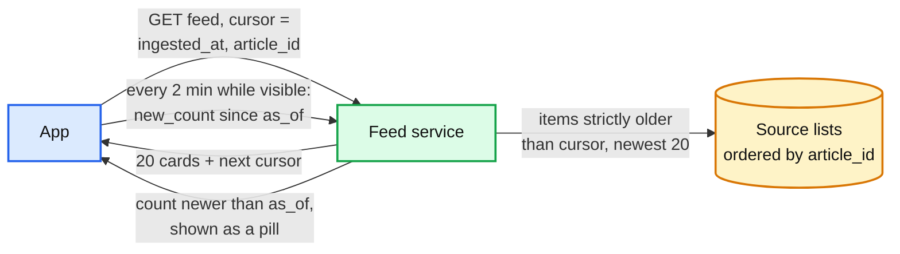

**Still missing:** the "For you" tab is ranked, and a rank is not a stable key. Between page 1 and page 2 a story's click velocity changes its score, so it can move from position 25 to position 15 (seen twice) or from 15 to 25 (skipped). Keyset on a score that moves is wrong (§5.4).

### 4.5 Click through: redirect to the publisher and record the click

**Flow**

1. Every card's link is `/r/{article_id}?s=<session_id>&p=<position>`.
2. The **redirect route** runs on the feed service, which already holds the recent corpus. It looks up the canonical URL by `article_id` (Postgres replica plus a cache for articles older than 72 h) and returns **302** `Location: <url>`.
3. Before responding it appends a click event `{user_id, article_id, story_id, session_id, position, ts}` to a local buffer. A background thread ships the buffer to Kafka topic `clicks` (keyed by `user_id`) every 100 ms. The user never waits on Kafka. A server crash loses at most its last 100 ms of clicks.
4. A **Flink** job consumes `clicks` and batched impressions and keeps two things: per-story click velocity over the last 15 minutes by region (a ranking feature and the trending list), and each user's profile (a topic vector as an exponential moving average of what they click), written to the profile store (durable) and the user cache within ~10 s. Flink drops a repeat of the same `(user_id, session_id, article_id)` within 10 minutes, so a double tap or a load-balancer retry counts once.

Why a redirect and not a direct link plus a beacon: the redirect is the click signal hardest to lose to a closed tab or an ad blocker, and it lets us fix a publisher's URL (AMP to canonical) without shipping a client. It costs one extra hop, ~20 to 50 ms. Looking the URL up by id, and storing only links on the publisher's registered domains, means `/r/` can only send users where the publisher's own site would: not an open redirect. `/r/` is exempt from load shedding (a map lookup and a 302). If it fails anyway, the app opens the card's direct `url` and reports the click in its next events batch.

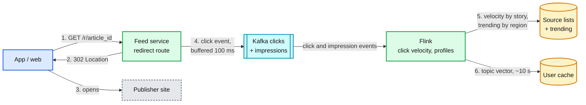

**Still missing, and the list §5 works through:** freshness and completeness at the publisher boundary (5.1), syndicated copies (5.2), the Redis read path at 120k/s (5.3), stable pages for a ranked feed (5.4), breaking news on both sides (5.5), users and articles with no history (5.6), and what dies and what happens at 10x (5.7).

---

## 5. Deep dives

One per non-functional requirement, phrased as the interviewer's question. Each says what breaks in the §4 design, the fix, and what changed.

### 5.1 "Publishers return only their latest 25, rate limit you, and go down. How do you see every article within 5 minutes?"

This is the red node. The ladder:

| Rung | Approach | What breaks |
|---|---|---|
| Bad | Cron polls every publisher every N minutes with a plain GET | One N for 10,000 publishers. N = 1 min wastes 99% of polls on quiet sites and gets us rate limited. N = 15 min misses items from any publisher that posts 25 in 15 minutes, silently. A slow publisher blocks a cron thread. One bad publisher's timeouts delay everyone |
| Good | Per-source interval from the observed rate, conditional GET, retries with backoff | Handles the average day. Still no idea when the 25-item window overflowed, no answer to 429s beyond retrying harder, no isolation between a publisher that is down and one that is merely quiet |
| Great | Adaptive interval bounded by both freshness and the window, overlap-based gap detection with backfill, per-host rate budget with AIMD, circuit breaker per publisher, WebSub push where offered, and a silent-publisher detector | More state per source (all of it in the one `feed_source` row). The window problem is only solved for publishers whose API can page backwards; for the rest we can detect loss, not prevent it |

**Why Great holds.**
- **Interval = min of two bounds, floored by the rate limit.** `T = max(T_min, min(T_fresh, 25 / (2λ)))`. λ counts ids entering the 25-item window per minute (new items, plus edited items that a feed sorted by `updated` moves back to the top). It is estimated fast-attack, slow-decay: `λ = max(hour-of-week EWMA, EWMA of the last 3 polls, the rate seen in the last poll)`, because the hour-of-week average has never seen today's burst. `T_fresh` is 3 min for the top ~500, 15 min for the rest, and 30 min for non-top sources that also push through WebSub. `T_min` comes from **half** the host's request budget, so page-back always has spare tokens. That gives the lossless condition out loud: with R requests a minute to a host, a publisher is safe while `λ ≤ 12.5R`. Add ±10% jitter so 10,000 sources never align on the minute.
- **Overlap tells you about loss.** Each poll compares the 25 returned ids with `known_ids` from the last response. An item counts if its id **or** its canonical URL hash is known, and it is unchanged (same title hash, and for a feed sorted by `updated`, the same `updated` stamp, so a bumped re-publish cannot fake overlap either). The URL half keeps a one-time guid migration from looking like a gap. The unchanged half matters because in a feed sorted by `updated` an edited old item jumps back into the window and would fake overlap while new items fall off. Overlap ≥ 1 then proves the window covered the gap. Overlap = 0 means 25 or more new items since the last poll: a **suspected gap**. Response: poll again at `T_min`, and if the API can page (`page=2`, `before=<id>`, `since=<ts>`) walk backwards until an id overlaps, at most 5 pages per claim, renewing the lease before each page, using only spare host tokens, and at most ~30 pages per source per hour. A new gap found during a walk extends the running walk's stop boundary instead of starting another. A storm longer than about an hour can reach the page cap (the 60-minute simulated storm used 33 pages at 2 requests a minute); that loss is flagged like any other. An unfinished walk stores `backfill_before` on the row and resumes on the next claim. (A cap on walks rather than pages looked safer and was not: in the deep dive's storm simulation it lost 27 items that the uncapped walk recovered, because spare tokens already bound the load.) If it cannot, record `gap_suspected{publisher}` and fetch the publisher's sitemap or section page as a second source. The metric is what makes "no silent loss" true: loss may happen, but never silently. The simulation shows the boundary: at 1 request a minute to the host, a 25-a-minute burst breaks `λ ≤ 12.5R`. A 20-minute burst is recovered late by page-back (burst p95 ~6 min, past the 5-minute target); a 60-minute burst loses ~130 items, every gap flagged. At 2 requests a minute both are lossless. Those numbers are the case for asking the publisher for push or a `since` parameter.
- **Unstable guids.** Some CMSs mint a new guid on every fetch. Overlap is then always 0 and every poll looks like a gap. Detect it: an item whose canonical URL is already known under a different guid. After 3 such polls the source is flagged `unstable_guid`, and its ids become canonical URLs.
- **Conditional GET makes frequent polling cheap for both sides.** A 304 is ~300 B and costs the publisher almost nothing, which is why they tolerate 3-minute polling at all.
- **429 means "slower", not "retry".** Honour `Retry-After` (seconds, or an HTTP date read against the response's own `Date` header, not our clock) by releasing the row with `next_poll_at` at its expiry, never by waiting while holding the lease. A 429 never counts toward the circuit breaker: the publisher is healthy, we are too fast. Then halve the allowed rate for that host (multiplicative decrease) and add back one request per minute every 10 clean minutes (additive increase), up to the contracted rate. The budget is a token bucket per host in Redis, because several sources can share one host. If Redis is down, workers fail closed to 1 request per minute per host from a local limiter. The bucket has priorities: head polls first, then page-back, then the page worker's article fetches, so a storm of new articles cannot starve the polls that detect them. Where the API and the website are different hosts, they have separate budgets.
- **Their CDN caches their feed.** Many publishers serve the feed through a CDN with `Cache-Control: max-age=N`. Polling faster than N returns the same bytes. Read `Age` and `max-age`, and floor `T` at the remaining lifetime unless the publisher agreed otherwise.
- **A circuit breaker per publisher isolates failure.** 5 consecutive timeouts or 5xx: open the circuit, back off 1, 2, 4 ... up to 30 min with jitter, then one half-open probe. Blast radius: that publisher's freshness. The worker never waits on it, because the 10 s timeout and the lease bound every attempt.
- **Push when offered.** A publisher with a WebSub hub notifies our callback within seconds of publishing; we verify the `X-Hub-Signature` HMAC, then fetch (or use the "fat ping" body). We keep polling anyway, because a push that never arrives looks exactly like a quiet publisher: every 3 min for the top ~500 (push only makes them faster, and the poll bounds a dead push against the 5-min target) and every 30 min for the rest. An item found by a poll that the push never delivered increments `push_missed`, and two misses in an hour revert the source to plain polling at `T_fresh`. Subscriptions are renewed at 80% of the lease the hub granted.
- **Silent publishers are a monitoring problem, not a polling one.** Expected items come from the hour-of-week rate of **new** items only (the scheduling λ also counts edits, and an edit-heavy publisher would get a threshold that is too short). Zero new items for longer than `max(9.2 / λ_new, 30 min)` raises a ticket. For a Poisson publisher that silence has a 1-in-10,000 chance of being legitimate (e^-9.2 ≈ 10^-4): ~46 minutes for a top publisher at 12 items an hour. The ticket carries a diagnosis: 304 with the same ETag for hours (their feed generator is stuck), 200 with only old items (lull or stuck), parse errors (our parser broke, or they changed format), 403 or an HTML challenge page (we are blocked), or the homepage has links newer than the feed (our side is broken). A top-20 publisher pages instead of ticketing.

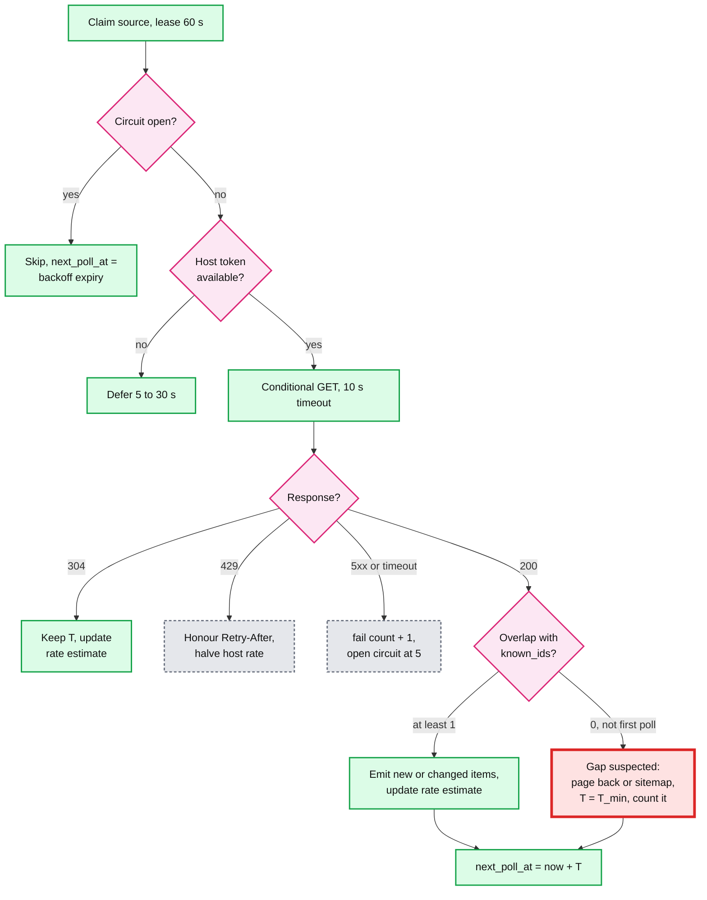

Push back on the textbook: "put the poll jobs on a queue and scale the fetchers" is the reflex, and it answers the wrong question. Fetch capacity is ~13 requests a second; one machine does it. The binding constraints are the publisher's rate limit and its 25-item window, and no number of fetchers changes either. The Staff answer is to spend polls where λ is high, detect the loss you cannot prevent, and ask the top publishers for push or a `since` parameter. That last one is a business conversation, not an engineering one, and saying so is the signal.

**What changed:** `feed_source` gained `est_rate_per_min`, `known_ids` with title hashes, `unstable_guid`, `min_interval_s`, `circuit`, `last_new_item_at`. Metrics gained `push_missed`. Fetchers gained a per-host token bucket in Redis. A WebSub callback endpoint appeared. Monitoring gained per-publisher freshness and `gap_suspected`. Details and runnable Python: [`deep-dives/publisher-polling-and-rate-limits.md`](deep-dives/publisher-polling-and-rate-limits.md).

### 5.2 "The same story arrives from 300 publishers. How do you show it once?"

**What breaks in §4.** Dedup stops at `UNIQUE (canonical_url_hash)`. An AP story carried by 300 newspapers has 300 URLs, 300 guids and near-identical text. The feed shows it five times in one screen. Meanwhile an edited headline is handled (content hash), but a publisher that re-posts the same story under a new URL every hour looks like fresh news.

Five levels, cheapest first. Each level only sees what the previous one let through:

| Level | Catches | Key | Where |
|---|---|---|---|
| 1. Known in last poll | The 20+ of 25 items we saw last time | `known_ids` on the source row | Fetcher, in memory |
| 2. Same publisher item | Re-sends, retries, overlap | `UNIQUE (publisher_id, source_guid)` | Postgres |
| 3. Same URL | Tracking params, AMP, mobile, `http` vs `https` | `UNIQUE (canonical_url_hash)` after canonicalization, `rel=canonical` followed only within the publisher's own domains | Postgres |
| 4. Same text | Verbatim syndicated copies, re-posts under a new URL | 64-bit SimHash over the body or summary (byline and dateline stripped), Hamming distance ≤ 3 | Same publisher: normalizer (alias). Across publishers: clusterer |
| 5. Same event | Reuters and BBC writing the same news differently | Title + lede embedding, cosine ≥ 0.85, within 48 h, plus a shared named entity | Story clusterer |

**Why these choices.**
- **SimHash at k = 3 is a published operating point.** Manku et al. validated 64-bit fingerprints and k = 3 on 8 B web pages ([WWW 2007](https://static.googleusercontent.com/media/research.google.com/en//pubs/archive/33026.pdf)). At k = 3 their precision and recall were both "near 0.75" on full web pages, so do not claim more. They needed permuted sorted tables because 8 B fingerprints occupy 64 GB. **We have 2.1 M** (7 days x 300k, ~17 MB of fingerprints, ~50 MB with ids): a brute-force XOR and popcount over 2.1 M 64-bit words is ~2 ms per new article at 3.5 articles/s. Refuse to build the tables, for now (§5.7 says when).
- **SimHash catches verbatim copies only.** Fingerprint the headline too and a changed headline alone moves ~8 bits (the deep dive's demo), so the input is the body or summary with byline and dateline stripped. A rewrite by another outlet is 30+ bits away. Level 5 carries every reworded copy; level 4 exists because it is cheap and certain.
- **Where each check runs.** `raw-items` is keyed by publisher, so a normalizer sees all of one publisher's items: the same-publisher alias check is complete there. Cross-publisher copies can land on any normalizer, so that SimHash lookup runs in the single clusterer.
- **Levels 4 and 5 attach to a story, never delete.** A syndicated copy is still a real article from a real publisher. A user who follows the Hindustan Times should see its copy of the AP story, not AP's. So dedup decides the `story_id`, and the feed decides which copy to show (§4.3 step 6).
- **Cross-domain canonicals are a clue, not an identity.** A syndicated page often sets `rel=canonical` to the wire's URL. Following it would fold the Hindustan Times copy into AP's row and lose it. So a cross-domain canonical is only a strong hint to the story clusterer.
- **Tune clustering for precision.** Merging two different events into one story hides news. Splitting one event into two cards shows a near-duplicate. The second error is cheaper, so the thresholds are strict and a later merge is allowed: the survivor is the story with more publishers (then the older one, so the card users already saw keeps its id), the other gets `merged_into = survivor`, a merge happens only if the survivor's own `merged_into` is null (no cycles), and feed servers resolve it on read. Centroids freeze after ~10 members [estimate], so a running mean cannot drift and chain adjacent events together. Over-merges need a repair path too: a split job gives a subset of articles a new `story_id` and re-emits their `article.upserted` with `version + 1`.
- **One clusterer.** It is one active process with a hot standby behind a leader lease. At ~35 articles/s it needs no sharding, and a single writer means two normalizers can never create two stories for the same event in the same second. The lease has an epoch, and every story write carries it and is checked in Postgres (the `lease_token` pattern from `feed_source`), so a paused old leader that wakes up cannot create stories after the standby took over.
- **The lead article** is the earliest ingested member with the highest trust tier, recomputed when the story changes. Wires are tier 1. A tier 3 article cannot lead a story that has a tier 1 or 2 member.
- **Edits vs republish spam.** An edit keeps `article_id` and `ingested_at` and bumps `version`, so it never moves up the feed. A new URL from the **same publisher** with a SimHash within 3 of one of its own articles from the last 7 days is an alias: it updates that article instead of inserting and records the new key in `article_alias`, so it cannot jump to the top of the Following tab and a replay stops at level 2 or 3. From a different publisher it is a syndicated copy and joins the story. A publisher whose "edits" arrive every few minutes on the same article gains nothing in ranking (edits never refresh freshness), and flagged if it keeps doing it. Edits reach feed servers at most once per article per 10 minutes [estimate]; retractions are never delayed.
- **Retractions** cannot be inferred from absence (dropping out of the latest 25 is normal). They come from three places: a deleted flag where the publisher's API has one, a 404 or 410 on a `HEAD` recheck of the last 24 h of top-500 articles (~150k a day, ~2/s), and an editor or legal takedown. Each becomes `article.upserted` with `status = retracted`, `version + 1`.

**What changed:** the normalizer gained a same-publisher SimHash set and `article_alias`. The story clusterer, one active process behind a leader lease, keeps the cross-publisher 7-day SimHash set and an in-memory index of the last 48 h of story centroids (~200k stories), rebuilt at startup from the `embedding` and `entity_ids` columns. `STORY` gained `merged_into` and a split job. Same-publisher near-duplicates became aliases. A retraction recheck appeared. The card gained `more_sources`. `/v1/stories/{id}` appeared. Details and runnable SimHash: [`deep-dives/dedup-and-story-clustering.md`](deep-dives/dedup-and-story-clustering.md).

### 5.3 "How do you serve 120k feeds a second under 200 ms? Fan-out on write or on read?"

**What breaks in §4.** The Redis design does ~3.6 M `ZREVRANGE`s and 120k 500-key `MGET`s a second. Worse, the keys are not uniform: `src:cat:world`, `trending:us` and the top 20 publishers appear in most requests, and each key lives on one shard. At a spike, one shard serving `src:cat:world` sees a large fraction of 120k reads a second while its neighbours idle. The hot shard falls over first.

| Rung | Approach | What breaks |
|---|---|---|
| Bad | Fan-out on write: a timeline per user, push each new article into every subscriber's timeline (Twitter's 2012 model, 800 entries per timeline in Redis) | ~694k inserts/s from publisher subscriptions, ~35 M/s with categories (§2), 3x more entries than users ever see. A subscribe or unsubscribe must rewrite a timeline. Ranking changes would need a re-fan-out. The count is for DAU only: registered users double it unless inactive ones are skipped. A Twitter-style 800-entry timeline would fill in ~38 minutes (20 publishers x 30 + 5 categories x 6,000 = ~30,600 entries per user a day). Twitter itself moved "high value users" to read-time merge; here every publisher is one |
| Good | Fan-out on read from Redis source lists (§4.3), with replicas for hot keys | Works. ~30 network round trips per request (pipelined, ~2 to 5 ms), 3.6 M ops/s, ~18 GB/s of list replies plus ~36 GB/s of cards (~430 Gbps [estimate]), hot keys solved by replicating them to many shards. The hottest key at a spike is the breaking story's card, in every request. A Redis cluster of dozens of nodes to serve 25 MB of data |
| Great | **Replicate the whole recent corpus into every feed server.** Each server consumes `article-events` and holds the 72 h cards (~0.9 GB) and every source, category and topic list (~25 MB) in process. A feed request touches the network only for the user's own state | A new server must load ~1 GB before it takes traffic. Servers apply events independently, so two servers can differ by a second. Memory grows with the corpus, not with users: the seam at 10x (§5.7) |

**Why Great holds.**
- **The data that every request needs is small and shared; the data that is per-user is big and needed once.** So replicate the first and partition the second. Same shape as Facebook's Multifeed, where "20 leaf servers ... make up one full replica containing the index data for all the users" and CPU-heavy aggregators rank ([Meta, 2015](https://engineering.fb.com/2015/03/10/production-engineering/serving-facebook-multifeed-efficiency-performance-gains-through-redesign/)). Our index is small enough that one server is a full replica.
- **Hot keys disappear.** Every server has its own copy of `world`. A spike in reads is a spike in CPU, and CPU autoscales.
- **Per-request cost:** user state from Redis (1 round trip, ~0.5 ms), merge ~30 lists into 500 candidates (a heap, microseconds), rank (a small model over ~20 features, ~1 ms), collapse and serialize (~0.5 ms), write the session (1 round trip). ~2 ms CPU, p50 ~10 ms, p99 well inside 200 ms.
- **Bootstrap:** a snapshotter writes the corpus to the object store every minute with the Kafka offsets it reflects. A new server loads the snapshot (~1 GB, ~10 s), replays `article-events` from those offsets (~1 minute of events), and only then passes its readiness check. Why not replay 72 h from Kafka: ~4.5 GB per server, ~135 GB pulled from the brokers ingest depends on if 30 servers join in a spike. A missing or corrupt snapshot falls back to the previous one, and if none is usable, a rebuild from a Postgres replica plus `offsetsForTimes`. Snapshot age over 10 minutes is a ticket.
- **Consistency between servers** does not matter for correctness: keyset cursors only need items older than the cursor, which every server has (§4.4), and ranked pages come from a frozen session (§5.4).
- **A user following 5,000 sources** (the Feedly power user, and PracHub's follow-up) costs 5,000 list heads in a heap: ~0.5 ms of cache misses in memory. In the Redis design it would be 5,000 round trips. That follow-up is the cleanest argument for Great. It is also why the merge key is weighted (§4.3 step 5): newest-first over 5,000 lanes would fill 500 candidates with the last ~5 minutes.
- **Images** never touch the feed service: cards carry an immutable CDN URL. The CDN serves ~1.8 PB a month (§2) at a >95% hit rate, because the hot set is a few thousand thumbnails.

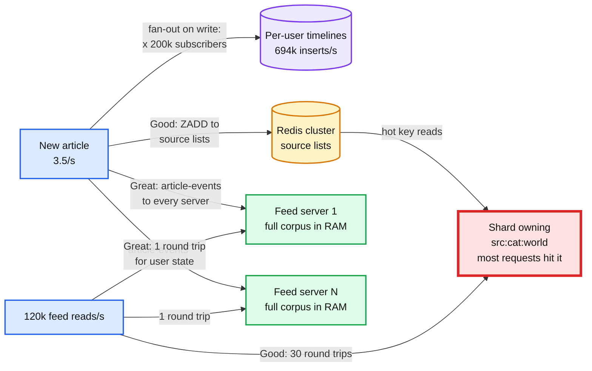

Push back on the textbook: the expected answer is "hybrid: push for normal users, pull for celebrities". It is the right answer for Twitter and the wrong one here. The hybrid exists because most Twitter writers have few followers. Here the smallest publisher has thousands, and a category has millions. The hybrid we do build is different: **read-time merge for content, precompute for users** (profiles and interest vectors are computed in the background by Flink and a nightly job). If the interviewer insists on fan-out on write, do the math out loud: 694k/s to serve 3.5/s.

**What changed:** the index builder and the Redis source lists are gone; the feed service consumes `article-events` itself. A snapshotter and a readiness gate appeared. Redis keeps only per-user state (user cache and sessions). Details: [`deep-dives/feed-read-path-and-fan-out.md`](deep-dives/feed-read-path-and-fan-out.md).

### 5.4 "How does infinite scroll stay stable once the feed is ranked?"

**What breaks in §4.** Keyset works on the Following tab because `article_id` never changes. On For You the order key is a score that changes every minute (click velocity, age decay, the user's own clicks). Page 2 recomputed from scratch repeats stories that rose and skips stories that fell.

| Rung | Approach | What breaks |
|---|---|---|
| Bad | `OFFSET 20 LIMIT 20` on a fresh ranking each page | Every new article or score change shifts positions: duplicates and skips on every page. Also O(offset) work |
| Good | Keyset on `(score, story_id)` | The score of an item already served can change, so it can reappear below the cursor or vanish above it. Correct only if scores are frozen |
| Great | **Freeze the ranking.** Page 1 ranks ~300 stories once, stores the id list in a feed session (Redis, 2.4 KB, TTL 20 min), and returns 20. Cursor = `{session_id, offset, as_of_seq, bk}`, signed. Pages 2 to 15 are slices of the frozen list, hydrated from the in-memory corpus | ~11 GB of Redis normally, ~110 GB in a long spike. A session that expires or is lost needs a fallback |

**Why Great holds.**
- **A session is a snapshot, not a cache.** Its contents never change after page 1. Deterministic pagination is exactly "slices of one list".
- **`as_of_seq` means the same thing on every server.** It is the article id at page 1's settle cut (now minus 30 s, §4.4). Article ids are time-ordered and global, so "newer than `as_of_seq`" is the same set on any server that is ready. Page 1 ranks only candidates at or below `as_of_seq`, so page 2 on a server that is a few seconds behind still has every card it needs.
- **`offset` is the next unread index**, not a page number: when a retraction is skipped the page extends by one, and the next page starts after it. `bk` holds the ≤ 3 breaking story ids this session has already shown (§5.5). A merge that points two session entries at one survivor shows it once. Page 2+ reads only its slice (`GETRANGE`, ~200 B). The TTL is fixed at 20 minutes from page 1; `maxmemory-policy volatile-ttl`. A reader who scrolls longer than that goes through the 409 resume path below, which is lossless, so a sliding TTL (~140 GB at a spike) is not worth its memory.
- **New articles go to the pill.** `new_count` counts stories newer than `as_of_seq` in the user's lanes. The user decides when to see them, and pull-to-refresh starts a new session.
- **Hydration is live, membership is frozen.** A story's title edit or a retraction shows up on the next page because cards are read from the corpus at request time. A retracted story is filtered out, and the slice extends by one so the page is still 20.
- **Past the end.** At 300 stories (15 pages), the next request builds a continuation session: rank again, exclude the ids already served, freeze the next 300. The new session carries the excluded set (a ~0.7 KB Bloom filter), since the old session may expire first. Page-1 builds are rate limited per user, because each creates a session.
- **Session lost** (TTL, Redis failover): the server answers **409**, and the app re-sends the story ids it has rendered (`POST /v1/feed/resume`, 8 B per story, capped at the last 600 ids, ~4.8 KB). The server re-ranks the candidates up to `as_of_seq`, computing ages as of that cut rather than now, excludes the rendered ids, and freezes a new session. Nothing repeats and nothing already-unseen is skipped. The cheaper "continue below the last score" re-rank was measured in the deep dive at ~4 repeats and ~6 skips per loss. This matters most in a region failover, when every scroller in the region loses their session at once.
- **Unfollow mid-scroll.** The app sends `subs_version` on every request. A newer version than the session's makes hydration drop the unfollowed publisher's cards, from every lane, so for the rest of the session an unfollow acts as a mute. The frozen list is not rebuilt. After a refresh the publisher can reappear through topic or trending lanes, like any publisher the user does not follow.
- **Why not hold the list on the client?** It works and is stateless: return all 300 ids with page 1, hydrate by id. The size is not the problem (~6 KB of ids against ~120 KB of thumbnails on the same page). We did not choose it because the positions we log for training would come from a client anyone can modify, and client-side rules ship slowly through app stores. Its real advantage is worth saying: it survives a region failover.

**What changed:** the For You cursor became `{session_id, offset, as_of_seq, bk}`, signed. `POST /v1/feed/resume` appeared. Redis gained the session keyspace. The client gained a rendered-id set per session. Details and runnable Python: [`deep-dives/pagination-and-feed-sessions.md`](deep-dives/pagination-and-feed-sessions.md).

### 5.5 "Breaking news: 10x readers in two minutes, and 200 publishers in 90 seconds. What happens?"

Two problems at once, on opposite sides of the system.

**Write side: the story itself.**
- The wire and top publishers are on WebSub or a 3-minute poll, and bursts shrink T toward `T_min` (§5.1). Where their rate limit stops us, the gap detector counts what we missed.
- 200 publishers' versions of one event arrive within ~90 s. Levels 4 and 5 of dedup (§5.2) attach them to one story. The feed shows one card whose `publisher_count` climbs from 1 to 200.
- **Breaking detection:** Flink reads `article-events` (story sizes) and clicks. A story whose count of distinct tier 1 and 2 publishers grows by 20 or more in 15 minutes (or by 10% of the market's active tier 1 and 2 publishers, whichever is smaller, so a small metro market can trigger too), or whose log click velocity sits far above the market's baseline (a robust z-score on log velocity, because click velocity is heavy-tailed and a plain "5 sigma" would fire on every normal top story), becomes a breaking **candidate**. Precision-tuned clustering can split the first reports of one event into several stories, so the detector also counts publishers sharing a named entity within a 15-minute bucket. A human editor confirms the "Breaking" label for an **editorial market** (a country or metro, ~50 of them, not our 3 deployment regions), and can merge stories; the label follows `merged_into`. Machines boost ranking; people assign the banner. That answers PracHub's "who is allowed to assign that status?"
- **The breaking lane** is one tiny list per market (≤ 3 stories). The editor's label is a `story_breaking` row written with an outbox event, so it reaches every feed server (and the CDN builder) through `article-events` within seconds, and corpus snapshots include the lanes. Fan-out on read makes this free: one list, not 100 M timeline writes. It sits **outside** the frozen session. A breaking story goes in the response's `breaking` field, which the app pins as a banner, once per session: on the first page served after it breaks. Two things dedup it: the cursor's `bk` on the server, and the app's rendered-id set, which also covers a banner first learned from `new_count`. It is filtered out of the frozen slice, so it never appears twice. It does not touch personalization ("without permanently overriding personalization").
- **Expiry and correction:** `story_breaking.breaking_until` (default 2 h); a correction sets `cleared_at`. An editor clearing a false label emits an event; every server drops it within seconds; no timeline needs cleaning because none were written. The CDN top-stories objects for that market's languages are rebuilt and purged by key at the same time, so the false label does not linger for max-age plus stale-while-revalidate (~90 s).

**Read side: 10x readers.**
- The baseline of ~36 servers is sized for 2x the daily peak at 50% CPU (§2), so at the 75% shed line it serves ~108k/s (~144k/s flat out). An evenly spread 120k/s spike sheds ~10% for the first minutes. The catch is geography: a spike concentrated in one region hits that region's 12 servers, 36k/s at the shed line, and a jump from 12k/s to 96k/s there sheds ~60%. Two fixes: **cross-region spillover** (the other two regions have ~48k/s spare at the shed line; the 3 regions are ~70 ms apart, which fits in 200 ms), and **pre-scaling on the breaking-candidate signal**, which fires minutes before the reader wave and costs a few dollars of idle servers per false alarm.
- Autoscaling adds servers, but a new server needs ~70 s (boot, 1 GB snapshot, replay) before it is ready, after ~1 min for the autoscaler to notice and ~30 s to provision [estimate]: first new capacity lands ~2.5 to 3 min into a spike. That is why headroom and pre-scaling come first.
- **Load shedding** beyond that, cheapest loss first: `new_count` checks, then page-1 builds (the expensive request). Page-2+ slices of an existing session cost almost nothing and are kept, and so are resumes and continuations (they rank like a page 1, but shedding them would replace a scroll mid-way; when a region failover sends every scroller to `/resume` at once, overload answers them with a jittered `Retry-After`, never with the CDN feed), so nobody's scroll is replaced mid-way. `/r/` is never shed. A shed request gets 503 and a jittered `Retry-After` (30 to 90 s), so shed clients do not return in the same second. The app then calls `/v1/feed/top?region=`, which the CDN serves from a pre-built object in the object store, rebuilt every 30 s by a builder that does not depend on the feed tier (`Cache-Control: max-age=30, stale-while-revalidate=60, stale-if-error=600`). Impressions go to the separate events collector, which sheds first of all. Users get the regional top stories, including the breaking one, and personalization comes back when the spike passes. This is how 99.99% holds: the degraded feed counts as up.
- Hot article: the breaking story's card is in every server's memory and its thumbnail in every CDN edge. No hot key exists to melt.

**What changed:** a breaking-candidate detector in Flink, an editor tool, the per-region breaking lane in every feed server, the CDN-cached top-stories page and its 30-second builder, and a load-shedding threshold in the feed service. Push notifications, when built, subscribe to the same breaking lane. Details: [`deep-dives/breaking-news-and-load-shedding.md`](deep-dives/breaking-news-and-load-shedding.md).

### 5.6 "A new user, a new article, a new publisher. What do they see?"

**New user (no subscriptions, no clicks).**
- Onboarding asks for 3 or more categories or publishers. Before they choose, the feed is the regional, language-matched default mix: the top-stories lane plus one story from each of the most popular categories. That is PracHub's "reasonable default mix".
- Each click updates the profile's topic vector within ~10 s (Flink), so the second session is already personal.
- Which categories to probe is a bandit problem: show a mix, learn from clicks, shift toward what works. Yahoo's contextual bandit (LinUCB) on the Today Module reported "a 12.5% click lift compared to a standard context-free bandit algorithm" on "over 33 million events" ([Li et al., WWW 2010](https://arxiv.org/pdf/1003.0146)). That lift was for one featured slot over an editor-curated pool, measured by offline replay on uniformly random traffic, so it fits our exploration slot, not the whole page. v1 is an epsilon-greedy slot; LinUCB is v2.
- The default mix is its own lane (top stories plus one per popular category), not the formula: for a user with no profile the formula is pure popularity.
- The first session is frozen for 20 minutes, but the unserved tail of its 300 ids can be re-ordered with the updated profile after each click. Membership stays fixed, so no duplicates and no skips.

**New article (no clicks yet).**
- Collaborative filtering cannot rank it: nobody has clicked it. Google's own news paper calls this the "first-rater problem" and fixes it with content: a profile of the user's topic interests matched against the article's topic. Their combined method improved click-through "by 30.9%" over the collaborative-only system and site visits by 14.1% ([Liu, Dolan, Pedersen, IUI 2010](https://static.googleusercontent.com/media/research.google.com/en//pubs/archive/35599.pdf)). So `topic_match` is in the v1 score from day one.
- One slot in 10 is an exploration slot: a **uniform random** draw from articles with fewer than N impressions (and, for a new user, from categories not yet probed). Uniform matters: those impressions are the unbiased log that offline replay of a new ranker needs. Cost: ~5% of clicks [estimate].

**New publisher.** Starts at trust tier 3: its articles rank with a lower prior (`x 0.7`) and cannot lead a story that has a tier 1 or 2 member. It moves up on clean dedup (it is not a copy farm), a healthy click rate, and editor review.

**The ranking itself.** v1 is the weighted formula in §4.3 with half-life decay: explainable, debuggable, good enough to launch. v2 is a learned model (gradient-boosted trees on click logs) using the same features, rolled out as a 1% treatment ramp, with a permanent 1% holdout left on the formula, and guardrails on CTR, distinct stories per page and **bounce-back** (the user is back in the app within 10 s of a click: we never see dwell time on the publisher's site, and CTR alone rewards clickbait). v1 scores all 500 candidates; the model re-ranks only the top ~100, because a model at LinkedIn FollowFeed's ~50 µs p99 per record over 500 candidates would be ~25 ms of CPU a request, ~12x the fleet. That is PracHub's "evolve from a popularity baseline to personalization without tanking CTR".

**What changed:** the profile job, an exploration slot, a trust tier on `publisher`, and an experiment framework around the scorer. Details: [`deep-dives/ranking-and-cold-start.md`](deep-dives/ranking-and-cold-start.md).

### 5.7 "What happens when a component dies, and what changes at 10x?"

| Component | Fails how | Blast radius | What happens |
|---|---|---|---|
| One publisher | Down, slow, 429, format change | That publisher's freshness | Circuit breaker, backoff, `gap_suspected`, a ticket. Nobody else notices |
| Poll worker | Crash mid-poll | Its ~20 claimed sources, for ≤ 60 s | Leases expire, another worker claims them. A re-sent item is deduped |
| Postgres primary | Down | Ingest pauses. Reads unaffected | Failover to the sync replica in ~30 s. Polls pause too, because the schedule lives in the same Postgres; items already fetched wait in `raw-items`. After failover, overdue sources are claimed first and checked for zero overlap. A long outage is lossy for fast publishers because of the 25-item window, and the gap metric shows exactly which |
| Kafka | Broker loss | None with replication factor 3 and `min.insync.replicas=2` | Leader moves. A full cluster outage stops ingest; fetchers skip polls without advancing `known_ids`, so nothing is marked seen that was not sent |
| A feed server | Crash | Its share of in-flight requests | Stateless. The load balancer retries. A replacement is ready in ~70 s |
| Redis sessions | Shard loss | A resume round trip for sessions on that shard | 409, the app re-sends its rendered ids, re-rank as of the cut (§5.4). No repeats, no skips |
| User cache | Down | Personalization | Serve the regional default feed; subscriptions are reloaded from the store as the cache refills |
| A region | Lost | Its users, until DNS moves them | Feed serving is active-active in 3 regions, each consuming a mirrored `article-events`, each with its own snapshotter. Subscriptions live in a multi-region KV (async, last writer wins per row) and each region has its own user cache, cold for users moved by DNS. Ingest is active in one region with a warm standby. Before the standby's fetchers start, it replays the mirrored `article-events` into its Postgres (the async replica can be seconds behind), so re-polled items dedup against rows that exist instead of getting new ids. Failover takes ~5 to 10 min, which breaches the 5-min top-500 freshness target for that window: a region loss is a freshness incident |

**At 10x (1 B DAU, 100k publishers, 3 M articles a day):**
- Polls: 100k publishers at 15 min is ~110/s. Still one small fleet.
- Reads: 1.2 M feeds/s at a spike. Feed servers scale linearly; sessions and user cache scale by adding shards.
- **The corpus stops fitting comfortably:** 72 h x 3 M = 9 M cards, ~9 GB per server. That is the seam. Options: keep 24 h in process and fetch older cards from a card tier; or split the corpus by language or region, since a user reads 1 or 2 languages. The second keeps every request in memory.
- Dedup: brute-force compares grow with the **square** of scale (more fingerprints x more articles). At 1x a news peak is 2.1 M x 35/s = ~7.4 x 10^7 compares/s; one thread does ~10^9, reached at ~3.7x; at 10x it is ~7.4 x 10^9/s on a single writer. So Manku's permuted tables arrive at ~4x, not 10x.

---

## 6. Final design and the core flows

```mermaid
%% D3: final design. Red: the fetcher at the publisher boundary. Every feed server holds the full recent corpus, so the only per-request network hop is the user's own state.
flowchart LR
    PUB[Publishers<br/>~10k, latest 25,<br/>RSS, WebSub] -->|"304 or 25 items,<br/>WebSub pings"| FET[Fetcher<br/>adaptive T, gap check,<br/>host budget, circuits]:::critical
    SRC[(feed_source<br/>schedule + state)] -->|"claim due rows"| FET
    FET -->|"new or changed items"| RAW[[raw-items]]
    RAW -->|"new or changed items"| NORM[Normalizer<br/>canonical URL, SimHash,<br/>story clusterer]
    NORM -->|"idempotent upsert<br/>+ outbox"| ADB[(Article DB<br/>Postgres)]
    ADB -->|"outbox relay"| AEV[[article-events]]
    AEV -->|"every server,<br/>snapshot + replay"| FEED[Feed service fleet<br/>72 h corpus in RAM,<br/>merge, rank, redirect]
    USR[(User cache + store<br/>subs, profiles)] -->|"1 round trip"| FEED
    FEED <-->|"frozen pages"| SES[(Feed sessions<br/>Redis, 20 min)]
    APP[App / web] -->|"feed, /r/ clicks"| FEED
    FEED -->|"clicks"| FL[Flink<br/>velocity, profiles,<br/>breaking candidates]
    FL -->|"profiles"| USR
    AEV -->|"story sizes"| FL
    FL -->|"trending, candidates"| FEED
    CDN[CDN<br/>thumbnails, top-stories<br/>fallback, 30 s] -->|"images, degraded feed"| APP

    class APP client
    class NORM,FEED,FL service
    class SRC,ADB,USR store
    class SES,CDN cache
    class RAW,AEV queue
    class PUB external

    classDef client   fill:#dbeafe,stroke:#2563eb,stroke-width:2px,color:#111
    classDef service  fill:#dcfce7,stroke:#16a34a,stroke-width:2px,color:#111
    classDef store    fill:#ede9fe,stroke:#7c3aed,stroke-width:2px,color:#111
    classDef cache    fill:#fef3c7,stroke:#d97706,stroke-width:2px,color:#111
    classDef queue    fill:#cffafe,stroke:#0891b2,stroke-width:2px,color:#111
    classDef external fill:#e5e7eb,stroke:#6b7280,stroke-width:2px,color:#111,stroke-dasharray:4 3
    classDef critical fill:#fee2e2,stroke:#dc2626,stroke-width:4px,color:#111
```

The page worker and object store sit behind the CDN and are left out to stay under 15 nodes. Zoom-ins: [`diagrams.md`](diagrams.md).

Flows to say from memory:

### Flow 1: a publisher posts, a user sees it (FR1)

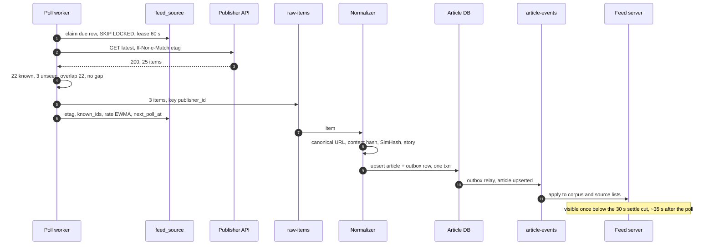

### Flow 2: subscribe, then refresh (FR2)

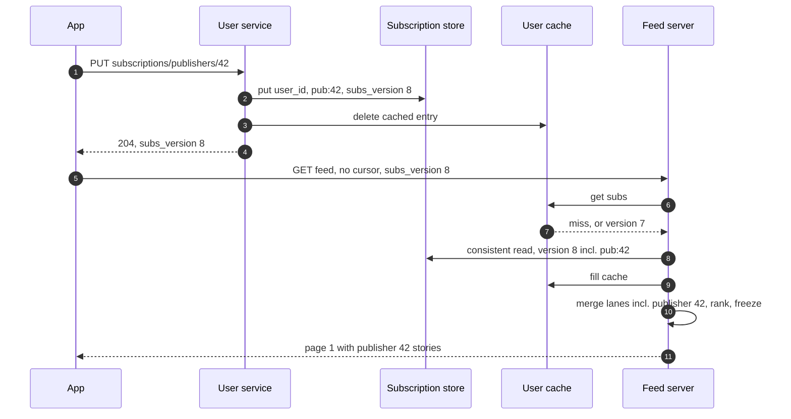

### Flow 3: open For You, page 1 (FR3)

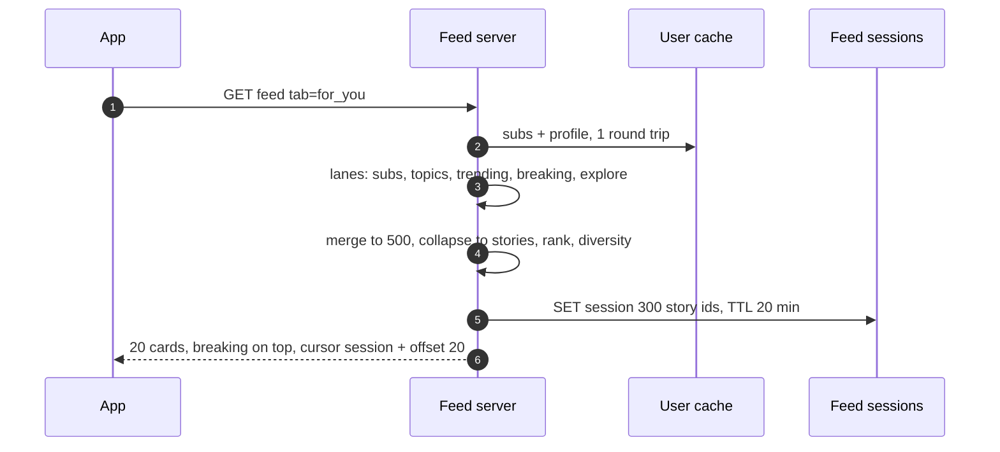

### Flow 4: page 2 while 40 new articles arrive (FR4)

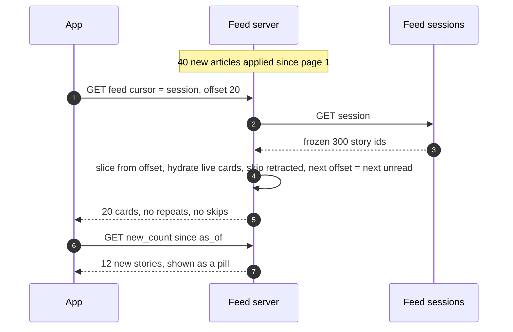

### Flow 5: click through (FR5)

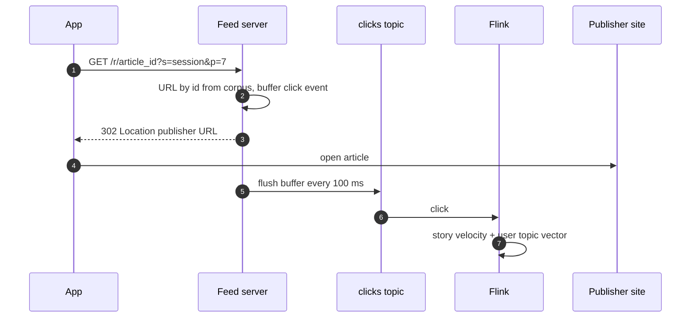

### Flow 6: a publisher rate limits us during breaking news (failure)

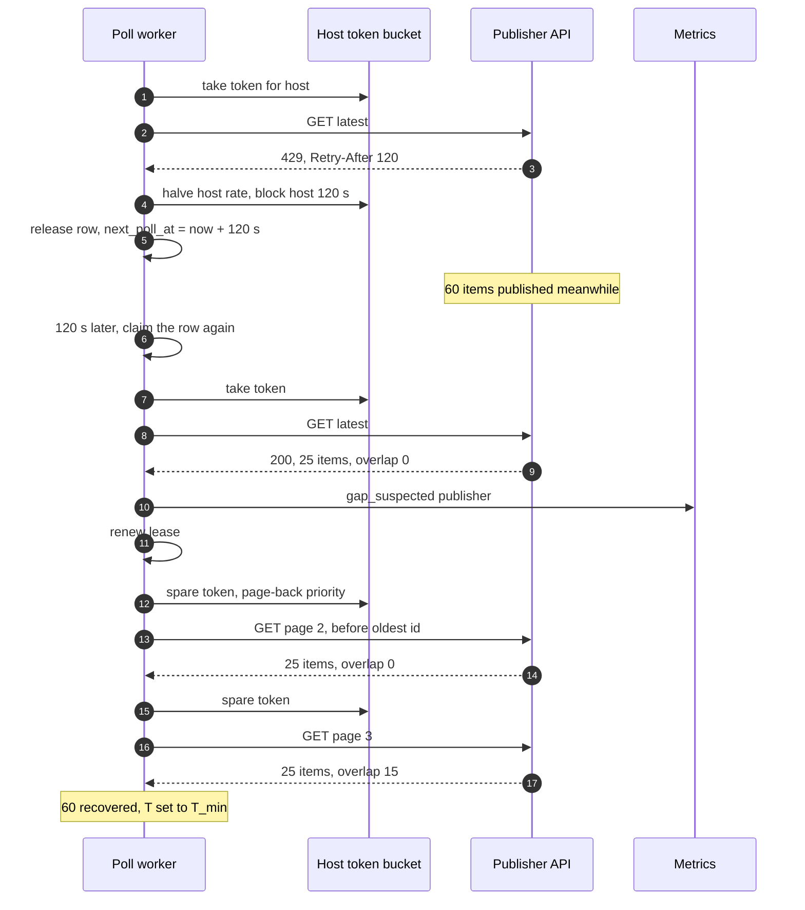

---

## 7. Trade-offs

| Decision | Option A | Option B | Chose | Why |
|---|---|---|---|---|
| Feed assembly | Fan-out on read, whole corpus in every feed server | Fan-out on write to per-user timelines | A | 694k/s writes (35 M/s with categories) to serve 3.5 articles/s. The corpus is ~1 GB |
| Hybrid | Read-time merge for content, precompute for user profiles | Push for small publishers, pull for big ones | A | No publisher is small: 200k subscribers on average |
| Where source lists live | In each feed server's memory | Redis sorted sets | A | 25 MB of data does not need a cluster. Removes hot keys and ~30 round trips per request |
| Poll scheduler | `feed_source` table with `SKIP LOCKED` and leases | Kafka or a distributed scheduler | A | ~13 claims/s. The row already holds the poll state. See [`../distributed-job-scheduler/`](../distributed-job-scheduler/) for when you need more |
| Poll interval | Adaptive: min of freshness and window bounds, floored by the rate limit | Fixed per tier | A | Spends polls where λ is high. The window bound is what prevents loss in bursts |
| Loss handling | Overlap detection, page back, count what cannot be recovered | Assume polling is complete | A | "No silent loss" is testable. "No loss" is not achievable with a 25-item API |
| Push | WebSub where offered, plus polling at 3 min (top 500) or 30 min (rest) | Push only | A | A missing push looks like a quiet publisher. `push_missed` counts what polls caught |
| Syndication dedup | SimHash k = 3, brute force over 2.1 M | Manku's permuted tables, or MinHash LSH | A | ~2 ms per article at our size. Tables at ~4x, where compares hit one thread's limit |
| Duplicates | Attach to a story, choose the copy at read time | Drop duplicates at ingest | A | The user's subscribed publisher should win. Dropping loses that |
| Clustering errors | Tune for precision, allow later merges | Tune for recall | A | Hiding a different event is worse than showing a near-duplicate |
| Following tab order | Our ingest time, keyset cursor | Publisher's `published_at` | A | Backdated and late items would land below cursors and be skipped |
| For You pagination | Frozen session in Redis, 20 min | Keyset on score, or client-held list | A | Scores move. Client-held works but ships the ranking to the client |
| Breaking news | Per-region lane merged at read time, editor confirms | Write into every timeline, or fully automatic | A | Free with fan-out on read, instant to retract, a human owns the label |
| Degraded mode | CDN-cached regional top stories, 30 s | Error page | A | 99.99% needs something to show when personalization is down |
| Article store | Postgres | A wide-column store | A | 220 GB a year, 5 writes/s, unique constraints do the dedup |
| Subscription store | KV partitioned by `user_id` | Postgres with a publisher index | A | ~5 B rows, one access pattern, no reverse lookup on the hot path |
| Click capture | Redirect by id | Direct link + client beacon | A | Cannot be lost to a closed tab. One extra hop |
| Refused to build | Fan-out on write, a distributed poll scheduler, a Redis source-list cluster, MinHash LSH, a real-time ML ranker in v1, hosting article bodies, full-text search | | | Each one is either unnecessary at 3.5 writes/s or out of scope. Naming them is part of the answer |

---

## 8. Staff-level notes

- **Failure modes and blast radius.** The publisher is the unit of ingest failure: circuits and per-host budgets keep one bad publisher from touching another. Ingest as a whole can stop for minutes without users noticing, because the corpus in RAM keeps serving; the cost is freshness plus possible loss from fast publishers whose windows overflow, which the gap metric makes visible. The read path's worst case is personalization loss, and the CDN fallback means "degraded" never becomes "down". The largest blast radius is a bad ranking or clustering release: it affects every feed at once, so both ship behind a 1% holdout with CTR and "distinct stories per page" guardrails and an instant rollback to the previous model.
- **Migration.** From a typical v0 (cron + SQL `WHERE publisher_id IN (...) ORDER BY published_at` + offset pagination): (1) add `feed_source` and move polling to leased workers, first by teeing the old cron's responses into the new pipeline (polling twice would double our request rate against every publisher's limit), comparing item counts per publisher for a week, then switching which side polls. (2) Add the outbox and `article-events`; build the in-memory corpus in a new feed service and serve 1% of reads, diffing the set of items in its Following tab against the SQL one (not the order: the old feed sorts by `published_at`, the new one by `ingested_at`). (3) Ramp reads, keep SQL as the fallback behind a flag. (4) Switch pagination to keyset: an old offset cursor restarts from the top. (5) Add ranking and sessions to For You behind an experiment. Rollback at every step is a flag flip; nothing is destructive until the SQL path is removed.
- **Operability.** SLOs: feed p99 < 200 ms and 99.99% (degraded counts); p95 freshness 5 min for the top 500 and 30 min for all; zero unexplained gaps (every `gap_suspected` is resolved or accepted within a day). Page at 3 am: feed 5xx (not shed 503s) > 0.1% for 5 min; fallback-feed rate > 20% for 10 min; top-500 freshness p95 > 10 min for 15 min; `article-events` consumer lag > 60 s on more than 10% of feed servers; the oldest unpublished outbox row older than 60 s (a stuck relay is invisible to consumer lag, because the topic just goes quiet); Postgres primary down. Ticket, not page: one publisher's circuit open for > 2 h (page if top 20), a silent publisher, a gap that paging could not recover.
- **Cost.** Compute is small: ~36 feed servers baseline (~$9k a month), Redis ~$3k, Postgres primary and two replicas ~$3k, Kafka and Flink ~$4k, the subscription store a few $k. Thumbnail egress is ~1.8 PB a month, **~$18k to $36k**, the largest line item. The Staff lever is images, not servers: 12 KB AVIF thumbnails, lazy loading only visible cards, long client cache lifetimes on immutable URLs. Engineering: ingest (polling, dedup, clustering) is one team; feed serving and ranking another; a small editorial tools effort.
- **Team boundaries.** Publisher partnerships owns the contracts (rate limits, WebSub, a `since` parameter for the top publishers), and those contracts are an input to `min_interval_s`. Ingest owns `feed_source`, the normalizer and the `article-events` schema, which is the contract with serving and must be versioned. Serving owns the feed service, sessions and the CDN fallback. Ranking owns features, the model and experiments, and ships models into the feed service, not a separate hop. Editorial owns the breaking label.

---

## 9. What is expected at each level

**Mid (80/20).** A crawler polls RSS feeds on a schedule, stores articles in a database, dedups by URL, users subscribe, the feed is a query over subscribed publishers ordered by time, a cache in front, offset or timestamp pagination, click opens the URL. Probably treats polling as solved and dedup as "unique URL".

**Senior (60/40).** Does the read-to-write math and chooses fan-out on read, or a hybrid with a clear reason. Conditional GETs, backoff on errors, a per-publisher schedule. Cursor pagination on a stable key. Dedup by canonical URL and a content hash, maybe SimHash. A cache per source list. Mentions story clustering and ranking by recency and popularity. May not notice the 25-item window problem, may not separate "Following" from "For You" pagination, and may design breaking news as a push to every timeline.

**Staff+ (40/60).** Starts from the numbers and shows fan-out on write is 694k/s to serve 3.5/s, and that every publisher is a celebrity. Sees that the recent corpus is ~1 GB and replicates it into every feed server instead of building a cache cluster. Treats the publisher boundary as the hard part: the window rule `T ≤ 25 / 2λ`, overlap-based gap detection, AIMD on 429, circuits, and says the real fix for the top publishers is a push or `since` contract. Five dedup levels, with duplicates attached to stories rather than dropped so subscriptions win. Keyset for chronological, a frozen session for ranked, the pill for new items. Breaking news as a read-time lane with a human owner and instant retraction. A degraded CDN feed for 99.99%. Names what was refused, and notices that thumbnail egress, not compute, is the bill.

---

## 10. Nitty-gritty (past interview scope)

### 10.1 Internals of each chosen technology

- **Postgres `FOR UPDATE SKIP LOCKED`.** Each worker's `SELECT ... FOR UPDATE SKIP LOCKED` takes row locks on the rows it returns and silently skips rows another transaction has locked, so N workers claim disjoint sets without waiting. The claim transaction is short: select, set `lease_until`, commit. The HTTP call happens after commit, outside any transaction, so a slow publisher never holds a lock. The lease column, not the lock, is what survives a worker crash.
- **Kafka for `raw-items` and `article-events`.** Both keyed by `publisher_id`, so one publisher's items are ordered within one partition, which the normalizer relies on for "edit after create". 12 partitions each is plenty at ~5 msgs/s; the number is for consumer parallelism, not throughput. Producers use `acks=all` with idempotence on, so a retried send is not duplicated within a producer session. Every feed server reads **every partition by manual assignment**, with no consumer group, because every server needs every event and a group per server would leave orphaned groups behind as servers autoscale. Offsets are stored in the corpus snapshot, not committed to Kafka, because the snapshot is what the offset describes. Each region runs its own snapshotter: a mirrored topic has different offsets from the source cluster.
- **Redis.** Two roles, both per-user: the user cache (a hash per user: subs set, profile vector) and feed sessions (a string per session with a TTL). Single-threaded command execution per shard, so a 2.4 KB `SET` or `GET` is ~microseconds of shard time; ~100k ops/s total at a spike spread over 6 shards. Cluster mode shards by hash slot (16,384 slots) of the key, so `session:{id}` spreads uniformly.
- **The in-memory corpus.** A map `article_id -> Card` plus per-lane arrays of article ids sorted descending, each capped (200 per publisher, 72 h per category and topic). Applying an event is: upsert the card, and for a new article prepend its id to each lane it belongs to (ids are time-ordered, so prepend keeps the order; an out-of-order arrival is inserted by binary search). Expiry is a sweep every minute that drops cards older than 72 h and trims lanes.
- **SimHash.** Tokenize the normalized text into shingles, hash each to 64 bits, and for each bit position add the shingle's weight if the bit is 1 and subtract it if 0. The fingerprint's bit i is 1 if the sum is positive. Similar documents share most shingles, so most sums keep their sign, and the Hamming distance between fingerprints is small.

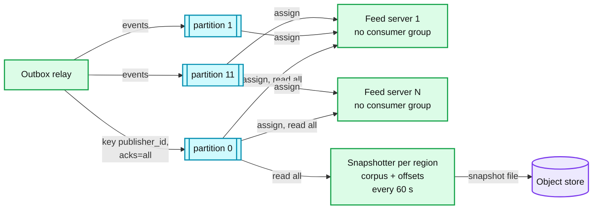

### 10.2 Configuration knobs that matter

| Component | Knob | Value | Why |
|---|---|---|---|
| Fetcher | HTTP timeout | 10 s connect + read | Bounds a worker's time per source; the lease is 60 s |
| Fetcher | Circuit | open after 5 failures, max backoff 30 min, ±20% jitter | One bad publisher never costs more than a probe every 30 min |
| Scheduler | `T_fresh` | 3 min top 500, 15 min others | p95 2.9 and 14.3 min against 5 and 30 min targets (§2) |
| Scheduler | Window safety factor | 2 (`T ≤ 25 / 2λ`) | A burst can double λ within one interval |
| Scheduler | Lease | 60 s, renewed before each page-back page | > timeout + processing, short enough for fast recovery |
| Scheduler | Page-back cap | 5 pages per claim, ~30 pages per source per hour, spare tokens only | A broken source cannot turn every poll into 11 requests. Capping pages, not walks, keeps storms lossless (§5.1) |
| Feed | Following settle window | 30 s, readiness fails at 20 s consumer lag, normalizer txn timeout 5 s | Makes keyset exact across servers (§4.4) |
| Kafka | `acks`, `min.insync.replicas`, RF | all, 2, 3 | Losing an article event means a card missing on every server until the next snapshot rebuild |
| Kafka | `article-events` retention | 7 days | Enough to rebuild a corpus from any snapshot in the last week |
| Normalizer | SimHash Hamming threshold | 3 | Manku's validated point for 64-bit fingerprints |
| Clusterer | Cosine threshold, window | 0.85, 48 h | Precision first (§5.2) |
| Feed | Corpus window | 72 h | Nobody scrolls to 3-day-old news in a feed; older stories are reachable by story page |
| Feed | Session TTL, size | 20 min, 300 stories | Covers a scroll session; 15 pages is past what almost anyone scrolls |
| Feed | Load-shed threshold | 75% CPU or 200 in-flight per server | Keeps p99 under 200 ms for requests that are served |
| Ranking | Freshness half-life | 6 h | A 12-hour-old story needs 4x the relevance of a new one. Relevance tops out at 3.2, so a 30-hour-old story scores at most 0.1: For You is in effect a one-day feed |
| CDN | Top-stories page | `max-age=30, stale-while-revalidate=60, stale-if-error=600`, origin is a pre-built object | 30 s freshness, never a miss storm, survives the feed tier being down |

### 10.3 Capacity math per component

| Component | Load at spike | Capacity per unit | Units | Closest to limit? |
|---|---|---|---|---|
| Fetcher | ~13 polls/s normal, ~50/s in a burst | ~100 concurrent fetches per worker | 3 workers for redundancy | No. **The publisher's limit is** |
| Normalizer | ~35 articles/s | SimHash brute force ~2 ms, clustering ~20 ms | 2 | No |
| Postgres | ~40 writes/s | thousands/s | 1 primary + 2 replicas | No |
| Feed servers | 120k req/s x 2 ms CPU | 8 vCPU at 50% = ~2k req/s | ~60 | Yes, at the first minutes of a spike: headroom + shedding |
| Feed server RAM | ~1 GB corpus + ~1 GB working | 16 GB | | No, until 10x (§5.7) |
| Redis sessions | 35k writes + ~85k reads/s, ~110 GB | ~100k ops/s, ~25 GB per shard | 6 shards + replicas | Memory in a long spike |
| User cache | 120k reads/s, ~100 GB | same | 6 shards + replicas | No |
| Kafka clicks + impressions | ~2.3 M items/s at spike x 60 B = ~140 MB/s | ~10 MB/s per partition comfortably | 48 partitions | Moderate |
| CDN | ~7 GB/s of images at spike | provider | | Cost, not capacity |

### 10.4 Failure timeline

**Postgres primary dies at t = 0 while a breaking story is being ingested.**

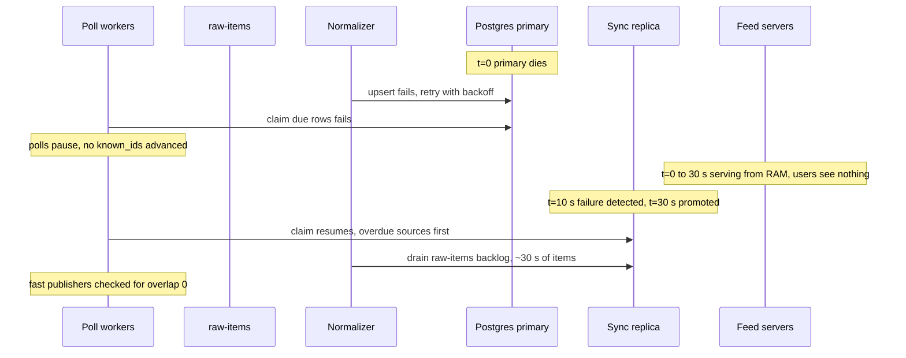

What the user sees: nothing. What on-call sees: a primary-down page, a freshness dip of ~1 minute, possibly a few `gap_suspected` on burst publishers.

**A feed server is added during a spike.** Boot ~20 s, load snapshot ~10 s, replay ~1 minute of events ~5 s, warm the JIT and connection pools ~30 s, then readiness passes: ~70 s. The first 70 s of any spike are carried by headroom and shedding, which is why §5.5 sizes headroom first. Full sequence in [`diagrams.md`](diagrams.md).

### 10.5 Exactly-once and idempotency end to end

| Hop | Duplicates enter because | Removed by | Key | Lives |
|---|---|---|---|---|
| Publisher to fetcher | Overlapping 25-item windows, re-polls after a crash | `known_ids` id + title hash | guid, or canonical URL for `unstable_guid` sources | One poll |
| Fetcher to raw-items | Crash after produce, before the row update | Normalizer upsert | `(publisher_id, source_guid)`, `canonical_url_hash` | Forever (unique index) |
| Normalizer to Article DB | Consumer restart replays | Upsert is a no-op if `content_hash` is equal | same | Forever |
| Article DB to article-events | Outbox relay retry | Consumers apply only if `version` > current | `(article_id, version)` | 72 h in the corpus |
| Syndicated copies | 300 publishers | Story attachment, not removal | `story_id` | 48 h clustering window |
| Clicks | Double tap, load-balancer retry of `/r/` | Flink dedup | `(user_id, session_id, article_id)` | 10 min state |
| Feed pages | Scroll after ranking change | Frozen session + client rendered-id set | `story_id` | Session |

The result is effectively-once to readers: an article can be processed many times, but a user sees one card per story, and a count of clicks is right within the dedup window.

### 10.6 Consistency model per edge

| Edge | Model | Why it is enough |
|---|---|---|
| Publisher to fetcher | None: external, at-least-once, possibly lossy (detected) | We do not control it |
| Normalizer to Article DB | Strong (unique constraints, one transaction with the outbox) | Dedup and "event only after commit" depend on it |
| Article DB to feed servers | Eventual, ~1 to 5 s, per-publisher order | Nobody can tell 3 s from 0 s |
| Feed server to feed server | Eventual, may differ by seconds | Cursors and sessions do not depend on server agreement |
| User to own subscriptions | Read-your-writes (`subs_version` carried by the app) | "I followed it and it is not there" is a bug report |
| Within a scroll session | Snapshot | Deterministic pagination |
| Clicks to ranking features | Eventual, ~10 s, approximate | Features are statistics |
| Across regions | Eventual: articles +~1 s mirror lag, subscriptions async multi-region KV | Same article event stream everywhere. Subscription writes go to the user's home region, so each user has one writer and `subs_version` orders their writes. A request whose `subs_version` is ahead of the local replica reads from the home region |

### 10.7 Alternatives rejected

| Alternative | Why it looked attractive | Why rejected |
|---|---|---|
| Fan-out on write (Twitter 2012 model) | The famous answer; O(1) reads | 694k to 35 M inserts/s for 3.5 articles/s |
| Redis sorted sets per source | Standard, simple | Hot keys, 30 round trips per request, a cluster for 25 MB |
| Elasticsearch as the feed store | Filters, sorting, text search in one | A query per feed read at 120k/s, for a problem that is a merge of short lists |
| Crawl the publisher's HTML | Works for publishers without an API | Brittle, slow, and robots and legal issues. Sitemaps and section pages only as a gap fallback |
| MinHash + LSH for dedup | More precise Jaccard estimate | More memory and tuning; SimHash is enough at k = 3 for near-identical wire copies, and clustering handles the rest |
| A distributed scheduler (Kafka delayed topics, Temporal) | Scales to millions of jobs | 10k rows. A table with leases is simpler to reason about and debug |
| Kinesis instead of Kafka | Managed | Either works. Kafka's per-key ordering and replay from an offset in a snapshot are the features we use |
| Client-held ranked list | Stateless server | Ships the ranking to clients, heavier page 1 |
| Real-time learned ranker in a separate service | Better relevance | Another network hop on every request. The model runs in the feed service |

### 10.8 How the big companies do it

- **Google News.** Personalization mixes collaborative signals with a content-based profile of topic interests, because news items are gone before collaborative filtering can learn them (the "first-rater problem"). The combined method raised CTR 30.9% over collaborative-only and visits 14.1% ([Liu et al., IUI 2010](https://static.googleusercontent.com/media/research.google.com/en//pubs/archive/35599.pdf)). Google's crawl-side near-duplicate detection is the SimHash paper we use ([Manku et al., WWW 2007](https://static.googleusercontent.com/media/research.google.com/en//pubs/archive/33026.pdf)).
- **Twitter (2012).** Fan-out on write into Redis timelines of at most 800 entries, 300k timeline reads/s vs 6k writes/s, and "up to 5 minutes for a tweet to flow from Lady Gaga's fingers to her 31 million followers", which is why it moved "to doing more work on reads for high value users" (HighScalability's write-up of Krikorian's QCon talk, [link](https://highscalability.com/the-architecture-twitter-uses-to-deal-with-150m-active-users/)). Our case is that trend taken to its end: every writer is high value.
- **Facebook Multifeed.** Fan-out on read with memory-heavy leaves holding recent actions ("20 leaf servers ... make up one full replica") and CPU-heavy aggregators that rank; splitting them gave "40% efficiency improvement" ([Meta, 2015](https://engineering.fb.com/2015/03/10/production-engineering/serving-facebook-multifeed-efficiency-performance-gains-through-redesign/)). Our corpus is small enough to put leaf and aggregator in one process.
- **LinkedIn FollowFeed.** Also fan-out on read, over 720 partitions, with ranking at ~50 µs p99 per record and a 140 ms p99 feed, 5x faster than its predecessor ([LinkedIn](https://www.linkedin.com/blog/engineering/feed/followfeed-linkedin-s-feed-made-faster-and-smarter)).
- **The Guardian** sets a breaking-news push target of 90% of devices in 2 minutes ("90in2") and found sends to 800k+ recipients taking up to 6 minutes before optimization ([InfoQ, 2023](https://www.infoq.com/news/2023/05/guardian-push-architecture/)). The number to beat when push lands on our breaking lane.

### 10.9 Operational runbook

**Dashboards, the 5 metrics:** (1) freshness p50/p95 by publisher tier (poll time minus `published_at`, and card-visible minus poll); (2) `gap_suspected` and `gap_recovered` per hour; (3) feed p50/p99, 5xx rate and shed rate; (4) `article-events` consumer lag across feed servers (max and p99); (5) per-publisher health: circuits open, 429 rate, silent publishers.

**Alerts:** see §8 operability. Every page links to a runbook entry; every ticket names the publisher.

**Rollout:** feed service by canary (1 server per region for 30 min, compare p99 and CTR), then 10%, 50%, 100%. Ranking models as experiments, never as deploys. Normalizer and clusterer changes run in shadow first: a second consumer group writes proposed `story_id`s to a side table, and we diff story counts and sizes for a day.

**Rollback:** feed service: redeploy the previous image; stateless. Model: flip the experiment. Clusterer: story assignments are data, so a bad release is repaired by re-clustering the last 48 h from the Article DB (its `embedding` and `entity_ids` columns) and emitting merges and splits as `article.upserted` with `version + 1`. Nothing needs a backfill beyond 48 h, because older stories have left the feed.

### 10.10 Security and abuse

- **Toward publishers (SSRF).** Endpoint URLs are registered by staff, not users. Fetchers resolve DNS and refuse private, loopback and link-local addresses, follow at most 3 redirects and re-check each hop, cap responses at 2 MB, and run in a network zone with no route to internal services. The page worker has the same rules, because `og:image` is attacker-controlled.
- **Content.** Summaries are stripped to text; no publisher HTML reaches clients. URLs must be `https` or `http`. A publisher that injects spam or copies others gets trust tier 3 or banned (`publisher.status`).
- **WebSub.** Deliveries without a valid `X-Hub-Signature` HMAC over the body with our `hub.secret` are dropped. Subscriptions are verified with `hub.challenge`, so nobody can subscribe us to a feed we did not ask for.
- **Clients.** Cursors are signed (HMAC with a key id over `user_id`, session id, offset, `as_of_seq` and `bk`), and the session stores its `user_id`, so a cursor cannot be replayed by another user or edited. `/r/{article_id}` redirects only to URLs we stored, and the normalizer stores only links whose host is one of the publisher's registered domains, so a compromised publisher feed cannot turn our trusted `/r/` into a phishing hop. Click and impression events are rate limited per user and per IP, and Flink discards users with implausible click rates before they move trending (click-farm defence).
- **Gaming freshness.** Edits never change `ingested_at` or the freshness term; a same-publisher re-post becomes an alias of the original, and another publisher's copy joins the story without a fresh rank (§5.2).

### 10.11 Evolution

- **10x:** §5.7. The seam is the corpus size per server: split by language or region.
- **Multi-region:** already active-active for reads. For ingest, the fetchers are the only component that talks to publishers; running them in two regions would double our request rate to every publisher, so the standby stays passive and publishers' rate limits stay met.
- **GDPR delete:** a user's data is the subscription rows and `subs_version`, the durable profile and its cached copy, Flink's per-user state, sessions (expire in 20 min), and click history in the lake. The delete job removes the stored ones and emits a tombstone that Flink applies to its state, and the lake's click tables are partitioned by day with a user-id tombstone list applied at compaction. Articles are publisher data, not user data.
- **Legal takedown of an article in one country:** `article.status` gains a per-country block list, carried on the card; feed servers filter by the request's country. The CDN top-stories key includes country wherever a market spans countries. The seam is the card, not the pipeline.
- **Push notifications:** a consumer of the breaking lane plus each user's subscriptions. The Guardian's 90in2 is the target. A push cannot be recalled, so it needs a stricter bar than the banner (editor-sent only). It creates its own read spike, so it deep-links to the CDN-cacheable `/v1/stories/{id}`, not to a personalized feed.
- **Search:** a consumer of `article-events` into a search index. Nothing upstream changes.

---

## 11. Follow-up questions to expect

Ranked by how likely a Rippling interviewer asks them (from the candidate posts and Rippling-tagged prompts in [`research/interview-framing-survey.md`](research/interview-framing-survey.md)).

1. "Fan-out on write or read? Show me the write path for fan-out on write." §5.3, [`deep-dives/feed-read-path-and-fan-out.md`](deep-dives/feed-read-path-and-fan-out.md).
2. "The API returns the latest 25. How often do you poll, and what if you miss some?" §5.1, [`deep-dives/publisher-polling-and-rate-limits.md`](deep-dives/publisher-polling-and-rate-limits.md).
3. "Write the schema." §3.3.
4. "How would you avoid showing five syndicated copies of the same event?" §5.2, [`deep-dives/dedup-and-story-clustering.md`](deep-dives/dedup-and-story-clustering.md).
5. "Page 3, and 40 new articles arrive. What does page 4 show?" §4.4, §5.4, [`deep-dives/pagination-and-feed-sessions.md`](deep-dives/pagination-and-feed-sessions.md).
6. "How would you detect that one publisher has silently stopped returning new articles?" §5.1, [`edge-cases.md`](edge-cases.md).
7. "A publisher changes an article's title after publication. How does it reach feeds?" §5.2 and §5.4 (live hydration), [`edge-cases.md`](edge-cases.md).
8. "Breaking news: 200 publishers in 90 seconds, 10x readers." §5.5, [`deep-dives/breaking-news-and-load-shedding.md`](deep-dives/breaking-news-and-load-shedding.md).
9. "How would you correct a falsely labeled breaking story?" §5.5.
10. "A user follows 5,000 sources." §5.3.
11. "New user with no preferences." §5.6, [`deep-dives/ranking-and-cold-start.md`](deep-dives/ranking-and-cold-start.md).
12. "Why SQL and not NoSQL?" §3.3: both, split by access pattern.
13. "The publisher offers webhooks instead." §5.1: WebSub, with polling kept as the safety net and `push_missed` as the alarm.
14. "What would you monitor, and what pages you?" §8, §10.9. The L7 candidate who passed credits exactly this in the last 5 minutes ([LeetCode](https://leetcode.com/discuss/interview-experience/5094495)).
