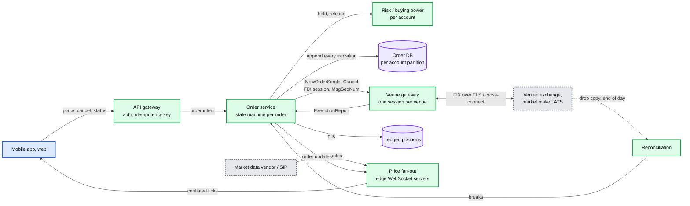
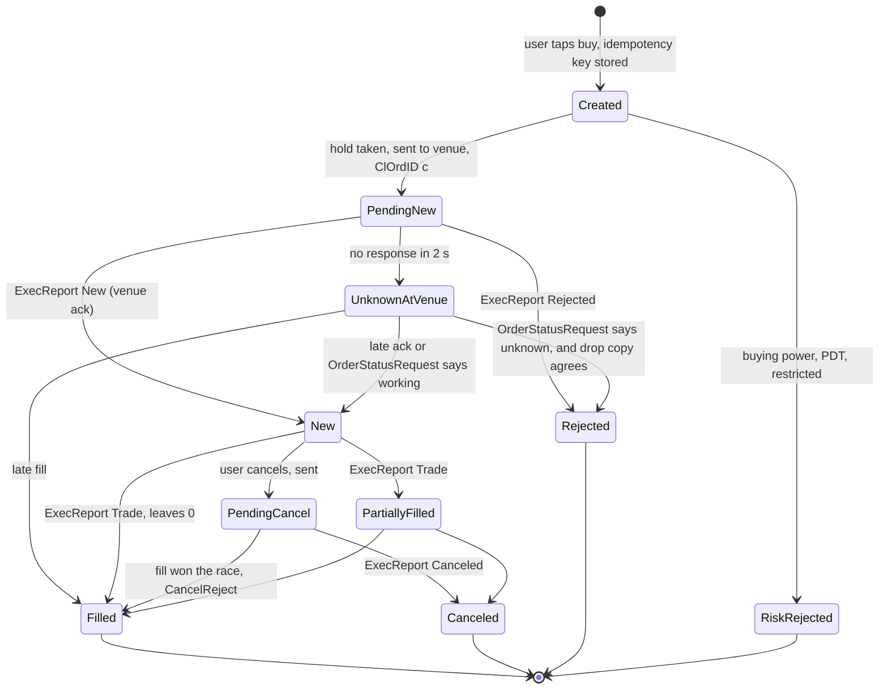

# Deep dive: the broker variant (we call an external venue)

> One-line answer: when we are the broker (Robinhood, a retail app), the matcher is someone else's and our hard problem becomes state consistency across a boundary we do not control; the answer is an order state machine whose transitions come only from venue messages, a `ClOrdID` we never reuse on retry, a session sequence number so a lost message is re-requested rather than guessed, an explicit `UNKNOWN_AT_VENUE` state for timeouts, and end-of-day reconciliation against the venue's drop copy as the final authority.

Part of [`../solution.md`](../solution.md) §1, §11. Sources: FIX 4.4 session layer (`MsgSeqNum`, `ResendRequest`, `PossDup`), `ExecutionReport` and `OrderStatusRequest` messages, Hello Interview's "Design Robinhood" framing, Robinhood's March 2020 outage. Links in [`../research/`](../research/).

---

## 1. What changes and what does not

| Concern | Exchange variant | Broker variant |
|---|---|---|
| Matching | Ours, deterministic, in memory | The venue's. We see only `ExecutionReport`s |
| Truth for order state | Our output log | The venue's messages, then their drop copy |
| Idempotency | `ClOrdID` at our gateway | `ClOrdID` we send; the venue dedups, so we must never send a second one for the same intent |
| Latency | Microseconds | Milliseconds to the venue plus hundreds of ms to the app |
| Risk | Collars, kill switch, member credit | Full buying power, PDT rules, options approval, per user |
| Fan-out | Market data feed to members | Live prices to millions of app users, from a vendor feed or SIP |
| Failure that hurts most | Losing an accepted order | Not knowing whether an order executed |

What does not change: the hold pattern (identical), the ledger (identical, double-entry per account), execution report delivery to the user (same per-session sequencing idea, over WebSocket), audit (every message in and out, 6 years).

## 2. Architecture

## 3. The order state machine

Rules that make it safe:

1. **Write the intent before sending.** `PendingNew` with `ClOrdID` is committed to the order DB before the FIX message leaves. If we crash after sending and before committing, the recovery path (step 4) finds the order via the venue, not via our memory.
2. **One `ClOrdID` per intent, forever.** A retry after a timeout reuses `c`, never mints `c'`. If the venue never saw `c`, it accepts the resend. If it did, it rejects the duplicate or returns the existing state. Either way there is one order.
3. **A timeout is not a rejection.** It moves the order to `UnknownAtVenue`. The user sees "submitted, awaiting confirmation". The hold stays.
4. **Resolve unknowns actively.** After 2 s: `OrderStatusRequest(c)`. After reconnect: the FIX session's `MsgSeqNum` gap tells us exactly which venue messages we missed; `ResendRequest` replays them. After close: drop copy reconciliation is final.
5. **Every transition is idempotent on `(ClOrdID, ExecID)`.** `ExecID` is unique per venue report. Applying a report twice is a no-op.
6. **Hold release follows the state machine.** `Rejected`, `Canceled`, and `Filled` release; `UnknownAtVenue` does not.

## 4. The three cases the interviewer asks

**Venue confirms a fill, our DB write fails.** We crash between receiving the `ExecutionReport` and committing. On restart the FIX session logon says "my last received seq was 502"; the venue resends 503 with `PossDup=Y`; we apply it. If the session had been reset (new day, or the venue reset seq numbers), the drop copy or `OrderStatusRequest` catches it. Either way the fill is applied once. Diagram D5d in [`../diagrams.md`](../diagrams.md#d5d-broker-variant-venue-confirms-a-fill-after-our-timeout).

**Our request times out, the venue filled it.** Same shape from the other side: `UnknownAtVenue`, then a late `ExecutionReport` arrives on the session and moves it to `Filled`. If we had "retried" with a new `ClOrdID`, the user would own twice the shares. This is the single most important rule in the variant.

**User cancels, fill arrives first.** `PendingCancel`, then `ExecutionReport Trade` and `OrderCancelReject(TooLateToCancel)`. The app shows "filled before cancel". The state machine must accept a fill in `PendingCancel`; a common bug is to treat it as illegal.

## 5. Live prices to 10 M users

Not from the venue's order-entry session. A market data feed (vendor or SIP) delivers L1 quotes at up to millions of updates/s across all symbols. Fan-out:

- Feed handler normalises and writes the current quote per symbol into a shared in-memory table plus a pub/sub topic per symbol group.
- 500 edge WebSocket servers each subscribe to the topics their clients need, hold the latest quote per symbol, and push to clients conflated to at most 1 to 4 updates/s per symbol. Users cannot see faster than that anyway.
- 10 M clients / 500 edges = 20 k connections per edge. Fits.
- A user's own order updates ride the same WebSocket, sourced from the order service, keyed by user, not conflated.

Robinhood's March 2020 outage was a control-plane failure under record load, not a matcher problem: DNS and thundering-herd style overload on the way in. The lesson for this variant is that the boundary layers (API gateway, WebSocket fan-out, DNS) are where a retail broker breaks, so they get the load tests and the capacity headroom.

## 6. Ledger and settlement for a broker

- The fill posts to a double-entry ledger: debit securities position, credit cash (for a buy), per account, with `trade_id = (venue, ExecID)` unique. Same as the exchange variant.
- Settlement is T+1. Between trade date and settlement the ledger shows `settled_cash` and `unsettled_cash` separately; buying power rules decide which counts. For a cash account, selling unsettled shares and buying again is a free-riding violation; the risk engine enforces it from the ledger's two balances.
- End of day: our fills versus the clearing broker's or venue's drop copy. Every break is a ticket before the next open.

## 7. Best execution and routing, one paragraph

A US broker must seek best execution across venues (Reg NMS; the NBBO is the reference). A smart order router chooses the venue per order: lit exchanges, market makers (payment for order flow), or an ATS. For this study note the router is a pluggable strategy in front of the venue gateways, and the order state machine is per venue leg. Say it, do not design it.

## 8. What to say when the interviewer flips to this variant

"The matcher is theirs, so my problem is state consistency across a boundary I don't control. I write my intent first, I never mint a second ClOrdID on retry, I treat a timeout as unknown rather than failed, I use the FIX sequence numbers to recover every message I missed, and I reconcile against their drop copy as the final word. Balances and the ledger are the same as the exchange variant. Prices to millions of users come from a market data feed through a fan-out tree, never from the order path."
