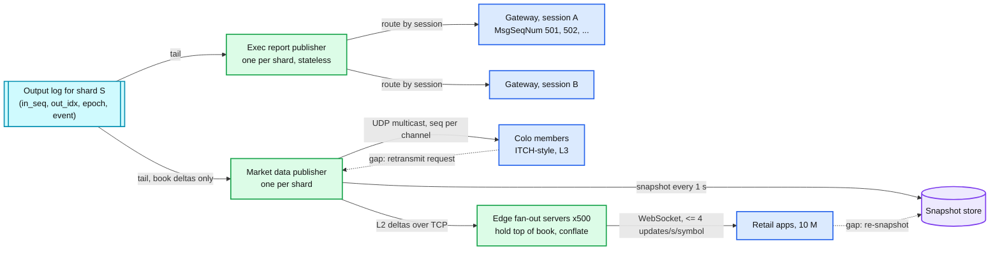

# Deep dive: execution reports and market data fan-out

> One-line answer: both outbound streams are projections of the matcher's output log; execution reports are private, per session, numbered with a per-session sequence so a client can detect a gap and ask for a resend, and delivered exactly once from the client's point of view by dedup on `(in_seq, out_idx)` upstream and `MsgSeqNum` downstream; market data is public, per symbol, published as snapshot plus numbered incrementals, multicast in the colo, then fanned out through edge servers with conflation to millions of retail clients, and the matcher never knows how many consumers exist.

Part of [`../solution.md`](../solution.md) §4.4, §4.5, §5.5. Sources: FIX 4.4 session layer (`MsgSeqNum`, `ResendRequest`, `SequenceReset-GapFill`, `PossDupFlag`), Nasdaq OUCH (order entry, per-session sequenced outbound) and ITCH over MoldUDP64 (sequenced multicast with request-based retransmission), Coinbase Exchange WebSocket feed (`level2` snapshot plus `l2update`, `full` channel with `sequence`). Links in [`../research/`](../research/).

---

## 1. Two streams, one source



## 2. Execution reports: exactly once from the client's point of view

The output log gives at-least-once to any tailer. The client contract is stronger: every event once, in order, per session. Two layers of numbering achieve it.

| Layer | Key | Owner | Purpose |
|---|---|---|---|
| Upstream | `(shard, in_seq, out_idx)` | matcher | dedup across publisher restarts and standby re-emits |
| Downstream | `(session, MsgSeqNum)` | publisher / gateway | gap detection and resend for one client |

Flow:

1. Publisher tails the output log from its checkpoint. For each event it looks up the owning session (from the order's `session_id` in the event) and the session's next `MsgSeqNum`.
2. It writes `(session, MsgSeqNum) -> (in_seq, out_idx)` to a per-session cursor log, then sends. The cursor log is small and append-only; it is the only state.
3. The client tracks the last `MsgSeqNum` received. A gap (received 504 after 502) triggers `ResendRequest(503, 503)`. The publisher reads its cursor log at 503, re-reads the output event, resends with `PossDupFlag=Y`. Administrative messages in the gap are replaced by `SequenceReset-GapFill`.
4. On logon after a disconnect the client states its last received seq; the publisher resends everything after it. If the client's number is higher than ours (client lost state), the session is rejected and needs an operator: that is the FIX rule, and it exists because guessing here means lost fills.
5. On publisher restart: rebuild per-session next `MsgSeqNum` from the cursor log's tail, resume the output log from the last cursor entry. No event is skipped or double-numbered.

Why not let the gateway number messages directly from the output log? It can, and OUCH-style exchanges do exactly that (the gateway is the publisher for its sessions). The split above is the same design with the numbering state named explicitly.

## 3. Message set (FIX names, any binary encoding)

| Message | Direction | Key fields | Semantics |
|---|---|---|---|
| `NewOrderSingle` | in | `ClOrdID`, `Symbol`, `Side`, `OrdType`, `Price`, `OrderQty`, `TimeInForce`, `Account` | create |
| `OrderCancelRequest` | in | `ClOrdID` (new), `OrigClOrdID` | cancel |
| `OrderCancelReplaceRequest` | in | `ClOrdID`, `OrigClOrdID`, new `Price` / `OrderQty` | modify |
| `ExecutionReport` | out | `OrderID`, `ClOrdID`, `ExecID`, `ExecType` (New, Trade, Canceled, Replaced, Rejected, Expired), `OrdStatus`, `LastQty`, `LastPx`, `LeavesQty`, `CumQty`, `TransactTime` | every state change |
| `OrderCancelReject` | out | `ClOrdID`, `OrigClOrdID`, `CxlRejReason` (TooLateToCancel, UnknownOrder) | cancel failed |
| `ResendRequest`, `SequenceReset`, `Heartbeat`, `TestRequest`, `Logon`, `Logout` | both | `MsgSeqNum`, `BeginSeqNo`, `EndSeqNo`, `GapFillFlag`, `PossDupFlag` | session layer |

`ExecID` is unique per report: `(shard, in_seq, out_idx)` encoded. `LeavesQty` and `CumQty` on every report let a client reconstruct state from any single message, which is why a lost report is a recoverable event rather than a corruption.

## 4. Market data: what to publish

| Level | Content | Consumers | Rate |
|---|---|---|---|
| L1 | best bid, best ask, last trade | retail, risk collars | 1 per book change at top |
| L2 | price levels with aggregate size (10 to 20 each side, or full depth) | most algos, charting | 1 per level change |
| L3 | every order add, modify, delete, execute, with order id | HFT, surveillance, anyone rebuilding the exact book | 1 per input event |

Our output log already contains L3 (each ack, cancel, fill is an add / delete / execute). L2 and L1 are derived by the publisher. Publishing L3 to members is standard (ITCH does this) and it means members can rebuild our book exactly, which is also how they check us.

## 5. Snapshot plus incremental

Every incremental carries a per-channel sequence number. A consumer joining mid-day:

1. Subscribe to incrementals, buffer them.
2. Fetch a snapshot; it carries the sequence number it is current as of.
3. Discard buffered incrementals with `seq <= snapshot seq`, apply the rest, then go live.
4. On any gap: go back to step 1. For colo multicast, first ask the retransmitter for the missing range (MoldUDP64-style request server); fall back to a snapshot only if the range is gone.

Snapshots are produced by the publisher from its own book copy (it is applying the same deltas), every second for hot symbols, on request for cold ones. They live in a cache keyed by `(symbol, seq)`.

## 6. Fan-out numbers

```
Colo: one multicast group per shard. Sending once reaches every member. Publisher output is one packet per delta,
      ~1 M deltas/s at open fleet-wide, split across ~50 shards -> 20 k packets/s per publisher. Trivial.

Retail: 10 M clients, average 20 symbols each, 500 edge servers.
  Connections per edge      = 20 k
  Edge input                = subscribes to the shard streams it needs; worst case all deltas, 1 M/s at open.
                              Each delta updates an in-memory top-of-book struct: ~100 ns. 0.1 core.
  Edge output, unconflated  = 20 k clients x 20 symbols x 1 update/s (avg) = 400 k msgs/s per edge. Too much at open.
  Edge output, conflated    = per client, per symbol, at most 4 updates/s, and only if changed.
                              Cap = 20 k x 20 x 4 = 1.6 M/s worst case, typical 5 to 10x less. Per-client timers, batched writes.
  Network                   = 1.6 M x 50 B = 80 MB/s per edge worst case. A 10 GbE NIC does 1.2 GB/s. Fine.
Conflation is a correctness choice, not just a scaling one: a human cannot use 100 updates/s, and sending the latest state is the right semantic for L1.
```

Order updates for a specific user (their own fills) ride the same WebSocket but are never conflated and never dropped: they are routed by user id from the execution report stream to the edge that holds that user's connection.

## 7. Where the market data path can be unfair

- Members must see the same delta at the same time. One multicast send gives that inside the colo to within cable-length differences (exchanges equalise cable lengths for this reason).
- The private execution report must not arrive before the public delta for the same fill by a margin that lets the filled party trade on it first. Exchanges sequence the two publishers off the same output event and measure the skew; some deliberately delay the private report by a few microseconds. Name it as a policy knob.

## 8. Interview answer in 60 seconds

"Both streams are readers of the output log, so the matcher does no fan-out. Execution reports are per session: the publisher assigns a per-session sequence number, records the mapping to the output log position, and sends. A client that sees a gap asks for a resend; a restarted publisher rebuilds its counters from that mapping. Dedup upstream is on the output log key, so a standby re-emit never becomes a second fill. Market data is one multicast send per delta in the colo with sequence numbers and a retransmit server; for retail, 500 edge servers each hold top of book and push conflated updates to 20 k WebSocket clients. Joining consumers buffer incrementals, load a snapshot with a sequence number, and apply the tail."
