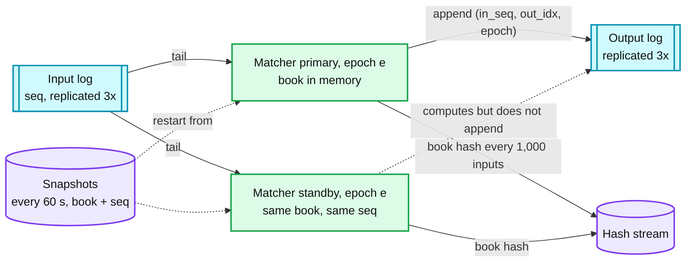
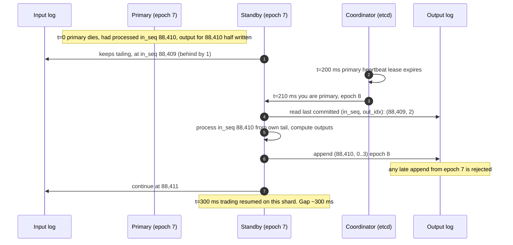

# Deep dive: matcher failover, hot standby, and fencing

> One-line answer: because the matcher is a deterministic function of the input log, a hot standby that tails the same log has the same book at the same `seq`; failover is "stop trusting epoch e, promote the standby as epoch e+1, resume from the last committed output", and it loses nothing because the ack to a client was never given until the input was replicated and the output was committed, so the only work at risk is work nobody was told about.

Part of [`../solution.md`](../solution.md) §5.3, §10.4. Sources: LMAX (replicated Business Logic Processors fed by the same input journal, snapshots for restart), Aeron Cluster (Raft log, deterministic services, snapshot + replay), the Raft paper's leader election and term semantics, Jane Street's sequencer talk ("everyone replays the same stream"). Links in [`../research/`](../research/).

---

## 1. The three copies of the truth and which one wins

| Copy | Durable | Authoritative for | Lost on crash |
|---|---|---|---|
| Input log | yes, 3 replicas, quorum 2 | what was accepted and in what order | nothing |
| Output log | yes, 3 replicas, quorum 2 | what happened (fills, acks, deltas) | nothing |
| Primary's memory | no | nothing; it is a cache of `f(input log prefix)` | everything, rebuilt |
| Standby's memory | no | nothing | everything, rebuilt |
| Snapshot | yes | a shortcut for rebuilding | nothing |

The rule that makes failover simple: **a process's memory is never the truth.** If the two logs are intact, every process is replaceable.

## 2. Commit points, precisely

Three separate commit points, in order, each visible to a different party:

1. **Input committed.** The sequencer's append reached 2 of 3 replicas. The gateway may now tell the client "accepted" (a `PendingNew`-style ack, if the venue sends one). Before this, the order does not exist.
2. **Output committed.** The matcher's events for `in_seq = n` reached 2 of 3 output replicas. The fill is now real. Execution reports, market data, and the ledger read from here.
3. **Delivered.** The execution report reached the client's session with a `MsgSeqNum`. Before this, the client may not know; after this, the client may still lose it and ask for a resend.

Many designs blur 2 and 3. Keeping them apart is what lets the standby re-emit outputs for `n` without contradicting anything: nothing was delivered that was not committed, and committed outputs are idempotent by `(in_seq, out_idx)`.

## 3. Normal failover, step by step

Details that matter:

- **The standby is behind by at most a few entries** because both tail the same replicated log from the same replicas. Its lag is monitored; failover is refused if lag is above a threshold (say 10,000 entries) and instead the shard halts until a standby catches up. Failing over to a stale standby is not a failover, it is a rewind.
- **The last committed output is read from the output log, not remembered.** The promoted standby asks "what is the highest `(in_seq, out_idx)` with a quorum?" and starts after it. If `in_seq 88,410` had outputs 0 and 1 committed but 2 and 3 not, the standby re-emits 0 to 3; consumers already holding 0 and 1 drop them.
- **Epoch in every output.** Output log replicas reject appends with an epoch lower than the highest they have seen. So the old primary, if it was merely paused rather than dead, cannot write after promotion. This is the fencing token.
- **Epoch is granted by the coordinator**, which holds one lease per shard. Whoever holds the lease is primary. Lease TTL 200 ms with heartbeats every 50 ms in colo; longer (1 to 2 s) if the coordinator is not colocated.

## 4. The "paused, not dead" primary (split brain)

A GC pause, a stopped VM, a partitioned NIC: the primary is alive but unreachable, its lease expires, the standby is promoted, then the primary wakes up and continues.

- It will try to append outputs with epoch 7. The output log rejects them. It will see the rejection and self-terminate (or become the new standby).
- It cannot ack anything to clients directly, because acks flow from the output log through publishers, not from the matcher's process.
- The window where both believe they are primary is bounded by the lease TTL, and during it the old one can compute but not commit. Computing is harmless.

This is why the matcher never talks to a client or a database directly. Every side effect goes through the fenced log.

## 5. Restart from snapshot

A cold start (both primary and standby lost, or a new standby being built):

1. Load the latest snapshot: the full book (every resting order), `last_in_seq`, per-member self-trade settings, halt state, and the book hash.
2. Tail the input log from `last_in_seq + 1`. With a 60 s snapshot interval and 250 k msg/s peak, that is at most 15 M entries, at 1 to 5 M/s replay speed about 3 to 15 s.
3. Compare the book hash with the primary's at the same `seq`. Equal: join as standby. Not equal: stop, page, determinism bug.

Snapshots are taken by the standby, not the primary, so the primary's latency is never touched. The standby pauses tailing, serialises the book (a few MB for a large symbol), writes to object storage with the `seq`, and resumes. Because it is deterministic, a snapshot from the standby at `seq s` is identical to one the primary would have taken.

## 6. Determinism rules (the contract the standby depends on)

- Time is an input event. The sequencer stamps every entry; the matcher uses that stamp. A heartbeat event every 100 ms drives timers (order expiry, auction transitions). No `now()` in the matcher.
- No randomness, no thread scheduling, no IO. One thread, one loop: read event, mutate book, append outputs, repeat.
- Integer arithmetic: prices in ticks (int64), quantities in lots (int64). No floats anywhere in the decision path.
- Ordered containers only where iteration order affects output. Hash maps are fine for lookup by id; never iterate one to make a decision.
- Configuration (tick sizes, member settings, halts) arrives as sequenced events, never from a file or a database read mid-day.
- Build id recorded in every log segment. Replay across builds is not assumed.
- CI replays a captured day and compares the output log hash. A mismatch fails the build.

## 7. Failover of the other stateful pieces

| Component | State | Failover mechanism | Time |
|---|---|---|---|
| Sequencer leader | log tail | Raft-style election, new epoch, unacked tail retried by gateways | ~300 ms |
| Risk shard | balances, holds | standby replays the shard's WAL, promoted with a lease | 1 to 2 s |
| Gateway | session cursors, dedup table | stateless; rebuilt from output log by session on reconnect | client reconnect time |
| Publishers | cursor into output log | stateless; restart, resume from cursor | seconds |
| Ledger | postings | normal DB HA; replays output log from last posted `trade_id` | minutes, trading unaffected |

## 8. Interview answer in 60 seconds

"The matcher is a pure function of the input log. A standby replays the same log and holds the same book. Its lag is a metric. When the primary's lease expires the coordinator promotes the standby with a new epoch. It reads the last committed output from the output log and resumes from there, re-emitting anything partially written; consumers dedup on `(in_seq, out_idx)`. The old primary is fenced by epoch and cannot commit. Nothing is lost because we never acked an input before it was replicated or emitted a fill before it was committed. Cold start is snapshot plus log tail, seconds. Book hashes every thousand inputs catch determinism bugs before a failover would expose them."
