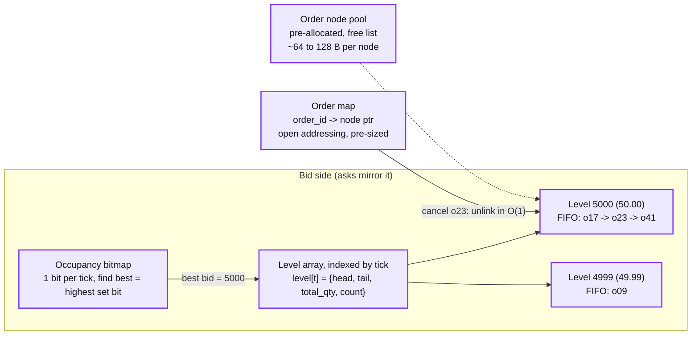

# Deep dive: the limit order book and the matching loop

> One-line answer: a book is two sides, each a dense array of price levels indexed by tick (with a bitmap to find the next non-empty level), each level an intrusive FIFO list of orders, plus one hash map from order id to its list node; that gives O(1) insert at a level, O(1) cancel, O(1) best-price lookup, and a matching loop that walks the opposite side from the best price, fills head-first at the resting price, and rests the remainder; everything is integers, pre-allocated, and single-threaded, which is why one core does 1 to 5 M operations per second with a median under 2 us.

Part of [`../solution.md`](../solution.md) §4.1, §4.2, §10.1. Sources: WK Selph "How to build a fast limit order book" (2011), exchange-core README benchmarks (5 M ops/s on 2011 Xeons, latency table by load), Liquibook, CME matching algorithm docs (FIFO, pro-rata, TOP), Nasdaq OUCH 5.0 and the open/close cross guide, CME and Nasdaq self-match prevention docs, LMAX Disruptor paper. Links in [`../research/`](../research/).

---

## 1. Data structure



```
order_node {                        // one cache line if possible
  order_id      u64
  owner_id      u32 (member / account for self-trade prevention)
  price_tick    i32
  qty_left      i64 (lots)
  flags         u8  (side, tif, post_only, hidden, iceberg)
  display_left  i64 (iceberg visible remainder)
  prev, next    ptr (intrusive list within the level)
  seq_in        u64 (for audit and tie-breaking, never needed for order because FIFO position already encodes it)
}
level { head, tail ptr, total_qty i64, count u32 }
side  { levels[] indexed by (tick - min_tick), bitmap[], best_tick i32 }
book  { bids: side, asks: side, order_map: hash(order_id -> node*), last_trade_tick, state }
```

Why each choice:

| Choice | Alternative | Why this one |
|---|---|---|
| Array indexed by tick | Red-black tree / `std::map` of price to level | Prices are discrete and bounded (a $50 stock with a 1 cent tick and a 10x band is 50,000 slots, 2 MB of level headers). Array lookup is one add and one load; a tree is 15 to 20 dependent pointer loads. Selph's post made this case in 2011; every fast engine since agrees. Fall back to a sparse map only for far-away levels or unbounded instruments |
| Bitmap for occupancy | Scan the array for the next non-empty level | After the best level empties, "find next" is `find highest set bit below t`, one or two instructions per 64 ticks |
| Intrusive doubly linked FIFO | `std::deque` or vector per level | Cancel from the middle is O(1) given the node pointer; no reallocation; no copy on fill |
| Hash map by order id | Search the level | Cancel and replace are most of the traffic (exchange-core's mix: 6% cancel, 82% move, 12% new). They must be O(1) |
| Pre-allocated node pool | `malloc` per order | No allocator on the hot path, no GC, predictable latency. Pool size is the max resting orders per book, a few million for the largest symbol |
| Integers everywhere | floating point prices | Determinism across machines and exact audit. Price in ticks, qty in lots, notional in cents |

Memory: a book with 1 M resting orders is ~100 MB of nodes plus a few MB of levels. The hottest symbol is well under that. All shards of one machine fit in RAM many times over; the constraint is one core per hot book, not memory.

## 2. The matching loop

Diagram D6 in [`../diagrams.md`](../diagrams.md#d6-activity--decision-flow) shows the decision flow. In words, for an incoming buy limit at price `P`, qty `Q`:

```
while Q > 0 and asks.best_tick <= P:
    level = asks.levels[asks.best_tick]
    while Q > 0 and level.head != null:
        resting = level.head
        if resting.owner_id == incoming.owner_id and stp_enabled(owner): apply STP mode, continue or break
        fill = min(Q, resting.display_left or resting.qty_left)
        emit Fill(taker=incoming, maker=resting, price=resting.price_tick, qty=fill, trade_id=(in_seq, out_idx++))
        Q -= fill, resting.qty_left -= fill, level.total_qty -= fill
        if resting.qty_left == 0: unlink(resting), order_map.erase, pool.free
        elif iceberg and display_left == 0: refresh display_left, move resting to tail (loses priority)
    if level.count == 0: clear bit, asks.best_tick = next set bit
if Q > 0:
    if tif in (IOC, FOK): emit Cancelled(remaining Q)          // FOK checked total available before the loop
    else: node = pool.alloc, append to bids.levels[P].tail, set bit, order_map.insert, emit Ack(rests Q)
```

Rules baked into the loop:

- **Trade at the resting price.** The maker's limit is the trade price, so the taker gets price improvement. This is universal.
- **Price then time.** Levels are visited best-first; within a level, head-first. Nothing else decides. No timestamps, no randomness.
- **One input event, many outputs.** A market order that sweeps five levels produces one `Ack`, N `Fill` pairs, and maybe one `Cancelled`. They all share `in_seq` and differ by `out_idx`. That tuple is the trade id.
- **FOK pre-check.** Sum `total_qty` over crossing levels (or short-circuit once `>= Q`) before touching anything. If insufficient, cancel without side effects.
- **Post-only.** If `asks.best_tick <= P` at arrival, reject (or reprice one tick below the best ask if the venue offers that).
- **Cost.** A fill is a few dozen instructions and two or three cache lines. A new resting order is a pool pop, a list append, a hash insert. This is why the numbers below hold.

## 3. Numbers

| System | Throughput | Latency | Hardware, notes |
|---|---|---|---|
| exchange-core (Java, Disruptor, open source) | 5 M ops/s single book | at 1 M ops/s: p50 0.5 us, p99 4 us, worst 45 us. At 5 M ops/s: p50 1.5 us, p99 42 us, worst 190 us | dual Xeon X5690 (2011), isolated tickless socket. Mix 9% GTC, 3% IOC, 6% cancel, 82% move |
| LMAX Business Logic Processor | 6 M orders/s on one thread | not published per order | 2010 Nehalem, includes risk and matching |
| Nasdaq INET (SIX measurement) | not published | 37 us average round trip at the network boundary, 78 us p99, 150 us p99.9 | includes gateway, sequencing, matching, ack |

Read across: the matching itself is sub-microsecond to a few microseconds; the tens of microseconds in production are network, gateway, sequencing, and replication. Tail latency grows with load (exchange-core's p99 goes 4 us to 42 us between 1 M and 5 M ops/s), so size a hot shard at 20 to 25% of its ceiling.

## 4. Matching algorithms other than price-time

| Algorithm | Rule | Used for | What changes in the loop |
|---|---|---|---|
| FIFO (price-time) | oldest at the level first | equities, most crypto | the loop above |
| Pro-rata | split the incoming qty across resting orders in proportion to their size, round down, leftovers FIFO | some futures and options (CME) | walk the whole level once to compute shares, then allocate; a second pass for leftovers |
| Pro-rata with TOP | the first order to set a new best price gets filled first (one per side per price), rest pro-rata | CME Eurodollar-style products | track a `top` flag per level, reset when the level empties |
| Allocation / LMM | designated market makers get a guaranteed percentage | options | per-level participant table |
| Auction (opening / closing cross) | collect orders, compute the single price that maximises matched volume, fill everything at that price | open and close on Nasdaq and NYSE, IPOs, halts | a separate auction book; the cross is one input event that emits thousands of fills. The Nasdaq Facebook IPO failure was a loop that recomputed the cross while cancels kept arriving |

The design does not change across these. The level and node structures are the same; the allocation function at a level is a strategy. Say that, and name FIFO as what you build first.

## 5. Order types and what each costs the matcher

| Type | Matcher change | Where the extra state lives |
|---|---|---|
| Limit, day / GTC | none, the base case | book |
| Market | `P = +infinity` (buy) with a collar from risk; never rests; remainder cancelled | none |
| IOC | cancel remainder instead of resting | none |
| FOK | pre-check available qty | none |
| Post-only | reject if it would cross | none |
| Iceberg / reserve | two quantities, refresh display and move to tail on exhaustion | node |
| Hidden | not in market data, lower priority than displayed at the same price | node flag, level walk skips hidden until displayed are done |
| Stop, stop-limit | not in the book until triggered; a trigger list keyed by stop price, checked after each trade | side trigger list, checked on `last_trade_tick` change |
| Pegged | reprice on every reference change | a reprice list; expensive, most venues limit it |
| GTD, expiry | a timer; time arrives as a sequenced heartbeat event | expiry heap keyed by time |
| MOO / MOC | auction book, not the continuous book | separate structure |

Every one of these is a seam the interviewer can open. Have the table, build only limit / market / IOC / FOK / GTC in the 45 minutes.

## 6. Self-trade prevention

Checked in the loop when `resting.owner_id == incoming.owner_id` (owner at the granularity the member configured: account, firm, or an explicit STP group id). Modes, all deterministic:

| Mode | Effect |
|---|---|
| Cancel newest (aggressor) | incoming order cancelled, resting stays |
| Cancel oldest (resting) | resting cancelled, incoming continues to the next order |
| Cancel both | both cancelled |
| Decrement and cancel | the smaller quantity is removed from both, the larger's remainder continues |

CME, Nasdaq, NYSE, and Coinbase all offer some subset. The setting reaches the matcher as a sequenced configuration event so that a replay sees the same setting at the same `seq`.

## 7. Replace semantics

| Change | Priority | Implementation |
|---|---|---|
| Quantity down | kept | decrement in place |
| Quantity up | lost | cancel + new inside one input event |
| Price change | lost | cancel + new inside one input event |

One input event means one `seq`, so no other order can be interleaved between the cancel and the new. The client sees `ExecType=Replaced` with the new `OrderID` (or the same one, venue-dependent).

## 8. Determinism checklist for this component

- No wall clock, no random, no threads, no IO, no allocation on the hot path.
- Integer ticks and lots; the tick table is a sequenced input.
- Hash map used only for point lookup, never iterated to make a decision.
- Every output carries `(in_seq, out_idx)`.
- Book hash (e.g. a rolling hash over `(tick, order_id, qty)` per side) computed every N inputs and emitted, so primary and standby can be compared.

## 9. Interview answer in 60 seconds

"Two sides. Each side is an array of price levels indexed by tick with a bitmap to find the next non-empty level. Each level is an intrusive FIFO. A hash map from order id to node gives O(1) cancel, which matters because cancels and modifies are most of the traffic. An incoming order walks the opposite side from the best level, fills head-first at the resting price, and rests the remainder. Integers only, pre-allocated, one thread. That is why one core handles millions of operations per second with a median under 2 microseconds, and why tail latency, not throughput, is what you size for."
