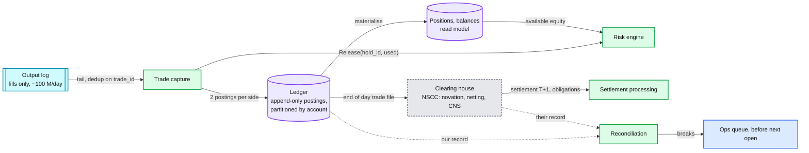

# Deep dive: post-trade, the ledger, clearing, and settlement

> One-line answer: a fill in the output log becomes two balanced double-entry postings per account (cash against securities), keyed by the trade id so a replay is a no-op, written to a ledger partitioned by account; positions and buying power are read models over that ledger; at end of day the trade file goes to the clearing house, which nets and settles T+1, and a reconciliation job compares our fills against the clearing house's record and raises a break for every mismatch before the next open.

Part of [`../solution.md`](../solution.md) §4.6, §10.5. Sources: SEC T+1 rule (effective 28 May 2024), DTCC / NSCC clearing overview (novation, netting, CNS), double-entry ledger design as used by Stripe and Square engineering. Links in [`../research/`](../research/).

---

## 1. Where post-trade sits



## 2. The double-entry model

Every fill produces postings that sum to zero per currency and per instrument. For a trade of 100 XYZ at 49.98 between buyer B and seller S, with a fee of 0.10 each:

| Journal | Account | Asset | Debit | Credit |
|---|---|---|---|---|
| trade_id t | B | USD | | 4,998.00 |
| trade_id t | B | XYZ | 100 | |
| trade_id t | S | XYZ | | 100 |
| trade_id t | S | USD | 4,998.00 | |
| trade_id t | B | USD | | 0.10 |
| trade_id t | S | USD | | 0.10 |
| trade_id t | exchange fees | USD | 0.20 | |

Invariants checked on every write, and by a nightly sweep:
- Sum of debits equals sum of credits per journal entry, per asset.
- No account's securities balance goes negative unless it is a margin account with borrow.
- Every `trade_id` appears exactly once per side.

Schema:

```
posting (
  posting_id      bigint,
  journal_id      = trade_id (shard, in_seq, out_idx),
  account_id      partition key,
  asset           text ('USD', 'XYZ'),
  amount          bigint (cents or lots, signed),
  trade_date      date,
  settle_date     date,
  status          enum (pending_settlement, settled),
  created_at      timestamp
) unique (journal_id, account_id, asset)
```

Amounts are integers. Prices in ticks, cash in the smallest unit, quantities in lots. Never floats.

## 3. Idempotency

The unique constraint on `(journal_id, account_id, asset)` makes the write idempotent. Trade capture tails the output log at-least-once; a replay hits the constraint and moves on. The hold release to the risk engine carries the same `trade_id` and is idempotent there too. This is the end of the chain that started with `ClOrdID` at the gateway: three keys, each covering one hop.

| Hop | Key | Lives |
|---|---|---|
| client to gateway | `(session, ClOrdID)` | trading day plus one |
| matcher to consumers | `(shard, in_seq, out_idx)` | forever, it is the trade id |
| ledger | `(journal_id, account_id, asset)` | forever |

## 4. Settled versus unsettled

US equities settle T+1 since 28 May 2024 (SEC amendment to Rule 15c6-1). Between trade date and settle date:

- The buyer owns the shares economically but has not paid; the seller has sold but has not been paid.
- The ledger records postings with `status = pending_settlement` and `settle_date = T+1`. A settlement job flips them on settle date after the clearing house confirms.
- Buying power rules read both: a cash account can only spend settled cash for some purposes (free-riding rules); a margin account can use unsettled proceeds. The risk engine computes `available` from the ledger's two balances plus open holds.

Positions are a read model: `sum(amount) group by account, asset` with a materialised table updated by the same trade capture transaction, plus a nightly rebuild from postings to catch drift.

## 5. Clearing

What the clearing house (NSCC for US equities) does, in the terms a designer needs:

- **Novation.** After the trade is reported, NSCC becomes the buyer to every seller and the seller to every buyer. Counterparty risk moves from members to the clearing house.
- **Netting.** Each member's thousands of trades per symbol per day net to one obligation per symbol (Continuous Net Settlement). 100 M trades/day become a few hundred thousand settlement obligations.
- **Margin.** Members post collateral sized to their net exposure. A volatility spike raises margin calls intraday (the GameStop episode in January 2021 was a clearing margin story, not a matching story).

Our job: produce the trade file (every trade, both sides, prices, quantities, member ids, timestamps) in the clearing house's format by their cutoff, and process their acknowledgements and obligation reports. Crypto exchanges have no clearing house; they settle internally on their own ledger instantly, which is simpler and concentrates the risk on the exchange.

## 6. Reconciliation

Three-way, every day, before the next open:

| Compare | Against | Break means |
|---|---|---|
| Our fills (output log) | Our ledger postings | trade capture bug or replay gap |
| Our ledger | Clearing house's trade record | a trade we sent that they did not get, or vice versa |
| Our positions | Custodian / depository (DTC) positions | settlement failure or a corporate action we missed |

Breaks are tickets with a deadline. The point of a reconciliation is that no single system's record is trusted alone, including our own log.

## 7. Failure and lag

- Post-trade is not on the matching path. If the ledger is down, matching continues and the ledger replays the output log when it returns, idempotently. Holds are not released during the gap, so buying power drifts conservative. `hold_release_lag` is the metric.
- Trade capture lag at open: 100 M fills/day is on average ~4 k/s; the open might be 50 k/s for a minute. A ledger partitioned by account absorbs this easily on a normal database. Batching postings per account per commit helps.
- A bug that posts wrong amounts is corrected by a reversing journal entry, never by editing a posting. The ledger is append-only.

## 8. Interview answer in 60 seconds

"Trade capture tails the output log and writes balanced postings per account keyed by trade id, so replays are no-ops. Cash and securities are both assets in one double-entry ledger; positions and buying power are read models. Postings carry a settle date; US equities settle T+1, and buying power distinguishes settled from unsettled. End of day we send the trade file to the clearing house, which novates and nets. We reconcile our log, our ledger, and their record every night, and every break is a ticket before the open. None of this touches the matcher; if the ledger is down, trading continues and holds stay conservative."
