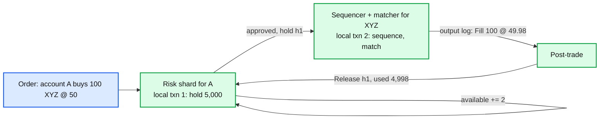
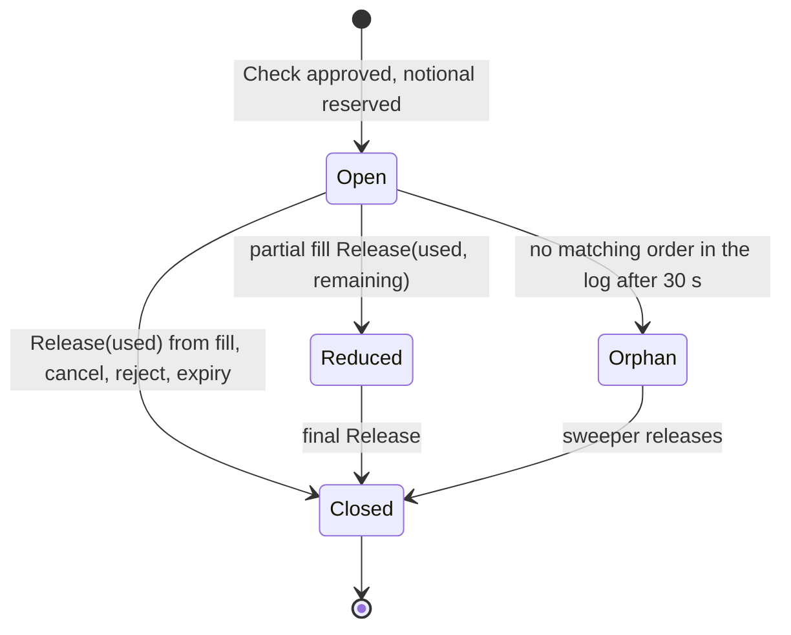

# Deep dive: pre-trade risk and the buying-power hold

> One-line answer: buying power is per account and matching is per symbol, so there is no single shard that can run "check balance and place order" as one transaction; instead the account shard takes a worst-case hold before the order is sequenced, the order carries the hold id, and fills, cancels, and rejects from the matcher's output log release the hold afterwards, which keeps the invariant "open holds plus positions never exceed equity" true at every instant by always erring towards over-reserving.

Part of [`../solution.md`](../solution.md) §4.3, §5.4, §10.5. Sources: SEC Rule 15c3-5 (market access controls must be automated and pre-trade), the FIX `ExecutionReport` field set for `LeavesQty` / `CumQty`, exchange kill-switch docs. Links in [`../research/`](../research/).

---

## 1. Why this is the "transaction" question

The Databricks phrasing is "trading system with transactions". The trap is to reach for a distributed transaction (2PC) between the account row and the symbol book, or to put both in one relational database. Both fail the latency target by three orders of magnitude and put a lock manager on the hot path.



Two local transactions and an asynchronous compensation is a saga. The reason it is safe here is that the saga only ever moves in the conservative direction between steps: the hold is taken before anything can spend, and released only after the spend is known.

## 2. The checks, where they run, and why there

| Check | Runs at | Input | Why here |
|---|---|---|---|
| Session auth, `member_id` stamp | Gateway | session | Only the gateway knows the connection |
| `ClOrdID` duplicate | Gateway | `(session, ClOrdID)` table | Must happen before anything is spent or sequenced |
| Message rate per session | Gateway | token bucket | Protects the sequencer from one member |
| Symbol tradable, halted, tick and lot size | Gateway (cached table) | symbol table version | Cheap, static per version |
| Price collar (X% from last trade or NBBO) | Risk shard | reference price feed, ~100 ms stale | Needs the reference price, which is per symbol but tolerates staleness |
| Max order size, max notional, restricted list | Risk shard | per-account limits | Per account |
| Buying power / credit hold | Risk shard | available, open holds | Per account, the only stateful check |
| Position limit | Risk shard | positions + open holds | Per account |
| Self-trade prevention | Matcher | resting order owner | Needs the book |
| Limit-up limit-down band, circuit breaker | Matcher | sequenced state | Must be exact and ordered relative to orders |
| Kill switch (cancel all, block new) | Gateway blocks new, matcher cancels resting | sequenced command | Both sides, both must be fast |

SEC 15c3-5 requires that these controls are automated, pre-trade, and under the broker-dealer's direct control. In an exchange the same shape exists twice: the member runs its own, and the exchange runs a coarser set (collars, kill switch, throttles).

## 3. The hold in detail

State per account on its risk shard, in memory, with a WAL:

```
account {
  equity_cash          i64 (cents)
  margin_multiplier    fixed-point
  positions[symbol]    i64 (lots)
  open_holds[hold_id]  { notional i64, symbol, side, qty, created_seq }
  available            = f(equity_cash, positions, margin) - sum(open_holds.notional)
}
```

Lifecycle:



- **Worst-case notional.** For a buy limit: `qty × limit_price`. For a buy market: `qty × (reference × (1 + collar))`. For a sell: check the position (or borrow availability for shorts) instead of cash. For a replace that raises qty or price: take an incremental hold before the replace is sequenced.
- **Release on fill.** `used = fill_qty × fill_price`. Price improvement returns the difference. Partial fills reduce the hold by the filled portion at the limit price and record the actual used.
- **Release on cancel or reject.** `used = 0`, whole hold back.
- **Release on expiry.** Day orders expire at close; the close event triggers releases for all remaining holds.
- **Orphan sweep.** A hold taken but whose order never reached the sequencer (gateway died in between). The sweeper reads the input log's index by `hold_id` (or the order DB projection) and releases holds with no order after 30 s. Conservative meanwhile.

## 4. What happens under each failure

| Failure | Direction of error | Bound |
|---|---|---|
| Risk shard crashes after WAL write, before reply | Hold exists, order never sent | Orphan sweep, 30 s |
| Risk shard crashes before WAL write | No hold, no order | Client retries, clean |
| Release lost (post-trade down) | Over-reserved | Until post-trade replays the output log |
| Release applied twice | Would under-reserve | Prevented: releases are idempotent on `(hold_id, trade_id)` |
| Standby risk shard behind by N events | Over-reserved by the unreplayed releases | Catches up from the output log |

No failure under-reserves. That is the property to say out loud.

## 5. Why not check in the matcher

- The matcher is sharded by symbol. An account's holds would be spread across every symbol shard it trades, and the sum would need a cross-shard read per order.
- The matcher must not do IO or touch anything that is not derived from the input log. Buying power depends on fills from other symbols, which live in other logs.
- Putting a stale copy of balances into each matcher is possible but reproduces the same hold problem with a worse consistency story.

## 6. Why not check after the match (post-trade risk)

Cheaper and lower latency, and some venues do it for members with credit lines. It is wrong for a retail broker: a fill that the account cannot pay for is a busted trade or an unsecured loan. 15c3-5 was written after unfiltered "naked" access caused exactly this. Post-trade checks are a supplement (position monitoring), not the control.

## 7. Latency budget

The hold adds one hop before the sequencer: gateway to risk shard and back. In colo, one RPC over a kernel-bypass NIC is ~5 to 10 us; the check itself is a few hash lookups and an integer compare, well under 1 us. Budget 15 us of the 100 us p99. For members with a pre-arranged credit line and their own 15c3-5 controls, the exchange's collar and size checks can run on the gateway with the reference price cached, and the buying-power step is skipped. That is a per-member flag.

## 8. Kill switch

One sequenced command per session or member: `Kill(member_id, scope)`. The gateway starts rejecting new orders for that member immediately (it does not need the log for that), and the matcher, on consuming the command, cancels every resting order for that member on that shard and emits the cancels. Because it is sequenced, the point at which "no more orders from member M" holds is a well-defined `seq` per shard, which is what the incident report will need. Members get the same button for their own sessions.

## 9. Interview answer in 60 seconds

"Risk runs before the sequencer on a service sharded by account. It takes a worst-case hold, writes it to a WAL, and the order carries the hold id. The matcher never knows about balances. Fills and cancels come out of the output log and release the hold; every release is idempotent on trade id. If anything fails between hold and release the account is over-reserved, never under, and a sweeper cleans orphans after 30 s. That replaces the cross-shard transaction with two local ones and an async compensation, and it is the shape 15c3-5 expects: automated, pre-trade, per account."
