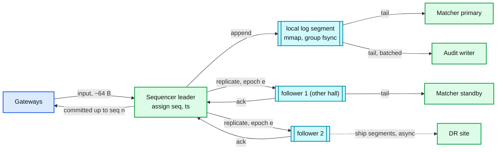

# Deep dive: the sequencer and the replicated input log

> One-line answer: the sequencer is the one process per symbol group that turns concurrent arrivals into a total order by stamping each accepted input with the next `seq` and appending it to a log that is replicated to a second and third machine before the gateway may acknowledge; that log, not the matcher's memory and not a database, is the system of record, and every other component (matcher, standby, audit, replay tooling) is a reader of it, which is what makes the matcher a pure function and failover a replay.

Part of [`../solution.md`](../solution.md) §4.1, §5.1, §5.2, §10.1. Sources: Jane Street's "How to build an exchange" (the sequencer pattern), LMAX (input journal, replicated BLPs), Aeron Cluster (Raft log with deterministic services, snapshot + replay), Jay Kreps "The Log", Raft paper (leader, term, quorum commit), Nasdaq INET latency measurements, exchange-core (Disruptor pipeline: journaling and replication stages before matching). Links in [`../research/`](../research/).

---

## 1. What the sequencer does and does not do

Does:
- Accept validated inputs (new, cancel, replace, admin commands, heartbeats) from any gateway.
- Assign `seq` (u64, gapless, per shard) and a timestamp from its own clock.
- Append to the local log segment and replicate to followers. Ack to the gateway when a quorum has the entry.
- Serve the log to tailers (matcher primary, standby, audit writer, DR shipper) from memory for the recent tail and from disk for older ranges.

Does not:
- Look inside the order beyond routing fields. No book, no risk, no matching. That is what keeps it fast and simple enough to be the single point of order.
- Talk to a database.
- Decide priority by timestamp. Arrival order at the sequencer is the priority. Timestamps are for audit.



## 2. Log entry format

```
entry {
  seq          u64   gapless per shard
  epoch        u32   sequencer term that wrote it
  ts_ns        u64   sequencer clock, PTP-disciplined
  gateway_id   u16
  session_id   u32
  kind         u8    NEW, CANCEL, REPLACE, ADMIN, HEARTBEAT, CONFIG
  payload      var   order fields, ~40 B for NEW
  crc32        u32
}                    ~64 to 100 B typical
```

Segments of 1 GB, memory-mapped, named by first `seq`. An index of `seq -> offset` every 4 KB. Retention: today on NVMe, then object storage (see [`../solution.md` §10.3](../solution.md#103-capacity-math-per-component)).

## 3. Durability options and their latency

| Option | What "committed" means | Added latency (in-rack) | Loses data when |
|---|---|---|---|
| A. Local fsync only | on this disk | 20 to 100 us on enterprise NVMe with power-loss protection, ms on consumer SSDs | this host dies |
| B. Replicate to 2 of 3 in memory, fsync async (group commit every ~1 ms) | in RAM on two hosts in two halls | ~50 to 150 us with kernel bypass, more with kernel TCP | both halls lose power within the same ms |
| C. Replicate and fsync on 2 of 3 before ack | on disk on two hosts | ~200 to 500 us | never, short of two disk losses |

Choose B for the colo path and say why: the failure that B does not cover (simultaneous power loss in two halls before the group fsync) is the same event that halts the market anyway, and the acked-but-lost window is under a millisecond of orders that members re-enter from their own records. Nasdaq-class engines measure ~37 us average round trip including durability, which is only possible with B-style memory replication. For a retail broker or a crypto exchange with a 50 ms budget, C is affordable and simpler to explain.

Latency numbers above are estimates from component costs (RTT, fsync), not vendor claims. See the research spot-check notes.

## 4. Leader election and epochs

The three log nodes for a shard run a Raft-style protocol: one leader accepts appends, followers replicate, a majority commits. On leader loss:

1. Followers miss heartbeats (every 50 ms in colo), time out at ~150 to 300 ms, elect a new leader with `epoch + 1`.
2. The new leader's log is truncated to the last quorum-committed entry. Entries the old leader had locally but had not replicated to a majority are discarded; none of them was acked.
3. Gateways learn the new leader (from the followers' redirect or the coordinator), retry their unacked entries with the same `ClOrdID`. The gateway's dedup table makes the retry safe even if the entry did in fact commit and only the ack was lost.
4. Any append from the old leader carries the old epoch and is rejected.

The matcher tails the committed prefix only, so it never sees an entry that could be truncated. That is the property that makes "the matcher is a function of the log" true even across leader changes.

Aeron Cluster is the open-source system that packages exactly this: a Raft log, deterministic services fed from it, snapshots, and replay. Kafka with one partition per symbol group and `acks=all`, `min.insync.replicas=2` gives the same commit semantics at millisecond latency and is the right "Good" answer for a retail-scale system.

## 5. Why one sequencer per symbol group and not one global

- One global sequencer is one core's throughput for the whole market: 1 B messages/day is fine on average (43 k/s) but the open at 500 k/s with 1 M/s bursts is within reach of one core's limit, and the blast radius of its failure is the whole market.
- Per group: independent failure domains, independent scaling, and a hot symbol can have a sequencer to itself.
- What is lost: a global total order across symbols. Nothing in single-symbol matching needs it. Cross-symbol atomic orders would, and they are out of scope for that reason.

## 6. Snapshots and replay

The matcher (standby) snapshots its state every 60 s with `last_in_seq`. Rebuild = load snapshot + replay from `last_in_seq + 1`. Replay reads the committed log at memory speed (millions of entries per second), so a minute of log is seconds of replay. A full day without snapshots would be 1 B entries, 3 to 15 minutes at 1 to 5 M/s: acceptable for a disaster, not for a routine failover, which is why snapshots exist.

Replay must use the same matcher build that produced the outputs if the goal is to reproduce them; if the goal is only to rebuild the current book from the last snapshot, any build with the same semantics works. Segments carry the build id.

## 7. Backpressure at the open

The sequencer queue depth is the pressure gauge. Policies, in order:

1. Per-session throttles at the gateway, so no single member fills the queue.
2. Gateway to sequencer flow control (credit-based): a gateway that has N unacked entries stops sending and rejects new orders with "busy, retry".
3. Never drop an accepted (acked) entry. Never reorder.
4. Market data consumers are conflated downstream; that does not touch the sequencer.

The Nasdaq Facebook IPO lesson applies to the sequencer as much as the cross: a loop whose input keeps moving needs a bound, and a failover must carry in-flight, acked entries with it.

## 8. Clock discipline

The sequencer's timestamp is the regulatory timestamp for "order received by the venue". PTP with hardware timestamping on the NIC gives sub-microsecond discipline; MiFID II RTS 25 requires 100 us to UTC with 1 us granularity for HFT venues, and CAT requires 50 ms synchronisation with millisecond timestamps in the US. Gateways stamp too, so an order has two timestamps: gateway receive and sequencer assign. The gap between them is the queueing latency metric.

## 9. Interview answer in 60 seconds

"One sequencer per symbol group. It stamps a gapless sequence number on every accepted input and replicates the entry to two other machines in another hall before the gateway may ack. The log is the system of record. The matcher, its standby, the audit writer, and the DR shipper are all just readers of the committed prefix. Leader loss is a Raft election: the new leader keeps only the quorum-committed prefix, which is exactly what was acked, and gateways retry the rest with the same client order id. Durability is memory replication with asynchronous group fsync for the colo path, because that is what fits in tens of microseconds; the window it leaves open is two halls losing power in the same millisecond. Snapshots every minute make failover a replay of seconds, not a day."
