# Diagrams: stock trading / order execution system

The D1 to D12 set for [`solution.md`](solution.md). Each diagram appears once in the repo: the ones embedded in `solution.md` are linked from here, not repeated. Colors per root `CLAUDE.md` §3. Red is used only for the single-writer matcher of the hottest symbol (the one core that is the ceiling) and, in the failure map, for the sequencer's replicated log (the one thing that must not lose a byte).

Legend reminder: 🔵 client / edge, 🟢 stateless compute, 🟣 durable storage, 🟡 cache or losable, 🔷 queue / log, 🔴 bottleneck or SPOF, ⚪ external, 🩷 decision.

---

## D1. Context (zoom-out)

Our system is the exchange: gateways, risk, sequencer, matchers, publishers, post-trade. Members and retail apps send orders in; clearing takes the trade file out; the regulator gets the audit trail.

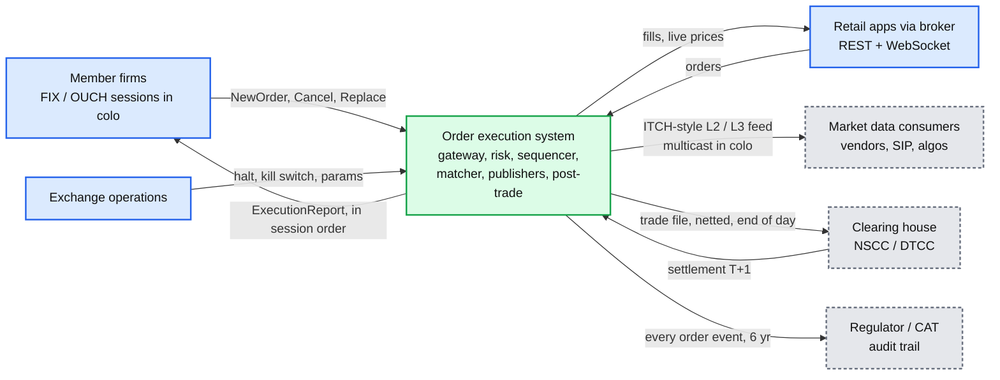

## D2. Data flow (DFD)

What flows, how big, how often. Peak numbers for the first minute after the open.

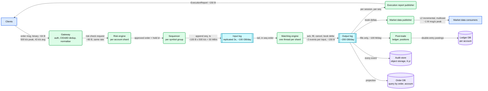

## D3. Component architecture

Embedded in [`solution.md` §6](solution.md#6-final-design). Not repeated here.

## D4. Sequence, happy path, one per FR

D4a (place and match a limit order) is embedded in [`solution.md` §4.1](solution.md#41-place-an-order-and-match-it-by-price-time-priority). The rest are here.

### D4b. Cancel a working order

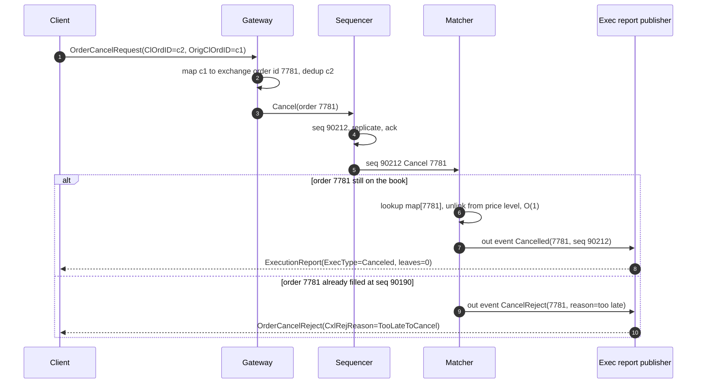

### D4c. Pre-trade risk hold before sequencing

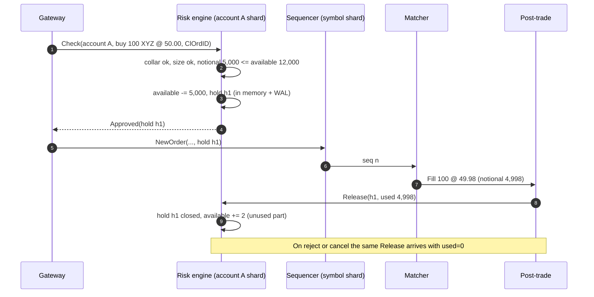

### D4d. Execution report delivery with session sequence numbers

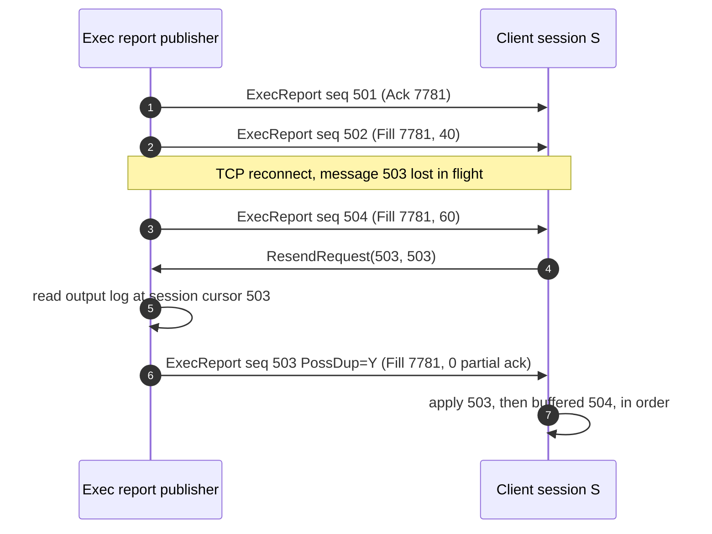

### D4e. Market data snapshot plus incremental

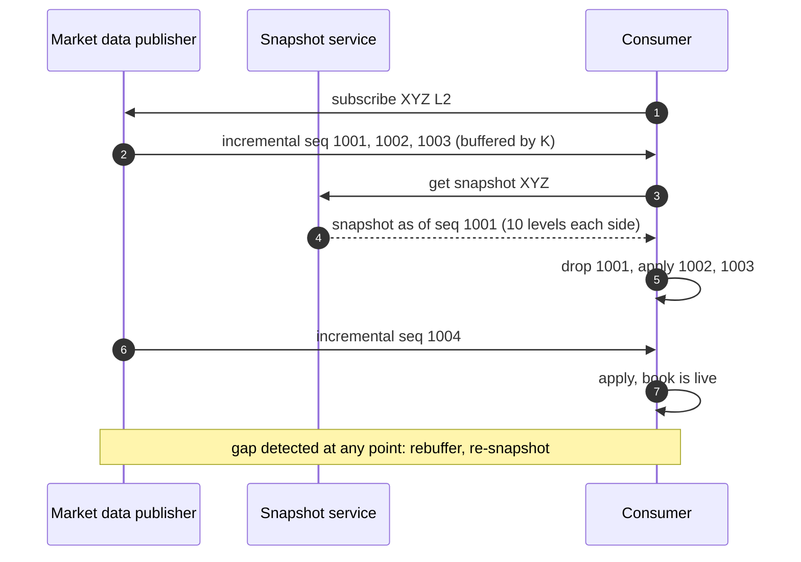

## D5. Sequence, failure paths

D5a (matcher crashes between match and publish) is embedded in [`solution.md` §10.4](solution.md#104-failure-timeline). The rest are here.

### D5b. Client retry creates a duplicate order attempt

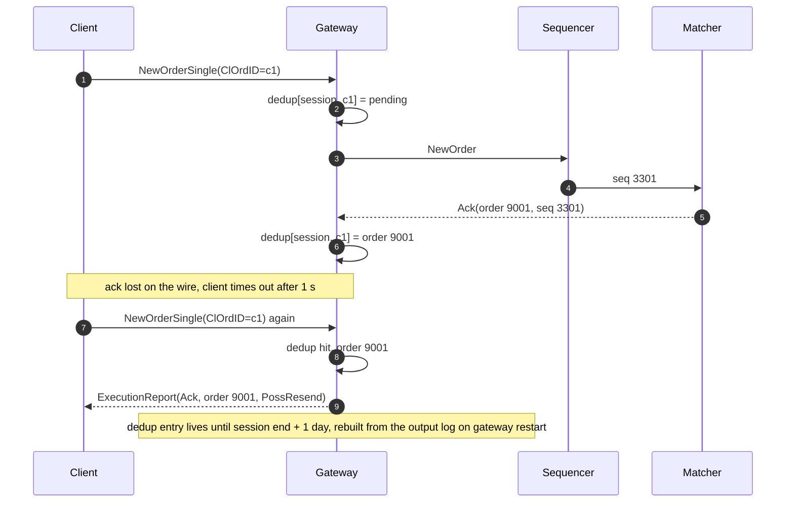

### D5c. Sequencer leader loses its lease mid-burst

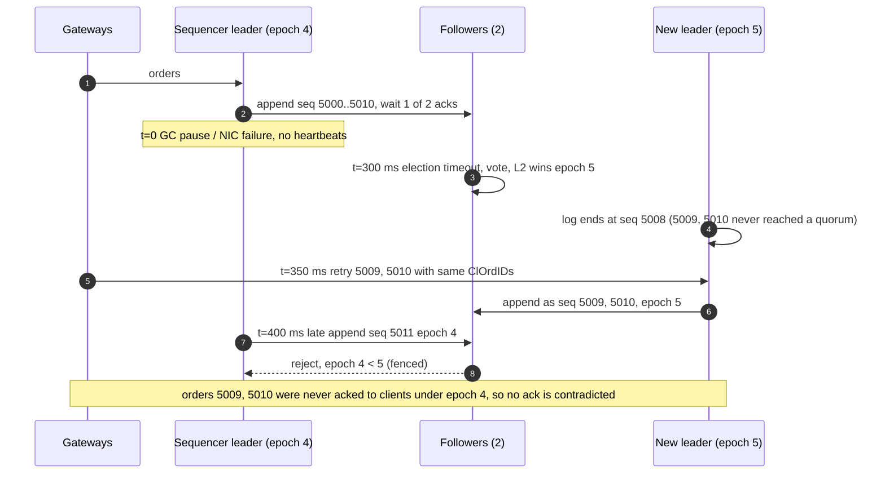

### D5d. Broker variant: venue confirms a fill after our timeout

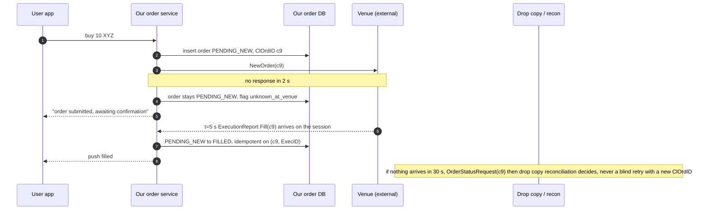

## D6. Activity / decision flow

The matching loop for an incoming order, inside the matcher thread.

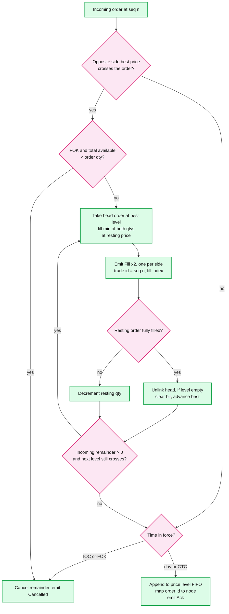

## D7. Entity relationship

Embedded in [`solution.md` §3.3](solution.md#33-data-model). Not repeated here.

## D8. State machine

The order lifecycle as the matcher and the client see it. The broker variant adds `PENDING_NEW` and `UNKNOWN_AT_VENUE` in front (see [`deep-dives/broker-variant.md`](deep-dives/broker-variant.md)).

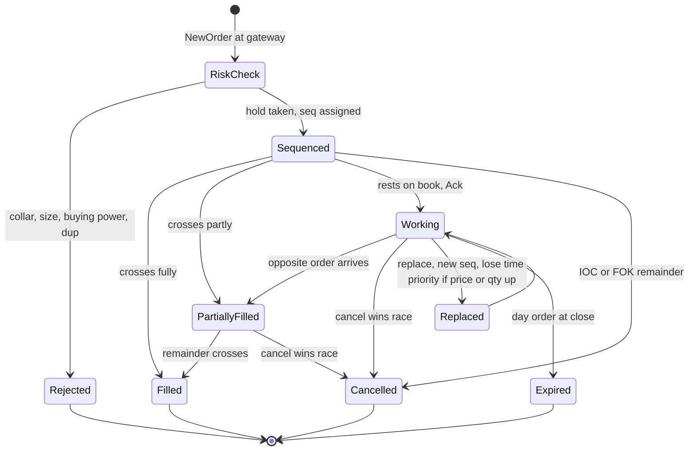

## D9. Deployment / topology

One primary data centre, one warm DR site. Inside the primary: two halls (or AZs) with the matcher primary and hot standby split across them and the log's third replica in the other hall.

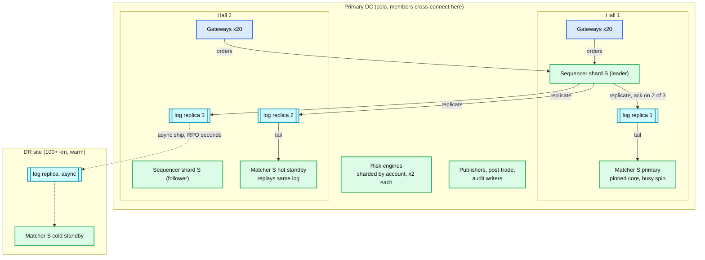

## D10. Scaling / partitioning

Shard by symbol. Cold symbols share a shard; the hottest symbol gets a shard, a core, and a machine of its own. Risk is sharded on a different key (account), which is why the hold pattern exists.

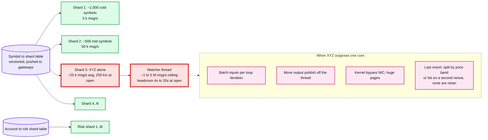

## D11. Failure mode map

```mermaid
%% D11: what fails, who feels it, what bounds it. The log is the only component whose loss is unrecoverable, so it is the one built to never lose a byte.
flowchart TD
    GW[Gateway dies] -->|"blast: its sessions"| GW1[Clients reconnect to another gateway,<br/>resend from last seq, dedup table rebuilt from output log]
    RK[Risk shard dies] -->|"blast: its accounts cannot place new orders"| RK1[Standby replays risk WAL, holds intact,<br/>failover 1 to 2 s, resting orders unaffected]
    SQ[Sequencer leader dies] -->|"blast: one symbol group, ~300 ms"| SQ1[Election, new epoch, unacked tail retried<br/>by gateways with same ClOrdID]
    ME[Matcher primary dies] -->|"blast: one shard, ~1 s"| ME1[Hot standby already at same seq,<br/>promoted with new epoch, republishes from last committed out seq]
    LOG[Log loses quorum] -->|"blast: symbol group halts"| LOG1[Halt trading on that group, never guess.<br/>Third replica in other hall makes this a two-hall failure]
    PUB[Publisher dies] -->|"blast: latency on reports / market data"| PUB1[Stateless, restart, resume from cursor.<br/>Clients see a gap, resend or re-snapshot]
    PT[Post-trade / ledger down] -->|"blast: balances stale, holds not released"| PT1[Trading continues from the log.<br/>Replay catches up, holds are conservative]
    DC[Whole primary DC lost] -->|"blast: market halted"| DC1[DR replays async log, RPO seconds, RTO 15 to 60 min,<br/>members re-enter orders, exchange declares a state]

    class GW,RK,SQ,ME,PUB,PT,DC service
    class LOG critical
    class GW1,RK1,SQ1,ME1,LOG1,PUB1,PT1,DC1 decision

    classDef service  fill:#dcfce7,stroke:#16a34a,stroke-width:2px,color:#111
    classDef critical fill:#fee2e2,stroke:#dc2626,stroke-width:4px,color:#111
    classDef decision fill:#fce7f3,stroke:#db2777,stroke-width:2px,color:#111
```

## D12. Rollout / migration

From a database-backed matcher (orders in Postgres, matching in transactions) to the log-based design, with a rollback point per phase. Dates are illustrative.

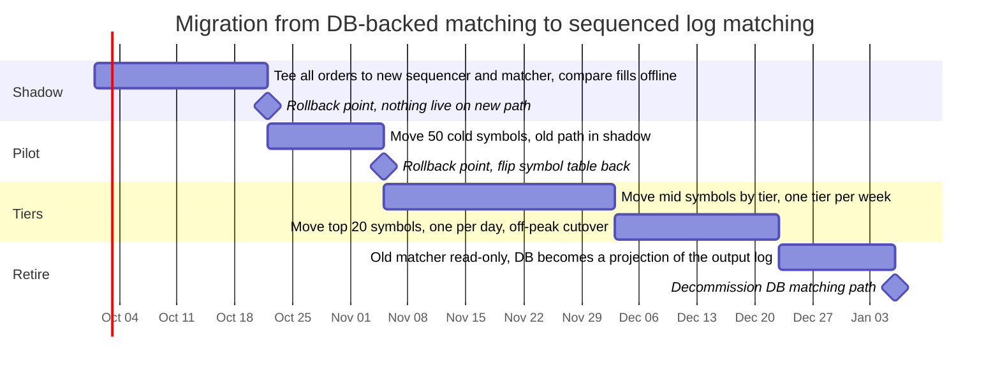
