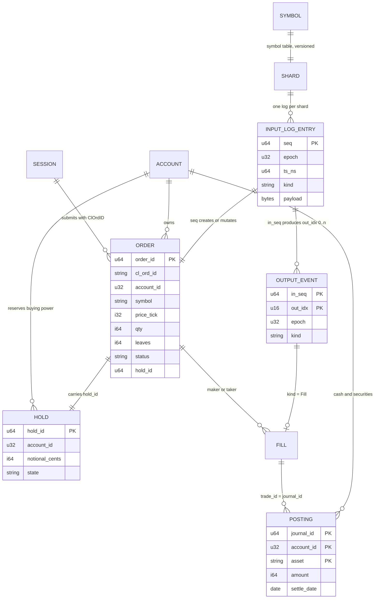
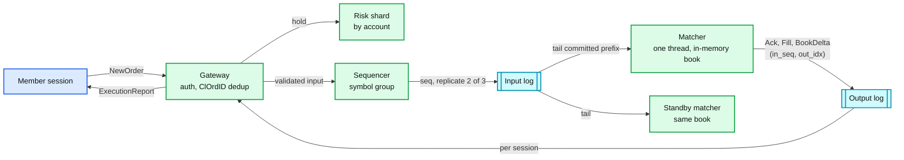
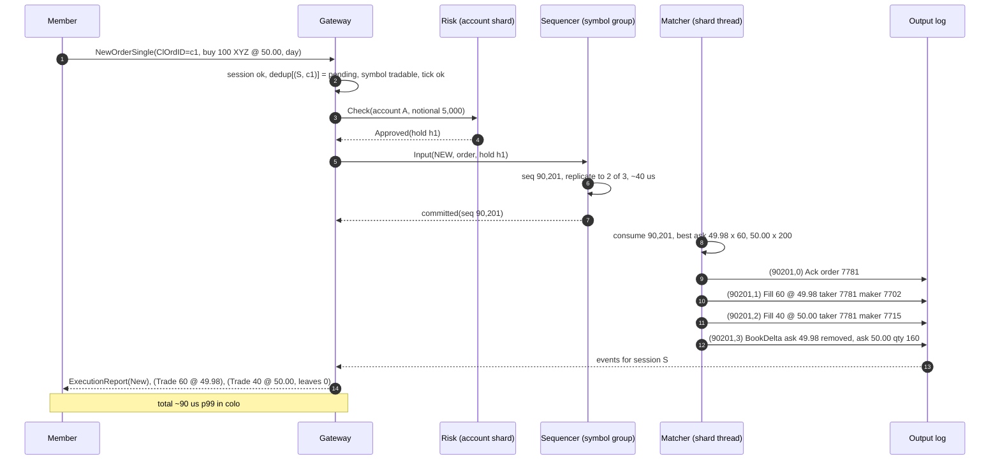
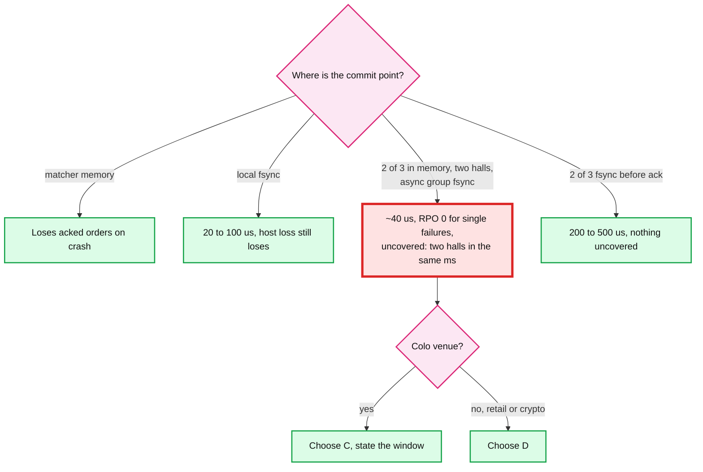
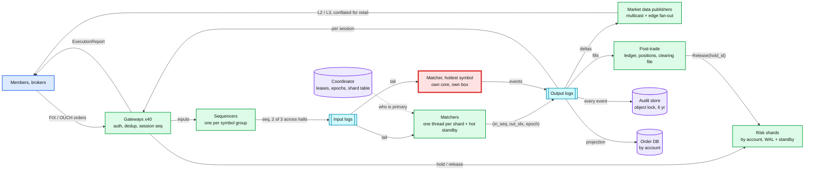
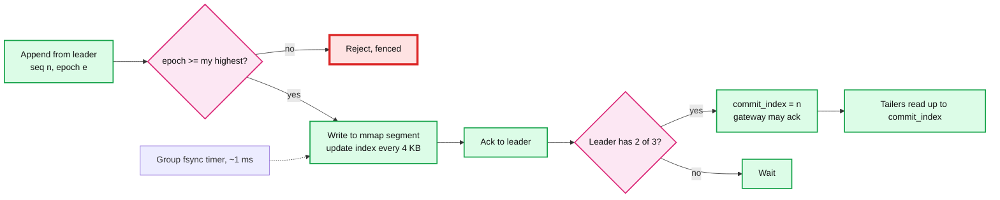
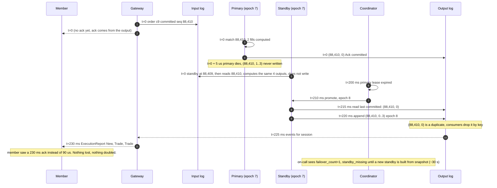

# HLD: stock trading / order execution system

> One-line answer: every order goes gateway (auth, `ClOrdID` dedup) to risk (buying-power hold on an account shard) to a per-symbol-group sequencer that stamps a gapless `seq` and replicates the entry to two other machines before anyone is acked; one single-threaded, deterministic matcher per shard tails that log, keeps the book in memory (tick-indexed levels, FIFO per level, order-id map), and appends acks, fills, and book deltas to an output log keyed `(in_seq, out_idx)`; execution reports, market data, the ledger, the audit store, and the order DB are all readers of the output log; a hot standby replays the same input log and is promoted with a new epoch in under a second; the matcher never talks to a database, which is why the colo path is tens of microseconds and why failover loses nothing.

Sources this follows: the LMAX architecture (single-threaded Business Logic Processor, 6 M orders/s on one thread, input journal, replicated processors), Jane Street's sequencer pattern ("the sequencer is the database", every service replays the same stream), Aeron Cluster (Raft log plus deterministic services plus snapshots), Nasdaq INET's measured 37 us average round trip with OUCH in and ITCH out, exchange-core's published benchmarks for the book itself, CME and Nasdaq matching and order-type docs, FIX 4.4 session semantics, SEC 15c3-5, Reg SCI, CAT, MiFID II RTS 25, the T+1 rule, and the Knight Capital, Facebook IPO, and Tokyo 2020 post-mortems. ByteByteGo's "stock exchange" chapter and SystemDesignHandbook's version are the interviewer's likely reference. Raw notes with links and spot-check corrections in [`research/`](research/). Diagrams D1 to D12 are in [`diagrams.md`](diagrams.md).

---

## 1. Understanding the problem

Interviewer's framing, by company: Databricks asks "design a stock trading system" and probes idempotency, ordering, and "where is the transaction" between balances and matching; Coinbase asks "design the order book / matching engine" and probes the data structure, determinism, and failover; Google and ByteByteGo ask "design a stock exchange" and expect the sequencer plus single-writer answer with numbers; Hello Interview's "Design Robinhood" flips it to the broker side and probes consistency with an external venue. This file answers the exchange variant fully and the broker variant in §5.7 and [`deep-dives/broker-variant.md`](deep-dives/broker-variant.md).

### 1.1 Functional requirements

Core:
1. **Place an order.** Limit or market, buy or sell, with a time in force (day, GTC, IOC, FOK). Fast reject with a reason, or an ack with an exchange `OrderID`.
2. **Cancel or replace a working order.** A cancel that loses to a fill returns `TooLateToCancel`. A replace that changes price or raises quantity loses time priority.
3. **Match by price-time priority.** Best opposite price first, oldest at that price first, trade at the resting price, rest the remainder.
4. **Deliver execution reports.** Every ack, fill, cancel, reject, and expiry to the owner, in order, once, with a resend path.
5. **Publish market data.** Top of book and depth to all participants, sequence-numbered, with snapshot recovery.
6. **Keep the books.** Cash and securities move per fill in a double-entry ledger; the end-of-day trade file goes to clearing.

Below the line (say it out loud):
- Auctions, stops, icebergs, pegs. Named as seams in [`deep-dives/order-book-and-matching.md` §5](deep-dives/order-book-and-matching.md#5-order-types-and-what-each-costs-the-matcher).
- Cross-symbol atomic orders (spreads, baskets). They break one-symbol-one-shard. §10.11.
- Clearing and settlement mechanics. We produce and reconcile the file; NSCC nets and settles T+1.
- Smart order routing, best execution logic, payment for order flow. Broker variant, one paragraph.
- Surveillance, market making, strategies.

### 1.2 Non-functional requirements

Ask for scale first. Numbers assumed for one exchange:

| Dimension | Core target | Below the line |
|---|---|---|
| Scale | 10 k symbols. **1 B order messages per trading day** (new + cancel + replace). 6.5 h session, so **43 k msgs/s average, 500 k msgs/s peak** in the first minute after the open. ~100 M trades/day. Hottest symbol ~5% of messages | 10x symbols (options), §10.11 |
| Latency | Colo path, gateway in to ack or fill out: **p50 < 20 us, p99 < 100 us**. Retail app to confirmation: p99 < 500 ms. First market data tick out within 50 us of the match | |
| Durability | **RPO 0 for accepted orders and trades.** Ack only after the entry is on a second machine | RPO seconds across sites (DR) |
| Availability | **99.99% in market hours.** Matcher failover per shard **< 2 s**, no lost or duplicated fills | 99.999% |
| Consistency | **Strong, totally ordered within a symbol** (the log). Strong per account for balances. Eventual across symbols, lag < 1 s | |
| Fairness | Price-time priority is exact. Orders 1 us apart at different gateways are ordered deterministically and reproducibly | equal cable lengths, hardware |
| Auditability | Every event for every order reconstructable for **6 years**. Clock within **100 us of UTC** at gateway and sequencer (RTS 25), **50 ms** for CAT | |
| Idempotency | Same `ClOrdID` retried never creates a second order. A replayed fill never moves money twice | |

The latency row and the durability row fight: durability wants a disk write on another machine before the ack, latency wants nothing off-box. The design's central choice (§5.2) is memory replication to two halls with asynchronous group fsync, which gives RPO 0 for every single-machine failure and leaves only "two halls lose power in the same millisecond" uncovered.

---

## 2. Back-of-envelope

```
Messages          = 1 B / day over 6.5 h = 1 B / 23,400 s = 42.7 k/s average
Peak              = 10x average at the open and close (real opens are 5 to 10x; March 2020 ran 5 to 6x historical peaks)
                  = ~500 k msgs/s for 60 s. Provision 2x that on the sequencer and gateway tiers.
Trades            = ~10% of messages produce a fill = 100 M trades/day, ~4 k/s avg, ~50 k/s peak
Cancels           = 60 to 90% of messages in modern equity markets; the book data structure is built for cancel speed

Hottest symbol    = 5% of messages = 2.1 k/s avg, 25 k/s peak (a meme-stock day: 40% = 200 k/s peak)
Single thread     = 1 to 5 M ops/s (exchange-core: 5 M ops/s on 2011 Xeons; LMAX: 6 M orders/s on one thread)
                  -> 200 k/s peak is 4 to 20% of one core. The single writer is not the throughput bottleneck.
                     It is the latency bottleneck under burst: exchange-core p99 goes 4 us at 1 M/s to 42 us at 5 M/s.
                     Size a hot shard at <= 25% of ceiling.

Input log         = 1 B x ~100 B = 100 GB/day. 500 k/s x 100 B = 50 MB/s peak per fleet, ~5 MB/s per shard.
Output log        = ~2 events per input (ack + deltas; fills produce 2 to 4) x 150 B = ~300 GB/day.
Retention         = 400 GB/day x 250 days = 100 TB/yr raw, ~25 TB compressed. 6 yr = 150 TB compressed. Object storage: ~$3 k/month.

Book memory       = resting orders x ~96 B. Largest symbol ~1 M resting = ~100 MB. All 10 k symbols ~ 5 to 10 GB. One box.
Order DB          = 1 B rows/day x ~200 B = 200 GB/day hot, queried by order id and account. Partition by account, 30 d hot.

Latency budget (colo, p99 100 us):
  gateway parse + dedup + stamp      5 us
  risk hold RPC (kernel bypass)     15 us
  sequencer assign + replicate      40 us   (in-rack RTT 20 to 50 us with kernel bypass; two followers in parallel)
  matcher queue + match              5 us   (p99 under moderate load)
  output commit + publish           20 us
  gateway to member                  5 us
  total                            ~90 us
  Nasdaq INET measured 37 us average, 78 us p99 for the whole path, so this is conservative.

Retail path: app -> broker API -> venue gateway -> (above) -> venue -> broker -> push: 100 to 300 ms, dominated by internet RTT.

Market data fan-out: 1 M book deltas/s at the open fleet-wide. Colo: one multicast send each. Retail: 500 edge servers,
  20 k WebSocket clients each, conflated to <= 4 updates/s/symbol. Edge worst case 1.6 M msgs/s, 80 MB/s. Fits a 10 GbE box.
```

Implications:
- Throughput is not the problem at 1 B/day. Latency under burst, durability without a disk in the path, and correctness under failure are.
- One thread per symbol shard is affordable by a factor of 4 to 20. Spend the headroom on tail latency, not on sharing a core.
- Two logs (input, output) carry everything. Every store is a projection. That is the whole architecture.

---

## 3. The set-up

Product-style: members and brokers are the users; the API is FIX / OUCH-shaped.

### 3.1 Core entities

- **Order**: `(order_id, ClOrdID, session, account, symbol, side, type, price_tick, qty, tif, status, leaves, cum, hold_id, in_seq)`.
- **Trade (fill)**: `(trade_id = (shard, in_seq, out_idx), symbol, price_tick, qty, maker_order, taker_order, ts)`. One per side in reports.
- **Book**: per symbol, in memory, two sides of price levels. Never stored; rebuilt from the log.
- **Input log entry**: `(seq, epoch, ts, kind, payload)` per symbol group.
- **Output log event**: `(in_seq, out_idx, epoch, kind, payload)`: Ack, Fill, Cancelled, Rejected, Replaced, Expired, BookDelta, Halt.
- **Hold**: `(hold_id, account, notional, order_id, state)` on the account's risk shard.
- **Session**: `(session_id, member, gateway, next_out_seq, allowed_accounts, stp_mode, cancel_on_disconnect)`.
- **Posting**: `(journal_id = trade_id, account, asset, amount, settle_date, status)` in the ledger.

### 3.2 API

| Call | Direction | Semantics |
|---|---|---|
| `NewOrderSingle(ClOrdID, symbol, side, type, price, qty, tif, account)` | member to gateway | Idempotent on `(session, ClOrdID)` for the day. Returns `ExecutionReport(New)` or `(Rejected, reason)` |
| `OrderCancelRequest(ClOrdID, OrigClOrdID)` | member to gateway | `ExecutionReport(Canceled)` or `OrderCancelReject(TooLateToCancel / UnknownOrder)` |
| `OrderCancelReplaceRequest(ClOrdID, OrigClOrdID, price?, qty?)` | member to gateway | `ExecutionReport(Replaced)`; priority lost on price change or qty up |
| `ExecutionReport(OrderID, ClOrdID, ExecID, ExecType, OrdStatus, LastQty, LastPx, LeavesQty, CumQty, TransactTime)` | gateway to member | Every state change. `MsgSeqNum` per session. `ExecID = trade_id` |
| `ResendRequest(BeginSeqNo, EndSeqNo)` | member to gateway | Replays from the session cursor with `PossDup=Y` |
| `OrderStatusRequest(ClOrdID)` | member to gateway | Reads the order DB projection |
| Market data: `Snapshot(symbol) -> (seq, levels)`, stream `Incremental(seq, delta)` | publisher to all | L2 by default, L3 (per order) for members |
| Admin: `Halt(symbol)`, `Kill(member, scope)`, `SetParam(symbol, tick, collar)` | ops to sequencer | Sequenced like orders, so their effect has a `seq` |

### 3.3 Data model



Access patterns and where each is served:

| Pattern | Served by | Partition key |
|---|---|---|
| Match an incoming order | in-memory book on the shard | symbol (via shard table) |
| Cancel by order id | book's order map | symbol |
| Dedup `ClOrdID` | gateway table, rebuilt from output log | session |
| Hold / release buying power | risk shard, in memory + WAL | account |
| "What is the state of my order" | order DB projection | account (secondary index on order id) |
| Resend execution reports 501 to 503 | publisher's per-session cursor log | session |
| Rebuild book after crash | snapshot + input log tail | shard |
| Regulator: everything on order X | audit store index | day, order id, `ClOrdID` + account |
| Position, balance | ledger read model | account |

Two partition keys (symbol and account) meet at every order. That is why the hold exists (§4.3).

---

## 4. High-level design

### 4.1 Place an order and match it by price-time priority

**Bad: orders in a relational database, matching inside a transaction.**
- Approach: `INSERT` the order, `SELECT ... FOR UPDATE` the opposite side ordered by price, time, `UPDATE` quantities, `INSERT` trades, commit. One table per symbol or a symbol column.
- Why it breaks: a row-locked transaction per order is 1 to 5 ms on a good day; 43 k/s average needs 40 to 200 concurrent transactions on the same hot rows, and 500 k/s at the open is not reachable at all. Lock contention on the best price level serialises everything anyway, so you pay for a lock manager and get a single writer. Priority depends on commit order, which is not arrival order under contention. And a DB failover mid-transaction leaves "was it matched?" ambiguous.

**Good: in-memory book per symbol in one process, persistence by writing after matching.**
- Approach: a service holds the book in memory, matches on arrival, then writes the order and trades to a database or Kafka, then acks. Fast: microseconds to match, a millisecond to persist.
- Cost: the write-behind is the problem. If the process dies after matching and before the write, the fill is gone but the book state in the dead process said otherwise. On restart there is no way to rebuild the exact book: the inputs were not recorded in order, only the outputs, and some outputs are missing. Two instances cannot be kept identical because arrival order at each differs. Failover is a guess.

**Great: sequencer, replicated input log, deterministic single-threaded matcher, output log.**
- Approach: the gateway sends the validated order to the sequencer for its symbol group. The sequencer stamps `seq`, replicates to 2 of 3 log nodes across two halls, and returns "committed". The matcher (one thread per shard, pinned core) tails the committed prefix, matches against the in-memory book, and appends every resulting event to the output log with `(in_seq, out_idx)`. Ack and fills go out from the output log. A standby matcher tails the same input log and holds the same book. Restart is snapshot plus log tail.
- Challenges: the single writer per shard is the latency ceiling under burst (§5.5); the sequencer is a leader that must be elected and fenced (§5.3); the matcher must be strictly deterministic, which is a discipline (§10.1, [`deep-dives/failover-and-fencing.md` §6](deep-dives/failover-and-fencing.md#6-determinism-rules-the-contract-the-standby-depends-on)); and durability without a disk in the path needs a precise argument (§5.2).





### 4.2 Cancel or replace a working order

**Bad: cancel by deleting the row, replace by updating price in place.**
- Why it breaks: a fill and a cancel in flight at the same time are two transactions on the same row; whichever commits second sees a surprise. Updating price in place silently keeps time priority, which is against every venue's rules and unfair to the queue behind.

**Good: cancel and replace as messages to the in-memory matcher, applied on arrival.**
- Cost: correct inside one process, but with write-behind persistence (§4.1 Good) the race outcome is not recorded in order and cannot be reproduced.

**Great: cancel and replace are sequenced inputs; the matcher resolves the race by `seq`.**
- Approach: `Cancel(order_id)` gets its own `seq`. The matcher looks up the order map: found, unlink in O(1) and emit `Cancelled`; not found (already filled at a lower `seq`), emit `CancelReject(TooLateToCancel)`. Replace: quantity down is an in-place decrement (priority kept); price change or quantity up is cancel-plus-new inside the same input event (priority lost, one `seq`, nothing can interleave).
- Challenges: the client must understand `Fill` followed by `CancelReject`; `LeavesQty` and `CumQty` on every report make that unambiguous. Mass cancel (kill switch, cancel-on-disconnect) is one sequenced command that the matcher expands to N cancels, so its effect has a precise `seq`.

Sequence in [`diagrams.md` D4b](diagrams.md#d4b-cancel-a-working-order).

### 4.3 Check risk and reserve buying power before the order can trade

**Bad: check the balance in the matcher.**
- Why it breaks: balances are per account, spread across every symbol the account trades; the matcher is per symbol and must not do IO. Also two orders on two symbols both pass the check against the same balance.

**Good: check at the gateway against a cached balance, reconcile later.**
- Cost: two gateways admit two orders against the same cached balance; the account goes negative; someone eats a busted trade. SEC 15c3-5 wants controls that "systematically limit" exposure, and a stale cache does not.

**Great: an account-sharded risk engine takes a hold before sequencing; output-log events release it.**
- Approach: the gateway calls the risk shard for the account. It runs the collar (price within X% of last trade or NBBO), max size, max notional, restricted list, position limit, and then reserves worst-case notional as a hold, WAL-first, in memory. The order carries `hold_id` to the sequencer. Fills, cancels, rejects, and expiries flow from the output log as `Release(hold_id, used)`, idempotent on `trade_id`. Between hold and release the account is over-reserved, never under. Orphan holds (gateway died between hold and sequence) are swept after 30 s against the log.
- Challenges: one extra hop on the critical path (~15 us in colo); the risk shard is stateful and needs its own WAL and standby; two partition keys mean no single transaction, which is exactly the saga shape the interviewer is fishing for. Detail in [`deep-dives/risk-and-buying-power.md`](deep-dives/risk-and-buying-power.md), sequence in [`diagrams.md` D4c](diagrams.md#d4c-pre-trade-risk-hold-before-sequencing).

### 4.4 Deliver execution reports in order, once

**Bad: the matcher sends TCP messages to clients.**
- Why it breaks: the matcher now blocks on client sockets, allocates, and holds per-session state; a slow client slows the market; a crash loses undelivered reports with no record.

**Good: a publisher tails the output log and pushes to sessions, at-least-once.**
- Cost: publisher restarts and standby re-emits deliver duplicates; clients get the same fill twice and must dedup on `ExecID`, which many do badly. Gaps after a disconnect are the client's problem.

**Great: two sequence numbers, dedup upstream on `(in_seq, out_idx)`, per-session `MsgSeqNum` downstream with resend.**
- Approach: the publisher dedups on the output key, assigns the session's next `MsgSeqNum`, records the mapping in a per-session cursor log, sends. A client that sees a gap sends `ResendRequest`; the publisher replays from the cursor with `PossDup=Y`. A restarted publisher rebuilds counters from the cursor log. On logon after a disconnect the client states its last received seq.
- Challenges: the cursor log is one more small durable structure per session; `MsgSeqNum` semantics (daily reset, persistence across reconnects, `SequenceReset-GapFill` for admin gaps) must follow the FIX session rules exactly or members' engines will refuse to log on. Detail in [`deep-dives/execution-reports-and-market-data.md`](deep-dives/execution-reports-and-market-data.md), sequence in [`diagrams.md` D4d](diagrams.md#d4d-execution-report-delivery-with-session-sequence-numbers).

### 4.5 Publish market data to everyone

**Bad: clients poll the order DB or call the matcher for the book.**
- Why it breaks: 10 M retail clients polling once a second is 10 M QPS on a store that is not the truth anyway; members in colo need microseconds, not polls.

**Good: the publisher pushes every delta over TCP to every subscriber.**
- Cost: N copies of every delta; a slow subscriber backs up the publisher; joining mid-day requires a full book from somewhere.

**Great: snapshot plus sequenced incrementals; multicast in colo with a retransmit server; conflating edge tier for retail.**
- Approach: the publisher tails book deltas from the output log, numbers them per channel, multicasts once in the colo (MoldUDP64-style, dual feeds, unicast retransmission for gaps), and produces a snapshot per symbol every second. Retail: 500 edge servers each hold top of book and push to 20 k WebSocket clients, conflated to at most 4 updates/s per symbol; a user's own order updates ride the same socket unconflated. Joining consumers buffer incrementals, load a snapshot with its `seq`, apply the tail.
- Challenges: the private execution report and the public delta for the same fill must not be skewed enough to give the filled party an edge; both derive from one output event and the skew is measured. Conflation is a semantic choice for L1 (latest state), not just a scaling trick. Sequence in [`diagrams.md` D4e](diagrams.md#d4e-market-data-snapshot-plus-incremental).

### 4.6 Keep the books and hand trades to clearing

**Bad: update a `balance` column per account on every fill.**
- Why it breaks: no audit of how the balance got there, no idempotency (a replayed fill double-counts), no separation of settled and unsettled, and a bug is fixed by editing a number.

**Good: an append-only ledger of postings, positions computed on read.**
- Cost: correct but `sum()` over a year of postings per read is slow; needs a materialised position table anyway.

**Great: double-entry postings keyed by `trade_id`, materialised positions, settle-date aware, reconciled nightly.**
- Approach: trade capture tails fills from the output log and writes balanced postings (cash against securities, both sides, fees) with a unique constraint on `(journal_id = trade_id, account, asset)`, so replay is a no-op. Positions and buying power are read models updated in the same transaction and rebuilt nightly. Postings carry `settle_date = T+1` and a `status`. End of day: the trade file to NSCC, then three-way reconciliation (output log vs ledger vs clearing record). Corrections are reversing entries, never edits.
- Challenges: none on the matching path, and that is the point: the ledger can be down for 20 minutes and trading continues; holds stay conservative until it catches up. Detail in [`deep-dives/post-trade-ledger-and-settlement.md`](deep-dives/post-trade-ledger-and-settlement.md).

---

## 5. Deep dives

### 5.1 "How do you get p99 under 100 us, and where does the time go?"

Walk the path: gateway (parse, dedup, stamp: 5 us), risk RPC (15 us), sequencer replicate (40 us), matcher (5 us), output commit and publish (20 us), gateway out (5 us). Ninety microseconds, and Nasdaq INET's measured 37 us average, 78 us p99 says it can be tighter.

**Bad: kernel TCP, JSON, a database anywhere.** One kernel TCP round trip is 100 to 200 us in-rack; one database write is 1 ms. Either alone blows the budget.

**Good: binary protocol, in-memory everything, kernel TCP.** Gets to ~300 us p99. Right for a retail broker or a crypto venue with a 50 ms budget (Coinbase publishes sub-millisecond matching at 100 k orders/s).

**Great: the LMAX / INET discipline.** Pinned cores that busy-spin (no wakeup latency), kernel-bypass NICs for the sequencer and matcher hops (ef_vi-class adapters measure ~4 us per hop), lock-free single-producer rings between stages (Disruptor: 52 ns mean per hop vs 32,757 ns for a lock-based queue), pre-allocated memory and no GC on the hot path, huge pages, no logging on the thread. The matcher does not write to disk, ever; the log nodes do, and they group-commit.

Push back on the textbook answer: "add a cache" and "add more matcher replicas" do nothing here. There is no read to cache, and a second writer for the same symbol destroys priority. The only levers are fewer hops, cheaper hops, and no queueing. Where it breaks first: the sequencer's replication RTT, which is why the followers are in the same building and the DR copy is asynchronous.

### 5.2 "You ack in 40 us. Is the order durable? What if the machine dies?"

**Bad: ack after the matcher's memory has it.** Loses acked orders on any crash. Members' books and ours disagree; that is a market integrity incident.

**Good: fsync locally before the ack.** 20 to 100 us on enterprise NVMe with power-loss protection, milliseconds on anything else. Survives a process crash, not a host loss. And a host loss is the failover case we care about.

**Great: replicate to 2 of 3 log nodes across two halls before the ack, fsync asynchronously (group commit ~1 ms).** RPO 0 for any single machine, rack, or hall failure. The only uncovered case is both halls losing power inside the same millisecond, which halts the market regardless, and the members re-enter from their own records. Say the uncovered case out loud; that is what makes it a Staff answer. For a retail-scale venue use fsync-before-ack on 2 of 3 (200 to 500 us) and stop worrying.



Detail in [`deep-dives/sequencer-and-replicated-log.md` §3](deep-dives/sequencer-and-replicated-log.md#3-durability-options-and-their-latency).

### 5.3 "The matcher dies after matching, before the fill goes out. Is the trade real?"

The trade is real if and only if its output event is committed to the output log. Three commit points: input replicated (order exists), output committed (trade exists), report delivered (client knows). Nothing is told to a client that is not committed, so nothing a crash loses was ever promised.

**Bad: restart the process and rebuild from the database.** There is no database with the book. Even with write-behind, the last N milliseconds are ambiguous.

**Good: cold standby that loads the last snapshot and replays the log.** Correct, but minutes of replay for a day without snapshots, and seconds even with them; during that time the shard is halted.

**Great: hot standby tailing the same input log, promoted with a new epoch.** The standby has the same book at the same `seq` (determinism). The coordinator's lease expires (~200 ms), the standby gets `epoch + 1`, reads the last committed `(in_seq, out_idx)` from the output log, re-emits anything partial for that input, and continues. Output nodes reject appends with an older epoch, so a paused-not-dead primary cannot write. Consumers dedup on the output key. Gap under 1 s, no lost or duplicated fills. Book hashes every 1,000 inputs from both matchers catch a determinism bug before a failover would expose it; a mismatch pages and disqualifies the standby.

Push back on the textbook answer: "active-active matchers behind a load balancer" is wrong for one symbol. Two writers cannot both hold price-time priority. Active-active exists only across symbols (shards). Timeline in §10.4, detail in [`deep-dives/failover-and-fencing.md`](deep-dives/failover-and-fencing.md).

### 5.4 "Client retries, cancel races a fill, two orders at the same microsecond. Where is ordering and idempotency decided?"

One rule: **the sequencer decides order, and every hop has one dedup key.**

| Question | Answer |
|---|---|
| Same microsecond at two gateways | whichever append the sequencer processes first gets the lower `seq`. Gateway timestamps are audit, not priority. Reproducible forever from the log |
| Client retry with the same `ClOrdID` | gateway dedup table `(session, ClOrdID)`, valid for the day, rebuilt from the output log; a retry while the first is in flight waits for it |
| Cancel vs fill | both are sequenced; the matcher processes in `seq` order on one thread; no decide-apply window |
| Duplicate output downstream | `(shard, in_seq, out_idx)` is the trade id; every consumer dedups on it; the ledger has a unique constraint |
| Duplicate release of a hold | idempotent on `(hold_id, trade_id)` |
| Sequencer leader change | new leader keeps only the quorum-committed prefix, which is exactly what was acked; gateways retry the rest with the same `ClOrdID` |

Consistency model: strong and totally ordered within a shard; strong per account on the risk shard and the ledger; eventual (under 1 s) for the order DB, positions, and dashboards; eventual with explicit sequence numbers for market data. The one place it changes that surprises people: the order DB a member queries via `OrderStatusRequest` can be a few milliseconds behind the execution report they already received. Say it.

### 5.5 "Market open is 100x. One symbol is 40% of volume. Ten million users want prices."

**Open burst.** The sequencer and matcher queues absorb it; latency degrades from 50 us to milliseconds for a minute, correctness does not change. Per-session throttles at the gateway (messages/s and order-to-trade ratio) stop one member from filling a queue; credit-based flow control between gateway and sequencer rejects with "busy, retry" rather than dropping. Shed: market data conflation, retail push rate. Never shed: acks, fills, reports. Real venues turn the open into one auction cross so it is one match instead of a stampede; name it as the seam.

**Hot symbol.** The symbol-to-shard table is a table, not a hash, so a hot symbol moves to a shard, core, and box of its own: brief reject window ("symbol moving"), drain, snapshot, load at the new log's `seq 0` with a pointer to the old log, flip the table. At 40% of 500 k/s = 200 k/s the single thread is at 4 to 20% of ceiling. If one symbol ever exceeds one core (1 to 5 M msgs/s), the honest answer is that price-time priority on one book is inherently single-writer. Levers: batch inputs per loop iteration, move output serialisation off the thread, faster core, kernel bypass. Splitting one book across threads breaks priority; nobody does it. The red node in the final design is this thread.

**Ten million users.** A fan-out tree: one output event, one publisher per shard, 500 edge servers holding top of book, 20 k WebSocket clients each, conflated to at most 4 updates/s per symbol. The matcher and log never know the subscriber count. Numbers in [`deep-dives/execution-reports-and-market-data.md` §6](deep-dives/execution-reports-and-market-data.md#6-fan-out-numbers).

### 5.6 "A regulator wants every event on order X from three years ago. And how do you deploy without stopping trading?"

**Audit.** The input and output logs are the audit trail. An audit writer tails both into object storage partitioned by day and shard with object lock (immutable), and a columnar index by order id, `ClOrdID` plus account, member, and symbol. One order's history is one index hit and a few object reads: minutes. Retention 6 years (SEC 17a-4 for broker-dealers). CAT reporting is a projection of the same events with 50 ms clock tolerance and millisecond timestamps; MiFID venues need 100 us to UTC with 1 us granularity at the gateway and sequencer, which is PTP with hardware timestamps.

**Deploy.** Roll the standby to the new build, replay from the last snapshot, compare book hashes with the primary at the same `seq`, then a controlled promotion at a `seq` boundary (~100 ms gap), old primary becomes the new standby. Per shard, coldest first. Rollback is the same procedure backwards. Knight Capital deployed to 7 of 8 servers by hand and had no kill switch tied to a position limit; the book hash and the sequenced `Kill` command are the two controls that would have caught it.

### 5.7 "Now you are the broker. The venue said filled, your database write failed."

The matcher is theirs; the problem becomes state consistency across a boundary we do not control. Write the intent (`PendingNew`, `ClOrdID`) before sending; never mint a second `ClOrdID` on retry; treat a timeout as `UnknownAtVenue`, not rejected; recover missed messages by FIX sequence number on reconnect; ask with `OrderStatusRequest`; reconcile against drop copy at end of day as the final word. The fill is applied idempotently on `(ClOrdID, ExecID)`. Holds and the ledger are identical to the exchange variant. Prices to users come from a market data feed through the fan-out tree, never from the order path. State machine and the three canonical cases in [`deep-dives/broker-variant.md`](deep-dives/broker-variant.md), sequence in [`diagrams.md` D5d](diagrams.md#d5d-broker-variant-venue-confirms-a-fill-after-our-timeout).

---

## 6. Final design



Zoom-ins: D9 deployment, D10 partitioning, D11 failure map in [`diagrams.md`](diagrams.md).

---

## 7. Trade-offs

| Decision | Option A | Option B | Chose | Why |
|---|---|---|---|---|
| Where the book lives | Database rows with locks | In-memory, one thread per shard | B | Microseconds vs milliseconds, and priority by arrival not by lock acquisition. Cost: state is rebuilt, not read |
| System of record | The matcher's memory or an order DB | The sequenced input log plus the output log | B | Determinism makes every process a replaceable reader. Cost: two logs to operate |
| Ordering | Timestamps at gateways | Arrival order at one sequencer per shard | B | Clocks are not comparable at 1 us; one point of order is reproducible. Cost: a leader to elect |
| Durability at ack | fsync before ack | 2 of 3 in memory across halls, async group fsync | B (colo), A-style on 2 of 3 for retail | 40 us vs 300 us; the uncovered case halts the market anyway. Cost: a stated sub-ms window |
| Failover | Cold restart from snapshot | Hot standby replaying the same log, fenced by epoch | B | Under 1 s vs seconds to minutes. Cost: a second core per shard and a hash-compare discipline |
| Risk placement | In the matcher, or post-trade | Account-sharded hold before sequencing | B | Two partition keys meet at every order; the hold is the only atomic-enough answer without 2PC. Cost: one hop, orphan sweep |
| Execution report delivery | At-least-once from the log | Dedup upstream, per-session `MsgSeqNum` with resend | B | Exactly-once from the client's view is the contract. Cost: a cursor log per session |
| Market data | Push every delta to every client | Snapshot plus sequenced incrementals, multicast in colo, conflating edges for retail | B | One send in colo; 10 M users without touching the matcher. Cost: conflation semantics |
| Ledger | Balance column | Double-entry postings keyed by trade id | B | Idempotent, auditable, settle-date aware. Cost: a read model |
| Sharding | Hash of symbol | Versioned symbol-to-shard table | B | A hot symbol can be moved without rehashing the market |
| Multi-region | Active-active matching | Primary with hot standby in-building, async DR | B | One symbol has one writer; sync replication over 100 km is 1 ms per order. Cost: RPO seconds in a DC loss, RTO by procedure |
| Sequencer tech | Kafka single partition, `acks=all` | Raft-style log (Aeron Cluster class) with kernel bypass | B for colo, A for retail | Kafka is ms-latency and operationally known; Raft-class is us-latency and bespoke |

What we refused to build: cross-symbol atomic orders, active-active matching, an exact global clock as priority, a database on the hot path, synchronous cross-site replication, in-matcher risk. Each has its seam in §10.11.

---

## 8. Staff-level notes

- **Failure modes and blast radius.** A gateway death affects its sessions until they reconnect elsewhere; their state is a projection. A risk shard death blocks new orders for its accounts for 1 to 2 s; resting orders keep matching; cancels always get through. A sequencer leader death halts one symbol group for ~300 ms. A matcher death halts one shard for under 1 s. Loss of log quorum halts a symbol group and pages: halt, never guess. Loss of the primary DC halts the market; DR has RPO of seconds and an RTO measured in procedure, with members re-entering; every real exchange does it this way. The worst failure is not a crash, it is a **determinism bug** (primary and standby diverge) or a **bad deploy** (Knight); the book hash and the sequenced kill switch are the controls.
- **Migration path.** From a database-backed matcher: tee every input to the new sequencer and matcher in shadow, compare fills offline for weeks (differences are bugs or priority-rule mismatches), pilot 50 cold symbols with the old path in shadow, move by tier, top 20 symbols one per day off-peak, make the old DB a projection of the output log, decommission. The symbol table flip is the rollback at every step. Gantt in [`diagrams.md` D12](diagrams.md#d12-rollout--migration).
- **Operability.** SLOs: colo ack p99 < 100 us, matcher failover < 2 s, zero lost or duplicated fills (measured by nightly reconciliation), market data gap rate. Pages: `matcher_lag_seq > 1,000` for 5 s; `standby_lag_seq > 10,000` or standby heartbeat missing 30 s (failover now unsafe); `log_quorum_lost`; `book_hash_mismatch` (Sev-1); `ack_latency_p99 > 1 ms` for 60 s; `hold_release_lag > 60 s`; `ptp_offset > 50 us`. Dashboards: msgs/s per shard, queue depth, fill rate, reject reasons, standby lag, fsync latency, disk headroom, session resend rate. Reg SCI requires reporting significant events within hours and annual BC/DR tests; do monthly failover drills on replayed production traffic (Tokyo 2020's failover setting had never been exercised).
- **Cost.** Compute is small: ~50 matcher pairs plus ~50 sequencer triples plus 40 gateways plus risk shards is on the order of 300 servers, $300 to 500 k/yr amortised; colo, cross-connects, and kernel-bypass NICs dominate. Storage ~$3 k/month. Eng time: sequencer plus matcher plus failover is 3 to 4 engineers for two quarters if you adopt Aeron Cluster or equivalent rather than writing consensus; gateway and FIX certification another two; post-trade and reconciliation is a team of its own and never finishes.
- **Team boundaries.** Matching platform (sequencer, matcher, logs, failover) owns latency and determinism; access (gateways, FIX, sessions, market data edge) owns member-facing protocols; risk owns holds and the collar tables; post-trade owns ledger, clearing, reconciliation; compliance consumes the audit store. The output event schema is the contract between all of them; version it from day one and make every consumer tolerate unknown event kinds.

---

## 9. What is expected at each level

- **Mid (80/20 breadth/depth).** Order book with bids and asks, price-time priority, a matching service and a database, place and cancel APIs, market data over WebSocket. Does not know why the database is the problem, what happens on a crash mid-match, or what `ClOrdID` is for.
- **Senior (60/40).** In-memory book per symbol, one thread per symbol and why, a sequencer or "single Kafka partition per symbol", idempotency on client order id, execution report vs market data, risk before matching, event sourcing for replay, hot standby. May still put fsync on the hot path, use timestamps for priority, or let the matcher write to a database.
- **Staff+ (40/60).** All of the above unprompted, plus: the three commit points and why nothing promised is ever lost; memory replication across halls with the uncovered window stated; the hold pattern as the answer to two partition keys; epoch fencing and the paused-not-dead primary; book hashes as the determinism control and deploy gate; the open burst handled by queues and flow control rather than by "scaling out"; the hot symbol moved by table, and the honest ceiling of one core; the fan-out tree; audit as a projection with clock discipline named by regulation; DR as procedure with RPO seconds and why sync cross-site is refused; the broker variant's state machine when the interviewer flips; what was refused and the seam for each.

---

## 10. Nitty-gritty (past interview scope)

### 10.1 Internals of each chosen technology

**The matcher loop (LMAX / exchange-core shape).** One thread, pinned, busy-spinning on a single-producer ring fed by the log tailer. Loop: read event, dispatch on kind, mutate book, write outputs to a second ring, publish a book hash every N events. No allocation (node pool), no locks (single writer), no syscalls (kernel bypass for the rings' network legs), no clock (time is an event). exchange-core's pipeline puts journaling and replication as Disruptor stages before matching, which is the same idea with the sequencer in-process. Data structure and loop in [`deep-dives/order-book-and-matching.md`](deep-dives/order-book-and-matching.md).

**The replicated log (Aeron Cluster / Raft shape).** Leader appends to an mmap'd segment and sends to followers; followers append and ack; leader advances the commit index at quorum; group fsync every ~1 ms. Election on missed heartbeats with a term (epoch); a new leader truncates to the committed prefix. Tailers read the committed prefix only. Snapshots are a service concern, not the log's. Detail in [`deep-dives/sequencer-and-replicated-log.md`](deep-dives/sequencer-and-replicated-log.md).



**FIX session layer.** `MsgSeqNum` per direction per session, starts at 1 at session start (daily), persists across reconnects; `Logon` carries the expected next seq; a gap triggers `ResendRequest`; resent messages carry `PossDupFlag=Y` and `OrigSendingTime`; admin messages in a gap are replaced by `SequenceReset-GapFill`; a receiver whose expected seq is higher than the sender's is a fatal logon error. Binary equivalents (OUCH, SBE-encoded FIX) keep the same semantics with fixed-width fields.

**Multicast market data (ITCH over MoldUDP64).** 20-byte header (10 B session, 8 B first sequence, 2 B count), messages of `length + body`, packets under MTU, dual A/B feeds, unicast request server for retransmission by sequence range. Consumers arbitrate A and B by sequence and fill gaps from the request server before falling back to a snapshot.

**Risk shard.** In-memory account table, per-shard WAL (append-before-reply), standby replays the WAL, lease-based primary. Hold state machine in [`deep-dives/risk-and-buying-power.md` §3](deep-dives/risk-and-buying-power.md#3-the-hold-in-detail).

### 10.2 Configuration knobs that matter

| Component | Knob | Value | Why |
|---|---|---|---|
| Log | replicas / quorum | 3 / 2, across two halls | one hall loss keeps quorum |
| Log | fsync policy | group commit 1 ms, async (colo); before ack (retail) | §5.2 |
| Log | heartbeat / election timeout | 50 ms / 150 to 300 ms | ~300 ms leader failover |
| Matcher | coordinator lease TTL | 200 ms, heartbeat 50 ms | sub-second promotion |
| Matcher | snapshot interval | 60 s, taken by the standby | replay of seconds, primary untouched |
| Matcher | book hash interval | every 1,000 inputs | catch divergence within a second at busy shards |
| Matcher | standby lag threshold to allow failover | 10,000 entries | never fail over to a rewind |
| Gateway | `ClOrdID` dedup retention | trading day + 1 | FIX daily uniqueness |
| Gateway | per-session message rate | e.g. 5 k msgs/s, order-to-trade ratio alert at 100:1 | protect the sequencer |
| Gateway | credit to sequencer | 1,000 unacked entries | flow control, reject not drop |
| Risk | orphan hold sweep | 30 s | conservative until then |
| Risk | price collar | 5 to 10% from last trade / NBBO, per symbol tier | fat finger |
| Market data | retail conflation | 4 updates/s/symbol; L2 depth 10 levels | human scale |
| Market data | snapshot cadence | 1 s hot symbols | fast rejoin |
| Post-trade | settle date | T+1 | SEC rule since 28 May 2024 |
| Audit | retention, lock | 6 yr, object lock | 17a-4 |
| Clocks | PTP with hardware timestamps | offset alert 50 us, page 1 ms | RTS 25 100 us, CAT 50 ms |

### 10.3 Capacity math per component

```
Gateways (40):   500 k msgs/s peak / 40 = 12.5 k msgs/s each, plus the same in reports. Trivial CPU; sessions and NICs size it.
                 Dedup table: 25 M entries/day/gateway x 32 B = 800 MB. Fine, and rebuilt from the log on restart.
Risk shards (20): 500 k checks/s / 20 = 25 k/s each, each a few hash lookups. WAL 25 k x 64 B = 1.6 MB/s. Accounts 10 M x 200 B = 2 GB total.
Sequencers (50 groups): 10 k msgs/s each peak (hot group 200 k/s). Replication egress 200 k x 100 B x 2 followers = 40 MB/s on the hot one.
Input log per group: 2 GB/day average, 20 GB/day for the hot group. NVMe, 30 days hot = 600 GB on the hot node.
Matchers (50 shards): hot shard 200 k/s vs 1 to 5 M/s ceiling: 4 to 20%. Book 100 MB. Output 400 k events/s x 150 B = 60 MB/s.
Output log per shard: 4 to 6 GB/day average, 60 GB/day hot.
Publishers: hot shard 400 k events/s in, 1 multicast send per delta, 20 k packets/s. Edge: see §5.5.
Post-trade: 100 M fills/day -> 200 M postings/day -> ~4 k/s avg, 50 k/s peak. Partition by account; batch per account per commit.
Order DB: 1 B rows/day x 200 B = 200 GB/day, 30 d hot = 6 TB. Partitioned by account with an order-id index. Writes 500 k/s peak: 20 partitions.
Audit: 400 GB/day raw -> ~100 GB/day compressed -> 25 TB/yr -> 150 TB for 6 yr. Index ~5% of that.

Closest to its limit: the hot shard's matcher thread at the open (latency, not throughput), then the hot sequencer's replication NIC.
```

### 10.4 Failure timeline

**Matcher primary dies after matching, before the fill is committed.**



**Sequencer leader loses its lease mid-burst.** Followers elect at ~300 ms; the new leader's log ends at the last quorum-committed `seq`; gateways retry unacked entries with the same `ClOrdID`; the old leader's late appends are rejected by epoch. Sequence in [`diagrams.md` D5c](diagrams.md#d5c-sequencer-leader-loses-its-lease-mid-burst). Member impact: ~300 ms of no acks on that group.

**Whole primary DC lost.** Halt. DR has async copies with RPO of seconds. Publish the last committed `seq` per shard, members reconcile and re-enter, reopen with an auction. RTO 15 to 60 minutes by procedure. Tokyo 2020 stayed down all day because the failover setting had never been exercised and there was no rehearsed intraday restart procedure; the drill is the design.

### 10.5 Exactly-once and idempotency end to end

| Hop | Duplicate enters when | Removed by | Key | Lives |
|---|---|---|---|---|
| Member to gateway | ack lost, client retries | gateway dedup table | `(session, ClOrdID)` | trading day + 1, rebuilt from output log |
| Gateway to sequencer | commit happened, ack lost, gateway retries | the same dedup table on the way back, plus the sequencer's per-gateway `(gateway_id, gw_seq)` last-seen | `(gateway_id, gw_seq)` | until acked |
| Sequencer to matcher | none: the matcher tails a committed, gapless prefix | n/a | `seq` | n/a |
| Matcher to output log | standby re-emits after promotion; publisher re-reads after restart | every consumer dedups | `(shard, in_seq, out_idx)` | forever, it is the trade id |
| Publisher to member | resend after a gap | member dedups by `MsgSeqNum` / `PossDup`, and `ExecID` | `(session, MsgSeqNum)`, `ExecID` | session day |
| Output log to ledger | replay after outage | unique constraint | `(journal_id, account, asset)` | forever |
| Output log to risk | replay | idempotent release | `(hold_id, trade_id)` | until hold closed |
| Broker to venue | timeout, retry | never mint a second `ClOrdID`; `UnknownAtVenue` until resolved | `ClOrdID`, `(ClOrdID, ExecID)` | forever |

A duplicate is removed at the first hop that has a stable key for it, and never later than the consumer that would create a side effect.

### 10.6 Consistency model per edge

| Edge | Model | Note |
|---|---|---|
| Member to gateway ack | Strong: the input is committed to a quorum | ack after commit, never before |
| Gateway to risk hold | Strong per account, WAL-first | fail closed for new orders, open for cancels |
| Sequencer to input log | Linearizable per shard | gapless `seq`, epoch-fenced |
| Input log to matcher / standby | Prefix-consistent read of the committed log | never sees an uncommitted entry |
| Matcher to output log | Linearizable per shard, epoch-fenced | at-least-once write, idempotent key |
| Output log to execution reports | Exactly-once per session after dedup and `MsgSeqNum` | ordered per session |
| Output log to market data | Eventual, sequence-numbered, gaps detectable | conflated for retail |
| Output log to order DB | Eventual, ms lag | `OrderStatusRequest` may trail the report |
| Output log to ledger | Eventual, idempotent | strong per account once applied |
| Ledger to risk (release) | Eventual, conservative in between | over-reserved, never under |
| Primary DC to DR | Async, RPO seconds | halt and procedure on failover |
| Across symbols | No ordering guarantee | portfolio views are eventual |

### 10.7 Alternatives rejected

| Alternative | Why it looked attractive | Why rejected |
|---|---|---|
| Postgres / Spanner as the book with row locks | familiar, transactional | ms per order, lock order is not arrival order, cannot hit 500 k/s at the open |
| Redis as the order book (sorted sets) | in-memory, fast | single-threaded anyway but with a network hop per operation, no deterministic replay, persistence is either lossy or slow |
| Kafka single partition per symbol as the sequencer (colo) | known, durable, ordered | ms-scale commit latency; right for retail / crypto, wrong for a 100 us budget |
| Timestamps at gateways as priority | "fair" to arrival | clocks are not comparable at 1 us; not reproducible; the sequencer is the only place that sees all arrivals |
| Multi-threaded matcher with a lock per price level | uses more cores | priority across levels needs a global order anyway; contention on the best level; determinism gone |
| Active-active matching across regions | availability | one symbol, one writer; sync replication over distance is ~1 ms/order |
| Synchronous cross-DC replication for RPO 0 | no data loss in a DC loss | latency floor of RTT; every exchange accepts RPO seconds for DR and RPO 0 in-building |
| 2PC between account and symbol shards | textbook atomicity | coordinator on the hot path; the hold gives the needed property (never under-reserve) without it |
| Risk after matching (post-trade risk) | lower latency | 15c3-5 wants pre-trade; a fill the account cannot pay for is a busted trade |
| Order DB as the source of truth for status | simple queries | it is a projection; the log is the truth, and the DB can lag the report |
| Per-order fsync on the sequencer | simplest durability story | 20 to 100 us on good NVMe, ms on bad; replication across halls covers strictly more failures for less latency |

### 10.8 How the big companies do it

- **LMAX.** Single-threaded Business Logic Processor at 6 M orders/s on one thread, input events journaled and replicated to several processors of which one is live; restart from snapshot plus replay; the Disruptor ring buffer between stages (52 ns mean per hop vs 32,757 ns for `ArrayBlockingQueue`). The reference for "one thread, no locks, event sourcing".
- **Jane Street.** The sequencer pattern: one process assigns a total order, every application (matching, risk, market data) replays the same stream and derives identical state; retransmission and replication are properties of the stream, not of each app. "The sequencer is the database." Aeron Cluster (Real Logic) is the open-source embodiment with Raft.
- **Nasdaq INET.** OUCH order entry, ITCH over MoldUDP64 market data, measured 37 us average round trip with 78 us p99 (SIX's X-stream INET deployment); Nasdaq's product page claims sub-40 us with a 14 us fastest deployment. Kernel bypass, in-memory, replicated.
- **CME Globex and NYSE Pillar.** Per-product matching algorithms (FIFO, pro-rata, TOP, allocation, LMM), self-match prevention as a per-participant setting, pipelined stages (receipt, validation, matching, execution, dissemination).
- **Coinbase.** A rebuilt matching engine at more than 100 k orders/s with sub-millisecond matching on infrastructure separated from the API layer; crypto has no clearing house, so the exchange's own ledger settles instantly, 24/7.
- **Robinhood (broker).** March 2020: infrastructure stress under record volume led to a DNS failure; the lesson for the broker variant is that the boundary layers break first, not the matcher.

### 10.9 Operational runbook

Dashboards, the five metrics: msgs/s and queue depth per shard; ack latency p50/p99 per gateway; standby lag and last book-hash agreement per shard; fills/s and reject reasons; hold release lag and reconciliation breaks.

Alerts and who is paged:

| Alert | Threshold | Pager |
|---|---|---|
| `log_quorum_lost` | any group, immediate | matching platform + market ops (halt) |
| `book_hash_mismatch` | any | matching platform, Sev-1 |
| `standby_missing_or_lagging` | > 10,000 entries or 30 s | matching platform |
| `matcher_lag_seq` | > 1,000 for 5 s | matching platform |
| `ack_latency_p99` | > 1 ms for 60 s in colo | access + matching |
| `hold_release_lag` | > 60 s | risk / post-trade |
| `ptp_offset` | > 50 us ticket, > 1 ms page | infra |
| `session_resend_rate` | 10x baseline | access |
| `recon_breaks` | > 0 at T+0 close | post-trade, before next open |

Rollout: standby first, hash compare, promote at a `seq` boundary, per shard, coldest first, one hot symbol per day. Rollback: same in reverse. Never deploy by hand to a subset (Knight). Data needing backfill on rollback: none for the matcher (state is the log); projections rebuild.

Monthly drill: replay yesterday's log against the DR site, fail over one cold shard in production off-peak, and exercise the `Kill` command on a test member.

### 10.10 Security and abuse

- Sessions bound to cross-connect port or source IP and a per-session key; `member_id` stamped by the gateway from the session, never taken from the message; `Account` validated against the session's allowed list.
- Per-session throttles and order-to-trade ratio monitoring; a `Kill(member)` command that is sequenced, so the point at which the member stopped is a `seq`.
- Collars and size limits at risk; limit-up limit-down bands and halts as sequenced state the matcher enforces.
- A compromised gateway can only act as its sessions; every input carries `gateway_id` and is logged; blast radius is those sessions.
- Surveillance (spoofing, layering, wash trades) is a consumer of the output log, out of scope, but the log gives it a complete ordered record.
- Market data is public; execution reports are private per session; the audit store is write-once with object lock and access-logged.

### 10.11 Evolution

| Change | What moves | The seam |
|---|---|---|
| 10x messages (10 B/day) | more shards; the hot symbol's single thread is the limit, at 4 to 20% today | batch per loop iteration, output off-thread, faster core; then the honest ceiling |
| 10x symbols (options) | thousands of cold symbols per shard; memory and log volume linear | the symbol table |
| Multi-leg / spread orders | breaks one-symbol-one-shard | a dedicated complex-order book that legs into single books with implied pricing (CME's model), or a rule that legs must share a shard |
| Multi-region for latency | members in two regions want local matching | not for one symbol; list the instrument in one place, put gateways and market data edges in both regions |
| Opening / closing auctions | new match mode | separate auction book, cross as one input event; bound the recompute loop (Facebook IPO) |
| GDPR / right to erasure | member PII in logs | keep only ids in the logs, PII in a separate store; the trade record itself is regulated retention, not erasable |
| New order type (pegged, iceberg) | matcher change | a flag on the node and a strategy in the loop; deploy via standby-first with hash compare |
| Crypto 24/7 | no close, no clearing | snapshot on a timer instead of at close; ledger settles internally; the "day" for `ClOrdID` becomes a rolling window |

---

## 11. Follow-up questions to expect

1. Two orders at the same microsecond at two gateways, who is first? Sequencer arrival, reproducible from the log. [`edge-cases.md`](edge-cases.md#edge-case-two-orders-for-the-same-symbol-arrive-at-the-same-microsecond-at-two-gateways)
2. Matcher crashes after matching, before publishing. Real or not? Output commit point; standby re-emits; dedup on the output key. §5.3, §10.4.
3. Client retries with the same `ClOrdID`. Gateway dedup, valid for the day, rebuilt from the log. §5.4.
4. Cancel races a fill. Both sequenced, one thread, `seq` decides. §4.2.
5. Balance per account, matching per symbol, where is the transaction? The hold. §4.3, [`deep-dives/risk-and-buying-power.md`](deep-dives/risk-and-buying-power.md).
6. Why one thread per symbol, and what is its ceiling? Priority needs a single writer; 1 to 5 M ops/s; latency, not throughput, is what degrades. §5.5.
7. You ack in 40 us, is it durable? 2 of 3 in memory across halls; the uncovered window is stated. §5.2.
8. Market open at 100x. Queues, flow control, shed market data not acks, auction as the seam. §5.5.
9. One symbol is 40% of volume. Move it by the shard table; the honest single-core ceiling. §5.5.
10. Ten million users want prices. Fan-out tree, conflation, matcher never knows. §4.5.
11. Venue said filled, our DB write failed (broker). Venue is the truth; `UnknownAtVenue`; resend by session seq; reconcile. §5.7.
12. Regulator wants order X from 3 years ago. Audit store as a projection, indexed, object-locked, 6 yr. §5.6.
13. Deploy during the day. Standby first, hash compare, promote at a `seq` boundary. §5.6.
14. Why not Kafka as the sequencer? Right answer for retail; ms latency is wrong for colo. §7, §10.7.
15. Why not active-active across regions? One symbol, one writer; sync replication is the RTT. §7.
16. What does the standby do if it is 100 k entries behind? Refuse failover, halt the shard, page. [`deep-dives/failover-and-fencing.md`](deep-dives/failover-and-fencing.md).
17. How do you test determinism? Book hashes in production, replay of a captured day in CI. §10.9.
18. What breaks first if you double the members? Gateways and sessions, not matching; and the risk shard count.
