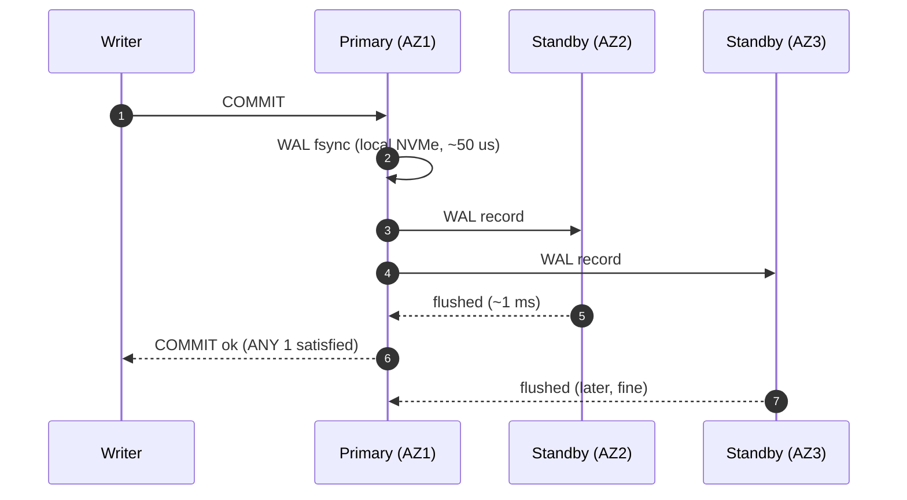
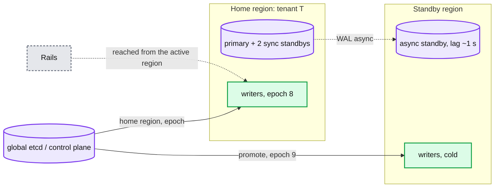

# Deep dive: durability and multi-region

> One-line answer: every ledger and payments shard commits synchronously to a quorum across three availability zones in its home region (RPO 0 for acked writes, one AZ round trip per commit) and replicates asynchronously to a standby region (RPO about 1 second); an unknown commit after a primary loss is resolved by retrying with the same deterministic id; a region loss is a promotion with an epoch bump, a sweeper pass over in-flight payments, and reconciliation against the rail for the 1 second gap; a per-account linearizable ledger cannot be active-active across regions, so tenants have a home region and cross-region money moves through clearing accounts.

Part of [`../solution.md`](../solution.md) §5.3, §5.6, §10.4, §10.6. Sources: Postgres synchronous replication docs, Spanner / TrueTime paper for why global serializability costs a round trip per commit, Visa's four synchronized data centers. Links in [`../research/`](../research/).

---

## 1. In-region durability

- `synchronous_commit = on`, `synchronous_standby_names = 'ANY 1 (az2, az3)'`. A commit is durable on two AZs before the ack. Losing the primary loses nothing acked. Losing one standby does not block commits.
- Cost: about 1 ms per commit for the AZ round trip. That is the number that sets the hot-row ceiling (see [`hot-accounts-and-contention.md`](hot-accounts-and-contention.md)) and why batching matters.
- Failover: a lease-based manager (Patroni-style) promotes the most advanced standby in 5 to 10 s; managed cloud databases take 30 to 60 s. The new primary's epoch is bumped in etcd; writers read it before reconnecting.

## 2. The unknown commit

The writer sent `COMMIT` and got a timeout. The record may be on the primary and a standby (committed), on the primary only (lost with it), or nowhere.

Resolution: retry the same `Post(entry_id)` on the new primary. `INSERT ... ON CONFLICT (entry_id) DO NOTHING RETURNING *` returns the row if it exists, inserts otherwise. Because every entry id is deterministic, and every payment state transition is a conditional update on `version`, and every idempotency phase records its `recovery_point`, there is no special recovery path: the normal retry is the recovery. Say this explicitly; it is the whole reason for deterministic ids.

## 3. Fencing the old primary

A partitioned or paused primary may still accept writes for seconds after the standby is promoted. Two protections:
- The manager demotes it by killing its lease; it stops accepting writes when it cannot renew (it checks on a monotonic clock, so a paused process finds its lease expired on wake).
- Writers carry the shard epoch and the ledger writer checks it inside every transaction (`UPDATE shard_epoch ... WHERE epoch = $e`). A write on the old primary with a stale epoch fails before it commits anything.

Without fencing, two primaries can each assign the same `seq` to different entries; the unique index would catch it only on re-sync, after both were acked. The epoch check prevents the ack.

## 4. Cross-region

Why not synchronous across regions: 60 to 100 ms per commit on every entry, and the region pair becomes a single latency domain. Spanner pays this by design (a Paxos round across replicas per commit, TrueTime for external consistency) and it is the right choice when the workload needs global serializability; ours needs per-ledger linearizability and a bounded RPO.

Why not active-active: a constrained balance is a linearizable register. Two regions accepting debits on it need consensus per write (Spanner) or will overdraft. So each ledger has one active region. The seam for a tenant that must be active in two regions: split its accounts into two ledgers, one per region, and move money between them through clearing accounts, exactly as cross-ledger transfers work today. Its "total balance" becomes eventually consistent; the per-region balances remain linearizable.

## 5. Region loss timeline

| t | Event | Note |
|---|---|---|
| 0 | home region dark | acked writes in the last ~1 s are not in the standby |
| 30 s | health checks fail, traffic manager moves the API | clients get 503 with `Retry-After` in the gap |
| 60 s | control plane promotes standbys, epoch bump to 9 | old region fenced by epoch even if it comes back |
| 60 to 120 s | sweeper in the new region walks non-terminal payments | unknowns reversed on the rail, holds released |
| 2 min onward | orchestrator retries re-post entries by deterministic id | anything the old region acked but did not ship is re-created if the orchestrator still has the intent |
| T+1 | reconciliation against the rail | the rail is the truth for what was charged in the 1 s gap; duplicates refunded, lost captures re-submitted |
| later | old region returns as a standby | a divergence job compares its last 1 s of WAL to the new primary and turns differences into correction entries or refunds |

RTO 2 min. RPO about 1 s. Both are stated to customers. The rail's own view (auth logs, clearing files) is what makes a 1 s RPO acceptable for money: nothing is truly lost, it is temporarily unrecorded, and reconciliation records it.

## 6. What the Visa framing does differently

Visa runs four synchronized data centers and switches authorizations active-active. It can, because authorization moves no money: the switch is stateless per message, the issuer holds the balance, and the network's ledger is clearing and settlement, computed in batch from logs that every site has. Our platform framing has the balance in our ledger, so we cannot be active-active on the money path without a consensus round per entry. If the interviewer pushes for Visa's design: separate the real-time path (auth, no ledger balance, log only, active-active) from the money path (batch netting, single writer per member account per day), and say that is exactly why card networks separate authorization from clearing.

## 7. Backups and long retention

- Continuous WAL archiving to object storage per shard; base backups daily; point-in-time restore for a shard is minutes to an hour and is a last resort behind the standbys.
- Entries older than 90 days move via CDC to a columnar archive (compressed 4x, object storage, 7 year retention, object lock). The OLTP tier keeps 90 days for as-of queries and disputes. Older as-of queries run on the archive and are minutes, not milliseconds; finance accepts that.
- Backups are tested by restoring a random shard weekly and running the layer 2 invariants on it.
