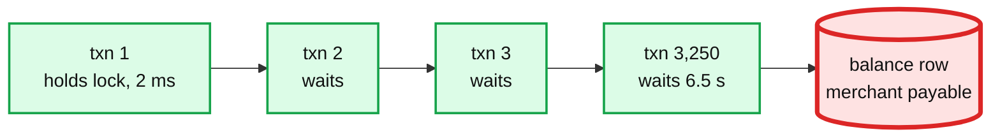
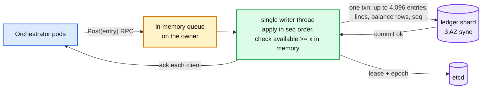

# Deep dive: hot accounts and balance contention

> One-line answer: a balance row is a serialization point that tops out at a few hundred updates per second under synchronous replication, so first remove the row wherever no decision depends on it (unconstrained accounts are append-only with snapshots), then for the accounts that must be checked synchronously and are hot, replace row locks with a single-writer batch per ledger shard that checks balances in memory and commits thousands of entries per transaction; sub-accounts are the fallback when one writer is not enough.

Part of [`../solution.md`](../solution.md) §5.1, §10.1, §10.3. Sources: TigerBeetle docs (single-threaded state machine, 8,190 transfers per batch, VSR), Postgres docs on row locks and `deadlock_timeout`. Links in [`../research/`](../research/).

---

## 1. Where the ceiling comes from

A synchronous balance update is `UPDATE balance SET available = available - x WHERE account_id = a AND available >= x`. Under a row lock each update on the same row waits for the previous transaction to commit. Commit with a synchronous standby in another AZ is about 1 to 2 ms (the standby round trip, not the disk). So one row admits roughly 500 to 1,000 updates/s, and the queue behind it grows without bound past that.

```
Hot merchant at 5% of volume: 500 payments/s avg, 3,250 peak
Touches per payment lifecycle on its payable: 3 (hold, capture, payout aggregate)
Row updates needed: 1,500/s avg, ~10,000/s peak
Row ceiling: ~500/s
Over by: 3x avg, 20x peak
```

Symptoms in order: lock wait p99 climbs, then `lock_timeout` (200 ms) errors, then `deadlock_timeout` (1 s) log noise, then the shard's connection pool is full of waiters and every ledger on that shard suffers.



## 2. Fix 1: do not have the row

Ask what decision depends on the balance at write time. For a merchant payable: none. Nothing is refused because the merchant "does not have enough" at capture time. So:

- `constrained = false`. Entries are pure inserts into `line`. Inserts do not contend on a row; they contend on the index tail and the sequence, which handle 100 k+/s.
- Balance = last snapshot + tail sum. Snapshot every 1,000 lines or 60 s. Reads cost one snapshot lookup plus up to 1,000 lines, single digit ms.
- The platform's fee revenue and card receivable are per-ledger sub-accounts, so no global row either.

This handles about 95% of ledgers with no special machinery. Say it before offering any clever solution.

## 3. Fix 2: single-writer batch for constrained, hot accounts

Some accounts must be checked synchronously and are hot: a prefunded float that every payout draws from; a payroll funding account paying 50 k employees; a customer wallet product where a few wallets are corporate and busy.

Design (TigerBeetle's, applied per ledger shard):



- Exactly one writer owns the ledger (lease in etcd, epoch on every commit, see §5).
- The writer holds constrained balances in memory, loaded from the materialized rows on startup.
- It drains the queue into a batch (up to 4,096 entries or 10 ms), applies each in order: validates, checks constrained balances, assigns `seq`, updates the in-memory balances, rejects the ones that fail (they get an error, not a slot).
- One transaction writes all entries, lines, balance rows, and the epoch check. One replica round trip per batch, not per entry.
- Acks go out after commit. A rejected entry is acked with the reason and is not in the batch.

Numbers: 4,096 entries per 2 ms commit plus 10 ms batching is 100 k+ entries/s per shard on one core, at 12 ms p50 added latency. TigerBeetle reports about 1 M transfers/s with 8,190 per batch and a purpose-built storage engine; we do not need that.

Why it works: contention becomes throughput. There is no lock because there is one thread. The balance check is a memory compare. Durability is unchanged (same synchronous commit). Idempotency is unchanged (entry ids collide in the batch's insert; the writer also checks a recent-id set in memory to answer replays without a round trip).

## 4. Fix 3: sub-accounts (when one writer is not enough)

If a single constrained account needs more than one writer's throughput, split it into N sub-accounts and route credits by `hash(payment_id) % N`. Debits pick a sub-account with enough available, or the writer drains several in one entry.

Costs, say them:
- Every balance reader sums N rows or snapshots.
- A debit can fail on one sub-account while the total suffices; a rebalancer moves funds between sub-accounts (an entry, so auditable), which adds a state where the account "has the money but not here".
- Payouts and statements must present the logical account, so the split leaks into every consumer.

Use it for the platform float if a single writer's 100 k/s is not enough, which at 65 k payments/s it is. Prefer the writer.

## 5. Ownership: lease, epoch, fencing

The single writer is a stateful owner, so the same problems as a file system chunk lease apply:

- Lease in etcd with a 5 s TTL, renewed every 1 s. Epoch increments on every owner change.
- Every batch transaction begins with `UPDATE ledger_owner SET epoch = $e WHERE ledger_id = $l AND epoch = $e`. Zero rows means a newer owner exists; abort, step down.
- A paused owner (GC, live migration) that wakes up after its lease expired fails this check on its next commit. It cannot corrupt the sequence.
- Failover: 5 s lease expiry plus 1 to 2 s to load balances from the materialized rows plus tail. During that window the ledger rejects writes with `owner_unavailable`; the orchestrator holds the payment in its current state and retries. The payment SLO absorbs it because one ledger is a small fraction of traffic.

## 6. Reads under the writer

- Constrained balance reads go to the writer (in memory, linearizable) or to the materialized row (consistent as of the last commit, at most one batch behind).
- Unconstrained reads use snapshot + tail from a replica; they are consistent as of a `seq`.
- The invariant job compares in-memory, materialized, and derived balances every 5 min on every hot ledger.

## 7. Payroll special case

A run paying 50 k employees from one funding account is 50 k debits against one constrained account. Do not check 50 k times. Reserve once: one hold for the run total (one check, one entry), then post 50 k payment lines against the hold, batched. The contended operation happens once per run. If the funding is insufficient the run fails before any employee entry exists, which is what finance wants.

## 8. Decision table

| Account | Constrained | Volume | Mechanism |
|---|---|---|---|
| Merchant payable | no | any | append-only, snapshot + tail |
| Fee revenue, card receivable | no | all traffic | per-ledger sub-accounts, append-only |
| Consumer wallet | yes | tens/s | row lock with conditional update |
| Corporate wallet, platform float, payroll funding | yes | thousands/s | single-writer batch |
| Beyond one writer | yes | 100 k+/s | sub-accounts with rebalancer, last resort |
