# Deep dive: idempotency keys at the API

> One-line answer: the key is a row in the same database transaction as the payment it protects, with a fingerprint of the request, a lock timestamp, a recovery point, and a stored response; the unique index is the only lock, a stale lock is taken over and resumed (never restarted), and the row lives 24 hours.

Part of [`../solution.md`](../solution.md) §4.1, §10.5. Sources: Stripe's idempotent requests docs (24 h, 400 on parameter mismatch, 409 while in flight), Brandur Leach's "Implementing Stripe-like idempotency keys in Postgres" (`locked_at`, `recovery_point`, atomic phases), Airbnb's Orpheus (pre-RPC / RPC / post-RPC, master reads, retryable vs non-retryable errors), IETF `draft-ietf-httpapi-idempotency-key-header`. Links in [`../research/`](../research/).

---

## 1. The row

```sql
CREATE TABLE idempotency_record (
  tenant_id       uuid        NOT NULL,
  key             text        NOT NULL,          -- opaque, <= 255 chars, client generated
  fingerprint     bytea       NOT NULL,          -- sha256(method + path + canonical body)
  state           text        NOT NULL,          -- in_progress | done
  locked_at       timestamptz,                   -- set by the DB clock, not the pod
  recovery_point  text        NOT NULL,          -- started | held | authorized | posted | finished
  response_code   int,
  response_body   jsonb,
  payment_id      uuid,
  created_at      timestamptz NOT NULL DEFAULT now(),
  expires_at      timestamptz NOT NULL,          -- created_at + 24 h
  PRIMARY KEY (tenant_id, key)
) PARTITION BY RANGE (created_at);               -- hourly partitions, expiry = DROP PARTITION
```

Why each column exists:
- `tenant_id` in the key: scopes the key and puts the row on the tenant's shard with the payment.
- `fingerprint`: same key with a different body is a client bug, not a retry. Reject it (422 here, 400 at Stripe).
- `locked_at`: distinguishes "another pod is working on this" from "a pod died holding this".
- `recovery_point`: where to resume. Without it, a takeover would restart from the top and call the rail again.
- `response_*`: the replay returns exactly what the first attempt returned, including a 402 decline.
- `expires_at`: 24 h. Beyond it the key is a new request. Clients are told.

## 2. The phases

```mermaid
%% Each phase is one transaction. The rail call is the only step that is not a transaction, so it sits between two recovery points.
flowchart LR
    S[started<br/>txn: idem row + payment row] --> H[held<br/>txn: ledger hold posted]
    H --> RC[rail call<br/>NOT a txn, attempt row written before]
    RC --> A[authorized<br/>txn: attempt outcome + payment status]
    A --> P[posted<br/>txn: ledger capture posted]
    P --> F[finished<br/>txn: response stored, state = done]

    class S,H,A,P,F service
    class RC external

    classDef service  fill:#dcfce7,stroke:#16a34a,stroke-width:2px,color:#111
    classDef external fill:#e5e7eb,stroke:#6b7280,stroke-width:2px,color:#111,stroke-dasharray:4 3
```



Rules:
- A phase's transaction commits its effect and the new `recovery_point` together. A crash between phases leaves the record at the last committed point.
- The rail call is bracketed: write the `attempt` row (with `sent_at`) before, write its outcome after. A crash inside the bracket leaves an attempt with no outcome, which the resolver treats as unknown. The `attempt_id` is fixed before the call, so a re-send is the same request at the rail.
- Every phase is itself idempotent: the ledger hold and post use deterministic entry ids; the payment status change is a conditional update on `version`.

## 3. The four outcomes of an INSERT

| Row state on conflict | Fingerprint | Response | Why |
|---|---|---|---|
| inserted | | proceed | first request |
| `done` | equal | stored code + body | replay |
| `in_progress`, `locked_at` < 30 s old | equal | 409 `idempotency_in_use`, `Retry-After: 1` | another pod is working |
| `in_progress`, `locked_at` ≥ 30 s old | equal | take over: `UPDATE ... SET locked_at = now() WHERE locked_at = <old>`; if 1 row, resume from `recovery_point` | pod died |
| any | different | 422 `idempotency_mismatch` | client bug |

The takeover update is itself conditional on the old `locked_at`, so two pods that both see a stale lock cannot both take it.

Why 30 s: longer than the rail deadline (5 s) plus a ledger post, so a slow but alive pod is not preempted; shorter than a client's patience.

## 4. Why not Redis, and why not a lock service

- Redis: the key and the payment are not in one transaction. Pod dies after the payment insert and before `SET key`: the retry creates a second payment. Redis failover, eviction, or a `maxmemory` policy loses keys silently. Each loss is a duplicate charge. The key must be exactly as durable as the thing it protects, so it lives next to it.
- Lock service (ZooKeeper, etcd, Redis `SETNX` with TTL): a second serialization mechanism with its own failure modes (lease expiry during a GC pause lets two holders in). The unique index already serializes concurrent inserts, is durable, and has no TTL to get wrong. Airbnb's Orpheus reads and writes the key on the master DB for the same reason.

## 5. Scope and TTL choices

- Scope per tenant and per endpoint path (the path is inside the fingerprint). Reusing a key across endpoints is a mismatch, as at Stripe.
- 24 h: retries happen within seconds to hours; a client that retries a day later has a bug or a human in the loop, and a new payment with a review is safer than a stale replay. Stripe's v1 API uses 24 h. Longer windows cost rows: at 10 k/s, each extra day is 864 M rows and 430 GB.
- Key generation: UUID v4 or v7 by the client, generated before the first attempt and stored client-side so a client crash and restart reuses it (Airbnb's pre-RPC phase). A server-generated key defeats the purpose because the client cannot know it on retry.

## 6. What the client is told

| Response | Meaning | Client action |
|---|---|---|
| 201 / 200 | created / replayed | done |
| 202 `pending` | outcome unknown, being resolved | poll `GET`, or wait for webhook |
| 409 `idempotency_in_use` | in flight elsewhere | retry after `Retry-After` |
| 422 `idempotency_mismatch` | different body under the same key | fix the client |
| 402 decline | rail declined | stored; replay returns the same 402 |
| 503 + `Retry-After` | rail or shard unavailable, nothing was attempted | retry with the same key |

Retryable vs non-retryable (Airbnb's split): 409 and 503 are retryable with the same key; 422 and 402 are not. The SDK encodes this so merchants do not have to.

## 7. Numbers

- 10 k/s inserts, 10 k/s updates (phase advances, ~5 per payment, so 50 k/s), 100 to 500 replays/s. All point operations on the payments shard, already sized for the payment rows.
- 864 M live rows, 430 GB. Hourly partitions, 24 dropped per day.
- Takeover rate in steady state: roughly the pod crash rate, single digits per hour. If it climbs, a phase is hanging.
