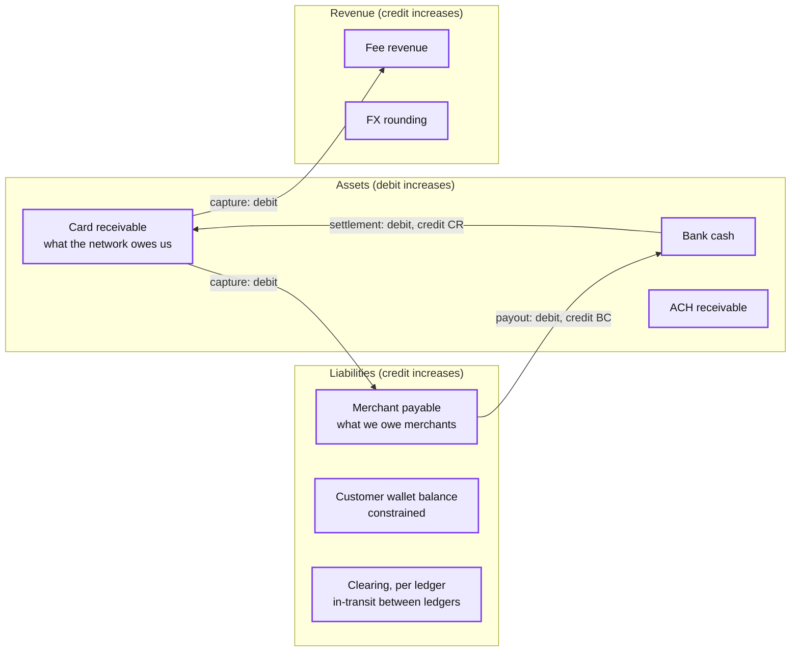
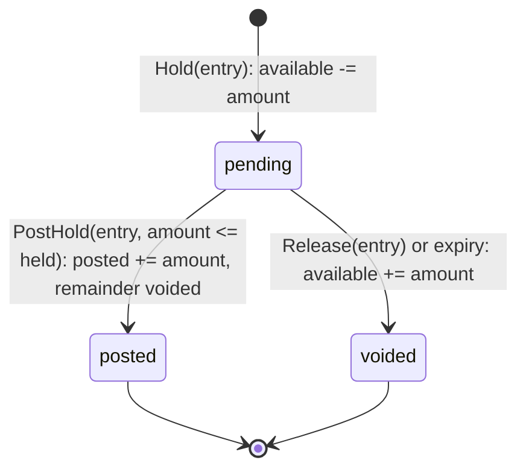
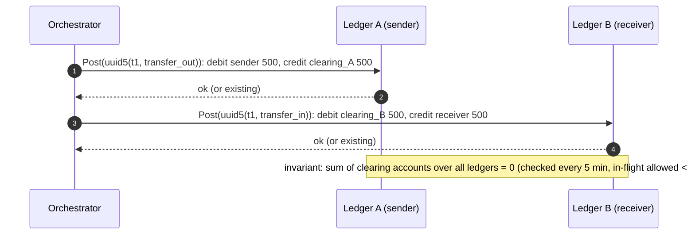

# Deep dive: the ledger and double entry

> One-line answer: the ledger is an append-only table of lines grouped into journal entries that each sum to zero per currency, inside one `ledger_id` shard; balances are derived (materialized synchronously only where money can go negative), entry ids are deterministic so replays collide, corrections are new entries, and money that must cross ledgers passes through per-ledger clearing accounts whose global sum is an invariant.

Part of [`../solution.md`](../solution.md) §4.3, §4.4, §5.4, §5.5. Sources: Modern Treasury's ledger posts (posted / pending / available, versioned balances, immutability, discard by reversal), TigerBeetle docs (debits and credits, pending transfers, linked transfers), Stripe's Ledger post (fund flows as state machines, clearing metric), Uber LedgerStore (immutability, sealing). Links in [`../research/`](../research/).

---

## 1. Why double entry and not a balance column

A balance column answers "how much". Double entry answers "how much, why, since when, and is the whole system consistent". Concretely:

| Question | Balance column | Double entry |
|---|---|---|
| Why is the merchant's balance 4,317? | unknowable | sum the lines |
| Did a bug lose money? | notice at month end | every entry sums to zero, checked at commit |
| Balance as of last Tuesday? | no | snapshot + tail to a `seq` |
| Is our receivable equal to what the network owes us? | no | one account to reconcile against the clearing file |
| Auditor asks for the trail | no | it is the table |

The invariant that makes the second column true: for every journal entry, for every currency, `sum(debit lines) = sum(credit lines)`. Therefore, for the whole ledger, `sum(all debits) = sum(all credits)`, and for any set of accounts that form a closed system, balances sum to zero.

## 2. Accounts



Fields per account: `ledger_id` (shard), `type`, `currency` (one per account; multi-currency is more accounts), `normal_side`, `constrained` (never negative, checked synchronously), `allow_pending` (can carry holds).

Platform-wide accounts (fee revenue, card receivable) are **per-ledger sub-accounts** of a logical account. Reporting sums them. This is what removes the platform-wide hot row: every merchant's fee lines go to that merchant's ledger, not to one global row.

## 3. Entries and lines

```sql
CREATE TABLE journal_entry (
  entry_id     uuid PRIMARY KEY,           -- uuid5(payment_id, kind, attempt_id): replay collides here
  ledger_id    uuid NOT NULL,              -- shard key
  seq          bigint NOT NULL,            -- total order within ledger
  payment_id   uuid,
  kind         text NOT NULL,              -- hold | capture | void | settlement | refund | chargeback | payout | transfer | correction | manual_adjustment
  effective_at timestamptz NOT NULL,       -- business date
  posted_at    timestamptz NOT NULL DEFAULT now(),
  metadata     jsonb,                      -- fee rule, fx rate, rounding rule, ticket id
  prev_hash    bytea, hash bytea,
  UNIQUE (ledger_id, seq)
);
CREATE TABLE line (
  line_id      uuid PRIMARY KEY,
  entry_id     uuid NOT NULL REFERENCES journal_entry,
  ledger_id    uuid NOT NULL,
  account_id   uuid NOT NULL,
  side         char(1) NOT NULL,           -- D | C
  amount_minor bigint NOT NULL CHECK (amount_minor > 0),
  currency     char(3) NOT NULL,
  state        text NOT NULL               -- pending | posted | voided
);
```

Rules enforced by the writer before commit (and by a deferred trigger as a belt):
1. ≥ 2 lines.
2. Per currency, `sum(D) = sum(C)`.
3. All lines in one `ledger_id`.
4. Each account's currency equals the line's currency.
5. For each constrained account debited: `available >= amount` after the update.

Never `UPDATE` or `DELETE` a line except `state` transitions `pending -> posted | voided`. A wrong entry is fixed by a `correction` entry that reverses it and a new correct one. Modern Treasury and Uber do the same; QLDB makes it physically impossible.

## 4. Posted, pending, available

| Balance | Definition | Used for |
|---|---|---|
| posted | sum of `posted` lines | statements, settlement, audit |
| pending | sum of `pending` lines (holds not yet posted or voided) | what is reserved |
| available | posted minus pending debits (plus pending credits if the product allows) | the "can I spend" check |

Two-phase flow (TigerBeetle's pending transfers, the card auth model):



Why two-phase: the funds check runs once, under the row lock or in the single writer, at hold time. Capture later cannot fail for funds. Partial capture posts part and voids the rest in one entry. Expiry (7 days default, scheme-specific per rail) is a sweeper that voids with a deterministic id, so it is safe to run twice.

## 5. Materialized balances

- `constrained = true`: a `balance` row updated in the entry's transaction with the conditional `available >= amount` check. This is the only row-level contention in the design and is confined to accounts that need it. Hot ones go to the single-writer batch ([`hot-accounts-and-contention.md`](hot-accounts-and-contention.md)).
- `constrained = false`: no synchronous row. A `balance_snapshot(account_id, seq, posted, pending)` written every 1,000 lines or 60 s by a job that reads lines in `seq` order. Read = snapshot + sum of lines with `seq` greater than the snapshot's. Bounded by the snapshot interval.
- Both are derived state and can be rebuilt from lines. The invariant job compares materialized to derived every 5 min.

Versioned balances (Modern Treasury): each snapshot carries the `seq` it is valid at, so "balance at version N" is a lookup, not a recompute.

## 6. Deterministic ids and idempotency

`entry_id = uuid5(namespace, payment_id || kind || attempt_id)`. Properties:
- A retry of `Post` after an unknown commit hits the primary key and returns the existing entry. No separate dedup table.
- Two workers that both try to post the capture for one payment produce one entry.
- A refund's entry id includes the refund's id, so two refunds for one payment are two entries; a retry of one refund is one entry.
- Sweeper-generated entries (void on expiry, settlement from a file) include the file id or `expiry` in the name, same property.

`seq` is assigned by the writer under the shard's ownership (a per-ledger counter in the writer, persisted with the batch). Gaps are allowed (a failed batch), duplicates are not (unique index).

## 7. Cross-ledger money: clearing accounts

An entry never spans ledgers. When money must move from ledger A to ledger B:



- If the orchestrator dies between the two, the retry re-posts both; the first returns the existing entry.
- The sender sees `pending` until the second half lands; bounded by the retry deadline (60 s), then a break.
- This is how correspondent banking works (nostro / vostro, suspense). It is also unavoidable for the external rails: the card receivable account is exactly a clearing account against a ledger we do not own (the network's).

What we refused: a global serializable database making both halves one transaction. Cost: 10 ms+ per entry in region, 100 ms+ across, and the hot row is untouched. The clearing pattern is needed for rails anyway, so it is one pattern instead of two.

## 8. Hash chain and audit

Per ledger: `hash = sha256(prev_hash || entry_id || seq || canonical lines)`. Stored on the entry. Verified by an independent job with read-only credentials; a break pages security.

Synchronous chaining serializes entries within a ledger, which the single writer already does. For direct-write ledgers, chain per batch in the snapshot job instead (async, minutes behind); tamper evidence does not need to be synchronous, the sequence number does.

## 9. Worked example, $100 card payment, 2.9% + 30c, auto capture, then $30 refund

| seq | kind | Line | Account | D/C | Minor |
|---|---|---|---|---|---|
| 41 | hold (pending) | 1 | Card receivable | D | 10,000 |
| | | 2 | Merchant payable | C | 10,000 |
| 42 | capture (posts 41) | 1 | Card receivable | D | 10,000 |
| | | 2 | Merchant payable | C | 9,680 |
| | | 3 | Fee revenue | C | 320 |
| 57 | settlement (file f-0912) | 1 | Bank cash | D | 10,000 |
| | | 2 | Card receivable | C | 10,000 |
| 88 | refund (r1) | 1 | Merchant payable | D | 3,000 |
| | | 2 | Card receivable | C | 3,000 |
| 103 | refund settlement | 1 | Card receivable | D | 3,000 |
| | | 2 | Bank cash | C | 3,000 |

After seq 103: merchant payable 6,680 (credit balance, we owe them), fee revenue 320, card receivable 0, bank cash 7,000. Sum of all account balances, signed by normal side: 0. Every line is still there; nothing was edited to produce the refund.

## 10. Money math

- Integers in minor units. ISO 4217 exponent per currency: USD 2, JPY 0, BHD and KWD 3. Never a float, never a decimal type that could carry a fraction of a minor unit.
- Fee = `round_half_up(amount x 29 / 1000) + 30`. The rounding rule and inputs are in `metadata` so the entry is reproducible.
- FX: an entry with lines in two currencies balances per currency. The converted amount is `round(amount x rate)`; the residual from rounding goes to an `fx_rounding` line in the target currency so the target-currency side balances. The rate and its source are in `metadata`.
- Splits (marketplace): one capture entry with N merchant payable credits; the sum of the rounded parts may differ from the total by a few minor units; the difference goes to the platform's fee line, by written policy.
