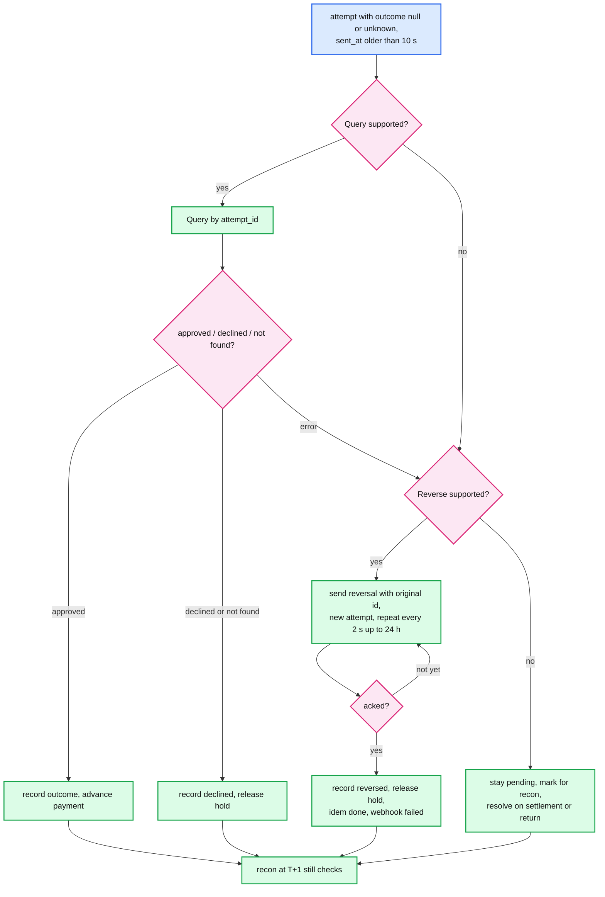

# Deep dive: rails, timeouts, and the unknown outcome

> One-line answer: a timeout on a money-moving call is a third outcome, `UNKNOWN`, not a failure; the adapter returns it, the payment enters an explicit unknown state, and a resolver closes it using whatever the rail offers (a status query, a reversal that is safe to repeat, or settlement and returns for batch rails), with reconciliation as the backstop; every call carries a stable `attempt_id` so a re-send is the same request at the rail.

Part of [`../solution.md`](../solution.md) §4.2, §5.2, §10.1, §10.4. Sources: ISO 8583 message types and advice semantics, Visa STIP, Stripe's low-level error docs (timeouts are indeterminate, retry with the same key), NACHA same-day windows and return codes. Links in [`../research/`](../research/).

---

## 1. The three rails and what each offers

| Rail | Call | Outcome timing | Status query | Reversal | Idempotency at the rail | Unknown window |
|---|---|---|---|---|---|---|
| Card network (ISO 8583, we are acquirer or processor) | `0100` auth | synchronous, single-digit seconds | no (some schemes offer an inquiry, not universal) | `0400` request, repeated until `0410`; `0420` advice | STAN + RRN per day per terminal; a duplicate STAN is rejected | seconds, then reversed |
| PSP (Stripe, Adyen, ...) over HTTPS | `POST /charges` | synchronous, 100 ms to 2 s | yes, `GET` by our reference or by idempotency key | cancel / refund | `Idempotency-Key` header, 24 h | seconds to minutes |
| ACH (NACHA file) | file per window | none synchronous | no | no (a reversal is a new entry, allowed only for specific errors within 5 banking days) | trace number per entry | up to 2 banking days for returns, 60 days for unauthorized consumer debits |
| Real-time payments (FedNow, RTP, UPI, Pix) | API | synchronous, seconds | yes, definitive | no, credit transfers are final | end-to-end id | seconds |

The adapter interface hides the differences: `Authorize(attempt_id, ...) -> APPROVED | DECLINED | UNKNOWN`, plus `Query(attempt_id)` and `Reverse(attempt_id, original)` that return `UNSUPPORTED` on rails without them. The resolver branches on that.

## 2. The attempt row

```sql
CREATE TABLE attempt (
  attempt_id      uuid PRIMARY KEY,   -- uuid5(payment_id, kind, n): stable across re-sends
  payment_id      uuid NOT NULL,
  kind            text NOT NULL,      -- authorize | capture | reverse | refund | payout
  rail            text NOT NULL,
  rail_request_id text,               -- STAN + RRN, PSP key, ACH trace
  outcome         text,               -- null | approved | declined | unknown | reversed
  sent_at         timestamptz,        -- written BEFORE the call
  resolved_at     timestamptz
);
```

Written before the call so that a crash mid-call leaves evidence that a request may be in flight. `rail_request_id` is derived from `attempt_id` so the rail sees the same identifier on every re-send.

## 3. The resolver



Timing for cards: adapter deadline 5 s; the resolver waits until 10 s after `sent_at` (a late `0110` may still arrive and is honoured if it does); then reversal. The cardholder sees `pending` for about 15 s worst case, then `failed` with a reason, and the hold on their card is released by the reversal (otherwise it would sit for days until the issuer expires it, which is the complaint every support team knows).

## 4. Why reversal is safe to repeat

ISO 8583 distinguishes requests (end-to-end, expect a response, time out) from advices (point-to-point, informational, repeated until acknowledged, must be accepted). A reversal carries the original STAN, amount, and timestamp. The issuer matches it to the original auth: if found, release the hold and respond; if not found (the auth never arrived), respond as if done. Both are acknowledgements. So sending a reversal for a charge that never happened does nothing, and sending it twice does nothing the second time. That is the property the resolver relies on.

PSPs give the same property through the idempotency key: a cancel or refund with a key is applied once.

ACH has no such property. A reversal file entry is a new transaction, allowed only for duplicate or erroneous entries and only within 5 banking days, and it can itself be returned. Treat ACH "unknown" as pending until settlement or return, and reconcile.

## 5. Stand-in processing (STIP) on the network

When the issuer is unreachable, the network answers the `0100` itself using limits and rules the issuer pre-registered (amount caps, velocity, merchant categories), then forwards the transaction to the issuer as an advice when it returns. From our side it is an approval like any other. The relevance in the Visa framing: the switch is stateless per message and the "unknown outcome" is pushed to the issuer via advice, which is the same pattern as our resolver's reversal: a repeated, must-accept message.

## 6. What the payment state machine gains

States `authorizing_unknown`, `capturing_unknown`, `refunding_unknown` exist explicitly so that (a) the client's replay returns `pending` rather than a fresh attempt, (b) the sweeper can find them by state and age, and (c) dashboards show the unknown rate per rail, which is the leading indicator of a rail incident.

Transitions out of an unknown state are conditional updates on `version`, so a late `0110` arriving while the resolver is sending a reversal cannot produce both `authorized` and `reversed`: one wins, and if the late approval wins after the reversal was sent, the reversal still executes at the network and the recon will show the auth as reversed on the rail side; the payment is then corrected to `reversed` by recon. If the reversal wins first and a late approval arrives, it is ignored (the attempt is already `reversed`).

## 7. No hedging, no speculative retries

Tail-latency playbooks say: send a second request after p95, take the first response. On a money-moving call that is a duplicate charge unless the rail dedups on the request id and the two requests carry the same id. Cards: the same STAN twice within the timeout is rejected as a duplicate by most hosts, which is safe but pointless. PSPs: same key is safe. ACH: never. Policy: retry only after the adapter deadline, only with the same `attempt_id`, only on rails that dedup on it. Write this into the adapter so a well-meaning engineer cannot add hedging later.

## 8. ACH specifics for the payroll variant

- A run is a batch: one hold on the funding account, N employee entries, one NACHA file per window. Three same-day windows (10:30, 14:45, 16:45 ET) plus next-day.
- File submission is atomic: build to a temp name, checksum, rename, upload, record the file id and every trace number as `sent`. A crash before the rename means nothing was sent; after it, everything was.
- Settlement T+1 for same-day. Returns (`R01` NSF, `R02` closed, `R03` no account, `R04` invalid number, ...) arrive for up to 2 banking days; each is a `return` entry reversing that employee's line and a state change to `returned` with the code. The run's hold is released for returned amounts.
- The employee sees `processing` for a day. That is honest and the product should say so.

## 9. Timeline of a card timeout, second by second

| t | Event | Payment state | Cardholder sees |
|---|---|---|---|
| 0 | `0100` sent, attempt `a1` `sent_at` | `authorizing` | spinner |
| 3 s | API returns `202 pending` to the client rather than holding | `authorizing` | "processing" |
| 5 s | adapter deadline, returns `UNKNOWN` | `authorizing_unknown` | "processing" |
| 5 to 10 s | late `0110` honoured if it arrives | `authorized` if so | "approved" |
| 10 s | resolver sends `0400` (attempt `a2`) | `authorizing_unknown` | "processing" |
| 12 s | `0410` acked | `reversed`, hold released | "payment failed, not charged" |
| T+1 | recon: no capture for `a1` in the clearing file | unchanged | |
| T+1, bad case | recon: capture for `a1` present | `duplicate_detected`, auto-refund, page | refund notice |
