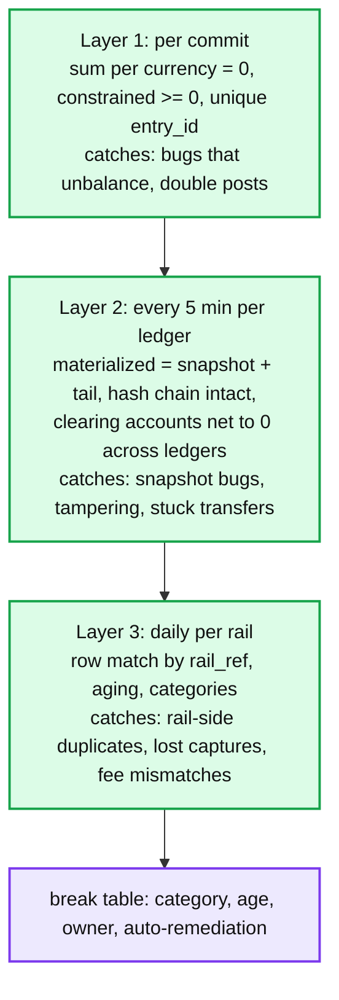
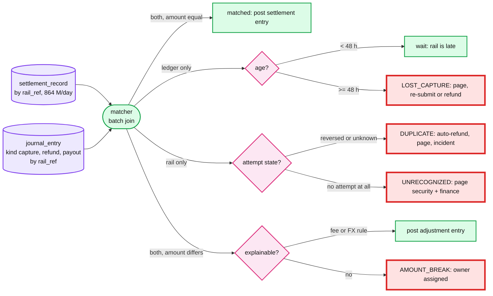

# Deep dive: reconciliation and audit

> One-line answer: three layers of checking, from cheap and continuous to expensive and daily: every entry sums to zero at commit; every 5 minutes each ledger's derived and materialized balances, hash chain, and cross-ledger clearing sum are verified; and every day each rail's clearing and settlement rows are matched to our entries by rail reference, with every unmatched row given an age, a category, and an owner, and a rail-side duplicate auto-refunded. Reconciliation is the last line of defence, not the first.

Part of [`../solution.md`](../solution.md) §4.5, §5.5, §10.9. Sources: Stripe's Ledger post (clearing, timeliness, completeness metrics; 5 B events/day; 99.99% of dollar volume verified within 4 days), Modern Treasury on reconciliation, Uber LedgerStore on sealing, QLDB on digests. Links in [`../research/`](../research/).

---

## 1. Three layers

Stripe's names for the layer 3 metrics, which we adopt:
- **Clearing**: accounts that should be zero at steady state are zero (our card receivable after settlement, our clearing accounts after transfers land).
- **Timeliness**: delay from the event happening to the ledger having it.
- **Completeness**: every id in a producer system has a matching ledger entry.

## 2. Layer 3 mechanics

Inputs per rail per day: clearing file (what the network will settle), settlement file (what hit the bank), bank statement (what the bank says). Each is ingested into `settlement_record` keyed by `rail_ref`, deduplicated by `file_id` (files arrive late and arrive twice).

Red here marks outcomes, not components: these four categories are where money is wrong, and each has a page and an owner.

Auto-remediation rules (all produce entries with deterministic ids, so a re-run is safe):
- `DUPLICATE`: refund with `uuid5(rail_ref, dup_refund)`, notify, incident. Metric `duplicates_found_by_recon` should be zero; each one gets a postmortem.
- `LOST_CAPTURE` older than the rail's capture window: void the hold and refund if the customer was charged elsewhere; else re-submit the capture with the same attempt id if the rail still allows.
- Amount differences within the fee schedule or the FX tolerance (rounding): adjustment entry, no page.

Tolerance: none on counts, a few minor units on FX rounding per row, zero on totals after adjustments.

## 3. Aging and cutoffs

A capture at 23:59:59 lands in tomorrow's file. If matching were by day it would be a false break. Matching is by `rail_ref` with no date condition; a ledger-only row is just "young" until 48 h. ACH uses 3 banking days. The break table stores `first_seen`, and dashboards show breaks by age bucket (0 to 24 h, 24 to 48 h, over 48 h). Only the last bucket pages.

## 4. Scale of the match

864 M rows/day per side. A sort-merge join on `rail_ref` over both sides, partitioned by rail and hash of `rail_ref`, runs in about 10 minutes on 50 executors. It is not latency sensitive; it is correctness sensitive: the job is idempotent (deterministic ids for every entry it posts) and re-runnable for any day, and re-running yesterday after a late file is the normal case, not the exception.

Streaming variant at 10x: match on arrival with a 1 h window keyed by `rail_ref` in a stream processor, fall back to the batch for stragglers. Same categories, same table.

## 5. Layer 2 mechanics

Per ledger every 5 minutes, on a replica:
- `SUM(signed amount over all posted lines) = 0`.
- For each constrained account: `materialized.available = derived(posted, pending)`.
- Hash chain from the last verified `seq` to the head.
- Across ledgers: `SUM(clearing account balances) = 0`, allowing in-flight transfers younger than 60 s.

A failure pages immediately for the first two (a bug is live or a writer misbehaved), pages security for the third, and opens a ticket for the fourth if the offending transfer is younger than 10 minutes (the orchestrator is probably still retrying) or pages otherwise.

## 6. Audit: balance as of a point in time

Entries are totally ordered within a ledger by `seq`; `posted_at` is the primary's clock. To answer "balance of account A at time T":
1. `seq_T = max(seq) where ledger_id = L and posted_at <= T` (one index scan).
2. Snapshot `S = latest snapshot(A) with seq <= seq_T`.
3. Balance = `S + sum(lines of A with S.seq < seq <= seq_T)`.

Deterministic, reproducible, and independent of when the question is asked. Finance may ask by `effective_at` instead (business date), which is a different filter on the same immutable rows.

## 7. Tamper evidence

Per ledger, `hash_n = sha256(hash_{n-1} || entry_id || seq || canonical lines)`. Publishing the head hash daily to a write-once location (an append-only object with object lock, or a signed digest emailed to audit) lets an auditor verify that the chain they are shown is the chain that existed that day. QLDB's digest and Uber's sealed manifests are the same idea. Cost: one hash per entry; the chain is verified by a job with read-only credentials that the ledger team does not hold.

## 8. What reconciliation does not do

It does not prevent anything. By the time it runs, the cardholder may have been charged twice for a day. Every mechanism above it (idempotency keys, attempt ids, reversals, deterministic entry ids) exists so that reconciliation finds nothing. Its value is that when one of them fails, the failure is bounded to a day and is found by us, not by a customer. Say this in the interview; candidates who present recon as the dedup mechanism are marked down.
