# Diagrams: Visa-scale payments + ledger + duplicate payment prevention

The D1 to D12 set for [`solution.md`](solution.md). Each diagram appears once in the repo: the ones embedded in `solution.md` are linked from here, not repeated. Colors per root `CLAUDE.md` §3. Red is used only for the hot constrained balance row (the thing that serializes first) and, in D11, for the two failures that can lose or duplicate money.

Legend reminder: 🔵 client / edge, 🟢 stateless compute, 🟣 durable storage, 🟡 cache or losable, 🔷 queue, 🔴 bottleneck or SPOF, ⚪ external, 🩷 decision.

---

## D1. Context (zoom-out)

Our system is the payments API, orchestrator, ledger, and reconciliation. Money actually moves outside it, on the rails.

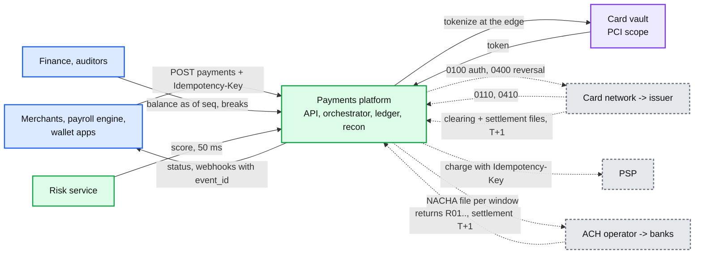

## D2. Data flow (DFD)

What flows, how big, how often. Peak numbers (65 k payments/s).

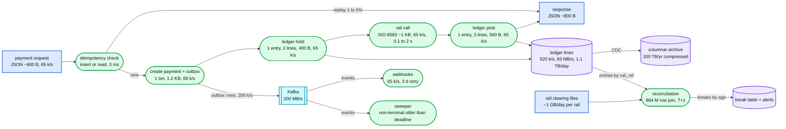

## D3. Component architecture

Embedded in [`solution.md` §6](solution.md#6-final-design). Not repeated here.

## D4. Sequence, happy path, one per FR

- **D4a, create + authorize + auto capture (FR1, FR2, FR3):** embedded in [`solution.md` §4.1](solution.md#41-create-a-payment-exactly-once-from-the-callers-point-of-view).
- **D4b, refund (FR2):** below.
- **D4c, reconciliation run (FR5):** below.
- **D4d, status read with read-your-writes (FR6):** below.

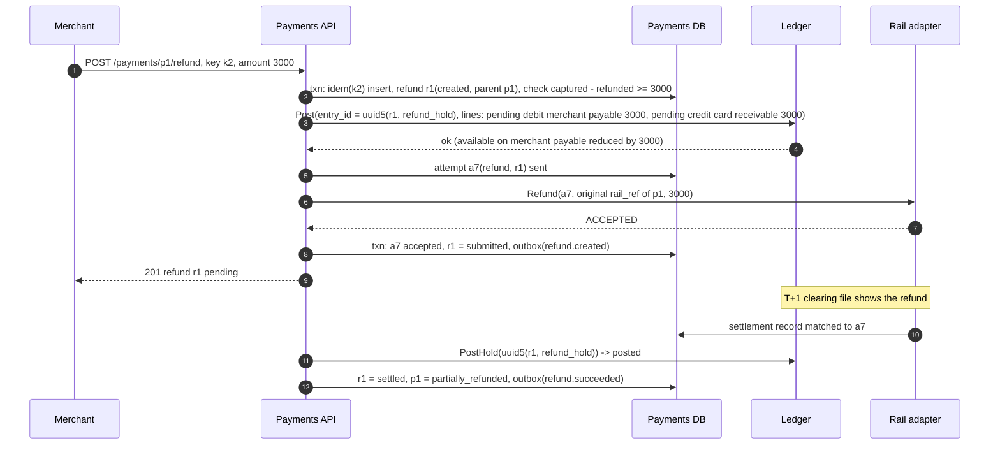

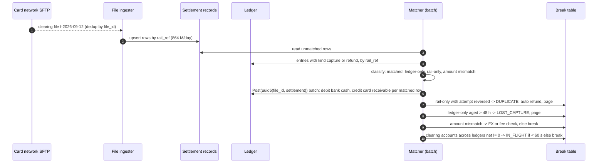

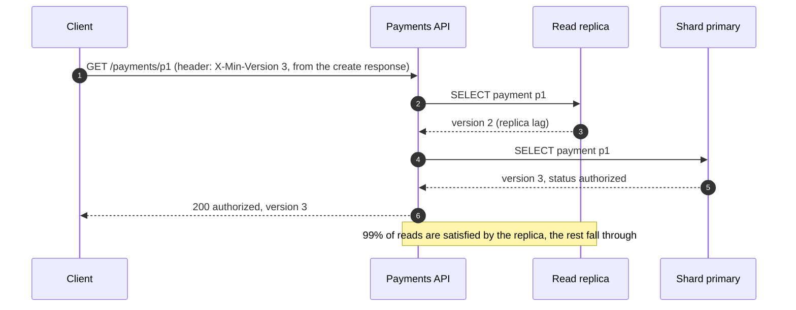

## D5. Sequence, failure path

- **D5a, rail timeout, unknown outcome, reversal:** embedded in [`solution.md` §4.2](solution.md#42-drive-the-payment-through-the-rail-with-a-retry-safe-state-machine).
- **D5b, API pod dies mid-flow, another pod takes over from the recovery point:** below.
- **D5c, two concurrent requests with the same key:** below.

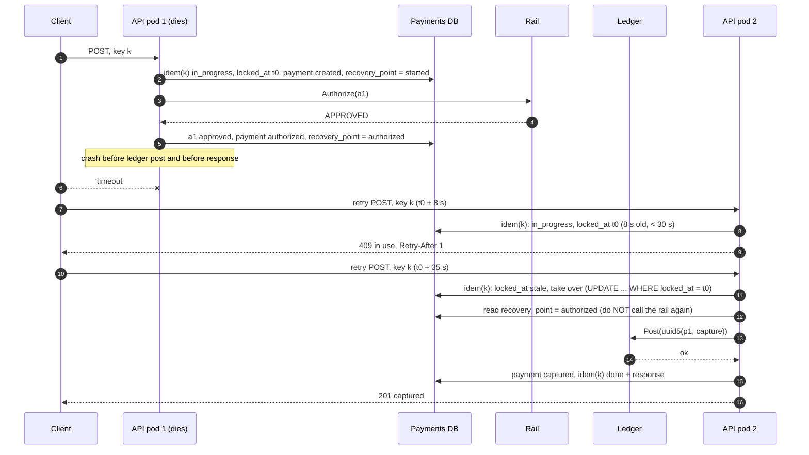

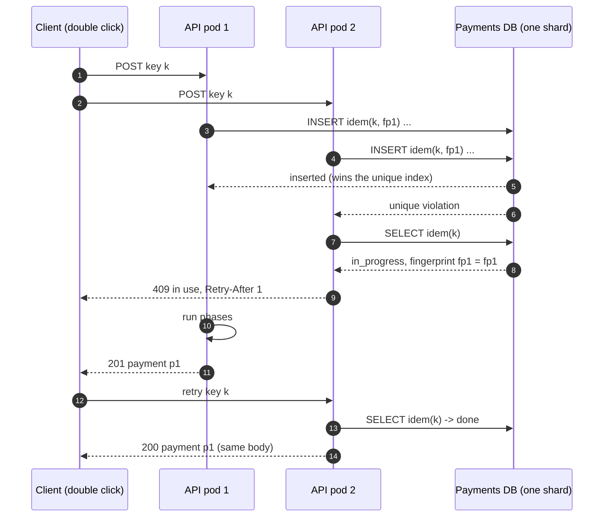

## D6. Activity / decision flow

Embedded in [`solution.md` §4.1](solution.md#41-create-a-payment-exactly-once-from-the-callers-point-of-view) (the idempotency decision). The second hardest branch, the resolver's decision on an unknown outcome, is below.

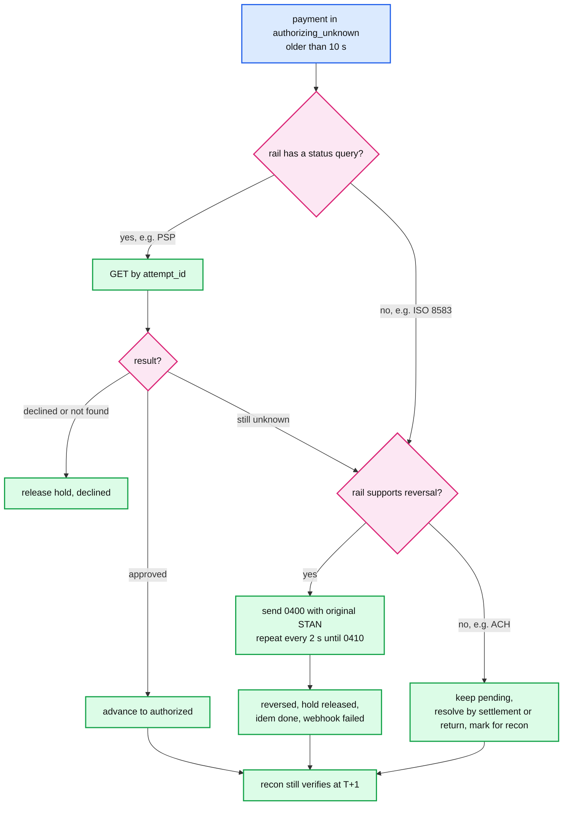

## D7. Entity relationship

Embedded in [`solution.md` §3.3](solution.md#33-data-model).

## D8. State machine

Payment lifecycle embedded in [`solution.md` §4.2](solution.md#42-drive-the-payment-through-the-rail-with-a-retry-safe-state-machine). The idempotency record's own lifecycle is below because the takeover rule is where candidates get it wrong.

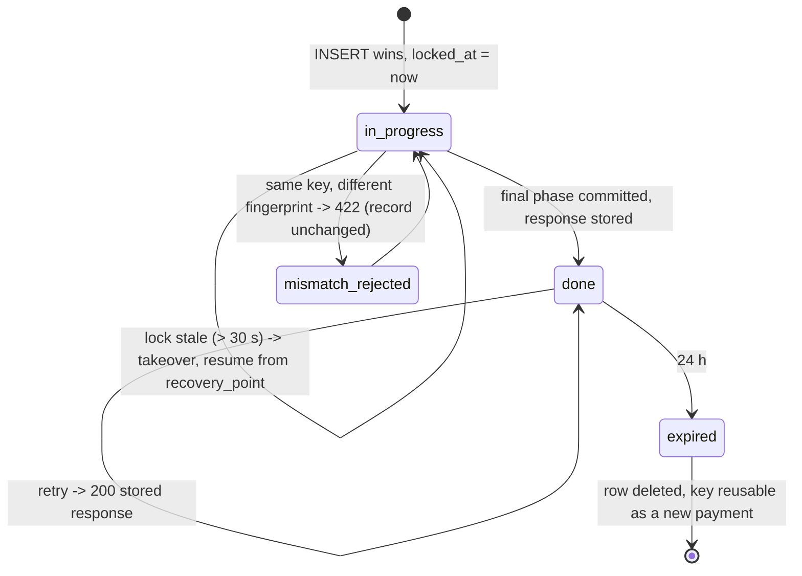

## D9. Deployment / topology

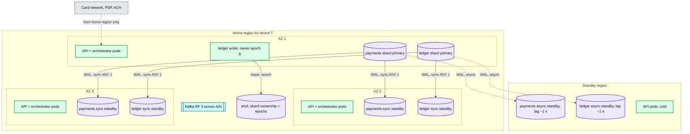

## D10. Scaling / partitioning

The hot-account diagram is embedded in [`solution.md` §5.1](solution.md#51-one-merchant-is-5-of-volume-its-account-gets-thousands-of-updates-a-second-what-breaks). The shard map itself is below.

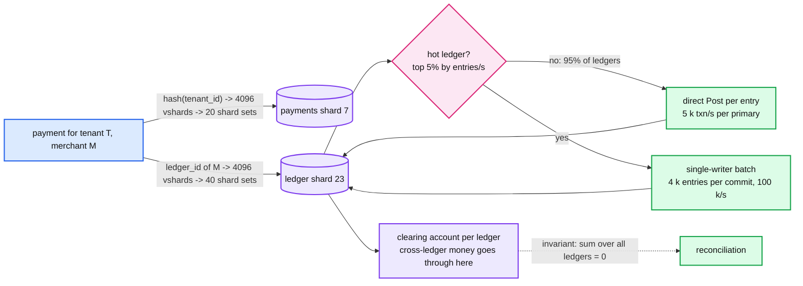

## D11. Failure mode map

```mermaid
%% D11: component -> failure -> blast radius -> mitigation. Red marks the two failures that can lose or duplicate money without the mitigation.
flowchart TD
    API[API pod dies mid-flow] -->|"blast: that request"| M1[recovery_point resume, 409 then takeover after 30 s]
    PDB[Payments shard primary dies] -->|"blast: 1 tenant group, 10 to 30 s"| M2[sync standby promoted, epoch bump, retries by key]
    LDB[Ledger shard primary dies after commit] -->|"blast: unknown commit"| M3[retry Post with same entry_id, ON CONFLICT returns existing]
    RAIL[Rail timeout] -->|"blast: possible double charge"| M4[UNKNOWN state, same attempt_id retry, 0400 reversal, recon T+1]
    HOT[Hot constrained balance row] -->|"blast: one merchant's p99, then the shard"| M5[unconstrained = no row, constrained = single-writer batch]
    KAF[Kafka down] -->|"blast: webhooks, sweeps lag"| M6[outbox accumulates, no money impact]
    REG[Region dark] -->|"blast: ~1 s acked writes"| M7[async standby promoted, sweeper reverses unknowns, recon fills gaps]
    BUG[Deploy posts unbalanced entries] -->|"blast: the books"| M8[sum = 0 check rejects at commit, invariant job 5 min, canary 1%]
    FILE[Rail file late or duplicated] -->|"blast: false breaks"| M9[dedup by file_id, match by rail_ref, 48 h aging]
    SPLIT[Two ledger writers think they own a shard] -->|"blast: divergent sequence"| M10[lease + epoch fencing at the DB, old epoch rejected]

    class RAIL,HOT critical
    class API,PDB,LDB,KAF,REG,BUG,FILE,SPLIT service
    class M1,M2,M3,M4,M5,M6,M7,M8,M9,M10 store

    classDef service  fill:#dcfce7,stroke:#16a34a,stroke-width:2px,color:#111
    classDef store    fill:#ede9fe,stroke:#7c3aed,stroke-width:2px,color:#111
    classDef critical fill:#fee2e2,stroke:#dc2626,stroke-width:4px,color:#111
```

## D12. Rollout / migration

Applicable: most companies arrive here from a `balance` column and a `transactions` table with no idempotency. Each phase has a rollback point that is a flag flip.

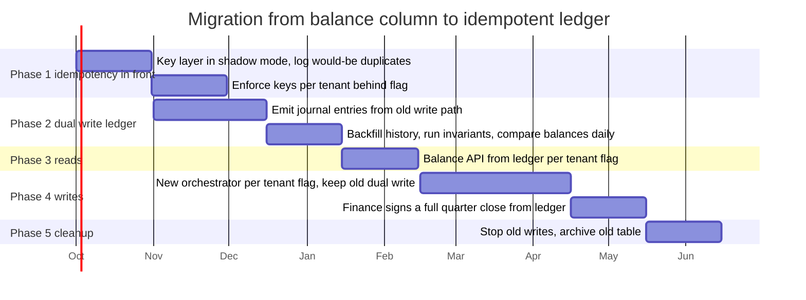

Rollback points: Phase 1, turn enforcement off (shadow keeps logging). Phase 2, stop emitting entries; nothing reads them yet. Phase 3, flip reads back to the old column per tenant. Phase 4, flip writes back per tenant; the old table is still being written so no backfill. Phase 5 is the only irreversible step and happens after a quarter close.
