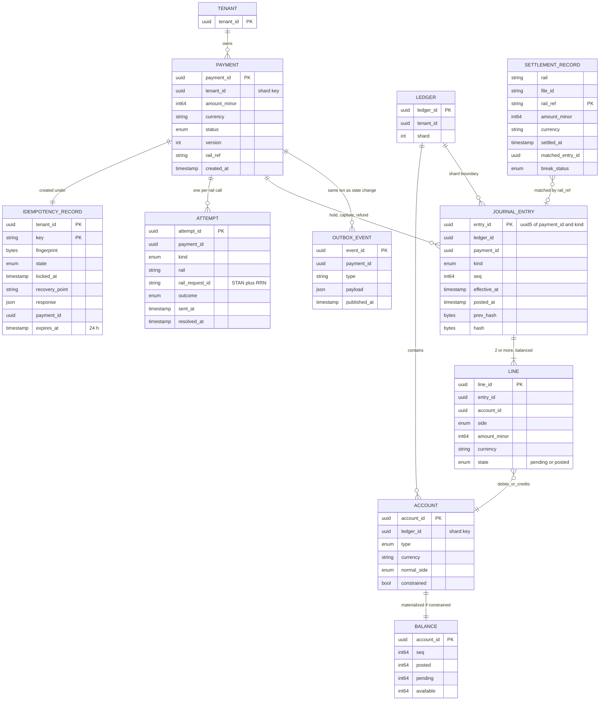
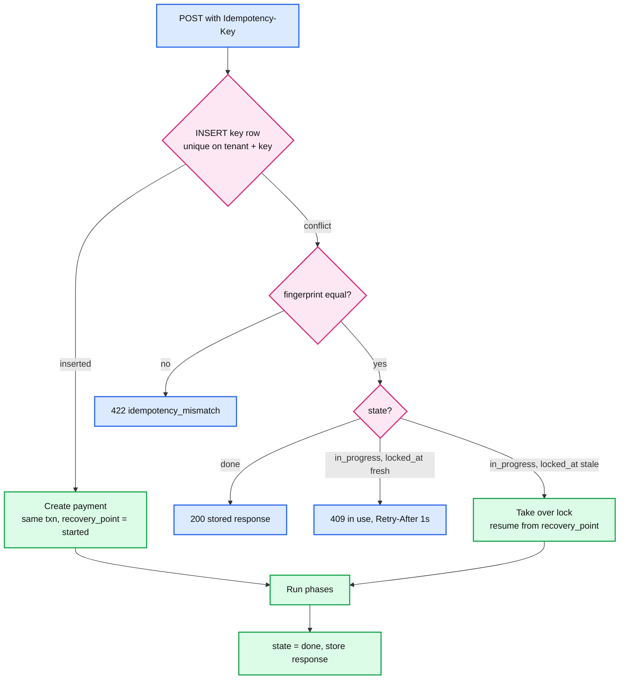
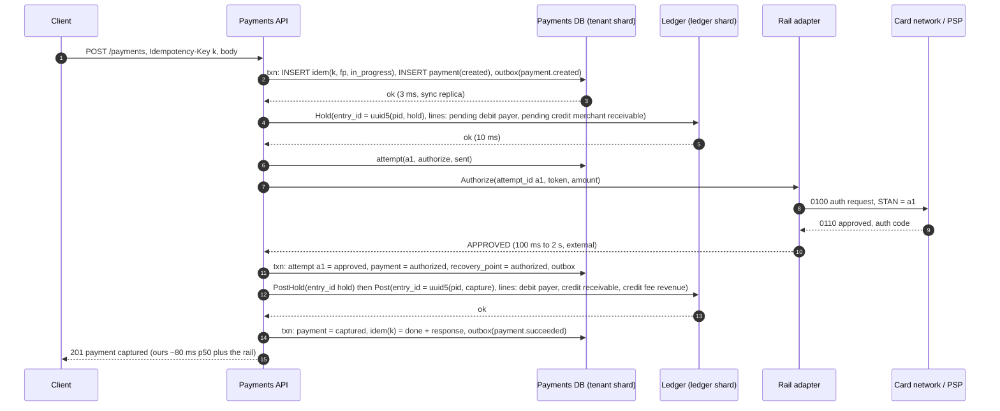
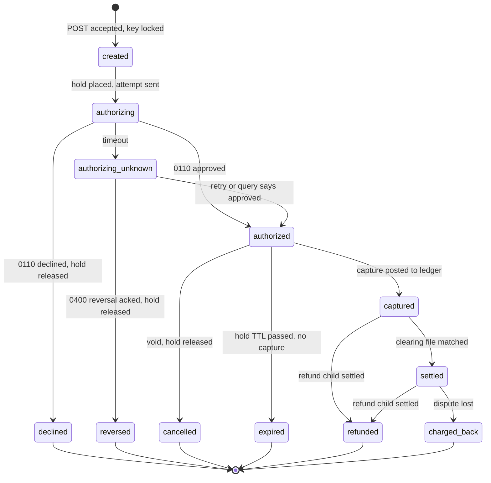
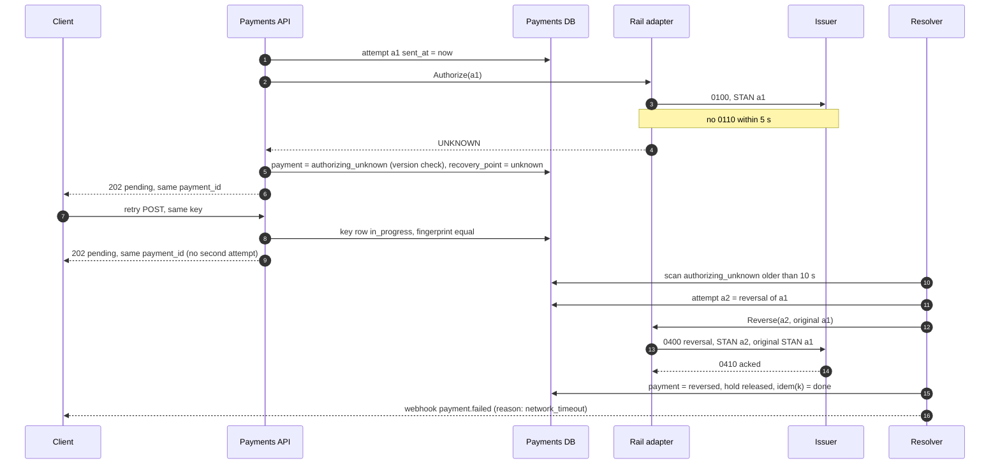
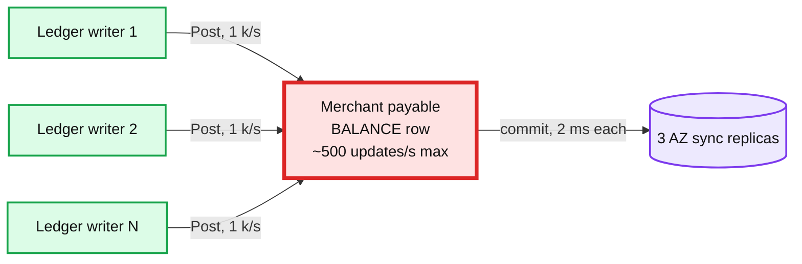
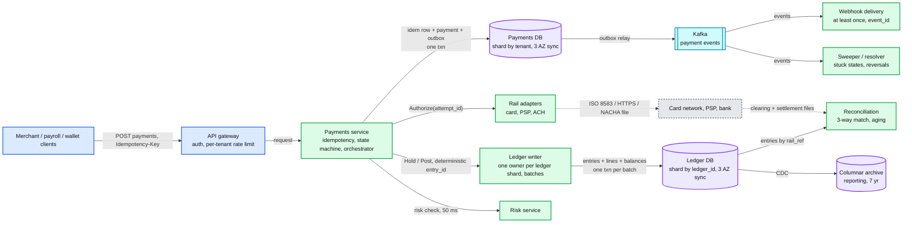
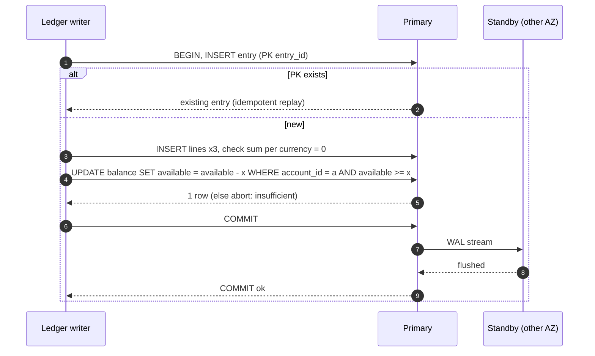
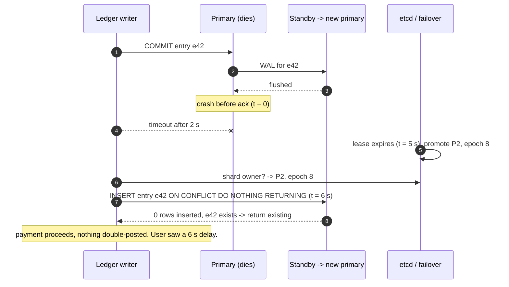

# HLD: Visa-scale payments + ledger + duplicate payment prevention

> One-line answer: a payment is a durable state machine driven by an orchestrator that retries at least once at every hop, and every hop is idempotent so the retries are harmless: the API dedups on a client `Idempotency-Key` plus a request fingerprint stored in the same database transaction as the payment; each call to the rail (issuer, PSP, ACH) carries a stable `attempt_id` and an unknown outcome is resolved by reversal or by the rail's own idempotency, never by guessing; every money movement is a balanced, immutable double-entry journal entry whose id is derived from `(payment_id, kind)` so a second posting is rejected by a unique index. The ledger is sharded by `ledger_id`, linearizable inside a shard (balance check and append are one transaction, synchronously replicated across 3 AZs), and only constrained accounts pay for a synchronous balance; everything else is append-only with lazily materialized balances. Reconciliation against the rail's clearing files is the last line of defence and runs to T+1.

Sources this follows: Stripe's idempotency docs and Brandur Leach's Postgres design (key, fingerprint, `locked_at`, recovery points, 24 h), Airbnb's "Avoiding double payments" (Orpheus, three phases, client-generated keys, master reads), Stripe's Ledger post (5 B events/day, clearing / timeliness / completeness), TigerBeetle's docs (single-writer state machine, 8,190 transfers per batch, two-phase pending transfers, 128-bit client ids), Modern Treasury (posted / pending / available, versioned balances), ISO 8583 (0100 / 0110 / 0400 / 0420, advice vs request, STIP), NACHA (three same-day windows, T+1, return codes), Visa's published capacity (65 k messages/s, 257.5 B processed transactions in FY2025, 4 data centers). Raw notes with links in [`research/`](research/). Diagrams D1 to D12 are in [`diagrams.md`](diagrams.md).

---

## 1. Understanding the problem

Interviewer's framing (Databricks: "design a payment auth system, Visa-style"; Rippling: "prevent duplicate payments under load"; Stripe: "design an idempotent double-entry ledger"): move money on behalf of a caller, record it, never do it twice, and do it at card-network volume. The signal they grade is not the boxes. It is: where can a duplicate enter, where is it removed, what is the dedup key, how long does it live, and what happens when a call's outcome is unknown. Then: what serializes at 65 k/s, and how do you know the ledger is right.

### 1.1 Functional requirements

Core:
1. **Create a payment exactly once from the caller's point of view.** `POST /payments` with an `Idempotency-Key`. A retry returns the original result. The same key with a different body is rejected. Two concurrent requests with the same key produce one payment.
2. **Drive the payment through the rail with a retry-safe state machine.** Authorize, capture (full or partial), refund, cancel, reverse. Each transition is idempotent against the rail. An unknown outcome is resolved, never guessed.
3. **Record every money movement in a double-entry ledger.** Debits equal credits per entry and per currency. Entries are immutable; corrections are new entries. Posted, pending, and available balances are derivable for any account, as of any point.
4. **Never let a constrained account go negative** (wallets, prepaid balances, payroll funding accounts) under concurrent payments.
5. **Reconcile** the ledger against the rail's clearing and settlement reports, surface every break, auto-remediate a rail-side duplicate with a refund, all by T+1.
6. **Query and notify.** Payment status and balances with read-your-writes for the caller. Webhooks at least once with an `event_id`.

Below the line (say it out loud):
- Card data. PAN never enters this system. A tokenization vault in PCI scope hands us a token. This keeps the whole design out of PCI CDE scope except the vault and the rail adapter.
- Fraud and risk. A synchronous call with a 50 ms budget on the auth path. Separate system, separate team.
- FX pricing, KYC / KYB, tax, disputes workflow UI, merchant dashboard. They read the ledger through an API; they never write it.
- Being the issuer. Whether the cardholder has funds is the issuer's decision.

### 1.2 Non-functional requirements

Ask for scale first. Numbers assumed:

| Dimension | Core target | Below the line |
|---|---|---|
| Scale | **10 k payments/s average, 65 k/s peak** (Visa's published capacity; their FY2025 average is about 8,200/s). About 3 journal entries and 8 ledger lines per payment lifecycle, so **80 k lines/s average, 520 k/s peak** | 650 k/s (§10.11) |
| Latency | Our part of authorization **p99 < 200 ms** (issuer round trip adds 100 ms to 2 s, outside our control). Ledger append p99 < 30 ms. Status read p99 < 50 ms | |
| Correctness | **Exactly-once effect per idempotency key. Zero unbalanced entries. Zero negative constrained balances. Every payment reconciled by T+1** | |
| Availability | Auth path **99.999%** (5.3 min/yr). Ledger writes 99.99%. Recon and reporting 99.9% | |
| Durability | **RPO 0** for committed entries: synchronous quorum across 3 AZs. RTO < 1 min in region, < 15 min cross region | |
| Consistency | **Linearizable inside a ledger shard.** Read-your-writes for the caller. Eventual for reporting, analytics, webhooks | cross-shard atomicity (§5.4 explains why we refuse it) |
| Audit | Any balance as of any entry sequence number. Append-only, hash-chained. 7 year retention | |
| Multi-tenant | Tenant A never reads or moves tenant B's money. `tenant_id` is part of every shard key | |

The correctness row and the scale row fight. Exactly-once and never-negative both want one serialization point per account. 65 k/s wants no serialization point at all. The whole design is about placing the serialization point where it is cheap (one shard, one row, one batch) and removing it everywhere it is not needed.

---

## 2. Back-of-envelope

```
Payments          = 10 k/s avg, 65 k/s peak. 864 M/day, 315 B/yr (Visa: 257.5 B in FY2025).

Ledger lines      = 8 per payment lifecycle (auth hold 2, capture 3 incl. fee, settlement 3)
                  = 80 k lines/s avg, 520 k/s peak
Line size         = ~160 B (entry_id 16, line_id 16, account_id 16, amount 8, currency 2,
                    side 1, seq 8, effective_at 8, posted_at 8, padding + index ~75)
Ledger bytes      = 80 k x 160 B = 12.8 MB/s = 1.1 TB/day = 400 TB/yr raw
                    x3 replicas in the OLTP tier, 90 days hot = 100 TB x 3 = 300 TB SSD
                    older than 90 days: columnar, 4x compression, object storage, 100 TB/yr

Idempotency keys  = 10 k/s x 86,400 s x 24 h retention = 864 M live keys
Key row           = ~500 B (key 64, fingerprint 32, state, response ~300, timestamps)
                  = 430 GB live. Sharded with the payment row, not a separate cache.
Retry rate        = 1 to 5% of requests -> 100 to 500 replays/s. Cheap.

Payment rows      = 864 M/day x ~1 KB = 864 GB/day. 90 days OLTP = 78 TB. Then archive.

Hot account       = one merchant at 5% of volume = 500 payments/s avg, 3,250/s peak.
                    Each payment touches its receivable account 3 times over its life.
                    = 1,500 to ~10 k updates/s on ONE account.
Single row limit  = one serialized read-modify-write per update, ~2 ms with a synchronous
                    replica ack -> ~500 updates/s per row. The hot merchant is 3x to 20x over.
                    THIS is the red node. §5.1.

Rail bandwidth    = 65 k/s x ~1 KB ISO 8583 x 2 directions = 130 MB/s. Not a bottleneck.
Auth budget       = API 5 ms + idempotency insert 3 ms + risk 50 ms + ledger hold 10 ms
                    + rail 100 ms to 2 s (external) + ledger post 10 ms + outbox 0 (same txn)
                    Ours: ~80 ms p50, < 200 ms p99. The issuer dominates and is not ours.

Recon             = 864 M payments/day matched against rail files. Batch. 100 M rows/hour
                    on a 100-node Spark job is ~10 min. Not a bottleneck. Aging is.
```

The numbers say: bandwidth and CPU are not the problem. The problems are (1) one row per hot account serializing thousands of writes per second, (2) an external call whose outcome we may never hear, and (3) 400 TB/yr that must remain queryable for audit.

---

## 3. The set-up

Product-style: an API used by merchants, a payroll engine, and internal wallet products. The Visa framing has the same entities with `issuer` and `acquirer` as the accounts and the switch as the orchestrator.

### 3.1 Core entities

- **Payment**: `(payment_id, tenant_id, amount_minor, currency, source, destination, status, version, rail_ref)`. The state machine. One per caller intent.
- **Idempotency record**: `(tenant_id, idempotency_key) -> (fingerprint, state, locked_at, recovery_point, response, payment_id, expires_at)`. Lives in the same shard as the payment. 24 h.
- **Attempt**: `(attempt_id, payment_id, kind, rail, rail_request_id, outcome, sent_at, resolved_at)`. One per call to a rail. `attempt_id` is the rail-level idempotency key (STAN + RRN for ISO 8583, `Idempotency-Key` for a PSP, trace number for ACH).
- **Account**: `(account_id, ledger_id, tenant_id, type, currency, normal_side, constrained)`. `constrained = true` means the balance must never go negative and is checked synchronously.
- **Journal entry**: `(entry_id, ledger_id, payment_id, kind, effective_at, posted_at, seq, prev_hash, hash)`. `entry_id = uuid5(payment_id, kind, attempt_id)`, so a replay collides on the primary key.
- **Line**: `(line_id, entry_id, account_id, side, amount_minor, currency)`. Two or more per entry. Sum of debits equals sum of credits per entry per currency, enforced before commit.
- **Balance**: `(account_id, seq, posted, pending, available)`. Materialized in the same transaction for constrained accounts; a periodic snapshot plus tail sum for the rest.
- **Ledger shard**: all accounts with the same `ledger_id` plus that ledger's clearing account. The unit of linearizability.
- **Settlement record**: `(rail, file_id, rail_ref, amount, currency, settled_at, matched_entry_id, break_status)`. The rail's view, for reconciliation.

### 3.2 API

| Call | Semantics |
|---|---|
| `POST /v1/payments` + `Idempotency-Key` | Body `{amount_minor, currency, source_token, destination_account, capture: auto \| manual, metadata}`. New key: 201 with the payment. Same key + same fingerprint: 200 with the original response. Same key + different fingerprint: 422 `idempotency_mismatch`. Key in progress: 409 `idempotency_in_use` + `Retry-After: 1` |
| `POST /v1/payments/{id}/capture` + key | `{amount_minor}` ≤ authorized. Idempotent per key. Partial allowed once, or multiple if the rail supports multi-capture |
| `POST /v1/payments/{id}/refund` + key | `{amount_minor}` ≤ captured minus refunded. Creates a `refund` child with its own state machine |
| `POST /v1/payments/{id}/cancel` + key | Voids an uncaptured authorization |
| `GET /v1/payments/{id}` | Read-your-writes for the creating caller (routed to the shard primary, or version-gated replica read) |
| `GET /v1/accounts/{id}/balance?as_of_seq=` | Posted, pending, available. As-of by sequence number, not timestamp |
| `GET /v1/accounts/{id}/entries?cursor=` | Append-only list, cursor is `seq` |
| Webhook `payment.*` | At least once, `event_id` = outbox row id, signed, 3 day retry with backoff |

Internal:

| Call | Semantics |
|---|---|
| `Ledger.Post(entry)` | One journal entry in one shard, one transaction. Rejects if unbalanced, if any constrained line would go negative, or if `entry_id` exists (returns the existing entry, so it is idempotent) |
| `Ledger.Hold(entry)` / `Ledger.Release(entry_id)` / `Ledger.PostHold(entry_id, amount)` | Two-phase: pending lines reserve available balance, then post or void. Holds expire (default 7 days) |
| `Rail.Authorize(attempt_id, ...)` and friends | Adapter per rail. Always carries `attempt_id`. Returns `APPROVED`, `DECLINED`, or `UNKNOWN` (never throws on timeout) |

### 3.3 Data model



Access patterns:
- `POST /payments`: insert idempotency record and payment in one transaction on the tenant shard (`tenant_id` hash). One round trip.
- `Ledger.Post`: look up the accounts' ledger shard, insert entry and lines, update constrained balances, in one transaction. One round trip per entry.
- Status read: point lookup by `payment_id`; the id encodes the shard.
- Balance as-of: read the latest snapshot at or before `seq`, sum lines after it. Bounded by snapshot interval.
- Reconciliation: bulk join of `SETTLEMENT_RECORD` and `JOURNAL_ENTRY` by `rail_ref`, offline.

Partition keys: **`tenant_id`** for payments and idempotency records (they must be in one transaction, and tenant isolation falls out of it). **`ledger_id`** for accounts, entries, lines, balances: everything that must be linearizable together. A journal entry never spans two ledgers; §5.4 explains what happens when the money must.

---

## 4. High-level design

### 4.1 Create a payment exactly once from the caller's point of view

**Bad: no key. Dedup by heuristics.**
- Approach: reject a second charge with the same card, amount, and merchant within 60 s.
- Why it breaks: a legitimate second coffee at the same kiosk is rejected; a retry after 61 s goes through twice. Airbnb ran a version of this before Orpheus. There is no correct window.

**Good: client key, checked in a cache.**
- Approach: client sends a UUID. API does `SETNX key` in Redis, processes, then stores the response with a 24 h TTL. Replay returns the cached response.
- Cost: Redis is not in the same transaction as the payment. Pod dies after the payment is written and before the response is cached: the retry sees no key and charges again. Redis failover loses keys. Cache eviction under memory pressure loses keys. Every one of those is a duplicate charge. The key must be as durable as the payment.

**Great: key row in the same database transaction as the payment, with fingerprint, lock, and recovery point.**
- Approach (Stripe, Brandur, Airbnb): `INSERT idempotency_record (tenant_id, key, fingerprint = sha256(canonical body), state = 'in_progress', locked_at = now())`. On unique violation: read the row. Fingerprint differs: 422. `in_progress` and `locked_at` fresh: 409 with `Retry-After`. `in_progress` and `locked_at` stale (> 30 s): take over from `recovery_point`. `done`: return stored response. The payment insert and the first state change happen in the same transaction as the key row. Each later phase (rail call done, ledger posted, finished) advances `recovery_point` in its own transaction, so a crash resumes at the last phase rather than restarting.
- Challenges: the key row must live on the tenant's shard (it does, same partition key). Two API pods racing for the same key are serialized by the unique index, not by a distributed lock. The rail call in the middle is not transactional; that is §4.2. Keys expire at 24 h, so a retry on day 2 is a new payment; clients are told this.





### 4.2 Drive the payment through the rail with a retry-safe state machine

**Bad: synchronous call, timeout means failure.**
- Approach: call the PSP, on timeout return 500 to the client and mark the payment failed.
- Why it breaks: a timeout is not a "no". The PSP may have charged the card. The client retries with a new key (we told them it failed) and the card is charged twice. This is the single most common real-world duplicate.

**Good: retry the same call with the same rail idempotency key, then poll.**
- Approach: on timeout, retry with the same PSP `Idempotency-Key` up to N times with backoff; if still unknown, `GET` the charge by our reference. Stripe and most PSPs honour this.
- Cost: retry storms on a slow PSP amplify its outage. Some rails have no query API (an ISO 8583 issuer, an ACH file). And "still unknown after N retries" needs a place to live.

**Great: one `attempt_id` per rail call, a durable state machine, reversal on unknown, reconciliation to close the loop.**
- Approach: every rail call is an `ATTEMPT` row written before the call is made (`sent_at`), with `attempt_id` as the rail-level idempotency key. The adapter returns `APPROVED`, `DECLINED`, or `UNKNOWN`; it never throws. On `UNKNOWN` the payment moves to `authorizing_unknown` and a resolver (a) retries the same attempt for up to 10 s on rails that support it, (b) sends a reversal (ISO 8583 `0400`, repeated until `0410` acknowledged; or a PSP cancel) for rails that do not, which is safe because reversing a charge that never happened is a no-op, and (c) leaves a marker that reconciliation must close within T+1. The client sees `pending`, not `failed`, and its retry with the same key returns the same pending payment. A sweeper walks every non-terminal payment older than its state's deadline and drives it forward or reverses it. State transitions are conditional updates on `version`, so two workers cannot both advance the same payment.
- Challenges: the resolver's reversal itself can time out; it is an attempt with its own id and is repeated, which the ISO 8583 advice semantics allow. A rail with neither query nor reversal (ACH) resolves only through returns and settlement, so its "unknown" window is days and the product must show `pending` for that long. See [`deep-dives/rails-timeouts-and-unknown-outcome.md`](deep-dives/rails-timeouts-and-unknown-outcome.md).





### 4.3 Record every money movement in a balanced, immutable ledger

**Bad: a `balance` column per account, updated in place.**
- Approach: `UPDATE accounts SET balance = balance - 100 WHERE id = payer` and `+ 100` on the merchant.
- Why it breaks: no history, so "why is the balance 4,317" is unanswerable. A crash between the two updates loses money. A bug that updates one side leaves the books unbalanced and nobody notices until finance closes the month. Auditors ask for the entries; there are none.

**Good: journal entries and lines, balance updated in the same transaction.**
- Approach: every movement is an entry with ≥ 2 lines that sum to zero per currency, checked before commit. Balance row updated in the same transaction. Entries never updated, only reversed by a new entry.
- Cost: every account pays for a synchronous balance update, including the platform's fee revenue account that every payment touches. That account becomes the hot row at 65 k/s. And a journal entry spanning two accounts on two shards needs a cross-shard transaction.

**Great: append-only lines with sequence numbers, balances materialized synchronously only for constrained accounts, deterministic entry ids, one shard per entry, hash-chained.**
- Approach: `LINE` rows are the source of truth. `BALANCE` is a materialization: for `constrained = true` accounts it is updated in the same transaction (so "never negative" is a transactional check); for everything else it is a snapshot every N entries plus a tail sum on read. `entry_id = uuid5(payment_id, kind, attempt_id)` so a replayed `Post` hits the primary key and returns the existing entry: the ledger is idempotent without a separate dedup table. Each entry stores `prev_hash` and `hash` per ledger so the chain is tamper-evident (Uber LedgerStore, QLDB). Every entry is inside one `ledger_id`; the money that must cross ledgers goes through per-ledger clearing accounts (§5.4).
- Challenges: the tail sum on read costs O(lines since snapshot); snapshot every 1,000 lines or 60 s. The hash chain serializes entries within a ledger, which is fine because the ledger is already the linearizable unit. Two-phase holds add a `pending` line state and an expiry job. See [`deep-dives/ledger-and-double-entry.md`](deep-dives/ledger-and-double-entry.md).

Worked example, $100.00 card payment, 2.9% + 30c fee, auto capture:

| Entry | Line | Account | Side | Amount |
|---|---|---|---|---|
| `hold` (pending) | 1 | Card receivable (asset, from acquirer) | debit | 10,000 |
| | 2 | Merchant payable (liability) | credit | 10,000 |
| `capture` (posts the hold, adds fee) | 1 | Card receivable | debit | 10,000 |
| | 2 | Merchant payable | credit | 9,680 |
| | 3 | Fee revenue | credit | 320 |
| `settlement` (T+1, from clearing file) | 1 | Bank cash (asset) | debit | 10,000 |
| | 2 | Card receivable | credit | 10,000 |
| `payout` (T+2, to merchant bank) | 1 | Merchant payable | debit | 9,680 |
| | 2 | Bank cash | credit | 9,680 |

Every entry sums to zero. The merchant payable account is the one the merchant sees as "balance". Fee revenue is touched by every payment and is not constrained, so it has no synchronous balance row. Card receivable is the account that reconciliation checks against the clearing file.

### 4.4 Never let a constrained account go negative under concurrency

**Bad: read balance, check, write.**
- Two concurrent $60 payments from a $100 wallet both read 100, both pass, wallet ends at -20.

**Good: lock the row or use a conditional update.**
- `SELECT ... FOR UPDATE` on the balance row inside the entry transaction, or `UPDATE balance SET available = available - 60 WHERE account_id = ? AND available >= 60` and check the row count. Serializable isolation (Postgres SSI) also works and fails the loser with `40001`, which the caller retries.
- Cost: serializes all writes to that account. Fine for a wallet (one user, tens of writes/s). Not fine for a hot constrained account, which is §5.1.

**Great: two-phase hold on `available`, post or void later.**
- Approach (TigerBeetle pending transfers, card authorization holds): the `hold` entry reduces `available` immediately under the row lock but does not touch `posted`. Capture posts it. Cancel or expiry voids it. The check is `available >= amount` at hold time, once, and the capture never fails for funds because the money is already reserved. Holds expire (7 days default, scheme-specific) so an orphaned hold cannot freeze funds forever.
- Challenges: pending lines must be excluded from `posted` and included in `available`; the expiry sweeper must be idempotent (void is an entry with a deterministic id too).

### 4.5 Reconcile against the rail and surface every break by T+1

**Bad: trust the ledger.**
- If the rail charged twice and we recorded once, nobody finds out until a cardholder complains.

**Good: nightly job, compare totals.**
- Sum of captures per day equals the clearing file total. Catches gross errors, not a duplicate that offsets a miss.

**Great: row-level three-way match with aging and auto-remediation.**
- Approach: ingest the rail's clearing and settlement files into `SETTLEMENT_RECORD`. Match each row to a `JOURNAL_ENTRY` by `rail_ref` (RRN, PSP charge id, ACH trace). Classify: matched, in ledger not in rail (aged: rail late, or our capture never reached them), in rail not in ledger (a duplicate or a lost write, page), amount mismatch (FX, fees, partial). A rail row with an `attempt_id` we sent but marked `reversed` is a duplicate charge: auto-refund with a deterministic refund id and page. Every break has an age and an owner; unresolved > 24 h pages finance eng. Also run the internal invariants continuously: sum of all lines per ledger = 0, clearing accounts across ledgers net to 0, hash chain intact.
- Challenges: rail files arrive late or twice (dedup by `file_id`). Cutoff windows: a capture at 23:59:59 lands in tomorrow's file; matching is by `rail_ref`, not by day, and aging tolerates 48 h before it is a break. See [`deep-dives/reconciliation-and-audit.md`](deep-dives/reconciliation-and-audit.md).

### 4.6 Query with read-your-writes and notify at least once

- Status read after create: route by `payment_id` to the shard primary for 5 s after a write (sticky), or send the client its `version` and let replicas serve reads with `version >= requested` else fall through to primary. The second is cheaper at scale.
- Balance read: from the materialized row (constrained) or snapshot + tail (others). Both are consistent with the shard's committed state because they are on the same shard.
- Webhooks: the `OUTBOX_EVENT` row is written in the same transaction as the state change. A relay publishes to Kafka (idempotent producer) and a delivery service posts to the merchant with `event_id` and a signature, retrying for 3 days. Merchants dedup on `event_id`. This is at-least-once by design; we say so in the docs.

---

## 5. Deep dives

### 5.1 "One merchant is 5% of volume. Its account gets thousands of updates a second. What breaks?"

Walk the write path: API pod (stateless, scales), payments DB shard (by tenant, one big tenant is one shard but a payment row is a fresh row each time, no contention), ledger shard (by `ledger_id`, one big merchant is one ledger), and inside it **one balance row** if the merchant's payable account is constrained, or **one hash-chain head** if we chain per ledger. The balance row is the red node.



**Bad: one balance row, row lock per entry.**
- ~500 updates/s ceiling (one serialized read-modify-write with a 2 ms synchronous commit). The merchant needs 1,500 avg, 10 k peak. Lock wait climbs, `deadlock_timeout` (1 s) starts firing, p99 for every payment to that merchant goes to seconds.

**Good: sub-accounts.**
- Split the merchant payable into 64 sub-accounts. Each entry credits `sub = hash(payment_id) % 64`. Balance is the sum. Debits (payouts) that need funds pick a sub-account with enough, or drain several in one entry.
- Cost: reading the balance is 64 rows. Debits can fail on one sub-account while the total is sufficient, which needs a rebalancing entry. Every consumer of the account must know about the split.

**Great: do not keep a synchronous balance for accounts that do not need one, and batch the ones that do.**
- Push back on the textbook answer: the merchant payable does not need a synchronous balance at all. Nothing is decided at payment time by "does the merchant have enough". Mark it `constrained = false`: entries are pure inserts (no hot row), balance = last snapshot + tail sum, refreshed every 1,000 lines or 60 s. Inserts into an append-only table with a sequence do not contend on a row. The hash chain per ledger still serializes, so make the chain per ledger *segment* (chain within a writer's batch, link batches by sequence), or compute the chain asynchronously in the snapshot job; tamper evidence does not need to be synchronous.
- For accounts that are truly constrained and hot (a platform-level prefunded float, a payroll funding account paying 50 k employees at once), use a **single-writer batch** per ledger shard: one writer process owns the shard, pulls entries from a queue, applies them in memory in batches of up to a few thousand, checks each constrained balance in memory, and commits one transaction per batch. This is TigerBeetle's design (8,190 transfers per batch, one state machine per cluster, VSR for replication) and it turns contention into throughput: one commit per batch, 10 to 50 batches/s, 100 k+ entries/s per shard. The cost is ownership: exactly one writer per shard, with a lease and an epoch, which is the same problem as the file system's chunk leases. See [`deep-dives/hot-accounts-and-contention.md`](deep-dives/hot-accounts-and-contention.md).
- New problem: a single-writer shard is a unit of failure; its failover is 5 to 10 s of unavailability for that ledger (§5.3). And "balance = snapshot + tail" means a balance read is not a point lookup; cap the tail by forcing a snapshot when it exceeds 1,000 lines.

### 5.2 "Your p99 is 200 ms but the issuer takes up to 2 seconds. How?"

- Our budget excludes the rail. Say that first. What we control: no synchronous fan-out on the hot path except idempotency insert, hold, rail, post. Risk scoring runs in parallel with the hold, with a 50 ms deadline and a fail-open-to-rules default.
- Connection handling to the rail: persistent connections, per-rail concurrency limit sized to `rail_p99 x peak_qps` (2 s x 65 k = 130 k in flight; that is why the adapter is async I/O, not a thread per call).
- Push back on the textbook answer: **no hedged requests to the rail.** Hedging is the standard tail-latency trick and it is exactly how you charge a card twice. Retry only with the same `attempt_id`, only after the rail's timeout, and only on rails that dedup on it.
- Timeouts: rail call deadline 5 s (network rules are similar). Client-facing: return `202 pending` at 3 s rather than holding the connection; the client polls or gets a webhook. The p99 target is for the returned response, not for the payment reaching a terminal state.

### 5.3 "RPO 0 and 99.999%. The ledger primary dies after the commit, before the ack."

- Storage: Postgres per ledger shard set, `synchronous_commit = on`, `synchronous_standby_names = 'ANY 1 (az2, az3)'`. A commit is acked only when the WAL is on the primary and one other AZ. RPO 0 for acked commits; a crashed primary's un-acked commits may or may not exist on the replica.
- The caller (the ledger writer) got a timeout, not an error. It retries `Post(entry_id)` against the new primary after failover (10 to 30 s with a managed failover, 5 s with a Patroni-style lease). The `entry_id` is deterministic: if the commit made it, the retry returns the existing entry; if not, it is applied now. The unknown-commit problem is solved by the same idempotency the API layer uses. No special recovery code.
- Failover fencing: the old primary may still be alive and think it is primary (a GC pause, a partition). Writers carry the shard epoch from the coordination service; the new primary rejects writes with an old epoch, and the old primary is demoted by the same lease expiry. Without this, two primaries accept entries for one ledger, and the invariant "one sequence per ledger" breaks.
- 99.999% on the auth path is 5 minutes a year. A 30 s failover per shard per quarter on 100 shards is already 200 minutes of *shard* unavailability but only 2 minutes of *payment* unavailability if each shard is 1% of traffic. Say this: the SLO is measured on payments, and shard isolation is what makes it reachable. See [`deep-dives/durability-and-multi-region.md`](deep-dives/durability-and-multi-region.md).

### 5.4 "Linearizable inside a shard. A payment touches two ledgers. Now what?"

- Most entries do not cross ledgers: payer card receivable, merchant payable, and fee revenue all live in the merchant's ledger (the receivable and revenue accounts are per-ledger sub-accounts of platform-wide accounts, summed for reporting). The design deliberately puts the accounts that transact together in one ledger.
- When money must cross ledgers (a wallet-to-wallet transfer between two tenants, a payout from a merchant ledger to the treasury ledger): two single-ledger entries linked by a `transfer_id`, through each ledger's **clearing account**. Ledger A: debit sender, credit `clearing_A`. Ledger B: debit `clearing_B`, credit receiver. Each entry is atomic in its shard. The orchestrator writes A, then B, with deterministic ids, and retries until both exist. The invariant "sum of all clearing accounts across ledgers = 0" is checked by reconciliation; a non-zero sum is a transfer whose second half has not landed yet (in flight, aged) or a bug (page).
- Consistency per edge: inside a ledger, linearizable. Across ledgers, the transfer is eventually consistent with a bound (the orchestrator's retry deadline, 60 s) and the sender sees `pending` until then. This is how banks have always worked (nostro / vostro, suspense accounts); we are not inventing it.
- What we refused: a global serializable database (Spanner, CockroachDB) that makes cross-ledger entries atomic. It is a legitimate "Good": simpler code, and Spanner's external consistency is exactly the guarantee money wants. We refused it because (a) commit latency is 10 ms+ and cross-region 100 ms+ on every entry, (b) the hot-account problem does not go away, it just moves to a hotter row with a slower lock, and (c) the clearing-account pattern is required anyway for the external rails, which are not in any database of ours.

### 5.5 "How do you know the ledger is right?"

- Three layers, from cheap to expensive: (1) per-commit invariant, every entry sums to zero per currency, enforced in the writer and by a database constraint on a per-entry aggregate; (2) continuous internal checks every 5 min per ledger: sum of all lines = 0, materialized balance = snapshot + tail, hash chain verifies, clearing accounts net to 0; (3) external three-way reconciliation, row level, T+1, against the rail's clearing file and the bank statement.
- Stripe's Ledger names the three metrics we adopt: **clearing** (accounts that should be zero at steady state are zero), **timeliness** (delay from event to ledger), **completeness** (every producer id has a ledger entry). Stripe runs this over 5 B events/day and verifies 99.99% of dollar volume within 4 days.
- Balance as of last Tuesday 14:00: entries are ordered by `seq` within a ledger, and `posted_at` is a server timestamp. Find the last `seq` with `posted_at <= T`, read the snapshot at or before it, add the tail. Deterministic because entries are immutable and sequence-numbered; timestamps are for humans, sequences are for correctness.

### 5.6 "A region goes dark. What happens to in-flight payments?"

- Each ledger shard and each tenant shard has a **home region**, chosen by tenant residency. Synchronous replication is within the home region (3 AZs). Cross-region replication is asynchronous (lag 100 ms to 1 s) to a warm standby.
- Region loss: promote the standby with an epoch bump. RPO is the async lag: up to 1 s of acked entries may be missing. That is the one place we knowingly break RPO 0, and the mitigation is that every missing entry is either (a) re-posted by the orchestrator's retry (deterministic ids), (b) surfaced by reconciliation against the rail (the rail has the truth), or (c) an entry the rail never saw either, which is a lost auth the cardholder will retry. Say the trade-off: synchronous cross-region commit would make RPO 0 but add 60 to 100 ms to every entry and make the region pair a single failure domain for latency.
- In-flight payments at the moment of failover are in `authorizing` or `authorizing_unknown`. The sweeper in the new region finds them by state and deadline and reverses whatever it cannot confirm. Card networks give us up to the auth's hold TTL to do this.
- Visa itself runs 4 synchronized data centers; the framing there is active-active with the switch stateless and the ledger being end-of-day netting. Our platform framing keeps a home region because a per-account linearizable ledger cannot be active-active without a global consensus round per entry. See [`deep-dives/durability-and-multi-region.md`](deep-dives/durability-and-multi-region.md).

### 5.7 "Tenant A must never see or move tenant B's money."

- `tenant_id` is in every partition key and every row. The API authenticates to a tenant and the data layer filters by it; there is no query path that omits it. Ledgers belong to exactly one tenant. Cross-tenant movement is a clearing-account transfer that both sides' ledgers record, so each tenant's books show only their side.
- Noisy tenant: one tenant's burst cannot starve others because ledgers are separate shards and the API rate limits per tenant (see [`../network-throttling/`](../network-throttling/)).

---

## 6. Final design



What each "Great" pick contributes:
- Idempotency row in the payments transaction (§4.1): duplicates cannot enter at the API.
- `attempt_id` per rail call, reversal on unknown, sweeper (§4.2): duplicates cannot enter at the rail, and unknowns are resolved.
- Deterministic `entry_id`, append-only lines, constrained-only balances, single-writer batches (§4.3, §5.1): duplicates cannot enter the ledger, and the hot row is gone.
- Two-phase holds (§4.4): never negative without a lock at capture time.
- Outbox (§4.6): events are exactly as durable as the state change they describe.
- Three-way reconciliation (§4.5, §5.5): whatever got past all of the above is found by T+1.

Zoom-ins: [`diagrams.md`](diagrams.md) D2 (data flow with sizes), D9 (topology), D11 (failure map), D12 (migration).

---

## 7. Trade-offs

| Decision | Option A | Option B | Chose | Why |
|---|---|---|---|---|
| Where the idempotency key lives | Redis with TTL | Row in the payments DB, same txn | **B** | A key that can be lost is a duplicate charge. 430 GB of key rows is cheap next to one double charge |
| Key TTL | Forever | 24 h | **24 h** (Stripe's number) | Retries happen within seconds to hours. Forever means 315 B rows/yr of dead keys |
| Timeout handling at the rail | Retry with a fresh id | Same `attempt_id`, then reversal | **B** | A fresh id is a second charge by construction |
| Ledger balance | Column updated in place | Append-only lines, balance materialized only when constrained | **B** | Removes the hot row for 95% of accounts; keeps the transactional check where money can go negative |
| Hot constrained account | Row lock | Sub-accounts | Single-writer batch per shard | Sub-accounts leak into every reader. Batching turns contention into throughput. Cost: an owner lease per shard |
| Cross-ledger atomicity | Global serializable DB (Spanner) | Clearing accounts + orchestrated pair of entries | **B** | Rails are outside any DB, so the pattern is needed anyway. Spanner adds 10 to 100 ms per entry and does not fix the hot row |
| Cross-region durability | Sync commit across regions (RPO 0) | Sync in region, async across (RPO ~1 s) | **B** | 60 to 100 ms per entry is a 50% latency tax. The rail is the source of truth for the 1 s gap |
| Orchestration | Workflow engine (Temporal-style) | State in the payment row + sweeper | **B** | Fewer moving parts, the state is queryable with SQL, and every transition is a conditional update anyway. Revisit at 10x or when flows exceed ~10 steps |
| Events | Dual write to Kafka | Transactional outbox | **B** | Dual write loses or duplicates events on every crash. The outbox relay is 200 lines |
| Webhooks | Exactly once | At least once with `event_id` | **B** | Exactly once to a third party is not achievable. Say it in the docs |
| Amounts | Decimal | Integer minor units + ISO 4217 exponent | **B** | No float, no ambiguous rounding. JPY has 0 decimals, BHD has 3 |
| What we refused to build | Fraud, PAN storage, FX, disputes UI, subscriptions | | Refused | Each is a team. PAN in particular would put every box in PCI scope |

---

## 8. Staff-level notes

- **Failure modes and blast radius.** A tenant shard down: that tenant's new payments fail closed (503, `Retry-After`), other tenants unaffected, in-flight payments resolved by the sweeper after failover. A ledger shard down: holds and posts for that ledger fail, the orchestrator holds the payment in `created` or `authorized` and retries; nothing is charged without a hold. Rail down: fail closed for that rail, `202 pending` is not offered because an auth cannot be queued (the cardholder is waiting); ACH is queued by nature. Kafka down: outbox rows accumulate, webhooks and sweeps lag, money movement is unaffected. Recon late: no customer impact, a page at 24 h. The blast radius of a bug is bounded by the invariant checks: an unbalanced entry is rejected at commit; a balance drift is caught in 5 min; a rail-side duplicate in 24 h.
- **Migration from the existing system** (typically: a `balance` column plus a `transactions` table, no idempotency). Phase 1: add the idempotency layer in front of the old write path, shadow mode (log would-be duplicates). Phase 2: dual-write journal entries from the old transactions, backfill history into the ledger, run the invariant checks and compare old balances to derived balances daily. Phase 3: switch reads (balance API) to the ledger behind a flag per tenant. Phase 4: switch writes to the new orchestrator per tenant, keep dual-writing the old table for a quarter. Rollback at every phase is a flag flip; the old table is never dropped until finance signs off on a full quarter close from the new ledger. Stripe's four-phase online migration is the reference.
- **Operability.** SLOs: auth path availability 99.999% measured on payments not shards; our p99 < 200 ms; reconciliation breaks aged > 24 h = 0. Pages at 3am: `unbalanced_entry_rejected > 0` (a bug is live), `constrained_balance_negative > 0` (an invariant broke), `rail_unknown_rate > 1%` for 5 min (the rail is degrading and the reversal queue is growing), `sweeper_backlog_age > 60 s`, `ledger_replica_lag > 5 s`, `hot_row_lock_wait_p99 > 100 ms`. Pages in the morning: recon breaks aged > 24 h, duplicate detected by recon (this one also opens an incident because someone was charged twice).
- **Cost.** Ledger OLTP tier: 300 TB SSD replicated for 90 days hot, roughly $30 k to 60 k/month on cloud block storage; archive 100 TB/yr on object storage at $2 k/month. Payments DB similar. Rail fees dominate everything (interchange is 1 to 3% of volume); our infra is a rounding error against that, which is why correctness beats cost in every trade-off above. Engineering: the ledger is a platform team's product; budget 6 to 8 engineers for a year to reach parity with the old balance table, based on Uber's Gulfstream (40 engineers, 2 years) scaled down.
- **Team boundaries.** Payments API and orchestrator (one team: idempotency, state machine, sweeper). Ledger (one team: the writer, invariants, snapshots, audit API; treat it as an internal product with an SLA). Rail adapters (one team per rail family: card, PSP, ACH; they own the unknown-outcome semantics of their rail). Reconciliation and finance engineering (one team, sits with finance). Risk (separate). The clearing-account convention and the deterministic id scheme are the contracts between them; write them down before the code.

---

## 9. What is expected at each level

**Mid (80/20 breadth/depth).** Draws API, payment service, PSP, database, and a Kafka for notifications. Knows idempotency keys exist and puts them in Redis. Says "use transactions" for the ledger. Asked about a timeout, says "retry". Asked about the ledger being right, says "logs".

**Senior (60/40).** Puts the idempotency key in the database with the payment and explains why Redis loses. Describes the payment state machine and the PSP idempotency key. Draws double-entry entries with a balanced example, and knows posted vs pending. Identifies the hot merchant row and offers sub-accounts. Mentions reconciliation as a nightly job. States strong consistency for the ledger, eventual for reporting.

**Staff+ (40/60).** Says unprompted: exactly-once is at-least-once plus idempotency at every hop, and names the dedup key at each hop and its lifetime. Returns `UNKNOWN`, not an exception, from the rail adapter, and reverses rather than guesses. Refuses the synchronous balance for unconstrained accounts and explains the single-writer batch for the constrained hot ones. Refuses cross-shard atomicity in favour of clearing accounts and says why Spanner would not have fixed the hot row. Names the migration phases and the rollback flag. Names the 3am pages. Says what the design does not do (PAN, fraud, FX) and which team owns each seam. Talks about RPO across regions as a 1 s trade and where the rail is the source of truth for that gap.

---

## 10. Nitty-gritty (past interview scope)

### 10.1 Internals of each chosen technology

**Postgres as the ledger shard store.** WAL is appended and fsynced before commit returns; `synchronous_commit = on` with `synchronous_standby_names = 'ANY 1 (r1, r2)'` blocks the commit until one standby has the WAL on disk, giving RPO 0 across AZs at a cost of one AZ round trip (~1 ms) per commit. Row locks: `SELECT ... FOR UPDATE` takes a tuple lock; concurrent updaters queue on it; the queue is the hot-row ceiling. SSI (`SERIALIZABLE`) tracks read/write dependencies and aborts one transaction of a dangerous cycle with `40001`; cheaper than locks under low contention, worse under high. Unique index violation is the idempotency mechanism: an `INSERT ... ON CONFLICT DO NOTHING RETURNING` tells the writer whether it or a prior attempt created the row.



**Single-writer batch (TigerBeetle-style) for hot constrained ledgers.** One process owns a shard under a lease with an epoch. Clients submit entries to it; it accumulates up to 8 k entries or 10 ms, applies them to in-memory balances in order, rejects any that would violate an invariant, writes one batch to the store (one commit), then acks each client. Replication in TigerBeetle is Viewstamped Replication across 3 to 6 replicas, deterministic state machine, so replicas apply the same batch in the same order; the same shape as a Raft log. Throughput is one commit per batch instead of per entry; latency is one batch interval plus commit.

**Kafka for the outbox stream.** The relay reads `OUTBOX_EVENT` rows in id order and produces with `enable.idempotence = true` (producer id + sequence number, so a producer retry cannot duplicate within a partition, `max.in.flight ≤ 5`) and `acks = all`, then marks rows published. A relay crash re-produces some rows; the idempotent producer dedups within its session, and consumers dedup on `event_id` across sessions. Partition by `payment_id` so a payment's events are ordered.

**ISO 8583 on the card rail.** Message type indicator: `0100` auth request, `0110` auth response, `0120` auth advice (informational, no reply needed), `0400` reversal request, `0410` reversal response, `0420` reversal advice. Fields that matter to us: STAN (systems trace audit number, field 11) and RRN (retrieval reference number, field 37) identify the attempt; a reversal carries the original STAN and amount. Requests are end-to-end with a timeout; advices are point-to-point and repeated until acknowledged, which is what makes reversal safe to retry. STIP: the network answers for an unreachable issuer based on limits the issuer pre-set, and forwards the advice later.

**ACH.** A batch file per window (three same-day windows: 10:30, 14:45, 16:45 ET, plus next-day), each entry with a trace number (our `attempt_id`). No synchronous outcome. Settlement T+1 at the latest for same-day. Returns (`R01` insufficient funds, `R02` account closed, `R03` no account, ...) arrive for up to 2 banking days, 60 days for unauthorized consumer debits. The "unknown" window is days, so the ledger holds ACH movements as pending until settlement, and payroll products show "processing".

### 10.2 Configuration knobs that matter

| Component | Knob | Value | Why |
|---|---|---|---|
| API | Idempotency key TTL | 24 h | Stripe's number; covers every realistic retry |
| API | `locked_at` staleness before takeover | 30 s | Longer than the rail deadline (5 s) plus ledger post; shorter than a client's patience |
| Rail adapter | Auth deadline | 5 s | Beyond it the network will time out anyway; then reverse |
| Resolver | Unknown retry window before reversal | 10 s, then reverse | Bounded cardholder wait; reversal is safe to repeat |
| Ledger | Hold expiry | 7 d default, per-rail override | Scheme rules; orphaned holds must not freeze funds |
| Ledger | Snapshot interval | 1,000 lines or 60 s | Caps the tail sum on balance reads |
| Ledger writer | Batch size / interval | 4,096 entries / 10 ms | One commit per batch; p50 added latency 5 ms |
| Postgres | `synchronous_standby_names` | `ANY 1 (az2, az3)` | RPO 0 across AZs, survive one standby loss |
| Postgres | `deadlock_timeout`, `lock_timeout` | 1 s, 200 ms | Fail fast on the hot row instead of queueing forever |
| Kafka producer | `enable.idempotence`, `acks` | `true`, `all` | No duplicate events within a producer session |
| Webhooks | Retry schedule | exponential to 3 d | Merchant endpoints go down for a weekend |
| Recon | Break aging before page | 24 h (card), 3 banking days (ACH) | Matches the rail's own timing |

### 10.3 Capacity math per component

| Component | Unit load at 65 k/s peak | Per node | Nodes | Headroom |
|---|---|---|---|---|
| API pods | 65 k req/s + 3 k replays/s | 2 k req/s (async, 100 ms hold on rail) | 40 | 3x |
| Payments DB | 65 k inserts + 130 k updates/s, 1 KB rows | 10 k txn/s per primary (sync replica) | 20 shard sets x 3 | 3x |
| Ledger DB | 520 k lines/s, 195 k entries/s | 5 k entry txn/s per primary unbatched, 100 k/s batched | 40 shard sets x 3 (batched writers on the top 5%) | 2x |
| Ledger writer | 195 k entries/s | 100 k/s per single-writer shard | 1 per hot shard, ~10 hot | 5x |
| Rail adapter | 65 k calls/s, 2 s p99 = 130 k in flight | 20 k connections | 10 | 3x |
| Kafka | 200 k events/s x 1 KB = 200 MB/s | 50 MB/s per broker | 12 (RF 3) | 3x |
| Recon | 864 M rows/day join | 100 M rows/min on 50 executors | batch | not latency-bound |
| Idempotency rows | 864 M live, 430 GB | inside the payments shards | | included |

Closest to its limit: the ledger DB on unbatched writes. That is why the top 5% of ledgers by volume get a single-writer batch, and why the fee revenue account is not constrained.

### 10.4 Failure timeline

**Ledger primary dies after commit, before ack (§5.3).**



**Rail timeout during a traffic peak (§4.2).** t = 0 auth sent; t = 5 s adapter returns `UNKNOWN`, payment `authorizing_unknown`, client gets `202 pending`; t = 5 to 15 s resolver retries the same attempt on rails that support it; t = 15 s reversal `0400` sent, repeated every 2 s until `0410`; t = 17 s payment `reversed`, hold released, webhook `payment.failed`; T+1 recon confirms the rail has no capture for the attempt, or finds one and auto-refunds and pages. On-call sees `rail_unknown_rate` climb at t = 5 s; the page fires at 5 min sustained.

**Region loss (§5.6).** t = 0 home region dark; t = 30 s health checks fail, traffic manager fails over the API; t = 60 s ledger and payment shards promoted from async standbys, epochs bumped, up to 1 s of acked writes missing; t = 60 to 120 s sweeper walks non-terminal payments, reverses unknowns; t = 2 min to T+1 orchestrator retries re-post any missing entries by deterministic id; T+1 recon finds anything the retries did not. RTO 2 min, RPO 1 s, both stated in the runbook and in the customer-facing SLA.

### 10.5 Exactly-once and idempotency end to end

| Hop | Where a duplicate enters | Dedup key | Lives | On retry |
|---|---|---|---|---|
| Client → API | client retry, LB retry, double click | `(tenant_id, Idempotency-Key)` + fingerprint | 24 h | stored response, or 409 while in flight |
| API → payments DB | pod crash after commit before response | same row, `recovery_point` | 24 h | resume from the phase reached |
| API → ledger | orchestrator retry, unknown commit | `entry_id = uuid5(payment_id, kind, attempt_id)` | forever (it is the ledger) | existing entry returned |
| API → rail | timeout, adapter retry | `attempt_id` as STAN/RRN, PSP key, ACH trace | rail-defined (PSP 24 h, network per-day STAN uniqueness) | same outcome, or reversal |
| Payments DB → Kafka | relay crash | outbox row id + idempotent producer | until published + Kafka retention 7 d | producer dedups in session, consumers on `event_id` |
| Kafka → webhook | delivery retry | `event_id` in payload + signature | merchant's choice | merchant dedups |
| Kafka → sweeper / recon | consumer redelivery | state machine `version` conditional update | payment lifetime | no-op if already advanced |

There is no exactly-once delivery anywhere. There is at-least-once delivery and an idempotent effect at every hop, which yields exactly-once effect. The one hop where "idempotent effect" is not fully in our hands is the rail; that is why reversal and reconciliation exist.

### 10.6 Consistency model per edge

| Edge | Model | Why |
|---|---|---|
| Client → API → payments DB (create, status by creator) | Linearizable per payment (single shard primary) | idempotency requires it |
| Payments service → ledger shard (hold, post) | Linearizable per ledger | balance check + append atomic |
| Ledger A ↔ ledger B (clearing transfer) | Eventual, bounded 60 s, then break | no cross-shard txn by design |
| Ledger → balance read (constrained) | Linearizable | same row, same shard |
| Ledger → balance read (unconstrained) | Snapshot + tail, consistent as of `seq` | append-only makes this exact for a given `seq` |
| Payments DB → Kafka → webhooks, sweeper | Eventual, ordered per payment | outbox order |
| Ledger → columnar archive → reporting | Eventual, minutes | CDC |
| Home region → standby region | Eventual, ~1 s | async replication, the RPO |
| Ledger ↔ rail files (recon) | Eventual, T+1 | the rail's clock |

### 10.7 Alternatives rejected

| Alternative | Why it looked attractive | Why rejected |
|---|---|---|
| Redis for idempotency keys | fast, simple TTL | not in the payment's transaction; loss = double charge |
| Distributed lock per key (Zookeeper, Redis `SETNX`) for concurrent duplicates | textbook | the unique index already serializes; a lock adds a failure mode |
| Spanner / CockroachDB for the whole ledger | global serializable, external consistency | latency per entry, does not fix the hot row, rails are external anyway |
| Event-sourced ledger on Kafka with materialized balances | replayable, scalable | the balance check needs a linearizable read-modify-write; Kafka alone cannot refuse an overdraft |
| Amazon QLDB | managed, hash-chained | deprecated by AWS (2024 announcement); single-region; the chain is 50 lines to implement |
| Workflow engine (Temporal) for orchestration | durable timers, retries for free | one more stateful system; the payment row plus sweeper is enough for a 6-step flow |
| Hedged requests to the rail | tail latency | duplicate charge by construction |
| Sub-accounts for every hot account | well known | leaks into readers and payouts; batching is cleaner and the unconstrained case needs nothing |
| Synchronous cross-region commit | RPO 0 everywhere | 50% latency tax; the rail covers the 1 s gap |
| Balance = SUM(lines) with no snapshot | simplest | O(n) reads on a 7-year account |
| Floating point amounts | | never |

### 10.8 How the big companies do it

- **Stripe**: `Idempotency-Key` header, 24 h retention, parameter mismatch is a 400, in-flight collision is a 409. Their Ledger (2024 post) is an immutable event log fed by every producer system, modelled as fund flows between accounts, with clearing / timeliness / completeness metrics over 5 B events/day, 99.99% of dollar volume verified within 4 days. Their online migrations are dual-write, verify with Scientist, switch reads, switch writes, clean up.
- **Airbnb (Orpheus)**: idempotency as a framework, three phases (pre-RPC: write key + intent in one txn; RPC: the external call; post-RPC: write the result in one txn). Client-generated keys, reads from the master DB for idempotency checks, retryable vs non-retryable error classification, lease on the key with expiry. Result: five nines of payment consistency while volume doubled.
- **Uber (Gulfstream on LedgerStore)**: double-entry, immutable, cryptographically sealed manifests, strongly consistent indexes, automatic tiering hot to cold. Built by 40+ engineers over 2 years, which is the honest cost of a ledger platform.
- **TigerBeetle**: a database that is only a ledger. Single-threaded deterministic state machine, VSR consensus, 8,190 transfers per batch, 128-bit client ids for idempotency, pending / post / void two-phase transfers, linked transfers for atomic multi-leg. Our single-writer batch shard is this design applied to the top 5% of ledgers.
- **Visa**: 4 synchronized data centers, 65 k messages/s capacity against an 8,200/s average; authorization is stateless switching with STIP for unreachable issuers, and money moves only in clearing and settlement batches. The lesson for the platform framing: separate the real-time path (auth, no money moves) from the money path (batch, netted, reconciled).

### 10.9 Operational runbook

Dashboards (five metrics): payments/s by state transition; `rail_unknown_rate` and reversal queue depth; ledger commit p99 and hot-row lock wait p99; `unbalanced_entry_rejected` and `invariant_check_failures`; recon breaks by age bucket.

Alerts: see §8. Two severities. Page now: invariant broken, unknown rate, sweeper backlog, replica lag, shard without owner. Page in the morning: recon age, duplicate found by recon (also opens an incident), webhook delivery failure rate > 5% for one merchant.

Rollout: ledger writer and payments service are deployed per shard group, 1 shard group (1%) for an hour with invariant checks at 1 min cadence, then 10%, then all. Schema changes to `LINE` are additive only; entries are immutable so a migration never rewrites them. Rail adapters are deployed behind a per-rail canary percentage with `UNKNOWN` rate as the abort signal.

Rollback: flag flip for the orchestrator version; entries already posted are correct by construction (the invariants held) so no ledger backfill is needed. A bad rail adapter that produced unknowns leaves reversals in flight; the sweeper finishes them under the old version.

### 10.10 Security and abuse

- Auth boundary: API keys per tenant with scopes (`payments:write`, `payments:read`, `ledger:read`). Every row carries `tenant_id`; the data layer refuses queries without it. Internal calls use mTLS and short-lived service identities.
- PAN never enters: the vault tokenizes at the edge; the payments service, ledger, Kafka, and archive hold tokens only. PCI scope is the vault and the card adapter.
- Idempotency keys are per tenant; a tenant cannot replay another tenant's key. Keys carry no meaning; a client that puts an email in a key is warned in the docs (Stripe does the same).
- Rate limits per tenant and per endpoint; refunds and payouts additionally have a velocity limit and a daily cap that pages on breach (an attacker with a merchant key drains through refunds, not charges).
- Webhooks are signed (HMAC, timestamped, 5 min tolerance) so a merchant can reject forged `payment.succeeded` events.
- Ledger is append-only at the database role level: the writer role has INSERT on entries and lines and UPDATE on balances only; nobody has DELETE. The hash chain is verified by an independent job with read-only credentials.
- Insider risk: any manual adjustment is a journal entry with a `kind = manual_adjustment`, a ticket id, and a second approver, and is reported daily.

### 10.11 Evolution

- **10x (650 k/s).** API and payments DB scale by shards. The ledger tier: batch every ledger, not just the top 5%; the single-writer becomes the default and the store becomes a TigerBeetle-style replicated state machine per shard. The outbox relay per shard is fine. Recon moves from daily batch to streaming match with a 1 h window. Nothing architectural changes; the batch knob does.
- **Multi-region active-active for one tenant.** Not possible with a per-ledger linearizable balance without a global consensus per entry. The seam: split the tenant's accounts into per-region ledgers with clearing accounts between them, exactly like cross-ledger transfers today. The trade is that "total balance" is eventually consistent across regions.
- **GDPR delete.** Entries are immutable and must be kept 7 years; PII is never in them (account ids and tokens only). Deletion is deleting the mapping from person to account id in the identity store, leaving the ledger intact and pseudonymous. Say this before the interviewer asks.
- **New rail (real-time payments: FedNow, UPI, Pix).** A new adapter with its own `UNKNOWN` semantics (RTP has a definitive status query, so no reversal is needed) and its own recon file format. The state machine gains no new states.
- **New dimension (multi-currency ledgers with FX).** Lines already carry currency and balance per currency. An FX movement is an entry with two currencies and a rounding line to a `fx_rounding` account so the entry balances per currency. The FX rate lives on the entry for audit.
- **Subscriptions, instalments, marketplaces (split payments).** All are more entries and more schedules on top of the same primitives; the ledger does not change. A marketplace split is one capture entry with N merchant payable credits and one fee line.

---

## 11. Follow-up questions to expect

Ranked by how often reports and prep sources mention them.

1. The client retries. How do you avoid charging twice? → §4.1, [`deep-dives/idempotency-keys.md`](deep-dives/idempotency-keys.md), [`edge-cases.md`](edge-cases.md) "client retries after a timeout".
2. The PSP call timed out. Did the charge happen? → §4.2, [`deep-dives/rails-timeouts-and-unknown-outcome.md`](deep-dives/rails-timeouts-and-unknown-outcome.md).
3. Two requests, same key, same millisecond, two pods. → §4.1 (unique index serializes), edge case "concurrent duplicates".
4. One merchant is 5% of traffic. → §5.1, [`deep-dives/hot-accounts-and-contention.md`](deep-dives/hot-accounts-and-contention.md).
5. Ledger DB dies mid-transaction. → §5.3, §10.4.
6. How do you know the ledger is right? → §5.5, [`deep-dives/reconciliation-and-audit.md`](deep-dives/reconciliation-and-audit.md).
7. EU user pays a US merchant; a region dies. → §5.4, §5.6, [`deep-dives/durability-and-multi-region.md`](deep-dives/durability-and-multi-region.md).
8. Where does the card number live? → §1.1 below the line, §10.10.
9. Refund, partial capture, chargeback entries. → §4.3 example, [`deep-dives/ledger-and-double-entry.md`](deep-dives/ledger-and-double-entry.md), edge case "partial refund".
10. Balance as of last Tuesday. → §5.5.
11. Black Friday 10x. → §10.11, §10.3.
12. Fractional cents, currencies, rounding. → §7 (integer minor units), §10.11 FX, edge case "rounding".
13. Define exactly-once end to end. → §10.5.
14. What did you refuse to build? → §1.1, §7 last row.
15. Payroll run of 50 k ACH entries crashes halfway. → edge case "payroll run restart", §10.1 ACH.
